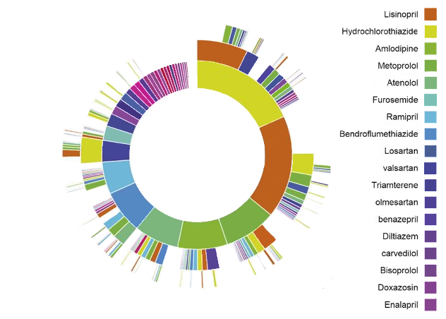
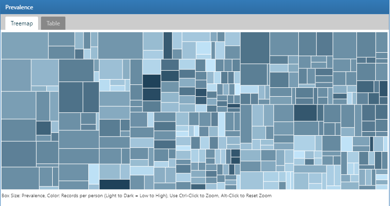
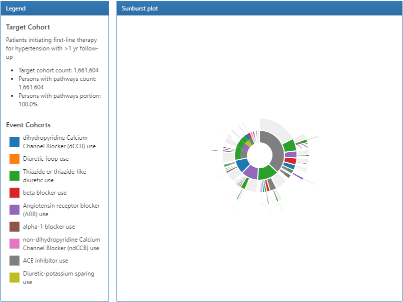

# 特性評価 {#Characterization}

*著者: Anthony Sena & Daniel Prieto-Alhambra*

観察医療データベースは、さまざまな特徴に基づいて人口の変動を理解するための貴重なリソースを提供します。記述統計を用いて集団の特性を把握することは、健康および疾患の決定要因に関する仮説を生成するための重要な第一歩です。本章では特性評価の方法について説明します：

-   **データベースの特性評価**：データベース全体のデータプロファイルを理解するための上位レベルの要約統計を提供する。
-   **コホート特性評価**：集団をその累積的な医療履歴に基づいて記述する。
-   **治療経路**：特定の期間に受けた介入の順序を記述する。
-   **発生率**：リスク時間中の集団におけるアウトカムの発生率を測定する。

データベースの特性評価を除き、これらの方法は「インデックス日」と呼ばれるイベントに対して集団を記述することを目的としています。この関心集団は、第 \@ref(Cohorts)章で説明されているコホートとして定義されます。コホートは関心集団内の各人のインデックス日を定義します。インデックス日をアンカーとして、インデックス日の前の時間を**ベースライン時間**と定義し、インデックス日以降のすべての時間を**ポストインデックス時間**と呼びます。

特性評価のユースケースには、疾病の自然経過、治療の利用状況、品質向上が含まれます。本章では特性評価の方法を説明します。高血圧患者の集団を用いて、ATLASとRを使用してこれらの特性評価タスクを実行する方法を示します。\index{characterization} \index{cohort characterization|see {characterization!cohort}} \index{baseline time} \index{post-index time} \index{index date} \index{disease natural history|see {characterization}} \index{treatment utilization|see {characterization}} \index{quality improvement|see {characterization}}

## データベースレベルの特性評価

関心集団についての特性評価の質問に答える前に、使用するデータベースの特性をまず理解する必要があります。データベースレベルの特性評価は、データベース全体をその時間的傾向および分布に関して記述することを目指します。この定量的評価は通常、以下のような質問を含みます：

-   このデータベースには全体で何人が含まれていますか？
-   各人の年齢分布はどうなっていますか？
-   このデータベースで観察されている期間はどれくらいですか？
-   時間の経過とともに{治療、コンディション、プロシージャー（処置）など}が記録・処方された人の割合はどれくらいですか？

これらのデータベースレベルの記述統計は、研究者がデータベースに欠けている可能性のあるデータを理解するのにも役立ちます。章 \@ref(DataQuality)では、データの品質についてさらに詳しく説明します。 \index{characterization!database level}

## コホート特性評価

コホート特性評価は、コホート内の人々のベースラインおよびポストインデックスの特徴を記述します。OHDSIは、個人の履歴に存在するすべての状態、薬剤およびデバイスの曝露、プロシージャーおよびその他の臨床観察の記述統計を通じて特徴を分析します。また、インデックス日時点でのコホートメンバーの社会人口学的特性を要約します。このアプローチは関心集団の完全な要約を提供します。重要なことに、これはデータの変動に目を向けながら、欠損値を特定する可能性を考慮したコホートの完全な探索を可能にします。

コホート特性評価の方法は、特定の治療を受けている人々における適応および禁忌の有病率を推定するための個人レベルの薬剤使用研究（DUS）に使用できます。このコホート特性評価の普及は、観察研究における推奨されるベストプラクティスであり、Strengthening the Reporting of Observation Studies in Epidemiology（STROBE）ガイドラインで詳述されています [@VONELM2008344]。\index{characterization!cohort} \index{descriptive statistics|see {characterization}} \index{drug utilization}

## 治療経路

集団の特性を評価する他の方法としては、インデックス後の期間における治療シーケンスを記述することが挙げられます。たとえば、@Hripcsak7329 は、OHDSIの共通データ標準を利用して、2型糖尿病、高血圧および抑うつ症に対する治療経路を特性づける記述統計を作成しました。この分析アプローチを標準化することにより、Hripcsakおよび同僚は、同じ分析をOHDSIネットワーク全体で実行して、これらの関心集団の特徴を記述することができました。 \index{characterization!treatment pathways} \index{treatment pathways|see {characterization!treatment pathways}} \index{cohort pathways|see {characterization!treatment pathways}}

経路分析は、特定のコンディションを診断された人々が最初の薬剤処方/供給から受けた治療（イベント）を要約することを目的としています。この研究では、治療はそれぞれ2型糖尿病、高血圧および抑うつ症の診断後に記述されました。その後、各個人のイベントは集計され、各コンディションおよび各データベースに対して要約統計として視覚化されました。

```{r treatmentPathwaysSunburstDataViz, fig.cap='高血圧のためのOHDSI治療経路「サンバースト」グラフ', echo=FALSE, out.width='100%', fig.align='center'}

```

例として、図 \@ref(fig:treatmentPathwaysSunburstDataViz) は高血圧治療を開始する集団を表しています。中央にある最初のリングは、第一選択治療に基づいた人々の割合を示しています。この例では、Hydorochlorothiazideがこの集団で最も一般的な最初の治療法です。Hydorochlorothiazideのセクションから延びるボックスは、コホート内の人々に記録された2番目および3番目の治療法を示しています。

経路分析は、集団における治療利用に関する重要なエビデンスを提供します。この分析から、最初の治療法として最も一般的に利用される第一選択治療、治療を中止する人の割合、治療を変える人、または治療を強化する人の割合を記述することができます。経路分析を使用して、@Hripcsak7329 はメトホルミンが糖尿病治療のために最も一般的に処方されている薬剤であることを発見し、そこで米国内分泌学会の糖尿病治療アルゴリズムの第一選択推奨が一般的に採用されていることが確認されました。さらに、糖尿病患者の10%、高血圧患者の24%、抑うつ患者の11%が、いずれのデータソースにも共有されていない治療経路をたどっていたことが明らかになりました。

従来のDUS（薬剤使用研究）用語では、治療経路分析は、指定された集団における一つまたは複数の薬剤の使用の普及率などの集団レベルのDUS推定値および持続性やさまざまな治療法間の切り替えの測定などの個人レベルのDUSを含みます。

## 発生率

発生率および割合は、時間の経過とともに人口における新しいアウトカムの発生を評価するための公衆衛生の統計です。図 \@ref(fig:incidenceTimeline) は、単一の人に対する発生率の計算コンポーネントを示すことを目的としています： \index{incidence}

```{r incidenceTimeline, fig.cap='発生率計算コンポーネントの人単位のビュー。この例では、リスク時間はコホート開始の翌日に始まり、コホート終了時に終了します。',echo=FALSE, out.width='100%', fig.align='center'}
knitr::include_graphics("images/Characterization/incidenceTimeline.png")
```

図 \@ref(fig:incidenceTimeline) では、人がデータで観察される期間が観察開始と終了時間によって示されています。次に、個人がいくつかの適格基準を満たしてコホートに入る時点と出る時点があります。リスク時間ウィンドウは、アウトカムの発生を理解しようとする期間を示しています。アウトカムがリスク時間内に発生した場合、それをアウトカムの発生としてカウントします。

発生率を計算するための2つの尺度があります：

$$
発生割合 = \frac{\#\;リスク時間中に新しいアウトカムが発生したコホート内の人数}{\#\;リスク時間を持つコホート内の人数}
$$

発生割合は、リスク時間中に集団内で発生した新しいアウトカムの割合を提供します。別の言い方をすると、これは定義された時間枠内で関心集団内でアウトカムを得た割合を示します。\index{incidence!proportion}

$$
発生率 = \frac{\#\;リスク時間中に新しいアウトカムが発生したコホート内の人数}{コホート内の人々によって提供されたリスク時間の人年}
$$

発生率は、集団の累積的なリスク時間内で新しいアウトカムの数を測定する尺度です。リスク時間中にある人がアウトカムを経験した場合、その人のリスク時間への寄与はアウトカムの発生時点で停止します。累積的なリスク時間は**人年**と呼ばれ、日、月または年単位で表現されます。\index{incidence!rate} \index{person-time}

治療に対して計算される場合、発生割合および発生率は、特定の治療の使用の集団レベルのDUSの古典的な尺度です。

## 高血圧患者の特性評価

世界保健機関（WHO）の高血圧に関するグローバル概要 [@WHOHypertension] によると、高血圧の早期発見、適切な治療、および良好な管理には、健康上および経済上の大きな利益が伴います。WHOの概要は、高血圧についての概観を提供し、各国における疾病の負担の特性を評価しています。WHOは、地理的地域、社会経済的クラス、および性別に関する高血圧の記述統計を提供しています。

観察研究のデータソースは、WHOが行ったように高血圧患者集団の特性を評価する方法を提供します。本章の後のセクションでは、ATLASおよびRを使用してデータベースを探索し、高血圧患者集団を研究するためのその構成を理解する方法を探ります。その後、これらのツールを使用して、高血圧患者集団の自然経過および治療パターンを記述します。

## ATLASにおけるデータベースの特性評価

ここでは、[ACHILLES](https://github.com/OHDSI/Achilles) を使用して作成されたデータベース特性評価統計を調査するために、ATLASのデータソースモジュールを使用する方法を示します。まず、ATLASの左バーで  をクリックして開始します。ATLASに表示される最初のドロップダウンリストで、調査するデータベースを選択します。次に、データベースの下のドロップダウンを使用してレポートを探索し始めます。これを行うには、レポートドロップダウンリストから「Condition Occurrence」を選択し、データベースに存在するすべての症状のツリーマップ表示が現れます：

```{r atlasDataSourcesConditionTreemap, fig.cap='ATLASデータソース: コンディション出現のツリーマップ',echo=FALSE, out.width='100%', fig.align='center'}

```

特定の関心のある症状を検索するには、テーブルタブをクリックして、データベース内のすべてのコンディションのリストを表示し、個人の数、発生率、および個人ごとのレコード数を確認します。上部のフィルターボックスを使用して、コンセプト名に "hypertension (高血圧)" を含む項目に基づいてリストをフィルタリングできます：

```{r atlasDataSourcesConditionFiltered, fig.cap='ATLASデータソース: コンセプト名に "hypertension (高血圧)" が含まれるコンディション',echo=FALSE, out.width='100%', fig.align='center'}
knitr::include_graphics("images/Characterization/atlasDataSourcesConditionFiltered.png")
```

特定の症状の詳細なドリルダウンレポートを表示するには、行をクリックします。この場合、"essential hypertension (本態性高血圧)" を選択して、選択されたコンディションの時系列および性別毎の傾向、月別の有病率、記録された病型、および診断の初回発生時の年齢の分布を確認します：

```{r atlasDataSourcesDrillDownReport, fig.cap='ATLASデータソース: 本態性高血圧ドリルダウンレポート',echo=FALSE, out.width='100%', fig.align='center'}
knitr::include_graphics("images/Characterization/atlasDataSourcesDrillDownReport.png")
```

高血圧コンセプトの存在および時間の経過に伴う傾向についてデータベースの特性を確認した後、高血圧患者の治療に使用される薬剤を調査することもできます。これを行うには、同じ手順に従い、RxNormの成分に要約された薬剤の特性を確認するために "Drug Era (薬剤曝露期間)" レポートを使用します。興味のある項目をレビューするためにデータベース特性を探索した後、高血圧者を特性化するためのコホートの構築を進める準備が整います。

## ATLASにおけるコホート特性分析

ここでは、ATLASを使用して複数のコホートの大規模な特性評価を行う方法を示します。左側のバーにあるをクリックし、新しい特性評価を作成します。分析に名前を付け、ボタンを使用して保存します。

### デザイン

特性評価には、少なくとも1つのコホートと少なくとも1つの特性が必要です。この例では、2つのコホートを使用します。最初のコホートでは、その前の1年間に少なくとも1つの高血圧診断を受けた人々をインデックス日と定義します。また、このコホートに属する人々が治療開始後少なくとも1年間観察期間を持つことが必要です（付録 \@ref(HTN1yrFO)）。2つ目のコホートは、最初のコホートと同様ですが、1年間の代わりに少なくとも3年間の観察期間を必要とします（付録 \@ref(HTN3yrFO)）。

#### コホート定義 {.unnumbered}

```{r atlasCharacterizationCohortSelection, fig.cap='特性設計タブ - コホート定義の選択',echo=FALSE, out.width='100%', fig.align='center'}
knitr::include_graphics("images/Characterization/atlasCharacterizationCohortSelection.png")
```

コホートは既にATLASで作成されていると仮定しています（第 \@ref(Cohorts) 章を参照）。をクリックし、図 \@ref(fig:atlasCharacterizationCohortSelection) に示すようにコホートを選択します。次に、これらのコホートを特性評価するために使用する特性を定義します。

#### 特性選択 {.unnumbered}

ATLASにはOMOP CDMにモデル化された臨床ドメイン全体で特性評価を行うための約100のプリセット特性評価が付属しており、各ターゲットコホートに対して臨床観察の集約および要約機能を提供します。これらの計算は、コホートのベースラインおよびポストインデックス特性を説明するための潜在的に数千の特性を提供します。ATLASは、各コホートの特性評価を行うために、OHDSIのFeatureExtraction Rパッケージを利用しています。次のセクションでは、FeatureExtractionとRの使用について詳しく説明します。\index{feature analyses}

をクリックして、特性を選択します。以下は、これらのコホートを特性評価するために使用する特性のリストです：

```{r atlasCharacterizationFeatureSelection, fig.cap='特性設計タブ - 特性選択',echo=FALSE, out.width='100%', fig.align='center'}
knitr::include_graphics("images/Characterization/atlasCharacterizationFeatureSelection.png")
```

上図は、説明と共に選択された特性のリストを示しています。名前が"Demographics (人口動態的特性)"で始まる特性は、コホート開始日における各人の人口統計情報を計算します。ドメイン名（例：ビジット、プロシージャー、コンディション、薬剤など）で始まる特性は、そのドメインにおけるすべての記録された観察を特性評価します。各ドメイン特性には4つの選択肢があります：

-   **Any time prior**: コホート開始前のすべての利用可能な時間を使用します。
-   **Long term**: コホート開始日までの365日。
-   **Medium term**: コホート開始日までの180日。
-   **Short term**: コホート開始日までの30日。

#### サブグループ分析 {.unnumbered}

性別に基づいて異なる特性を作成したい場合、「サブグループ分析」セクションを使用して、新しい興味のあるサブグループを定義し特性評価に使用できます。

サブグループを作成するには、をクリックし、サブグループメンバーシップのための基準を追加します。このステップは、コホート登録を識別するために使用される基準と似ています。この例では、コホート内の女性を識別するための基準を定義します：

```{r atlasCharacterizationSubgroup, fig.cap='特性評価の設計 - 女性サブグループ分析',echo=FALSE, out.width='100%', fig.align='center'}
knitr::include_graphics("images/Characterization/atlasCharacterizationSubgroup.png")
```

```{block2, type='rmdimportant'}
ATLASのサブグループ分析は階層とは異なります。階層は相互に排他的ですが、サブグループは選択された基準に基づいて同じ人を含む場合があります。

```

### 実行

特性評価のデザインが完了したら、環境内の1つ以上のデータベースに対してこのデザインを実行できます。実行タブに移動し、Generateボタンをクリックしてデータベースで分析を開始します：

```{r atlasCharacterizationExecutions, fig.cap='特性評価設計の実行 - CDMソース選択',echo=FALSE, out.width='100%', fig.align='center'}
knitr::include_graphics("images/Characterization/atlasCharacterizationExecutions.png")
```

分析が完了したら、"All Executions (すべてを実行)" ボタンをクリックしてレポートを表示し、実行リストから "View Reports (レポートを見る)" を選択します。あるいは、"View latest result (最新の結果を見る)" をクリックして、最後に実行されたアウトカムを表示することもできます。

### 結果

```{r atlasCharacterizationResultsSummary, fig.cap='特性アウトカム - 過去1年間の疾患発生',echo=FALSE, out.width='100%', fig.align='center'}
knitr::include_graphics("images/Characterization/atlasCharacterizationResultsSummary.png")
```

結果は、選択された各コホートの異なる特性の表形式のビューを提供します。図 \@ref(fig:atlasCharacterizationResultsSummary) では、コホート開始日の前の365日間に存在するすべての条件の概要が提供されています。各共変量には、コホートごとおよび定義した女性サブグループごとのカウントと割合が表示されています。

検索ボックスを使用してアウトカムをフィルタリングし、「不整脈」が履歴にある人々の割合を確認することで、集団でどのような心血管関連診断が観察されるかを理解しようとしました。「Explore」リンクをクリックして新しいウィンドウを開き、単一コホートのコンセプトに関する詳細を表示します（図 \@ref(fig:atlasCharacterizationResultsExplore) 参照）。

```{r atlasCharacterizationResultsExplore, fig.cap='特性アウトカム - 単一コンセプトの探索',echo=FALSE, out.width='100%', fig.align='center'}
knitr::include_graphics("images/Characterization/atlasCharacterizationResultsExplore.png")
```

コホートのすべての条件コンセプトを特性評価したので、"explore (探索する)" オプションを使用して、選択されたコンセプト（この場合は心房細動）のすべての大元および下位層に含まれるコンセプトのビューを有効にします。この探索により、高血圧のある人々に現れる可能性のある他の心疾患を探索するためにコンセプトの階層をナビゲートすることができます。要約ビューと同様に、カウントと割合が表示されます。

この特性アウトカムを使用して、高血圧治療に禁忌のある条件（例：血管浮腫）を見つけることもできます。これを行うには、上記と同じ手順を実行しますが、今回は "edema (浮腫)" を検索します（図 \@ref(fig:atlasCharacterizationResultsContra) を参照）。

```{r atlasCharacterizationResultsContra, fig.cap='特性評価の結果 - 禁忌条件の探索',echo=FALSE, out.width='100%', fig.align='center'}
knitr::include_graphics("images/Characterization/atlasCharacterizationResultsContra.png")
```

再度、"explore (探索する)"機能を使用して、高血圧集団における浮腫の特性を見て血管浮腫の有病率を見つけます：

```{r atlasCharacterizationResultsContraExplore, fig.cap='特性アウトカム - 禁忌条件の詳細を探索',echo=FALSE, out.width='100%', fig.align='center'}
knitr::include_graphics("images/Characterization/atlasCharacterizationResultsContraExplore.png")
```

ここでは、降圧薬を開始する前の1年に血管浮腫の記録がある集団の一部が見つかりました。

```{r atlasCharacterizationResultsContinuous, fig.cap='各コホートとサブグループの年齢特性アウトカム',echo=FALSE, out.width='100%', fig.align='center'}
knitr::include_graphics("images/Characterization/atlasCharacterizationResultsContinuous.png")
```

ドメイン共変量は、コホート開始前の時間枠にコードの記録が存在したかどうかを示す二元指標を使用して計算されますが、一部の変数はコホート開始時の年齢のように連続変数として提供されます。上の例では、カウント、平均年齢、中央値、標準偏差といった形で表現された2つのコホートの年齢を示しています。

### カスタム特性の定義

プリセット特性に加えて、ATLASはユーザー定義のカスタム特性をサポートしています。これを行うには、左側のメニューの**Characterization**をクリックし、**Feature Analysis**タブをクリックして、**New Feature Analysis**ボタンをクリックします。カスタム特性に名前を付け、ボタンを使用して保存します。\index{ATLAS!characterization features}

この例では、ACE阻害剤の薬歴がコホート開始後にあるコホート内の人数を特定するカスタム特性を定義します：

```{r atlasCharacterizationCustomFeature, fig.cap='ATLASでのカスタム特性定義',echo=FALSE, out.width='100%', fig.align='center'}
knitr::include_graphics("images/Characterization/atlasCharacterizationCustomFeature.png")
```

上で定義した基準は、コホート開始日に適用されることを前提としています。基準を定義して保存したら、前のセクションで作成した特性設計にこの基準を適用できます。特性評価デザインを開き、Feature Analysisセクションに移動します。ボタンをクリックし、メニューから新しいカスタムフィーチャーを選択します。これで、特性評価デザインのフィーチャーリストに表示されます。前述のように、このデザインをデータベースに対して実行して、このカスタムフィーチャーの特性分析を生成することができます：

```{r atlasCharacterizationCustomFeatureResults, fig.cap='カスタムフィーチャーの結果表示',echo=FALSE, out.width='100%', fig.align='center'}
knitr::include_graphics("images/Characterization/atlasCharacterizationCustomFeatureResults.png")
```

## Rでのコホートの特性評価

私たちはRを使用してコホートをの特性を評価することもできます。このセクションでは、OHDSI RパッケージであるFeatureExtractionを使用して、高血圧コホートのベースライン機能（共変量）を生成する方法について説明します。FeatureExtractionは、3つの方法で共変量を構築する機能を提供します。 \index{FeatureExtraction}

-   デフォルトの共変量セットを選択する
-   事前に指定された分析セットから選択する
-   カスタム分析セットを作成する

FeatureExtractionは、個人ベースの特徴と集計された特徴の2つの異なる方法で共変量を作成します。個人ベースの特徴は機械学習アプリケーションで有用です。この章では、興味のあるコホートを説明するためのベースライン共変量を生成するために有用な集計された特徴の使用に焦点を当てます。さらに、事前に指定された分析とカスタム分析という2つの方法で共変量を構築する方法に焦点を当て、デフォルトのセットを使用する方法は読者への課題とします。

### コホートのインスタンス化

最初に、特性を評価するためにコホートをインスタンス化する必要があります。コホートのインスタンス化は、第 \@ref(Cohorts) 章で説明されています。この例では、高血圧に対して一次治療を開始し、1年間のフォローアップを行う人々を使用します（付録 \@ref(HTN1yrFO)）。他のコホートの特性評価は付録 \@ref(CohortDefinitions)として残します。コホートが`scratch.my_cohorts`というテーブルにコホート定義IDが1で生成されていることを仮定します。

### データ抽出

まず、Rにサーバーへの接続方法を指示する必要があります。FeatureExtractionはDatabaseConnectorパッケージを使用し、`createConnectionDetails`という関数を提供します。さまざまなデータベース管理システム（DBMS）に必要な特定の設定については、`?createConnectionDetails`を参照してください。例えば、次のコードでPostgreSQLデータベースに接続できます：

```{r tidy=FALSE,eval=FALSE}
library(FeatureExtraction)
connDetails <- createConnectionDetails(dbms = "postgresql",
                                       server = "localhost/ohdsi",
                                       user = "joe",
                                       password = "supersecret")

cdmDbSchema <- "my_cdm_data"
cohortsDbSchema <- "scratch"
cohortsDbTable <- "my_cohorts"
cdmVersion <- "5"
```

最後の4行は、`cdmDbSchema`、`cohortsDbSchema`、`cohortsDbTable`変数、およびCDMバージョンを定義します。これらを使用して、CDM形式のデータがどこにあるか、興味のあるコホートがどこに作成されたか、および使用されるCDMバージョンをRに通知します。Microsoft SQL Serverの場合、データベーススキーマはデータベースとスキーマの両方を指定する必要があることに注意してください。したがって、例えば`cdmDbSchema <- "my_cdm_data.dbo"`となります。

### 事前に指定された分析の使用

`createCovariateSettings`関数は、ユーザーが多くの定義済みの共変量から選択できるようにします。利用可能なオプションの概要については、`?createCovariateSettings`を参照してください。例を示します：

```{r tidy=FALSE,eval=FALSE}
settings <- createCovariateSettings(
  useDemographicsGender = TRUE,
  useDemographicsAgeGroup = TRUE,
  useConditionOccurrenceAnyTimePrior = TRUE)
```

これにより、性別、年齢（5年ごとの年齢グループ）、およびコホート開始日までの期間に観察された各コンセプトについての二進共変量が作成されます。

多くの事前に指定された分析は、短期、中期、長期の時間枠を参照しています。デフォルトでは、これらの枠は次のように定義されています：

-   **長期**: コホート開始日を含む365日前まで
-   **中期**: コホート開始日を含む180日前まで
-   **短期**: コホート開始日を含む30日前まで

ただし、ユーザーはこれらの値を変更できます。例を示します：

```{r tidy=FALSE,eval=FALSE}
settings <- createCovariateSettings(useConditionEraLongTerm = TRUE,
                                    useConditionEraShortTerm = TRUE,
                                    useDrugEraLongTerm = TRUE,
                                    useDrugEraShortTerm = TRUE,
                                    longTermStartDays = -180,
                                    shortTermStartDays = -14,
                                    endDays = -1)
```

これにより、長期の枠はコホート開始日を含まない180日前まで、短期の枠はコホート開始日を含まない14日前までに再定義されます。

また、どのコンセプトIDを使用するかしないかを指定することもできます：

```{r tidy=FALSE,eval=FALSE}
settings <- createCovariateSettings(useConditionEraLongTerm = TRUE,
                                    useConditionEraShortTerm = TRUE,
                                    useDrugEraLongTerm = TRUE,
                                    useDrugEraShortTerm = TRUE,
                                    longTermStartDays = -180,
                                    shortTermStartDays = -14,
                                    endDays = -1,
                                    excludedCovariateConceptIds = 1124300,
                                    addDescendantsToExclude = TRUE,
                                    aggregated = TRUE)
```

```{block2, type='rmdimportant'}
上記すべての例について、「aggregated = TRUE」の使用は、FeatureExtractionに要約統計を提供することを指示します。このフラグを除外すると、コホート内の各個人の共変量が計算されます。
```

### 集計された共変量の作成

次のコードブロックは、コホートの集計統計を生成します：

```{r tidy=FALSE,eval=FALSE}
covariateSettings <- createDefaultCovariateSettings()

covariateData2 <- getDbCovariateData(
  connectionDetails = connectionDetails,
  cdmDatabaseSchema = cdmDatabaseSchema,
  cohortDatabaseSchema = resultsDatabaseSchema,
  cohortTable = "cohorts_of_interest",
  cohortId = 1,
  covariateSettings = covariateSettings,
  aggregated = TRUE)

summary(covariateData2)
```

出力は次のようになります：

```         
## CovariateData Object Summary
##
## Number of Covariates: 41330
## Number of Non-Zero Covariate Values: 41330
```

### 出力形式

集計された`covariateData`オブジェクトの主なコンポーネントは、二値および連続的な共変量に対してそれぞれ`covariates`および`covariatesContinuous`です：

```{r tidy=FALSE,eval=FALSE}
covariateData2$covariates
covariateData2$covariatesContinuous
```

### カスタム共変量

FeatureExtractionは、カスタム共変量を定義および利用する能力も提供します。これについての詳細は高度なトピックであり、ユーザードキュメントに記載されています：<http://ohdsi.github.io/FeatureExtraction/>

## ATLASにおけるコホート経路分析

経路分析の目標は、1つ以上の興味のあるコホート内で治療がどのように順序づけられているかを理解することです。適用される方法は @Hripcsak7329 によって報告された設計に基づいています。これらの方法は一般化され、ATLASのCohort Pathwaysという機能に組み込まれました。

コホート経路の目的は、1つ以上のターゲットコホートのコホート開始日以降のイベントを要約する分析機能を提供することです。そのために、対象となる人口の臨床イベントを特定するためのイベントコホートと呼ばれるコホートセットを作成します。これがターゲットコホート内の人物に対してどのように見えるかを例として示します。

```{r pathwaysPersonEventView, fig.cap='単一の人物におけるパスウェイ分析の文脈',echo=FALSE, out.width='100%', fig.align='center'}
knitr::include_graphics("images/Characterization/pathwaysPersonEventView.png")
```

図 \@ref(fig:pathwaysPersonEventView) では、その人物が開始日と終了日が定義されたターゲットコホートの一部であることを示しています。その後、番号付きの線分は、その人物が特定の期間、イベントコホートとしても特定される場所を示しています。イベントコホートは、CDMに表された任意の臨床イベントを記述することができるため、単一のドメインまたはコンセプトに対してパスウェイを作成する必要はありません。

まず、ATLASの左側のバーで  をクリックして、新しいコホートパスウェイスタディを作成します。説明的な名前を提供し、保存ボタンを押します。

### デザイン

まず、1年および3年のフォローアップ付きの高血圧の初回治療を開始するコホートを引き続き使用します（付録 \@ref(HTN1yrFO)、 \@ref(HTN3yrFO)）。ボタンを使用して2つのコホートをインポートします。

```{r atlasPathwaysTargetCohorts, fig.cap='ターゲットコホートを選択したパスウェイ分析',echo=FALSE, out.width='100%', fig.align='center'}
knitr::include_graphics("images/Characterization/atlasPathwaysTargetCohorts.png")
```

次に、興味のある各第一選択の降圧薬のイベントコホートを作成して、イベントコホートを定義します。まず、ACE阻害剤の使用者のコホートを作成し、コホートの終了日を継続曝露の終了日と定義します。同様に他の8つの降圧薬のコホートも作成し、これらの定義は付録 \@ref(ACEiUse) － \@ref(A1BUse) に記載してあります。完了したら、 ボタンを使用して、これらを経路デザインのイベントコホートセクションにインポートします。

```{r atlasPathwaysEventCohorts, fig.cap='初回第一選択降圧治療を開始するためのイベントコホート',echo=FALSE, out.width='100%', fig.align='center'}
knitr::include_graphics("images/Characterization/atlasPathwaysEventCohorts.png")
```

完了すると、デザインは上記のようになるはずです。次に、いくつかの追加の分析設定を決定する必要があります：

-   **組み合わせウィンドウ**: この設定では、イベント間の重複がイベントの組み合わせと見なされる日数の期間を定義できます。たとえば、2つのイベントコホート（イベントコホート1およびイベントコホート2）で表される2つの薬剤が組み合わせウィンドウ内で重複する場合、パスウェイアルゴリズムはそれらを「イベントコホート1 + イベントコホート2」として組み合わせます。
-   **最小セル数**: この数未満の人数のイベントコホートは、プライバシーを保護するために出力から除外されます。
-   **最大経路長**: 分析の対象となる一連のイベントの最大数を指します。

### 実行

パスウェイ分析のデザインが完了すると、環境内の1つ以上のデータベースに対してこのデザインを実行できます。これは、ATLASでのコホートの特性評価で説明したのと同じ方法で機能します。完了したら、分析アウトカムを確認できます。

### 結果の表示

```{r atlasPathwaysResults, fig.cap='経路アウトカムの凡例とサンバースト図',echo=FALSE, out.width='100%', fig.align='center'}

```

パスウェイ分析のアウトカムは3つのセクションに分かれています：凡例セクションでは、ターゲットコホートの総人数と、パスウェイ分析で1つ以上のイベントがあった人数が表示されます。その下には、サンバーストプロットの中央セクションに表示される各コホートのカラーコードが表示されます。

サンバースト図は、時間の経過に伴うさまざまなイベントパスウェイを表すビジュアライゼーションです。プロットの中心はコホートのエントリを表しており、最初のカラーディングは各イベントコホートにいる人々の割合を示しています。例では、円の中心は一線級治療を開始した高血圧者を示しています。その後、サンバースト図の最初のリングは、イベントコホート（例えば、ACE阻害剤、アンジオテンシン受容体遮断剤など）で定義された一線級治療を開始した人々の割合を示します。次のリングセットは、特定のイベントシーケンスにおいて2番目のイベントコホートを示します。データ内で2番目のイベントコホートが観察されない人々の割合は、リングの灰色の部分で表されます。

```{r atlasPathwaysResultsPathDetails, fig.cap='経路の詳細を表示するパスウェイアウトカム',echo=FALSE, out.width='100%', fig.align='center'}
knitr::include_graphics("images/Characterization/atlasPathwaysResultsPathDetails.png")
```

サンバーストプロットのセクションをクリックすると、右側に経路の詳細が表示されます。ここでは、ターゲットコホート内の最も多くの人々がACE阻害剤で一線級治療を開始し、そのグループから少数の人々がチアジド系利尿薬を開始していることがわかります。

## ATLAS における発生率分析

発生率計算では、ターゲットコホート内の人々のうち、リスク期間中にアウトカムコホートを経験した人を記述します。ここでは、ACE阻害薬 (ACEi) およびサイアザイドおよびサイアザイド様利尿薬 (THZ) の新規ユーザーにおける血管浮腫 (Angioedema) および急性心筋梗塞 (AMI) のアウトカムの特性を評価するための発生率分析を設計します。これらのアウトカムを、薬剤に曝露されている期間 (TAR) 中に評価します。さらに、ターゲットコホート (ACEi および THZ) への曝露中に新規のアンジオテンシン受容体拮抗薬 (ARB) 使用の発生率を測定するために、ARB の使用アウトカムを追加します。このアウトカム定義は、ターゲット集団の中で ARB の利用方法を理解するためのものです。

始めるには、ATLAS の左バーにある  をクリックして新しい発生率分析を作成します。説明的な名前を提供し、保存ボタン  を押します。

### デザイン

本例で使用されるコホートは、既に ATLAS に作成されていると仮定します (第 \@ref(Cohorts) 章 で説明)。付録には、ターゲットコホート (付録 \@ref(AceInhibitorsMono)、\@ref(ThiazidesMono)) およびアウトカムコホート (付録 \@ref(Angioedema)、 \@ref(Ami)、 \@ref(ARBUse)) の完全な定義が提供されています。

```{r atlasIncidenceCohortSelection, fig.cap='ターゲットおよびアウトカム定義の発生率',echo=FALSE, out.width='100%', fig.align='center'}
knitr::include_graphics("images/Characterization/atlasIncidenceCohortSelection.png")
```

定義タブで、 *New users of ACE inhibitors (ACE阻害薬の新規ユーザー)* コホートと *New users of Thiazide or Thiazide-like diuretics (サイアザイドまたはサイアザイド様利尿薬の新規ユーザー)* コホートを選択します。ダイアログを閉じて、これらのコホートが設計に追加されたことを確認します。次に、アウトカムコホートを追加するためにクリックし、ダイアログボックスから *acute myocardial infarction events　(急性心筋梗塞イベント)* 、 *angioedema events* 、および *Angiotensin receptor blocker (ARB) use (アンジオテンシン受容体拮抗薬 (ARB) の新規ユーザー)* のアウトカムコホートを選択します。再びウィンドウを閉じて、これらのコホートが設計のアウトカムコホートセクションに追加されたことを確認します。

```{r atlasIncidenceTimeAtRisk, fig.cap='ターゲットおよびアウトカム定義の発生率',echo=FALSE, out.width='100%', fig.align='center'}
knitr::include_graphics("images/Characterization/atlasIncidenceTimeAtRisk.png")
```

次に、分析のリスク時間枠を定義します。上に示すように、リスク時間枠はコホートの開始日および終了日と相対しています。ここでは、ターゲットコホートの開始日の翌日をリスク時間枠の開始として定義します。次に、リスク時間枠をコホートの終了日に終了するよう定義します。この場合、ACEi および THZ コホートの定義には、薬剤曝露が終了する時点をコホート終了日としています。

ATLAS では、分析仕様の一部としてターゲットコホートを層化する方法も提供されています:

```{r atlasIncidenceStratifyFemale, fig.cap='女性における発生率の層別定義',echo=FALSE, out.width='100%', fig.align='center'}
knitr::include_graphics("images/Characterization/atlasIncidenceStratifyFemale.png")
```

これを行うには、[New Stratify Criteria] ボタンをクリックし、第 11 章で説明されている手順に従います。設計が完了したので、一つ以上のデータベースに対して設計を実行に移ることができます。

### 実行

[生成] タブをクリックし、  ボタンをクリックして、分析を実行するデータベースの一覧を表示します:

```{r atlasIncidenceSourceSelection, fig.cap='発生率分析実行',echo=FALSE, out.width='100%', fig.align='center'}
knitr::include_graphics("images/Characterization/atlasIncidenceSourceSelection.png")
```

一つ以上のデータベースを選択し、[生成] ボタンをクリックして、設計で指定されたターゲットとアウトカムのすべての組み合わせを分析するために分析を開始します。

### 結果の表示

生成タブでは、画面の上部でターゲットおよびアウトカムを選択してアウトカムを表示することができます。このすぐ下には、分析で使用された各データベースの発生率のサマリーが表示されます。

それらのドロップダウンリストから ACEi 使用者のターゲットコホートと急性心筋梗塞 (AMI) を選択します。 ボタンをクリックして発生率分析のアウトカムを表示します:

```{r atlasIncidenceResults, fig.cap='発生率分析の出力 - AMI のアウトカムを持つ新規 ACEi 使用者',echo=FALSE, out.width='100%', fig.align='center'}
knitr::include_graphics("images/Characterization/atlasIncidenceResults.png")
```

データベースの要約は、TAR 期間中に観察されたコホート内の総人数と総症例数を示します。割合は 1000人当たりの症例数を示しています。ターゲットコホートのリスク時間は年単位で計算されます。発生率は 1000人年当たりの症例数として表されます。

設計で定義した層の発生率メトリクスも見ることができます。上記のメトリクスは各層についても計算されます。さらに、ツリーマップの視覚化は、それぞれの層が表す割合をボックスエリアとして視覚的に表示します。色は、底部に示されるスケールに沿って発生率を示しています。

ACEi 集団の中で ARB 新規使用の発生率を確認するための同じ情報を収集することができます。画面上部のドロップダウンでアウトカムを ARB 使用に変更し、  ボタンをクリックして詳細を確認します。

```{r atlasIncidenceResultsARB, fig.cap='発生率 - ACEi 曝露中に ARB 処理を受けている新規 ACEi 使用者',echo=FALSE, out.width='100%', fig.align='center'}
knitr::include_graphics("images/Characterization/atlasIncidenceResultsARB.png")
```

示されているように、計算されたメトリクスは同じですが、解釈は異なります。入力 (ARB 使用) が薬剤利用推定を参照しているため、健康アウトカムではありません。

## まとめ

```{block2, type='rmdsummary'}
- OHDSI は、データベース全体または関心のあるコホートの特性を評価するためのツールを提供します。

- コホートの特徴付けは、インデックス日（基準）前およびインデックス日後（ポストインデックス）の期間に関心のあるコホートを記述します。

- ATLAS の特徴付けモジュールおよび OHDSI メソッドライブラリは、複数の時間枠の基準特性を計算する機能を提供します。

- ATLAS の経路および発生率モジュールは、ポストインデックス期間中の記述統計を提供します。


```

## 演習

#### 前提条件 {.unnumbered}

これらの演習には、ATLAS インスタンスへのアクセスが必要です。<http://atlas-demo.ohdsi.org> のインスタンスや、アクセス可能なその他のインスタンスを使用できます。

```{exercise, exerciseCharacterization1}
私たちは、実際の世界でセレコキシブがどのように使用されているかを理解したいと考えています。始めに、この薬剤に関するデータベースの情報を理解したいと考えています。ATLAS のデータソースモジュールを使用して、セレコキシブに関する情報を見つけてください。
```

```{exercise, exerciseCharacterization2}
セレコキシブ使用者の疾患の自然経過をより理解したいと考えています。365 日のウォッシュアウト期間を使用して、セレコキシブの新規使用者の単純なコホートを作成し、このコホートの特性評価を作成し、併存疾患および薬剤曝露を示してください (第 \@ref(Cohorts) 章 に詳細な手順があります)。
```

```{exercise, exerciseCharacterization3}
セレコキシブ処方開始後に消化管出血 (GI 出血) がどのくらいの頻度で発生するのかに興味があります。[192671](http://athena.ohdsi.org/search-terms/terms/192671) ("消化管出血") またはその下位層に含まれるいずれかのコンセプトの発生として単純に定義される GI 出血イベントのコホートを作成します。前の演習で定義した曝露コホートを使用して、セレコキシブ開始後のこれらの GI 出血イベントの発生率を計算してください。
```

提案された解答は 付録 \@ref(Characterizationanswers) に記載されています。
