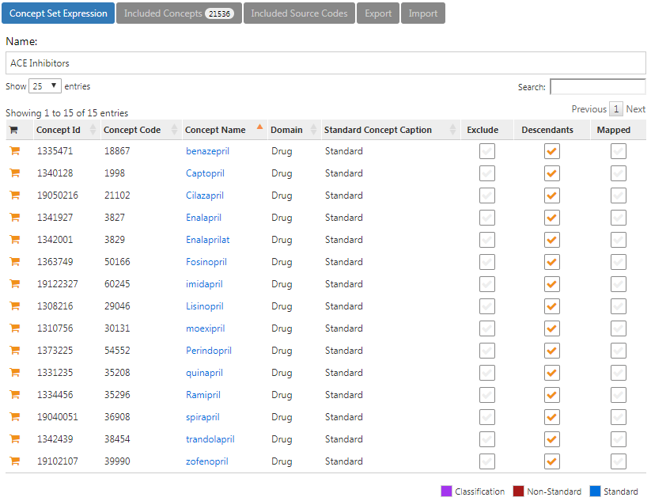
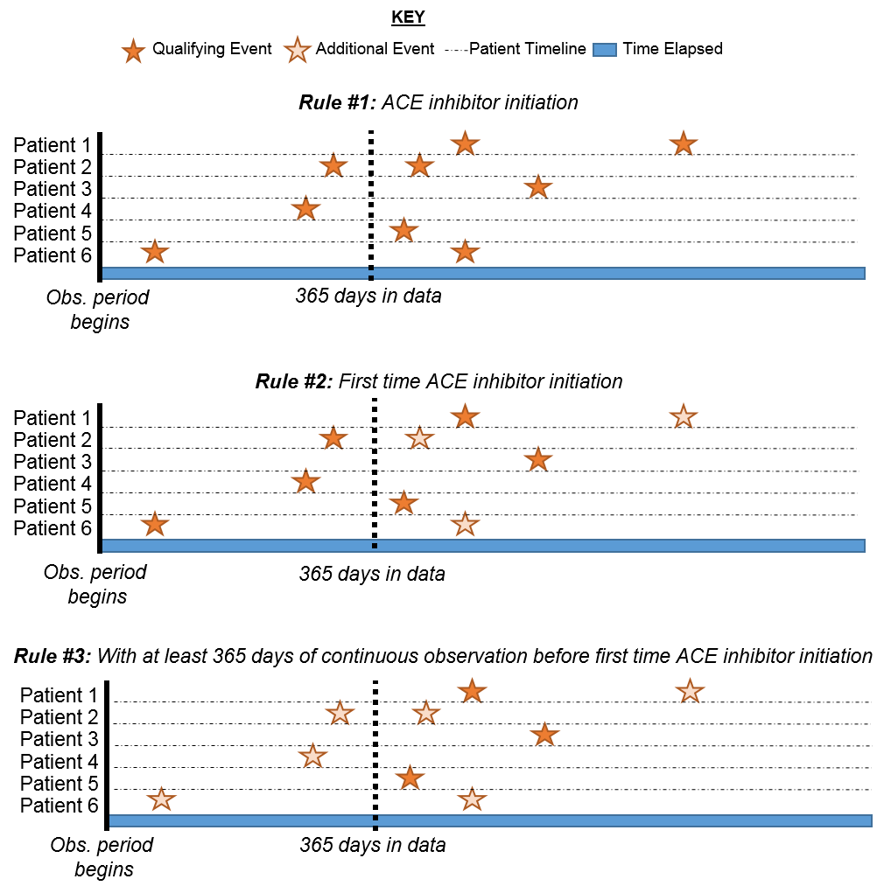
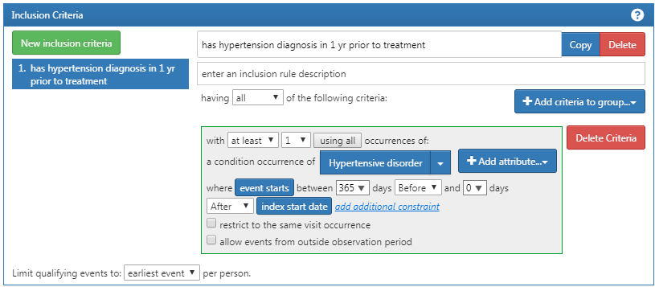

# コホートの定義 {#Cohorts}

*著者: Kristin Kostka*

観察型健康データ（*リアルワールドデータ*とも呼ばれる）は、患者の健康状態や医療の提供に関連するデータで、さまざまな情報源から日常的に収集されたデータです。そのため、OHDSIデータスチュワード（OHDSIの共同研究者のうち、各サイトのデータをCDMで維持している人）は、電子健康記録（EHR）、医療保険請求データ、製品や疾患のレジストリ、在宅環境下を含む患者が生成したデータ、モバイル機器など健康状態に関する情報を提供できるその他の情報源など、複数の情報源からデータを取得することがあります。これらのデータは研究目的で収集されたものではないため、対象としたい臨床データ要素を明確に捉えられていない可能性があります。

例えば、医療保険請求データベースは、ある症状（例：血管性浮腫）に対して提供されたすべての医療を捕捉し、関連費用が適切に払い戻されることを目的として設計されており、実際の症状に関する情報はこの目的の一部としてのみ捕捉されます。このような観察データを研究目的で使用したい場合、*データに記録されているもの*を使用して*本当に興味のあること*を推測するロジックを作成する必要があります。つまり、臨床イベントがどのように発現するかを定義してコホートを作成する必要があるのです。たとえば、保険請求データベースで血管性浮腫イベントを特定したい場合、過去の血管性浮腫の発生に対する経過観察を単に説明する請求とは区別するために、血管性浮腫の診断コードが救急外来の設定で記録されていることを必要とするロジックを定義することが考えられます。同様の考慮事項は、EHRに記録された日常診療中に収集されたデータにも適用される可能性があります。データが二次的な目的で使用されるため、各データベースが本来何を目的として設計されたかを認識する必要があります。研究をデザインするたびに、さまざまな医療環境においてコホートがどのように存在するのか、細かな点を十分に考慮する必要があります。

本章では、コホート定義の作成と共有とは何か、コホートを開発する方法、ATLASまたはSQLを使用して独自のコホートを構築する方法を説明します。

## コホートとは？

OHDSI 研究では、コホートを、ある一定期間に1つ以上の適格基準を満たす人々の集合体と定義しています。この用語は*表現型*という用語とよく置き換えられます。コホートは、OHDSI分析ツールやネットワーク研究全体で研究課題を実行するための主要な構成要素として使用されます。例えば、ACE阻害薬の開始による血管性浮腫のリスクを予測することを目的とした研究では、2つのコホートを定義します：アウトカムコホート（血管性浮腫）と対象コホート（ACE阻害薬の使用を開始する人々）。OHDSIにおけるコホートの重要な特徴は、通常、研究内の他のコホートから独立して定義されるため、再利用が可能であることです。たとえば、血管性浮腫のコホートは対象集団以外も含め、その集団全体のすべての血管性浮腫イベントを特定します。分析時に必要に応じてこれらの二つのコホートの共通部分を抽出します。この利点は、同じ血管性浮腫のコホート定義が、たとえばACE阻害薬と他の曝露を比較する推定研究など、他の分析でも使用できるということです。コホート定義は、研究課題に応じて異なることがあります。

```{block2, type='rmdimportant'}
コホートは、ある一定期間に1つ以上の適格基準を満たす人々の集合体です。

```

\index{コホート} \index{コホート定義} OHDSIで使用されているコホートの定義は、この分野の他の人々が使用するものとは異なるかもしれないことを認識することが重要です。例えば、多くの査読付きの科学論文では、コホートが特定の臨床コードのコードセット（例：ICD-9/ICD-10、NDC、HCPCSなど）に類似しているとされています。コードセットはコホートを組み立てる際の重要な要素ですが、コホートはコードセットによって定義されるわけではありません。コホートは、条件を満たすコードセットの使用方法に関して具体的なロジックが必要となります（例：これはICD-9/ICD-10コードの初回の発生か？それとも発生すべてか？）。 明確に定義されたコホートでは、患者がコホートに組み入れられる方法とコホートから離脱する方法が指定されています。 \index{コードセット}

\index{表現型} OHDSIのコホート定義を利用するためのユニークなニュアンスには以下があります。

-   一人の人が複数のコホートに属する可能性があります
-   一人の患者が複数の異なる期間に同じコホートに属する可能性があります。
-   一人の患者が同じ期間内に同じコホートに複数回属することはありません。
-   コホートにメンバーがゼロまたは複数含まれる場合があります。

コホートを構築するための主なアプローチは二つあります：

1.  **ルールベースのコホート定義** は、患者がコホートにいる時期を明示的なルールで説明します。これらのルールの定義は、通常、コホートをデザインする人の専門分野の知識に大きく依存し、関心のある治療分野の知識を活用してコホートに含める基準となるルールを構築します。

2.  **確率ベースのコホート定義** は、患者がコホートに属する患者の確率（0から100%の間の確率）を計算する確率モデルを使用します。この確率は、ある閾値を用いてイエス・ノーの分類に変換するか、または研究デザインによってはそのまま使用できます。確率的モデルは、予測に役立つ関連する患者特性を自動的に特定するために、いくつかのサンプルデータを使用して機械学習（例えばロジスティック回帰）で通常は訓練されます。

次のセクションでは、これらのアプローチについて詳しく説明します。

## ルールベースのコホート定義

ルールベースのコホート定義は、特定の期間（例：「過去6ヶ月以内にその状態を発症した人」に一つまたは、複数の明確な適格基準（例：「血管性浮腫のある人」）を明示することから始まります）。\index{cohort!rule-based design}

これらの基準を構成する際に使用する標準的な構成要素は以下の通りです：

-   **ドメイン**：データが格納されているCDMドメイン（例：「処置（プロシージャー）の発生」、「薬剤曝露」）は、臨床情報の種類とそのCDMテーブル内に表現可能なコンセプトを定義します。ドメインについては、セクション\@ref(domains)で詳しく説明されています。

-   **コンセプトセット**：対象とする臨床実態を包含する一つ以上の標準コンセプトを定義するデータに依存しない表現です。これらのコンセプトセットは、異なる観察健康データ間で相互運用可能であり、ボキャブラリ内の標準用語にマッピングされる臨床実態を表します。コンセプトセットについては、セクション\@ref(conceptSets)で詳しく説明されています。

-   **ドメイン固有の属性**：関心のある臨床実態に関連する追加の属性（例：DRUG_EXPOSUREのDAYS_SUPPLYやMEASUREMENTのVALUE_AS_NUMBERやRANGE_HIGH）。

-   **時間的なロジック**：適格基準とイベントの関係が評価される時間間隔（例：指定された状態は曝露開始前の365日間もしくは曝露開始日に発生する必要があります）。

コホート定義を構築する際、コホート属性を表すビルディングブロックのようにドメインを考えると便利です（図\@ref(fig:cohortLegos)参照）。各ドメインで許容される内容について疑問がある場合は、共通データモデルの章（チャプター\@ref(CommonDataModel)）を参照ください。

```{r cohortLegos, fig.cap='コホート定義のビルディングブロック',echo=FALSE, out.width='50%', fig.align='center'}

```

コホート定義作成時に自問すべきいくつかの質問があります：

-   *コホート組入れの時間を定義する初期イベントは何か？*
-   *初期イベントに適用される適格基準は何か？*
-   *コホート離脱を定義するものは何か？*

**コホート組入れイベント**：コホート組入れイベント（初期イベント）は、人々がコホートに参加する時点、つまり**コホートインデックス日**を定義します。コホート組入れイベントは、薬剤曝露、コンディション、処置、測定値、受診期間など、CDMで記録された任意のイベントがあり得ます。初期イベントは、データが保存されているCDMドメイン（例：PROCEDURE_OCCURRENCE、DRUG_EXPOSUREなど）、臨床活動を特定するために構築されたコンセプトセット（例：SNOMEDコードによるコンディション、RxNormコードによる薬剤）、その他の特定の属性（例：発生時の年齢、最初の診断/処置/その他、開始日と終了日の指定、受診期間または基準の指定、処方日数など）によって定義されます。組入れイベントを持つ人々のセットは**初期イベントコホート**と呼ばれます。\index{cohort!entry event}

**適格基準**：適格基準は、初期イベントコホートに適用され、さらに人々のセットを制限します。各適格基準は、データが保存されているCDMドメイン、臨床活動を表すコンセプトセット、ドメイン固有の属性（例：処方日数、受診期間など）、コホートインデックス日に関連する時間的なロジックによって定義されます。各適格基準は、初期イベントコホートから離脱する人への影響を評価するために使用されます。**適格コホート**は、すべての適格基準を満たす初期イベントコホート内のすべての人々として定義されます。\index{cohort!inclusion criteria}

**コホート離脱基準**：コホート離脱イベントは、ある人がコホートメンバーとしての資格を失うことを示します。コホート離脱は、観察期間の終了、最初の組み入れイベントからの固定時間の間隔、一連の関連する観察の最後のイベント（例：持続的な薬剤曝露）、または観察期間の他の打ち切りによって定義される場合があります。コホート離脱戦略は、ある人が異なる時間間隔で複数回コホートに属することができるかどうかに影響を与えます。 \index{cohort!exit criteria}

```{block2, type='rmdimportant'}
OHDSIツールでは、適格基準と除外基準の区別はありません。すべての基準は適格基準として形式化されます。例えば、「高血圧の既往ある人を除外する」という除外基準は、「以前の高血圧の発生が0回の人を含む」という選択基準として策定することができます。

```

## コンセプトセット {#conceptSets}

\index{concept set}

コンセプトセットは、さまざまな分析で再利用可能なコンポーネントとして使用できるコンセプトのリストを表す表現です。これは、観察研究でよく使用されるコードリストの標準化されたコンピュータ実行可能な同等物と考えることができます。コンセプトセットの表現は、次の属性を持つコンセプトのリストで構成されます：

-   **除外**：このコンセプト（および選択されている場合はその下位層に含まれるもの）をコンセプトセットから除外します。
-   **下位層に含まれる**：このコンセプトだけでなく、その下位層に含まれるものも考慮します。
-   **マッピング済み**：標準化されていないコンセプトの検索を許可します。

例えば、コンセプトセットの表現は、図に示されるように2つのコンセプトを含むことができます（表 \@ref(tab:conceptSetExpression)）。ここでは、コンセプト[4329847](http://athena.ohdsi.org/search-terms/terms/4329847)（「心筋梗塞」）とそのすべての下位層に含まれるコンセプトを含みますが、コンセプト[314666](http://athena.ohdsi.org/search-terms/terms/314666)（「陳旧性心筋梗塞」）とそのすべての下位層を除外します。

| コンセプトID |  コンセプト名  | 除外   | 下位層 | マッピング対象 |
|--------------|:--------------:|--------|--------|----------------|
| 4329847      |    心筋梗塞    | いいえ | はい   | いいえ         |
| 314666       | 陳旧性心筋梗塞 | はい   | はい   | いいえ         |

: (#tab:conceptSetExpression) コンセプトセットの表現の例

図に示すように（図\@ref(fig:conceptSet)）、これは「心筋梗塞」およびその下位層に含まれるものを含むが、「陳旧性心筋梗塞」およびその下位層に含まれるものは除外します。全体で、このコンセプトセットの表現は、ほぼ100の標準コンセプトを意味します。これらの標準コンセプトは、さまざまなデータベースに表示されるかもしれない何百ものソースコード（例：ICD-9およびICD-10コード）を反映します。

```{r conceptSet, fig.cap='「心筋梗塞」（下位層を含む）を含むが、「陳旧性心筋梗塞」（下位層を含む）を除外するコンセプトセット',echo=FALSE, out.width='100%', fig.align='center'}
knitr::include_graphics("images/Cohorts/conceptSet.png")
```

## 確率的コホート定義

ルールベースのコホート定義は、コホート定義を組み立てるための一般的な方法です。しかし、研究コホートを作成するために必要な専門家の合意を取りまとめるには非常に時間がかかります。確率的コホートの設計は、コホート属性の選択を迅速化する、機械駆動型の代替手法です。このアプローチでは、教師あり機械学習により、コホート構成に寄与する属性を、ラベル付けされた一連の事例（症例）から学習する表現型アルゴリズムが使用されます。このアルゴリズムは、表現型の定義的特徴をより正確に把握し、表現型の基準を変更した場合に研究全体の正確性にどのようなトレードオフが生じるかを把握するために使用することができます。 \index{cohort!probabilistic design}

このアプローチをCDMデータに適用した例として、APHRODITE（Automated PHenotype Routine for Observational Definition, Identification, Training and Evaluation）Rパッケージ[^cohorts-1]があります。このパッケージは、不完全にラベル付けされたデータから学習する能力を組み合わせたコホート構築フレームワークを提供します [@Banda2017APHRODITE] \index{APHRODITE}。

[^cohorts-1]: <https://github.com/OHDSI/Aphrodite>

## コホート定義の妥当性

コホートを構築する際、次のどちらが重要かを考慮すべきです：*適格患者をすべて見つけることが重要か？* それとも *確信を持てる患者のみを組み入れることが重要か？*

コホートの構築戦略は、専門家の合意が疾患をどのように定義するかという臨床的な厳格性に依存します。つまり、適切なコホート設計は答えを求めている問いに依存するということです。すべてを組み入れるコホート定義を選択するか、OHDSIサイト全体で共有できる最小公約数を用いるのか、またはその両者の妥協案を選ぶのか。最終的には、研究者の判断により、対象コホートの適切な研究に必要な厳格性の閾値が決まります。

本章の冒頭で述べたように、コホート定義は記録されたデータから観察したいことを推測しようとする試みです。この試みがどの程度うまくいったかという疑問が生じます。一般に、ルールに基づくコホート定義や確率的アルゴリズムの検証は、提案されたコホートを「ゴールドスタンダード」の参照形式（例: ケースの手動チャートレビュー）と比較するテストと考えることができます。詳細は第 \@ref(ClinicalValidity)（「臨床的妥当性」）で詳しく説明しています。

### OHDSI ゴールドスタンダードフェノタイプライブラリ

既存のコホート定義とアルゴリズムのインベントリーと全体的な評価を支援するために、OHDSI ゴールドスタンダードフェノタイプライブラリ（GSPL）ワークグループが設立されました。GSPLワークグループの目的は、ルールベースと確率的手法から、コミュニティが支援するフェノタイプライブラリを開発することです。GSPLにより、OHDSIコミュニティのメンバーは、コミュニティによって妥当性が確認されたコホート定義を研究やその他の活動で検索、評価、利用できるようになります。これらの「ゴールドスタンダード」定義は特定の設計や評価基準を満たすエントリが格納されたライブラリに保存されます。GSPLに関連する追加情報はOHDSIワークグループページを参照ください[^cohorts-2]。 このワークグループの研究には、前のセクションで議論されたAPHRODITE [@Banda2017APHRODITE] やPheValuatorツール [@Swerdel2019phevaluator] の他、OHDSIネットワーク全体での電子カルテとゲノミクスの [eMERGE](https://emerge.mc.vanderbilt.edu/) [Phenotype Library](https://phekb.org/phenotypes) を共有するための取り組みなどが含まれます [@Hripcsak2019eMERGE]。表現型のキュレーションに関心がある場合は、このワークグループへの貢献を検討ください。 \index{phenotype library}

[^cohorts-2]: <https://www.ohdsi.org/web/wiki/doku.php?id=projects:workgroups:gold-library-wg>

## 高血圧のコホート定義

コホート定義をルールベースのアプローチでまとめることによって、コホートスキルの練習を始めます。この例では、*高血圧の第一選択治療としてACE阻害薬の単剤療法を開始した患者*を見つけたいと考えます。

このコンテキストを念頭に、コホートを構築します。この演習を通して、標準的な脱落チャートに似た方法でコホートを構築します。図 \@ref(fig:CohortPractice) は、このコホートをどのように構築するかの論理的なフレームワークを示しています。

```{r CohortPractice, fig.cap='目標とするコホートの論理図', echo=FALSE, out.width='100%', fig.align='center'}

```

コホートはATLASのユーザーインターフェースで作成することも、CDMに対して直接クエリを書くこともできます。本章では、これらの両方について簡単に説明します。

## ATLASを用いたコホートの実装

まずATLASで始めるには、モジュールをクリックします。モジュールを読み込み、「New cohort」をクリックします。次の画面では空のコホート定義が表示されます。図\@ref(fig:ATLASdefineacohort)に示す内容が画面に表示されます。

```{r ATLASdefineacohort, fig.cap='新しいコホート定義', echo=FALSE, out.width='100%', fig.align='center'}
knitr::include_graphics("images/Cohorts/ATLAS-defineacohort.png")
```

まず最初に、「New Cohort Definition」からコホートの名前を固有の名前に変更することをお勧めします。「高血圧に対する第一選択単剤療法としてのACE阻害薬の新規ユーザー」のような名前を付けることができます。

```{block2, type='rmdimportant'}
ATLASは二つのコホートに全く同じ名前を付けることはできません。他のATLASコホートで既に使われている名前を選択した場合、ATLASはポップアップエラーメッセージを表示します。

```

名前を入力後、をクリックしてコホートを保存します。

### 初期イベント基準

では、初期コホートイベントの定義に進みます。「Add initial event」をクリックします。どのドメインに基づいて基準を設定するかを選ばなければなりません。「どのドメインが初期コホートイベントかどうかをどのように知るのか？」という疑問を抱くかも知れません。これを解決しましょう。

```{r ATLASinitialevent, fig.cap='初期イベントの追加', echo=FALSE, out.width='100%', fig.align='center'}
knitr::include_graphics("images/Cohorts/ATLAS-initialevent.png")
```

図\@ref(fig:ATLASinitialevent)に示されているように、ATLASは各基準の説明を提供しています。もしCONDITION_OCCURRENCEに基づいた基準を構築している場合、特定の診断を持つ患者を探しているということになります。DRUG_EXPOSUREに基づいた基準を構築している場合、特定の薬剤または薬剤クラスを持つ患者を探しているということになります。高血圧に対する第一選択治療としてACE阻害薬単剤療法を開始する患者を見つけるため、DRUG_EXPOSURE基準を選択します。「しかし、高血圧としての診断も重要では？」と思うかも知れません。その通りです。高血圧は構築する別の基準です。しかし、コホートの開始日はACE阻害薬治療の開始によって定義されるため、それが初期イベントです。高血圧の診断は、*追加の適格基準*と呼ばれるものです。この基準を構築した後で再度この問題に戻ります。「Add Drug Exposure」をクリックします。

画面は選択した基準を表示するように更新されますが、まだ終了ではありません。図\@ref(fig:ATLASdrugexposure)を参照すると、ATLASはどの薬剤を探しているのか、認識していっません。ATLASにACE阻害薬に関連するコンセプトセットを伝える必要があります。

```{r ATLASdrugexposure, fig.cap='薬剤曝露の定義', echo=FALSE, out.width='100%', fig.align='center'}
knitr::include_graphics("images/Cohorts/ATLAS-drugexposure.png")
```

### コンセプトセットの定義

コンセプトセットを定義するためには、をクリックして、ACE阻害薬を定義するためのコンセプトセットを取得するダイアログボックスを開きます。

#### シナリオ1: コンセプトセットを構築していない場合 {.unnumbered}

基準に適用するコンセプトセットをまだ作成していない場合は、先にそれを行う必要があります。コホート定義内で「Concept set」タブに移動し、「New Concept Set」をクリックしてコンセプトセットを作成することができます。「Unnamed Concept Set」から任意の名前に変更する必要があります。そこから、モジュールを使用してACE阻害薬を表す臨床コンセプトを検索できます（図\@ref(fig:aceinhibitors)を参照）。

```{r aceinhibitors, fig.cap='語彙の検索 - ACE阻害薬', echo=FALSE, out.width='100%', fig.align='center'}
knitr::include_graphics("images/Cohorts/aceinhibitors.png")
```

使用したいボキャブラリを見つけたら、をクリックし、そのコンセプトを選択します。図\@ref(fig:aceinhibitors)の左矢印を使用してコホート定義に戻ります対象とする臨床コンセプトを検索するためのボキャブラリのナビゲーション奉納は、第\@ref(StandardizedVocabularies)章（標準化ボキャブラリ）を参照ください。

図\@ref(fig:aceConceptSetExpression)はコンセプトセット表現を示しています。対象とするすべてのACE阻害薬成分を選択し、その下位層すべてを含め、これらの成分を含むすべての薬剤を含めています。「Included concepts」をクリックして、この表現に含まれている21,536のコンセプトすべてを確認することができ、「Included Source Codes」をクリックすると、様々なコーディングシステムに含まれるすべてのソースコードを探索することができます。

```{r aceConceptSetExpression, fig.cap='ACE阻害薬を含むコンセプトセット', echo=FALSE, out.width='100%', fig.align='center'}

```

#### シナリオ2: すでにコンセプトセットを構築している場合 {.unnumbered}

すでにコンセプトセットを作成してATLASに保存している場合、「Import Concept Set」をクリックします。ダイアログボックスが開き、ATLASのコンセプトセットリポジトリからコンセプトを検索するように促されます（図\@ref(fig:ATLASfindyourconcept)を参照）。図の例ではユーザーはATLASに保存されているコンセプトセットを取得しています。右側の検索に「ace inhibitors」と入力し、コンセプトセットのリストがマッチングする名前のコンセプトのみに絞り込まれます。そこからユーザーはコンセプトセットの行をクリックして選択します。（注: コンセプトセットを選択するとダイアログボックスは消えます。）選択したコンセプトセットの名前が「Any Drug」ボックスが選択したコンセプトセットに更新されると、この操作が成功したことがわかります。

```{r ATLASfindyourconcept, fig.cap='ATLASリポジトリからのコンセプトセットのインポート', echo=FALSE, out.width='100%', fig.align='center'}
knitr::include_graphics("images/Cohorts/ATLAS-findingyourconcept.png")
```

### 初期イベントの追加基準

コンセプトセットを添付したら、作業終了ではありません。問いでは、新規ユーザーまたはACE阻害薬に初めて曝露したユーザーを探しています。これは、患者の記録におけるACE阻害薬の最初の曝露に相当します。これを指定するには、「+Add attribute」をクリックします。次に「Add first exposure criteria」を選択します。作成する基準の他の属性を指定できることに注意ください。発症時の年齢、発症日、性別、または薬剤に関連するその他の属性を指定できます。選択可能な基準は、各ドメインで異なります。 選択したら、ウィンドウは自動的に閉じます。この追加属性は最初の基準と同じボックスに表示されます（図\@ref(fig:initialEventAce)を参照）。

```{block2, type='rmdimportant'}
現在のATLASのデザインは一部の人を混乱させるかもしれません。見た目の通り、は「No」を意味するものではありません。これは、基準を削除できる機能です。もしをクリックすると、この基準は削除されます。したがって、基準を有効に保つにはを残しておく必要があります。

```

これで最初の適格イベントが構築できました。最初に観察された薬剤曝露を確実に捕捉するため、見落しがないことを知るために、ルックバックウィンドウを追加する必要があります。観察期間の短い患者は把握していない曝露を別の場所で受けている可能性もあります。これを制御することはできませんが、インデックス日付の前に患者がデータに存在していなければならない最低期間を規定することはできます。連続観察のドロップダウンを調整することで、これを実行できます。また、ボックスをクリックして、これらのウィンドウに値を入力することもできます。最初のイベントの前に、365日間の連続観察が必要になります。観察期間は、図\@ref(fig:initialEventAce)に示すように、365日間の連続観察を追加して更新されます。このルックバック期間は、研究チームの裁量で決定します。他のコホートでは異なる選択肢を選ぶこともできます。これは、最初の記録を確実に取得するために、患者を観察する最小期間を可能な限り長く確保するためのものです。この基準は過去の履歴に関するものであり、インデックスイベント後の期間は考慮しません。したがって、インデックスイベント後の期間は0日とします。適格イベントは、ACE阻害薬の初回使用です。したがって、初回イベントは、各人における「最も早いイベント」に限定されます。

```{r initialEventAce, fig.cap='インデックス日付前に必要な継続的観察を設定', echo=FALSE, out.width='100%', fig.align='center'}
knitr::include_graphics("images/Cohorts/initialEventAce.png")
```

このロジックがどのように組み合わさるかをさらに説明するため、患者のタイムラインを組み立てることを考えてみましょう。

```{r EarliestEventExplained, fig.cap='基準の適用による患者の適格性の説明', echo=FALSE, out.width='100%', fig.align='center'}

```

図\@ref(fig:EarliestEventExplained)では、各線はコホートに参加資格がある可能性のある単一の患者を表しています。塗りつぶされた星は、患者が指定された基準を満たすタイミングを表しています。追加の基準が適用されると、いくつかの星がより薄い色になります。これは、これらの患者が基準を満たす他の記録を持っていることを意味しますが、その基準を満たす前に他の記録があることを意味します。最終的な基準に達するまでに、初めてACE阻害薬を使用し、その前の365日間の連続する観察を持つ患者の累積ビューが表示されます。論理的には、最初のイベントに限定することは冗長ですが、すべての選択で明確なロジックを維持することに有益です。独自のコホートを構築するときには、[OHDSIフォーラム](http://forums.ohdsi.org)の研究者セクションに参加して、コホート論理の構築についてセカンドオピニオンを求めることもできます。

### 適格基準

コホートエントリイベントを指定すると、追加の適格イベントを「Restrict initial events」または「New inclusion criteria」のいずれかに追加することができます。これら二つのオプション間の基本的な違いは、ATLASが提供する中間情報の内容です。「Restrict initial events」に追加基準を加えると、ATLASでカウントを生成するときに、これらすべての基準を満たす人の数だけが返されます。「New inclusion criteria」に基準を追加すると、追加の包括基準を適用することによって失う患者数を示す脱落チャートが表示されます。各ルールがコホート定義の全体的な成功に与える影響を理解するために、適格基準セクションを最大限に活用することを強く推奨します。特定の適格基準がコホートに入る人の数を大幅に制限する可能性があることに気が付くかもしれません。この段階では、コホートをより大きくするために、この基準を緩和する選択をするかもしれません。最終的には、このコホートを組み立てる専門家の合意に従います。

コホートのメンバーシップに関するロジックをさらに追加するために「New inclusion criteria」をクリックします。このセクションの機能は、前述のコホート基準の構築方法と同じです。最初の追加基準は次のとおりです：*ACE阻害薬の最初の開始日から365日後から0日以内に少なくとも1回の高血圧症が発生した患者のみ*。新しい適格基準を追加するには「New inclusion criteria」をクリックします。基準に名前を付け、必要に応じて探している内容についての簡単な説明を付け加えることができます。これは定義している基準を覚えるためのもので、コホートの整合性に影響を与えるものではありません。

新しい条件に注釈を付けたら、「+Add criteria to group」ボタンをクリックして、このルールの実際の基準を構築します。このボタンは「Add Initial Event」と同様に機能します。ただし、初期イベントを指定するわけではありません。複数の基準を追加できるため、「add criteria to group」と指定されています。たとえば、疾患を見つけるための方法が複数ある場合（例：CONDITION_OCCURRENCEのロジック、この条件の代理としてのDRUG_EXPOSUREのロジック、この条件の代理としてのMEASUREMENTのロジック）があります。これらは別々のドメインであり、異なる基準を必要としますが、この状態を求める1つの条件にまとめることができます。この場合、高血圧症の診断を見つけたいので、「Add condition occurrence」を追加します。このレコードにコンセプトセットを添付することで、最初のイベントと同様の手順を踏みます。また、イベントがインデックス日（最初のACE阻害薬の使用）の365日前から0日後までの間に開始したことを指定します。ここで、図 @ref(fig:ATLASIC1) と照らし合わせてロジックを確認ください。

```{r ATLASIC1, fig.cap='追加の選択基準 1',echo=FALSE, out.width='100%', fig.align='center'}

```

次に、患者を検索するための別の条件を追加します：*インデックス開始日の前日から当日までの全期間において、高血圧治療薬の使用歴がまったくない（ACE阻害薬の使用開始以前に高血圧治療薬を使用していない）*。このプロセスは、以前と同様に"New inclusion criteria (新規の選択基準)"ボタンをクリックし、この条件に注釈を追加し、"+Add criteria to group (グループに条件を追加)"をクリックして開始します。これは DRUG_EXPOSURE なので、"Add Drug Exposure (薬剤曝露を追加)"をクリックし、高血圧治療薬のコンセプトセットを添付し、インデックス日から遡るすべての日とインデックス日0日（または図で示されているように「1日前」も同様）を指定します。選択した発生回数が *正確に 0* であることを確認ください。 ここで、図 \@ref(fig:ATLASIC2) で、ロジックを確認します。

```{r ATLASIC2, fig.cap='追加の選択基準 2',echo=FALSE, out.width='100%', fig.align='center'}
knitr::include_graphics("images/Cohorts/ATLAS-IC2.png")
```

「発生なし」が「正確に0回出現」としてコード化される理由がわからないかもしれません。これは、ATLASが知識を消費する方法のニュアンスです。ATLAS は適格条件のみを処理します。特定の属性が存在しないことを指定する場合は、論理演算子を使用する必要があります。例えば、「正確に0回」などです。ATLASの適格基準で使用できる論理演算子については、徐々に理解が深まるでしょう。

最後に、患者を絞り込むために、もう一つ別の条件を追加します：*インデックス開始日の0日前から7日後までの間に高血圧治療薬が1回だけ処方されており、かつ、高血圧治療薬（ACE阻害薬）を1種類しか処方されていない患者*。このプロセスは、前回と同様に"New inclusion criteria (新しい選択基準）"ボタンをクリックし、この条件に注釈を追加してから"+Add criteria to group (グループに条件を追加)"をクリックして開始します。これは DRUG_ERA なので、"Add Drug Era (薬剤曝露期間を追加)"をクリックし、高血圧治療薬のコンセプトセットを添付し、インデックス日の前0日および後7日を指定します。次に、図 \@ref(fig:ATLASIC3) と照らし合わせてロジックを確認します。

```{r ATLASIC3, fig.cap='追加の選択基準 3',echo=FALSE, out.width='100%', fig.align='center'}

```

### コホート離脱基準

これで、すべての適格基準が追加されました。次に、コホート離脱基準を指定する必要があります。「このコホートに含まれる対象ではなくなるのはどのような場合か？」と自問することになります。このコホートでは、薬剤曝露を受けた新規ユーザーを追跡しています。薬剤曝露に関連する継続的な観察期間を調べたいと考えています。そのため、コホート離脱基準は、継続的な薬剤曝露の全般について適用されるように指定します。もしその後、薬剤への曝露が中断された場合は、その時点で患者はコホートから離脱します。薬剤への曝露が中断された間の患者の状態が不明であるため、このような措置を取っています。また、薬剤への曝露間の許容可能なギャップを特定する持続ウィンドウの基準を設定することもできます。このケースでは、持続曝露の時期を推定する際に、曝露レコードの間の最大許容期間は30日間であると、この研究を主導する専門家が結論づけました。

**なぜギャップが許容されるのでしょうか？** データセットによっては、受療の一部しか観察できないことがあります。特に薬剤曝露は、一定期間をカバーする処方箋の調剤を表している可能性があります。そのため、調剤単位が1日を超える場合、患者は論理的には依然として最初の薬剤曝露にアクセスできる可能性があることを考慮し、薬剤曝露間の一定の時間差を許容します。

これを設定するには、イベントは"end of a continuous drug exposure (連続した薬剤曝露の終了)" で継続するを選択します。次に、持続期間を"allow for a maximum of 30 days (最大30日間)"に設定し、「ACE阻害剤」のコンセプトセットを追加します。図 \@ref(fig:ATLAScohortexit) と照らし合わせてロジックを確認しましょう。

```{r ATLAScohortexit, fig.cap='コホート離脱基準',echo=FALSE, out.width='100%', fig.align='center'}

```

このコホートの場合、他に打ち切りイベントはありません。しかし、打ち切りを指定する必要があるようなコホートを作成することもあるかもしれません。その場合には、コホート定義に他の属性を追加したのと同様の手順で作業を進めます。これで、コホートの作成が完了しました。 ボタンをクリックしてください。おめでとうございます！コホートの作成は、OHDSIツールでリサーチ・クエスチョンに答えるための最も重要な構成要素です。"Export (出力)" タブを使用して、SQLコードまたはATLASに読み込むためのJSONファイルの形式により、他の共同研究者とコホート定義を共有することができます。

## SQLを使用したコホートの実装

ここでは、SQLとRを使用して同じコホートを作成する方法について説明します。第\@ref(SqlAndR)章で説明したように、OHDSIはSqlRenderとDatabaseConnectorという2つのRパッケージを提供しており、これらを組み合わせることで、多様なデータベースプラットフォームに対して自動的に変換・実行可能なSQLコードを記述できます。

分かりやすくするために、SQLをいくつかのチャンクに分割し、各チャンクが次のチャンクで使用される一時テーブルを生成するようにします。これは最も計算効率の良い方法ではないかもしれませんが、非常に長い一つのステートメントよりも読みやすくなります。

### データベースへの接続

最初にRに対してサーバーへの接続方法を指示する必要があります。ここでは[DatabaseConnector](https://ohdsi.github.io/DatabaseConnector/)パッケージを使用し、`createConnectionDetails`という名前の関数が提供用意されています。?createConnectionDetails\`と入力すると、各データベース管理システム（DBMS）に必要な具体的な設定を行うことができます例えば、以下のコードでPostgreSQLデータベースに接続することができます：

```{r tidy=FALSE,eval=FALSE}
library(CohortMethod)
connDetails <- createConnectionDetails(dbms = "postgresql",
                                       server = "localhost/ohdsi",
                                       user = "joe",
                                       password = "supersecret")

cdmDbSchema <- "my_cdm_data"
cohortDbSchema <- "scratch"
cohortTable <- "my_cohorts"
```

最後の3行で、`cdmDbSchema`、`cohortDbSchema`、および`cohortTable`の変数を定義しています。これらは後で、CDM形式のデータが格納されている場所と、対象となるコホートを作成する場所をRに伝えるために使用します。Microsoft SQL Serverの場合、データベースのスキーマはデータベースとスキーマの両方を指定する必要があることに注意ください。例えば、`cdmDbSchema <- "my_cdm_data.dbo"`となります。

### コンセプトの指定

可読性を高めるために、必要なコンセプトIDをRで定義し、それらをSQLに渡します：

```{r eval=FALSE}
aceI <- c(1308216, 1310756, 1331235, 1334456, 1335471, 1340128, 1341927,
          1342439, 1363749, 1373225)

hypertension <- 316866

allHtDrugs <- c(904542, 907013, 932745, 942350, 956874, 970250, 974166,
                  978555, 991382, 1305447, 1307046, 1307863, 1308216,
                  1308842, 1309068, 1309799, 1310756, 1313200, 1314002,
                  1314577, 1317640, 1317967, 1318137, 1318853, 1319880,
                  1319998, 1322081, 1326012, 1327978, 1328165, 1331235,
                  1332418, 1334456, 1335471, 1338005, 1340128, 1341238,
                  1341927, 1342439, 1344965, 1345858, 1346686, 1346823,
                  1347384, 1350489, 1351557, 1353766, 1353776, 1363053,
                  1363749, 1367500, 1373225, 1373928, 1386957, 1395058,
                  1398937, 40226742, 40235485)
```

### 初回使用の発見

まず、各患者のACE阻害薬の初回使用を見つけます：

```{r eval=FALSE}
conn <- connect(connDetails)

sql <- "SELECT person_id AS subject_id,
  MIN(drug_exposure_start_date) AS cohort_start_date
INTO #first_use
FROM @cdm_db_schema.drug_exposure
INNER JOIN @cdm_db_schema.concept_ancestor
  ON descendant_concept_id = drug_concept_id
WHERE ancestor_concept_id IN (@ace_i)
GROUP BY person_id;"

renderTranslateExecuteSql(conn,
                          sql,
                          cdm_db_schema = cdmDbSchema,
                          ace_i = aceI)
```

DRUG_EXPOSUREテーブルをCONCEPT_ANCESTORテーブルと結合することで、ACE阻害薬を含むすべての薬剤を見つけていることに注意ください。

### 365日の事前観察が必要

次に、OBSERVATION_PERIODテーブルと結合して365日間の連続した事前の観察を要求します：

```{r eval=FALSE}
sql <- "SELECT subject_id,
  cohort_start_date
INTO #has_prior_obs
FROM #first_use
INNER JOIN @cdm_db_schema.observation_period
  ON subject_id = person_id
    AND observation_period_start_date <= cohort_start_date
    AND observation_period_end_date >= cohort_start_date
WHERE DATEADD(DAY, 365, observation_period_start_date) < cohort_start_date;"

renderTranslateExecuteSql(conn, sql, cdm_db_schema = cdmDbSchema)
```

### 高血圧の前診断が必要

365日以内の高血圧の診断が必要です：

```{r eval=FALSE}
sql <- "SELECT DISTINCT subject_id,
  cohort_start_date
INTO #has_ht
FROM #has_prior_obs
INNER JOIN @cdm_db_schema.condition_occurrence
  ON subject_id = person_id
    AND condition_start_date <= cohort_start_date
    AND condition_start_date >= DATEADD(DAY, -365, cohort_start_date)
INNER JOIN @cdm_db_schema.concept_ancestor
  ON descendant_concept_id = condition_concept_id
WHERE ancestor_concept_id = @hypertension;"

renderTranslateExecuteSql(conn,
                          sql,
                          cdm_db_schema = cdmDbSchema,
                          hypertension = hypertension)
```

過去に複数の高血圧診断がある場合でも、重複するコホートエントリーを作成しないように`SELECT DISTINCT`を使用していることに注意ください。

### 治療の無前使用が必要

高血圧症の治療歴がないことを求めます：

```{r eval=FALSE}
sql <- "SELECT subject_id,
  cohort_start_date
INTO #no_prior_ht_drugs
FROM #has_ht
LEFT JOIN (
  SELECT *
  FROM @cdm_db_schema.drug_exposure
  INNER JOIN @cdm_db_schema.concept_ancestor
    ON descendant_concept_id = drug_concept_id
  WHERE ancestor_concept_id IN (@all_ht_drugs)
) ht_drugs
  ON subject_id = person_id
    AND drug_exposure_start_date < cohort_start_date
WHERE person_id IS NULL;"

renderTranslateExecuteSql(conn,
                          sql,
                          cdm_db_schema = cdmDbSchema,
                          all_ht_drugs = allHtDrugs)
```

LEFT JOINを使用し、DRUG_EXPOSUREテーブルからのperson_idがNULLの場合のみ行を許可することに注意ください。これは、一致するレコードが見つからなかったことを意味します。

### 単剤療法

コホート組入れの最初の7日間に高血圧症治療への曝露が一回のみである必要があります：

```{r eval=FALSE}
sql <- "SELECT subject_id,
  cohort_start_date
INTO #monotherapy
FROM #no_prior_ht_drugs
INNER JOIN @cdm_db_schema.drug_exposure
  ON subject_id = person_id
    AND drug_exposure_start_date >= cohort_start_date
    AND drug_exposure_start_date <= DATEADD(DAY, 7, cohort_start_date)
INNER JOIN @cdm_db_schema.concept_ancestor
  ON descendant_concept_id = drug_concept_id
WHERE ancestor_concept_id IN (@all_ht_drugs)
GROUP BY subject_id,
  cohort_start_date
HAVING COUNT(*) = 1;"

renderTranslateExecuteSql(conn,
                          sql,
                          cdm_db_schema = cdmDbSchema,
                          all_ht_drugs = allHtDrugs)
```

### コホート離脱

コホートの終了日を除いて、これでコホートは完全に指定されました。コホートは曝露が停止した時点で終了と定義され、次の曝露との間に最大で30日間のギャップを許容します。これは、最初の薬剤曝露だけでなく、それに続くACE阻害薬の曝露も考慮する必要があることを意味します。連続する曝露を統合するためのSQLは非常に複雑になることがあります。幸い、連続する曝露を効率的に作成する標準コードが定義されています（このコードはクリス・ノールによって作成されたもので、OHDSI内では「the magic」と呼ばれることがよくあります）。まず、統合したいすべての曝露を含む一時テーブルを作成します：

```{r eval=FALSE}
sql <- "
  SELECT person_id,
    CAST(1 AS INT) AS concept_id,
    drug_exposure_start_date AS exposure_start_date,
    drug_exposure_end_date AS exposure_end_date
  INTO #exposure
  FROM @cdm_db_schema.drug_exposure
  INNER JOIN @cdm_db_schema.concept_ancestor
    ON descendant_concept_id = drug_concept_id
  WHERE ancestor_concept_id IN (@ace_i);"
renderTranslateExecuteSql(conn,
                          sql,
                          cdm_db_schema = cdmDbSchema,
                          ace_i = aceI)
```

次に、連続する曝露を統合するための標準コードを実行します：

```{r eval=FALSE}
sql <- "
SELECT ends.person_id AS subject_id,
	ends.concept_id AS cohort_definition_id,
  MIN(exposure_start_date) AS cohort_start_date,
  ends.era_end_date AS cohort_end_date
INTO #exposure_era
FROM (
  SELECT exposure.person_id,
    exposure.concept_id,
    exposure.exposure_start_date,
    MIN(events.end_date) AS era_end_date
  FROM #exposure exposure
  JOIN (
--cteEndDates
    SELECT person_id,
      concept_id,
      DATEADD(DAY, - 1 * @max_gap, event_date) AS end_date
    FROM (
      SELECT person_id,
        concept_id,
        event_date,
        event_type,
        MAX(start_ordinal) OVER (
          PARTITION BY person_id ,concept_id ORDER BY event_date,
              event_type ROWS UNBOUNDED PRECEDING
          ) AS start_ordinal,
        ROW_NUMBER() OVER (
          PARTITION BY person_id, concept_id ORDER BY event_date,
            event_type
          ) AS overall_ord
      FROM (
-- select the start dates, assigning a row number to each
        SELECT person_id,
          concept_id,
          exposure_start_date AS event_date,
          0 AS event_type,
          ROW_NUMBER() OVER (
            PARTITION BY person_id, concept_id ORDER BY exposure_start_date
            ) AS start_ordinal
        FROM #exposure exposure

        UNION ALL
-- add the end dates with NULL as the row number, padding the end dates by
-- @max_gap to allow a grace period for overlapping ranges.

        SELECT person_id,
          concept_id,
          DATEADD(day, @max_gap, exposure_end_date),
          1 AS event_type,
          NULL
        FROM #exposure exposure
        ) rawdata
    ) events
  WHERE 2 * events.start_ordinal - events.overall_ord = 0
  ) events
  ON exposure.person_id = events.person_id
      AND exposure.concept_id = events.concept_id
      AND events.end_date >= exposure.exposure_end_date
  GROUP BY exposure.person_id,
      exposure.concept_id,
      exposure.exposure_start_date
  ) ends
GROUP BY ends.person_id,
  concept_id,
  ends.era_end_date;"

renderTranslateExecuteSql(conn,
                          sql,
                          cdm_db_schema = cdmDbSchema,
                          max_gap = 30)
```

このコードは、その後のすべての曝露をマージし、max_gap引数で定義された曝露間のギャップを許容します。結果として得られた薬剤曝露の期間は、`#exposure_era`と呼ばれる一時テーブルに書き込まれます。

次に、ACE阻害薬の曝露期間を元のコホートに結合し、期間終了日をコホートの終了日として使用します：

```{r eval=FALSE}
sql <- "SELECT ee.subject_id,
  CAST(1 AS INT) AS cohort_definition_id,
  ee.cohort_start_date,
  ee.cohort_end_date
INTO @cohort_db_schema.@cohort_table
FROM #monotherapy mt
INNER JOIN #exposure_era ee
  ON mt.subject_id = ee.subject_id
    AND mt.cohort_start_date = ee.cohort_start_date;"

renderTranslateExecuteSql(conn,
                          sql,
                          cohort_db_schema = cohortDbSchema,
                          cohort_table = cohortTable)
```

ここで、先に定義したスキーマとテーブルに最終的なコホートを格納します。同じテーブルに格納する可能性のある他のコホートと区別するために、コホート定義IDとして「1」を割り当てます。

### クリーンアップ

最後に、作成した一時テーブルをすべてクリーンアップし、データベースサーバーから切断することを推奨します：

```{r eval=FALSE}
sql <- "TRUNCATE TABLE #first_use;
DROP TABLE #first_use;

TRUNCATE TABLE #has_prior_obs;
DROP TABLE #has_prior_obs;

TRUNCATE TABLE #has_ht;
DROP TABLE #has_ht;

TRUNCATE TABLE #no_prior_ht_drugs;
DROP TABLE #no_prior_ht_drugs;

TRUNCATE TABLE #monotherapy;
DROP TABLE #monotherapy;

TRUNCATE TABLE #exposure;
DROP TABLE #exposure;

TRUNCATE TABLE #exposure_era;
DROP TABLE #exposure_era;"

renderTranslateExecuteSql(conn, sql)

disconnect(conn)
```

## 要約

```{block2, type='rmdsummary'}
- コホートとは、一定期間に1つ以上の適格基準を満たす人の集合体を指します。

- コホート定義とは、特定のコホートを識別するために使用されるロジックの説明です。

- コホートは、対象とする曝露やアウトカムを定義するために、OHDSI分析ツール全体で使用（再利用）されます。

- コホートを構築するには、２つの主要なアプローチがあり、ルールベースと確率論的なアプローチです。

- ルールベースのコホート定義は、ATLASまたはSQLを使用して作成できます。


```

## 演習

#### 前提条件 {.unnumbered}

最初の演習には、ATLASインスタンスへのアクセスが必要です。以下のインスタンス <http://atlas-demo.ohdsi.org> またはアクセス可能な他のインスタンスを使用できます。

```{exercise, exerciseCohortsAtlas}
以下の条件に従ってATLASでコホート定義を作成してください。：

- ジクロフェナクの新規ユーザー
- 16歳以上
- 曝露前に少なくとも365日の継続的な観察期間があること
- 以前に（非ステロイド性抗炎症薬（NSAID）への曝露がないこと
- 以前に癌の診断がないこと
- コホートからの離脱は、曝露の中止（30日間のギャップを許容）と定義すること

```

#### 前提条件 {.unnumbered}

２番目の演習では、R、R-Studio、Javaがインストールされていることを前提とします。セクション \@ref(installR)で説明されている。また、[SqlRender](https://ohdsi.github.io/SqlRender/)、[DatabaseConnector](https://ohdsi.github.io/DatabaseConnector/)、[Eunomia](https://ohdsi.github.io/Eunomia/) パッケージが必要です。これらは、以下の方法でインストールできます：

```{r eval=FALSE}
install.packages(c("SqlRender", "DatabaseConnector", "remotes"))
remotes::install_github("ohdsi/Eunomia", ref = "v1.0.0")
```

Eunomiaパッケージは、ローカルのRセッション内で実行されるCDM内のシミュレートされたデータセットを提供します。接続の詳細は以下の方法で取得できます：

```{r eval=FALSE}
connectionDetails <- Eunomia::getEunomiaConnectionDetails()
```

CDMデータベーススキーマは「main」です。

```{exercise, exerciseCohortsSql}
以下の基準に従って、SQLおよびRを使用して、既存のCOHORTテーブルに急性心筋梗塞（AMI）のコホートを作成してください：

- 心筋梗塞の診断の発生（コンセプト4329847「心筋梗塞」およびそのすべての下位層に含まれるもの、コンセプト314666「陳旧性心筋梗塞」およびその下位層に含まれるものを除く）。
- 入院または救急外来受診期間（コンセプト9201、9203、262；それぞれ「入院ビジット」、「救急外来ビジット」、「救急外来および入院ビジット」）。

```

提案された解答は、付録 \@ref(Cohortsanswers) を参照ください。
