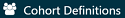

# --翻訳作業中--　コホートの定義 {#Cohorts}

*章のリード: Kristin Kostka*

観察型健康データ（*リアルワールドデータ*とも呼ばれる）は、患者の健康状態や医療の提供に関連するデータで、さまざまな情報源から日常的に収集されたデータです。そのため、OHDSIデータスチュワード（OHDSIの共同研究者で、各サイトのCDMにデータを維持している人々）は、電子健康記録（EHR）、健康保険請求データ、製品や疾患のレジストリ、自宅使用環境を含む患者が生成したデータ、および携帯端末など健康状態に関する情報を提供できる他の情報源など、複数の情報源からデータをキャプチャする場合があります。これらのデータは研究目的で収集されたものではないため、興味のある臨床データ要素を明示的にキャプチャしていない場合があります。

たとえば、健康保険の請求データベースは、あるコンディション（例：血管浮腫）に対して提供されたすべてのケアをキャプチャして関連コストが適切に補償されるように設計されており、実際のコンディションに関する情報はこの目的の一環としてのみキャプチャされます。このような観察データを研究目的で使用したい場合、データにキャプチャされているものを使用して本当に興味のあるものを推測するためのロジックを作成する必要があります。つまり、臨床イベントがどのように現れるかの定義を使用してコホートを作成する必要があるのです。たとえば、保険請求データベースで血管浮腫イベントを特定したい場合、血管浮腫の診断コードが緊急室の設定で記録されていることを要求するロジックを定義し、過去の血管浮腫の発生に対するフォローアップケアを単に説明する請求から区別するかもしれません。類似の考慮事項は、EHRに記録された日常的な医療の相互作用でキャプチャされるデータに対しても適用されます。データが二次的な目的で使用されているため、各データベースが元々何を目的として設計されたかを認識する必要があります。研究を設計するたびに、さまざまな医療環境でコホートがどのように存在するのかについての細かな点を考慮する必要があります。

この章では、コホート定義の作成と共有とは何か、コホートを開発する方法、およびATLASまたはSQLを使用して独自のコホートを作成する方法について説明します。


## コホートとは？

OHDSI研究では、コホートを一つ以上の包含基準を満たし、一定期間にわたってこれを維持している人々の集合として定義します。この用語はしばしば*フェノタイプ*と置き換えられます。コホートは、OHDSI分析ツールやネットワーク研究全体で研究質問を実行するための主要な構成要素として使用されます。たとえば、ACE阻害薬の開始による血管浮腫リスクを予測することを目的とした研究では、2つのコホートを定義します：アウトカムコホート（血管浮腫）およびターゲットコホート（ACE阻害薬を開始する人々）。OHDSIのコホートの重要な側面は、通常、研究内の他のコホートから独立して定義されるため、再利用が可能であることです。たとえば、血管浮腫コホートはターゲット集団外も含む集団全体のすべての血管浮腫イベントを特定します。分析時に必要に応じてこれらの二つのコホートの交差を取ります。この利点は、同じ血管浮腫コホート定義が、たとえばACE阻害薬と他の曝露を比較する推定研究など、他の分析でも使用できるということです。コホート定義は、研究の質問に応じて異なることがあります。

```{block2, type='rmdimportant'}
コホートは、一つ以上の包含基準を満たし、それを一定期間維持する人々の集合です。

```

\index{コホート} \index{コホート定義}
OHDSIで使用されるコホートの定義は、この分野の他の人々が使用するものとは異なるかもしれないことを理解することが重要です。たとえば、多くの査読済み科学論文では、コホートが特定の臨床コードのコードセット（例：ICD-9/ICD-10、NDC、HCPCSなど）に類似していると示唆されることがあります。コードセットはコホートを組み立てる際の重要な要素ですが、コホートはコードセットによって定義されません。コホートは、条件を満たすコードセットの使用方法に関する具体的なロジックを必要とします（例：これはICD-9/ICD-10コードの最初の発生ですか？任意の発生ですか？）。 よく定義されたコホートは、患者がコホートに入る方法とコホートから退出する方法を指定します。
\index{コードセット}

\index{フェノタイプ}
OHDSIのコホート定義を利用するためのユニークなニュアンスには以下があります:

- 一人の人が複数のコホートに属する可能性があります
- 一人の人が同じコホートに異なる期間属する可能性があります
- 一人の人が同じ期間内に同じコホートに複数回属することはありません
- コホートにはメンバーがゼロまたは複数いる場合があります

コホートを構築するための主要なアプローチは二つあります：

1. **ルールベースのコホート定義** は、患者がコホートにいる時期を明示的なルールで説明します。これらのルールを定義するには通常、コホートの包含基準のルールを構築するために、対象となる治療領域の知識を持つ個人のドメインの専門知識に大きく依存する。

2. **確率的コホート定義** は、コホートにいる患者の確率（0から100%の間の確率）を計算する確率モデルを使用します。この確率は、しきい値を使用してイエス・ノーの分類に変換できるか、または一部の研究デザインではそのまま使用できます。確率モデルは通常、機械学習（例：ロジスティック回帰）を使用して、関連する患者特性を自動的に特定するために例データでトレーニングされます。

次のセクションでは、これらのアプローチについて詳しく説明します。

## ルールベースのコホート定義

ルールベースのコホート定義は、特定の期間内に明示的に一つ以上の包含基準（例：「血管浮腫のある人」）を定義することから始まります（例：「過去6ヶ月以内にこの状態を発症した人」）。\index{cohort!rule-based design}

これらの基準を組み立てるために使用する標準的なコンポーネントは次のとおりです：

- **ドメイン**：データが保存されているCDMドメイン（例：「処置の発生」、「薬剤曝露」）は、臨床情報の種類およびそのCDMテーブル内に表現可能なコンセプトを定義します。ドメインについては、セクション\@ref(domains)で詳しく説明されています。

- **コンセプトセット**：臨床実体を包含する一つ以上の標準コンセプトを定義するデータ非依存の表現です。これらのコンセプトセットは、異なる観察健康データ間で相互運用可能であり、ボキャブラリ内の標準用語にマッピングされる臨床実体を表します。コンセプトセットについては、セクション\@ref(conceptSets)で詳しく説明されています。

- **ドメイン固有の属性**：関心のある臨床実体に関連する追加の属性（例：DRUG_EXPOSUREのDAYS_SUPPLYやMEASUREMENTのVALUE_AS_NUMBERやRANGE_HIGH）。

- **時間ロジック**：包含基準とイベントとの関係を評価する時間間隔（例：指定された状態は曝露開始の365日前またはその日前後で発生する必要があります）。

コホート定義を構築する際、コホート属性を表すブロックのようにドメインを考えると便利です（図\@ref(fig:cohortLegos)参照）。各ドメインの許容内容について混乱した場合は、共通データモデルの章（チャプター\@ref(CommonDataModel)）を参照してください。

```{r cohortLegos, fig.cap='コホート定義のブロック',echo=FALSE, out.width='50%', fig.align='center'}
knitr::include_graphics("images/Cohorts/cohort-legos.png")
```

コホート定義作成時に自問すべきいくつかの質問があります：

- *コホートエントリの時間を定義する初期イベントは何か？*
- *初期イベントに適用される包含基準は何か？*
- *コホート退出の時間を定義するものは何か？*

**コホートエントリエベント**：コホートエントリエベント（初期イベント）は、人々がコホートに参加する時点、つまり**コホートインデックス日**を定義します。コホートエントリエベントは、薬剤曝露、コンディション、処置、測定値、受診期間など、CDMで記録された任意のイベントであり得ます。初期イベントは、データが保存されているCDMドメイン（例：PROCEDURE_OCCURRENCE、DRUG_EXPOSUREなど）、臨床活動を特定するために作成されたコンセプトセット（例：状態のためのSNOMEDコード、薬剤のためのRxNormコード）、およびその他の特定の属性（例：発生時の年齢、初診断/処置/その他、開始日と終了日の指定、受診期間または基準の指定、供給日数など）によって定義されます。エントリエベントを持つ人々のセットは**初期イベントコホート**と呼ばれます。\index{cohort!entry event}

**包含基準**：包含基準は、初期イベントコホートに適用され、さらに人々のセットを制限します。各包含基準は、データが保存されているCDMドメイン、臨床活動を表すコンセプトセット、ドメイン固有の属性（例：供給日数、受診期間など）、およびコホートインデックス日相対の時間論理によって定義されます。各包含基準は、初期イベントコホートからの人々の脱落に対する基準の影響を評価するために使用されます。**適格コホート**は、すべての包含基準を満たす初期イベントコホート内のすべての人々として定義されます。\index{cohort!inclusion criteria}

**コホート退出基準**：コホート退出イベントは、ある人がコホート会員資格を失う時点を示します。コホート退出は、観察期間の終了、初期エントリエベント相対の固定時間間隔、関連する観察の一連の最後のイベント（例：持続的な薬剤曝露）または観察期間の他の打ち切りによって定義される場合があります。コホート退出戦略は、ある人が異なる時間間隔で複数回コホートに属することができるかどうかに影響を与えます。 \index{cohort!exit criteria}

```{block2, type='rmdimportant'}
OHDSIツールでは、包含基準と除外基準の区別はありません。すべての基準は包含基準として形式化されます。例えば、「以前の高血圧のある人を除外する」という除外基準は、「以前の高血圧の発生が0回の人を含む」という包含基準として形式化されます。

```

## コンセプトセット {#conceptSets}

\index{concept set}

コンセプトセットは、さまざまな分析で再利用可能なコンポーネントとして使用できるコンセプトのリストを表す表現です。これは、観察研究でよく使用されるコードリストの標準化されたコンピュータ実行可能な同等物と考えることができます。コンセプトセットの表現は、次の属性を持つコンセプトのリストで構成されます：

- **除外**：このコンセプト（および選択された場合はその子孫）をコンセプトセットから除外します。
- **子孫**：このコンセプトだけでなく、その子孫も考慮します。
- **マッピング対象**：非標準コンセプトを検索することを許可します。

例えば、コンセプトセットの表現は、図に示されるように2つのコンセプトを含むことができます（表\@ref(tab:conceptSetExpression)）。ここでは、コンセプト[4329847](http://athena.ohdsi.org/search-terms/terms/4329847)（「心筋梗塞」）およびそのすべての子孫を含む一方、コンセプト[314666](http://athena.ohdsi.org/search-terms/terms/314666)（「古い心筋梗塞」）およびそのすべての子孫を除外します。

表：（\#tab:conceptSetExpression）コンセプトセットの表現の例。

| コンセプトID | コンセプト名 | 除外 | 子孫 | マッピング対象 |
| ----- |:--------:| --- | ----- | ----- |
| 4329847 | 心筋梗塞 | いいえ | はい | いいえ |
| 314666  | 古い心筋梗塞 | はい | はい | いいえ |

図に示すように（図\@ref(fig:conceptSet)）、これは「心筋梗塞」およびその子孫を含むが、「古い心筋梗塞」およびその子孫は除外します。全体で、このコンセプトセットの表現は、ほぼ100の標準コンセプトを意味します。これらの標準コンセプトは、さまざまなデータベースに表示されるかもしれない何百ものソースコード（例：ICD-9およびICD-10コード）を反映します。

```{r conceptSet, fig.cap='「心筋梗塞」（子孫を含む）を含むが、「古い心筋梗塞」（子孫を含む）を除外するコンセプトセット。',echo=FALSE, out.width='100%', fig.align='center'}
knitr::include_graphics("images/Cohorts/conceptSet.png")
```

## 確率的コホート定義

ルールベースのコホート定義は、コホート定義を組み立てるための一般的な方法です。しかし、研究コホートを作成するために必要な専門家の合意を集めることは非常に時間がかかります。確率的コホート設計は、コホート属性の選択を迅速化するための代替手段であり、機械主導の方法です。このアプローチでは、監督された機械学習により、フェノタイピングアルゴリズムがコホート会員資格に寄与する属性がどのようにラベル付けされた例（ケース）から学習します。次に、このアルゴリズムを使用して、フェノタイプを定義する特性をより明確にし、フェノタイプ基準を変更する際に全体的な研究精度でどのようなトレードオフが発生するかを判断できます。 \index{cohort!probabilistic design}

このアプローチをCDMデータに適用する例は、APHRODITE（自動フェノタイプルーチンオブザーバーション定義、識別、トレーニングおよび評価）Rパッケージ[^aphroditeUrl]です。このパッケージは、不完全にラベル付けされたデータから学習する能力を組み合わせたコホートビルディングフレームワークを提供します。 [@Banda2017APHRODITE] \index{APHRODITE}

[^aphroditeUrl]: https://github.com/OHDSI/Aphrodite

## コホート定義の妥当性

コホートを構築する際には次のどちらが重要かを考慮すべきです：*すべての該当患者を見つけることが重要か？* それとも *確信を持てる患者のみを取り込むことが重要か？*

コホートの構築戦略は、専門家のコンセンサスが疾患をどのように定義するかの臨床的厳格性に依存します。これはつまり、正しいコホート設計はあなたが解答を求めている質問に依存するということです。すべてを取り入れるコホート定義を選択するか、OHDSIサイト全体で共有できる最小公約数を使用するか、またはその両者の妥協案を選ぶか。最終的には、研究者の判断により、対象コホートの適切な研究に必要な厳格性の閾値が決まります。

この章の冒頭で述べたように、コホート定義は記録されたデータから観察したいことを推測する試みです。それがどの程度うまくいったかという問いが生じます。一般に、ルールに基づくコホート定義や確率的アルゴリズムの検証は、提案されたコホートを「ゴールドスタンダード」の参照（例: ケースの手動チャートレビュー）と比較する試験として考えられます。詳細はChapter \@ref(ClinicalValidity)（「臨床的妥当性」）に記載されています。

### OHDSI ゴールドスタンダード表現型ライブラリ

既存のコホート定義とアルゴリズムの在庫と全体的な評価を支援するために、OHDSI ゴールドスタンダード表現型ライブラリ（GSPL）ワーキンググループが設立されました。GSPLワーキンググループの目的は、ルールベースおよび確率的手法からのコミュニティ支援のフェノタイプライブラリを開発することです。GSPLにより、OHDSIコミュニティのメンバーは、コミュニティによって検証されたコホート定義を研究やその他の活動に利用することができます。これらの「ゴールドスタンダード」定義は特定の設計と評価基準に従ってライブラリに保存されます。GSPLに関連する追加情報はOHDSIワーキンググループページを参照してください。[^gsplUrl] このワーキンググループの研究には、先のセクションで議論されたAPHRODITE [@Banda2017APHRODITE] およびPheValuatorツール [@Swerdel2019phevaluator] の他、OHDSIネットワーク全体での電子カルテおよびゲノミクスの [eMERGE](https://emerge.mc.vanderbilt.edu/) [Phenotype Library](https://phekb.org/phenotypes) の共有に関する作業も含まれます [@Hripcsak2019eMERGE]。表現型のキュレーションに関心がある場合は、このワーキンググループに貢献することを考えてみてください。 \index{phenotype library}

[^gsplUrl]: https://www.ohdsi.org/web/wiki/doku.php?id=projects:workgroups:gold-library-wg


## 高血圧のコホート定義

コホート定義をルールベースのアプローチでまとめることによって、コホートスキルを練習し始めます。この例では、*高血圧の初期治療としてACE阻害薬を単剤療法で開始する患者*を見つけたいと考えます。

このコンテキストを念頭に、コホートを構築します。この演習を通して、標準的な減少チャートに似た方法でコホートを構築します。図 \@ref(fig:CohortPractice) は、このコホートをどのように構築するかの論理的なフレームワークを示しています。

```{r CohortPractice, fig.cap='目標とするコホートの論理図', echo=FALSE, out.width='100%', fig.align='center'}
knitr::include_graphics("images/Cohorts/CohortPractice.png")
```

コホートはATLASのユーザーインターフェースで作成することも、CDMに対して直接クエリを記述することもできます。この章では、これらの両方について簡単に説明します。

## ATLASを用いたコホートの実装

まずATLASで始めるには、モジュールをクリックします。モジュールが読み込まれると、「New cohort」をクリックします。次の画面では空のコホート定義が表示されます。図\@ref(fig:ATLASdefineacohort)に示す内容が画面に表示されます。

```{r ATLASdefineacohort, fig.cap='新しいコホート定義', echo=FALSE, out.width='100%', fig.align='center'}

```

まず最初に、「New Cohort Definition」からコホートの名前を自身のユニークな名前に変更することをお勧めします。「高血圧に対する第一選択単剤療法としてのACE阻害薬の新規ユーザー」のような名前を付けることができます。

```{block2, type='rmdimportant'}
ATLASは二つのコホートが全く同じ名前を持つことを許可しません。他のATLASコホートで既に使われている名前を選んだ場合、ATLASはポップアップエラーメッセージを表示します。

```

名前を決めたら、をクリックしてコホートを保存します。

### 初期イベント基準

では、初期コホートイベントの定義を進めます。「Add initial event」をクリックします。どのドメインに基づいて基準を設定するかを選ばなければなりません。「どのドメインが初期コホートイベントかどうかをどのように知るのか？」という疑問を抱くかも知れません。これを解決しましょう。

```{r ATLASinitialevent, fig.cap='初期イベントの追加', echo=FALSE, out.width='100%', fig.align='center'}
knitr::include_graphics("images/Cohorts/ATLAS-initialevent.png")
```

図\@ref(fig:ATLASinitialevent)に示されているように、ATLASは各基準の説明を提供しています。もしCONDITION_OCCURRENCEに基づいた基準を構築している場合、特定の診断を持つ患者を探しているということになります。DRUG_EXPOSUREに基づいた基準を構築している場合、特定の薬または薬クラスを持つ患者を探しているということになります。高血圧に対する第一選択治療としてACE阻害薬単剤療法を開始する患者を見つけるため、DRUG_EXPOSURE基準を選択します。あなたが「しかし、高血圧としての診断も重要では？」と思うかも知れません。それは正しいです。高血圧は我々が構築する他の基準です。しかし、コホートの開始日はACE阻害薬治療の開始によって定義されるため、それが初期イベントです。高血圧の診断は、*追加の資格基準*と呼ばれるものです。この基準を構築した後で再度考慮します。「Add Drug Exposure」をクリックします。

画面は選択した基準を表示するように更新されますが、まだ終了ではありません。図\@ref(fig:ATLASdrugexposure)を参照すると、ATLASはどの薬を探しているのかを知りません。ATLASにACE阻害薬に関連するコンセプトセットを知らせる必要があります。

```{r ATLASdrugexposure, fig.cap='薬剤曝露の定義', echo=FALSE, out.width='100%', fig.align='center'}

```

### コンセプトセットの定義

コンセプトセットを定義するためには、をクリックして、ACE阻害薬を定義するためのコンセプトセットを取得するダイアログボックスを開きます。

#### シナリオ1: コンセプトセットを構築していない場合 {-}

基準に適用するためのコンセプトセットを集めていない場合は、先にそれを行う必要があります。コホート定義内で「Concept set」タブに移動し、「New Concept Set」をクリックしてコンセプトセットを構築することができます。「Unnamed Concept Set」から任意の名前に変更する必要があります。そこから、モジュールを使用してACE阻害薬を表す臨床コンセプトを検索できます（図\@ref(fig:aceinhibitors)を参照）。

```{r aceinhibitors, fig.cap='語彙の検索 - ACE阻害薬', echo=FALSE, out.width='100%', fig.align='center'}
knitr::include_graphics("images/Cohorts/aceinhibitors.png")
```

使用したい用語を見つけたら、をクリックしてコンセプトを選択します。図\@ref(fig:aceinhibitors)の左矢印を使用してコホート定義に戻ります。興味のある臨床コンセプトを見つけるための語彙のナビゲートは、チャプター\@ref(StandardizedVocabularies)（標準化された語彙）に参照できます。

図\@ref(fig:aceConceptSetExpression)は私たちのコンセプトセット表現を示しています。興味のあるすべてのACE阻害薬成分を選び、その子孫すべてを含め、これらの成分を含むすべての薬を含めています。「含まれているコンセプト」をクリックして、この表現に含まれている21,536のコンセプトすべてを確認することができ、「含まれているソースコード」をクリックして様々なコーディングシステムに含まれているすべてのソースコードを調査できます。

```{r aceConceptSetExpression, fig.cap='ACE阻害薬を含むコンセプトセット。', echo=FALSE, out.width='100%', fig.align='center'}
knitr::include_graphics("images/Cohorts/aceConceptSetExpression.png")
```

#### シナリオ2: すでにコンセプトセットを構築している場合 {-}

すでにコンセプトセットを作成してATLASに保存している場合、「Import Concept Set」をクリックします。ダイアログボックスが開き、ATLASのコンセプトセットリポジトリからコンセプトを見つけるように促されます（図\@ref(fig:ATLASfindyourconcept)を参照）。例の図ではユーザーはATLASに保存されているコンセプトセットを取得しています。右側の検索に「ace inhibitors」と入力し、コンセプトセットのリストを同じ名前を持つコンセプトのみに短縮しました。そこからユーザーはコンセプトセットの行をクリックして選択します。（注意: コンセプトセットを選択するとダイアログボックスは消えます。）選択したコンセプトセットの名前が「Any Drug」ボックスに更新されると、この操作が成功したことがわかります。

```{r ATLASfindyourconcept, fig.cap='ATLASリポジトリからのコンセプトセットのインポート', echo=FALSE, out.width='100%', fig.align='center'}
knitr::include_graphics("images/Cohorts/ATLAS-findingyourconcept.png")
```

### 追加の初期イベント基準

コンセプトセットを添付したら、まだ終了ではありません。質問は新たにACE阻害薬を初めて使用する患者を探すものです。これは、患者の記録において初めてのACE阻害薬曝露を表します。これを指定するには、「+Add attribute」をクリックします。次に「Add first exposure criteria」を選択します。注意：基準を構築する際に他の属性を指定することもできます。発生時の年齢、発生日、性別、薬剤に関連するその他の属性を指定できます。各ドメインの基準が異なることがあります。

選択したら、ウィンドウは自動的に閉じます。この追加属性は初期基準と同じボックスに表示されます（図\@ref(fig:initialEventAce)を参照）。

```{block2, type='rmdimportant'}
現在のATLASのデザインは一部の人々を混乱させるかもしれません。見た目の通り、は「No」を意味するものではありません。これは、基準を削除するための操作可能な機能です。もしをクリックすると、この基準は消えます。したがって、基準を有効に保つにはを残す必要があります。

```

これで初期の検証イベントが構築できました。初回の薬剤曝露をキャプチャするため、見落しがないことを知るために、ルックバックウィンドウを追加する必要があります。観察期間の短い患者が非表示の曝露を受ける場合があるため、観察期間の最低限度を強制することができます。これにより、記録の最初の発生をキャプチャしていることを確認するために、患者の履歴を見る最低期間を設定できます。この基準は他コホートでも異なる基準を選択することができます。365日間の継続的な観察を初期イベント前に要求します。観察期間を更新して、初期イベント後0日として更新します。最初のACE阻害薬の使用であることを保証するために、「earliest event」を選択します。図\@ref(fig:initialEventAce)を参照してロジックを確認してください。

```{r initialEventAce, fig.cap='インデックス日付前に必要な継続的観察を設定する。', echo=FALSE, out.width='100%', fig.align='center'}
knitr::include_graphics("images/Cohorts/initialEventAce.png")
```

このロジックがどのように組み合わさるかを説明すると、患者のタイムラインを組み立てることを考えることができます。

```{r EarliestEventExplained, fig.cap='基準の適用による患者の適格性の説明', echo=FALSE, out.width='100%', fig.align='center'}
knitr::include_graphics("images/Cohorts/EarliestEventExplained.png")
```

図\@ref(fig:EarliestEventExplained)では、各ラインがコホートに参加資格がある可能性のある単一の患者を表しています。塗りつぶされた星は、患者が指定された基準を満たすタイミングを表しています。追加の基準が適用されると、いくつかの星がより薄い色になります。これは、これらの患者が基準を満たす他の記録を持っていることを意味しますが、その基準を満たす前に他の記録があることを意味します。最終的な基準に達するまでに、私たちは初めてのACE阻害薬使用とその前の365日間の連続する観察を持つ患者の累積ビューを見ています。最初のイベントに限定することは冗長ですが、すべての選択で明確なロジックを維持することに役立ちます。独自のコホートを構築するときには、[OHDSIフォーラム](http://forums.ohdsi.org)の研究者セクションに参加して、コホート論理の構築について第二の意見を得ることをお勧めします。

### 包括基準

コホートエントリエベントを指定したら、追加の資格イベントを「Restrict initial events」または「New inclusion criteria」のいずれかに追加することができます。これら二つのオプション間の基本的な違いは、ATLASが提供する中間情報の内容です。「Restrict initial events」に追加基準を加えると、ATLASでカウントを生成するときに、これらすべての基準を満たす人の数だけが返されます。「New inclusion criteria」に基準を追加すると、追加の包括基準を適用することによって失う患者数を示す削減チャートが表示されます。各ルールがコホート定義の全体的な成功に与える影響を理解するために、包括基準セクションを利用することを強くお勧めします。特定の包括基準がコホートに入る人の数を大幅に制限する可能性があることがわかります。この段階では、コホートを大きくするためにこの基準を緩和する選択をするかもしれません。最終的には、このコホートを組み立てる専門家の合意に従います。

コホートのメンバーシップに関するロジックをさらに追加するために「New inclusion criteria」をクリックしてください。このセクションの機能は、前述のコホート基準の構築方法と同じです。私たちの最初の追加基準は次のとおりです：*ACE阻害薬の最初の開始日から365日から0日以内の少なくとも1回の高血圧障害の発生がある患者のみ*。新しい包括基準を追加するには「New inclusion criteria」をクリックします。基準に名前を付け、必要に応じて探している内容についての簡単な説明を書き込むことができます。これは自分が定義している基準を覚えるためのもので、コホートの整合性に影響を与えるものではありません。

新しい基準に注釈を付けたら、「+Add criteria to group」ボタンをクリックして、このルールの実際の基準を構築します。このボタンは「Add Initial Event」と同様に機能します。ただし、初期イベントを指定するわけではありません。複数の基準を追加できるため、「add criteria to group」と指定されています。たとえば、病気を見つけるための複数の方法（例：CONDITION_OCCURRENCEのロジック、この状態の代理としてのDRUG_EXPOSUREのロジック、この状態の代理としてのMEASUREMENTのロジック）があります。これらは別々のドメインであり、異なる基準を必要としますが、この状態を探すための1つの基準にグループ化できます。この場合、高血圧の診断を見つけるため「Add condition occurrence」を指定する。


## SQLを使用したコホートの実装

ここでは、SQLとRを使用して同じコホートを作成する方法について説明します。第\@ref(SqlAndR)章で説明したように、OHDSIはSqlRenderとDatabaseConnectorという2つのRパッケージを提供しており、これらを組み合わせることで、多様なデータベースプラットフォームに対して自動的に翻訳・実行されるSQLコードを記述できます。

理解しやすさのために、SQLをいくつかのチャンクに分割し、各チャンクが次のチャンクで使用される一時テーブルを生成するようにします。これはおそらく最も計算効率の良い方法ではありませんが、非常に長い一つのステートメントよりも読みやすくなります。

### データベースへの接続

最初にRに対してサーバーへの接続方法を指示する必要があります。これには[DatabaseConnector](https://ohdsi.github.io/DatabaseConnector/)パッケージを使用し、`createConnectionDetails`という名前の関数を提供します。各データベース管理システム（DBMS）に必要な具体的な設定については、`?createConnectionDetails`と入力してください。例えば、以下のコードでPostgreSQLデータベースに接続することができます：

```{r tidy=FALSE,eval=FALSE}
library(CohortMethod)
connDetails <- createConnectionDetails(dbms = "postgresql",
                                       server = "localhost/ohdsi",
                                       user = "joe",
                                       password = "supersecret")

cdmDbSchema <- "my_cdm_data"
cohortDbSchema <- "scratch"
cohortTable <- "my_cohorts"
```

最後の3行で、`cdmDbSchema`、`cohortDbSchema`、および`cohortTable`の変数を定義しています。これらは後で、CDM形式のデータが存在する場所と、興味のあるコホートを作成する場所をRに伝えるために使用します。Microsoft SQL Serverの場合、データベースのスキーマはデータベースとスキーマの両方を指定する必要があることに注意してください。例：`cdmDbSchema <- "my_cdm_data.dbo"`。

### コンセプトの指定

読みやすさのために、必要なコンセプトIDをRで定義し、それらをSQLに渡します：

```{r eval=FALSE}
aceI <- c(1308216, 1310756, 1331235, 1334456, 1335471, 1340128, 1341927,
          1342439, 1363749, 1373225)

hypertension <- 316866

allHtDrugs <- c(904542, 907013, 932745, 942350, 956874, 970250, 974166,
                  978555, 991382, 1305447, 1307046, 1307863, 1308216,
                  1308842, 1309068, 1309799, 1310756, 1313200, 1314002,
                  1314577, 1317640, 1317967, 1318137, 1318853, 1319880,
                  1319998, 1322081, 1326012, 1327978, 1328165, 1331235,
                  1332418, 1334456, 1335471, 1338005, 1340128, 1341238,
                  1341927, 1342439, 1344965, 1345858, 1346686, 1346823,
                  1347384, 1350489, 1351557, 1353766, 1353776, 1363053,
                  1363749, 1367500, 1373225, 1373928, 1386957, 1395058,
                  1398937, 40226742, 40235485)
```

### 初回使用の発見

まず、各患者のACE阻害薬の初回使用を見つけます：

```{r eval=FALSE}
conn <- connect(connDetails)

sql <- "SELECT person_id AS subject_id,
  MIN(drug_exposure_start_date) AS cohort_start_date
INTO #first_use
FROM @cdm_db_schema.drug_exposure
INNER JOIN @cdm_db_schema.concept_ancestor
  ON descendant_concept_id = drug_concept_id
WHERE ancestor_concept_id IN (@ace_i)
GROUP BY person_id;"

renderTranslateExecuteSql(conn,
                          sql,
                          cdm_db_schema = cdmDbSchema,
                          ace_i = aceI)
```

DRUG_EXPOSUREテーブルをCONCEPT_ANCESTORテーブルと結合することで、ACE阻害薬を含むすべての薬を見つけていることに注意してください。

### 365日の事前観察が必要

次に、OBSERVATION_PERIODテーブルと結合して365日間の連続した事前の観察が必要です：

```{r eval=FALSE}
sql <- "SELECT subject_id,
  cohort_start_date
INTO #has_prior_obs
FROM #first_use
INNER JOIN @cdm_db_schema.observation_period
  ON subject_id = person_id
    AND observation_period_start_date <= cohort_start_date
    AND observation_period_end_date >= cohort_start_date
WHERE DATEADD(DAY, 365, observation_period_start_date) < cohort_start_date;"

renderTranslateExecuteSql(conn, sql, cdm_db_schema = cdmDbSchema)
```

### 高血圧の前診断が必要

365日前に高血圧の診断が必要です：

```{r eval=FALSE}
sql <- "SELECT DISTINCT subject_id,
  cohort_start_date
INTO #has_ht
FROM #has_prior_obs
INNER JOIN @cdm_db_schema.condition_occurrence
  ON subject_id = person_id
    AND condition_start_date <= cohort_start_date
    AND condition_start_date >= DATEADD(DAY, -365, cohort_start_date)
INNER JOIN @cdm_db_schema.concept_ancestor
  ON descendant_concept_id = condition_concept_id
WHERE ancestor_concept_id = @hypertension;"

renderTranslateExecuteSql(conn,
                          sql,
                          cdm_db_schema = cdmDbSchema,
                          hypertension = hypertension)
```

過去に複数の高血圧診断がある場合でも、重複するコホートエントリーを作成しないように`SELECT DISTINCT`を使用していることに注意してください。

### 治療の無前使用が必要

高血圧治療の前使用がないことが必要です：

```{r eval=FALSE}
sql <- "SELECT subject_id,
  cohort_start_date
INTO #no_prior_ht_drugs
FROM #has_ht
LEFT JOIN (
  SELECT *
  FROM @cdm_db_schema.drug_exposure
  INNER JOIN @cdm_db_schema.concept_ancestor
    ON descendant_concept_id = drug_concept_id
  WHERE ancestor_concept_id IN (@all_ht_drugs)
) ht_drugs
  ON subject_id = person_id
    AND drug_exposure_start_date < cohort_start_date
WHERE person_id IS NULL;"

renderTranslateExecuteSql(conn,
                          sql,
                          cdm_db_schema = cdmDbSchema,
                          all_ht_drugs = allHtDrugs)
```

LEFT JOINを使用しており、DRUG_EXPOSUREテーブルからのperson_idがNULLの場合のみ行を許可することに注意してください。

### 単剤療法

コホートエントリーの最初の7日間に高血圧治療への一回のみの曝露が必要です：

```{r eval=FALSE}
sql <- "SELECT subject_id,
  cohort_start_date
INTO #monotherapy
FROM #no_prior_ht_drugs
INNER JOIN @cdm_db_schema.drug_exposure
  ON subject_id = person_id
    AND drug_exposure_start_date >= cohort_start_date
    AND drug_exposure_start_date <= DATEADD(DAY, 7, cohort_start_date)
INNER JOIN @cdm_db_schema.concept_ancestor
  ON descendant_concept_id = drug_concept_id
WHERE ancestor_concept_id IN (@all_ht_drugs)
GROUP BY subject_id,
  cohort_start_date
HAVING COUNT(*) = 1;"

renderTranslateExecuteSql(conn,
                          sql,
                          cdm_db_schema = cdmDbSchema,
                          all_ht_drugs = allHtDrugs)
```

### コホートの終了

これでコホートは完全に指定されましたが、コホートの終了日を除きます。コホートは曝露が停止した時点で終了し、次の曝露の間に最大で30日のギャップを許容します。これは、最初の薬剤曝露だけでなく、それに続くACE阻害薬の曝露も考慮する必要があることを意味します。連続する曝露を統合するためのSQLは非常に複雑になることがあります。幸いなことに、連続する曝露を効率的に作成する標準コードが定義されています（このコードはクリス・ノールによって書かれ、OHDSI内では「魔法」と呼ばれることがよくあります）。まず、統合したいすべての曝露を含む一時テーブルを作成します：

```{r eval=FALSE}
sql <- "
  SELECT person_id,
    CAST(1 AS INT) AS concept_id,
    drug_exposure_start_date AS exposure_start_date,
    drug_exposure_end_date AS exposure_end_date
  INTO #exposure
  FROM @cdm_db_schema.drug_exposure
  INNER JOIN @cdm_db_schema.concept_ancestor
    ON descendant_concept_id = drug_concept_id
  WHERE ancestor_concept_id IN (@ace_i);"
renderTranslateExecuteSql(conn,
                          sql,
                          cdm_db_schema = cdmDbSchema,
                          ace_i = aceI)
```

次に、連続する曝露を統合するための標準コードを実行します：

```{r eval=FALSE}
sql <- "
SELECT ends.person_id AS subject_id,
	ends.concept_id AS cohort_definition_id,
  MIN(exposure_start_date) AS cohort_start_date,
  ends.era_end_date AS cohort_end_date
INTO #exposure_era
FROM (
  SELECT exposure.person_id,
    exposure.concept_id,
    exposure.exposure_start_date,
    MIN(events.end_date) AS era_end_date
  FROM #exposure exposure
  JOIN (
--cteEndDates
    SELECT person_id,
      concept_id,
      DATEADD(DAY, - 1 * @max_gap, event_date) AS end_date
    FROM (
      SELECT person_id,
        concept_id,
        event_date,
        event_type,
        MAX(start_ordinal) OVER (
          PARTITION BY person_id ,concept_id ORDER BY event_date,
              event_type ROWS UNBOUNDED PRECEDING
          ) AS start_ordinal,
        ROW_NUMBER() OVER (
          PARTITION BY person_id, concept_id ORDER BY event_date,
            event_type
          ) AS overall_ord
      FROM (
-- select the start dates, assigning a row number to each
        SELECT person_id,
          concept_id,
          exposure_start_date AS event_date,
          0 AS event_type,
          ROW_NUMBER() OVER (
            PARTITION BY person_id, concept_id ORDER BY exposure_start_date
            ) AS start_ordinal
        FROM #exposure exposure

        UNION ALL
-- add the end dates with NULL as the row number, padding the end dates by
-- @max_gap to allow a grace period for overlapping ranges.

        SELECT person_id,
          concept_id,
          DATEADD(day, @max_gap, exposure_end_date),
          1 AS event_type,
          NULL
        FROM #exposure exposure
        ) rawdata
    ) events
  WHERE 2 * events.start_ordinal - events.overall_ord = 0
  ) events
  ON exposure.person_id = events.person_id
      AND exposure.concept_id = events.concept_id
      AND events.end_date >= exposure.exposure_end_date
  GROUP BY exposure.person_id,
      exposure.concept_id,
      exposure.exposure_start_date
  ) ends
GROUP BY ends.person_id,
  concept_id,
  ends.era_end_date;"

renderTranslateExecuteSql(conn,
                          sql,
                          cdm_db_schema = cdmDbSchema,
                          max_gap = 30)
```

このコードは、曝露間のギャップを`max_gap`引数で定義しながら、すべての連続する曝露を統合します。結果として得られた薬剤曝露の期間は、`#exposure_era`と呼ばれる一時テーブルに書き込まれます。

次に、これらのACE阻害薬の曝露期間を元のコホートに結合し、期間終了日をコホートの終了日として使用します：

```{r eval=FALSE}
sql <- "SELECT ee.subject_id,
  CAST(1 AS INT) AS cohort_definition_id,
  ee.cohort_start_date,
  ee.cohort_end_date
INTO @cohort_db_schema.@cohort_table
FROM #monotherapy mt
INNER JOIN #exposure_era ee
  ON mt.subject_id = ee.subject_id
    AND mt.cohort_start_date = ee.cohort_start_date;"

renderTranslateExecuteSql(conn,
                          sql,
                          cohort_db_schema = cohortDbSchema,
                          cohort_table = cohortTable)
```

ここで、以前に定義したスキーマとテーブルに最終的なコホートを保存します。他のコホートと区別するために1のコホート定義IDを割り当てます。

### クリーンアップ

最後に、作成した一時テーブルをすべてクリーンアップし、データベースサーバーから切断することをお勧めします：

```{r eval=FALSE}
sql <- "TRUNCATE TABLE #first_use;
DROP TABLE #first_use;

TRUNCATE TABLE #has_prior_obs;
DROP TABLE #has_prior_obs;

TRUNCATE TABLE #has_ht;
DROP TABLE #has_ht;

TRUNCATE TABLE #no_prior_ht_drugs;
DROP TABLE #no_prior_ht_drugs;

TRUNCATE TABLE #monotherapy;
DROP TABLE #monotherapy;

TRUNCATE TABLE #exposure;
DROP TABLE #exposure;

TRUNCATE TABLE #exposure_era;
DROP TABLE #exposure_era;"

renderTranslateExecuteSql(conn, sql)

disconnect(conn)
```


## サマリー

```{block2, type='rmdsummary'}
- コホートとは、1つまたは複数の選択基準を満たす人々の集合である。

- コホート定義とは、特定のコホートを識別するために使用されるロジックの説明である。

- コホートは、関心のある曝露やアウトカムを定義するために、OHDSIアナリティクスツール全体で使用（再利用）される。

- コホートを構築するための2つの主要なアプローチがある：ルールベースと確率論的アプローチ。

- ルールベースのコホート定義は、ATLASまたはSQLを使用して作成できる。


```

## 演習

#### 前提条件 {-}

最初の演習のためには、ATLASインスタンスへのアクセスが必要である。以下のインスタンス [http://atlas-demo.ohdsi.org](http://atlas-demo.ohdsi.org) またはアクセス可能な他のインスタンスを使用することができる。

```{exercise, exerciseCohortsAtlas}
以下の基準に従ってATLASでコホート定義を作成せよ：

- ジクロフェナクの新規ユーザー
- 16歳以上
- 曝露前に少なくとも365日の継続的な観察期間があること
- 以前にNSAID（非ステロイド性抗炎症薬）への曝露がないこと
- 以前に癌の診断がないこと
- コホート終了を曝露の中断（30日間のギャップを許容）として定義すること

```

#### 前提条件 {-}

第二の演習では、R、R-StudioおよびJavaがインストールされていることを前提とする。セクション \@ref(installR)で説明されている。また、[SqlRender](https://ohdsi.github.io/SqlRender/)、[DatabaseConnector](https://ohdsi.github.io/DatabaseConnector/)、および[Eunomia](https://ohdsi.github.io/Eunomia/) パッケージが必要であり、以下の方法でインストールできる：

```{r eval=FALSE}
install.packages(c("SqlRender", "DatabaseConnector", "remotes"))
remotes::install_github("ohdsi/Eunomia", ref = "v1.0.0")
```

Eunomiaパッケージは、CDM内でローカルRセッション内で実行されるシミュレートされたデータセットを提供する。接続詳細は以下の方法で取得できる：

```{r eval=FALSE}
connectionDetails <- Eunomia::getEunomiaConnectionDetails()
```

CDMデータベーススキーマは「main」である。

```{exercise, exerciseCohortsSql}
SQLおよびRを使用して、既存のCOHORTテーブルにて急性心筋梗塞（AMI）のコホートを以下の基準に従って作成せよ：

- 心筋梗塞の診断の発生（コンセプト4329847「心筋梗塞」およびそのすべての子孫、コンセプト314666「古い心筋梗塞」およびその子孫を除く）。
- 入院またはER訪問中（コンセプト9201、9203、262；それぞれ「入院」、 「緊急室訪問」、および「緊急室および入院訪問」）。

```

提案された解答は、Appendix \@ref(Cohortsanswers) に記載されている。
