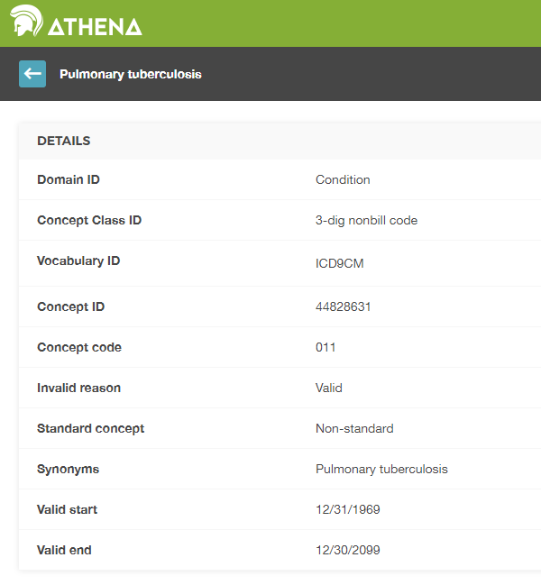

# (PART) --翻訳作業中--　共通データモデル {.unnumbered}

# 共通データモデル {#CommonDataModel}

*章の著者: Clair Blacketer*

観察データは、患者が医療を受ける際に起こる出来事を示すものです。このデータは世界中でますます多くの患者について収集し、保存されるため、ビッグヘルスデータと呼ばれることがあります。これらのデータ収集には３つの目的があります： １）直接的に研究を支援するため（よくあるのは調査データや登録データの形で）、２） 医療の提供をサポートするため（いわゆるEHR - 電子健康記録）、３） 医療の費用を管理するため（いわゆる保険請求データ）。この３つの目的はすべて臨床研究に日常的に使用されており、後者の二つは二次利用データとして使用され、すべての目的が独自のフォーマットやエンコーディングを持っています。 \index{Common Data Model} \index{CDM |see {Common Data Model}} \index{リレーショナルデータモデル|see {Common Data Model}}

なぜ観察医療データに共通データモデルが必要なのでしょうか？

それぞれの主要なニーズに応じて、観察データベースが臨床イベントをすべて均等に捉えることはできません。そのため、潜在的な捕捉バイアスの影響を理解するには、多くの異なるデータソースから研究結果を導き出し、比較・対照する必要があります。さらに、統計的に有効な結論を導くには、多数の観察対象の患者が必要です。これが、複数のデータソースを同時に評価・分析する必要性を説明するものです。そのためには、データを共通のデータ標準に統合する必要があります。さらに、患者データの高度な保護も必要です。従来のように分析目的でデータを抽出するには、厳格なデータ利用契約と複雑なアクセス制御が必要です。共通のデータ標準により抽出ステップを省略し、標準化された分析をネイティブ環境のデータ上で実行できるようにすることで、このニーズを軽減することができます。分析はデータにアクセスするのではなく、データが分析にアクセスするのです。

この標準を提供するのが共通データモデル（CDM）です。標準化された内容（第\@ref(StandardizedVocabularies)章参照）と組み合わせたCDMは、研究方法が体系的に適用され、意味のある比較可能な再現性のある結果を生成することを保証します。この章では、データモデル自体の概要、デザイン、規約、一部のテーブルについて概説します。

CDMのすべてのテーブルの概要は、図 \@ref(fig:cdmDiagram)に示されています。 \index{Common Data Model!データモデル図}

```{r cdmDiagram, fig.cap="CDMバージョン6.0のすべてのテーブルの概要。テーブル間のすべての関係が示されているわけではありません。", echo=FALSE, out.width="100%"}
knitr::include_graphics("images/CommonDataModel/cdmDiagram.png")
```

## デザインの原則

CDMは、以下の目的のために最適化されています。 \index{Common Data Model!デザインの原則}

-   特定の医療介入（薬物曝露、処置、医療政策の変更など）やアウトカム（コンディション、処置、他の薬物曝露など）を持つ患者集団を特定する。
-   人口統計情報、疾患の自然経過、医療提供、利用と費用、併存疾患、治療や治療の順序などさまざまなパラメータに関して患者集団の特性を評価する。
-   個々の患者でアウトカムが発生する可能性を予測する―― 第 \@ref(PatientLevelPrediction) 章参照。
-   これらの介入が集団に及ぼす影響を推定する ―― 第 \@ref(PopulationLevelEstimation) 章参照。

この目標を達成するために、CDMの開発は以下のデザイン要素に従います：

-   **目的適合性**: CDMは、医療提供者または保険者の運用ニーズを満たす目的ではなく、分析のために最適な形でデータを提供することを目指しています。 \index{Common Data Model!目的適合性}
-   **データ保護**: 名前や正確な誕生日など、患者の身元や保護を危うくする可能性のあるすべてのデータは限定されています。乳児の研究のために正確な誕生日が必要な場合など、研究でより詳細な情報が明示的に必要な場合は例外となることがあります。 \index{Common Data Model!データ保護}
-   **ドメインの設計**: ドメインは、各レコードに最低限、個人の識別情報と日付が記録される、個人中心のリレーショナルデータモデルでモデル化されています。ここでいうリレーショナルデータモデルとは、主キーと外部キーでリンクされたテーブルの集合としてデータが表現されるものを指します。
-   **ドメインの根拠**: ドメインは、分析のユースケースがある場合（たとえばコンディション）で、そのドメインが他のものには適用されない特定の属性を持つ場合に、エンティティ-リレーションシップモデルで特定され、個別に定義されます。他のデータはすべて、エンティティ-属性-値構造の観察テーブルに保持できます。 \index{Common Data Model!ドメイン}
-   **標準化されたボキャブラリ**: それらの記録の内容を標準化するために、CDMは、標準的な医療コンセプトのすべてに対応する、必要かつ適切な標準化されたボキャブラリに依存しています。。
-   **既存のボキャブラリの再利用**: 可能な場合、国立医学図書館、退役軍人省、疾病予防管理センターなどの国立または業界の標準化やボキャブラリ定義を行う組織やイニシアティブはこれらのコンセプトを活用しています。
-   **ソースコードの保持**: すべてのコードが標準化されたボキャブラリにマッピングされている場合でも、モデルは元のソースコードも保持して、情報が失われないようにしています。 \index{Common Data Model!ソースコード} \index{Common Data Model!データ損失防止}
-   **技術の中立性**: CDMは特定のテクノロジーを必要としません。Oracle、SQL Serverなどのあらゆるリレーショナルデータベース、またはSAS分析データセットとして実現できます。 \index{Common Data Model!技術の中立性}
-   **スケーラビリティ**: CDMは、データベースに含まれる何億人もの人々や何十億件もの臨床観察データなど、さまざまな規模のデータソースに対応できるよう、データ処理と計算分析用に最適化されています。 \index{Common Data Model!スケーラビリティ}
-   **後方互換性**: これまでのCDMからの変更はすべてgithubリポジトリ[(https://github.com/OHDSI/CommonDataModel)](https://github.com/OHDSI/CommonDataModel)で明確に示されています。CDMの旧バージョンは現在のバージョンから簡単に作成でき、以前に存在していた情報が失われることはありません。 \index{Common Data Model!後方互換性}

## データモデルの規約

CDMでは、暗黙的および明示的な規約が数多く採用されています。CDMに対応するメソッドの開発者は、これらの規約を理解する必要があります。\index{共通データモデル!規約}

### モデルの一般的な規約 {#model-Conv}

CDMは「人中心」のモデルと見なされており、すべての臨床イベントのテーブルがPERSONテーブルにリンクされています。日付または開始日と組み合わせることで、人ごとに医療関連イベントをすべて縦断的に見ることができます。このルールに対する例外は、標準化された医療システム・データ・テーブルで、これはさまざまなドメインのイベントに直接リンクされています。

### スキーマの一般的な規約

スキーマ（または一部のシステムではデータベースユーザー）により、読み取り専用テーブルと読み取り/書き込みテーブルを分離することができます。臨床イベントやボキャブラリテーブルは「CDM」スキーマにあり、エンドユーザーや分析ツールからは読み取り専用と見なされます。ウェブベースのツールやエンドユーザーが操作する必要のあるテーブルは、「Results」スキーマに格納されます。「Results」スキーマの2つのテーブルは、COHORTとCOHORT_DEFINITIONです。これらのテーブルは、ユーザーが定義する可能性のあるグループを記述することを目的としています。詳細は第 \@ref(Cohorts)章を参照ください。これらのテーブルは書き込み可能であり、実行時にCOHORTテーブルにコホートを保存することができます。すべてのユーザーに対して読み取り/書き込み可能なスキーマは1つだけなので、複数のユーザーアクセスをどのように構成し制御するかは、CDMの実装次第です。

### データテーブルの一般的な規約

CDMはプラットフォームに依存しません。データ型はANSI SQLデータ型（VARCHAR、INTEGER、FLOAT、DATE、DATETIME、CLOB）を用いて一般的に定義されます。VARCHARには最小必要文字列長のみが指定され、具体的なCDMのインスタンス内で拡張できます。CDMは日付および日時の形式を規定しません。CDMに対する標準クエリは、ローカルインスタンスや日付/日時の設定によって異なる場合があります。

<<<<<<< HEAD
*注意*: データモデル自体はプラットフォームに依存しませんが、それに対応するために構築された多くのツールは特定の仕様が必要です。詳細については、第 \@ref(OhdsiAnalyticsTools)章をご覧ください。

### ドメインの一般的な規約 {#domains}

異なる性質のイベントはドメインに整理されています。これらのイベントはドメイン固有のテーブルやフィールドに格納され、標準化されたボキャブラリで定義されたドメイン固有の標準コンセプトによって表現されます（第 \@ref(conceptDomains)部参照）。 各標準コンセプトには一意のドメイン割り当てがあり、どのテーブルに記録されるかを定義します。正しいドメイン割り当てはコミュニティ内で議論の余地がありますが、この厳格なドメインテーブルフィールドの対応規則により、コードやコンセプトの記録場所が常に明確であることが保証されます。例えば、徴候、症状、診断のコンセプトはコンディション・ドメインに属し、CONDITION_OCCURRENCEテーブルのCONDITION_CONCEPT_IDに記録されます。処置薬と呼ばれるものは通常、ソースデータの処置テーブルに処置コードとして記録されます。CDMでは、対応する標準コンセプトにドメイン割り当て「Drug」が設定されているため、これらのレコードはDRUG_EXPOSUREテーブルに記録されます。ドメインの総数は30で、表\@ref(tab:domains)に示されています。

表: (\\#tab:domains) 各ドメインに属する標準コンセプトの数。

| コンセプト数 | ドメインID         | コンセプト数 | ドメインID          |
|:-------------|:-------------------|:-------------|:--------------------|
| 1731378      | Drug               | 183          | Route               |
| 477597       | Device             | 180          | Currency            |
| 257000       | Procedure          | 158          | Payer               |
| 163807       | Condition          | 123          | Visit               |
| 145898       | Observation        | 51           | Cost                |
| 89645        | Measurement        | 50           | Race                |
| 33759        | Spec Anatomic Site | 13           | Plan Stop Reason    |
| 17302        | Meas Value         | 11           | Plan                |
| 1799         | Specimen           | 6            | Episode             |
| 1215         | Provider Specialty | 6            | Sponsor             |
| 1046         | Unit               | 5            | Meas Value Operator |
| 944          | Metadata           | 3            | Spec Disease Status |
| 538          | Revenue Code       | 2            | Gender              |
| 336          | Type Concept       | 2            | Ethnicity           |
| 194          | Relationship       | 1            | Observation Type    |

: (#tab:domains) 各ドメインに属する標準コンセプトの数

### コンテンツのコンセプトによる表現

CDMデータテーブル内の各レコードのコンテンツは完全に正規化され、コンセプトを通じて表現されます。コンセプトはCONCEPTテーブルへの外部キーであるCONCEPT_ID値とともにイベントテーブルに格納され、CONCEPTテーブルは一般的な参照テーブルとして機能します。CDMインスタンスはすべて、コンセプトの参照として同じCONCEPTテーブルを使用します。これにより、CDMとともにOHDSI研究ネットワークの基盤となる相互運用性の主要なメカニズムが提供されます。標準コンセプトが存在しない場合や特定できない場合、CONCEPT_IDの値は0に設定されます。これは、存在しないコンセプト、不明またはマッピング不可能な値を表します。

CONCEPTテーブルのレコードには、各コンセプトの詳細情報（名前、ドメイン、クラスなど）が含まれています。コンセプト、コンセプトリレーションシップ、コンセプトの祖先など、コンセプトに関連するその他の情報は、標準化されたボキャブラリのテーブルに含まれています（第 \@ref(StandardizedVocabularies)章を参照）。

### フィールドの一般的な命名規約

<<<<<<< HEAD
すべてのテーブルにわたる変数名は1つの規約に従います。

表: (\\#tab:fieldConventions) フィールド名の規約。
=======
すべてのテーブルの変数名は1つの規約に従います。
>>>>>>> 63f5a344f22fca7084ae3213128bbf04fca50b3b

| 記法 | 説明 |
|:---|:---|
| [Event]\_ID | 各レコードの固有の識別子で、イベントテーブル間の関係を確立する外部キーとして機能します。例えば、PERSON_IDは各個人を一意に識別します。VISIT_OCCURRENCE_IDは受診期間を一意に識別します。 |
| [Event]\_CONCEPT_ID | CONCEPT参照テーブルの標準コンセプトレコードへの外部キーです。これはイベントの主要な表現として機能し、標準化された分析の主要な基礎となります。たとえば、CONDITION_CONCEPT_ID = [31967](http://athena.ohdsi.org/search-terms/terms/31967)にはSNOMEDコンセプトの「吐き気」の参照値が含まれています。 |
| [Event]\_SOURCE_CONCEPT_ID | CONCEPT参照テーブルのレコードへの外部キーです。このコンセプトは、以下のソース値に相当し、標準コンセプトの場合、それは[Event]\_CONCEPT_IDと同一になります。例えば、CONDITION_SOURCE_CONCEPT_ID = [45431665](http://athena.ohdsi.org/search-terms/terms/45431665)は「吐き気」というコンセプトを、Read用語で示し、同様のCONDITION_CONCEPT_IDは標準のSNOMED-CTコンセプト[31967](http://athena.ohdsi.org/search-terms/terms/31967)です。標準分析アプリケーションの場合、ソースコンセプトの使用は推奨されません。なぜなら、標準コンセプトだけがイベントの意味的内容を明確に示し、ソースコンセプトは相互運用可能ではないためです。 |
| [Event]\_TYPE_CONCEPT_ID | ソース情報の出所を示す標準化されたボキャブラリ内で標準化されたコンセプト参照テーブルのレコードへの外部キーです。フィールド名とは異なり、これはイベントの種類やコンセプトの種類でもなく、このレコードを作成した取得メカニズムを宣言するものであることに留意ください。例として、DRUG_TYPE_CONCEPT_IDは、薬剤レコードが薬局での調剤イベント（「薬局での調剤」）から派生したものか、処方アプリケーション（「処方箋発行」）から派生したものかを区別します。 |
| [Event]\_SOURCE_VALUE | ソースデータでこのイベントがどのように表現されていたかを反映する、逐語的なコードまたは自由形式の文字列。これらのソース値はデータソース間で整合されていないため、標準的な分析アプリケーションでの使用は推奨されません。例えば、CONDITION_SOURCE_VALUEにはドットを省略した表記で書かれたICD-9コード787.02に対応する「78702」のレコードが含まれる可能性があります。 |

: (#tab:fieldConventions) フィールド名の規約

### コンセプトとソース値の違い {#concepts-Sources}

多くのテーブルには、ソース値、ソースコンセプト、標準コンセプトとして、複数の場所に同等の情報が含まれています。

-   **ソース値**は、ソースデータにおけるイベントレコードのオリジナル表現です。これらは、ICD9CM、NDC、Readなどのように、広く使用されているがパブリックドメインであることが多いコーディングシステムからのコード、CPT4、GPI、MedDRAなどの独自のコーディングシステム、あるいは女性をF、男性をMのようにソースデータのみで使用される管理された用語集であることがあります。また、標準化も管理もされていない短い自由テキストのフレーズであることもあります。ソース値は、データテーブルの[Event]\_SOURCE_VALUEフィールドに格納されます。
-   **コンセプト**は、CDM特有のエンティティであり、臨床事実の意味を標準化します。ほとんどのコンセプトは、医療分野における既存の公開または独自仕様のコーディングシステムに基づきますが、中には新規に作成されたものもあります（CONCEPT_CODEが「OMOP」で始まる）。コンセプトには、すべてのドメインにわたって一意のIDが割り当てられています。
-   **ソースコンセプト**は、ソースで使用されるコードを表すコンセプトです。ソースコンセプトは、既存の公開または独自のコード体系に対してのみ使用され、OMOPで生成されたコンセプトには使用されません。ソースコンセプトはデータテーブル内の[Event]\_SOURCE_CONCEPT_IDフィールドに格納されます。
-   **標準コンセプト**は、ソースで使用されるコードシステムとは無関係に、すべてのデータベースで臨床実態の意味を一意に定義するために使用されるコンセプトです。標準コンセプトは通常、既存の公開または専有のボキャブラリソースから取得されます。標準コンセプトと同等な意味を持つ非標準コンセプトは、標準化されたボキャブラリにおいて標準コンセプトにマッピングされます。標準コンセプトはデータテーブルの[Event]\_CONCEPT_IDフィールドで参照できます。

ソース値は、便宜上、品質保証（QA）の目的でのみ提供されます。ソース値には、特定のデータソースの文脈のみで意味を持つ情報が含まれる場合があります。ソース値やソースコンセプトの使用は任意ですが、ソースデータがコード体系を使用している場合には**強く推奨**されます。一方、標準コンセプトの使用は**必須**です。この標準コンセプトの使用が必須である理由は、すべてのCDMインスタンスが同じ言語を話すことができるようにするためです。例えば、図 \@ref(fig:pulmTubICD9) で示されているように、コンディション「肺結核」（TB）のICD9CMコードは011です。

```{r pulmTubICD9, fig.cap="肺結核のICD9CMコード",echo=FALSE, out.width="75%", fig.align="center"}

```


文脈がなければ、コード011は、UB04ボキャブラリでは「病院入院患者（メディケアパートAを含む）」、DRGボキャブラリでは「神経系新生物（合併症、併発症なし）」と解釈される可能性があります。 このような場合に、ソースと標準の両方のコンセプトIDが役立ちます。ICD9CMの011を表すCONCEPT_IDの値は[44828631](http://athena.ohdsi.org/search-terms/terms/44828631)です。これにより、UBO4とDRGとICD9CMが区別されます。ICD9CM TB のソースコンセプト は、図 \@ref(fig:pulmTubMap) に示されているように、「非標準から標準へのマップ（OMOP）」という関係を通じて、SNOMED ボキャブラリーから Standard Concept [253954](http://athena.ohdsi.org/search-terms/terms/253954)にマップされます。この同じマッピング関係は、Read、ICD10、CIEL、MeSH コードなどにも存在するため、SNOMED 標準コンセプトを参照するあらゆる検索は、サポートされているすべてのソースコードを含みます。

```{r pulmTubMap, fig.cap="肺結核のSNOMEDコード",echo=FALSE, out.width="100%"}
knitr::include_graphics("images/CommonDataModel/pulmTubMap.png")
```

標準コンセプトとソースコンセプトとの関係の例を表 \@ref(tab:conditionOccurrence)に示します。

## CDM標準化テーブル

\index{共通データモデル!標準化テーブル}

CDMには16の臨床イベントテーブル、10のボキャブラリテーブル、2つのメタデータテーブル、4つのヘルスシステムデータテーブル、2つの医療経済データテーブル、3つの標準化された派生要素、および2つの結果スキーマテーブルが含まれています。 これらのテーブルはCDM Wikiで完全に指定されています [^commondatamodel-1]。

[^commondatamodel-1]: <https://github.com/OHDSI/CommonDataModel/wiki>

これらのテーブルが実際にどのように使用されるかを説明するために、本章の残りの部分ではある1人のデータを一貫した例として使用します。

### 実行例: 子宮内膜症

子宮内膜症は、通常女性の子宮内膜にある細胞が体の他の場所に生じる痛みを伴う状態です。重症になると、不妊症、腸や膀胱の問題を引き起こすことがあります。次のセクションでは、この病気にかかった患者の経験と、それが共通データモデルでどのように表現される可能性があるかを詳しく説明します。

```{r Lauren1, echo=FALSE, out.width="50%", fig.align="center"}
knitr::include_graphics("images/CommonDataModel/Lauren.jpg")
```

> この痛みを伴う旅のすべての段階で、どれほど痛みを感じているかを皆に納得させなければなりませんでした。

Laurenは何年も子宮内膜症の症状に悩まされてきましたが、診断を受けるまでには卵巣嚢腫の破裂を経験しています。Laurenについての詳細は<https://endometriosis-uk.org/laurens-story> をご覧ください。

### PERSONテーブル {#person}

#### Laurenについてわかっていること {.unnumbered}

-   彼女は36歳の女性です
-   彼女の誕生日は1982年3月12日です
-   彼女は白人です
-   彼女はイギリス人です

これを踏まえると、彼女のPERSONテーブルは次のようになります：

表: (\\#tab:person) PERSONテーブル。

| 列名 | 値 | 説明 |
|:---|:---|:---|
| PERSON_ID | 1 | PERSON_IDはソースから直接であれ、ビルドプロセスの一部として生成されたものであれ、整数である必要があります。 |
| GENDER_CONCEPT_ID | 8532 | 女性性別を参照するコンセプトIDは[8532](http://athena.ohdsi.org/search-terms/terms/8532)です。 |
| YEAR_OF_BIRTH | 1982 |  |
| MONTH_OF_BIRTH | 3 |  |
| DAY_OF_BIRTH | 12 |  |
| BIRTH_DATETIME | 1982-03-12 00:00:00 | 時間が不明の場合は真夜中が使用されます。 |
| DEATH_DATETIME |  |  |
| RACE_CONCEPT_ID | 8527 | 白人を示すコンセプトIDは[8527](http://athena.ohdsi.org/search-terms/terms/8527)です。英国の民族は[4093769](http://athena.ohdsi.org/search-terms/terms/4093769)です。どちらも正しいですが、後者は前者に統合されます。民族は、ETHNICITY_CONCEPT_IDではなく、人種の一部としてここに格納されていることに留意ください。 |
| ETHNICITY_CONCEPT\_ ID | 38003564 | これはヒスパニック系の人々を他の人々から区別するための米国特有の表記法です。この場合の「English」という民族性は、RACE_CONCEPT_ID に格納されます。米国以外では使用されません。[38003564](http://athena.ohdsi.org/search-terms/terms/38003564)は「ヒスパニックではない」を表します。 |
| LOCATION_ID |  | 彼女の住所は不明です。 |
| PROVIDER_ID |  | 彼女のプライマリケア提供者は不明です。 |
| CARE_SITE |  | 彼女の主な医療施設は不明です。 |
| PERSON_SOURCE\_ VALUE | 1 | 通常、これはソースデータでの彼女の識別子ですが、多くの場合、それはPERSON_IDと同じです。 |
| GENDER_SOURCE\_ VALUE | F | ソースに表示されている性別値がここに格納されています。 |
| GENDER_SOURCE\_ CONCEPT_ID | 0 | ソースの性別値が OHDSI がサポートするコーディングスキームでコード化されている場合、そのコンセプトはここに格納されます。例えば、ソースの性別が「性別-F」であり、PCORNet ボキャブラリコンセプトに記載されている場合、[44814665](http://athena.ohdsi.org/search-terms/terms/44814665)がこのフィールドに入ります。 |
| RACE_SOURCE\_ VALUE | white | ソースに表示されてい人種値がここに格納されます。 |
| RACE_SOURCE\_ CONCEPT_ID | 0 | 同様にGENDER_SOURCE_CONCEPT_IDの原則が適用されます。 |
| ETHNICITY_SOURCE\_ VALUE | english | ソースに表示されている民族値がここに格納されます。 |
| ETHNICITY_SOURCE\_ CONCEPT_ID | 0 | 同様にGENDER_SOURCE_CONCEPT_IDの原則が適用されます。 |

<<<<<<< HEAD
=======
: (#tab:person) PERSONテーブル

>>>>>>> 63f5a344f22fca7084ae3213128bbf04fca50b3b
### OBSERVATION_PERIODテーブル {#observationPeriod}

OBSERVATION_PERIODテーブルは、妥当な感度と特異度が期待されるソースシステムにおいて、少なくとも患者の人口統計、コンディション、処置、薬剤が記録される期間を定義するために設計されています。保険請求データの場合は、通常、患者の加入期間となります。電子健康記録（EHR）の場合は、より複雑です。ほとんどの医療システムでは、どの医療機関または医療提供者が訪問したかを特定しないためです。次善の策として、システム内の最初のレコードが観察期間の開始日と見なされ、最新のレコードが終了日と見なされることがよくあります。

#### Laurenの観察期間はどのように定義されているのですか？ {.unnumbered}

Laurenの情報が表 \@ref(tab:encounters)に示されているように電子健康記録システムに記録されているとしましょう。彼女の観察期間の元となる彼女の受診は：

表: (\\#tab:encounters) Laurenのヘルスケアエンカウンター。

| エンカウンターID | 開始日     | 終了日     | タイプ   |
|:-----------------|:-----------|:-----------|:---------|
| 70               | 2010-01-06 | 2010-01-06 | 外来患者 |
| 80               | 2011-01-06 | 2011-01-06 | 外来患者 |
| 90               | 2012-01-06 | 2012-01-06 | 外来患者 |
| 100              | 2013-01-07 | 2013-01-07 | 外来患者 |
| 101              | 2013-01-14 | 2013-01-14 | 歩行可能 |
| 102              | 2013-01-17 | 2013-01-24 | 入院患者 |

<<<<<<< HEAD
=======
: (#tab:encounters) Laurenのヘルスケアエンカウンター

>>>>>>> 63f5a344f22fca7084ae3213128bbf04fca50b3b
エンカウンターレコードに基づいて彼女のOBSERVATION_PERIODテーブルは次のようになるかもしれません：

表: (\\#tab:observationPeriod) OBSERVATION_PERIODテーブル。

| 列名 | 値 | 説明 |
|:---|:---|:---|
| OBSERVATION\_ PERIOD_ID | 1 | これは通常、自動生成された値で、テーブル内の各レコードに一意の識別子を生成します。 |
| PERSON_ID | 1 | これはPERSONテーブルでLauraのレコードへの外部キーであり、PERSONをOBSERVATION_PERIODテーブルにリンクします。 |
| OBSERVATION_PERIOD\_ START_DATE | 2010-01-06 | これは記録上、彼女の最初のエンカウンターの開始日です。 |
| OBSERVATION_PERIOD\_ END_DATE | 2013-01-24 | これは記録上、彼女の最後のエンカウンターの終了日です。 |
| PERIOD_TYPE\_ CONCEPT_ID | 44814725 | 「Obs Period Type」コンセプトクラスを持つボキャブラリにおける最良のオプションは[44814724](http://athena.ohdsi.org/search-terms/terms/44814724)で、「ヘルスケアエンカウンターをカバーする期間」を表します。 |

<<<<<<< HEAD
=======
: (#tab:observationPeriod) OBSERVATION_PERIODテーブル

>>>>>>> 63f5a344f22fca7084ae3213128bbf04fca50b3b
### VISIT_OCCURRENCE {#visitOccurrence}

VISIT_OCCURRENCEテーブルには、患者が医療システムを利用した際の情報が格納されています。OHDSIでは、これらの情報を「訪問」と呼び、個別のイベントとして扱います。訪問には12のトップカテゴリーがあり、医療が提供されるさまざまな状況を描写する広範な階層構造があります。最も多く記録されている受診は、入院、外来、救急外来、医療機関以外の施設へのビジットです。

#### Laurenのエンカウンターが受診期間としてどのように表現されるか？ {.unnumbered}

例として、ビジットのエンカウンターをVISIT_OCCURRENCEテーブルで表現しましょう。

表: (\\#tab:visitOccurrence) VISIT_OCCURRENCEテーブル。

| 列名 | 値 | 説明 |
|:---|:---|:---|
| VISIT_OCCURRENCE_ID | 514 | これは通常、自動生成された値で、各レコードに一意の識別子を生成します。 |
| PERSON_ID | 1 | これはPERSONテーブルでLaurenのレコードにリンクする外部キーです。 |
| VISIT_CONCEPT_ID | 9201 | 入院ビジットを参照するキーは[9201](http://athena.ohdsi.org/search-terms/terms/9201)です。 |
| VISIT_START_DATE | 2013-01-17 | ビジットの開始日です。 |
| VISIT_START\_ DATETIME | 2013-01-17 00:00:00 | ビジットの日付と時間です。時間が不明なため、深夜が使用されます。 |
| VISIT_END_DATE | 2013-01-24 | ビジットの終了日です。これは1日のビジットである場合、終了日は開始日と一致します。 |
| VISIT_END_DATETIME | 2013-01-24 00:00:00 | ビジットの終了日と時間です。時間が不明なため、真夜中が使用されます。 |
| VISIT_TYPE\_ CONCEPT_ID | 32034 | ビジットレコードの出所を示します。保険請求、病院請求、EHR記録など。これらのエンカウンターがEHRレコードに似ている例として、[32035](http://athena.ohdsi.org/search-terms/terms/32035)（「EHRエンカウンターレコードから派生したビジット」）のコンセプトIDが使用されています。 |
| PROVIDER_ID | NULL | エンカウンターレコードに提供者が関連付けられている場合、その提供者のIDがこのフィールドに格納されます。これが提供者テーブルのPROVIDER_IDフィールドの内容であるはずです。 |
| CARE_SITE_ID | NULL | エンカウンターレコードに関連するケアサイトがある場合、そのケアサイトのIDがこのフィールドに入ります。これがCARE_SITEテーブルのCARE_SITE_IDであるはずです。 |
| VISIT_SOURCE\_ VALUE | 入院 | ビジット値はソースでどのように表示されるかに基づいてここに格納されます。Laurenのデータにはそれがありません。 |
| VISIT_SOURCE\_ CONCEPT_ID | NULL | ビジット値は、ソースがOHDSIによって認識されているボキャブラリを使用してコーディングされている場合、ソースコードを表すコンセプトID値がここに表示されます。Laurenのデータにはこの値はありません。 |
| ADMITTED_FROM\_ CONCEPT_ID | NULL | 既知の場合、患者が入院した場所を表すコンセプトが表示されます。このコンセプトのドメインは「ビジット」であるべきです。例えば、患者が自宅から病院に入院した場合には、コンセプトID [8536](http://athena.ohdsi.org/search-terms/terms/8536)「自宅」が含まれます。 |
| ADMITTED_FROM\_ SOURCE_CONCEPT_ID | NULL | 患者が入院した元の場所を表すソース値が表示されます。上記の例では「自宅」です。 |
| DISCHARGE_TO\_ CONCEPT_ID | NULL | 既知の場合、患者が退院した先の場所を表すコンセプトが含まれます。このコンセプトのドメインは「ビジット」であるべきです。例えば、患者が介護付き生活施設に退院した場合、コンセプトID [8615](http://athena.ohdsi.org/search-terms/terms/8615)「介護付き生活施設」となります。 |
| DISCHARGE_TO\_ SOURCE_VALUE | NULL | 患者が退院した場所を表すソース値が含まれます。上記の例では「介護付き生活施設」となります。 |
| PRECEDING_VIS | NULL | 現在のビジットの直前のビジットを示します。ADMITTED_FROM_CONCEPT_IDとは対照的に、ビジットコンセプトではなく、実際のビジット発生記録にリンクします。また、注意すべきは後続のビジットがないことです。ビジット発生記録は、このフィールドを通じてのみリンクされます。 |

<<<<<<< HEAD
IT\_ OCCURRENCE_ID\|NULL\|現在の訪問の直前の訪問を示します。ADMITTED_FROM_CONCEPT_IDとは対照的に、これは実際の訪問記録をリンクし、訪問コンセプトではなくされます。また、注意すべきは後続の訪問がないことです。\|

-   患者は1回の訪問中に複数のヘルスケア提供者と交流する可能性があり、これは特に入院の場合においてよく見られます。これらの交流はVISIT_DETAILテーブルに記録されることができます。この章で詳しく取り上げられていませんが、VISIT_DETAILテーブルについては詳細を[CDM wiki](https://github.com/OHDSI/CommonDataModel/wiki/VISIT_DETAIL)で読むことができます。
=======
: (#tab:visitOccurrence) VISIT_OCCURRENCEテーブル。

-   患者は、入院患者の場合によくあるように、1回の来院中に複数の医療提供者とやりとりすることがあります。これらのやりとりは、VISIT_DETAILテーブルに記録することができます。この章では深く掘り下げませんが、VISIT_DETAILテーブルの詳細については、[CDM wiki](https://github.com/OHDSI/CommonDataModel/wiki/VISIT_DETAIL)を参照ください。
>>>>>>> 63f5a344f22fca7084ae3213128bbf04fca50b3b

### CONDITION_OCCURRENCE {#conditionOccurrence}

CONDITION_OCCURRENCEテーブルのレコードは、医療従事者によって観察された、または患者によって報告された、コンディションの診断、徴候、または症状です。

#### Laurenの状態は何ですか？ {.unnumbered}

彼女の記録を再確認すると、次のように述べられています。：

> 約3年前、それまでにも痛かった生理痛がますますひどくなっていることに気づきました。直腸のすぐ近くに鋭い突き刺すような痛みを感じ、尾骨と骨盤下部のあたりが圧痛と腫れを伴っていることに気づきました。生理痛がひどくなり、月に1～2日は仕事を休むほどでした。鎮痛剤で痛みを和らげられることもありましたが、あまり効果はありませんでした。

月経痛（月経困難症）のSNOMEDコードは266599000です。表4.7は、それがCONDITION_OCCURRENCEテーブルでどのように表現されるかを示しています。

表: (\\#tab:conditionOccurrence) CONDITION_OCCURRENCEテーブル。

| 列名 | 値 | 説明 |
|:---|:---|:---|
| CONDITION\_ OCCURRENCE_ID | 964 | これは通常、自動生成された値で、各レコードに一意の識別子を生成します。 |
<<<<<<< HEAD
| PERSON_ID | 1 | これは、PERSONテーブルのLauraのレコードへの外部キーであり、PERSONとCONDITION_OCCURRENCEをリンクしています。 |
| CONDITION\_ CONCEPT_ID | 194696 | SNOMEDコード266599000を表す外部キーは[194696](http://athena.ohdsi.org/search-terms/terms/194696)です。 |
| CONDITION_START\_ DATE | 2010-01-06 | コンディションが記録された日付です。 |
| CONDITION_START\_ DATETIME | 2010-01-06 00:00:00 | コンディションが記録された日時です。時刻は不明なので、深夜が使用されます。 |
| CONDITION_END\_ DATE | NULL | コンディションが終了したと見なされる日付ですが、これはほとんど記録されていません。 |
| CONDITION_END\_ DATETIME | NULL | 既知の場合、コンディションが終了したと見なされる日時です。 |
| CONDITION_TYPE\_ CONCEPT_ID | 32020 | この列は、レコードの由来に関する情報を提供することを目的としています。すなわち、保険請求、病院の請求記録、EHR記録などから取得されたものであることを示すものです。この例では、エンカウンターが電子カルテに類似しているため、 [32020](http://athena.ohdsi.org/search-terms/terms/32020)「EHR エンカウンター診断」）というコンセプトが使用されています。このフィールドのコンセプトは、「病状タイプ」のボキャブラリに属するべきです。 |
| CONDITION_STATUS_CONCEPT_ID | NULL |
| これが分かると、状況と理由がわかります。例えば、入院時の診断が条件である場合、コンセプトID [4203942](http://athena.ohdsi.org/search-terms/terms/4203942) が使用されました。 |
| STOP_REASON | NULL | 既知の場合、ソースデータに示されているコンディションが存在しなくなった理由。 |
| PROVIDER_ID | NULL | コンディションレコードに診断を付けた医療提供者がリストされている場合、その医療提供者の ID がこのフィールドに入ります。これは、そのビジットの医療提供者を表すPROVIDERテーブルのprovider_idでなければなりません。 |
| VISIT_OCCURRENCE\_ ID | 509 | コンディションが診断されたビジット（VISIT_OCCURRENCEテーブルのVISIT_OCCURRENCE_IDに対する外部キー）。 |
| CONDITION_SOURCE\_ VALUE | 266599000 | これはコンディションを表す元のソース値です。Laurenの月経困難症の場合、そのコンディションのSNOMEDコードはここに格納され、そのコードを表す概念はCONDITION_SOURCE_CONCEPT_IDに格納され、そこからマッピングされた標準コンセプトはCONDITION_CONCEPT_IDフィールドに格納されます。 |
| CONDITION_SOURCE\_ CONCEPT_ID | 194696 | ソースからのコンディションの値が OHDSI で認識されるボキャブラリを使用してコード化されている場合、その値を表すコンセプトID がここに入ります。月経困難症の例では、ソース値はSNOMED コードなので、そのコードを表すコンセプトは 194696 です。この場合、CONDITION_CONCEPT_ID フィールドと同じ値になります。 |
| CONDITION_STATUS\_ SOURCE_VALUE | 0 | もしソースからのコンディション・ステータス値が OHDSI がサポートするコード化スキームでコード化されていれば、そのコンセプトはここに入ります。 |

<<<<<<< HEAD
在資料の例には「EHRエンカウンタ診断」としてコンセプトID [32020](http://athena.ohdsi.org/search-terms/terms/32020) が使用されています。\| \|CONDITION_STATUS\_ CONCEPT_ID\|NULL\|既知の場合、これは周りの環境を意味します。たとえば、状態が「入院診断」などであれば、コンセプトIDが [4203942](http://athena.ohdsi.org/search-terms/terms/4203942) が使用されました。\| \|STOP_REASON\|NULL\|既知の場合、ソースデータ
=======
: (#tab:conditionOccurrence) CONDITION_OCCURRENCEテーブル

### DRUG_EXPOSURE {#drugExposure}

DRUG_EXPOSUREテーブルは、患者の体内への薬剤の意図的使用または実際の導入に関する記録を取得します。薬剤には、処方薬、市販薬、ワクチン、高分子生物学的製剤が含まれます。薬剤への曝露は、オーダーに関連する臨床イベント、記載された処方箋、薬局での調剤、処置による投与、およびその他の患者報告情報から推測されます。

#### Laurenの薬物への曝露はどのように表現されますか？ {.unnumbered}

月経困難症の痛みを改善するために、Laurenは2010年01月06日の来院時に、375mgの経口投与のアセトアミノフェン（別名パラセタモール、例えば米国ではNDCコード69842087651で販売）を60錠、30日分が出されました。DRUG_EXPOSUREテーブルでは以下のようになります：

| 列名 | 値 | 説明 |
|:---|:---|:---|
| DRUG_EXPOSURE_ID | 1001 | 通常、各レコードの一意な識別子を作成するために自動生成される値です。 |
| PERSON_ID | 1 | PERSONテーブルのLaurenのレコードに対する外部キーで、PERSONとDRUG_EXPOSUREをリンクしています。 |
| DRUG_CONCEPT_ID | 1127433 | 医薬品のコンセプト。アセトアミノフェンの NDC コードは RxNorm コード 313782 に対応し、コンセプト [1127433](http://athena.ohdsi.org/search-terms/terms/1127433)を表します。 |
| DRUG_EXPOSURE\_ START_DATE | 2010-01-06 | 薬剤曝露の開始日。 |
| DRUG_EXPOSURE\_ START_DATETIME | 2010-01-06 00:00:00 | 薬剤曝露の開始日時。時間が不明なため0時を使用。 |
| DRUG_EXPOSURE\_ END_DATE | 2010-02-05 | 薬剤曝露の終了日。様々な情報源によって、既知の日付または推測される日付となり、患者が薬物に曝露されていた最後の日を示します。この場合、Laurenが30日分を持っていたことが分かっているので、この日付が推測されます。 |
| DRUG_EXPOSURE\_ END_DATETIME | 2010-02-05 00:00:00 | 薬剤曝露の終了日時。DRUG_EXPOSURE_END_DATEと同様のルールが適用されます。時刻が不明な場合は0時が使用されます。 |
| VERBATIM_END_DATE | NULL | 情報源が実際の終了日を明確に記録している場合。推定される終了日は、患者によって全日数分が使用されたという仮定に基づいています。 |
| DRUG_TYPE\_ CONCEPT_ID | 38000177 | この欄は、記録の出所に関する情報（保険請求や処方箋の記録など）を提供するためのものです。この例では、コンセプト [38000177](http://athena.ohdsi.org/search-terms/terms/38000177) ("Prescription written") が使用されています。 |
| STOP_REASON | NULL | 薬剤の投与が中止された理由。理由にはレジメンの完了、変更、削除などが含まれます。この情報はほとんど記録されません。 |
| REFILLS | NULL | 多くの国で処方システムの一部となっている、初回処方後の自動再処方数。最初の処方はカウントされず、値は NULL から始まります。Lauren のアセトアミノフェンの場合、リフィルはなかったので、値は NULL です。 |
| QUANTITY | 60 | 最初の処方箋または調剤記録に記録された薬剤の量。 |
| DAYS_SUPPLY | 30 | 処方された薬の処方日数。 |
| SIG | NULL | 元の処方箋または調剤記録に記録されている（米国の薬剤処方システムでは容器に印刷されている）薬剤処方箋の指示（「signetur」）。signetur は CDM ではまだ標準化されておらず、逐語的に提供されます。 |
| ROUTE_CONCEPT_ID | 4132161 | このコンセプトは、患者が曝露された薬剤の投与経路を表すものです。Laurenはアセトアミノフェンを経口摂取したので、コンセプトID [4132161](http://athena.ohdsi.org/search-terms/terms/4132161) ("Oral（経口）") が使用されています. |
| LOT_NUMBER | NULL | 製造業者から医薬品の特定の数量またはロットに割り当てられた識別子。この情報はほとんど取得されません。 |
| PROVIDER_ID | NULL | 薬剤レコードに処方プロバイダがリストされている場合、そのプロバイダのIDがこのフィールドに入ります。その場合、このフィールドにはPROVIDERテーブルのPROVIDER_IDが入ります。 |
| VISIT_OCCURRENCE\_ ID | 509 | 薬剤が処方された VISIT_OCCURRENCE テーブルへの外部キー。 |
| VISIT_DETAIL_ID | NULL | A foreign key to the VISIT_DETAIL table during which the Drug was prescribed. |
| DRUG_SOURCE\_ VALUE | 69842087651 | ソース・データに表示される医薬品のソース・コードです。Laurenの場合、NDCコードがここに格納されています。 |
| DRUG_SOURCE\_ CONCEPT_ID | 750264 | 薬剤のソースデータでの値を表すコンセプトです。コンセプト [750264](http://athena.ohdsi.org/search-terms/terms/750264) NDCコードで"Acetaminophen 325 MG Oral Tablet（アセトアミノフェン 325 MG　経口錠）"を表します。 |
| ROUTE_SOURCE\_ VALUE | NULL | 情報源に詳述されている投与経路に関する逐語的な情報。 |

: (#tab:drugExposure) DRUG_EXPOSUREテーブル

### PROCEDURE_OCCURRENCE {#procedureOccurrence}

PROCEDURE_OCCURRENCEテーブルには、医療提供者が診断または治療目的で患者に命じた、または実施した活動やプロセスの記録が含まれます。プロシージャーは様々なデータ・ソースに様々な形で存在し、標準化のレベルも様々です。例えば、

-   医療保険請求データには、実施された処置を含む、提供された医療サービスの請求の一部として提出される処置コードが含まれます。
-   オーダーとして処置を取り込む電子カルテ。

#### Laurenはどの処置を受けたか? {.unnumbered}

彼女の記述から、2013-01-14に左卵巣の超音波検査を受け、4x5cmの嚢胞があることがわかりました。PROCEDURE_OCCURRENCEテーブルでは、このように表示されます：

| Column name | Value | Explanation |
|:---|:---|:---|
| PROCEDURE\_ OCCURRENCE_ID | 1277 | これは通常、各レコードの一意な識別子を作成するために自動生成される値です。 |
| PERSON_ID | 1 | これはPERSONテーブルのローラのレコードに対する外部キーで、PERSONとPROCEDURE_OCCURRENCEをリンクしています。 |
| PROCEDURE\_ CONCEPT_ID | 4127451 | 骨盤超音波検査のSNOMED処置コードは304435002で、コンセプト[4127451](http://athena.ohdsi.org/search-terms/terms/4127451)で表されます。 |
| PROCEDURE_DATE | 2013-01-14 | 処置が実施された日付。 |
| PROCEDURE\_ DATETIME | 2013-01-14 00:00:00 | 処置が行われた日時。時刻が不明な場合は0時を使用します。 |
| PROCEDURE_TYPE\_ CONCEPT_ID | 38000275 | このカラムは処置記録の由来に関する情報を提供することを目的としています。すなわち、保険請求、EHRオーダーなどによるものかどうかです。この例では、処置記録がEHR記録によるのものであるため、コンセプトID [38000275](http://athena.ohdsi.org/search-terms/terms/38000275) (「EHR order list entry」)が使用されています。 |
| MODIFIER_CONCEPT\_ ID | 0 | これは手技の修飾子を表すコンセプトID を意味します。例えば、CPT4 の処置が両側で行われたと記録されている場合、コンセプト ID [42739579](http://athena.ohdsi.org/search-terms/terms/42739579) (「両側処置」) が使用されます。 |
| QUANTITY | 0 | オーダーされた、または実施された処置の数。数がない場合、0と1はすべて同じ意味です。 |
| PROVIDER_ID | NULL | ProcedureレコードにProviderがリストされている場合、そのProviderのIDがこのフィールドに入ります。これはPROVIDERテーブルのPROVIDER_IDに対する外部キーでなければなりません。 |
| VISIT_OCCURRENCE\_ ID | 740 | 既知の場合、これは処置が施行されたビジットです（VISIT_OCCURRENCEテーブルから取得したVISIT_occurrence_idとして表されます）。 |
| VISIT_DETAIL_ID | NULL | 既知の場合、処置が実施されたビジット詳細です（VISIT_DETAIL テーブルから VISIT_detail_id として取得）。 |
| PROCEDURE_SOURCE\_ VALUE | 304435002 | ソース・データに表示されている処置のコードまたは情報。 |
| PROCEDURE_SOURCE\_ CONCEPT_ID | 4127451 | 処置のソースデータの値を表すコンセプトです。 |
| MODIFIER_SOURCE\_ VALUE | NULL | ソース・データに表示される修飾子のソース・コード。 |

: (#tab:procedureOccurrence) PROCEDURE_OCCURRENCEテーブル
>>>>>>> 63f5a344f22fca7084ae3213128bbf04fca50b3b

## 追加情報

本章では、CDMに用意されている表の一部のみを取り上げ、データの表現方法の例として紹介しています。 より詳しい情報については、ウィキサイト[^commondatamodel-2]をご覧ください。

[^commondatamodel-2]: <https://github.com/OHDSI/CommonDataModel/wiki>

## まとめ

```{block2, type="rmdsummary"}
- CDMは広範囲の観察研究活動をサポートするように設計されています。

- CDMは人中心のモデルです。

- CDMはデータの構造を標準化するだけでなく、標準化されたボキャブラリを通じてコンテンツの表現も標準化します。

- 完全な追跡可能性を確保するために、ソースコードはCDMで管理されています。

```

## 演習

#### 前提条件 {.unnumbered}

これらの最初の練習問題のために、以前に議論されたCDMテーブルを確認する必要があり、ATHENA[^commondatamodel-3]またはATLAS[^commondatamodel-4]を通じて語彙内のコンセプトを調べる必要があります。

[^commondatamodel-3]: <http://athena.ohdsi.org/>

[^commondatamodel-4]: <http://atlas-demo.ohdsi.org>

```{exercise, exerciseJohnPerson}
ジョンは1974年8月4日生まれのアフリカ系アメリカ人男性です。この情報をエンコードするPERSONテーブルのエントリを定義してください。

```

```{exercise, exerciseJohnOp}
ジョンは2015年1月1日に現在の保険に加入しました。彼の保険データは2019年7月1日に抽出されました。この情報をエンコードするOBSERVATION_PERIODテーブルのエントリを定義してください。

```

```{exercise, exerciseJohnDrug}
ジョンは2019年5月1日にイブプロフェン200 MG経口錠剤（NDCコード：76168009520）の30日分の供給を処方されました。この情報をエンコードするDRUG_EXPOSUREテーブルのエントリを定義してください。

```

#### 前提条件 {.unnumbered}

最後の3つの課題には、セクション \@ref(installR) で説明されているようにR、R-Studio、およびJavaがインストールされていることが前提となります。また、[SqlRender](https://ohdsi.github.io/SqlRender/)、[DatabaseConnector](https://ohdsi.github.io/DatabaseConnector/)、および[Eunomia](https://ohdsi.github.io/Eunomia/)パッケージも必要で、以下のコマンドでインストールできます：

```{r eval=FALSE}
install.packages(c("SqlRender", "DatabaseConnector", "remotes"))
remotes::install_github("ohdsi/Eunomia", ref = "v1.0.0")
```

Eunomiaパッケージは、ローカルのRセッション内で実行されるCDM内のシミュレートされたデータセットを提供します。接続の詳細は以下を使用して取得できます：

```{r eval=FALSE}
connectionDetails <- Eunomia::getEunomiaConnectionDetails()
```

CDMデータベーススキーマは「main」です。これはCONDITION_OCCURRENCEテーブルの一行を取得するためのSQLクエリの例です：

```{r eval=FALSE}
library(DatabaseConnector)
connection <- connect(connectionDetails)
sql <- "SELECT *
FROM @cdm.condition_occurrence
LIMIT 1;"
result <- renderTranslateQuerySql(connection, sql, cdm = "main")
```

```{exercise, exerciseGiBleedRecords}
SQLとRを使用して、「消化管出血」（コンセプトID[192671](http://athena.ohdsi.org/search-terms/terms/192671)）のすべてのレコードを取得してください。

```

```{exercise, exercisePersonSource}
SQLとRを使用して、ソースコードを使用して「消化管出血」のすべてのレコードを取得してください。このデータベースはICD-10を使用しており、関連するICD-10コードは「K92.2」です。

```

```{exercise, exercisePerson61Records}
SQLとRを使用して、PERSON_ID 61の人物の観察期間を取得してください。

```

提案される答えは付録 \@ref(Cdmanswers)にあります。
