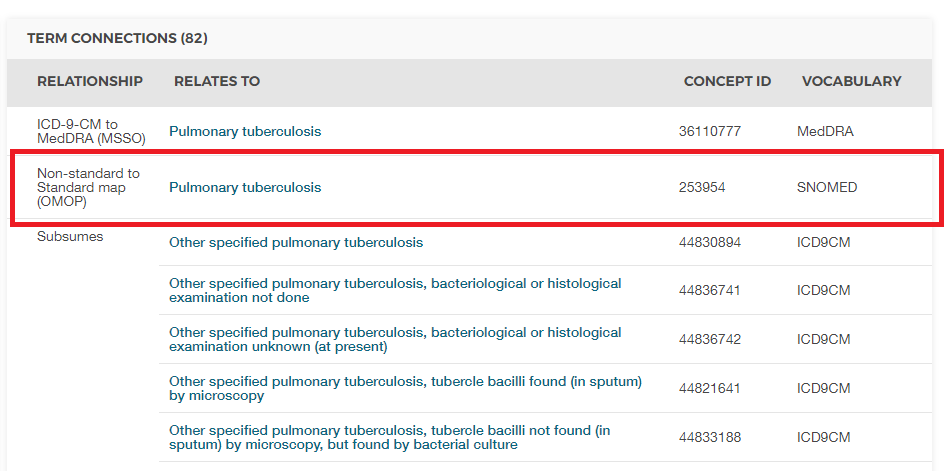

# (Part) --翻訳作業中--　統一データ表現 {-}

# 共通データモデル {#CommonDataModel}

*章担当: Clair Blacketer*

観察データは、患者が医療を受ける際に起こる出来事を示すものです。このデータは世界中でますます多くの患者について収集され、保存されるため、しばしばビッグヘルスデータと呼ばれます。これらのデータ収集の目的は三つあります：(i) 直接的に研究を支援するため（しばしば調査データや登録データの形で）、または (ii) 医療の提供をサポートするため（通常EHR - 電子健康記録と呼ばれる）、または (iii) 医療の費用を管理するため（通常、保険請求データと呼ばれる）。この三つの目的はすべて臨床研究に日常的に使用されており、後者の二つは二次利用データとして使用され、またすべての目的が独自のフォーマットやエンコーディングを持っています。 \index{Common Data Model} \index{CDM |see {Common Data Model}} \index{リレーショナルデータモデル|see {Common Data Model}}

なぜ観察医療データに共通データモデルが必要なのでしょうか？

それぞれの観察データベースは、主なニーズに応じてすべての臨床イベントを均等にキャプチャするわけではありません。したがって、研究結果は多くの異なるデータソースから引き出され、潜在的なキャプチャバイアスの影響を理解するために比較および対比されなければなりません。さらに、統計的検出力を持って結論を引き出すためには、大量の観察された患者が必要です。このため、複数のデータソースを同時に評価し分析する必要があります。これを行うためには、データを共通のデータ標準に統合する必要があります。また、患者データには高いレベルの保護が必要です。従来の方法で解析目的でデータを抽出するには、厳格なデータ使用契約と複雑なアクセス制御が必要です。共通データ標準は、この抽出ステップを省略し、標準化された解析をネイティブ環境で実行できるようにすることで、この必要性を軽減できます。データが解析に提供されるのではなく、解析がデータに提供されるのです。

この標準を提供するのが共通データモデル（CDM）です。標準化された内容（第\@ref(StandardizedVocabularies)章参照）と組み合わせたCDMは、研究方法が体系的に適用され、意味のある比較可能な再現性のある結果を生成することを保証します。この章では、データモデル自体の概要、デザイン、規約、および一部のテーブルについての考察を概説します。

CDMのすべてのテーブルの概要は、図\@ref(fig:cdmDiagram)に示されています。 \index{Common Data Model!データモデル図}

``` {r cdmDiagram, fig.cap="CDMバージョン6.0のすべてのテーブルの概要。テーブル間のすべての関係が示されているわけではありません。", echo=FALSE, out.width="100%"}
knitr::include_graphics("images/CommonDataModel/cdmDiagram.png")
```

## 設計原則

CDMは、以下の目的のために最適化されています。 \index{Common Data Model!設計原則}

* 特定の医療介入（薬物曝露、処置、医療政策の変更など）およびアウトカム（コンディション、処置、他の薬物曝露など）を持つ患者集団を特定する。
* 人口統計情報、病気の自然史、医療提供、利用および費用、併存疾患、治療および治療の順序などさまざまなパラメータに関するこれらの患者集団の特性を評価する。
* 個々の患者でこれらのアウトカムが発生する可能性を予測する - 第\@ref(PatientLevelPrediction)章参照。
* これらの介入が集団に及ぼす影響を推定する - 第\@ref(PopulationLevelEstimation)章参照。

この目標を達成するために、CDMの開発は以下の設計要素に従います：

  - **目的適合性**: CDMは、医療提供者または支払者の運用ニーズを満たす目的ではなく、分析のために最適な形でデータを提供することを目指しています。 \index{Common Data Model!目的適合性}
  - **データ保護**: 名前や正確な誕生日など、患者の身元や保護を危うくする可能性のあるすべてのデータは限定されています。乳児の研究のために正確な誕生日が必要な場合など、研究が明示的により詳細な情報を要求する場合には例外が可能です。 \index{Common Data Model!データ保護}
  - **ドメインの設計**: ドメインは、各記録について人物の識別情報と日付が最低限でキャプチャされる人中心のリレーショナルデータモデルでモデル化されています。ここで、リレーショナルデータモデルとは、データが主キーおよび外部キーでリンクされたテーブルのコレクションとして表現されるものです。
  - **ドメインの根拠**: ドメインは、分析のユースケースがある場合（たとえばコンディション）で、そのドメインが他のものには適用されない特定の属性を持つ場合に、エンティティ-リレーションシップモデルで特定され、個別に定義されます。他のすべてのデータは、エンティティ-属性-値構造の観察テーブルに保持できます。 \index{Common Data Model!ドメイン}
  - **標準化された語彙**: これらの記録の内容を標準化するために、CDMは、すべての必要かつ適切な対応する標準的な医療コンセプトを含む標準化された語彙に依存しています。
  - **既存のボキャブラリの再利用**: 可能な場合、これらのコンセプトは、国立医学図書館、退役軍人省、疾病予防管理センターなどの国立または業界の標準化やボキャブラリ定義組織やイニシアティブから利用されます。
  - **ソースコードの保持**: すべてのコードが標準化されたボキャブラリにマッピングされても、モデルは元のソースコードも保持しており、情報が失われないようにしています。 \index{Common Data Model!ソースコード} \index{Common Data Model!データ損失防止}
  - **技術の中立性**: CDMは特定の技術を要求しません。Oracle、SQL ServerなどのリレーショナルデータベースやSASの分析データセットなど、任意のリレーショナルデータベースで実現できます。 \index{Common Data Model!技術の中立性}
  - **スケーラビリティ**: CDMは、数億人の人と数十億の臨床観察を含むデータベースなど、サイズに応じてデータソースを処理および計算分析するよう最適化されています。 \index{Common Data Model!スケーラビリティ}
  - **後方互換性**: 以前のCDMからのすべての変更はgithubリポジトリ[(https://github.com/OHDSI/CommonDataModel)](https://github.com/OHDSI/CommonDataModel)に明確に示されています。古いバージョンのCDMは現在のバージョンから簡単に作成でき、以前に存在していた情報が失われることはありません。 \index{Common Data Model!後方互換性}
  
## データモデルの規約

CDMでは、暗黙的および明示的な規約がいくつか採用されています。CDMを使用して実行されるメソッドの開発者は、これらの規約を理解する必要があります。\index{共通データモデル!規約}

### モデルの一般的な規約 {#model-Conv}

CDMは「人中心」のモデルと見なされており、すべての臨床イベントのテーブルがPERSONテーブルにリンクされています。日付または開始日と組み合わせることで、個々の人に対するすべての医療関連イベントの縦断的なビューが可能になります。この規則の例外は、さまざまなドメインのイベントに直接リンクされている標準化された医療システムデータのテーブルです。

### スキーマの一般的な規約

システムによってはデータベースユーザーとも呼ばれるスキーマは、読み取り専用テーブルと読み書き可能なテーブルを分けるために使用されます。臨床イベントとボキャブラリテーブルは「CDM」スキーマにあり、最終ユーザーまたは分析ツールに対して読み取り専用と見なされます。ウェブベースのツールまたはエンドユーザーによって操作する必要があるテーブルは「結果」スキーマに格納されます。「結果」スキーマ内の2つのテーブルはCOHORTおよびCOHORT_DEFINITIONです。これらのテーブルは、ユーザーが定義する可能性のある関心のあるグループを説明するためのもので、Chapter \@ref(Cohorts)に書かれています。これらのテーブルは書き込みが可能であり、実行時にCOHORTテーブルにコホートを格納できます。すべてのユーザーに対して読み書き可能なスキーマは1つだけであるため、CDMの実装方法では複数のユーザーアクセスの管理と制御が必要です。

### データテーブルの一般的な規約

CDMはプラットフォームに依存しません。データ型はANSI SQLデータ型（VARCHAR、INTEGER、FLOAT、DATE、DATETIME、CLOB）を用いて一般的に定義されます。VARCHARには最小必要文字列長のみが指定され、具体的なCDMのインスタンス内で拡張できます。CDMは日付および日時の形式を規定しません。CDMに対する標準クエリは、ローカルインスタンスおよび日付/日時の設定によって異なる場合があります。

*注意*: データモデル自体はプラットフォームに依存しませんが、それに対応するために構築された多くのツールは特定の仕様が必要です。詳細については、Chapter \@ref(OhdsiAnalyticsTools)をご覧ください。

### ドメインの一般的な規約 {#domains}

異なる性質のイベントはドメインに整理されています。これらのイベントはドメイン固有のテーブルおよびフィールドに格納され、標準化されたボキャブラリで定義されたドメイン固有の標準コンセプトによって表現されます（セクション \@ref(conceptDomains) 参照）。 各標準コンセプトには一意のドメイン割り当てがあり、そのコンセプトが記録されるテーブルを定義します。正しいドメイン割り当てはコミュニティ内で議論の余地がありますが、この厳格なドメインテーブルフィールド対応規則により、コードやコンセプトの明確な位置が常に確保されます。例えば、症状、徴候、および診断コンセプトはコンディション・ドメインに属し、CONDITION_OCCURRENCEテーブルのCONDITION_CONCEPT_IDに記録されます。手順薬と呼ばれるものは通常、ソースデータの処置テーブルに処置コードとして記録されます。CDMでは、これらのレコードはDRUG_EXPOSUREテーブルにあります。なぜなら、マッピングされた標準コンセプトが薬剤ドメインに割り当てられているからです。ドメイン数は合計30であり、テーブル\@ref(tab:domains)に示されています。

表: (\#tab:domains) 各ドメインに属する標準コンセプトの数。

コンセプト数 | ドメインID | コンセプト数 | ドメインID
:-----------|:------------|:-----------|:-----------
1731378|Drug|183|Route
477597|Device|180|Currency
257000|Procedure|158|Payer
163807|Condition|123|Visit
145898|Observation|51|Cost
89645|Measurement|50|Race
33759|Spec Anatomic Site|13|Plan Stop Reason
17302|Meas Value|11|Plan
1799|Specimen|6|Episode
1215|Provider Specialty|6|Sponsor
1046|Unit|5|Meas Value Operator
944|Metadata|3|Spec Disease Status
538|Revenue Code|2|Gender
336|Type Concept|2|Ethnicity
194|Relationship|1|Observation Type

### コンテンツのコンセプトによる表現

CDMデータテーブル内の各レコードのコンテンツは完全に正規化され、コンセプトを通じて表現されます。コンセプトはイベントテーブルにCONCEPT_ID値として格納され、これはCONCEPTテーブルの外部キーです。CONCEPTテーブルは一般的な参照テーブルとして機能します。すべてのCDMインスタンスは、コンセプトの参照として同じCONCEPTテーブルを使用します。これにより、CDMとともにOHDSI研究ネットワークの基盤となる相互運用性の主要メカニズムが提供されます。標準コンセプトが存在しない場合や特定できない場合、CONCEPT_IDの値は0として設定されます。これは、存在しないコンセプト、不明またはマッピング不可能な値を表します。

CONCEPTテーブルのレコードには、各コンセプトに関する詳細な情報（名前、ドメイン、クラスなど）が含まれています。コンセプト、コンセプトリレーションシップ、コンセプトの祖先など、コンセプトに関連するその他の情報は、標準化ボキャブラリのテーブルに含まれています（Chapter \@ref(StandardizedVocabularies)参照）。

### フィールドの一般的な命名規約

すべてのテーブルにわたる変数名は1つの規約に従います。

表: (\#tab:fieldConventions) フィールド名の規約。

|記法|説明|
|:---|:---|
|[Event]_ID|各レコードの固有識別子で、イベントテーブル間の関係を確立する外部キーとして機能します。例えば、PERSON_IDは各個人を一意に識別します。VISIT_OCCURRENCE_IDは訪問を一意に識別します。|
|[Event]_CONCEPT_ID|CONCEPT参照テーブルの標準コンセプトレコードへの外部キーです。これはイベントの主要な表現として機能し、すべての標準化された分析の主要な基礎として機能します。たとえば、CONDITION_CONCEPT_ID = [31967](http://athena.ohdsi.org/search-terms/terms/31967)には「吐き気」のSNOMEDコンセプトの参照値が含まれます。|
|[Event]_SOURCE_CONCEPT_ID|CONCEPT参照テーブルのレコードへの外部キーです。このコンセプトは、以下のソース値と等価であり、標準コンセプトである場合、それは[Event]_CONCEPT_IDと同一です。例えば、CONDITION_SOURCE_CONCEPT_ID = [45431665](http://athena.ohdsi.org/search-terms/terms/45431665)は、Read用語「吐き気」のコンセプトを示し、同様にCONDITION_CONCEPT_IDは標準のSNOMED-CTコンセプト[31967](http://athena.ohdsi.org/search-terms/terms/31967)です。標準分析アプリケーションの場合、ソースコンセプトの使用は推奨されません。なぜなら、標準コンセプトだけがイベントの意味的内容を明確に表現し、ソースコンセプトは相互運用可能ではないためです。|
|[Event]_TYPE_CONCEPT_ID|ソース情報の出所を示す標準化された語彙内のコンセプト参照テーブルにレコードがある外部キーです。このフィールド名にもかかわらず、これはイベントの種類やコンセプトの種類ではなく、このレコードを作成したキャプチャメカニズムを宣言します。例として、DRUG_TYPE_CONCEPT_IDは、薬の記録が薬局の分配イベント（「薬局分配」）から導出されたのか、処方アプリケーション（「処方手書き」）から導出されたのかを区別します。|
|[Event]_SOURCE_VALUE|ソースデータにイベントがどのように表現されているかを反映する逐語的なコードまたはフリーテキスト文字列です。これらのソース値はデータソース間で調和されていないため、標準分析アプリケーションでの使用は推奨されていません。たとえば、CONDITION_SOURCE_VALUEには「78702」の記録が含まれ、これはドットなしの表記で書かれたICD-9コード787.02に対応する可能性があります。|

### コンセプトとソース値の違い {#concepts-Sources}

多くのテーブルには、等価な情報が複数の場所に含まれています：ソース値、ソースコンセプト、および標準コンセプトとして。

* **ソース値**は、ソースデータ内のイベントレコードの元の表現です。これらは、ICD9CM、NDC、Readなどの広く使用されているコード体系のコードであり、多くの場合、パブリックドメインです。CPT4、GPI、MedDRがASCIIコード体系のコードです。これらは短い自由テキストフレーズともなり、それらは標準化されていないか管理されていないかのいずれかです。ソース値はデータテーブル内の[Event]_SOURCE_VALUEフィールドに格納されます。
* **コンセプト**は、CDM特有のエンティティであり、臨床事実の意味を正規化します。ほとんどのコンセプトは、既存のパブリックまたは独自のコード体系に基づいていますが、その他のものは（CONCEPT_CODEが「OMOP」で始まる）新たに作成されました。コンセプトにはすべてのドメインにまたがる一意のIDがあります。
* **ソースコンセプト**は、ソースで使用されたコードを表すコンセプトです。ソースコンセプトは、既存のパブリックまたは独自のコード体系に対してのみ使用され、OMOP生成のコンセプトには使用されません。ソースコンセプトはデータテーブル内の[Event]_SOURCE_CONCEPT_IDフィールドに格納されます。
* **標準コンセプト**は、すべてのデータベースで臨床エンティティの意味を一意に定義するために使用されるコンセプトです。標準コンセプトは通常、既存のパブリックまたは独自の語彙ソースから引き出されます。標準コンセプトと同等の意味を持つ非標準コンセプトには、標準化された語ボキャブラリで標準コンセプトへのマッピングがあります。標準コンセプトは、データ・テーブルの[EVENT_SOURCE_CONCEPT_IDフィールドに格納されます。

ソース値は、便宜と品質保証（QA）目的でのみ提供されます。これらには、特定のデータソースの文脈のみで意味がある情報が含まれている可能性があります。ソース値およびソースコンセプトの使用はオプションですが、ソースデータがコード体系を使用している場合には**強く推奨**されます。一方、標準コンセプト用は**必須**です。この標準コンセプトの必須使用はすべてのCDMインスタンスが同じ言語を話すことを可能にします。例えば、Figure \@ref(fig:pulmTubICD9) で示されているように、コンディション「肺結核」（TB）のICD9CMコードは011です。

```{r pulmTubICD9, fig.cap="肺結核のICD9CMコード",echo=FALSE, out.width="75%", fig.align="center"}
knitr::include_graphics("images/CommonDataModel/pulmTubICD9.png")
```

文脈なしにコード011を見ると、UB04語彙から「病院入院（メディケアパートAを含む）」、またはDRG語彙から「合併症、併存疾患がない神経系腫瘍」と解釈できる可能性があります。ここでコンセプトID（ソースおよび標準の両方）が役立ちます。011のICD9CMコードを表すCONCEPT_ID値は[44828631](http://athena.ohdsi.org/search-terms/terms/44828631)です。これにより、ICD9CMがUB04およびDRGから区別されます。ICD9CM TBソースコンセプトは、Figure \@ref(fig:pulmTubMap) で示されるように、「非標準から標準へのマップ（OMOP）」の関係を通じて、SNOMEDボキャブラリの標準コンセプト [253954](http://athena.ohdsi.org/search-terms/terms/253954)にマッピングされる。このマッピング関係は、Read、ICD10、CIEL、MeSHコードなどについても同様であるため、標準SNOMEDコンセプトを参照する研究には、対応するすべてのソースコードが含まれることになる。

```{r pulmTubMap, fig.cap="肺結核のSNOMEDコード",echo=FALSE, out.width="100%"}

```

標準コンセプトとソースコンセプトとの関係の例を表 \@ref(tab:conditionOccurrence)に示す。

## CDM標準化テーブル

\index{共通データモデル!標準化テーブル}

CDMには16の臨床イベントテーブル、10のボキャブラリテーブル、2つのメタデータテーブル、4つのヘルスシステムデータテーブル、2つの健康経済データテーブル、3つの標準化された派生要素、および2つの結果スキーマテーブルが含まれています。 これらのテーブルはCDM Wikiで完全に仕様化されています [^cdmWikiUrl1]。

[^cdmWikiUrl1]: https://github.com/OHDSI/CommonDataModel/wiki

このテーブルが実際にどのように使用されるかを示すために、この章の残りの部分ではある1人のデータが一貫した例として使用されます。

### 実行例: 子宮内膜症

子宮内膜症は、通常女性の子宮内膜にある細胞が体の他の場所に生じる痛みを伴う状態です。重症になると、不妊症、腸や膀胱の問題を引き起こすことがあります。次のセクションでは、1人の患者のこの病気に関する体験と、それが共通データモデルでどのように表現されるかを詳述します。

```{r Lauren1, echo=FALSE, out.width="50%", fig.align="center"}
knitr::include_graphics("images/CommonDataModel/Lauren.jpg")
```

> この痛みを伴う旅のすべての段階で、どれほど痛みを感じているかを皆に納得させなければなりませんでした。

Laurenは何年も子宮内膜症の症状を経験していました。しかし、彼女が診断されるまでには卵巣内に嚢胞が破裂するまでかかりました。Laurenについての詳細は[https://endometriosis-uk.org/laurens-story](https://endometriosis-uk.org/laurens-story) で読むことができます。

### PERSONテーブル{#person}

#### Laurenについてわかっていること  {-}

* 彼女は36歳の女性です
* 彼女の誕生日は1982年3月12日です
* 彼女は白人です
* 彼女はイギリス人です

これを踏まえると、彼女のPERSONテーブルは次のようになります：

Table: (\#tab:person) PERSONテーブル。

列名|値|説明
:---------------------|:-----------|:--------------------------------------
|PERSON_ID|1|PERSON_IDはソースから直接であれ、ビルドプロセスの一部として生成されたものであれ、整数である必要があります。|
|GENDER_CONCEPT_ID|8532|女性性別を参照するコンセプトIDは[8532](http://athena.ohdsi.org/search-terms/terms/8532)です。|
|YEAR_OF_BIRTH|1982||
|MONTH_OF_BIRTH|3||
|DAY_OF_BIRTH|12||
|BIRTH_DATETIME|1982-03-12 00:00:00|時間が不明の場合は真夜中が使用されます。|
|DEATH_DATETIME|||
|RACE_CONCEPT_ID|8527|白人を参照するコンセプトIDは[8527](http://athena.ohdsi.org/search-terms/terms/8527)です。イングリッシュエスニシティは[4093769](http://athena.ohdsi.org/search-terms/terms/4093769)です。どちらも正しいですが、後者は前者に統合されます。エスニシティはRacesに一部として保存され、ETHNICITY_CONCEPT_IDでは保存されていません。|
|ETHNICITY_CONCEPT_ ID|38003564|これはヒスパニックから他の人々を区別するためのUS特有の表記です。英国の場合は、エスニシティはRACE_CONCEPT_IDに保存されています。この場合、これは使用されません。[38003564](http://athena.ohdsi.org/search-terms/terms/38003564)は「ヒスパニックではない」を表します。|
|LOCATION_ID||彼女の住所は不明です。|
|PROVIDER_ID||彼女のプライマリケア提供者は不明です。|
|CARE_SITE||彼女のプライマリケアサイトは不明です。|
|PERSON_SOURCE_ VALUE|1|通常、これはソースデータでの彼女の識別子ですが、多くの場合、それはPERSON_IDと同じです。|
|GENDER_SOURCE_ VALUE|F|実際の性別値がソースにどのように表示されるかがここに保存されます。|
|GENDER_SOURCE_ CONCEPT_ID|0|ソースで性別値がOHDSIが採用するコード体系でコード化されている場合、そのConceptがここに配置されます。たとえば、ソースで性別が「sex-F」と表示され、PCORNet語彙であるとされている場合、コンセプト[44814665](http://athena.ohdsi.org/search-terms/terms/44814665)がこのフィールドに入ります。|
|RACE_SOURCE_ VALUE|white|ソースに表示されるままの人種値がここに保存されます。|
|RACE_SOURCE_ CONCEPT_ID|0|同様にGENDER_SOURCE_CONCEPT_IDの原則が適用されます。|
|ETHNICITY_SOURCE_ VALUE|english|ソースに表示されるままのエスニティ値がここに保存されます。|
|ETHNICITY_SOURCE_ CONCEPT_ID|0|同様にGENDER_SOURCE_CONCEPT_IDの原則が適用されます。|

### OBSERVATION_PERIODテーブル {#observationPeriod}

OBSERVATION_PERIODテーブルは、少なくとも患者の人口統計、コンディション、処置、薬剤がソースシステムで記録されている時間の範囲を定義するように設計されています。期待される感度と特異度を伴う。保険データにおいては、これは通常患者の登録期間を表します。電子健康記録（EHR）では、ほとんどの医療システムが訪問される医療機関や提供者を決定しないため、これは困難です。最善の解決策として、システムに最初に記録されたエントリを観察期間の開始日として考え、最新の記録を観察期間の終了日として考えることがよくあります。

#### Laurenの観察期間はどのように定義されているのですか？{ -}

Laurenの情報がTable \@ref(tab:encounters)に示されているようにEHRシステムに記録されているとしましょう。彼女の観察期間が派生されたエンカウンターは：

Table: (\#tab:encounters) Laurenのヘルスケアエンカウンター。

エンカウンターID|開始日|終了日|タイプ|
:--------|:-----|:------|:-----------
|70|2010-01-06|2010-01-06|外来患者|
|80|2011-01-06|2011-01-06|外来患者|
|90|2012-01-06|2012-01-06|外来患者|
|100|2013-01-07|2013-01-07|外来患者|
|101|2013-01-14|2013-01-14|歩行可能|
|102|2013-01-17|2013-01-24|入院患者|

エンカウンターレコードに基づいて彼女のOBSERVATION_PERIODテーブルは次のようになるかもしれません：

Table: (\#tab:observationPeriod) OBSERVATION_PERIODテーブル。

列名|値|説明
:----------------------|:----------|:--------------------------------------
|OBSERVATION_ PERIOD_ID|1|これは通常、自動生成された値で、テーブル内の各レコードに一意の識別子を生成します。|
|PERSON_ID|1|これはPERSONテーブルでLauraのレコードへの外部キーであり、PERSONをOBSERVATION_PERIODテーブルにリンクします。|
|OBSERVATION_PERIOD_ START_DATE|2010-01-06|これは彼女の記録された最初のエンカウンターの開始日です。|
|OBSERVATION_PERIOD_ END_DATE|2013-01-24|これは彼女の記録された最後のエンカウンターの終了日です。|
|PERIOD_TYPE_ CONCEPT_ID|44814725|「Obs Period Type」コンセプトクラスのベストオプションは[44814724](http://athena.ohdsi.org/search-terms/terms/44814724)で、「ヘルスケアエンカウンターをカバーする期間」を表します。|

### VISIT_OCCURRENCE{#visitOccurrence}

VISIT_OCCURRENCEテーブルは、患者のヘルスケアシステムとの出会いに関する情報を保持します。OHDSIの専門用語では、これらを受診機関と呼び、個別のイベントと見なします。受診機関には12の主要カテゴリがあり、ヘルスケアが提供されるさまざまな状況を描写する広範な階層があります。最も一般的に記録される受診機関は、入院、外来、救急室および非医療機関の受診です。

#### Laurenのエンカウンターが訪問としてどのように表現されるか？{ -}

例として、訪問のエンカウンターをVISIT_OCCURRENCEテーブルで表現しましょう。

Table: (\#tab:visitOccurrence) VISIT_OCCURRENCEテーブル。

列名|値|説明
:---------------------|:-----------|:--------------------------------------
|VISIT_OCCURRENCE_ ID|514|これは通常、自動生成された値で、各レコードに一意の識別子を生成します。|
|PERSON_ID|1|これはPERSONテーブルでLauraのレコードにリンクする外部キーです。|
|VISIT_CONCEPT_ID|9201|入院患者訪問を参照するキーは[9201](http://athena.ohdsi.org/search-terms/terms/9201)です。|
|VISIT_START_DATE|2013-01-17|訪問の開始日です。|
|VISIT_START_ DATETIME|2013-01-17 00:00:00|訪問の日付と時間です。時間が不明なため、真夜中が使用されます。|
|VISIT_END_DATE|2013-01-24|訪問の終了日です。これは1日の訪問である場合、終了日は開始日に一致します。|
|VISIT_END_DATETIME|2013-01-24 00:00:00|訪問の終了日と時間です。時間が不明なため、真夜中が使用されます。|
|VISIT_TYPE_ CONCEPT_ID|32034|訪問レコードの出所を示します。保険請求、病院請求、EHR記録など。これらのエンカウンターがEHRレコードに似ている例として、[32035](http://athena.ohdsi.org/search-terms/terms/32035)（「EHRエンカウンターレコードから派生した訪問」）のコンセプトIDが使用されています。|
|PROVIDER_ID|NULL|エンカウンターレコードに提供者が関連付けられている場合、その提供者のIDがこのフィールドに入ります。これが提供者テーブルのPROVIDER_IDフィールドの内容である必要があります。|
|CARE_SITE_ID|NULL|エンカウンターレコードに関連するケアサイトがある場合、そのケアサイトのIDがこのフィールドに入ります。これがCARE_SITEテーブルのCARE_SITE_IDであるべきです。|
|VISIT_SOURCE_ VALUE|入院|訪問値はソースでどのように表示されるかに基づいてここに入ります。Laurenのデータにはそれがありません。|
|VISIT_SOURCE_ CONCEPT_ID|NULL|訪問値は、ソースがOHDSIによって認識されている辞書ボキャブラリを使用してコーディングされている場合、ソースコードを表すコンセプトID値がここに入ります。Laurenのデータにはそれがありません。|
|ADMITTED_FROM_ CONCEPT_ID|NULL|既知の場合、どこから患者が入院したかを表すコンセプトが含まれます。このコンセプトは「訪問」ドメインを持つべきです。例えば、患者が自宅から病院に入院した場合には、コンセプトID [8536](http://athena.ohdsi.org/search-terms/terms/8536)「自宅」が含まれます。|
|ADMITTED_FROM_ SOURCE_CONCEPT_ID|NULL|どこから患者が入院したかを表すソース値が含まれます。上記の例では「home」です。|
|DISCHARGE_TO_ CONCEPT_ID|NULL|既知の場合、どこに患者が退院したかを表すコンセプトが含まれます。このコンセプトは「訪問」ドメインを持つべきです。例えば、患者が介助生活施設に引き渡された場合、コンセプトID [8615](http://athena.ohdsi.org/search-terms/terms/8615)「介助生活施設」が含まれます。|
|DISCHARGE_TO_ SOURCE_VALUE|NULL|どこに患者が退院したかを表すソース値が含まれます。上記の例では「Assisted living facility」です。|
|PRECEDING_VIS

IT_ OCCURRENCE_ID|NULL|現在の訪問の直前の訪問を示します。ADMITTED_FROM_CONCEPT_IDとは対照的に、これは実際の訪問記録をリンクし、訪問コンセプトではなくされます。また、注意すべきは後続の訪問がないことです。|

* 患者は1回の訪問中に複数のヘルスケア提供者と交流する可能性があり、これは特に入院の場合においてよく見られます。これらの交流はVISIT_DETAILテーブルに記録されることができます。この章で詳しく取り上げられていませんが、VISIT_DETAILテーブルについては詳細を[CDM wiki](https://github.com/OHDSI/CommonDataModel/wiki/VISIT_DETAIL)で読むことができます。

### CONDITION_OCCURRENCE {#conditionOccurrence}

CONDITION_OCCURRENCEテーブルのレコードは、提供者によって観察されたか、患者によって報告された診断、徴候または症状を表します。

#### Laurenの状態は何ですか？{ -}

再度彼女のアカウントを参照すると：

> 約3年前、痛みを伴うことが頻繁で、規定の痛みを感じるようになりました。私の腸のすぐそばに鋭い刺すような痛みを感じ、尾骨や下骨盤の周りが触られると痛く、膨満感がありました。なので、私は月に1-2日職場を休むことがありました。鎮痛剤は時々痛みを和らげましたが、通常多くの効果はありませんでした。

月経痛、別名月経困難症のSNOMEDコードは266599000です。次の表では、CONDITION_OCCURRENCEテーブルでそれがどのように表されるかを示します。

Table: (\#tab:conditionOccurrence) CONDITION_OCCURRENCEテーブル。

列名|値|説明
:---------------------|:-----------|:--------------------------------------
|CONDITION_ OCCURRENCE_ID|964|これは通常、自動生成された値で、各レコードに一意の識別子を生成します。|
|PERSON_ID|1|これはPERSONテーブルでLauraのレコードにリンクする外部キーです。|
|CONDITION_ CONCEPT_ID|194696|SNOMEDコード266599000を表すキーは[194696](http://athena.ohdsi.org/search-terms/terms/194696)です。|
|CONDITION_START_ DATE|2010-01-06|状態が記録された日付です。|
|CONDITION_START_ DATETIME|2010-01-06 00:00:00|状態が記録された日付と時間です。真夜中が使用され、時間が不明です。|
|CONDITION_END_ DATE|NULL|状態が終了したと見なされる日付ですが、これはほとんど記録されていません。|
|CONDITION_END_ DATETIME|NULL|既知の場合、状態が終了したと見なされる日付と時間です。|
|CONDITION_TYPE_ CONCEPT_ID|32020|この列はレコードの出所を示すことを意図しています。たとえば、保険請求、病院請求記録、EHR記録など。|
在資料の例には「EHRエンカウンタ診断」としてコンセプトID [32020](http://athena.ohdsi.org/search-terms/terms/32020)
が使用されています。|
|CONDITION_STATUS_ CONCEPT_ID|NULL|既知の場合、これは周りの環境を意味します。たとえば、状態が「入院診断」などであれば、コンセプトIDが [4203942](http://athena.ohdsi.org/search-terms/terms/4203942) が使用されました。|
|STOP_REASON|NULL|既知の場合、ソースデータ

## 追加情報

この章では、CDMに存在するテーブルの一部の例を示し、データがどのように表示されるかを説明します。 詳細については、ウィキサイト[^cdmWikiUrl]をご覧ください。

[^cdmWikiUrl]: https://github.com/OHDSI/CommonDataModel/wiki


## まとめ

```{block2, type="rmdsummary"}
- CDMは広範囲の観察研究活動をサポートするように設計されています。

- CDMは人中心のモデルです。

- CDMはデータの構造を標準化するだけでなく、標準化されたボキャブラリを通じてコンテンツの表現も標準化します。

- ソースコードは完全な追跡可能性のためにCDM内で維持されます。

```


## 練習問題

#### 前提条件 {-}

これらの最初の練習問題のために、以前に議論されたCDMテーブルを確認する必要があり、ATHENA[^athenaCdmUrl]またはATLAS[^atlasCdmUrl]を通じて語彙内のコンセプトを調べる必要があります。

[^athenaCdmUrl]: http://athena.ohdsi.org/
[^atlasCdmUrl]: http://atlas-demo.ohdsi.org

```{exercise, exerciseJohnPerson}
ジョンは1974年8月4日生まれのアフリカ系アメリカ人男性です。この情報をエンコードするPERSONテーブルのエントリを定義してください。

```

```{exercise, exerciseJohnOp}
ジョンは2015年1月1日に現在の保険に加入しました。彼の保険データは2019年7月1日に抽出されました。この情報をエンコードするOBSERVATION_PERIODテーブルのエントリを定義してください。

```

```{exercise, exerciseJohnDrug}
ジョンは2019年5月1日にイブプロフェン200 MG経口錠剤（NDCコード：76168009520）の30日分の供給を処方されました。この情報をエンコードするDRUG_EXPOSUREテーブルのエントリを定義してください。

```

#### 前提条件 {-}

最後の3つの課題には、セクション\@ref（installR）で説明されているようにR、R-Studio、およびJavaがインストールされていることが前提となります。また、[SqlRender](https://ohdsi.github.io/SqlRender/)、[DatabaseConnector](https://ohdsi.github.io/DatabaseConnector/)、および[Eunomia](https://ohdsi.github.io/Eunomia/)パッケージも必要で、以下のコマンドでインストールできます：

```{r eval=FALSE}
install.packages(c("SqlRender", "DatabaseConnector", "remotes"))
remotes::install_github("ohdsi/Eunomia", ref = "v1.0.0")
```

Eunomiaパッケージは、ローカルのRセッション内で実行されるCDM内のシミュレートされたデータセットを提供します。接続の詳細は以下を使用して取得できます：

```{r eval=FALSE}
connectionDetails <- Eunomia::getEunomiaConnectionDetails()
```

CDMデータベーススキーマは「main」です。これはCONDITION_OCCURRENCEテーブルの一行を取得するためのSQLクエリの例です：

```{r eval=FALSE}
library(DatabaseConnector)
connection <- connect(connectionDetails)
sql <- "SELECT *
FROM @cdm.condition_occurrence
LIMIT 1;"
result <- renderTranslateQuerySql(connection, sql, cdm = "main")
```


```{exercise, exerciseGiBleedRecords}
SQLとRを使用して、「消化管出血」（コンセプトID[192671](http://athena.ohdsi.org/search-terms/terms/192671)）のすべてのレコードを取得してください。

```

```{exercise, exercisePersonSource}
SQLとRを使用して、ソースコードを使用して「消化管出血」のすべてのレコードを取得してください。このデータベースはICD-10を使用しており、関連するICD-10コードは「K92.2」です。

```

```{exercise, exercisePerson61Records}
SQLとRを使用して、PERSON_ID 61の人物の観察期間を取得してください。

```

提案される答えは付録\@ref（Cdmanswers）にあります。
