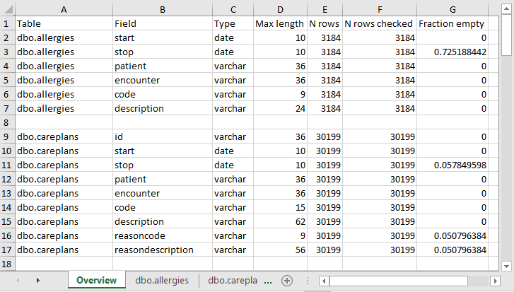
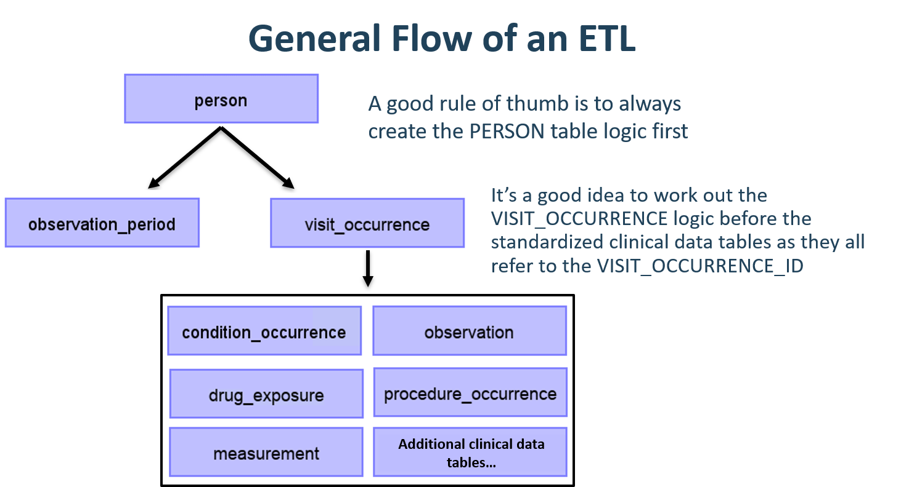
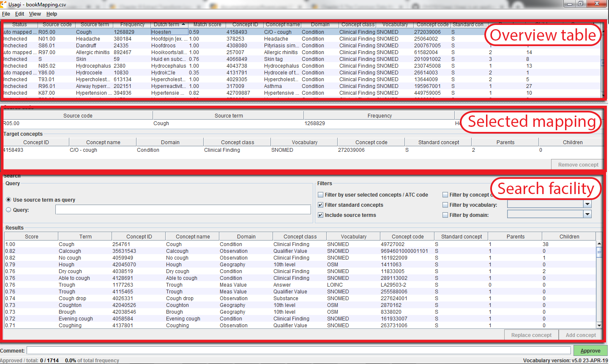

# ETL（抽出-変換-読込） {#ExtractTransformLoad}

*著者: Clair Blacketer & Erica Voss*

## はじめに

ネイティブ/生データからOMOP共通データモデル（CDM）を作成するには、ETL（抽出-変換-読込）プロセスを作成する必要があります。このプロセスでは、データをCDMに再構築し、標準化ボキャブラリにマッピングを追加する必要があります。通常、このプロセスは、例えばSQLスクリプトのような自動化されたスクリプトのセットとして実装されます。このETLプロセスは繰り返し実行できることが重要です。これにより、ソースデータが更新されるたびに再実行することができます。\index{ETL|see {抽出、変換、ロード（ETL）}} \index{生データ} \index{ネイティブデータ|see {生データ}} \index{ソースデータ|see {生データ}}

ETLの作成は通常、大規模な取り組みとなります。長年にわたり、私たちは以下の4つの主要なステップからなるベストプラクティスを開発してきました：

1.  データの専門家とCDMの専門家が共同でETLをデザインする。
2.  医学的知識を持つ人がコードのマッピングをする。
3.  技術者がETLを実装する。
4.  全員が品質管理に関与する。

本章では、これらのステップをそれぞれ詳しく説明します。OHDSIコミュニティでは、これらのステップの一部をサポートするツールがいくつか開発されており、それらについても説明します。本章の最後に、CDMとETLのメンテナンスについて説明します。

## ステップ 1: ETLのデザイン

ETLのデザインと実装を明確に区別することが重要です。ETLのデザインにはソースデータとCDMの両方に関する広範な知識が必要です。一方、ETLの実装は通常、ETLを計算効率的に行うための技術的専門知識に大きく依存します。両方を同時に行おうとすると、細部にこだわってしまい、全体像に集中できなくなることがあります。

ETLデザインプロセスを支援するために密接に統合された2つのツールが開発されました：White RabbitとRabbit-in-a-Hatです。

### White Rabbit

データベースでETLプロセスを開始するには、データ（テーブル、フィールド、内容など）を理解する必要があります。そこで登場するのが[White Rabbit](https://github.com/OHDSI/WhiteRabbit)ツールです。White Rabbitは、縦断的な医療データベースのETLを[OMOP CDM](https://github.com/OHDSI/CommonDataModel)用に準備するためのソフトウェアツールです。White Rabbitはデータをスキャンし、ETLのデザインを開始するために必要なすべての情報を含むレポートを作成します。全てのソースコードとインストール手順、マニュアルへのリンクはGitHubで入手可能です[^extracttransformload-1]。\index{White Rabbit} \index{data profiling|see {White Rabbit}}

[^extracttransformload-1]: <https://github.com/OHDSI/WhiteRabbit>.

#### 範囲と目的 {.unnumbered}

White Rabbitの主な機能は、ソースデータをスキャンし、テーブル、フィールド、フィールドに表示される値に関する詳細な情報を提供することです。ソースデータは、カンマ区切りのテキストファイルやデータベース（MySQL、SQL Server、Oracle、PostgreSQL、Microsoft APS、Microsoft Access、Amazon Redshift）に保存される必要があります。スキャンによって、例えばRabbit-In-a-Hatツールと併用して、ETLデザイン時に参照用として使用できるレポートが作成されます。White Rabbitは標準的なデータプロファイリングツールとは異なり、生成された出力データファイルに個人識別情報（PII）を表示しないようにします。

#### プロセス概要 {.unnumbered}

ソフトウェアを使用してソースデータをスキャンする一般的な手順は以下の通りです：

1.  作業フォルダを設定します。作業フォルダは、結果がエクスポートされるローカルのデスクトップコンピュータ上の場所です。
2.  ソースデータベースまたはCSVテキストファイルに接続し、接続をテストします。
3.  スキャン対象のテーブルを選択し、テーブルをスキャンします。
4.  White Rabbitがソースデータに関する情報をエクスポートします。

#### 作業フォルダの設定 {.unnumbered}

White Rabbitアプリケーションをダウンロードしてインストールした後、まず最初に作業フォルダを設定する必要があります。White Rabbitが作成するすべてのファイルはこのローカルフォルダにエクスポートされます。図\@ref(fig:WhiteRabbitLocation)に示されている「Pick Folder（フォルダの選択）」ボタンを使用して、スキャン文書を保存するローカル環境をナビゲートします。

```{r WhiteRabbitLocation, fig.cap='White Rabbitアプリケーションの作業フォルダを指定するための「Pick Folder」ボタン',echo=FALSE, out.width='100%', fig.align='center'}
knitr::include_graphics("images/ExtractTransformLoad/WhiteRabbitLocation.png")
```

#### データベースへの接続 {.unnumbered}

White Rabbitは区切りテキストファイルとさまざまなデータベースプラットフォームをサポートしています。各フィールドにマウスカーソルを合わせると、必要な情報が表示されます。詳細についてはマニュアルをご覧ください。

#### データベース内のテーブルをスキャン {.unnumbered}

データベースに接続後、含まれるテーブルをスキャンできます。スキャンによりETLのデザインに役立つ情報を含むレポートが生成されます。図 \@ref(fig:WhiteRabbitAddTables)に示されたスキャンタブを使用して、「Add」（Ctrl + マウスクリック）をクリックして選択したソースデータベース内の個々のテーブルを選択するか、データベース内のすべてのテーブルを自動的に選択する「Add all in DB」ボタンをクリックできます。

```{r WhiteRabbitAddTables, fig.cap='White Rabbit スキャンタブ', echo=FALSE, out.width='100%', fig.align='center'}
knitr::include_graphics("images/ExtractTransformLoad/WhiteRabbitAddTables.png")
```

スキャンにはいくつかの設定オプションもあります：

-   「フィールド値をスキャン」をチェックすると、列に表示される値を調査したいことを WhiteRabbit に通知します。
-   「最小セル数」はフィールド値のスキャン時のオプションです。デフォルトでは5に設定されており、ソースデータで5回未満しか表示されない値は報告に表示されません。個別のデータセットには、この最小セル数に関する独自のルールがある場合があります。
-   「テーブルあたりの行数」はフィールド値のスキャン時のオプションです。デフォルトでは、White Rabbitはテーブル内の100,000行をランダムに選択してスキャンします。

すべての設定が完了したら、「テーブルをスキャン」ボタンをクリックします。スキャンが完了すると、レポートが作業フォルダに書き込まれます。

#### スキャンレポートの解釈 {.unnumbered}

スキャンが完了すると、選択したフォルダにスキャンしたテーブルごとにタブが設けられたExcelファイルが作成されます。 また、概要タブも用意されています。 概要タブには、スキャンしたすべてのテーブル、各テーブルの各フィールド、各フィールドのデータタイプ、フィールドの最大長、テーブルの行数、スキャンした行数、各フィールドが空欄であることが判明した頻度が記載されています。図 \@ref(fig:ScanOverviewTab) は、概要タブの例を示しています。

```{r ScanOverviewTab, fig.cap="スキャンレポートのサンプル概要タブ", echo=FALSE, out.width='100%', fig.align='center'}

```

各テーブルのタブには、各フィールド、各フィールド内の値、各値の頻度が示されます。各ソーステーブルの列は、Excelに2つの列を生成します。1つの列には、「最小セルカウント」がスキャン時に設定された値よりも大きいすべての異なる値がリストされます。一意の値のリストが切り捨てられた場合、リストの最後の値は「リストが切り捨てられました」となります。これは、「最小セルカウント」に入力された数値よりも少ない数の追加の一意のソース値が1つ以上存在することを示します。各一意の値の隣には、2番目の列として頻度（サンプルに含まれるその値の回数）が表示されます。この2つの列（一意の値と頻度）は、ワークブックでプロファイルされたテーブル内のすべてのソース列に対して繰り返されます。

```{r scanSex, fig.cap="単一列のサンプル値", echo=FALSE, out.width='30%', fig.align='center'}
knitr::include_graphics("images/ExtractTransformLoad/ScanSex.png")
```

レポートはソースデータを理解するのに強力であり、存在するものを強調して表示します。例えば、図\@ref(fig:scanSex)に示された結果がスキャンされたテーブルの「Sex」列に戻された場合、2つの共通値（1と2）がそれぞれ61,491回と35,401回出現したことが分かります。White Rabbitは1を男性、2を女性として定義することはなく、データホルダーが通常、ソースシステムに固有のソースコードを定義する必要があります。しかし、このリストが切り捨てられていることから、データにはこの2つの値（1と2）だけが存在しているわけではないことが分かります。これらの他の値は、「最小セル数」で定義されるように、非常に低い頻度でしか現れず、不正確な値や非常に疑わしい値であることがよくあります。ETLを生成する際には、高頻度の性別コンセプト1と2だけでなく、この列に存在するその他の頻度の低い値も処理できるように計画する必要があります。例えば、低頻度の性別が「NULL」であった場合、ETLがそのデータを処理でき、その状況で何をすべきかを知っていることを確認する必要があります。

### Rabbit-In-a-Hat

White Rabbitスキャンを手にすると、ソースデータの全体像やCDMの仕様が掴めます。次に、これら2つの間の論理を定義する必要があります。この設計作業には、ソースデータとCDMの両方に関する深い知識が必要です。White Rabbitソフトウェアと共に提供されるRabbit-in-a-Hatツールは、これらの分野の専門家チームをサポートするように特別にデザインされています。典型的な設定では、ETL設計チームが一堂に会し、Rabbit-in-a-Hatをスクリーンに映し出します。最初のラウンドでは、テーブル間のマッピングを共同で決定し、その後、フィールド間のマッピングを設計し、値が変換されるロジックを定義します。\index{Rabbit-In-A-Hat} \index{ETL design|see {Rabbit-In-A-Hat}}

#### 範囲と目的 {.unnumbered}

Rabbit-In-a-HatはWhite Rabbitのスキャン文書を読み取り、表示するように設計されています。White Rabbitはソースデータに関する情報を生成し、Rabbit-In-a-Hatはその情報を使用して、グラフィカルユーザーインターフェイスを通じて、ユーザーがソースデータをCDMのテーブルとカラムに接続できるようにします。Rabbit-In-a-HatはETLプロセスのドキュメントを生成しますが、ETLを作成するコードは生成しません。

#### プロセス概要 {.unnumbered}

このソフトウェアを使用してETLのドキュメントを生成する一般的な手順は以下の通りです：

1.  White Rabbitのスキャン結果を完了させます。
2.  スキャン結果を開くと、インターフェースにソーステーブルとCDMテーブルが表示されます。
3.  ソーステーブルが対応するCDMテーブルに情報を提供する場合は、ソーステーブルをCDMテーブルに接続します。
4.  各ソーステーブルからCDMテーブルへの接続について、ソース列とCDM列の詳細でさらに定義します。
5.  Rabbit-In-a-Hatの作業内容を保存し、MS Word文書にエクスポートします。

#### ETLロジックの記述 {.unnumbered}

White RabbitスキャンレポートをRabbit-In-a-Hatで開くと、ソースデータをOMOP CDMに変換する方法のロジックの設計と記述する準備が整ったことになります。次のセクションでは、Synthea[^extracttransformload-2]データベースのいくつかのテーブルが変換中にどのように見えるかを例示します。

[^extracttransformload-2]: Synthea^TM^は実際の患者をモデル化することを目的とした患者ジェネレーターです。データはアプリケーションに渡されたパラメータに基づいて作成されます。データの構造については、こちら：<https://github.com/synthetichealth/synthea/wiki> をご覧ください。

#### ETLの一般的なフロー {.unnumbered}

CDMは人を中心としたモデルであるため、PERSONテーブルのマッピングを最初に始めることが常に良い方法です。すべての臨床イベントテーブル（CONDITION_OCCURRENCE、DRUG_EXPOSURE、PROCEDURE_OCCURRENCEなど）は、person_idを介してPERSONテーブルを参照するため、最初にPERSONテーブルのロジックを構築しておくと、後で作業が容易になります。PERSONテーブルの次に、OBSERVATION_PERIODテーブルを変換するのが良い方法です。CDMデータベースの各人には少なくとも1つのOBSERVATION_PERIODがあり、通常、ほとんどのイベントはこの期間内に発生します。PERSONテーブルとOBSERVATION_PERIODテーブルが完了したら、次にPROVIDER、CARE_SITE、LOCATIONなどのディメンショナルテーブルが通常は続きます。臨床テーブルの前に作成すべき最後のテーブルロジックはVISIT_OCCURRENCEです。これはETL全体で最も複雑なロジックであることが多くまた、患者の旅の過程で発生するほとんどのイベントはビジット時に発生するため、最も重要なものの1つです。これらのテーブルが完了したら、どのCDMテーブルをどのような順序でマッピングするかは実施者の選択にゆだねられます。

```{r etlFlow, fig.cap="ETLの一般的なフローと、最初にマッピングするテーブル", echo=FALSE, out.width='100%', fig.align='center'}

```

CDM変換中に中間テーブルの作成が必要になることがよくあります。これは、イベントに正しいVISIT_OCCURRENCE_IDを割り当てるため、またはソースコードを標準コンセプトにマッピングするためです（このステップをその場で実行すると非常に時間がかかることがよくあります）。中間テーブルは100％許可され推奨されています。ただし、変換が完了した後にこれらの中間テーブルを永続的に使用し続け、それらに依存することは推奨されません。

#### マッピング例：Personテーブル {.unnumbered}

Syntheaデータ構造にはpatientsテーブルに20のカラムがありますが、図\@ref(fig:syntheaPerson) に示されているように、すべてがPERSONテーブルを埋めるために必要というわけではありません。これは非常に一般的であり、心配する必要はありません。この例では、CDM PERSONテーブルで使用されていないSynthea patientsテーブルのデータポイントの多くは患者名、運転免許証番号、パスポート番号などの追加識別子です。

```{r syntheaPerson, fig.cap='Synthea PatientsテーブルからCDM PERSONテーブルへのマッピング',echo=FALSE, out.width='100%', fig.align='center'}
knitr::include_graphics("images/ExtractTransformLoad/syntheaPersonTable.png")
```

表 \@ref(tab:syntheaEtlPerson) には、Synthea patientsテーブルをCDM PERSONテーブルに変換するために適用されたロジックを示しています。『Destination Field』（変換先フィールド）は、CDMのどこにデータがマッピングされるかを示しています。『Source field』（変換元フィールド）では、CDMカラムにデータを入力するのに使用されるソーステーブル（この場合はpatients）のカラムを強調して表示しています。最後に、『Logic & comments』（ロジックとコメント）カラムには、ロジックの説明が記載されています。

| 目的フィールド | ソースフィールド | ロジックとコメント |
|:---|:---|:---|
| PERSON_ID |  | 自動生成。 PERSON_IDは実装時に生成されます。これは、ソースのid値がvarchar値であるのに対し、PERSON_IDは整数であるためです。 ソースからのidフィールドは、その値を保持し、必要に応じてエラーチェックを行うためにPERSON_SOURCE_VALUEとして設定されます。 |
| GENDER_CONCEPT_ID | gender | 性別が「M」の場合、GENDER_CONCEPT_IDは8507、性別が「F」の場合は8532に設定します。性別不明の行は削除します。これらの2つのコンセプトは、性別ドメインの唯一の標準コンセプトであるため選択されました。性別不明の患者を削除するかどうかの決定は、通常、施設で行われる傾向がありますが、性別不明の人は分析から除外されるため、削除することが推奨されます。 |
| YEAR_OF_BIRTH | birthdate | 生年月日から年を取得します。 |
| MONTH_OF_BIRTH | birthdate | 生年月日から月を取得します。 |
| DAY_OF_BIRTH | birthdate | 生年月日から日を取得します。 |
| BIRTH_DATETIME | birthdate | 0時を00:00:00とします。ここでは、ソースが出生時間を指定していないため、深夜を出生時間として設定しました。 |
| RACE_CONCEPT_ID | race | race = 'WHITE'の場合は8527、race = 'BLACK'の場合は8516、race = 'ASIAN'の場合は8515、それ以外の場合は0として設定します。これらのコンセプトが選択されたのは、人種ドメインに属する標準コンセプトであり、ソース内の民族カテゴリーに最も近いためです。 |
| ETHNICITY\_ CONCEPT_ID | race ethnicity | race = 'HISPANIC'、または民族が ('CENTRAL_AMERICAN'、'DOMINICAN'、'MEXICAN'、'PUERTO_RICAN'、'SOUTH_AMERICAN') の場合、38003563 と設定し、それ以外の場合は 0 に設定します。これは、複数のソース列が 1 つの CDM 列にどのように影響するかを示す良い例です。CDM では、民族は ヒスパニックまたは非ヒスパニック として表されるため、ソース列 race とソース列ethnicityの両方の値がこの値を決定します。 |
| LOCATION_ID |  |  |
| PROVIDER_ID |  |  |
| CARE_SITE_ID |  |  |
| PERSON_SOURCE\_ VALUE | id |  |
| GENDER_SOURCE\_ VALUE | gender |  |
| GENDER_SOURCE\_ CONCEPT_ID |  |  |
| RACE_SOURCE\_ VALUE | race |  |
| RACE_SOURCE\_ CONCEPT_ID |  |  |
| ETHNICITY\_ SOURCE_VALUE | ethnicity | この場合、ETHNICITY_SOURCE_VALUEはETHNICITY_CONCEPT_IDよりも詳細な値となります。 |
| ETHNICITY\_ SOURCE_CONCEPT_ID |  |  |

: (#tab:syntheaEtlPerson) Synthea PatientsテーブルをCDM PERSONテーブルに変換するためのETLロジック

SyntheaデータセットがCDMにどのようにマッピングされたかについては、仕様書全文をご覧ください[^extracttransformload-3]。

[^extracttransformload-3]: <https://ohdsi.github.io/ETL-Synthea/>

## ステップ2: コードマッピングの作成

OMOPボキャブラリには、常にソースコードが追加されています。これは、CDMにデータを変換する際のコーディングシステムが既に含まれており、マッピングされている可能性があることを意味します。含まれているボキャブラリは、OMOPボキャブラリのVOCABULARYテーブルを確認ください。非標準のソースコード（例：ICD-10CMコード）から標準コンセプト（例：SNOMEDコード）へのマッピングを抽出するには、relationship_id =「Maps to」を持つCONCEPT_RELATIONSHIPテーブルのレコードを使用できます。例えば、ICD-10CMコード「I21」（「急性心筋梗塞」）の標準コンセプトIDを特定するには、次のSQLを使用します：

``` sql
SELECT concept_id_2 AS standard_concept_id
FROM concept_relationship
INNER JOIN concept AS source_concept
  ON concept_id = concept_id_1
WHERE concept_code = 'I21'
  AND vocabulary_id = 'ICD10CM'
  AND relationship_id = 'Maps to';
```

| STANDARD_CONCEPT_ID |
|--------------------:|
|              312327 |

残念ながら、ソースデータがボキャブラリに含まれていないコーディングシステムを使用している場合もあります。この場合、ソースコーディングシステムから標準コンセプトへのマッピングを作成する必要があります。コードマッピングは特にソースコーディングシステムに多くのコードが含まれている場合に、困難な作業となる可能性があります。作業を用意にするために、以下の方法があります：

-   最も頻繁に使用されるコードに焦点を当てる。使用されることのないコードや使用頻度の低いコードは、実際の研究では使用されることがないため、マッピングする価値はありません。
-   可能な限り既存の情報を活用しましょう。例えば、多くの国の医薬品コードはATCにマッピングされています。ATCは多くの目的に対して詳細さに欠けますが、ATCとRxNormのコンセプトの関係性を利用することで適切なRxNormコードを推測することができます。
-   Usagiを使用しましょう。

### Usagi

Usagiはコードマッピングを手動で作成するプロセスを支援するツールです。コードの記述のテキスト類似性に基づいて、マッピングの候補を作成することができます。ソースコードが外国語でしか利用できない場合、Google翻訳[^extracttransformload-4]は驚くほど正確な翻訳結果を提示することが多いことがわかっています。Usagiは自動提案が適切でない場合に、適切なターゲットコンセプトを検索する機能を提供します。最終的に、ユーザーはETLで使用することが承認されたマッピングを指定することができます。UsagiはGitHubで入手できます[^extracttransformload-5]。 \index{Usagi} \index{source code mapping|see {Usagi}}

[^extracttransformload-4]: <https://translate.google.com/>

[^extracttransformload-5]: <https://github.com/OHDSI/Usagi>

#### 範囲と目的 {.unnumbered}

マッピングが必要なソースコードはUsagiに読み込みます（コードが英語でない場合は追加の翻訳列が必要です）。用語の類似性アプローチを使用してソースコードをボキャブラリコンセプトに紐づけします。ただし、これらのコードの紐づけは手動で確認する必要があり、Usagiはこれを容易にするためのインターフェースを提供します。Usagiはボキャブラリで標準コンセプトとしてマークされているコンセプトのみを提案します。

#### プロセス概要 {.unnumbered}

このソフトウェアを使用する一般的な手順は次のとおりです：

1.  マッピングしたいソースシステムからソースコードを読み込みます。
2.  Usagiは用語の類似性アプローチを実行してソースコードをボキャブラリコンセプトにマッピングします。
3.  Usagiのインターフェースを利用して、自動提案の正しさを確認し、必要に応じて改善します。コードシステムと医療用語に精通した担当者によるレビューが推奨されます。
4.  ボキャブラリのSOURCE_TO_CONCEPT_MAPにマッピングをエクスポートします。

#### ソースコードをUsagiにインポート {.unnumbered}

ソースコードをCSVまたはExcel (.xlsx) ファイルにエクスポートします。これには、ソースコードと英語のソースコードの説明を含む列が必要ですが、コードに追加する情報（例：用量単位、翻訳されている場合は元の言語での説明）もインポートできます。さらに、コードの使用頻度も引き継ぐことが望ましく、これはマッピングに最も労力を割くべきコードの優先順位付けに役立つためです（（例：1000件のソースコードがあっても、システム内で実際に使用されているのは100件だけかもしれません）。ソースコードを英語に翻訳する必要がある場合は、Google翻訳を使用ください。

注意事項: ソースコードの抽出はドメインごとに分けて行い、1つの大きなファイルにまとめないでください（例：薬剤、プロシージャー（処置）、状態・疾患（コンディション）、オブザベーション（観察））。

ソースコードはFile → Import codesメニューからUsagiに読み込まれます。ここでは「Import codes …」が表示されます（図\@ref(fig:usagiImport)）。この図では、ソースコードの用語はオランダ語で、英語にも翻訳されています。Usagiは英語の翻訳を利用して標準ボキャブラリにマッピングします。

```{r usagiImport, fig.cap="Usagiコード入力画面", echo=FALSE, out.width='100%', fig.align='center'}
knitr::include_graphics("images/ExtractTransformLoad/usagiImport.png")
```

「Column mapping」セクション（左下）では、インポートしたテーブルをUsagiに対してどのように使用するかを定義します。ドロップダウンメニューにマウスを合わせると、それぞれの列の定義が表示されるポップアップが表示されます。Usagiは「Additional info」列をソースコードとボキャブラリコンセプトコードを関連付けるための情報として使用しませんが、この追加情報はソースコードマッピングを確認する際に役立つ場合があるため、含めるべきでしょう。

最後に、「Filters」セクション（右下）では、Usagiがマッピングする際の制限をいくつか設定できます。例えば、図\@ref(fig:usagiImport)では、ユーザーはソースコードをコンディションドメインのコンセプトのみにマッピングしています。デフォルトでは、Usagiは標準コンセプトのみにマッピングしますが、「Filter standard concepts」オプションをオフにすると、分類コンセプトも考慮されます。各フィルターについての追加情報は、異なるフィルター上にマウスカーソルを移動させます。

特別なフィルターとして「Filter by automatically selected concepts / ATC code」があります。検索を制限する情報がある場合、CONCEPT_IDSのリストまたはATCコードをAuto concept ID列で指定された列に記述することで、検索を制限することができます（セミコロンで区切ります）。例えば、医薬品の場合、各医薬品にすでにATCコードが割り当てられている場合があります。ATCコードはRxNormの医薬品コードを一意に識別するものではありませんが、ボキャブラリのATCコードに該当するコンセプトのみに検索対象を限定するのに役立ちます。ATCコードを使用するには、以下の手順に従います。：

1.  Column mappingセクションで、"Auto concept ID column"から"ATC column"に切り替えます。
2.  Column mappingセクションで、ATCコードを含む列を"ATC column"として選択します。
3.  フィルターセクションで「ユーザーが選択したコンセプト/ATCコードによるフィルター」をオンにします。

ATCコード以外の情報源を使用して制限することもできます。上図の例では、UMLSから派生した部分的なマッピングを使用してUsagiの検索を制限しています。この場合、"Auto concept ID column" を使用する必要があります。

すべての設定が完了したら、"Import" ボタンをクリックしてファイルをインポートします。ファイルのインポートには、ソースコードをマッピングするためにボキャブラリの類似性アルゴリズムが実行されるため、数分かかります。

#### ソースコードからボキャブラリへのコンセプトマップの確認 {.unnumbered}

ソースコードの入力ファイルをインポートすると、マッピング処理が始まります。図 \@ref(fig:usagiOverview) では、Usagi の画面は、コンセプトテーブル、選択されているマッピング・セクション、 検索を実行する場所の 3 つの主要な部分で構成されていることがわかります。いずれのテーブルでも、右クリックで表示/非表示の列を選択でき、視覚的な複雑さを軽減できます。

```{r usagiOverview, fig.cap="Usagiでのソースコード入力画面", echo=FALSE, out.width='100%', fig.align='center'}

```

#### 提案されたマッピングの承認 {.unnumbered}

「概要テーブル」には、ソース・コードとコンセプトの現在のマッピングが表示されます。ソース・コードをインポートした直後は、このマッピングには、ボキャブラリの類似性と任意の検索オプションに基づいて自動的に生成されたマッピング候補が含まれます。図 \@ref(fig:usagiOverview) の例では、ユーザーがドメインをコンディションに限定しているため、オランダ語のコンディションコードの英語名がコンディションドメインの標準コンセプトにマッピングされています。Usagi は、ソースコードの説明とコンセプト名および同義語を比較して、最適な一致を見つけます。ユーザは "Include source terms" (ソース用語を含める) を選択していたため、Usagi は、特定のコンセプトにマッピングされるボキャブラリ内のすべてのソースコンセプトの名前と同義語も考慮しました。Usagi がマッピングできない場合は、CONCEPT_ID = 0 にマッピングされます。

ソース・コードを関連する標準ボキャブラリにマッピングする際には、コーディング・システムの経験がある人が支援することをお勧めします。その担当者は、"Overview Table" （概要テーブル） のコードごとに作業して、Usagi が提案したマッピングを受け入れるか、新しいマッピングを選択します。例えば、図 \@(ref:fig:usagiOverview) では、オランダ語の "Hoesten" は英語の "Cough" (咳嗽）に翻訳されています。Usagiは "Cough" を使って、"4158493-C/O - cough "というボキャブラリコンセプトにマッピングしました。このマッチしたペアのマッチングスコアは0.58でした（マッチングスコアは通常0～1で、1は確実に一致することを意味します）。一致スコア0.58は、Usagiがオランダ語のコードをSNOMEDにどの程度うまくマッピングできたかについて、あまり確信がないことを意味します。このマッピングで問題ないと思われる場合は、画面右下の緑色の"Approve (承認)" ボタンを押すことで、このマッピングを承認することができます。

#### 新しいマッピングの検索 {.unnumbered}

Usagiがマップを提案した場合、ユーザはより良いマッピングを見つけるか、マップをコンセプトなし（CONCEPT_ID = 0）に設定する必要があります。図 \@ref(fig:usagiOverview)の例では、オランダ語の 「Hoesten」を 「Cough」と訳しています。Usagiの提案は、UMLSから自動的に導出されたマッピングで識別されたコンセプトによって制限されており、結果は最適ではないかもしれません。検索機能では、実際のボキャブラリ自体または検索ボックスのクエリを使用して、他のコンセプトを検索することができます。

手動の検索ボックスを使用する場合、Usagiはあいまい検索を使用し、ANDやORのような論理演算子はサポートしていないことに留意する必要があります。

例を続けると、より適切なマッピングを見つけるために「Cough」という検索語を使用したとします。検索機能の「クエリ」セクションの右側には「フィルタ」セクションがあり、検索語を検索する際にボキャブラリから結果を絞り込むオプションがあります。この場合、標準コンセプトのみを検索したいことが分かっているため、標準コンセプトにマッピングされているボキャブラリ内のソースコンセプトの名前と同義語に基づいてコンセプトを検索することも可能です。

これらの検索条件を適用すると、「254761-Cough」が見つかり、これがオランダ語のコードにマッピングする適切なボキャブラリコンセプトであることが分かります。そのため、「Selected Source Code（選択されたソースコード）」 セクションの更新後に表示される 「Replace concept （コンセプトを置換する）」 ボタンを押し、「Approve (承認)」 ボタンを押します。また、「Add concept (コンセプトの追加)」 ボタンもあり、複数の標準化ボキャブラリのコンセプトを 1 つのソースコードにマッピングすることができます。(例えば、ソースコードによっては、複数の疾患をひとまとめにしている場合がありますが、標準化ボキャブラリではひとまとめにしていない場合があります）。

#### コンセプト情報 {.unnumbered}

マッピングする適切なコンセプトを探す場合、コンセプトの「社会性」を考慮することが重要です。コンセプトの意味は、そのコンセプトの階層における位置に部分的に依存することがあります。また、ボキャブラリの中には、階層関係がほとんどない、あるいは全くない「孤立したコンセプト」が存在することがあり、それらはターゲットにするコンセプトとしては適していません。また、Usagiは概念の親子関係の数を頻繁に報告しますが、ALT + Cキーを押すか、上部メニューバーのview （閲覧）-\> Concept information (コンセプト情報) を選択することで、より多くの情報を表示することもできます。

```{r usagiConceptInfo, fig.cap="Usagi コンセプト情報パネル", echo=FALSE, out.width='100%', fig.align='center'}
knitr::include_graphics("images/ExtractTransformLoad/usagiConceptInfo.png")
```

図 \@ref(fig:usagiConceptInfo) は、コンセプト情報パネルを示しています。このパネルには、コンセプトに関する一般的な情報、親、子、そのコンセプトにマッピングされるその他のソースコードが表示されます。このパネルを使用して階層を移動し、別のターゲット・コンセプトを選択することができます。

すべてのコードがチェックされるまで、コードごとにこのプロセスを続行します。画面上部のソースコードのリストで、列見出しを選択すると、コードを並べ替えることができます。通常、頻度の高いコードから低いコードに並べ替えることをお勧めします。画面左下には、マッピングが承認されたコードの数と、そのコードの出現回数が表示されます。

マッピングにコメントを追加することもでき、マッピングがどのように決定されたのかを記録するのに役立ちます。

#### ベスト・プラクティス {.unnumbered}

-   コーディングスキームの経験がある人に参加してもらってください。
-   列名をクリックすると、「コンセプトテーブル」の列を並べ替えることができます。"Match Score (マッチングスコア)"で並べ替えると、Usagiが最も信頼するコードを最初に確認でき、かなりの数のコードを迅速に除外できる可能性があります。また、"Frequency (頻度)" での並べ替えも重要です。頻度に利用されるコードとそうでないコードに重点的に取り組むことが重要です。
-   場合によっては、CONCEPT_ID = 0にマッピングしても問題ありませんが、一部のコードは適切なマッピングが見つからず、また、一部のコードは適切なマッピングがないだけかもしれません。
-   コンセプトの文脈、特にその親と子を考慮することが重要です。

#### Usagiで作成されたマッピングのエクセウポート {.unnumbered}

USAGI 内でマッピングしたら、それをエクスポートしてボキャブラリ SOURCE_TO_CONCEPT_MAP テーブルに追加するのが、次に進むための最良の方法です。

マッピングをエクスポートするには、File (ファイル) -\> Export source_to_concept_map (ソースからコンセプトへのマッピングをエクセウポート) を選択します。どのSOURCE_VOCABULARY_IDを使用するかを尋ねるポップアップが表示されるので、短いID (識別子) を入力ください。UsagiはこのIDをSOURCE_VOCABULARY_IDとして使用し、SOURCE_TO_CONCEPT_MAPテーブルで特定のマッピングを識別できるようにします。

SOURCE_VOCABULARY_IDを選択後、出力したCSVに名前を付けて保存します。出力したCSVの構造はSOURCE_TO_CONCEPT_MAPテーブルの構造と同じです。このマッピングは、ボキャブラリのSOURCE_TO_CONCEPT_MAPテーブルに追加できます。また、上記の手順で定義したSOURCE_VOCABULARY_IDを定義するVOCABULARYテーブルに単一の行を追加することも意味があります。最後に、「Approved (承認)」ステータスのマッピングのみがCSVファイルにエクスポートされることに留意ください。マッピングをエクスポートするには、USAGIでマッピングを完了する必要があります。

#### Usagiで作成されたマッピングの更新 {.unnumbered}

多くの場合、マッピングは一度だけの作業ではありません。データが更新されると、新しいソースコードが追加され、ボキャブラリが定期的に更新されるため、マッピングの更新が必要になる場合があります。

ソース・コードのセットが更新された場合は、次の手順で更新できます。

1.  新しいソースコードファイルをインポートします。
2.  File (ファイル) -\> Apply previous mapping (以前のマッピングを適用する) を選択します。
3.  古いマッピングから引き継いだ承認済みのマッピングを継承していないコードを特定し、それらを通常通りマッピングします。

ボキャブラリが更新された場合は、以下の手順に従います：

1.  Athena から新しいボキャブラリファイルをダウンロードします。
2.  Usagi インデックスを再構築します（Help (ヘルプ) -\> Rebuild index (インデックスを再構築する)）。
3.  マッピング・ファイルを開きます。
4.  新しいバージョンのボキャブラリで標準コンセプトでなくなったコンセプトにマッピングされるコードを特定し、より適切なターゲットコンセプトを見つけます。

## ステップ 3: ETLの実装

デザインとコードマッピングを完了すると、ETLプロセスをソフトウェアで実装することができます。ETLの設計段階では、ソースデータとCDMに詳しい人が共同で作業することをお勧めしました。同様に、ETLを実装する際には、大量のデータの取り扱い経験があり、ETLの実装経験がある人が作業を行うことが望ましいでしょう。これは、グループ外の人と協力することや、実装するために技術コンサルタントを雇うことを意味するかもしれません。また、これは一度きりの費用ではないことにも留意する必要があります。今後もETLの維持と運用に、少なくともある程度の時間を割くことのできる担当者やチームを確保しておくことが望ましいでしょう（詳細は第 \@ref(CDMandETLMaintenance)部 を参照ください）。

実装の具体的な内容は施設ごとに異なり、インフラストラクチャ、データベースの規模、ETLの複雑さ、利用可能な技術専門知識など多くの要因に依存します。そのため、OHDSIコミュニティはETLの最適な実装方法について正式な推奨は行っていません。シンプルなSQLビルダー、SAS、C#、Java、Kettleを使用するグループもいます。それぞれに長所と短所があり、技術に精通している人がいなければどれも使えません。

ETLの例をいくつか挙げます（複雑さの順に記載）：\index{ETL!implementations}

-   ETL-Synthea - Syntheaデータベースを変換するために書かれたSQLビルダー
    -   <https://github.com/OHDSI/etl-synthea>
-   ETL-CDMBuilder - 複数のデータベースを変換するためにデザインされた.NETアプリケーション
    -   <https://github.com/OHDSI/etl-cdmbuilder>
-   ETL-LambdaBuilder - AWS lambda機能を使用するビルダー
    -   <https://github.com/OHDSI/etl-lambdabuilder>

複数回の独立した試みの後、ユーザーフレンドリーな"究極の"ETLツールの開発を断念しました。このようなツールはETLの80%にはうまく機能しますが、残りの20%については、ソースデータベース固有の低レベルのコードを記述する必要があります。

技術担当者が実装を開始する準備ができたら、ETLデザイン文書を彼らと共有するべきです。ドキュメントには開発を開始するための十分な情報が含まれているはずですが、開発プロセス中に開発者がETL設計者に質問できるようにしておくことが重要です。設計者にとっては明確な論理も、データやCDMに不慣れな実装者にはわかりにくいこともあります。実装フェーズはチーム全体の作業として維持するべきです。すべてのロジックが正しく実行されたという点で両グループが合意するまで、実装者と設計者がそれぞれCDMの作成とテストを行うプロセスを経ることが、適切な方法であると考えられます。

## ステップ 4: 品質管理

抽出、変換、読込のプロセスでは品質管理は反復的なプロセスとなります。典型なパターンは、ロジックの記述-\>ロジックの実装-\>ロジックのテスト-\>ロジックの修正・記述です。CDMをテストする方法はいくつもありますが、以下は長年にわたるETL実装を通じてコミュニティ全体で開発された推奨手順です。 \index{ETL!quality control}

-   ETL設計文書、コンピュータコード、およびコードマッピングのレビューどんな人でも間違いを犯す可能性があるため、常に少なくとももう1人の人間が、実施された内容を確認すべきです。
    -   コンピュータコードにおける最大の課題は、ネイティブデータのソースコードが標準コンセプトにどのようにマッピングされるかに起因します。特に日付特有のコード（NDCなど）の場合、マッピングが厄介になることがあります。どの領域でもマッピングが行われる場合は、正しいソースボキャブラリが適切なコンセプトIDに変換されているかを必ず再確認してください。
-   ソースデータとターゲットデータのサンプルに関する情報を手動で比較します。
    -   理想的には、多数のユニークレコードを持つ人物のデータを1件ずつ確認すると役立つでしょう。CDMのデータが合意されたロジックに基づいて期待される形になっていない場合、1人の人物のデータを追跡することで問題が浮き彫りになる可能性があります。
-   ソースデータとターゲットデータの全体的なカウントを比較します。
    -   特定の問題にどのように対処するかによって、カウントに期待される多少の差異が生じるかもしれません。たとえば、一部のコラボレーターは、NULL 性別を持つ人々を削除することを選択しています。なぜなら、そのような人々は分析には含まれないからです。また、CDM におけるビジットは、ネイティブデータにおけるビジットや受診とは異なる方法で構築されている場合もあります。したがって、ソースデータと CDM データの全体的なカウントを比較する際には、これらの相違を考慮し、予想しておくことが重要です。
-   ソースデータで既済の研究をCDMバージョンで再現します。
    -   これはソースデータとCDMバージョンとの間の主な相違点を理解するのに適した方法ですが、多少時間がかかります。
-   ETLで対処すべきソースデータのパターンを再現するユニットテストを作成します。例えば、ETLで性別情報が欠落している患者を削除するよう指定されている場合、性別が未設定の人物のユニットテストを作成し、ビルダーがそれをどのように処理するかを評価します。
    -   ユニットテストは、ETL変換の品質と精度を評価する際に非常に便利です。通常、変換元のデータ構造を模倣したより小規模なデータセットを作成します。このデータセット内の各個人またはレコードは、ETL文書に記載されている特定のロジックをテストする必要があります。この方法を使用すると、問題を簡単に追跡し、エラーが発生したロジックを特定することができます。また、小規模であるため、コンピュータコードを非常に迅速に実行でき、より迅速な反復とエラーの特定が可能になります。

以上がETLの観点から品質管理にアプローチするハイレベルの方法です。OHDSIコミュニティ内で進行中のデータ品質への取り組みの詳細については、第 \@ref(DataQuality) 章を参照ください。

## ETLの規約とTHEMIS

データをCDMに変換するグループが増えるにつれ、特定の状況でETLがどのように対処すべきかを明確にする必要があることが明らかになりました。例えば、出生年が欠けている個人レコードの場合、ETLはどうすべきでしょうか？CDMの目標はヘルスケアデータを標準化することですが、各グループが特定のデータシナリオを異なる方法で処理すると、ネットワーク全体でデータを体系的に使用することが難しくなります。

OHDSIコミュニティは、一貫性を向上させるために慣行を文書化し始めました。OHDSIコミュニティが合意したこれらの定義された慣行は、CDM Wikiで参照できます[^extracttransformload-6]。各CDMテーブルには、ETLを設計する際に参照できる独自の慣行セットがあります。たとえば、出生年の月日が欠けている個人は許容されますが、出生年が欠けている場合、その個人は除外する必要があります。ETLを設計する際には、コミュニティと一貫性のある設計上の決定を行うためにこれらの慣行を参照ください。

[^extracttransformload-6]: <https://github.com/OHDSI/CommonDataModel/wiki>

すべてのデータシナリオを文書化し、発生した場合に何をするかをドキュメント化することは不可能ですが、一般的なシナリオを文書化しようとしているOHDSIのワークグループがあります。THEMIS[^extracttransformload-7]は、コミュニティ内で慣行を収集し、それを明確にし、コミュニティと共有し、最終的な慣行をCDM Wikiに文書化するメンバーで構成されています。THEMISは、古代ギリシャの神々を司る女神で、秩序、公正、法、自然法、慣習を司る存在であり、このグループの任務にふさわしいと考えられました。ETLを実行する際に、どのように処理すべきか判断に迷うシナリオがあった場合、THEMISはそのシナリオについてOHDSIフォーラムに質問を投げかけることを推奨しています[^extracttransformload-8]。質問があるということは、おそらくコミュニティ内の他のメンバーも同じ疑問を抱いている可能性が高いでしょう。THEMISはこれらの議論、ワークグループの会議、対面式のディスカッションなどを利用して、他に文書化する必要がある慣行についても情報を収集します。

[^extracttransformload-7]: <https://github.com/OHDSI/Themis>

[^extracttransformload-8]: <http://forums.ohdsi.org/>

## CDMおよびETLのメンテナンス {#CDMandETLMaintenance}

ETLをデザインし、マッピングを作成し、ETLを実装し、品質管理措置を構築することは多大な労力を要します。残念ながら、この労力はそこで終わりではありません。最初のCDMが構築されると、ETLメンテナンスのサイクルが継続的に行われます。メンテナンスが必要となる一般的な要因は以下の通りです：ソースデータの変更、ETLのバグ、新しいOMOPボキャブラリのリリース、CDM自体の変更や更新などです。これらが発生すると、ETLドキュメント、ETLを実行するソフトウェアプログラミング、テストケースや品質管理などの更新が必要になる場合があります。

医療データソースは常に変化し続けることがよくあります。新しいデータが利用可能になる場合もあります（例：データに新しい列が追加されるなど）。これまで存在しなかった患者のシナリオが突然現れるかもしれません（例：生まれる前に死亡記録がある新生児患者）。データの理解が改善される可能性はあります（例：入院中の子の出産に関する記録の一部が、請求処理の方法により外来患者として記録されている）。すべてのソースデータの変更がETL処理の変更を引き起こすわけではありませんが、最低限、ETL処理を中断する変更には対処する必要があります。

バグが見つかった場合、それに対処する必要があります。ただし、すべてのバグが同じ重要性を持っているわけではないことを念頭に置くことが重要です。例えば、COSTテーブルではcost列が整数に丸められていたとしましょう（例：ソースデータに\$3.82があったのに、CDMで\$4.00になっている）。データを使用して主に患者の薬剤曝露やコンディションの特性評価を行う研究者が多い場合、このようなバグは重要ではなく、将来的に対処すればよいでしょう。しかし、データを使用する主要な研究者に医療経済学者も含まれていた場合、これは直ちに対処する必要がある重大なバグとなります。

OMOPボキャブラリもまた、ソースデータと同様に常に変化しています。実際、ボキャブラリは1ヶ月に何度も更新されることがあります。各CDMは特定のボキャブラリバージョンで実行されており、新しい改善されたボキャブラリで実行すると、標準化ボキャブラリへのソースコードのマッピング方法に変更が生じる可能性があります。多くの場合、ボキャブラリ間の相違は軽微なものであるため、新しいボキャブラリがリリースされるたびに新しいCDMを構築する必要はありません。しかし、年に1～2回は新しいボキャブラリを採用し、CDMを再処理することが推奨されます。ボキャブラリの新バージョンで変更が生じた場合、ETLコード自体を更新する必要が生じることはまれです。

CDMまたはETLのメンテナンスが必要となる最後の要因は、共通データモデル自体が更新される場合です。コミュニティが成長し、新たなデータ要件が見つかった場合、CDMに追加データを保存する必要が生じる可能性があります。これは、以前はCDMに保存されていなかったデータが新しいCDMバージョンに保存される可能性があることを意味します。既存のCDM構造の変更は頻繁ではありませんが、可能性はあります。例えば、CDMが元のDATEフィールドからDATETIMEフィールドを採用したことで、ETL処理にエラーが発生する可能性があります。CDMバージョンは頻繁にはリリースされず、サイトは移行するタイミングを選択できます。

## ETLに関する最終的な考察

ETLプロセスが異なる理由は数多くありますが、その主な理由のひとつは、私たちがすべてユニークなソースデータを処理しているため、「すべてに適合する」ソリューションを作成するのが難しいという事実です。しかし、長年の経験から、私たちは次のような教訓を得ました。

-   80/20のルール。ソースコードを手動でコンセプトセットにマッピングするのにあまり時間をかけないようにしてください。理想的には、データの大部分をカバーするソースコードをマッピングします。 これだけで、まずスタートを切ることができます。残りのコードについては、ユースケースに基づいて、今後対応することができます。
-   研究の品質に見合わないデータが失われることを恐れる必要はありません。これらのレコードは、いずれにしても分析を開始する前に破棄されるものです。代わりに、ETLプロセス中にそれらを削除するだけなのです。
-   CDMはメンテナンスが必要です。ETLが完了したからといって、二度と触らないということではありません。生データが変更されるかもしれませんし、コードにバグがあるかもしれません。新しいボキャブラリやCDMの更新があるかもしれません。これらの変更に対応するためのリソースを確保し、ETLが常に最新の状態に保たれるようにしましょう。
-   OHDSI CDMの開始、データベースの変換、分析ツールの実行のサポートが必要な場合は、実装者フォーラム[^extracttransformload-9]をご覧ください。

[^extracttransformload-9]: <https://forums.ohdsi.org/c/implementers>

## まとめ

```{block2, type='rmdsummary'}
- ETLにアプローチするための一般的に合意されたプロセスが存在します
  - データ専門家とCDM専門家が協力してETLを設計する
  - 医療知識を持つ人がコードマッピングを作成する
  - 技術者がETLを実装する
  - すべての関係者が品質管理に関与する

- OHDSIコミュニティはこれらのステップを促進するためにツールを開発しており、これらは自由に利用できます

- 参考にできる多くのETL例や合意された慣行があります

```

## 演習

```{exercise, exerciseEtl1}
 ETLプロセスのステップを正しい順序に並べてください：

A) データ専門家とCDM専門家が協力してETLを設計する
B) 技術者がETLを実装する
C) 医療知識を持つ人がコードマッピングを作成する
D) すべての関係者が品質管理に関与する

```

```{exercise, exerciseEtl2}
 選択したOHDSIリソースを使用して、表 \@ref(tab:exercisePersonTable) に示すPERSONレコードに関する4つの問題点を指摘してください（表はスペースのため省略されています）：

Table: (\#tab:exercisePersonTable) PERSONテーブル

列 | 値
:---------------- |:-----------
PERSON_ID | A123B456
GENDER_CONCEPT_ID | 8532
YEAR_OF_BIRTH | NULL
MONTH_OF_BIRTH | NULL
DAY_OF_BIRTH | NULL
RACE_CONCEPT_ID | 0
ETHNICITY_CONCEPT_ID | 8527
PERSON_SOURCE_VALUE | A123B456
GENDER_SOURCE_VALUE | F
RACE_SOURCE_VALUE | WHITE
ETHNICITY_SOURCE_VALUE | 提供されていない

```

```{exercise, exerciseEtl3}
 VISIT_OCCURRENCEレコードを生成してみましょう。以下はSyntheaのために書かれたロジック例です：
PATIENT、START、ENDのデータを昇順で並べ替えます。その後、PERSON_IDごとに、前の行のENDと次の行のSTARTの間に1日以内の時間がある場合、請求の行を統合します。統合された入院の請求は1つの入院ビジットと見なされ、設定されます：

- MIN(START)をVISIT_START_DATEとして設定
- MAX(END)をVISIT_END_DATEとして設定
- "IP"をPLACE_OF_SERVICE_SOURCE_VALUEとして設定

ソースデータに図 \@ref(fig:exerciseSourceData) に示されるようなビジットのセットがある場合、CDMで生成されるVISIT_OCCURRENCEレコードはどのようになると予想しますか？

```

```{r exerciseSourceData, fig.cap='例のソースデータ。', echo=FALSE, out.width='100%', fig.align='center'}
knitr::include_graphics("images/ExtractTransformLoad/exerciseSourceData.png")
```

提案された回答は付録 \@ref(Etlanswers) を参照ください。
