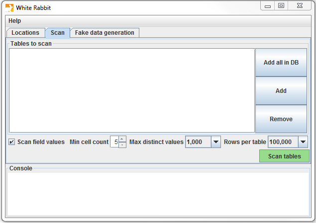
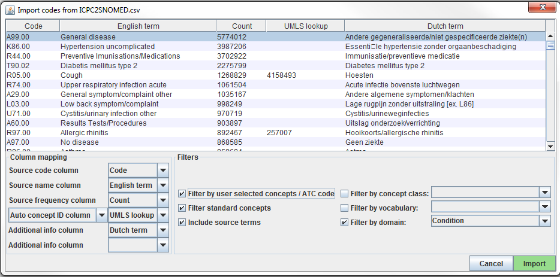

# --翻訳作業中--　抽出、変換、ロード {#ExtractTransformLoad}

*章の著者: Clair Blacketer & Erica Voss*

## はじめに

ネイティブ/生データからOMOP共通データモデル（CDM）に移行するためには、抽出、変換、ロード（ETL）プロセスを作成する必要があります。このプロセスでは、データをCDMに再構築し、標準化されたボキャブラリへのマッピングを追加します。これは通常、一連の自動化スクリプト、例えばSQLスクリプトとして実装されます。このETLプロセスは、ソースデータが更新されたときに再実行できるよう、再現可能であることが重要です。\index{ETL|see {抽出、変換、ロード（ETL）}} \index{生データ} \index{ネイティブデータ|see {生データ}} \index{ソースデータ|see {生データ}}

ETLの作成は通常、大規模な取り組みとなります。長年にわたり、私たちは以下の4つの主要なステップからなるベストプラクティスを開発しました：

1.  データの専門家とCDMの専門家が共同でETLをデザインする。
2.  医学的知識を持つ人がコーディングのマッピングを作成する。
3.  技術者がETLを実装する。
4.  全員が品質管理に関与する。

この章では、これらのステップそれぞれについて詳細に議論します。OHDSIコミュニティによっていくつかの支援ツールが開発されており、これらについても議論します。この章を締めくくるにあたり、CDMとETLのメンテナンスについても議論します。

## ステップ 1: ETLのデザイン

ETLのデザインと実装を明確に分けることが重要です。ETLのデザインにはソースデータとCDMの両方に関する広範な知識が必要です。一方、ETLの実装は通常、ETLを計算効率的に行うための技術的専門知識に依存します。両方を同時に行おうとすると、細かい点に気を取られてしまうことが多く、全体像に集中できなくなることがあります。

ETLデザインプロセスを支援するために密接に統合された2つのツールが開発されました：White RabbitとRabbit-in-a-Hatです。

### White Rabbit

データベースでETLプロセスを開始するためには、データ（テーブル、フィールド、内容）を理解する必要があります。これが[White Rabbit](https://github.com/OHDSI/WhiteRabbit)の役割です。White Rabbitは、縦断的な医療データベースを[OMOP CDM](https://github.com/OHDSI/CommonDataModel)にETLするための準備を支援するソフトウェアツールです。White Rabbitはデータをスキャンし、ETLのデザインを開始するために必要なすべての情報を含むレポートを作成します。全てのソースコードとインストール手順、およびマニュアルへのリンクはGitHubで入手可能です[^extracttransformload-1]。\index{White Rabbit} \index{data profiling|see {White Rabbit}}

[^extracttransformload-1]: <https://github.com/OHDSI/WhiteRabbit>.

#### 範囲と目的 {.unnumbered}

White Rabbitの主な機能は、ソースデータをスキャンし、フィールドに出現するテーブル、フィールド、値に関する詳細な情報を提供することです。ソースデータは、カンマ区切りのテキストファイルやデータベース（MySQL、SQL Server、Oracle、PostgreSQL、Microsoft APS、Microsoft Access、Amazon Redshift）に保存できます。スキャンによって、ETLデザイン時に参考文献として使用できるレポートが生成されます。例えば、Rabbit-In-a-Hatツールと一緒に使用することができます。White Rabbitは標準的なデータプロファイリングツールと異なり、生成された出力データファイルに個人識別情報（PII）を表示しないようにします。

#### プロセス概要 {.unnumbered}

ソフトウェアを使用してソースデータをスキャンする一般的な手順：

1.  結果をエクスポートするローカルデスクトップコンピュータの作業フォルダを設定します。
2.  ソースデータベースまたはCSVテキストファイルに接続し、接続をテストします。
3.  スキャン対象のテーブルを選択し、テーブルをスキャンします。
4.  White Rabbitがソースデータに関する情報をエクスポートします。

#### 作業フォルダの設定 {.unnumbered}

White Rabbitアプリケーションをダウンロードしてインストールした後、最初に行うべきことは作業フォルダを設定することです。White Rabbitが作成するすべてのファイルはこのローカルフォルダにエクスポートされます。図\@ref(fig:WhiteRabbitLocation)に示されている「Pick Folder」ボタンを使用して、スキャンドキュメントを配置するローカル環境をナビゲートします。

```{r WhiteRabbitLocation, fig.cap='White Rabbitアプリケーションの作業フォルダを指定するための「Pick Folder」ボタン。',echo=FALSE, out.width='100%', fig.align='center'}
knitr::include_graphics("images/ExtractTransformLoad/WhiteRabbitLocation.png")
```

#### データベースへの接続 {.unnumbered}

White Rabbitは区切りテキストファイルとさまざまなデータベースプラットフォームをサポートします。各フィールドにマウスカーソルを置くと、必要な情報が表示されます。詳細についてはマニュアルをご覧ください。

#### データベース内のテーブルをスキャン {.unnumbered}

データベースに接続した後、含まれるテーブルをスキャンできます。スキャンによってETLのデザインに役立つ情報を含むレポートが生成されます。図\@ref(fig:WhiteRabbitAddTables)に示されたスキャンタブを使用して、「Add」（Ctrl + マウスクリック）をクリックすることで、選択されたソースデータベース内の個々のテーブルを選択するか、データベース内のすべてのテーブルを自動選択する「Add all in DB」ボタンをクリックできます。

```{r WhiteRabbitAddTables, fig.cap='White Rabbit スキャンタブ。', echo=FALSE, out.width='100%', fig.align='center'}

```

スキャンにはいくつかの設定オプションもあります：

-   「フィールド値をスキャン」をチェックすると、WhiteRabbitは列に表示される値を調査します。
-   「最小セル数」はフィールド値のスキャン時のオプションです。デフォルトでは5に設定されており、ソースデータで5回未満表示された値は報告に表示されません。個別のデータセットには、この最小セル数に関する独自のルールがある場合があります。
-   「テーブルあたりの行数」はフィールド値のスキャン時のオプションです。デフォルトでは、White Rabbitはテーブル内の100,000行をランダムに選択してスキャンします。

すべての設定が完了したら、「テーブルをスキャン」ボタンを押します。スキャンが完了すると、レポートが作業フォルダに書き込まれます。

#### スキャンレポートの解釈 {.unnumbered}

スキャンが完了すると、スキャンされた各テーブルと概要タブを含むExcelファイルが選択されたフォルダに生成されます。概要タブにはスキャンされたすべてのテーブル、各テーブルの各フィールド、各フィールドのデータ型、フィールドの最大長、テーブル行数、スキャンされた行数、および各フィールドが空である頻度が一覧表示されます。図\@ref(fig:ScanOverviewTab).に示されたサンプル概要タブ。

```{r ScanOverviewTab, fig.cap="スキャンレポートのサンプル概要タブ。", echo=FALSE, out.width='100%', fig.align='center'}
knitr::include_graphics("images/ExtractTransformLoad/ScanOverviewTab.png")
```

各テーブルのタブには、各フィールド、各フィールド内の値、および各値の頻度が表示されます。各ソーステーブル列は、Excelに2つの列を生成します。1つの列には、スキャン時に設定された「最小セル数」を超えるすべての固有値がリストされます。固有値のリストが切り捨てられた場合、リストの最後の値は「リスト切り捨て」と表示されます。これは、「最小セル数」で入力した数より少ない頻度で表示される1つ以上の追加の固有ソース値が存在することを示します。各固有値の横には、その値がサンプルに出現する頻度（発生回数）を含む2番目の列もあります。これらの2つの列（固有値と頻度）は、ワークブック内のプロファイリングされたテーブルのすべてのソースカラムについて繰り返されます。

```{r scanSex, fig.cap="単一列のサンプル値。", echo=FALSE, out.width='30%', fig.align='center'}
knitr::include_graphics("images/ExtractTransformLoad/ScanSex.png")
```

レポートはソースデータを理解するために強力であり、存在するものを強調します。例えば、図\@ref(fig:scanSex)に示された結果がスキャンされたテーブルの「Sex」列に戻された場合、2つの一般的な値（1と2）がそれぞれ61,491回と35,401回出現したことが分かります。White Rabbitは1を男性、2を女性として定義することはなく、データホルダーが通常、ソースシステムに固有のソースコードを定義する必要があります。しかし、これらの2つの値（1と2）はデータに存在する唯一の値ではなく、このリストが切り捨てられたことが確認できます。これらの他の値は非常に低い頻度で出現し（「最小セル数」で定義）、しばしば不正確または非常に疑わしい値を表しています。ETLを生成する際には、高頻度のジェンダーコンセプト1と2を処理するだけでなく、この列に存在する他の低頻度の値にも対応するよう計画する必要があります。例えば、これらの低頻度のジェンダーが「NULL」であれば、そのデータを処理し、その状況に対処する方法をETLが知っていることを確認したいです。

### Rabbit-In-a-Hat

White Rabbitスキャンを手にしたら、ソースデータの全体像が掴めます。次に、これをCDMに変換するためのロジックを定義する必要があります。このデザイン作業には、ソースデータとCDMの両方に関する深い知識が必要です。White Rabbitソフトウェアと共に提供されるRabbit-in-a-Hatツールは、これらの分野の専門家チームをサポートするように特別にデザインされています。典型的な設定では、ETLデザインチームが一緒に部屋に集まり、Rabbit-in-a-Hatがスクリーンに投影されます。最初のラウンドでは、テーブル間のマッピングがコラボレーションで決定され、その後、フィールド間のマッピングがデザインされ、値をどのように変換するかのロジックが定義されます。\index{Rabbit-In-A-Hat} \index{ETL design|see {Rabbit-In-A-Hat}}

#### 範囲と目的 {.unnumbered}

Rabbit-In-a-HatはWhite Rabbitスキャンドキュメントを読み取り、表示するようにデザインされています。White Rabbitはソースデータに関する情報を生成し、Rabbit-In-a-Hatはその情報を使用して、グラフィカルユーザーインターフェイスを通じてソースデータをCDMのテーブルおよびカラムに接続することを可能にします。Rabbit-In-a-HatはETLプロセスのドキュメントを生成しますが、ETLを作成するコードは生成しません。

#### プロセス概要 {.unnumbered}

このソフトウェアを使用してETLのドキュメントを生成する一般的な手順：

1.  White Rabbitのスキャン結果を完了させます。
2.  スキャン結果を開くと、インターフェースにソーステーブルおよびCDMテーブルが表示されます。
3.  ソーステーブルを対応するCDMテーブルに接続します。
4.  各ソーステーブルからCDMテーブルへの接続について、ソース列からCDM列への詳細を定義します。
5.  Rabbit-In-a-Hatの作業内容を保存し、MS Wordドキュメントにエクスポートします。

#### ETLロジックの記述 {.unnumbered}

White RabbitスキャンレポートをRabbit-In-a-Hatで開いたら、ソースデータをOMOP CDMに変換する方法のロジックをデザインし、記述する準備が整います。次のセクションでは、Synthea[^extracttransformload-2]データベースのいくつかのテーブルが変換中にどのように見えるかを例示します。

[^extracttransformload-2]: Synthea^TM^は実際の患者をモデル化することを目的とした患者ジェネレーターです。データはアプリケーションに渡されたパラメータに基づいて作成されます。データの構造については、[こちら](https://github.com/synthetichealth/synthea/wiki)をご覧ください。

#### ETLの一般的なフロー {.unnumbered}

CDMは人中心のモデルであるため、まずPERSONテーブルをマッピングすることが常に良い考えです。すべての臨床イベントテーブル（CONDITION_OCCURRENCE、DRUG_EXPOSURE、PROCEDURE_OCCURRENCEなど）は、person_idを介してPERSONテーブルを参照しているため、最初にPERSONテーブルのロジックを解決すると、後で簡単になります。PERSONテーブルの後は、OBSERVATION_PERIODテーブルを次に変換するのが良いルールです。CDMデータベースの各人物には少なくとも1つのOBSERVATION_PERIODがあり、一般的に、人物のほとんどのイベントはこの期間内に発生します。PERSONおよびOBSERVATION_PERIODテーブルが完了したら、次は通常、PROVIDER、CARE_SITE、およびLOCATIONなどの次元テーブルを変換します。臨床テーブルの前に処理すべき最後のテーブルロジックはVISIT_OCCURRENCEです。これはしばしばETL全体で最も複雑なロジックであり、最も重要なものの1つです。人物の患者の旅の過程で発生するほとんどのイベントは受診期間中に発生します。これらのテーブルが完了したら、どのCDMテーブルを変換し、その順序を選択できます。

```{r etlFlow, fig.cap="ETLの一般的なフローと、最初にマッピングするテーブル。", echo=FALSE, out.width='100%', fig.align='center'}
knitr::include_graphics("images/ExtractTransformLoad/flowOfEtl.png")
```

CDM変換中に中間テーブルを作成する必要があることがよくあります。これは、イベントに正しいVISIT_OCCURRENCE_IDを割り当てるため、またはソースコードを標準コンセプトにマッピングするため（このステップをオンザフライで行うことはしばしば非常に遅い）です。中間テーブルは100％許可され推奨されています。ただし、変換が完了した後にこれらの中間テーブルを永続化し、それらに依存することは推奨されません。

#### マッピング例：Personテーブル {.unnumbered}

Syntheaデータ構造にはpatientsテーブルに20のカラムがありますが、図\@ref(fig:syntheaPerson). に示されているように、すべてがPERSONテーブルを埋めるために必要ではありませんでした。これは非常に一般的であり、心配する必要はありません。この例では、Synthea patientsテーブルの多くのデータポイントはCDM PERSONテーブルで使用されなかったため、患者名、運転免許証番号、パスポート番号などの追加識別子でした。

```{r syntheaPerson, fig.cap='Synthea PatientsテーブルからCDM PERSONテーブルへのマッピング。',echo=FALSE, out.width='100%', fig.align='center'}
knitr::include_graphics("images/ExtractTransformLoad/syntheaPersonTable.png")
```

表\@ref(tab:syntheaEtlPerson)には、Synthea patientsテーブルをCDM PERSONテーブルに変換するために課されたロジックが示されています。『Destination Field』（目的フィールド）は、CDMのどこにデータがマッピングされるかを示しています。『Source field』（ソースフィールド）は、CDMカラムを埋めるために使用されるソーステーブル（この場合はpatients）のカラムを強調します。最後に、『Logic & comments』（ロジックとコメント）カラムには、ロジックの説明が記載されています。

表：(＃tab:syntheaEtlPerson) Synthea PatientsテーブルをCDM PERSONテーブルに変換するためのETLロジック

| 目的フィールド | ソースフィールド | ロジックとコメント |
|:---|:---|:---|
| PERSON_ID |  | 自動生成。 PERSON_IDは実装時に生成されます。これは、ソースのid値がvarchar値であり、PERSON_IDは整数であるためです。 ソースのidフィールドは、その値を保持し、必要に応じてエラーチェックを行うためにPERSON_SOURCE_VALUEとして設定されます。 |
| GENDER_CONCEPT_ID | gender | 性別が「M」の場合、GENDER_CONCEPT_IDは8507、性別が「F」の場合は8532に設定します。不明な性別を持つ行は削除します。これらの2つのコンセプトは、性別ドメインの唯一の標準コンセプトであるため選ばれました。不明な性別の患者を削除するかどうかの決定は、通常、サイトに基づいて行われますが、性別のない人々は分析から除外されるため、削除することを推奨します。 |
| YEAR_OF_BIRTH | birthdate | 生年月日から |

## ステップ2: コードマッピングの作成

OMOPボキャブラリには時間とともにますます多くのソースコードが追加されています。これは、CDMにデータを変換する際のコーディングシステムが既に含まれており、マッピングされている可能性があることを意味します。含まれているボキャブラリを確認するために、OMOPボキャブラリのVOCABULARYテーブルをチェックしてください。非標準のソースコード（例：ICD-10CMコード）から標準コンセプト（例：SNOMEDコード）へのマッピングを抽出するには、relationship_id =「Maps to」を持つCONCEPT_RELATIONSHIPテーブルのレコードを使用できます。例えば、ICD-10CMコード「I21」（「急性心筋梗塞」）の標準コンセプトIDを見つけるためには、次のSQLを使用します：

``` sql
SELECT concept_id_2 AS standard_concept_id
FROM concept_relationship
INNER JOIN concept AS source_concept
  ON concept_id = concept_id_1
WHERE concept_code = 'I21'
  AND vocabulary_id = 'ICD10CM'
  AND relationship_id = 'Maps to';
```

| STANDARD_CONCEPT_ID |
|--------------------:|
|              312327 |

残念ながら、ソースデータがボキャブラリに含まれていないコーディングシステムを使用している場合もあります。この場合、ソースコーディングシステムから標準コンセプトへのマッピングを作成する必要があります。コードマッピングは特にソースコーディングシステムに多くのコードが含まれている場合、気が遠くなる作業です。作業を楽にするために以下のことを行うことができます：

-   最も頻繁に使用されるコードに焦点を当てる。本当に使用されていないか、ほとんど使用されていないコードに労力を割く価値はありません。
-   可能な限り既存の情報を活用する。例えば、多くの国の薬品コーディングシステムはATCにマッピングされています。ATCは多くの目的には詳細でないかもしれませんが、ATCとRxNormのコンセプトの関係を使って適切なRxNormコードを推測することができます。
-   Usagiを使用。

### Usagi

Usagiはコードマッピングを手動で作成するプロセスを支援するツールです。コード記述のテキスト類似性に基づいたマッピングを提案できます。ソースコードが外国語でしか利用できない場合、Google Translate[^extracttransformload-3]は驚くほど良い翻訳を提供することがわかっています。Usagiは自動提案が正しくない場合に適切なターゲットコンセプトを検索する機能を提供します。最終的に、ユーザーはそのマッピングがETLで使用される許可がされていることを示すことができます。UsagiはGitHubで入手可能です[^extracttransformload-4]。 \index{Usagi} \index{source code mapping|see {Usagi}}

[^extracttransformload-3]: <https://translate.google.com/>

[^extracttransformload-4]: <https://github.com/OHDSI/Usagi>

#### 範囲と目的 {.unnumbered}

マッピングが必要なソースコードはUsagiにロードされます（コードが英語でない場合は追加の翻訳列が必要です）。用語の類似性アプローチを使用してソースコードをボキャブラリコンセプトに接続します。ただし、これらのコード接続は手動で見直す必要があり、Usagiはこれを支援するインターフェースを提供します。Usagiはボキャブラリで標準コンセプトとしてマークされているコンセプトのみを提案します。

#### プロセス概要 {.unnumbered}

このソフトウェアを使用する一般的な手順は次のとおりです：

1.  マッピングしたいソースシステムからソースコードをロードします。
2.  Usagiは用語の類似性アプローチを実行してソースコードをボキャブラリコンセプトにマッピングします。
3.  Usagiのインターフェースを利用して、自動提案の正しさを確認し、必要に応じて改善します。コードシステムと医療用語に精通した個人によるレビューが推奨されます。
4.  ボキャブラリのSOURCE_TO_CONCEPT_MAPにマッピングをエクスポートします。

#### ソースコードをUsagiにインポート {.unnumbered}

ソースコードをCSVまたはExcel (.xlsx) ファイルにエクスポートします。これには、ソースコードと英語のソースコード記述が含まれている必要がありますが、追加の情報（例：投与単位、元の言語の説明（翻訳された場合））も持ち込むことができます。さらに、コードの頻度も持ち込むことが望ましく、これによりどのコードに最も労力をかけるべきかを優先的に決定するのに役立ちます（例：1,000個のソースコードがあっても、システム内で本当に使用されるのは100個だけかもしれません）。英語に翻訳する必要がある場合は、Google Translateを使用します。

注意事項: ソースコードの抽出はドメインごとに分けて行い、1つの大きなファイルにまとめないでください（例：薬剤、処置、コンディション、観察）。

ソースコードはFile → Import codesメニューからUsagiにロードされます。ここでは「Import codes …」が表示される（図\@ref(fig:usagiImport)）。この図では、ソースコード用語がオランダ語で、英語に翻訳されたものも含まれています。Usagiは英語の翻訳を利用して標準ボキャブラリにマッピングします。

```{r usagiImport, fig.cap="Usagiコード入力画面。", echo=FALSE, out.width='100%', fig.align='center'}

```

「Column mapping」セクション（左下）では、インポートされたテーブルをUsagiに対してどのように使用するかを定義します。ドロップダウンメニューにマウスを合わせると、それぞれの列の定義が表示されるポップアップが表示されます。Usagiは「Additional info」列をソースコードとボキャブラリコンセプトコードを関連付けるための情報として使用しませんが、この追加の情報はソースコードマッピングを確認する個々人を支援するのに役立ちますので、含めるべきです。

また、「Filters」セクション（右下）で、Usagiがマッピングする際の制限を設定できます。例えば、図\@ref(fig:usagiImport)では、ユーザーはソースコードをConditionドメインのコンセプトにマッピングしています。デフォルトでは、Usagiは標準コンセプトにしかマッピングしませんが、「Filter standard concepts」をオフにすると、Usagiは分類コンセプトも考慮します。各フィルターについて詳細を知るためには、異なるフィルターにマウスをホバーさせてください。

特別なフィルターとして「Filter by automatically selected concepts / ATC code」があります。制限する情報がある場合、Auto concept ID列（セミコロンで区切られた）にCONCEPT_IDsまたはATCコードのリストを提供することで検索を制限できます。例えば、薬剤の場合、既に各薬剤にATCコードが割り当てられているかもしれません。ATCコードは単一のRxNorm薬剤コードを特定しませんが、ボキャブラリ内のATCコードに該当するコンセプトのみを検索することで検索範囲を制限するのに役立ちます。ATCコードを使用するには、以下の手順に従います：

1.  Column mapping部で、"Auto concept ID column"から"ATC column"に切り替える
2.  Column mapping部でで、ATCコードを含む列を"ATC column"として選択します。
3.  フィルターセクションで「ユーザーが選択したコンセプト/ATCコードによるフィルター」をオンにします。

ATCコード以外の情報源を使用して制限することもできます。上図の例では、UMLSから派生した部分的なマッピングを使用してUsagiの検索を制限しています。この場合、"Auto concept ID column" を使用する必要があります。

すべての設定が完了したら、"Import" ボタンをクリックしてファイルをインポートします。ファイルのインポートには、ソースコードをマッピングするために用語の類似性アルゴリズムを実行しているため、数分かかります。

#### ソースコードからボキャブラリコンセプトマップへのレビュー {.unnumbered}

ソースコードの入力ファイルをインポートすると、マッピング処理が始まります。図 \@ref(fig:usagiOverview) を見ると、Usagi の画面は、コンセプトテーブル、選択されているマッピング・セクション、 検索を実行する場所の 3 つの主要な部分で構成されていることがわかります。どのテーブルでも、右クリックで表示/非表示の列を選択でき、視覚的な複雑さを軽減できます。

```{r usagiOverview, fig.cap="Usagiでのソースコード入力画面", echo=FALSE, out.width='100%', fig.align='center'}
knitr::include_graphics("images/ExtractTransformLoad/usagiOverview.png")
```

#### 提案されたマッピングの承認 {.unnumbered}

「コンセプトテーブル」には、ソース・コードとコンセプトの現在のマッピングが表示されます。ソース・コードをインポートした直後、このマッピングには、用語の類似性と任意の検索オプションに基づいて自動的に生成されたマッピング候補が含まれます。図 \@ref(fig:usagiOverview) の例では、ユーザーはドメインをコンディションに限定しているため、オランダ語のコンディションの英語名コードがコンディションドメインの標準コンセプトにマッピングされています。Usagi は、ソースコードの説明とコンセプト名および同義語を比較して、最適な一致を見つけます。ユーザは "Include source terms" (ソース用語を含む) を選択したため、Usagi は、特定のコンセプトにマッピングされるボキャブラリ内のすべてのソースコンセプトの名前と同義語も考慮しました。Usagi がマッピングできない場合は、CONCEPT_ID = 0 にマッピングされます。

It is suggested that someone with experience with coding systems help map source codes to their associated standard vocabulary. That individual will work through code by code in the “Overview Table” to either accept the mapping Usagi has suggested or choose a new mapping. For example in Figure \@ref(fig:usagiOverview) we see that the Dutch term “Hoesten” which was translated to the English term “Cough”. Usagi used “Cough” and mapped it to the Vocabulary concept of “4158493-C/O - cough”. There was a matching score of 0.58 associated to this matched pair (matching scores are typically 0 to 1 with 1 being a confident match), a score of 0.58 signifies that Usagi is not very sure of how well it has mapped this Dutch code to SNOMED. Let us say in this case, we are okay with this mapping, we can approve it by hitting the green “Approve” button in the bottom right hand portion of the screen.

ソース・コードを関連する標準ボキャブラリにマッピングする際には、コーディング・システムの経験がある人が支援することをお勧めします。その人は、"Overview Table" （概要テーブル） のコードごとに作業して、Usagi が提案したマッピングを受け入れるか、新しいマッピングを選択します。例えば、図 \@(ref:fig:usagiOverview) を見ると、オランダ語の "Hoesten" は英語の "Cough" (咳嗽）に翻訳されています。Usagiは "Cough" を使って、"4158493-C/O - cough "という語彙概念にマッピングしました。このマッチしたペアのマッチングスコアは0.58でした（マッチングスコアは通常0～1で、1は確実に一致することを意味します）。この場合、私たちはこのマッピングに問題がないとします。画面右下の緑色の"Approve (承認)" ボタンを押すことで、このマッピングを承認できます。

#### Searching for a New Mapping {.unnumbered}

There will be cases where Usagi suggests a map and the user will be left to either try to find a better mapping or set the map to no concept (CONCEPT_ID = 0). In the example given in Figure \@ref(fig:usagiOverview), we see for the Dutch Term “Hoesten”, which was translated to “Cough”. Usagi’s suggestion was restricted by the concept identified in our automatically derived mapping from UMLS, and the result might not be optimal. In the Search Facility, we could search for other concepts using either the actual term itself or a search box query.

When using the manual search box, one should keep in mind that Usagi uses a fuzzy search, and does not support structured search queries, so for example not supporting Boolean operators like AND and OR.

To continue our example, suppose we used the search term “Cough” to see if we could find a better mapping. On the right of the Query section of the Search Facility, there is a Filters section, this provides options to trim down the results from the Vocabulary when searching for the search term. In this case we know we want to only find standard concepts, and we allow concepts to be found based on the names and synonyms of source concepts in the vocabulary that map to those standard concepts.

When we apply these search criteria we find “254761-Cough” and feel this may be an appropriate Vocabulary concept to map to our Dutch code. In order to do that we can hit the “Replace concept” button, which you will see in the “Selected Source Code” section update, followed by the “Approve” button. There is also an “Add concept” button, this allows for multiple standardized Vocabulary concepts to map to one source code (e.g. some source codes may bundle multiple diseases together while the standardized vocabulary may not).

#### Concept Information {.unnumbered}

When looking for appropriate concepts to map to, it is important to consider the “social life” of a concept. The meaning of a concept might depend partially on its place in the hierarchy, and sometimes there are “orphan concepts” in the vocabulary with few or no hierarchical relationships, which would be ill-suited as target concepts. Usagi will often report the number of parents and children a concept has, and it also possible to show more information by pressing ALT + C or selecting view –\> Concept information in the top menu bar.

```{r usagiConceptInfo, fig.cap="Usagi concept information panel.", echo=FALSE, out.width='100%', fig.align='center'}
knitr::include_graphics("images/ExtractTransformLoad/usagiConceptInfo.png")
```

Figure \@ref(fig:usagiConceptInfo) shows the concept information panel. It shows general information about a concept, as well as its parents, children, and other source codes that map to the concept. Users can use this panel to navigate the hierarchy and potentially choose a different target concept.

Continue to move through this process, code by code, until all codes have been checked. In the list of source codes at the top of the screen, by selecting the column heading you can sort the codes. Often, we suggest going from the highest frequency codes to the lowest. In the bottom left of the screen you can see the number of codes that have approved mappings, and how many code occurrences that corresponds to.

It is possible to add comments to mappings, which could be used to document why a mapping decision was made.

#### Best Practices {.unnumbered}

-   Use someone who has experience with coding schemes.
-   By clicking on a column name, you can sort the columns in the “Overview Table”. It may be valuable to sort on “Match Score”; reviewing codes that Usagi is most confident on first may quickly knock out a significant chunk of codes. Also sorting on “Frequency” is valuable, spending more effort on frequent codes versus non-frequent is important.
-   It is okay to map some codes to CONCEPT_ID = 0, some codes may not be worth it to find a good map and others may just lack a proper map.
-   It is important to consider the context of a concept, specifically its parents and children.

#### Export the Usagi Map Created {.unnumbered}

Once you have created your map within USAGI, the best way to use it moving forward is to export it and append it to the Vocabulary SOURCE_TO_CONCEPT_MAP table.

To export your mappings, go to File –\> Export source_to_concept_map. A pop-up will appear asking you which SOURCE_VOCABULARY_ID you would like to use, type in a short identifier. Usagi will use this identifier. as the SOURCE_VOCABULARY_ID which will allow you to identify your specific mapping in the SOURCE_TO_CONCEPT_MAP table.

After selecting the SOURCE_VOCABULARY_ID, you give your export CSV a name and save to location. The export CSV structure is in that of the SOURCE_TO_CONCEPT_MAP table. This mapping could be appended to the Vocabulary’s SOURCE_TO_CONCEPT_MAP table. It would also make sense to append a single row to the VOCABULARY table defining the SOURCE_VOCABULARY_ID you defined in the step above. Finally, it is important to note that only mappings with the “Approved” status will be exported into the CSV file; the mapping needs to be completed in USAGI in order to export it.

#### Updating an Usagi Mapping {.unnumbered}

Often a mapping is not a one-time effort. As data is updated perhaps new source codes are added, and the vocabulary is updated regularly, perhaps requiring an update of the mapping.

When the set of source codes is updated the following steps can support the update:

1.  Import the new source code file
2.  Choose File –\> Apply previous mapping, and select the old Usagi mapping file
3.  Identify codes that haven't inherited approved mappings from the old mapping, and map them as usual.

When the vocabulary is updated, follow these steps:

1.  Download the new vocabulary files from Athena
2.  Rebuild the Usagi index (Help –\> Rebuild index)
3.  Open the mapping file
4.  Identify codes that map to concepts that in the new vocabulary version no longer are Standard concepts, and find more appropriate target concepts.

## ステップ 3: ETLの実装

デザインとコードマッピングが完了したら、ETLプロセスをソフトウェアで実装することができます。ETLのデザイン段階では、ソースデータとCDMに詳しい人が共同で作業することをおすすめしました。同様に、ETLを実装する際には、大量のデータを扱う経験があり、ETLの実装経験がある人を使うことが望ましいです。これは、あなたのグループ外の個人と協力することや、実装を担当する技術顧問を雇うことを意味するかもしれません。また、これは一度きりの費用ではないことにも注意が必要です。今後もETLの維持と運用を担当するために、少なくとも一部の時間を捧げる個人やチームがいることが望ましいです（詳細はセクション \@ref(CDMandETLMaintenance) を参照してください）。

実装の具体的な内容はサイトごとに異なり、インフラ、データベースの規模、ETLの複雑さ、利用可能な技術専門知識など多くの要因に依存します。そのため、OHDSIコミュニティはETLの最適な実装方法について正式な推奨を行っていません。シンプルなSQLビルダー、SAS、C#、Java、およびKettleを使用するグループもいます。それぞれに長所と短所があり、技術に精通している人がいなければどれも使えません。

様々なETLの例をいくつか挙げます（複雑さの順に記載）：\index{ETL!implementations}

-   ETL-Synthea - Syntheaデータベースを変換するために書かれたSQLビルダー
    -   <https://github.com/OHDSI/etl-synthea>
-   ETL-CDMBuilder - 複数のデータベースを変換するためにデザインされた.NETアプリケーション
    -   <https://github.com/OHDSI/etl-cdmbuilder>
-   ETL-LambdaBuilder - AWS lambda機能を使用するビルダー
    -   <https://github.com/OHDSI/etl-lambdabuilder>

複数回の独立した試みの後、ユーザーフレンドリーな"究極の"ETLツールの開発を断念しました。このようなツールはETLの80%にはうまく機能しますが、残りの20%のETLには、ソースデータベース固有の低レベルのコードを書く必要があります。

技術者が実装を開始する準備ができたら、ETLデザイン文書を彼らと共有するべきです。ドキュメントには開発を開始するための十分な情報が含まれているはずですが、開発プロセス中にETLデザイン者が質問に応じることができるようにすることが重要です。デザイン者には明確な論理も、データやCDMに不慣れな実装者にはわかりにくいことがあります。実装フェーズはチーム全体の努力として維持されるべきです。実装者とデザイン者の間で、CDMの作成とテストのプロセスを繰り返し行い、両グループがすべての論理が正しく実行されたことに同意するまで進行することが受け入れられた慣行とされています。

## ステップ 4: 品質管理

抽出、変換、ロードプロセスでは品質管理が反復的です。一般的なパターンは、ロジックの記述-\>ロジックの実装-\>ロジックのテスト-\>ロジックの修正・記述です。CDMをテストする方法はいくつもありますが、以下は何年にもわたるETL実装を通じてコミュニティ全体で開発された推奨ステップです。 \index{ETL!quality control}

-   ETLデザイン文書、コンピュータコード、およびコードマッピングのレビュー。1人の人がミスをすることは常にあるので、必ず他の1人以上が行ったことをレビューするべきです。
    -   コンピュータコードにおける最大の問題は、ネイティブデータのソースコードが標準コンセプトにどのようにマッピングされるかに起因します。特に日付特有のコード（NDCなど）の場合、マッピングは難しくなることがあります。どの領域でもマッピングが行われる場合は、正しいソースボキャブラリが適切なコンセプトIDに変換されているかを必ず再確認してください。
-   ソースデータとターゲットデータのサンプルに関する情報を手動で比較します。
    -   最大のユニークなレコード数を持つ理想的な1人のデータを追跡するのが役立つことがあります。1人のデータを追跡することで、CDMのデータが合意されたロジックに基づいて期待されるように見えない場合に問題が浮かび上がります。
-   ソースデータとターゲットデータの全体的なカウントを比較します。
    -   特定の問題にどのように対処するかによって、カウントに期待される差異があるかもしれません。たとえば、NULL性別の人々を解析から完全に除外する協力者がいます。また、CDMの受診期間がネイティブデータの受診やエンカウンターと異なるように構築されることもあります。そのため、ソースデータとCDMデータ間の全体的なカウントを比較する際には、これらの違いに留意し、期待する必要があります。
-   ソースデータで既に行われた研究をCDMバージョンで再現します。
    -   これはソースデータとCDMバージョンとの間の主要な違いを理解するための良い方法ですが、少し時間がかかります。
-   ETLで対処する必要があるソースデータのパターンを再現するユニットテストを作成します。たとえば、性別情報のない患者が削除されるべき場合、性別がない個人のユニットテストを作成し、ビルダーがどのように処理するかを評価します。
    -   ユニットテストは、ETL変換の品質と精度を評価する際に非常に便利です。通常、変換元データの構造を模倣する非常に小さいデータセットを作成します。このデータセット内の各個人またはレコードは、ETL文書に記載されている特定のロジックをテストします。この方法では、問題を特定し、失敗したロジックを特定するのが簡単になります。小さいサイズはコンピュータコードの実行が非常に速くなり、反復とエラーの特定を迅速に行えます。

これらは、ETLの観点から品質管理にアプローチする高レベルの方法です。OHDSIコミュニティ内で進行中のデータ品質への取り組みの詳細については、Chapter \@ref(DataQuality) を参照してください。

## ETLの規約とTHEMIS

データをCDMに変換するグループが増えるにつれ、特定の状況でETLがどのように対処すべきかを指定する必要があることが明らかになりました。たとえば、出生年が欠けている個人記録の場合、ETLはどうすべきでしょうか？CDMの目標はヘルスケアデータを標準化することですが、各グループが特定のデータシナリオを異なる方法で処理すると、ネットワーク全体でデータを体系的に使用することが難しくなります。

OHDSIコミュニティは、一貫性を向上させるために慣行を文書化し始めました。OHDSIコミュニティが合意したこれらの定義された慣行は、CDM Wikiで見つけることができます[^extracttransformload-5]。各CDMテーブルには、ETLをデザインする際に参照できる独自の慣行セットがあります。たとえば、出生月や日が欠けている個人は許可されますが、出生年が欠けている場合、その個人は削除する必要があります。ETLをデザインする際には、コミュニティと一貫性のあるデザイン決定を行うために参考文献を参照してください。

[^extracttransformload-5]: <https://github.com/OHDSI/CommonDataModel/wiki>

すべてのデータシナリオを文書化し、発生した場合に何をするかをドキュメント化することは不可能ですが、共通のシナリオを文書化しようとしているOHDSIの作業グループがあります。THEMIS[^extracttransformload-6]は、コミュニティ内で慣行を収集し、それを明確にし、コミュニティと共有し、最終的な慣行をCDM Wikiに文書化する個人で構成されています。Themisは、古代ギリシャの神であり、秩序、公平さ、法、自然法、慣習を司るタイタネスであり、このグループの任務にふさわしいものでした。ETLを実行する際に、どのように処理すべきか判断に迷うシナリオがあった場合、THEMISはそのシナリオについてOHDSIフォーラムに質問を投げかけることをお勧めします[^extracttransformload-7]。おそらく、質問がある場合、他のコミュニティのメンバーも同じ質問を抱えている可能性があります。THEMISはこれらの議論、作業グループの会議、フェイス・トゥ・フェイスのディスカッションなどを利用して、他に文書化する必要がある慣行について情報を収集します。

[^extracttransformload-6]: <https://github.com/OHDSI/Themis>

[^extracttransformload-7]: <http://forums.ohdsi.org/>

## CDMおよびETLのメンテナンス {#CDMandETLMaintenance}

ETLをデザインし、マッピングを作成し、ETLを実装し、品質管理措置を構築することは容易な作業ではありません。残念ながら、この努力はそこで終わりではありません。最初のCDMが構築されると、ETLメンテナンスのサイクルが継続的に行われます。メンテナンスが必要となる一般的なトリガーは以下の通りです：ソースデータの変更、ETLのバグ、新しいOMOPボキャブラリのリリース、またはCDM自体の変更や更新です。これらのトリガーが発生すると、ETLドキュメント、ETLを実行するソフトウェアプログラミング、テストケースや品質管理の更新が必要になる場合があります。

医療データソースは常に変化し続けることがよくあります。新しいデータが利用可能になるかもしれません（例：データに新しい列が追加される）。存在しなかった患者のシナリオが突然現れるかもしれません（例：生まれる前に死亡記録がある新しい患者）。データの理解が向上するかもしれません（例：保険請求データの処理の方法により、入院出産に関する記録の一部が外来として処理されること）。すべてのソースデータの変更がETL処理の変更を引き起こすわけではありませんが、最低限、ETL処理を中断する変更は対処する必要があります。

バグが見つかった場合、それに対処する必要があります。しかし、すべてのバグが同じ重要性を持っているわけではないことを忘れないでください。例えば、COSTテーブルではcost列が整数に丸められていたとしましょう（例：ソースデータに\$3.82があったのに、CDMで\$4.00になっている）。データを使用して主に患者の薬剤曝露やコンディションの特性評価を行う研究者が多い場合、このようなバグは重要ではなく、将来的に対処することができます。しかし、データを使用する主要な研究者に健康経済学者も含まれていた場合、これは直ちに対処する必要がある重大なバグとなります。

OMOPボキャブラリもまた、ソースデータと同様に常に変化しています。実際、ボキャブラリは1ヶ月に何度も更新されることがあります。各CDMは特定のボキャブラリバージョンで実行されており、新しい改善されたボキャブラリで実行すると、標準化されたボキャブラリにソースコードがマッピングされる方法が変わる可能性があります。ボキャブラリの違いはしばしば些細なものですが、新しいボキャブラリがリリースされるたびに新しいCDMを構築することは不要です。しかし、年間に1回か2回程度、新しいボキャブラリを採用することが良いとされています。この場合、CDMを再処理する必要があります。新しいバージョンのボキャブラリの変更がETLコード自体の更新を必要とすることはまれです。

CDMまたはETLのメンテナンスが必要となる最後のトリガーは、共通データモデル自体の更新時です。コミュニティが成長し、新しいデータ要件が見つかると、これがCDMに追加データを保存することにつながるかもしれません。これは、以前はCDMに保存されていなかったデータが新しいCDMバージョンに保存場所を持つ可能性があることを意味します。既存のCDM構造の変更は頻繁ではありませんが、可能性はあります。例えば、CDMが元のDATEフィールドからDATETIMEフィールドを採用したことで、ETL処理にエラーが発生する可能性があります。CDMバージョンは頻繁にはリリースされず、サイトは移行するタイミングを選択できます。

## ETLに関する最終的な考察

ETLプロセスにはさまざまな理由で困難があります。その中でも、私たちが処理しているソースデータの独自性により、「1つの解決策がすべてに適合する」という解決策を作成するのが難しいことが最大の理由の1つです。しかし、過去数年で以下のような貴重な教訓を得ました。

-   80/20のルール。可能な限り、ソースコードを手動でコンセプトセットにマッピングするのに過度に時間を費やさないようにしましょう。理想的には、大多数のデータをカバーするソースコードをマッピングしてください。これで十分であり、将来のユースケースに基づいて残りのコードに対処することができます。
-   研究の品質に見合わないデータを失うことを恐れなくても良い。それらはしばしば分析を開始する前に破棄されるレコードであり、私たちはETLプロセス中にそれらを削除します。
-   CDMはメンテナンスが必要です。ETLが完了したからといって、再び触らないということではありません。生データが変更されるかもしれませんし、コードにバグがあるかもしれません。新しいボキャブラリやCDMの更新があるかもしれません。これらの変更に対応するためのリソースを計画しておくことで、ETLが常に最新の状態に保たれるようにしましょう。
-   OHDSI CDMの開始、データベースの変換、分析ツールの実行のサポートが必要な場合は、実施者フォーラム[^extracttransformload-8]をご覧ください。

[^extracttransformload-8]: <https://forums.ohdsi.org/c/implementers>

## まとめ

```{block2, type='rmdsummary'}
- ETLにアプローチするための一般的に合意されたプロセスが存在します
  - データ専門家とCDM専門家が協力してETLをデザイン
  - 医療知識を持つ人々がコードマッピングを作成
  - 技術者がETLを実装
  - すべての関係者が品質管理に関与

- OHDSIコミュニティはこれらのステップを促進するためにツールを開発しており、これらは自由に使用できます

- ガイドとして使用できる多くのETL例や合意された慣習があります


```

## 演習

```{exercise, exerciseEtl1}
ETLプロセスのステップを適切な順序に並べてください：

A) データ専門家とCDM専門家が協力してETLをデザイン
B) 技術者がETLを実装
C) 医療知識を持つ人々がコードマッピングを作成
D) すべての関係者が品質管理に関与

```

```{exercise, exerciseEtl2}
選択したOHDSIリソースを使用して、表\@ref(tab:exercisePersonTable)に示すPERSONレコードに関する4つの問題点を指摘してください（表はスペースのため省略されています）：

表: (\#tab:exercisePersonTable) PERSONテーブル。

列 | 値
:---------------- |:-----------
PERSON_ID | A123B456
GENDER_CONCEPT_ID | 8532
YEAR_OF_BIRTH | NULL
MONTH_OF_BIRTH | NULL
DAY_OF_BIRTH | NULL
RACE_CONCEPT_ID | 0
ETHNICITY_CONCEPT_ID | 8527
PERSON_SOURCE_VALUE | A123B456
GENDER_SOURCE_VALUE | F
RACE_SOURCE_VALUE | WHITE
ETHNICITY_SOURCE_VALUE | 提供されていない

```

```{exercise, exerciseEtl3}
VISIT_OCCURRENCEレコードを生成してみましょう。以下はSyntheaのために書かれた一部のロジックです：
PATIENT、START、ENDを昇順で並べ替えます。その後、PERSON_IDごとに、前の行のENDと次の行のSTARTの間に1日以内の時間がある限り、請求行をまとめます。まとめられた入院請求ごとに1つの入院受診期間と見なし、以下を設定します：

- MIN(START)をVISIT_START_DATEとして設定
- MAX(END)をVISIT_END_DATEとして設定
- "IP"をPLACE_OF_SERVICE_SOURCE_VALUEとして設定

ソースデータに図\@ref(fig:exerciseSourceData)に示されるような訪問セットがある場合、CDMで生成されるVISIT_OCCURRENCEレコードはどのようになると予想しますか？

```

```{r exerciseSourceData, fig.cap='例のソースデータ。', echo=FALSE, out.width='100%', fig.align='center'}
knitr::include_graphics("images/ExtractTransformLoad/exerciseSourceData.png")
```

提案された回答は付録\@ref(Etlanswers)に見つけることができます。
