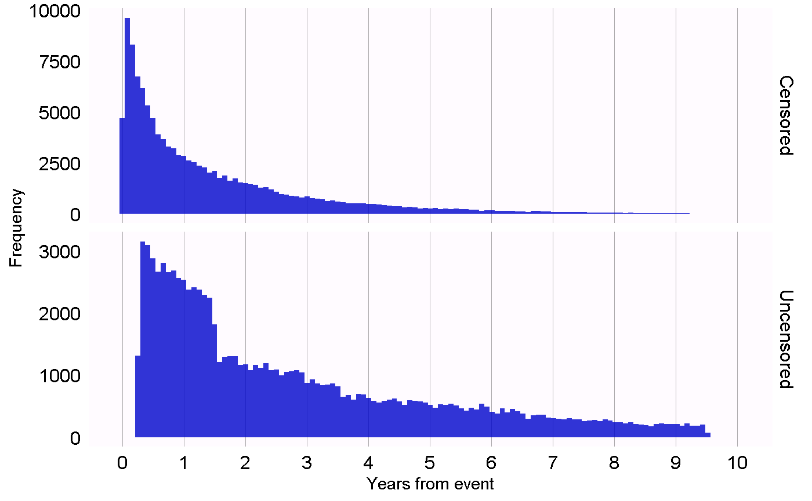
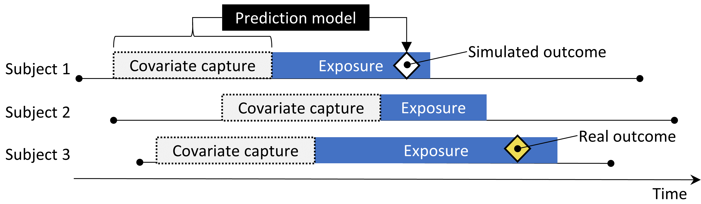
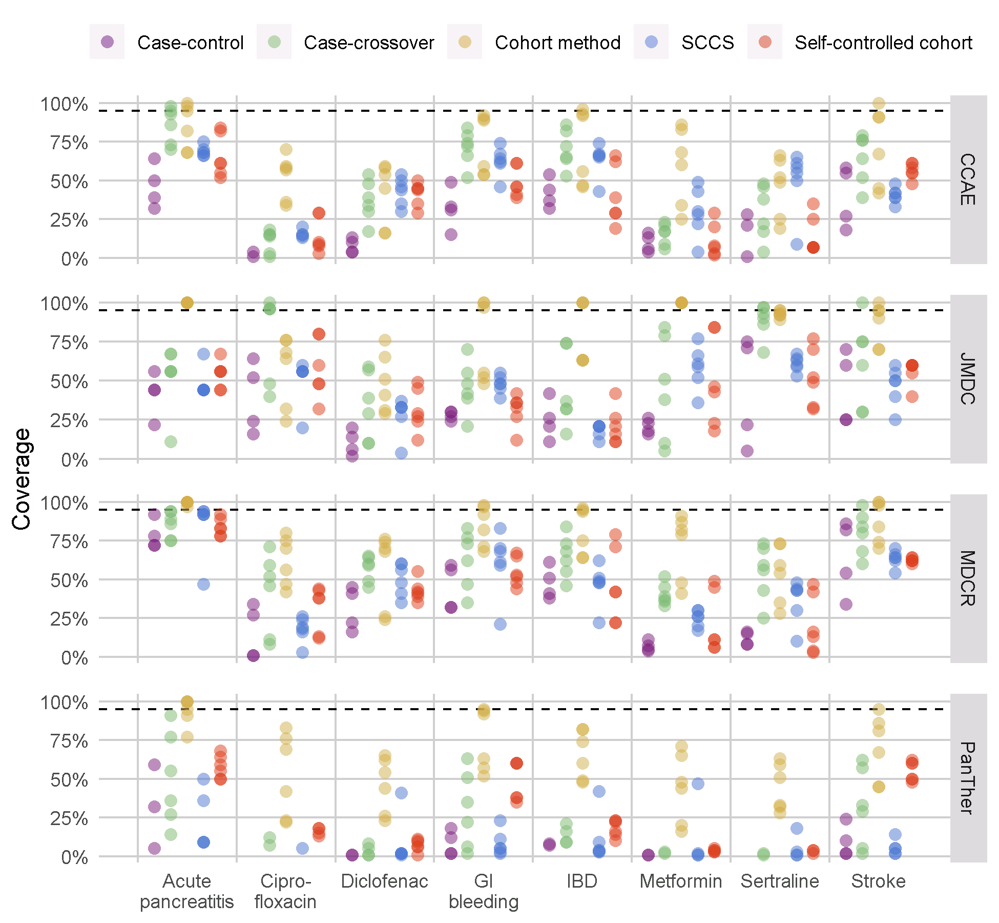

# --翻訳作業中--　方法の妥当性 {#MethodValidity}

\index{方法の妥当性}

*章リーダー: Martijn Schuemie*

方法の妥当性を考えるとき、我々は以下の質問に答えようとします。

> この方法はこの質問に答えるために妥当ですか？

「方法」には、研究デザインだけでなく、データおよびデザインの実装も含まれます。したがって、方法の妥当性というのはある程度包括的なものであり、データの質、臨床的妥当性、およびソフトウェアの妥当性が良好でなければ、良好な方法の妥当性を観察することはほとんど不可能です。これらの証拠の質の側面は、方法の妥当性を検討する前にすでに別途検討されているべきです。

方法の妥当性を確立する際の核心的な活動は、分析において重要な仮定が満たされているかどうかを評価することです。たとえば、プロペンシティスコアマッチングが2つの集団を比較可能にするという仮定を置きますが、これが事実であるかどうか評価する必要があります。可能であれば、これらの仮定を検証するために実証的なテストを実施するべきです。たとえば、マッチング後の2つの集団が広範囲の特性において実際に比較可能であることを示す診断を生成することができます。OHDSIでは、分析が実行されるたびに生成され評価されるべき標準化された多くの診断を開発しました。

この章では、集団レベル推定に使用される方法の妥当性に焦点を当てます。まず、いくつかの研究デザイン特有の診断を簡単に紹介し、その後、ほとんどすべての集団レベル推定研究に適用可能な診断について議論します。次に、OHDSIツールを使用してこれらの診断を実行する方法をステップバイステップで説明します。最後に、高度なトピックとして、OHDSIメソッドベンチマークおよびそのOHDSIメソッドライブラリへの適用についてレビューします。


## デザイン特有の診断

\index{研究診断}

各研究デザインには、そのデザイン特有の診断があります。これらの診断の多くは、[OHDSIメソッドライブラリ](https://ohdsi.github.io/MethodsLibrary/)のRパッケージに実装されており、すぐに利用可能です。たとえば、セクション \#ref(studyOutputs) では、[CohortMethod](https://ohdsi.github.io/CohortMethod/)パッケージによって生成された広範な診断のリストが記載されています。これには以下が含まれます：

- **プロペンシティスコア分布**：コホートの初期の比較可能性を評価するため。
- **プロペンシティモデル**：モデルから除外すべき潜在的な変数を特定するため。
- **共変量のバランス**：プロペンシティスコア調整がコホートを比較可能にしたかどうかを評価するため（ベースライン共変量を通じて測定）。
- **離脱**：さまざまな分析ステップで除外された被験者の数を観察し、初期の関心コホートに対する結果の一般化可能性について情報を提供するかもしれません。
- **統計的検出力**：質問に十分に答えるためのデータが十分にあるかどうかを評価するため。
- **カプラン・マイヤー曲線**：典型的な発症時間を評価し、Coxモデルに基づく比例仮定が満たされているかどうかを確認するため。

他の研究デザインは、そのデザインにおける異なる仮定をテストするために異なる診断を必要とします。たとえば、自己対照症例シリーズ（SCCS）デザインでは、観察の終了が結果に独立しているという必要な仮定を確認します。この仮定は、心筋梗塞のような深刻な、潜在的に致死的なイベントの場合にしばしば違反します。この仮定が成り立つかを評価するために、図 \@ref(fig:timeToObsEnd) に示すプロットを生成することができます。このプロットは、観察期間終了までの時間のヒストグラムを、検閲された被験者とされなかった被験者について示しています。我々のデータでは、データキャプチャの終了日（データベース全体の観察が終了した日、たとえば抽出日、または研究終了日）に観察期間が終了したものを非検閲と見なし、それ以外を検閲と見なしています。図 \@ref(fig:timeToObsEnd) において、2つの分布の間にはわずかな差しか見られないことから、仮定が成り立つことが示唆されます。

```{r timeToObsEnd, fig.cap='検閲された被験者とされなかった被験者の観察終了までの時間。',echo=FALSE, out.width='100%', fig.align='center'}

```
## 推定のための診断

設計固有の診断とは別に、すべての因果効果推定方法に共通して適用できる診断があります。その多くは、すでに答えのわかっている研究課題であるコントロール仮説の使用に依存しています。コントロール仮説を使用して、設計が真実に沿った結果を生成するかどうかを評価できます。コントロールは、ネガティブコントロールとポジティブコントロールに分けられます。

### ネガティブコントロール {#NegativeControls}

\index{ネガティブコントロール}

ネガティブコントロールは、因果関係が存在しないと考えられる曝露-アウトカムペアであり、混乱、[@lipsitch_2010] 選択バイアス、測定誤差を検出する手段として推奨される「否定的エンドポイント」や「否定的証拠」を含みます。[@arnold_2016] 例えば、[@zaadstra_2008] 一つの研究では、小児期の疾患と後の多発性硬化症（MS）の関係を調査しましたが、その中でMSを引き起こさないと考えられる3つのネガティブコントロール（骨折、脳震盪、扁桃摘出術）を含めています。この3つのうち2つのコントロールはMSと統計的に有意な関連を示しており、研究にバイアスが含まれている可能性が示唆されました。

ネガティブコントロールは、我々の関心のある仮説に比較可能なものであるべきです。つまり、通常、仮説の関心のある曝露と同じ曝露を持つ曝露-アウトカムペア（いわゆる「アウトカムコントロール」）か、同じアウトカムを持つ（「曝露コントロール」）を選択します。さらに、ネガティブコントロールは以下の基準を満たすべきです：

- 曝露がアウトカムを**引き起こさないべき**です。因果関係を考える一つの方法は、反事実的に考えることです：患者が曝露されなかった場合と比較して、曝露された場合にアウトカムが引き起こされる（または防止される）可能性がありますか？時々これは明らかです。例えば、ACEiはアンジオエデマを引き起こすことが知られています。他の場合ははるかに明白ではありません。例えば、高血圧を引き起こす薬は、高血圧の結果として心血管疾患も間接的に引き起こす可能性があります。
- 曝露がアウトカムを**防止または治療しない**べきです。これは、真の効果サイズ（例えば、ハザード比）が1であると信じるためには欠如しているはずの別の因果関係に過ぎません。
- ネガティブコントロールは**データに存在するべき**であり、理想的には十分な数があるべきです。これを達成するために、候補となるネガティブコントロールを有病率に基づいて優先順位付けします。
- ネガティブコントロールは理想的には**独立しているべき**です。例えば、「巻爪」と「足の巻爪」などの祖先であるネガティブコントロールや、「左大腿骨骨折」と「右大腿骨骨折」などの兄弟であるネガティブコントロールを避けるべきです。
- ネガティブコントロールには**バイアスの可能性がある**べきです。例えば、社会保障番号の最後の数字は基本的にランダムな数字であり、混乱を示すことはないでしょう。したがって、ネガティブコントロールとして使用すべきではありません。

ネガティブコントロールは関心のある曝露-アウトカムペアと同じ混乱構造を持つべきだという意見もあります。しかし、この混乱構造は未知であり、現実に見られる変数間の関係は人々が考えるよりもはるかに複雑であると信じています。また、例えコンファウンダ構造が知られていたとしても、その正確な混乱構造を持ちながら直接の因果関係を欠くネガティブコントロールが存在する可能性は低いです。この理由から、OHDSIでは、関心のある仮説に存在するバイアスを含む多種多様なバイアスを表現する多数のネガティブコントロールを使用しています。

曝露とアウトカム間の因果関係が存在しないことはほとんど文書化されていません。代わりに、関係がないことを示す証拠がないことが関係がないことを意味するという仮定を立てます。この仮定は、曝露とアウトカムの両方が広範に研究されている場合に成り立つ可能性が高いです。例えば、完全に新しい薬に対する証拠の欠如は、関係の欠如ではなく知識の欠如を意味する可能性が高いです。この原則を念頭に置いて、ネガティブコントロールを選択するための半自動手順を開発しました。[@voss_2016] 簡単に言えば、文献、製品ラベル、および自発的報告からの情報を自動的に抽出・統合してネガティブコントロールの候補リストを生成します。このリストは、抽出が正確であることを確認するため、また生物学的妥当性などの追加基準を課すため、手動での確認が必要です。

### ポジティブコントロール {#PositiveControls}

\index{ポジティブコントロール}

真の相対リスクが1以上または1以下である場合の方法の挙動を理解するには、帰無仮説が真でないと考えられるポジティブコントロールを使用する必要があります。残念ながら、観察研究における実際のポジティブコントロールは、主に3つの理由から問題があります。第一に、たいていの研究環境、例えば2つの治療法の効果を比較する場合、その特定の環境に関連する適切なポジティブコントロールが不足しています。第二に、ポジティブコントロールがあったとしても、効果の大きさは正確に知られていない場合が多く、その効果は測定する集団によって異なることが多いです。第三に、特定のアウトカムを引き起こすことが広く知れ渡っている治療法では、医師が望まれないアウトカムを防ぐための行動をとることで、ポジティブコントロールが評価手段として無効になることがあります。[@noren_2014]

\index{ポジティブコントロール!合成}

したがって、OHDSIでは合成ポジティブコントロールを使用します。これは、曝露の時間におけるアウトカムの追加の発生をシミュレートすることによって、ネガティブコントロールを変更することで作成されます。例えば、ACEiの曝露中にネガティブコントロールアウトカム「巻爪」がn回発生したと仮定します。もし、この曝露中に新たにn回のシミュレートされた発生を追加すれば、リスクは倍になります。これはネガティブコントロールであったため、反事実に比べて相対リスクは1でしたが、注入後は2になります。

重要な問題は、混乱の保持です。ネガティブコントロールは強い混乱を示すことがありますが、ランダムに追加のアウトカムを注入すると、これらの新しいアウトカムは混乱していないため、ポジティブコントロールの混乱に対処する能力を楽観的に評価する可能性があります。混乱を保持するために、新しいアウトカムが元のアウトカムと同様のベースラインの主観的共変量と関連することを望みます。これを達成するために、各アウトカムに対して、曝露前に捕捉された共変量を使用して曝露中のアウトカムに関する生存率を予測するモデルを訓練します。これらの共変量には人口統計データ、記録された診断、薬物曝露、測定、および医療手続きが含まれます。L1正則化ポアソン回帰[@suchard_2013]を使用して、正則化ハイパーパラメータを選択するために10倍クロスバリデーションを使用して予測モデルにフィットさせます。その後、希望する大きさの真の効果サイズに増やすために、曝露期間中にシミュレートされたアウトカムをサンプリングするために予測率を使用します。その結果得られるポジティブコントロールは、実際のアウトカムとシミュレートされたアウトカムの両方を含みます。

図\@ref(fig:posControlSynth)は、このプロセスを示しています。この手順は重要なバイアスのいくつかをシミュレートしていますが、すべてをキャプチャするわけではありません。例えば、測定誤差のいくつかの影響は存在しません。合成ポジティブコントロールは一定の正の予測値と感度を意味し、現実にはそうではないかもしれません。

```{r posControlSynth, fig.cap='ネガティブコントロールからのポジティブコントロールの合成。',echo=FALSE, out.width='90%', fig.align='center'}

```

単一の真の「効果サイズ」として言及しますが、異なる方法は治療効果の異なる統計を推定します。因果関係が存在しないと信じているネガティブコントロールでは、相対リスク、ハザード比、オッズ比、発生率比、条件付きおよびマージナルとして、治療効果の平均（ATT）および全体の平均治療効果（ATE）を含むすべての統計は1と同一であるべきです。ポジティブコントロールを作成するプロセスは、患者間での時系列的および関連する発生率比で一貫したアウトカムを合成するモデルを使用します。この比率が保たれるため、累積的な効果サイズも保たれます。

### 実証的評価 {#metrics}

\index{実証的評価}

ネガティブおよびポジティブコントロールの特定の方法の推定によって、その操作特性を理解し、いくつかの指標を計算することができます。例えば：

* **受信者操作特性曲線下面積（AUC）**：ポジティブコントロールとネガティブコントロールを区別する能力。
* **カバレッジ**：真の効果サイズが95％信頼区間内に含まれている頻度。
* **平均精度**：精度は$1/(標準誤差)^2$として計算され、精度が高いほど信頼区間が狭くなります。精度分布の偏りを考慮するため、幾何平均を使用します。
* **平均二乗誤差（MSE）**：効果サイズの点推定と真の効果サイズの対数との間の平均二乗誤差。
* **タイプ1エラー**：ネガティブコントロールで帰無仮説が棄却された頻度（$\alpha = 0.05$）。これは偽陽性率および$1 - 特異度$に相当します。
* **タイプ2エラー**：ポジティブコントロールで帰無仮説が棄却されなかった頻度（$\alpha = 0.05$）。これは偽陰性率および$1 - 感度$に相当します。
* **非推定可能**：方法が推定を生成できなかったコントロールの数。推定ができない理由には、プロペンシティスコアマッチング後の被験者が残っていない、またはアウトカムを持つ被験者が残っていないなどの

さまざまな理由があります。

使用目的に応じて、これらの操作特性が目標に適しているかどうかを評価します。例えば、信号検出を行いたい場合は、タイプ1およびタイプ2エラーが気になるかもしれません。あるいは、$\alpha$の閾値を変更したい場合には、AUCを検査することがあります。

### P値のキャリブレーション

\index{p-value calibration} \index{実証的キャリブレーション}

しばしば、タイプ1エラー（$\alpha = 0.05$）は5％を超えます。つまり、帰無仮説が真である場合にも、帰無仮説が5％以上の確率で棄却されることがよくあります。次いで古典的なp値は、サンプルサイズに限界があるためランダムエラの反映のみを示しており、混乱などの体系的誤差は反映していません。OHDSIは、p値をキャリブレーションするプロセスを開発し、名目のタイプ1エラーを復元します。[@schuemie_2014] 実際のネガティブコントロールのための効果推定から実証的帰無分布を導きます。これらのネガティブコントロール推定は、帰無仮説が真である場合の期待値の指標を提供し、実証的な帰無分布を推定するために使用します。

具体的には、それぞれのネガティブコントロールドラッグ-アウトカムペアから得られた効果推定（相対リスク、オッズ比、発生率比の対数）を $\hat{\theta}_i$ とし、対応する推定標準誤差を $\hat{\tau}_i$ とします。$i=1,.....,n$。ネガティブコントロールの真の効果サイズ（対数）は $\theta_i$ （0と仮定）とし、ペア $i$ に関連する真（ただし未知）のバイアス $\beta_i$ とします。すなわち、$\theta_i$ と差の対数の真の効果サイズを $\beta_i$ とします。標準的なp値計算と同様に、$\hat{\theta}_i$ は期待値 $\theta_i + \beta_i$ と標準偏差 $\hat{\tau}_i^2$ の下で正規分布に従うと仮定します。従来のp値計算では $\beta_i$ は常にゼロであると仮定されますが、ここでは $\beta_i$ たちは平均 $\mu$ 、分散 $\sigma^2$ の正規分布に従うと仮定します。これは帰無（バイアス）分布を表し$\mu$ と $\sigma^2$ を最大尤度により推定します。

まとめとして、次を仮定します:
$$\beta_i \sim N(\mu,\sigma^2) \text{  そして  } \hat{\theta}_i \sim N(\theta_i + \beta_i, \tau_i^2)$$

ここで $N(a,b)$ は平均値 $a$ 、分散 $b$ のガウス分布を示します。尤度:

$$L(\mu, \sigma | \theta, \tau) \propto \prod_{i=1}^{n}\int p(\hat{\theta}_i|\beta_i, \theta_i, \hat{\tau}_i)p(\beta_i|\mu, \sigma) \text{d}\beta_i$$

ここから最大尤度推定 $\hat{\mu}$ と $\hat{\sigma}$ を得ます。キャリブレートされたp値を実証的な帰無分布を用いて計算します。新しいドラッグ-アウトカムペアの効果推定 $\hat{\theta}_{n+1}$ を取り、対応する推定標準誤差 $\hat{\tau}_{n+1}$ を用います。前述の仮定の下で $\beta_{n
## 実践におけるメソッド検証

ここでは、アンジオテンシン変換酵素阻害薬（ACEi）がチアジドおよびチアジド様利尿薬（THZ）と比較して、血管浮腫および急性心筋梗塞（AMI）のリスクに与える影響を調査するチャプター\@ref(PopulationLevelEstimation)に基づいて構築を行います。前述の章では、コホートメソッドと呼ばれる設計に特有の多くの診断をすでに探求していますが、ここでは他の設計を適用した場合にも使用可能な追加の診断を適用します。セクション\@ref(PleAtlas)で説明されるように、研究がATLASを使用して実装されている場合、これらの診断はATLASが生成する研究用Rパッケージに含まれるShinyアプリで利用可能です。セクション\@ref(pleR)で説明されるように、研究がRを使用して実装されている場合、次のセクションで説明されるように、利用可能なパッケージ内のR関数を使用する必要があります。

### ネガティブコントロールの選択

それほど多くのネガティブコントロールが必要で、さまざまなバイアスのミックスを代表させる十分なネガティブコントロールを選び、さらに経験的キャリブレーションを許可するようにします。一般に50-100のネガティブコントロールを目指します。完全に手作業でこれらのコントロールを考案することもできますが、幸いにもATLASは文献、製品ラベル、および自発的な報告からのデータを使用してネガティブコントロールの選択を支援する機能を提供しています。

候補リストを生成するには、まずすべての関心のある曝露を含むコンセプトセットを作成する必要があります。この場合、図\@ref(fig:exposuresConceptSet)に示されるように、ACEiおよびTHZクラス内のすべての成分を選択します。

```{r exposuresConceptSet, fig.cap='ターゲットおよび比較曝露を定義する概念を含むコンセプトセット。',echo=FALSE, out.width='100%', fig.align='center'}
knitr::include_graphics("images/MethodValidity/exposuresConceptSet.png")
```

次に、「証拠を探る」タブに移動し、！[](images/MethodValidity/generate.png)ボタンをクリックします。証拠概要の生成には数分かかりますが、その後、！[](images/MethodValidity/viewEvidence.png)ボタンをクリックできます。これにより、図\@ref(fig:candidateNcs)に示されるように、結果のリストが表示されます。

```{r candidateNcs, fig.cap='文献、製品ラベル、および自発的な報告から見つかった証拠の概要を示す候補コントロール結果。',echo=FALSE, out.width='100%', fig.align='center'}
knitr::include_graphics("images/MethodValidity/candidateNcs.png")
```

このリストには、曝露との関連を示す証拠の概要とともに状態コンセプトが示されます。たとえば、さまざまな戦略を使用してPubMedで見つかった結果へのリンクを示す出版物の数や、関心のある曝露の製品ラベルに副作用としてリストされている状態の数、自発的な報告の数などが表示されます。リストはデフォルトで候補ネガティブコントロールを最初に表示するようにソートされています。その後、「並べ替え順」でソートされます。これは、観察データベースのコレクションにおける状態の有病率を表します。並べ替え順が高いほど、有病率が高くなります。これらのデータベースにおける有病率が研究を実行しようとしているデータベースの有病率に一致しない場合もありますが、良好な近似である可能性が高いです。

次のステップは、通常リストの先頭から有病率の高い状態からトリックでネガティブコントロールをレビューしていくことです。一般的な方法は、リストをCSV（カンマ区切り値）ファイルにエクスポートし、クリニシャンがこれらをレビューし、セクション\@ref(NegativeControls)で言及された基準を考慮に入れることです。

私たちの例の研究では、付録\@ref(AceiThzNsc)にリストされた76のネガティブコントロールを選択します。

### コントロールの仲間

ネガティブコントロールセットを定義したら、それらを研究に含める必要があります。まず、ネガティブコントロール状態概念を結果コホートに変換するロジックを定義する必要があります。セクション\@ref(evaluationSettings)では、ATLASがユーザーが選択するいくつかのオプションに基づいてそのようなコホートを作成する方法について説明しています。しばしばコホートメソッドではネガティブコントロール概念またはその子孫のいずれかのいずれの発生に基づいたコホートを作成するだけで済みます。研究がRで実装されている場合、SQL（Structured Query Language）を使用してネガティブコントロールコホートを構築できます。Chapter \@ref(SqlAndR)では、SQLおよびRを使用してコホートを作成する方法について説明しています。適切なSQLおよびRを書くことは読者の練習として残しておきます。

OHDSIツールは、ネガティブコントロールから生成されるポジティブコントロールを自動的に生成し、それらを含める機能も提供しています。この機能は、セクション\@ref(evaluationSettings)で説明されるATLASの評価設定セクションにあり、[MethodEvaluation](https://ohdsi.github.io/MethodEvaluation/)パッケージの`synthesizePositiveControls`関数で実装されています。ここでは、各ネガティブコントロールに対して1.5、2、4の真の効果サイズを持つ3つのポジティブコントロールを生成します：

```{r tidy=FALSE,eval=FALSE}
library(MethodEvaluation)
# ターゲット曝露（ACEi = 1）のみを使用して、すべてのネガティブコントロール曝露-結果ペアを含むデータフレームを作成
eoPairs <- data.frame(exposureId = 1,
                      outcomeId = ncs)

pcs <- synthesizePositiveControls(
  connectionDetails = connectionDetails,
  cdmDatabaseSchema = cdmDbSchema,
  exposureDatabaseSchema = cohortDbSchema,
  exposureTable = cohortTable,
  outcomeDatabaseSchema = cohortDbSchema,
  outcomeTable = cohortTable,
  outputDatabaseSchema = cohortDbSchema,
  outputTable = cohortTable,
  createOutputTable = FALSE,
  modelType = "survival",
  firstExposureOnly = TRUE,
  firstOutcomeOnly = TRUE,
  removePeopleWithPriorOutcomes = TRUE,
  washoutPeriod = 365,
  riskWindowStart = 1,
  riskWindowEnd = 0,
  endAnchor = "cohort end",
  exposureOutcomePairs = eoPairs,
  effectSizes = c(1.5, 2, 4),
  cdmVersion = cdmVersion,
  workFolder = file.path(outputFolder, "pcSynthesis"))
```

リスクのある時間設定を推定研究デザインで使用されたものと一致させる必要があることに注意してください。`synthesizePositiveControls`関数が曝露およびネガティブコントロール結果に関連する情報を抽出し、曝露-結果ペアごとに結果モデルを適合させ、結果を合成します。ポジティブコントロールの結果コホートは、`cohortDbSchema`および`cohortTable`によって指定されたコホートテーブルに追加されます。生成された`pcs`データフレームには、合成ポジティブコントロールに関する情報が含まれます。

次に、興味のある効果を推定するために使用する同じ研究を実行し、ネガティブおよびポジティブコントロールの効果も推定します。ATLASの比較ダイアログでネガティブコントロールのセットを設定すると、ATLASがこれらのコントロールの推定値を計算するように指示します。同様に、評価設定でポジティブコントロールを生成することを指定すると、これらが分析に含まれます。Rでは、ネガティブおよびポジティブコントロールは他のすべての結果と同様に扱われます。[OHDSI Methods Library](https://ohdsi.github.io/MethodsLibrary/)のすべての推定パッケージは、効率的な方法で多くの効果を推定することを容易にします。

### 実証されたパフォーマンス

図\@ref(fig:controls)は、本研究で含まれているネガティブおよびポジティブコントロールの推定効果サイズを真の効果サイズごとに層別化して示しています。このプロットは、ATLASによって生成された研究Rパッケージに付属のShinyアプリに含まれており、[MethodEvaluation](https://ohdsi.github.io/MethodEvaluation/)パッケージの`plotControls`関数を使用して生成できます。十分なデータがないため、推定を行うことができなかったり、ポジティブコントロールを合成することができなかったりするため、定義どおりのコントロール数よりも少ないことがよくあります。

```{r controls, fig.cap='ネガティブ（真のハザード比=1）およびポジティブコントロール（真のハザード比> 1）に関する推定値。各点はコントロールを表します。点線の下にある推定値は、真の効果サイズを含まない信頼区間を持ちます。',echo=FALSE, out.width='100%', fig.align='center'}
knitr::include_graphics("images/MethodValidity/controls.png")
```

これらの推定値に基づいて、[MethodEvaluation](https://ohd
## OHDSIメソッド評価ベンチマーク

\index{OHDSI Methods Benchmark}

メソッドの性能を評価する際には、研究の文脈に応じて、ネガティブコントロールおよびポジティブコントロールを使用して経験的に評価することが推奨されます（例えば、同じ曝露または同じ結果を使用するなど）。しかし、メソッドの性能を一般的に評価することにも価値があります。これがOHDSIメソッド評価ベンチマークが開発された理由です。このベンチマークは、慢性的または急性的な結果、長期的または短期的な曝露を含む広範なコントロール質問を使用して性能を評価します。このベンチマークの結果は、メソッドの全体的な有用性を示し、特定の文脈での経験的評価がまだ利用できない場合にメソッドの性能について事前の信念を形成するのに役立ちます。このベンチマークは、同じ曝露または同じ結果を共有する8つのカテゴリーに分けられた200の慎重に選択されたネガティブコントロールで構成されています。これらの200のネガティブコントロールから、セクション\@ref(PositiveControls)で説明されているように600の合成ポジティブコントロールが導出されます。メソッドを評価するためには、すべてのコントロールについて効果サイズの推定を行い、その後セクション\@ref(metrics)で説明されている指標を計算する必要があります。このベンチマークは公開されており、[OHDSIメソッドベンチマークの運用ビネット](https://ohdsi.github.io/MethodEvaluation/articles/OhdsiMethodsBenchmark.html)で説明されているようにデプロイすることができます。[MethodEvaluation](https://ohdsi.github.io/MethodEvaluation/)パッケージに含まれています。

私たちはOHDSIメソッドライブラリのすべてのメソッドをこのベンチマークで評価し、各メソッドに対するさまざまな分析の選択を行いました。例えば、コホートメソッドは傾向スコアマッチング、層別化、および重み付けを使用して評価されました。この実験は4つの大規模な観察的医療データベースで実行されました。オンラインShinyアプリ[^methodEvalViewerUrl]で閲覧可能な結果は、いくつかのメソッドは高いAUC（ネガティブコントロールからポジティブコントロールを区別する能力）を示しますが、ほとんどのメソッドはほとんどの設定で高い第1種過誤と95%信頼区間の低いカバレッジを示していることを示しています。図\@ref(fig:methodEval)に示すように。

[^methodEvalViewerUrl]: http://data.ohdsi.org/MethodEvalViewer/

```{r methodEval, fig.cap='メソッドライブラリのメソッドに対する95\\%信頼区間のカバレッジ。各ドットは分析選択の特定セットの性能を表します。点線は名目上の性能（95\\%カバレッジ）を示します。SCCS = 自己制御症例シリーズ、GI = 胃腸、IBD = 炎症性腸疾患。', echo=FALSE, out.width='100%', fig.align='center', fig.pos='h'}

```

これは経験的評価とキャリブレーションの必要性を強調しています。経験的評価が行われない場合、発表されたほとんどの観察研究に当てはまることですが、図\@ref(fig:methodEval)の結果に基づいて先行的に判断し、真の効果サイズが95%信頼区間に含まれていない可能性が高いと結論付けなければなりません！

また、メソッドライブラリのデザインの評価では、経験的キャリブレーションが第1種過誤とカバレッジを名目上の値に回復させることを示していますが、多くの場合、第2種過誤を増加させ精度を低下させる代償があります。


## まとめ

```{block2, type='rmdsummary'}
- メソッドの妥当性は、そのメソッドの前提が満たされているかどうかに依存します。

- 可能な場合は、これらの前提を研究診断を用いて経験的にテストするべきです。

- コントロール仮説、つまり答えが既知の質問を使用して、特定の研究デザインが真実と一致する回答を生成するかどうかを評価すべきです。

- 多くの場合、p値および信頼区間は、コントロール仮説を用いて測定された名目上の特性を示しません。

- これらの特性は、経験的キャリブレーションを使用することで名目上の特性に回復することがよくあります。

- 研究診断は、分析デザインの選択を導き、プロトコルを適応させるのに使用できますが、pハッキングを避けるために研究者は関心のある効果に対して目隠しを続ける必要があります。


```
