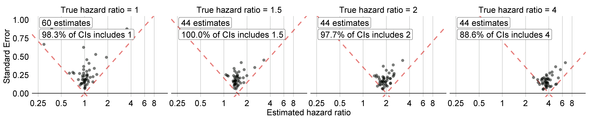
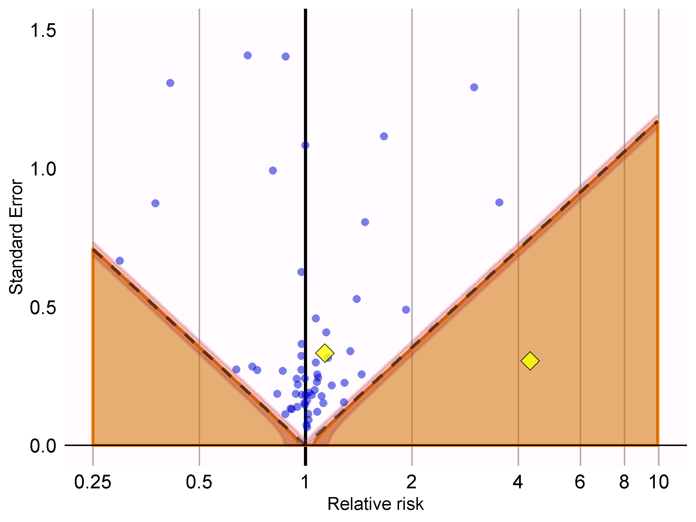

# --翻訳作業中--　方法の妥当性 {#MethodValidity}

\index{方法の妥当性}

*章リード: Martijn Schuemie*

方法の妥当性を検討する際、次の質問に答えようとします。

> この方法は、この質問に答えるために妥当ですか？

「方法」には研究デザインだけでなく、データやデザインの実施も含まれます。したがって、方法の妥当性は、ある意味で包括的なものです。 多くの場合、データ品質、臨床的妥当性、ソフトウェアの妥当性が良くなければ、方法の妥当性を良好に保つことはできません。 方法の妥当性を検討する前に、エビデンスの質に関して、これらの側面はすでに個別に対処しておく必要があります。

方法の妥当性を確立する上での中心的な活動は、分析における重要な仮定が満たされているかどうかを評価することです。例えば、傾向スコアマッチングによって2つの母集団を比較可能になるという前提を立てますが、それが事実であるかどうかを評価する必要があります。可能な場合には、これらの前提を検証するための実証的テストを実施すべきです。例えば、マッチング後の2つの母集団が、幅広い特性において実際に比較可能であることを示す診断を生成することができます。OHDSIでは、分析が実施されるたびに生成および評価されるべき、多くの標準診断を開発してきました。

本章では、集団レベルの推定で使用される手法の妥当性に焦点を当てます。まず、研究デザインに特化した診断法を簡単に説明し、次に、集団レベルの推定を行う研究のすべてではないにしても、ほとんどに適用できる診断法について説明します。最後に、OHDSIツールを使用してこれらの診断法を実行する方法を段階的に説明します。本章の締めくくりとして、OHDSI Methods BenchmarkとOHDSI Methods Libraryへの応用について、高度なトピックも紹介します。

## デザイン特有の診断

\index{研究診断}

各研究デザインには、そのデザインに特有の診断法があります。これらの診断法の多くは、[OHDSI Methods Library](https://ohdsi.github.io/MethodsLibrary/)のRパッケージで実装されており、すぐに利用できます。例えば、第[12.9](https://ohdsi.github.io/TheBookOfOhdsi/PopulationLevelEstimation.html#studyOutputs)部では、[CohortMethod](https://ohdsi.github.io/CohortMethod/)パッケージで生成される幅広い診断法がリストアップされており、以下が含まれます。

-   コホートの初期の比較可能性を評価するための**傾向スコア分布**。

-   モデルから除外すべき潜在変数を特定するための**傾向モデル**。

-   傾向スコア調整によりコホートが比較可能になったかどうかを評価するための**共変量バランス**（ベースライン共変量で測定）。

-   さまざまな分析ステップで除外された対象者の数を観察するための**脱落**。これは、対象とする初期コホートから得られる結果の一般化可能性について情報を提供する可能性があります。

-   質問に答えるのに十分なデータが利用可能かどうかを評価するための**検出力**。

-   典型的な発症までの時間を評価し、Cox モデルの基礎となる比例性の仮定が満たされているかどうかを評価するための**Kaplan Meier 曲線**。

他の研究デザインでは、それらのデザインの異なる仮説を検証するために、異なる診断が必要となります。例えば、自己対照ケースシリーズ（SCCS）デザインでは、観察の終了が結果に依存しないという必要な仮定を確認することができます。この仮定は、心筋梗塞などの深刻で致死の可能性もある事象の場合には、成立していないことがよくあります。この仮定が成り立つかどうかは、図[18.1](https://ohdsi.github.io/TheBookOfOhdsi/MethodValidity.html#fig:timeToObsEnd)に示すプロットを生成することで評価できます。このプロットは、打ち切りとなったもの、打ち切りとならなかったものの観察期間終了までの時間をヒストグラムで示しています。私たちのデータでは、データ収集の最終日（データベース全体で観察が終了した日、例えば抽出日や研究終了日）に観察期間が終了したものを打ち切りなしとし、それ以外を打ち切りありとみなします。図[18.1](https://ohdsi.github.io/TheBookOfOhdsi/MethodValidity.html#fig:timeToObsEnd)では、2つの分布の間にわずかな違いしか見られず、私たちの仮説が正しいことが示唆されています。

```{r timeToObsEnd, fig.cap='打ち切りありと打ち切りなしとされた対象者の観察終了までの時間。',echo=FALSE, out.width='100%', fig.align='center'}
knitr::include_graphics("images/MethodValidity/timeToObsEnd.png")
```

## 推定のための診断

デザイン固有の診断に加え、因果効果の推定法全般に適用できる診断もいくつかあります。これらの多くは、すでに答えがわかっている研究上の仮説であるコントロール仮説の使用に依存しています。コントロール仮説を使用することで、デザインが真実と一致した結果を生み出しているかどうかを評価することができます。コントロールは、ネガティブコントロールとポジティブコントロールに分けることができます。

### ネガティブコントロール {#NegativeControls}

\index{ネガティブコントロール}

ネガティブコントロールとは、因果関係が存在しないと考えられる曝露と結果の組み合わせであり、交絡、選択バイアス、測定誤差を検出する方法として推奨されているネガティブコントロールまたは「偽陰性エンドポイント」（Prasad and Jena [2013年](https://ohdsi.github.io/TheBookOfOhdsi/MethodValidity.html#ref-prased_2013)）が含まれます（Lipsitch, Tchetgen Tchetgen, and Cohen [2010年](https://ohdsi.github.io/TheBookOfOhdsi/MethodValidity.html#ref-lipsitch_2010)） (Arnold et al. [2016](https://ohdsi.github.io/TheBookOfOhdsi/MethodValidity.html#ref-arnold_2016)) 。たとえば、小児期の疾患と後の多発性硬化症（MS）との関係を調査したある研究（Zaadstra et al. [2008](https://ohdsi.github.io/TheBookOfOhdsi/MethodValidity.html#ref-zaadstra_2008)）では、著者はMSの原因とは考えられていない3つのネガティブコントロール（腕の骨折、脳震盪、扁桃摘出）を含めています。この3つのコントロールのうち2つはMSと統計的に有意な関連性を示しており、この研究にはバイアスが生じた可能性を示唆していました。

私たちは、関心のある仮説と比較可能なネガティブコントロールを選択すべきであり、通常は、関心のある仮説と同じ曝露を持つ曝露-アウトカムの組み合わせ（いわゆる「アウトカムコントロール」）または同じ結果を持つ曝露-アウトカムの組み合わせ（「曝露コントロール」）を選択します。ネガティブコントロールは、さらに以下の基準を満たすべきです。

-   曝露がアウトカムを引き起こす**べきではない**。因果関係を考える一つの方法は、仮説を否定するものを考えることです。患者が曝露されなかった場合と曝露された場合とを比較して、結果が引き起こされる（または防止される）可能性があるだろうか？ 時には、これは明らかです。例えば、ACE阻害薬は血管性浮腫を引き起こすことが知られています。しかし、時にはそれほど明白ではないこともあります。例えば、高血圧を引き起こす可能性のある薬物は、間接的に高血圧の結果である心血管疾患を引き起こす可能性があります。

-   曝露はアウトカムを**予防または治療**すべきではありません。これは、真の効果量（例えばハザード比）が1であると考えるのであれば、存在しないはずの因果関係の一つにすぎません。

-   ネガティブコントロールは**データ内に存在**すべきであり、理想的には十分な数であるべきです。この目的を達成するために、有病率に基づいてネガティブコントロールの候補を優先付けします。

-   ネガティブコントロールは理想的には**独立している**べきです。例えば、ネガティブコントロールが互いに祖先（例えば、「巻き爪」と「足の巻き爪」）であったり、兄弟（例えば、「左大腿骨の骨折」と「右大腿骨の骨折」）であったりすることは避けるべきです。

-   ネガティブコントロールは、**ある程度の偏りの可能性**があることが理想的です。例えば、社会保障番号の最後の数字は基本的にランダムな数字であり、交絡を示す可能性は低いでしょう。したがって、ネガティブコントロールとして使用すべきではありません。

また、ネガティブコントロールは、注目する曝露とアウトカムのペアと同じ交絡構造を持つべきであるという意見もあります（Lipsitch, Tchetgen Tchetgen, and Cohen [2010年](https://ohdsi.github.io/TheBookOfOhdsi/MethodValidity.html#ref-lipsitch_2010)）。しかし、この交絡の構造は不明であると私たちは考えています。現実に見られる変数間の関係は、人々が想像するよりもはるかに複雑であることがよくあります。また、交絡因子の構造が分かっていたとしても、その交絡因子とまったく同じ構造を持ち、かつ直接的な因果効果を持たないネガティブコントロールが存在する可能性は低いでしょう。このため、OHDSIではこのようなセットは、関心のある仮説に存在するものも含め、多くの異なるタイプのバイアスを表すと想定して、多数のネガティブコントロールに依存しています。

曝露とアウトカムの間に因果関係がないことは、ほとんど文書化されていません。その代わり、関係性のエビデンスがないことは関係性がないことを意味するという仮定がしばしばなされます。曝露とアウトカムの両方が広範に研究されている場合、この仮定はより妥当性が高くなります。例えば、全く新しい薬物に対するエビデンスがないことは、関係性がないことを意味するのではなく、知識がないことを意味する可能性が高いです。この原則を念頭に、私たちはネガティブコントロールを選択するための半自動化された手順を開発しました（Voss et al. [2016年](https://ohdsi.github.io/TheBookOfOhdsi/MethodValidity.html#ref-voss_2016)）。簡単に説明すると、文献、製品ラベル、および自発報告から得られた情報は自動的に抽出され、統合されてネガティブコントロールの候補リストが作成されます。このリストはその後、自動抽出が正確であったことを確認するためだけでなく、生物学的妥当性などの追加の基準を課すためにも、手動でレビューする必要があります。

### ポジティブコントロール {#PositiveControls}

\index{ポジティブコントロール}

真の相対リスクが1より小さい場合、または1より大きい場合の方法の動作を理解するには、帰無仮説が真実ではないと考えられるポジティブコントロールを使用する必要があります。残念ながら、観察研究における実際のポジティブコントロールには、3つの理由から問題が生じがちです。第一に、ほとんどの研究状況では、例えば2つの治療効果を比較する場合など、その特定の状況に該当するポジティブコントロールが不足しています。第二に、ポジティブコントロールが利用可能であったとしても、効果の大きさが正確にわからないことがあり、また、多くの場合、測定対象の母集団に依存します。第三に、治療が特定の結果を引き起こすことが広く知られている場合、例えば望ましくない結果のリスクを軽減するための措置が取られるなど、その治療を処方する医師の行動に影響を与え、その結果、評価手段としてのポジティブコントロールが役に立たなくなることがあります（Noren et al. [2014年](https://ohdsi.github.io/TheBookOfOhdsi/MethodValidity.html#ref-noren_2014)）。

そのため、OHDSIでは合成したポジティブコントロール（Schuemie, Hripcsak, et al. [2018](https://ohdsi.github.io/TheBookOfOhdsi/MethodValidity.html#ref-schuemie_2018)）を使用しています。これは、曝露のリスクにさらされる期間中に、アウトカムを追加でシミュレーション発生をさせることで、ネガティブコントロールを修正して作成します。例えば、ACE阻害薬への曝露中に、ネガティブコントロールのアウトカム「陥入爪」がn回発生したと仮定します。曝露中にさらにn回のシミュレーション発生を追加すると、リスクは2倍になります。これはネガティブコントロールであるため、対照群と比較した相対リスクは1ですが、追加の発生後は2になります。

重要な問題として、交絡因子の保存が挙げられます。ネガティブコントロールでは強い交絡が示されるかもしれませんが、ランダムに追加のアウトカムを発生させれば、これらから得られる結果は交絡されません。したがって、ポジティブコントロールの交絡に対処する能力の評価については楽観的になることができます。交絡を維持するには、新しい結果が元の結果と同様に、ベースラインの被験者固有の共変量と類似した関連性を示すようにする必要があります。これを達成するために、各アウトカムについて、曝露前に得られた共変量を用いて曝露中のアウトカムに関する生存率を予測するモデルをトレーニングします。これらの共変量には、人口統計学的データ、すべての記録された診断、薬物曝露、測定値、医療処置が含まれます。正則化ハイパーパラメータを選択するために10分割の交差検証を用いるL1正則化ポアソン回帰（Suchard et al. [2013](https://ohdsi.github.io/TheBookOfOhdsi/MethodValidity.html#ref-suchard_2013)）により、予測モデルを適合させます。次に、曝露中のシミュレーション結果を予測率を用いてサンプリングし、真の効果の大きさを望ましい大きさにまで増大させます。その結果、ポジティブコントロールには、実際の結果とシミュレーション結果の両方が含まれます。

図[18.2](https://ohdsi.github.io/TheBookOfOhdsi/MethodValidity.html#fig:posControlSynth)は、このプロセスを示しています。この手順では、いくつかの重要なバイアスの原因をシミュレーションしますが、すべてを捕捉するわけではありません。例えば、測定誤差の影響の一部は存在しません。合成されたポジティブコントロールは、一定の陽性適中率と感度を意味しますが、現実には必ずしもそうではない場合があります。

```{r posControlSynth, fig.cap='ネガティブコントロールからのポジティブコントロールの合成',echo=FALSE, out.width='90%', fig.align='center'}
knitr::include_graphics("images/MethodValidity/posControlSynth.png")
```

各コントロールについて、単一の真の「効果の大きさ」を参照していますが、異なる手法では治療効果の異なる統計値を推定します。因果効果がないと考えるネガティブコントロールでは、相対リスク、ハザード比、オッズ比、罹患率比（条件付き、制限付き）、平均治療効果（ATT）や全体平均治療効果（ATE）など、すべての統計値は1ととなります。ポジティブコントロールを作成するプロセスでは、限界効果が達成される時点まで、この比率が一定に保たれる患者を条件としたモデルを使用し、時間経過や患者間の一定の発生率比で結果を統合します。したがって、真の効果量は、処置群における限界発生率比として保持されることが保証されます。合成に使用されるモデルが正しいという前提の下では、これは条件付き効果量および ATE にも当てはまります。結果はすべてまれであるため、オッズ比は相対リスクとほぼ同じになります。

### 実証的評価 {#metrics}

\index{実証的評価}

ネガティブコントロールとポジティブコントロールに対する特定の手法の推定値に基づき、さまざまな指標を計算することで、その運用特性を理解することができます。例えば、

-   **ROC曲線下面積（AUC）**：ポジティブコントロールとネガティブコントロールを識別する能力。

-   **カバー率**：真の効果量が95%信頼区間内に収まる頻度。

-   **平均精度**：精度は1/(標準誤差)2として計算され、精度が高いほど信頼区間が狭くなる。精度の歪んだ分布を考慮するために幾何平均を使用します。

-   **平均二乗誤差（MSE）**：効果量の推定値の対数と真の効果量の対数との間の平均二乗誤差。

-   **第1種の過誤**：ネガティブコントロールの場合、帰無仮説が棄却された頻度（α=0.05）。これは偽陽性率、もしくは1−特異度と同等です。

-   **第2種の過誤**：ポジティブコントロールの場合、どのくらいの頻度で帰無仮説が棄却されなかったか（α=0.05）。これは偽陰性率、もしくは1−感度と同等である。

-   **推定なし**：推定値を算出できなかったコントロールはいくつあったか？推定値が算出できない理由は様々であり、例えば傾向スコアマッチング後に被験者が残らなかった場合や、結果を持つ被験者が残らなかった場合などである。

ユースケースに応じて、これらの操作特性が目的に適しているかどうかを評価することができます。例えば、シグナル検出を行いたい場合は、第1種の過誤と第2種の過誤を考慮する必要があります。また、α閾値を修正する場合は、代わりにAUCを検討することがあります。

### P値のキャリブレーション

\index{p-value calibration} \index{実証的キャリブレーション}

しばしば、第1種の過誤（α=0.05）は5%よりも大きくなります。言い換えれば、実際には帰無仮説が真であるにもかかわらず、5%よりも高い確率で帰無仮説を棄却してしまう可能性が高いということです。その理由は、p値はランダム誤差、すなわちサンプルサイズが限られていることによる誤差のみを反映しているためです。系統的誤差、例えば交絡による誤差は反映されていません。OHDSIは、p値を補正して第1種の過誤を名目上、回復するためのプロセスを開発しました（Schuemie et al. [2014年](https://ohdsi.github.io/TheBookOfOhdsi/MethodValidity.html#ref-schuemie_2014)） 。ネガティブコントロールの実際の効果推定値から経験的帰無分布を導出します。 これらのネガティブコントロールの推定値は、帰無仮説が真である場合に期待される値を示唆するものであり、経験的帰無分布を推定するためにそれらを使用します。

具体的には、各推定値のサンプリングエラーを考慮して、推定値にガウス確率分布を当てはめます。第i番目のネガティブコントロールとアウトカムの組から推定された対数効果推定値（相対リスク、オッズ、または発生率比）をθで表し、対応する推定標準誤差をτ、i=1,…,nで表します。θi を真の対数効果量とし（ネガティブコントロールでは0と仮定）、βi を対iに関連する真の（ただし未知の）バイアス、すなわち、コントロールが非常に大きかった場合に研究がコントロールihadに対して返すであろう推定値の対数と真の効果量の対数の差とします。標準的なp値の計算と同様に、θi+βiを平均とし、\^τ2iを標準偏差とする正規分布に従うと仮定します。従来のp値の計算では、βiは常にゼロと仮定されていましたが、我々は、μを平均としσ2を分散とする正規分布から生じるβiを仮定します。これは、帰無（バイアス）分布を表します。最尤法によりμとσ2を推定します。つまり、以下の仮定を置きます。

$$\beta_i \sim N(\mu,\sigma^2) \text{  そして  } \hat{\theta}_i \sim N(\theta_i + \beta_i, \tau_i^2)$$

ここで $N(a,b)$ は平均値 $a$ 、分散 $b$ のガウス分布を示します。尤度:

$$L(\mu, \sigma | \theta, \tau) \propto \prod_{i=1}^{n}\int p(\hat{\theta}_i|\beta_i, \theta_i, \hat{\tau}_i)p(\beta_i|\mu, \sigma) \text{d}\beta_i$$

ここから最大尤度推定 $\hat{\mu}$ と $\hat{\sigma}$ を得ます。キャリブレートされたp値を実証的な帰無分布を用いて計算します。新薬-アウトカムペアの効果推定 $\hat{\theta}_{n+1}$ を取り、対応する推定標準誤差 $\hat{\tau}_{n+1}$ を用います。前述の仮定の下で $\beta_{n+1}$ が同じ帰無分布から発生したとして、次が得られます。

$$\hat{\theta}_{n+1} \sim N(\hat{\mu}, \hat{\sigma} + \hat{\tau}_{n+1})$$

ここでは、$\hat{\theta}_{n+1}$ は $\hat{\mu}$ より小さく、新しいペアのキャリブレーションされた片側P値は、

$$\phi\left(\frac{\theta_{n+1} - \hat{\mu}}{\sqrt{\hat{\sigma}^2 + \hat{\tau}_{n+1}^2}}\right)$$

ここでは $\phi(\cdot)$ は、標準正規分布の累積分布関数を表します。また、$\hat{\theta}_{n+1}$ が $\hat{\mu}$ より大きいとき、キャリブレーションされた片側P値は、

$$1-\phi\left(\frac{\theta_{n+1} - \hat{\mu}}{\sqrt{\hat{\sigma}^2 + \hat{\tau}_{n+1}^2}}\right)$$

### 信頼区間のキャリブレーション

\index{confidence interval calibration}

同様に、通常、95%信頼区間のカバー率は95%未満であることが観察されます。真の効果量は、95%信頼区間内に収まるのは95%未満です。信頼区間キャリブレーション（Schuemie, Hripcsak, et al. [2018年](https://ohdsi.github.io/TheBookOfOhdsi/MethodValidity.html#ref-schuemie_2018)）では、ポジティブコントロールも活用することで、p値キャリブレーションの枠組みを拡張します。通常、必ずしもそうとは限りませんが、キャリブレーションされた信頼区間は名義尺度の信頼区間よりも広くなり、標準的な手順では考慮されないがキャリブレーションでは考慮される問題（未測定の交絡、選択バイアス、測定誤差など）を反映しています。

厳密には、ベータ（対iに関連するバイアス）は再びガウス分布から得られると仮定しますが、今回は平均と標準偏差が真のエフェクトサイズである$theta_i$と線形関係にあるものを使用します：

$$\beta_i \sim N(\mu(\theta_i) , \sigma^2(\theta_i))$$

ここでは、

$$\mu(\theta_i) = a + b \times \theta_i \text{ and }$$ $$\sigma(\theta_i) ^2= c + d \times \mid \theta_i \mid$$

a$、$b$、$c$、$d$は、未観測の$beta_i\$を積分した限界化尤度を最大化することで推定します：

$$l(a,b,c,d | \theta, \hat{\theta}, \hat{\tau} ) \propto \prod_{i=1}^{n}\int p(\hat{\theta}_i|\beta_i, \theta_i, \hat{\tau}_i)p(\beta_i|a,b,c,d,\theta_i) \text{d}\beta_i ,$$

最尤推定値 $(\hat{a}, ˶{b}, ˶{c}, ˶{d})$.

系統誤差モデルを用いてキャリブレーションされた信頼区間を計算します。再び$hat{θ}_{n+1}$を新しい対象結果に対する効果推定値の対数とし、$hat{tau}_{n+1}$を対応する推定標準誤差とします。上記の仮定から、$beta_{n+1}$が同じ系統誤差モデルから生じると仮定すると、次のようになります：

$$\hat{\theta}_{n+1} \sim N(
\theta_{n+1} + \hat{a} + \hat{b} \times \theta_{n+1},
\hat{c} + \hat{d} \times \mid \theta_{n+1} \mid + \hat{\tau}_{n+1}^2) .$$

この式を$thetheta_{n+1}$について解くことで、キャリブレーションされた95%CIの下限を求めます：

$$\Phi\left(
\frac{\theta_{n+1} + \hat{a} + \hat{b} \times \theta_{n+1}-\hat{\theta}_{n+1}}
{\sqrt{(\hat{c} + \hat{d} \times \mid \theta_{n+1} \mid) + \hat{\tau}_{n+1}^2}}
\right) = 0.025 ,$$

ここで、$Phi( \cdot)$ は標準正規分布の累積分布関数を表します。確率0.975についても同様に上限を求めます。確率0.5を用いてキャリブレーションされた点推定値を定義します。

p値キャリブレーションと信頼区間のキャリブレーションの両方が[EmpiricalCalibration](https://ohdsi.github.io/EmpiricalCalibration/)パッケージで実装されています。

### 医療機関をまたいだ複製

\index{between-database heterogeneity}

別の方法検証の形として、異なる母集団、異なる医療システム、および/または異なるデータ収集プロセスを表す複数の異なるデータベースで研究を実施することが挙げられます。これまでの研究では、異なるデータベースで同じ研究デザインを実施すると、効果量の推定値が大幅に異なることが示されています（Madigan et al. [2013年](https://ohdsi.github.io/TheBookOfOhdsi/MethodValidity.html#ref-madigan_2013)）。これは、異なる母集団では効果が大幅に異なるか、または異なるデータベースで見られる異なるバイアスを研究デザインが適切に考慮していないことを示唆しています。実際、信頼区間の経験的キャリブレーションによりデータベース内の残差交絡を考慮することで、研究間の異質性を大幅に低減できることがわかっています (Schuemie, Hripcsak, et al. [2018年](https://ohdsi.github.io/TheBookOfOhdsi/MethodValidity.html#ref-schuemie_2018))。

データベース間の異質性を表現する一つの方法として、$I^2$ スコアがあります。これは、偶然ではなく異質性に起因する研究間の総変動の割合を表します（Higgins et al. [2003年](https://ohdsi.github.io/TheBookOfOhdsi/MethodValidity.html#ref-higgins_2003)）。$I^2$ の値を単純に分類することは、すべての状況に適切であるとはいえませんが、25%、50%、75%の$I^2$ 値にそれぞれ「低」、「中程度」、「高」という形容詞を仮に割り当てることはできます。大規模傾向スコア調整を用いた新規ユーザーコホートデザインを使用して、多くのうつ病治療の効果を推定した研究（Schuemie、Ryan、et al. [2018年](https://ohdsi.github.io/TheBookOfOhdsi/MethodValidity.html#ref-schuemie_2018b)）では、推定値の58％のみが$I^2$ が25％未満であることが観察され、実証的なキャリブレーション後、この値は83％に増加しました。

```{block2, type='rmdimportant'}
データベース間の異質性を観察すると、推定値の妥当性に疑問が生じます。残念ながら、その逆は当てはまりません。異質性が観察されないからといって、偏りのない推定値が保証されるわけではありません。すべてのデータベースが同様の偏りを共有し、したがってすべての推定値が一貫して誤っている可能性もあります。
```

### 感度分析

\index{sensitivity analysis}

研究を計画する際には、不確実なデザイン上の選択肢がしばしば存在します。例えば、層化傾向スコアマッチングを用いるべきでしょうか？層化を使用する場合、層をいくつに分けるべきでしょうか？適切なリスクにさらされた期間はどのくらいでしょうか？このような不確実性に直面した場合、解決策の一つは、さまざまな選択肢を評価し、デザイン上の選択肢に対する結果の感度を観察することです。さまざまな選択肢の下で推定値が同じままであれば、その研究は不確実性に強いと言えるでしょう。

この感度分析の定義は、例えばRosenbaum（[2005年](https://ohdsi.github.io/TheBookOfOhdsi/MethodValidity.html#ref-rosenbaum_2005)）が「さまざまな規模の隠れた偏りによって研究の結論がどのように変化するかを評価する」と定義している感度分析の定義と混同すべきではありません。

## 実践におけるメソッド検証

ここでは、第[12章](https://ohdsi.github.io/TheBookOfOhdsi/PopulationLevelEstimation.html#PopulationLevelEstimation)の例を基に、ACE阻害薬（ACEi）が血管性浮腫および急性心筋梗塞（AMI）のリスクに及ぼす影響について、サイアザイド系およびサイアザイド系利尿薬（THZ）と比較して調査します。その章では、すでに、用いたデザインであるコホート法に特有の診断の多くを調査しています。ここでは、他のデザインが使用されていた場合にも適用されていた可能性のある追加の診断を適用します。第[12.7](https://ohdsi.github.io/TheBookOfOhdsi/PopulationLevelEstimation.html#PleAtlas)部で説明されているようにATLASを使用して研究が実施された場合、これらの診断にはATLASによって生成された研究Rパッケージに含まれるShinyアプリが利用できます。第[12.8](https://ohdsi.github.io/TheBookOfOhdsi/PopulationLevelEstimation.html#pleR)部で説明されているように、代わりにRを使用して研究が実施された場合、次の部で説明されているように、さまざまなパッケージで利用可能なR関数を使用する必要があります。

### ネガティブコントロールの選択

私たちは、因果効果は存在しないと考えられるネガティブコントロール、すなわち曝露とアウトカムの組み合わせを選択しなければなりません。私たちの例の研究のような効果の比較の推定では、対象とする曝露も比較対照の曝露も原因ではないと考えられるネガティブコントロールの結果を選択します。私たちは、コントロールに表れるさまざまなバイアスを確実に反映させ、また実証的なキャリブレーションを可能にするために、十分な数のネガティブコントロールを必要とします。経験則として、通常は50～100件のネガティブコントロールを目標とします。これらのコントロールは完全に手作業で作成することも可能ですが、幸いにもATLASには文献、製品ラベル、自発報告からのデータを使用してネガティブコントロールを選択する機能が備わっています。

ネガティブコントロールの候補リストを作成するには、まず、関心のある曝露をすべて含むコンセプトセットを作成する必要があります。このケースでは、図[18.3](https://ohdsi.github.io/TheBookOfOhdsi/MethodValidity.html#fig:exposuresConceptSet)に示すように、ACEiおよびTHZクラスのすべての成分を選択します。

```{r exposuresConceptSet, fig.cap='対象とする曝露および比較対照の曝露を定義するコンセプトを含むコンセプトセット',echo=FALSE, out.width='100%', fig.align='center'}
knitr::include_graphics("images/MethodValidity/exposuresConceptSet.png")
```

次に、「Explore Evidence」タブに移動し、！[ ](images/MethodValidity/generate.png)ボタンをクリックします。エビデンス概要の生成には数分かかりますが、その後、！[ ](images/MethodValidity/viewEvidence.png)ボタンをクリックできます。これにより、図\@ref(fig:candidateNcs)に示されるように、結果のリストが表示されます。

```{r candidateNcs, fig.cap='文献、製品ラベル、および自発的な報告から見つかったエビデンスの概要を示すコントロール候補の結果',echo=FALSE, out.width='100%', fig.align='center'}
knitr::include_graphics("images/MethodValidity/candidateNcs.png")
```

このリストには、条件のコンセプトと、その条件を私たちが定義した曝露のいずれかと関連付けるエビデンスの概要が示されます。例えば、さまざまな戦略を用いてPubMedで曝露とアウトカムを関連付ける文献の数、対象とする曝露の製品ラベルで、条件を可能性のある有害事象として記載しているものの数、自発報告の数を確認できます。デフォルトでは、候補となるネガティブコントロールが最初に表示されるようにリストがソートされます。次に、「ソート順」によってソートされ、これは観察データベースの集合におけるその状態の有病率を表します。ソート順が高いほど、有病率も高くなります。これらのデータベースにおける有病率は、調査を実施したいデータベースにおける有病率と一致しない可能性もありますが、近似値としては妥当であると考えられます。

次のステップは、候補リストを手動で確認することです。通常はリストの上から始め、最も頻度の高い条件から順に確認し、十分であると納得できるまで作業を続けます。この作業を行う一般的な方法としては、リストをCSV（カンマ区切り）ファイルにエクスポートし、第[18.2.1](https://ohdsi.github.io/TheBookOfOhdsi/MethodValidity.html#NegativeControls)部で述べた基準を考慮しながら臨床医に確認してもらいます。

今回の研究例では、付録[C.1](https://ohdsi.github.io/TheBookOfOhdsi/NegativeControlsAppendix.html#AceiThzNsc)にリストされた76のネガティブコントロールを選択します。

### コントロールの仲間

ネガティブコントロールのセットを定義したら、それらを調査に含める必要があります。まず、ネガティブコントロール条件のコンセプトをアウトカムコホートに変換するためのロジックを定義する必要があります。第[12.7.3](https://ohdsi.github.io/TheBookOfOhdsi/PopulationLevelEstimation.html#evaluationSettings)部では、ATLASがユーザーが選択するいくつかのオプションに基づいて、そのようなコホートを作成する方法について説明しています。多くの場合、単にネガティブコントロールのコンセプトまたはその子孫のいずれかの出現に基づいてコホートを作成することを選択します。研究が R で実施される場合、SQL（構造化問い合わせ言語）を使用してネガティブコントロールコホートを構築することができます。第 [9 章](https://ohdsi.github.io/TheBookOfOhdsi/SqlAndR.html#SqlAndR)では、SQL および R を使用してコホートを作成する方法について説明しています。適切な SQL および R を記述する方法については、読者の練習問題とします。

OHDSIツールは、ネガティブコントロールから派生したポジティブコントロールを自動的に生成して含める機能も提供しています。この機能は、第[12.7.3](https://ohdsi.github.io/TheBookOfOhdsi/PopulationLevelEstimation.html#evaluationSettings)部で説明されているATLASの「評価設定」セクションにあり、[MethodEvaluation](https://ohdsi.github.io/MethodEvaluation/)パッケージの`synthesizePositiveControls`関数に実装されています。ここでは、生存モデルを使用して、真の効果サイズが1.5、2、4の3つのポジティブコントロールを各ネガティブコントロールに対して生成します。

```{r tidy=FALSE,eval=FALSE}
library(MethodEvaluation)
# ターゲットの曝露（ACEi = 1）のみを使用して、
# すべてのネガティブコントロールの曝露-アウトカムの組を含むデータフレームを作成
eoPairs <- data.frame(exposureId = 1,
                      outcomeId = ncs)

pcs <- synthesizePositiveControls(
  connectionDetails = connectionDetails,
  cdmDatabaseSchema = cdmDbSchema,
  exposureDatabaseSchema = cohortDbSchema,
  exposureTable = cohortTable,
  outcomeDatabaseSchema = cohortDbSchema,
  outcomeTable = cohortTable,
  outputDatabaseSchema = cohortDbSchema,
  outputTable = cohortTable,
  createOutputTable = FALSE,
  modelType = "survival",
  firstExposureOnly = TRUE,
  firstOutcomeOnly = TRUE,
  removePeopleWithPriorOutcomes = TRUE,
  washoutPeriod = 365,
  riskWindowStart = 1,
  riskWindowEnd = 0,
  endAnchor = "cohort end",
  exposureOutcomePairs = eoPairs,
  effectSizes = c(1.5, 2, 4),
  cdmVersion = cdmVersion,
  workFolder = file.path(outputFolder, "pcSynthesis"))
```

注意すべきは、推定研究のデザインで使用されたリスク時間設定を模倣しなければならないということです。`synthesizePositiveControls`関数は、曝露とネガティブコントロールのアウトカムに関する情報を抽出し、曝露とアウトカムの組み合わせごとにアウトカムモデルを適合させ、結果を統合します。ポジティブコントロールのアウトカムコホートは、`cohortDbSchema`および`cohortTable`で指定されたコホートテーブルに追加されます。結果の`pcs`データフレームには、統合されたポジティブコントロールの情報が含まれます。

次に、効果を推定するために使用したのと同じ研究を実行して、ネガティブコントロールとポジティブコントロールの効果も推定する必要があります。ATLASの比較ダイアログでネガティブコントロールのセットを設定すると、ATLASはこれらのコントロールの推定値を計算するように指示されます。同様に、評価設定でポジティブコントロールを生成するように指定すると、それらも分析に含まれます。Rでは、ネガティブコントロールとポジティブコントロールは、他の結果と同様に処理されます。[OHDSI Methods Library](https://ohdsi.github.io/MethodsLibrary/)のすべての推定パッケージは、多くの効果を効率的に推定することを容易に可能にします。

### 実証されたパフォーマンス

図[18.5](https://ohdsi.github.io/TheBookOfOhdsi/MethodValidity.html#fig:controls)は、私たちの研究例に含まれているネガティブコントロールとポジティブコントロールについて、真の効果サイズ別に層別した推定効果サイズを示しています。このプロットは、ATLASによって生成された研究Rパッケージに付属するShinyアプリに含まれており、[MethodEvaluation](https://ohdsi.github.io/MethodEvaluation/)パッケージの`plotControls`関数を使用して生成することができます。コントロールの数は、推定値を生成したりポジティブコントロールを統合したりするのに十分なデータがなかったため、定義された数よりも少ない場合が多いことに注意してください。

```{r controls, fig.cap='ネガティブコントロール（真のハザード比=1）およびポジティブコントロール（真のハザード比> 1）に関する推定値。各点はコントロールを表します。点線の下にある推定値は、真の効果サイズを含まない信頼区間を持ちます。',echo=FALSE, out.width='100%', fig.align='center'}

```

これらの推定値をもとに、[MethodEvaluation](https://ohdsi.github.io/MethodEvaluation/)パッケージの`computeMetrics`関数を使用して、表 \@ref(tab:exampleMetrics)に示すメトリクスを計算することができます。

| Metric         | Value |
|:---------------|------:|
| AUC            |  0.96 |
| Coverage       |  0.97 |
| Mean Precision | 19.33 |
| MSE            |  2.08 |
| Type 1 error   |  0.00 |
| Type 2 error   |  0.18 |
| Non-estimable  |  0.08 |

: (#tab:exampleMetrics) ネガティブコントロールとポジティブコントロールの推定値から得られたメソッドのパフォーマンスメトリクス

カバー率と第１種の過誤は、それぞれ95％と5％という公称値に非常に近く、AUCも非常に高いことがわかります。これは必ずしもそうなるものではありません。

図[18.5](https://ohdsi.github.io/TheBookOfOhdsi/MethodValidity.html#fig:controls)では、真のハザード比が1である場合の信頼区間すべてに1が含まれていませんが、表[18.1](https://ohdsi.github.io/TheBookOfOhdsi/MethodValidity.html#tab:exampleMetrics)の第1種の過誤は0%です。これは例外的な状況であり、[Cyclops](https://ohdsi.github.io/Cyclops/)パッケージの信頼区間が尤度プロファイリングを用いて推定されることによるものです。この方法は従来の方法よりも正確ですが、非対称な信頼区間になる可能性があります。一方、p値は対称な信頼区間を仮定して計算され、これは第1種の過誤を計算する際に使用されたものです。

### P値のキャリブレーション

ネガティブコントロールの推定値を使用して、p値を調整することができます。これはShinyアプリでは自動的に行われ、Rでは手動で行うことができます。第[12.8.6](https://ohdsi.github.io/TheBookOfOhdsi/PopulationLevelEstimation.html#MultipleAnalyses)部で説明したように、要約オブジェクト`summ`を作成したと仮定すると、経験的なキャリブレーション効果のプロットを作成することができます。

```{r tidy=FALSE,eval=FALSE}
# Estimates for negative controls (ncs) and outcomes of interest (ois):
ncEstimates <- summ[summ$outcomeId %in% ncs, ]
oiEstimates <- summ[summ$outcomeId %in% ois, ]

library(EmpiricalCalibration)
plotCalibrationEffect(logRrNegatives = ncEstimates$logRr,
                      seLogRrNegatives = ncEstimates$seLogRr,
                      logRrPositives = oiEstimates$logRr,
                      seLogRrPositives = oiEstimates$seLogRr,
                      showCis = TRUE)
```

```{r pValueCal, fig.cap='P-value calibration: estimates below the dashed line have a conventional p < 0.05. Estimates in the shaded area have calibrated p < 0.05. The narrow band around the edge of the shaded area denotes the 95\\% credible interval. Dots indicate negative controls. Diamonds indicate outcomes of interest.',echo=FALSE, out.width='70%', fig.align='center'}

```

図[18.6](https://ohdsi.github.io/TheBookOfOhdsi/MethodValidity.html#fig:pValueCal)では、陰影部分が破線で示された領域とほぼ完全に重なっていることがわかります。これは、ネガティブコントロールではほとんどバイアスが観察されなかったことを示しています。対象とするアウトカム（AMI）の1つは、破線と陰影部分の上にあり、未補正および補正後のp値の両方において帰無仮説を棄却できないことを示しています。もう一方のアウトカム（血管性浮腫）は、明らかにネガティブコントロールから際立っており、未補正および補正済みのp値がいずれも0.05未満である領域内に収まっています。

補正済みのp値を計算することができます。

```{r tidy=FALSE,eval=FALSE}
null <- fitNull(logRr = ncEstimates$logRr,
                seLogRr = ncEstimates$seLogRr)
calibrateP(null,
           logRr= oiEstimates$logRr,
           seLogRr = oiEstimates$seLogRr)
```

```{r echo=FALSE,message=FALSE,eval=TRUE}
cat("[1] 1.604351e-06 7.159506e-01")
```

そして、キャリブレーションされていないp値と比較してみましょう。

```{r tidy=FALSE,eval=FALSE}
oiEstimates$p
```

```{r echo=FALSE,message=FALSE,eval=TRUE}
cat("[1] [1] 1.483652e-06 7.052822e-01")
```

予想通り、バイアスはほとんど観察されなかったため、未補正および補正後のp値は非常に類似しています。

### 信頼区間のキャリブレーション

同様に、ネガティブコントロールとポジティブコントロールの推定値を用いて、信頼区間をキャリブレーションすることができます。Shinyアプリは、キャリブレーションされた信頼区間を自動的に報告します。Rでは、[EmpiricalCalibration](https://ohdsi.github.io/EmpiricalCalibration/)パッケージの`fitSystematicErrorModel`および`calibrateConfidenceInterval`関数を使用して、信頼区間をキャリブレーションすることができます。詳細は、[「信頼区間の経験的キャリブレーション」のヴィネット](https://ohdsi.github.io/EmpiricalCalibration/articles/EmpiricalCiCalibrationVignette.html)を参照してください。

キャリブレーション前の推定ハザード比（95%信頼区間）は、血管性浮腫とAMIでそれぞれ4.32（2.45 - 8.08）と1.13（0.59 - 2.18）です。補正されたハザード比はそれぞれ4.75（2.52 - 9.04）および1.15（0.58 - 2.30）です。

### データベース間の異質性

1つのデータベース（この場合はIBM MarketScan Medicaid (MDCD)データベース）で分析を実施したのと同様に、共通データモデル（CDM）に準拠する他のデータベースでも同じ分析コードを実行することができます。図[18.7](https://ohdsi.github.io/TheBookOfOhdsi/MethodValidity.html#fig:forest)は、血管性浮腫の結果について、合計5つのデータベースにわたるフォレストプロットとメタ分析推定値（ランダム効果を仮定）（DerSimonianおよびLaird [1986年](https://ohdsi.github.io/TheBookOfOhdsi/MethodValidity.html#ref-dersimonian_1986)）を示しています。この図は、[EvidenceSynthesis](https://ohdsi.github.io/EvidenceSynthesis/)パッケージの`plotMetaAnalysisForest`関数を使用して生成されました。

```{r forest, fig.cap='Effect size estimates and 95\\% confidence intervals (CI) from five different databases and a meta-analytic estimate when comparing ACE inhibitors to thiazides and thiazide-like diuretics for the risk of angioedema.',echo=FALSE, out.width='90%', fig.align='center'}
knitr::include_graphics("images/MethodValidity/forest.png")
```

すべての信頼区間が1より大きいため、何らかの影響があるという点では一致していることが示唆されますが、$I^2$ はデータベース間の異質性を示唆しています。しかし、図[18.8](https://ohdsi.github.io/TheBookOfOhdsi/MethodValidity.html#fig:forestCal)で示したようにキャリブレーション済みの信頼区間を使用して$I^2$ を計算すると、この異質性は、ネガティブコントロールとポジティブコントロールを通じて各データベースで測定されたバイアスによって説明できることが分かります。経験的なキャリブレーションは、このバイアスを適切に考慮しているようです。

```{r forestCal, fig.cap='Calibrated Effect size estimates and 95\\% confidence intervals (CI) from five different databases and a meta-analytic estimate for the hazard ratio of angioedema when comparing ACE inhibitors to thiazides and thiazide-like diuretics.',echo=FALSE, out.width='90%', fig.align='center'}
knitr::include_graphics("images/MethodValidity/forestCal.png")
```

### 感度分析

分析におけるデザインの選択肢のひとつは、傾向スコアで変数比マッチングを使用することでした。しかし、傾向スコアで層別化を使用することも可能でした。この選択肢については不明な点があるため、両方を使用することにしました。表[18.2](https://ohdsi.github.io/TheBookOfOhdsi/MethodValidity.html#tab:sensAnalysis)は、変数比マッチングと層別化（10の均等サイズの層）を使用した場合のAMIと血管性浮腫に対する効果サイズ推定値を示している（キャリブレーションありとキャリブレーションなしの両方）。

| Outcome | Adjustment | Uncalibrated | Calibrated |
|:-----------------|:-----------------|------------------|------------------|
| Angioedema | Matching | 4.32 (2.45 - 8.08) | 4.75 (2.52 - 9.04) |
| Angioedema | Stratification | 4.57 (3.00 - 7.19) | 4.52 (2.85 - 7.19) |
| Acute myocardial infarction | Matching | 1.13 (0.59 - 2.18) | 1.15 (0.58 - 2.30) |
| Acute myocardial infarction | Stratification | 1.43 (1.02 - 2.06) | 1.45 (1.03 - 2.06) |

: 表18.2：2つの分析におけるキャリブレーション前とキャリブレーション後のハザード比（95%信頼区間）

マッチングと層化分析による推定値は、強い一致を示しており、層化分析の信頼区間はマッチングの信頼区間内に完全に収まっています。このことは、このデザイン選択に関する不確実性が推定値の妥当性に影響を与えないことを示唆しています。層化はより高い効果量（より狭い信頼区間）をもたらすように見えますが、これは驚くことではありません。マッチングではデータの損失が生じますが、層化では生じないためです。この代償として、層内の残差交絡によりバイアスが増加する可能性がありますが、キャリブレーションされた信頼区間にバイアスの増加が反映されているというエビデンスは見当たりません。

```{block2, type='rmdimportant'}
研究診断により、研究を完全に実施する前でもデザインの選択肢を評価することができます。すべての研究診断を生成し、確認してからプロトコルを確定しすることをお勧めします。P-ハッキング（望ましい結果を得るためにデザインを調整すること）を避けるため、対象となる効果量の推定値をブラインドした状態で実施する必要があります。
```

## OHDSIメソッド評価ベンチマーク

\index{OHDSI Methods Benchmark}

推奨される方法は、適用される文脈の中で、その手法のパフォーマンスを経験的に評価することですが、関心のある曝露とアウトカムのペア（例えば、同じ曝露または同じアウトカムを用いる）と研究で使用されるデータベースに類似したネガティブコントロールとポジティブコントロールを使用して、一般的な手法のパフォーマンスを評価することも価値があります。これが、OHDSI メソッド評価ベンチマークが開発された理由です。このベンチマークは、慢性または急性のアウトカム、長期または短期の曝露など、幅広い範囲のコントロール質問でパフォーマンスを評価します。このベンチマークの結果は、メソッドの全体的な有用性を実証するのに役立ち、コンテクスト固有に実証評価が利用できない（または利用できない）場合、メソッドのパフォーマンスに関する事前評価を形成するために用いることができます。このベンチマークは、慎重に選択された200件のネガティブコントロールから構成されており、これらは8つのカテゴリーに層別することができ、各カテゴリーのコントロールは同じ曝露または同じアウトカムを共有しています。これらの200件のネガティブコントロールから、第[18.2.2](https://ohdsi.github.io/TheBookOfOhdsi/MethodValidity.html#PositiveControls)部で説明されているように、600件の合成されたポジティブコントロールが導かれます。手法を評価するには、すべてのコントロールについて効果量の推定値を生成するためにその手法を用いる必要があり、その後に、第[18.2.3](https://ohdsi.github.io/TheBookOfOhdsi/MethodValidity.html#metrics) 部で説明されている評価基準を計算することができます。ベンチマークは公開されており、[MethodEvaluation](https://ohdsi.github.io/MethodEvaluation/) パッケージの [「OHDSI Methods Benchmark vignette](https://ohdsi.github.io/MethodEvaluation/articles/OhdsiMethodsBenchmark.html)」で説明されているように展開することができます。

私たちは、OHDSI Methods Library に収められているすべての手法をこのベンチマークで実行し、手法ごとにさまざまな分析を選択しました。例えば、コホート法は傾向スコアマッチング、層化、重み付けを用いて評価されました。この実験は、4つの大規模な医療観察データベース上で実行されました。オンラインのShinyアプリで閲覧できる結果^[63](https://ohdsi.github.io/TheBookOfOhdsi/MethodValidity.html#fn63)^によると、いくつかの手法ではAUC（ポジティブコントロールとネガティブコントロールを区別する能力）が高い値を示しているものの、ほとんどの手法では図[18.9](https://ohdsi.github.io/TheBookOfOhdsi/MethodValidity.html#fig:methodEval)に示されているように、第1種の過誤が高く、95%信頼区間のカバー率が低いことが示されています。

```{r methodEval, fig.cap='Methods LibraryのMethodsに対する95\\%信頼区間のカバー率。各ドットは分析選択の特定セットの性能を表します。点線は名目上の性能（95\\%カバー率）を示します。SCCS = 自己対照症ケースシリーズ、GI = 胃腸、IBD = 炎症性腸疾患。', echo=FALSE, out.width='100%', fig.align='center', fig.pos='h'}
knitr::include_graphics("images/MethodValidity/methodEval.png")
```

このことは、経験的評価とキャリブレーションの必要性を強調しています。経験的評価が実施されていない場合、これはほぼすべての公表された観察研究に当てはまりますが、私たちは図[18.9](https://ohdsi.github.io/TheBookOfOhdsi/MethodValidity.html#fig:methodEval)の結果から事前に情報を得て、真の効果の大きさが95%信頼区間には含まれていない可能性が高いと結論づけなければなりません。

また、Methods Libraryにおけるデザインの評価では、経験則に基づくキャリブレーションによって第1種の過誤と信頼区間が名目上の値に回復することが示されていますが、多くの場合、第2種の過誤が増し、精度が低下するという代償を伴います。

## まとめ

```{block2, type='rmdsummary'}
- 手法の妥当性は、その手法の前提条件が満たされているかどうかによって決まります。
- 可能な場合、これらの前提条件は研究診断を用いて経験的に検証されるべきです。
- コントロール仮説、すなわち答えが既知の質問は、特定の研究デザインが真と一致する回答を生み出すかどうかを評価するために使用されるべきです。
- 多くの場合、p値や信頼区間は、コントロール仮説を用いて測定された名目上の特性を示しません。
- これらの特性は、経験的なキャリブレーションによって多くの場合、名目上の特性に復元することができます。
- 研究診断は、研究者がp-hackingを回避するために関心のある効果に対して盲検性を維持する限り、分析デザインの選択を導き、プロトコルを適応させるために使用することができます。
```
