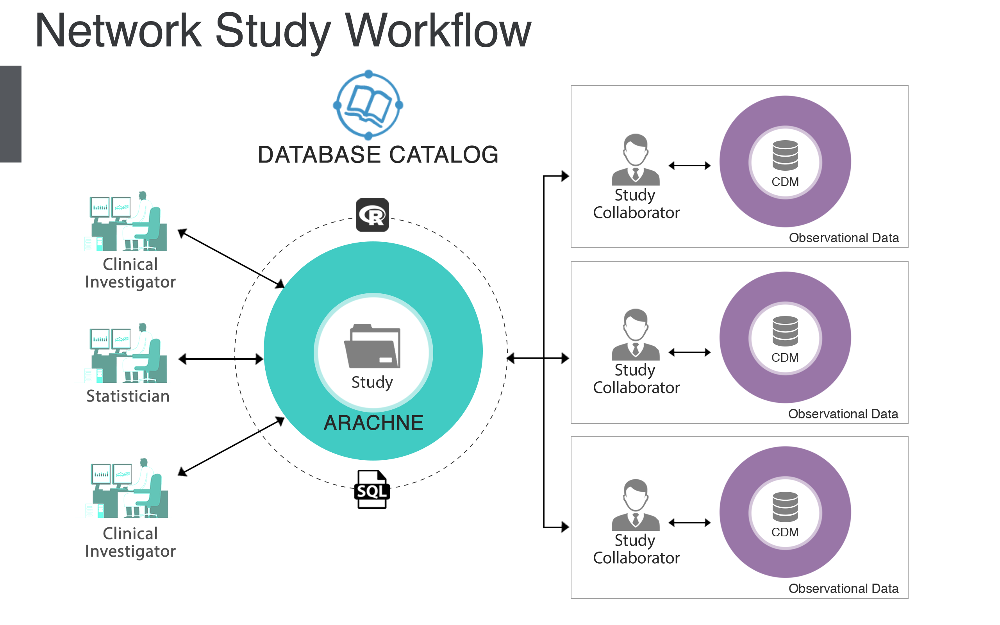

# OHDSI ネットワーク研究 {#NetworkResearch}

*章リード: Kristin Kostka, Greg Klebanov & Sara Dempster*

OHDSIの使命は観察研究を通じて高品質なエビデンスを生成することです。これを実現する主な方法は、共同研究によるものです。前の章では、OHDSIコミュニティが高品質で再現性のある研究を促進するための標準とツール（OMOP標準化語彙、共通データモデル（CDM）、分析パッケージ、ATLAS、および遡及データベース研究を実行するための研究手順（Chapter \@ref(StudySteps)））について説明しました。OHDSIネットワーク研究は、広範囲にわたる地理的に分散したデータに対して、透明性、一貫性、再現性のある方法で研究を行うことの集大成を表しています。本章では、OHDSIネットワーク研究とは何か、ネットワーク研究の実行方法、およびARACHNE Research Networkのような支援技術について説明します。

## OHDSI 研究ネットワークとして

\index{研究ネットワーク}

OHDSI研究ネットワークは、ヘルスケアにおける観察データ研究を進めることを目指す国際的な研究者の協力体です。現在、このネットワークにはOMOP共通データモデルに標準化された100以上のデータベースが含まれており、これらは合わせて10億以上の患者記録を表しています。OHDSIはオープンネットワークであり、世界中の患者レベルデータを持つ医療機関を、データをOMOP CDMに変換してネットワーク研究に参加することで歓迎しています。データの変換が完了すると、共同研究者はOHDSIプログラムマネージャーによって維持されるデータネットワークセンサスにサイト情報を報告するよう招かれます。各OHDSIネットワークサイトは自発的に参加します。義務はありません。各サイトはそれぞれのネットワーク研究に自由に参加します。各研究では、データはファイアウォールの後ろでサイトに留まります。ネットワークサイトでの患者レベルのデータプーリングは行われません。**共有されるのは集計結果のみです。**

```{block2, type='rmdimportant'}
**データ所有者がOHDSIネットワークに参加する利点**

- **無料ツールへのアクセス:** OHDSIはデータの特性分析と標準化された分析のための無料のオープンソースツールを公開しています（例：臨床概念のブラウジング、コホートの定義と特性分析、人口レベル推定と患者レベル予測研究の実行）。
- **一流の研究コミュニティへの参加:** ネットワーク研究の著作と公開、さまざまな分野および利害関係者グループのリーダーとの協力。
- **ケアのベンチマークの機会:** ネットワーク研究は、データパートナー間での臨床特性評価と品質改善のベンチマークを可能にできます。


```


## OHDSIネットワーク研究

\index{network study}

前章（Chapter @ref(StudySteps)）では、CDM（共通データモデル）を使用して研究を実施するための一般的な設計上の考慮事項について議論しました。一般的に、研究は単一のCDM上で行われるか、複数のCDM上で行われるかのいずれかです。単一の機関のCDMデータ内で実行することもあれば、複数の機関全体で実行することもあります。このセクションでは、なぜ分析を複数の機関に拡大してネットワーク研究を行うことを考えるのかについて議論します。

### OHDSIネットワーク研究を実施する動機

観察研究の典型的な使用ケースは、「現実世界」での治療の比較有効性または安全性を調査することです。より具体的には、臨床試験の一般化可能性に関する懸念を解消するために、市販後の設定で臨床試験を再現することを目指すことがあります。別のシナリオでは、臨床試験で一度も比較されたことのない2つの治療を比較する研究を実施したいかもしれません。あるいは、臨床試験では観察するのに十分な力を持たなかった稀な市販後の安全性の結果を研究する必要があるかもしれません。これらの研究質問に対処するためには、サイトの1つまたは2つのデータベースで単一の観察研究を実行するだけでは不十分な場合があります。これは特定の患者グループの文脈でのみ意味のある答えを得ることになるからです。

観察研究の結果は、データソースの場所によって異なる多くの要因（遵守、遺伝的多様性、環境要因、全体的な健康状態など）によって影響を受ける可能性があります。臨床試験の文脈では、これらの要因をバリエーションとして考慮することは難しいかもしれません。同じ研究質問に関する臨床試験が存在したとしてもです。したがって、観察研究をネットワークで実行する典型的な動機は、データソースおよび可能性のある研究対象者の多様性を増やし、結果がどれだけ一般化できるかを理解することです。言い換えれば、研究結果が複数のサイトで再現できるか、それとも異なるか、そして異なる場合はその理由について何か洞察を得ることができるかということです。

したがって、ネットワーク研究は、多くの設定およびデータソースを検討することにより、「現実世界」の要因が観察研究の結果にどのように影響するかを調査する機会を提供します。

### OHDSIネットワーク研究の定義

```{block2, type='rmdimportant'}
**いつ研究が*ネットワーク*研究と見なされるのか？** OHDSI研究は、異なる機関の複数のCDM上で実行されると、OHDSIネットワーク研究となります。

```
ネットワーク研究に対するOHDSIのアプローチは、OMOP CDMと標準化されたツールおよび研究パッケージを使用し、すべてのパラメータを完全に指定して研究を実行します。OHDSI標準分析は、ネットワーク研究のアーティファクトを減らし、効率と拡張性を向上させるように設計されています。

ネットワーク研究はOHDSI研究コミュニティの重要な一部です。ただし、OHDSI研究がOHDSIネットワーク全体でパッケージ化され、共有される義務はありません。単一の機関内でOMOP CDMおよびOHDSIメソッドライブラリを使用して研究を実施することや、研究を特定の機関に限定することもできます。これらの研究貢献はコミュニティにとっても同様に重要です。研究を単一のデータベースで実行するか、限られたパートナーセットで研究を実施するか、OHDSIネットワーク全体で研究を開放するかは、各研究者の裁量に委ねられています。この章では、OHDSIコミュニティが実施するオープンなネットワーク研究について説明します。

**オープンなOHDSIネットワーク研究の要素：**
オープンなOHDSIネットワーク研究を実施する際には、完全に透明な研究を行うことを約束しています。これには以下のいくつかの要素が含まれます：

- すべての文書、研究コードおよび結果はOHDSI GitHubで公開されます。
- 研究者は、実施される分析の範囲と意図を詳細に記した公開された研究プロトコルを作成し、公開する必要があります。
- 研究者は、CDMに準拠したコードを持つ研究パッケージ（通常はRまたはSQLで）を作成する必要があります。
- 研究者は、OHDSIネットワーク研究のプロモーションと共同研究者の募集を支援するためにOHDSIコミュニティコールに参加することが推奨されます。
- 分析終了後、集計された研究結果はOHDSI GitHubで公開されます。
- 可能な場合、研究者は研究R Shinyアプリケーションを[data.ohdsi.org](http://data.ohdsi.org)に公開することが推奨されます。

次のセクションでは、独自のネットワーク研究を作成する方法およびネットワーク研究の実施に関する独特の設計および物流面の考慮事項について説明します。

### OHDSIネットワーク研究の設計上の考慮事項

\index{design considerations for network research}

OHDSIネットワーク全体で実行するための研究を設計するには、研究コードを設計し構築するためのパラダイムシフトが必要です。通常は、ターゲットデータセットを念頭に置いて研究を設計することがあるでしょう。その際、分析に使用するデータ内の真実であることを知っているものに基づいてコードを書くかもしれません。例えば、血管浮腫のコホートを構築する場合、あなたのCDMに表現されている血管浮腫の概念コードのみを選択するかもしれません。これはデータが特定のケア設定（例：一次医療、外来診療）または地域（例：米国中心）に特定の場合に問題となるかもしれません。あなたのコード選択はコホート定義をバイアスしているかもしれません。

OHDSIネットワーク研究では、もうあなたのデータのためだけに研究パッケージを設計および構築しているわけではありません。あなたは複数のサイトでグローバルに実行される研究パッケージを構築しています。参加サイトの基礎データを見ることはありません。OHDSIネットワーク研究では結果ファイルのみを共有します。研究パッケージはCDMのドメインで可能な限りのデータを収集することしかできません。観察ヘルスデータがキャプチャされるケア設定の多様性を表現するために、概念セット作成に対する徹底的なアプローチが必要となります。OHDSI研究パッケージは通常すべてのサイトで同じコホート定義を使用します。この意味で、ネットワーク内の適格データのサブセット（例：クレーム中心のデータまたはEHR特有のデータ）のみを表現する定義にバイアスしないように全体的なアプローチを考える必要があります。複数のCDMに移植可能な徹底的なコホート定義を記述することが奨励されます。OHDSI研究パッケージはすべてのサイトで同じパラメータ化されたコードを使用しますが、データベースレイヤーへの接続とローカル結果の保存に関しては固有のカスタマイズがわずかに行われます。後ほど、さまざまなデータセットからの臨床結果の解釈への影響について説明します。

臨床コーディングのバリエーションに加え、ローカルの技術インフラストラクチャのバリエーションを予期して設計する必要があります。あなたの研究コードは単一の技術環境でのみ実行されるわけではありません。各OHDSIネットワークサイトは独自のデータベースレイヤーの選択を行います。これは、特定のデータベース方言に対してハードコードすることはできないことを意味します。研究コードは、方言内の演算子に簡単に修正できるSQLのタイプにパラメータ化する必要があります。幸い、OHDSIコミュニティには、さまざまなデータベース方言に対してCDM準拠の研究パッケージを一般化するのに役立つATLAS、[DatabaseConnector](https://ohdsi.github.io/DatabaseConnector/)、および[SqlRender](https://ohdsi.github.io/SqlRender/)のようなソリューションがあります。OHDSIの研究者は、他のネットワーク研究サイトから協力を求め、異なる環境での研究パッケージの実行をテストおよび検証することを奨励されます。コーディングエラーが発生した場合、OHDSI研究者は[OHDSIフォーラム](http://forums.ohdsi.org)を利用してパッケージの問題解決を議論およびデバッグします。

### OHDSIネットワーク研究の物流面の考慮事項

\index{logistics of network research}

OHDSIはオープンサイエンスコミュニティであり、OHDSI中央調整センターはその協力者にコミュニティ研究をリードおよび参加するためのコミュニティインフラストラクチャを提供します。すべてのOHDSIネットワーク研究には、リード研究者が必要であり、それはOHDSIコミュニティ全体からの任意の協力者が努めることができます。OHDSIネットワーク研究には、リード研究者、共同研究者、および参加ネットワークデータパートナー間の調整が必要です。各サイトは、必要に応じて、研究プロトコルが承認され、ローカルCDMで実行することが承認されていることを確認するための独自のデューデリジェンスを行う必要があります。データ分析者は、研究を実行するための適切な権限を有効にするために、ローカルのITチームの支援を求める必要があるかもしれません。各サイトの研究チームの規模と範囲は、提案されたネットワーク研究の規模と複雑さ、およびサイトのOMOP CDMおよびOHDSIツールスタックの導入の成熟度の関数です。サイトがOHDSIネットワーク研究を実施する経験のレベルも、必要な人員に影響を与えます。

各研究のためのサイト立ち上げ活動には以下が含まれるかもしれません：

- 必要に応じて、研究を倫理審査委員会（または同等の機関）に登録すること
- 必要に応じて、倫理審査委員会の承認を受けて研究を実施すること
- 承認されたCDMに対してスキーマを読み書きするデータベースレベルの許可を受けること
- 研究パッケージの実行RStudio環境の機能的な設定を確保すること
- 技術的な異常がないか研究コードをレビューすること
- 技術的制約内でパッケージを実行するために必要な依存Rパッケージを許可およびインストールするためにローカルのITチームと協力すること

```{block2, type='rmdimportant'}
**データ品質とネットワーク研究：** Chapter @ref(ExtractTransformLoad) で議論したように、品質管理はETLプロセスの基本的かつ反復的な部分です。これはネットワーク研究プロセスの外で定期的に実施するべきです。ネットワーク研究のために、リード研究者は参加サイトのデータ品質レポートをレビューすることを依頼するか、寄与データソースの潜在的なバリエーションを理解するためのカスタムSQLクエリを設計するかもしれません。OHDSI内部で進行しているデータ品質の取り組みについての詳細はChapter @ref(DataQuality)をご覧ください。

```

各サイトには、研究パッケージを実行するローカルデータ分析者がいます。この人は研究パッケージの出力をレビューして、個人情報が送信されないことを確認しなければなりませんが、すでにCDM内のすべてのデータは匿名化されています。Population-Level Effect Estimation（PLE）やPatient Level Prediction（PLP）などの事前構築されたOHDSIメソッドを使用する場合、特定の分析に対する最小セルカウントの設定が可能です。データ分析者はこれらのしきい値をレビューし、ローカルのガバナンスポリシーに従っていることを確認する必要があります。

研究結果を共有する際、データ分析者は結果の送信方法および結果の外部公開のための承認プロセスを遵守しなければなりません。**OHDSIネットワーク研究は患者レベルのデータを共有しません。** 言い換えれば、異なるサイトからの患者レベルのデータが中央の環境にプールされることはありません。研究パッケージ는結果ファイル（例：集計統計、ポイントエス。
## OHDSIネットワーク研究の実行

\index{running network research}

OHDSIネットワーク研究を実行するには、以下の三つの一般的な段階があります：

- 研究デザインと実現可能性
- 研究実行
- 結果の普及と公開

### 研究デザインと実現可能性

研究の実現可能性の段階（または事前研究段階）は、研究質問を定義し、この質問に答えるためのプロセスを研究プロトコルによって説明します。この段階は、参加サイト全体で研究プロトコルを実行することの実現可能性を評価することに焦点を当てています。

実現可能性段階の成果は、ネットワーク実行のために公開される最終的なプロトコルと研究パッケージの生成です。正式なプロトコルは、研究チーム（しばしば出版のための責任著者となる指定研究リードを含む）と研究のタイムラインに関する情報を詳述します。プロトコルは、追加のネットワークサイトがCDMデータで完全な研究パッケージをレビュー、承認、実行するための重要なコンポーネントです。プロトコルには、研究集団、使用される方法、結果の保存と分析方法、および研究結果が完了後にどのように普及されるか（例：出版、科学会議での発表など）に関する情報が含まれている必要があります。

実現可能性段階は明確に定義されたプロセスではありません。これは提案された研究の種類に大きく依存する一連の活動です。最低限、研究リードは、対象患者集団を含む関連ネットワークサイトを特定するために時間を費やします。その可能な限り、研究リードは自身のCDMを利用して対象コホートを設計するべきです。ただし、ネットワーク研究を実行するために研究リードがリアルな患者データを持つライブOMOP CDMにアクセスする必要はありません。研究リードは合成データ（例：CMS Synthetic Public Use Files、MitreのSyntheticMass、またはSynthea）を使用して対象コホート定義を設計し、OHDSIネットワークサイトの協力者にこのコホートの実現可能性を検証するよう依頼することができます。実現可能性活動には、協力者にATLASのJSONファイルを使用してコホートを作成および特徴付けることや、研究Rパッケージをテストして初期診断を行うことなどが含まれます（詳細はChapter \@ref(StudySteps)を参照）。同時に、研究リードは組織内IRB承認など、組織固有のプロセスが必要な場合、OHDSI研究を承認するためのプロセスを開始する必要があります。これらの組織固有の活動を実現可能性段階で完了するのは研究リードの責任です。

### 研究実行

実現可能性の活動が完了すると、研究は実行段階に進みます。この期間は、OHDSIネットワークサイトが分析に参加することを選択できる時期を表します。この段階では、設計と物流の考慮事項が最も重要になります。

研究は、研究リードがOHDSIコミュニティに連絡し、新しいOHDSIネットワーク研究を正式に発表し、参加サイトをリクルートし始める時点で実行に移ります。研究リードは研究プロトコルをOHDSI GitHubに公開し、週次のOHDSIコミュニティコールや[OHDSIフォーラム](http://forums.ohdsi.org)で研究を発表し、参加センターと協力者を招待します。サイトが参加を選択すると、研究リードは各サイトと直接連絡を取り、研究プロトコルとコードが公開されているGitHubリポジトリおよび研究パッケージを実行する手順に関する情報を提供します。理想的には、ネットワーク研究はすべてのサイトで並行して行われ、最終結果が同時に共有されることで、他のチームの知識に対して偏った影響を受けることなく結果が得られることが保証されます。

各サイトで、研究チームは研究プロトコルに従い、研究パッケージを実行し、結果を外部に共有する許可を受けることを確保します。これは、指定されたプロトコルに対する倫理審査委員会（IRB）の免除または承認を含むでしょう。研究が実行されると、サイトのデータ科学者や統計学者は研究リードの指示に従ってOHDSI研究パッケージにアクセスし、OHDSIガイドラインに従って標準化された形式で結果を生成します。各参加サイトは、データ共有ルールに関して内部機関の手続きを遵守します。IRBやその他の機関の承認が得られるまで、結果を共有してはなりません。

研究リードは、結果を受け取る方法（例：SFTP経由や安全なAmazon S3バケット経由）と結果の返却期間を伝える責任があります。サイトは、伝送方法が内部プロトコルに違反している場合、その旨を指定し、代替の方法を開発することができます。

実行段階では、利用可能な場合、研究リードを含む共同研究チームは、結果に対して合理的な調整が必要な場合に、結果を繰り返すことができます。プロトコルの範囲と内容が承認を超えて進化する場合、参加サイト側でこれを組織に伝え、研究リードと協力してプロトコルを更新し、再提出して再承認を受ける必要があります。

最終的には、研究リードとサポートするデータサイエンティスト/統計学者が、センター間の結果を統合し、適宜メタアナリシスを実行する責任を負います。OHDSIコミュニティは、複数のネットワークサイトから共有された結果ファイルを単一の答えに統合するための検証済みの方法論を持っています。[EvidenceSynthesis](https://github.com/OHDSI/EvidenceSynthesis)パッケージは、複数の資料からの証拠と診断を統合するためのルーチンを含む自由に利用可能なRパッケージであり、分散研究における複数のデータサイトなどを含みます。これには、メタアナリシスやフォレストプロットを実行するための機能が含まれます。

研究リードはサイトの参加を監視し、参加サイトと定期的に連絡を取り、実行の障害を取り除くのを支援する必要があります。研究の実行は各サイトでの一律のものではありません。データベース層（例：アクセス権/スキーマ権限）や環境内の分析ツール（例：必要なパッケージのインストール不可、R経由でデータベースにアクセス不可など）に関連する課題が存在する場合があります。参加サイトは障害を伝え、ローカルCDMで出会った問題を解決するために適切なリソースを動員するかどうかを任意で決定します。

OHDSI研究は迅速に実行できますが、すべての参加サイトが研究を実行し、結果を公開するための適切な承認を受けるために合理的な時間を許容することが推奨されます。新しいOHDSIネットワークサイトは、データベースの権限や分析ライブラリの更新など環境構成の問題に取り組む際、最初のネットワーク研究に参加する期間が標準よりも長くなることがあります。サポートはOHDSIコミュニティから利用可能です。問題が発生した場合は、[OHDSIフォーラム](http://forums.ohdsi.org)に投稿することができます。

研究リードはプロトコルに研究のマイルストーンを設定し、全体の研究タイムラインを管理するために予想される終了日を事前に伝える必要があります。タイムラインが守られない場合は、研究リードの責任で参加サイトに研究スケジュールの更新を通知し、研究実行の全体的な進捗を管理する必要があります。

### 結果の普及と公開

結果の普及と公開段階では、研究リードは他の参加者と協力し、原稿の開発やデータの視覚化の最適化などの様々な行政タスクを進めます。研究が実行され、結果が研究リードによるさらなる分析のために中央に保存されると、研究リードは完全な研究結果（例：Shinyアプリケーション）の作成と普及の責任を負います。研究リードがAtlasによって生成された OHDSI研究スケルトンを使用している場合、またはGitHubコードから手動で修正した場合、Shinyアプリケーションは自動的に作成されます。カスタムコードを作成している場合、研究リードはOHDSIフォーラムを使用して自分の研究パッケージ用のShinyアプリケーションの作成を助けを求めることができます。

```{block2, type='rmdimportant'}
OHDSIネットワークの研究をどこに公開するか迷っていますか？JANE（Journal/Author Name Estimator）は、要約を取り込み、関連性と適合性をスキャンするツールです。[^janeUrl]


```

[^janeUrl]: http://jane.biosemantics.org/

原稿が書かれるとき、各参加協力者はレビューし、出力が外部出版プロセスに従っていることを確認することが奨励されます。最低限、参加サイトは出版リードを指名するべきです。この人物は原稿準備と提出中の内部プロセスが遵守されることを確認します。どのジャーナルに研究を提出するかの選択は研究リードの裁量によりますが、研究の開始時に協力的な議論の結果であるべきです。OHDSIの研究の共著者は全てICMJEの著者ガイドラインに従うことが期待されます。[^icmjeUrl] 結果の提示は、どのフォーラム（例：OHDSIシンポジウム、他の学術大会、雑誌の出版など）でも行うことができます。研究者はまた、OHDSIネットワークの研究を週次のOHDSIコミュニティコールや世界中のOHDSIシンポジウムで発表することが招かれています。

[^icmjeUrl]: http://www.icmje.org/recommendations/browse/roles-and-responsibilities/defining-the-role-of-authors-and-contributors.html
## 展望: ネットワーク研究の自動化を利用する

\index{arachne}

現在のネットワーク研究プロセスは手動で行われており、研究チームのメンバーはWiki、GitHub、電子メールなどのさまざまなメカニズムを使用して研究設計、コードおよび結果の共有に協力しています。このプロセスは一貫性がなく、スケーラブルではありません。この問題を解決するために、OHDSIコミュニティは研究プロセスを体系化するために積極的に取り組んでいます。

```{r arachne, fig.cap='ARACHNEネットワーク研究プロセス',echo=FALSE, out.width='90%', fig.align='center', fig.pos='h'}

```

ARACHNEは、ネットワーク研究を効率化し自動化することを目的としたプラットフォームです。ARACHNEはOHDSI標準を活用し、複数の組織間で一貫した、透明性のある、安全で準拠した観察研究プロセスを確立します。ARACHNEは、データへのアクセスおよび分析結果の交換の通信プロトコルを標準化し、制限されたコンテンツのための認証と承認を可能にします。このツールはデータ提供者、研究者、スポンサー、データサイエンティストなど、参加組織を単一のコラボレーティブ研究チームとしてまとめ、エンドツーエンドの観察研究の調整を容易にします。また、データのキュスタディが管理する承認ワークフローを備えた完全な標準に基づくR、PythonおよびSQL実行環境の作成を可能にします。

ARACHNEは、ACHILLESレポートとの無縫な統合やATLAS設計アーティファクトのインポート、自己完結型のパッケージ作成、および複数のサイトでの自動実行を提供するよう設計されています。将来的なビジョンは、複数のネットワークをリンクさせ、単一のネットワーク内の組織間だけでなく、複数のネットワーク間での研究を実施することを可能にすることです。

```{r arachneNon, fig.cap='ARACHNEのネットワークオブネットワークス',echo=FALSE, out.width='90%', fig.align='center', fig.pos='h'}
knitr::include_graphics("images/NetworkStudies/ARACHNENON.png")
```

## OHDSIネットワーク研究のベストプラクティス

\index{best practice for network research}

ネットワーク研究を実施する際、OHDSIコミュニティは、あなたがOHDSIネットワーク研究に対するベストプラクティスを遵守していることを確認するために支援します。

**研究設計と実現可能性:** ネットワーク研究を実施する際には、単一のデータタイプに偏った研究設計を行わないようにしてください。全サイトで一貫した集団を表現するためにコホート定義を調和させる作業は、データタイプの多様性や、各研究サイトがOMOP CDMへのデータ変換の標準的な規約にどれだけ忠実に従ったかによって、異なる関与度が求められます。これは、ネットワークサイト間でのデータキャプチャ、表現、変換の違いを管理する必要があるために非常に重要です。特に比較効果研究においては、サイト間での一致する曝露コホートおよび結果コホート定義を確保する上での課題が発生する可能性があります。例えば、薬物曝露情報は、誤分類の可能性が異なるさまざまなデータソースから得られることがあります。健康保険プランからの薬局払い出し請求は、薬が処方通りに調剤されたことを意味する可能性が高いですが、電子健康記録（EHR）に入力された処方指示は、それが実際に調剤されたか消費されたかを判断するための他のデータとのリンクがない場合が多いです。また、処方指示が書かれたとき、薬剤師が処方を調剤したとき、患者が薬局で薬を受け取ったとき、患者が実際に最初の薬を摂取したときの間には時間間隔があるかもしれません。この測定誤差は、分析の使用ケース全体にわたって結果を潜在的にバイアスする可能性があります。したがって、研究プロトコルを作成する際に、データベースの参加の適合性を評価するための研究実現可能性の実施が重要です。

**研究実行:** 可能な限り、研究リーダーはATLAS、OHDSI Methods LibraryおよびOHDSI Study Skeletonsを使用して、標準化された分析パッケージをできる限り多く使用する研究コードを作成することを推奨します。研究コードは常にCDMに準拠し、OHDSIパッケージを使用してデータベースレイヤーに依存しない方法で書かれるべきです。すべての関数と変数をパラメータ化する（例：データベース接続、ローカルのハードドライブパス、特定のオペレーティングシステムを前提としない）ようにしてください。参加サイトを募集する際には、研究リーダーは各ネットワークサイトがCDMに準拠し、OMOPの標準化された語彙を定期的に更新していることを確認する必要があります。研究リーダーは各ネットワークサイトがCDMのデータ品質チェックを実行し文書化していることを確認するために精査を行う必要があります（例：THEMISビジネスルールと規約に従ったETLの実施、正しいデータが正しいCDMテーブルとフィールドに配置されていること）。各データ分析者は、研究パッケージを実行する前にローカルのRパッケージを最新のOHDSIパッケージバージョンに更新することを推奨されます。

**結果と普及:** 研究リーダーは各サイトがローカルのガバナンスルールに従って結果を共有することを確認する必要があります。オープンで再現可能な科学はすべて設計および実行されたものが利用可能になることを意味します。OHDSIネットワーク研究は完全に透明であり、すべての文書およびその後の結果はOHDSI GitHubリポジトリまたはdata.ohdsi.orgのR Shinyサーバーに公開されます。原稿を準備するときには、研究リーダーはOMOP CDMおよび標準化された用語集の原則を確認し、ジャーナルがOHDSIネットワークサイト間でのデータの違いをどのように理解するかを確認する必要があります。例えば、請求データベースおよびEHRを使用するネットワーク研究を実施する場合、ジャーナルのレビューアーがコホート定義の完全性が複数のデータタイプでどのように維持されたかを説明するよう求めることがあります。レビューアーはOMOPの観察期間（Chapter \@ref(CommonDataModel)で議論されたように）が請求データベースに存在する資格ファイル（保険提供者によってカバーされた期間を示すファイル）とどのように比較されるかを理解したい場合があります。これは、データベース自体の人工的な要素に焦点を当てており、CDMがそのための記録をどのように観察に変換するかに焦点を当てています。この場合、ネットワーク研究のリーダーは、OMOP CDMの観察期間がどのように作成されているかを参照し、ソースシステムの遭遇を使用して観察がどのように作成されるかを説明するのが役立つかもしれません。手稿の議論では、他のEHRデータとは異なり、請求データがその期間中に支払われたすべての遭遇を反映しているため、観察期間が切れる可能性があることを説明する必要があります。これはシステムに記録されたデータが存在する方法の人工的なものであり、臨床的に意味のある違いではありませんが、OMOPが観察期間表をどのように導出するかを知らない人々には混乱を招く可能性があります。議論セクションでこの未熟な規約を明確にするために説明する価値があります。同様に、研究リーダーは、OMOP標準用語集で提供される用語サービスが臨床概念をどこにでも同じようにキャプチャできることを説明するのが役立つかもしれません。ソースコードを標準概念にマッピングする際に常に決定が行われますが、THEMISの規約およびCDM品質チェックは、情報がどこに行くべきか、およびデータベースがその原則にどれだけ従ったかに関する情報を提供するのに役立ちます。

## まとめ

```{block2, type='rmdsummary'}
- OHDSI研究は、異なる機関の複数のCDMで実行されるとOHDSIネットワーク研究となります。
- OHDSIネットワーク研究はすべてに開かれています。誰でもネットワーク研究を主導できます。OMOP準拠のデータベースを持つ誰もが参加を選び、結果を提供することができます。
- ネットワーク研究の実行に助けが必要ですか？OHDSI Study Nurture Committeeに相談して研究を設計および実行するのを助けてもらいましょう。
- **共有は思いやりです。** すべての研究文書、コード、および結果はOHDSI GitHubまたはR Shinyアプリケーションに公開されます。研究リーダーはOHDSIイベントでの研究発表に招待されます。

```
