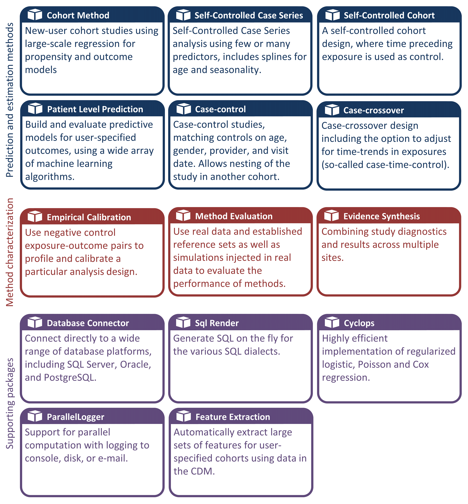

# --翻訳作業中--　OHDSI 分析ツール {#OhdsiAnalyticsTools}

*チャプターLead: Martijn Schuemie & Frank DeFalco*

OHDSIは、患者レベルの観察データに対するさまざまなデータ分析のユースケースをサポートするための幅広いオープンソースツールを提供しています。これらのツールの共通点は、すべてCDM（共通データモデル）を使用して1つ以上のデータベースと対話できる点です。さらに、これらのツールはさまざまなユースケースに対して分析を標準化します。一から始める必要はなく、標準テンプレートに入力することで分析を実装できます。これにより、分析が容易になり、再現性と透明性が向上します。例として、発生率を計算する方法は無数にあるように見えますが、OHDSIツールではいくつかの選択肢で指定でき、同じ選択肢を選んだ人は同じ方法で発生率を計算します。

この章では、最初に分析を実装するさまざまな方法を説明し、分析が使用する戦略について述べます。次に、さまざまなOHDSIツールとそれらがどのようにさまざまなユースケースに適合するかをレビューします。

## 分析の実装 {#analysisImplementation}

図\@ref(fig:implementations)は、CDMを使用してデータベースに対して研究を実装するために選択できるさまざまな方法を示しています。 \index{analysis implementation}

```{r implementations, fig.cap='CDMのデータに対する分析を実装するさまざまな方法。', echo=FALSE, out.width='90%', fig.align='center'}
knitr::include_graphics("images/OhdsiAnalyticsTools/implementations.png")
```

研究を実装するための主なアプローチは3つあります。最初の方法は、OHDSIが提供するツールを一切使用しないカスタムコードを作成することです。たとえば、R、SAS、またはその他の言語でゼロから分析を作成することができます。これにより最大の柔軟性が得られ、特定の分析がツールでサポートされていない場合は唯一の選択肢となるかもしれません。しかし、この方法は多くの技術的スキル、時間、および努力を必要とし、分析が複雑になるほどコード内のエラーを避けることが困難になります。

2番目の方法は、Rで分析を開発し、[OHDSI Methods Library](https://ohdsi.github.io/MethodsLibrary/)のパッケージを使用することです。最低限、Chapter \@ref(SqlAndR)で詳述されている、さまざまなデータベースプラットフォームに同じコードを実行できるようにする[SqlRender](https://ohdsi.github.io/SqlRender/)および[DatabaseConnector](https://ohdsi.github.io/DatabaseConnector/)パッケージを使用できます。その他のパッケージ、例えば[CohortMethod](https://ohdsi.github.io/CohortMethod/)や[PatientLevelPrediction](https://ohdsi.github.io/PatientLevelPrediction/)は、CDMに対する高度な分析のためのR関数を提供し、自分のコード内で呼び出すことができます。これでも多くの技術的専門知識が必要ですが、Methods Libraryの検証済みのコンポーネントを再利用することで、完全にカスタムコードを使用する場合よりも効率的かつエラーが少なくなります。

3番目の方法は、非プログラマが効率的に広範な分析を行うことができるウェブベースのツールである[ATLAS](https://github.com/OHDSI/Atlas/wiki)を使用することです。ATLASはMethods Librariesを使用しますが、分析を設計するための単純なグラフィカルインターフェイスを提供し、多くの場合、分析を実行するために必要なRコードを生成します。ただし、Methods Libraryで利用可能なすべてのオプションをサポートしているわけではありません。大多数の研究はATLASを通じて行うことが期待されますが、2番目の方法が提供する柔軟性を必要とする研究も存在します。

ATLASとMethods Libraryは独立していません。ATLASで呼び出される複雑な分析の一部は、Methods Libraryのパッケージへの呼び出しを通じて実行されます。同様に、Methods Libraryで使用されるコホートは、ATLASで設計されることが多い。

## 分析戦略

CDMに対する分析を実装するために使用する戦略、たとえばカスタムコーディングやMethods Libraryで提供される標準分析コードの使用に加えて、それらの分析技術を使用して証拠を生成するための複数の戦略も存在します。図\@ref(fig:strategies)は、OHDSIで使用される3つの戦略を示しています。

```{r strategies, fig.cap='(臨床の)質問に対する証拠を生成するための戦略。', echo=FALSE, out.width='90%', fig.align='center'}
knitr::include_graphics("images/OhdsiAnalyticsTools/strategies.png")
```

最初の戦略では、各分析を個別の研究として扱います。分析はプロトコルで事前に指定され、コードとして実装され、データに対して実行され、その後、結果がコンパイルされ解釈されます。各質問ごとに、すべてのステップを繰り返す必要があります。そのような分析の一例は、levetiracetamとphenytoinを比較した際の血管浮腫のリスクに関するOHDSI研究です。 [@duke_2017 ] ここでは、まずプロトコルが作成され、OHDSI Methods Libraryを使用した分析コードが開発され、OHDSIネットワーク全体で実行され、結果がジャーナル公表されました。

第二の戦略では、リアルタイムまたは準リアルタイムで特定のクラスの質問に回答できるアプリケーションを開発します。アプリケーションが開発されると、ユーザーはクエリをインタラクティブに定義し、それを送信して結果を表示できます。この戦略の一例は、ATLASのコホート定義および生成ツールです。このツールは、ユーザーが様々な複雑さのコホート定義を指定し、データベースに対して定義を実行して、さまざまな包含および除外基準を満たす人数を見ることを可能にします。

第三の戦略では、同様に質問のクラスに焦点を当てますが、そのクラス内のすべての質問に対する証拠を網羅的に生成しようとします。ユーザーはその後、さまざまなインターフェースを通じて必要に応じて証拠を探索できます。一例は、うつ病治療の影響に関するOHDSI研究です。 [@schuemie_2018b ] この研究では、すべてのうつ病治療が、4つの大規模な観察研究データベースで関心のある多数のアウトカムに対して比較されました。17,718の経験的に校正されたハザード比と広範な研究診断を含む結果の全セットは、インタラクティブなウェブアプリで利用できます。<http://data.ohdsi.org/SystematicEvidence/> \

## ATLAS

ATLASは、CDM形式の標準化された患者レベルの観察データに対する解析の設計と実行を支援するためにOHDSIコミュニティによって開発された、無料で公開されているウェブベースのツールです。ATLASはOHDSI WebAPIと組み合わせてウェブアプリケーションとしてデプロイされ、通常はApache Tomcat上でホストされます。リアルタイム解析を行うためにはCDM内の患者レベルのデータにアクセスする必要があるため、通常は組織のファイアウォールの内側にインストールされます。しかし、パブリックATLAS[^ohdsianalyticstools-1]も存在し、このATLASインスタンスは少数の小規模なシミュレーションデータセットにしかアクセスできませんが、テストや訓練を含む多くの目的で利用可能です。パブリックインスタンスのATLASを使用して効果推定や予測研究を完全に定義し、その研究を実行するためのRコードを自動生成することも可能です。そのコードはATLASとWebAPIをインストールすることなく、利用可能なCDMが存在する任意の環境で実行できます。\index{ATLAS}

[^ohdsianalyticstools-1]: <http://www.ohdsi.org/web/atlas>

```{r atlas, fig.cap='ATLASユーザインタフェース', echo=FALSE, out.width='100%', fig.align='center'}
knitr::include_graphics("images/OhdsiAnalyticsTools/atlas.png")
```

図\@ref(fig:atlas)にATLASのスクリーンショットが提供されています。左側にはATLASの様々な機能を示すナビゲーションバーがあります。

データソース \index{ATLAS!データソース} \index{Achilles|see {ATLAS!データソース}}

:   データソースは、ATLASプラットフォームに構成された各データソースの記述的、標準化されたレポートをレビューする機能を提供します。この機能は大規模分析戦略を使用し、すべての記述は事前に計算されています。データソースについては、第\@ref(Characterization)章で議論されています。

ボキャブラリ検索 \index{ATLAS!ボキャブラリ検索}

:   ATLASはOMOP標準ボキャブラリを検索して、これらのボキャブラリにどのようなコンセプトが存在するか、そしてそのコンセプトをどう適用するかを理解するための機能を提供します。この機能については、第\@ref(StandardizedVocabularies)章で議論されています。

コンセプトセット \index{ATLAS!コンセプトセット}

:   コンセプトセットは、標準化された分析全体で使用するコンセプトのセットを識別するために使用できる論理表現のコレクションを作成する機能を提供します。コンセプトセットは単純なコードや値のリストよりも高度な機能を提供します。コンセプトセットは、標準化されたボキャブラリからの複数のコンセプトと、関連するコンセプトの包含や除外を指定するための論理インジケータを組み合わせて構成されます。ボキャブラリの検索、コンセプトのセットの識別、そしてコンセプトセットを解決するために使用する論理の指定は、分析計画で使用されることが多い難解な医療用語を定義するための強力なメカニズムを提供します。これらのコンセプトセットはATLAS内に保存され、その後の解析の一部としてコホート定義や解析仕様に使用できます。

コホート定義 \index{ATLAS!コホート定義}

:   コホート定義は、一定期間内に1つ以上の基準を満たす人物のセットを構築する機能であり、これらのコホートはその後のすべての解析の入力として使用されます。この機能については、第\@ref(Cohorts)章で議論されています。

特性の評価\index{ATLAS!特性の評価}

:   キャラクタリゼーションは、定義された1つ以上のコホートを調査し、これらの患者集団に関する特性を要約するための分析機能です。この機能はリアルタイムクエリ戦略を使用しており、第\@ref(Characterization)章で議論されています。

コホートパスウェイ \index{ATLAS!コホートパスウェイ}

:   コホートパスウェイは、1つ以上の集団内で発生する臨床イベントのシーケンスを調査するための分析ツールです。この機能については、第\@ref(Characterization)章で議論されています。

発生率 \index{ATLAS!発生率}

:   発生率は、対象集団内のアウトカムの発生率を推定するためのツールです。この機能については、第\@ref(Characterization)章で議論されています。

プロファイル \index{ATLAS!プロファイル}

:   プロファイルは、個々の患者の縦断的観察データを調査し、特定の個人の状況を要約するためのツールです。この機能はリアルタイムクエリ戦略を使用します。

集団レベル推定 \index{ATLAS!集団レベル推定}

:   推定は、比較コホートデザインを使用して集団レベルの効果推定研究を定義するための機能であり、1つ以上のターゲットおよび比較コホート間の比較を一連の結果について調査することができます。この機能はリアルタイムクエリ戦略を実装していると言え、コーディングが不要です。第\@ref(PopulationLevelEstimation)章で議論されています。

患者レベル予測 \index{ATLAS!患者レベル予測}

:   予測は機械学習アルゴリズムを適用して患者レベルの予測解析を行い、特定のターゲット曝露内でアウトカムを予測する機能です。この機能もリアルタイムクエリ戦略を実装しており、コーディングが不要です。第\@ref(PatientLevelPrediction)章で議論されています。

ジョブ \index{ATLAS!ジョブ}

:   ジョブメニュー項目を選択して、WebAPIを通じて実行されているプロセスの状態を調査します。ジョブは、コホートの生成やコホートの特性評価レポートの計算など、長時間実行されるプロセスです。

設定 \index{ATLAS!設定}

:   構成メニュー項目を選択して、ソース構成セクションに構成されたデータソースを確認します。

フィードバック \index{ATLAS!フィードバック}

:   フィードバックリンクをクリックすると、ATLASの問題ログにアクセスできます。新しい問題のログを記録したり、既存の問題を検索したりできます。新しい機能や改善のアイデアがある場合も、開発コミュニティのためにこの場所で記載できます。

### セキュリティ

ATLASとWebAPIは、プラットフォーム全体で機能やデータソースへのアクセスを制御するための細かいセキュリティモデルを提供します。セキュリティシステムはApache Shiroライブラリを活用して構築されています。セキュリティシステムの詳細は、オンラインのWebAPIセキュリティwikiで確認できます。[^ohdsianalyticstools-2] \index{ATLAS!セキュリティ}

[^ohdsianalyticstools-2]: <https://github.com/OHDSI/WebAPI/wiki/Security-Configuration>

### ドキュメント

ATLASのドキュメントは、ATLAS GitHubリポジトリのwikiでオンラインで確認できます。[^ohdsianalyticstools-3] このwikiには、様々なアプリケーション機能に関する情報や、オンラインビデオチュートリアルへのリンクが含まれています。 \index{ATLAS!ドキュメント}

[^ohdsianalyticstools-3]: <https://github.com/OHDSI/ATLAS/wiki>

### インストール方法

ATLASのインストールは、OHDSI WebAPIと組み合わせて行われます。各コンポーネントのインストールガイドは、ATLAS GitHubリポジトリのセットアップガイド[^ohdsianalyticstools-4]およびWebAPI GitHubリポジトリのインストールガイドにオンラインで提供されています。 \index{ATLAS!インストール}

[^ohdsianalyticstools-4]: <https://github.com/OHDSI/Atlas/wiki/Atlas-Setup-Guide>

## メソッドライブラリ

[OHDSIメソッドライブラリ](https://ohdsi.github.io/MethodsLibrary/)は、図 \@ref(fig:methodsLibrary) に示されているオープンソースのRパッケージのコレクションです。 \index{methods library}

```{r methodsLibrary, fig.cap='OHDSIメソッドライブラリのパッケージ。',echo=FALSE, out.width='100%', fig.align='center'}

```

これらのパッケージは、CDM内のデータから始まり、推定値や支援統計、図表を生成する完全な観察研究を実施するためのR関数を提供します。これらのパッケージはCDM内の観察データと直接対話し、カスタム分析を可能にし、あるいは標準化された高度な分析機能を提供することができます（詳細はChapter \@ref(SqlAndR)、Chapter \@ref(Characterization)、Chapter \@ref(PopulationLevelEstimation)、Chapter \@ref(PatientLevelPrediction)を参照してください）。メソッドライブラリは、透明性、再現性、異なるコンテキストでのメソッドの操作特性の測定、およびメソッドによって生成される推定値の経験的校正など、過去および現在の研究から学んだベストプラクティスをサポートしています。

メソッドライブラリは多くの公表された臨床研究 [@boland_2017 ; @duke_2017 ; @ramcharran_2017 ; @weinstein_2017 ; @wang_2017 ; @ryan_2017 ; @ryan_2018 ; @vashisht_2018 ; @yuan_2018 ; @johnston_2019 ] で使われており、方法論の研究にも利用されています [@schuemie_2014 ; @schuemie_2016 ; @reps2018 ; @tian_2018 ; @schuemie_2018 ; @schuemie_2018b ; @reps_2019 ]。メソッドライブラリにおけるメソッドの実装の妥当性についてはChapter \@ref(SoftwareValidity)で説明されています。

### 大規模分析サポート

すべてのパッケージで組み込まれている主な機能の一つは、多くの分析を効率的に実行できることです。例えば、集団レベルの推定を行う場合、CohortMethodパッケージは多くの暴露とアウトカムに対して効果サイズの推定を行うことを可能にし、様々な分析設定を使用して、必要な中間データセットおよび最終データセットを計算するための最適な方法を自動的に選択します。共変量の抽出や、一つのターゲット・コンパレータペアに対して複数のアウトカムに使用される傾向スコアモデルの適合など、使い回しが可能なステップは一度だけ実行されます。可能な場合は、計算リソースを最大限に活用するために計算は並行して行われます。

この計算効率は一度に多くの質問に答える大規模分析を可能にし、我々のメソッドの操作特性を測定し、Chapter \@ref(MethodValidity)で説明されているように推定値の経験的校正を行うために必要な対照仮説（例：陰性対照）を含むことが重要です。 \index{control hypotheses}

### ビッグデータ対応 {#BigDataSupport}

メソッドライブラリは、非常に大きなデータベースに対しても計算を行うことができるように設計されています。これは次の三つの方法で達成されます：

1.  大部分のデータ操作はデータベースサーバーで行われます。分析は通常、データベース内の全データのごく一部しか必要としないため、メソッドライブラリはSqlRenderおよびDatabaseConnectorパッケージを介してサーバー上で高度な操作を行い、関連データを前処理および抽出することができます。
2.  大量のローカルデータオブジェクトはメモリ効率の良い方法で保存されます。ローカルマシンにダウンロードされるデータについては、メソッドライブラリは[ff](https://cran.r-project.org/web/packages/ff)パッケージを使用して大規模データオブジェクトを保存および操作します。これにより、メモリに収まらない大きなデータと作業することが可能です。
3.  必要に応じて高性能コンピューティングが適用されます。例えば、[Cyclops](https://ohdsi.github.io/Cyclops/)パッケージは、メソッドライブラリ全体で使用される高効率な回帰エンジンを実装しており、これにより通常は適合できない大規模な回帰（多くの変数、大量の観測値）を実行することができます。

### ドキュメント

Rはパッケージを文書化するための標準的な方法を提供します。各パッケージには、パッケージに含まれるすべての関数およびデータセットを文書化した*パッケージマニュアル*があります。すべてのパッケージマニュアルは、Methods Libraryのウェブサイト[^ohdsianalyticstools-5]、パッケージのGitHubリポジトリ、CRANで利用できます。さらに、R内からパッケージマニュアルを参照することができ、例えばDatabaseConnectorパッケージを読み込んだ後、コマンド`?connect`を入力すると「connect」関数に関するドキュメントが表示されます。

[^ohdsianalyticstools-5]: <https://ohdsi.github.io/MethodsLibrary>

パッケージマニュアルに加えて、多くのパッケージは*ビネット*も提供しています。ビネットは、特定のタスクを実行するためにパッケージをどのように使用するかを説明した長文のドキュメントです。例えば、一つのビネット[^ohdsianalyticstools-6]では、CohortMethodパッケージを使用して複数の分析を効率的に実行する方法を説明しています。ビネットはMethods Libraryのウェブサイト、パッケージのGitHubリポジトリ、およびCRANでも見つけることができます。 \index{vignette}

[^ohdsianalyticstools-6]: <https://ohdsi.github.io/CohortMethod/articles/MultipleAnalyses.html>

### システム要件

システム要件を検討する際に関連する二つのコンピューティング環境があります：データベースサーバーと分析ワークステーションです。 \index{system requirements}

データベースサーバーはCDM形式の観察医療データを保持する必要があります。メソッドライブラリは、従来のデータベースシステム（PostgreSQL、Microsoft SQL Server、Oracle）、パラレルデータウェアハウス（Microsoft APS、IBM Netezza、Amazon Redshift）、およびビッグデータプラットフォーム（Impala経由でのHadoop、Google BigQuery）を含む幅広いデータベース管理システムをサポートしています。

分析ワークステーションは、メソッドライブラリがインストールされ実行される場所です。これがローカルマシン（例えば、ノートパソコン）か、RStudio Serverが実行されるリモートサーバーかに関わらず、Rがインストールされている必要があります。可能であればRStudioも一緒にインストールすることをお勧めします。また、Methods LibraryはJavaがインストールされている必要があります。分析ワークステーションはデータベースサーバーに接続できる必要があり、具体的にはファイアウォールがその間のアクセスポートを開いている必要があります。一部の分析は計算集中的であるため、複数のプロเซッサコアと十分なメモリを持つことが分析の高速化につながります。少なくとも4つのコアと16ギガバイトのメモリを推奨します。

### インストール方法 {#installR}

OHDSI Rパッケージを実行するために必要な環境をインストールするための手順は次の通りです。インストールする必要があるものは4つあります： \index{R!installation}

1.  **R**は統計的コンピューティング環境です。基本的なユーザインターフェースとして主にコマンドラインインターフェースを提供します。
2.  **Rtools**は、WindowsでRパッケージをソースからビルドするために必要なプログラム群です。
3.  **RStudio**は、Rを使いやすくするIDE（統合開発環境）です。コードエディタ、デバッグ、およびビジュアルツールが含まれています。よろしくお願いいたします。

## 展開戦略

ATLASやMethods Libraryを含む全体のOHDSIツールスタックを組織内で展開することは、非常に困難な作業です。依存関係がある多くのコンポーネントを考慮し、設定を行う必要があります。このため、二つの取り組みが、すべてのスタックを一つのパッケージとしてインストールできる統合展開戦略を開発しました。一部の仮想化技術を使用して、これを実現します。それが、BroadseaおよびAmazon Web Services (AWS)です。 \index{tools deployment}

### Broadsea

Broadsea[^ohdsianalyticstools-7]はDockerコンテナ技術を使用します。[\^\^dockerUrl] OHDSIツールは依存関係とともに、Dockerイメージと呼ばれる単一のポータブルなバイナリファイルにパッケージ化されています。このイメージはDockerエンジンサービス上で実行され、すべてのソフトウェアがインストールされてすぐに実行可能な仮想マシンが作成されます。DockerエンジンはMicrosoft Windows、MacOS、Linuxなどのほとんどのオペレーティングシステムで利用可能です。Broadsea Dockerイメージには、Methods LibraryやATLASを含む主要なOHDSIツールが含まれています。 \index{tools deployment!Broadsea}

[^ohdsianalyticstools-7]: <https://github.com/OHDSI/Broadsea>

### Amazon AWS

Amazonは、AWSクラウドコンピューティング環境でボタンをクリックするだけでインスタンス化できる二つの環境を用意しています：OHDSI-in-a-Box[^ohdsianalyticstools-8]とOHDSIonAWSです。[\^\^ohdsiOnAwsUrl] \index{tools deployment!Amazon AWS}

[^ohdsianalyticstools-8]: <https://github.com/OHDSI/OHDSI-in-a-Box>

OHDSI-in-a-Boxは学習環境として特に作成されており、OHDSIコミュニティによって提供されるほとんどのチュートリアルで使用されます。これには多くのOHDSIツール、サンプルデータセット、RStudioおよび他の補助ソフトウェアが一つの低コストのWindows仮想マシンに含まれています。CDMを保存するためにPostgreSQLデータベースが使用され、ATLASの中間結果も格納されます。OMOP CDMデータマッピングおよびETLツールもOHDSI-in-a-Boxに含まれています。OHDSI-in-a-Boxのアーキテクチャは図\@ref(fig:ohdsiinaboxDiagram)に示されています。

```{r ohdsiinaboxDiagram, fig.cap='OHDSI-in-a-BoxのAmazon Web Servicesアーキテクチャ。',echo=FALSE, out.width='100%', fig.align='center'}
knitr::include_graphics("images/OhdsiAnalyticsTools/OHDSI-in-a-BoxDiagram.png")
```

OHDSIonAWSは、エンタープライズクラスの複数ユーザー対応、スケーラブルでフォールトトレラントなOHDSI環境のリファレンスアーキテクチャで、組織がデータ分析を行うために使用できます。いくつかのサンプルデータセットが含まれており、組織の実際の医療データを自動的に読み込むこともできます。データはAmazon Redshiftデータベースプラットフォームに配置され、これをOHDSIツールがサポートします。ATLASの中間結果はPostgreSQLデータベースに格納されます。フロントエンドでは、ユーザーはウェブインターフェースを通じてATLASおよびRStudioにアクセスできます（RStudio Serverを活用）。RStudioではOHDSI Methods Libraryがすでにインストールされており、データベースに接続して使用することができます。OHDSIonAWSの展開の自動化はオープンソースであり、組織の管理ツールとベストプラクティスを含むようにカスタマイズできます。OHDSIonAWSのアーキテクチャは図\@ref(fig:ohdsionawsDiagram)に示されています。

```{r ohdsionawsDiagram, fig.cap='OHDSIonAWSのAmazon Web Servicesアーキテクチャ。',echo=FALSE, out.width='100%', fig.align='center'}
knitr::include_graphics("images/OhdsiAnalyticsTools/OHDSIonAWSDiagram.png")
```

## まとめ

```{block2, type='rmdsummary'}
- CDM内のデータに対して分析を行うには
    - カスタムコードの作成
    - OHDSI Methods LibraryのRパッケージを使用したコードの作成
    - インタラクティブ分析プラットフォームATLASの使用

- OHDSIツールは異なる分析戦略を使用します
    - 単一研究
    - リアルタイムクエリ
    - 大規模アナリティクス

- ほとんどのOHDSIアナリティクスツールは以下に埋め込まれています
    - インタラクティブ分析プラットフォームATLAS
    - OHDSI Methods LibraryのRパッケージ

- OHDSIツールの展開を容易にするいくつかの戦略があります。


```
