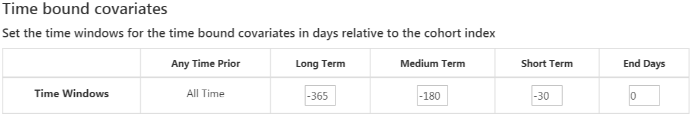
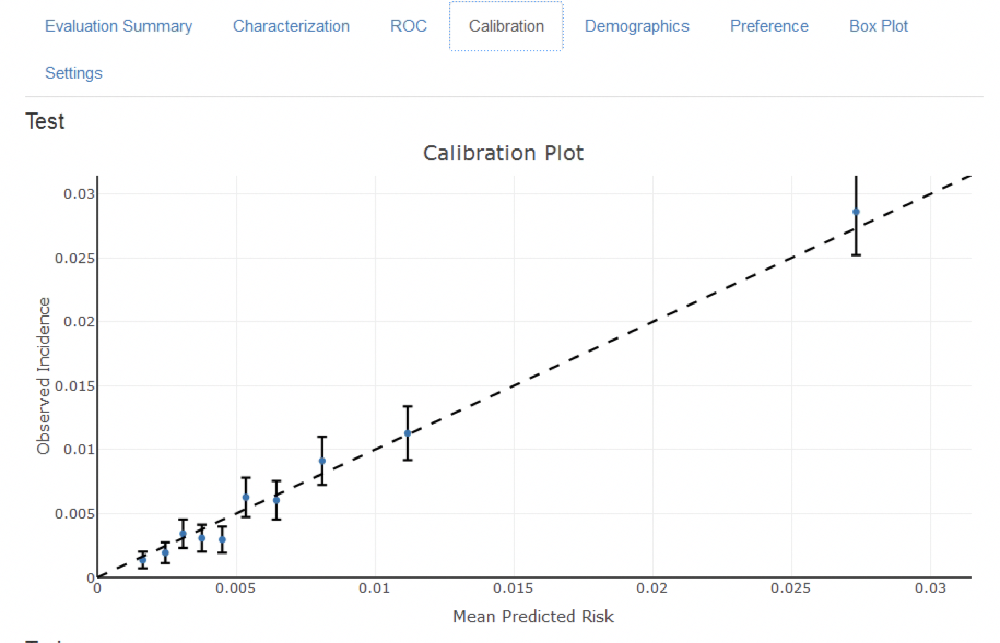

# --翻訳作業中-- 患者レベル予測 {#PatientLevelPrediction}

*章リーダー: Peter Rijnbeek & Jenna Reps*

\index{患者レベル予測}

臨床意思決定は、利用可能な患者の病歴と現在の臨床ガイドラインに基づいて診断や治療経路を推測するという複雑な作業です。臨床予測モデルは、この意思決定プロセスを支援するために開発され、幅広い専門分野で臨床実践に使用されています。これらのモデルは、例えば、人口統計情報、病歴、および治療歴など、患者の特性の組み合わせに基づいて診断結果や予後結果を予測します。 \index{臨床意思決定} \index{診断結果} \index{予後結果}

過去10年間で、臨床予測モデルを説明する出版物の数が大幅に増加しました。現在使用されているほとんどのモデルは、小さなデータセットを使用して推定されており、患者特性の限られたセットのみを考慮しています。この低いサンプルサイズ、従って低い統計的検出力は、データアナリストに強いモデリング仮定を行わせます。限られた患者特性の選択は、手元にある専門知識に強く導かれています。これは、患者が膨大なデジタルトレイルを生成する現代医学の現実とは対照的です。現在、ヘルスケアは電子カルテ（EHR）に保存された膨大な患者特有の情報を生成しています。これには、診断、投薬、検査結果の形での構造化データ、および臨床記述に含まれる非構造化データが含まれます。患者の完全なEHRから得られる大量のデータを活用することで、どれだけの予測精度が向上するかは未知です。 \index{予測モデル}

大規模データセットの解析に対する機械学習の進歩により、この種類のデータに対する患者レベル予測の適用に対する関心が高まっています。しかし、患者レベル予測に関する多くの発表された取り組みがモデル開発ガイドラインに従っておらず、広範な外部検証を行わない、またはモデルの詳細が不十分であるため、独立した研究者がモデルを再現し外部検証を行うことが難しくなっています。これにより、モデルの予測性能を公正に評価することが難しくなり、モデルが臨床実践で適切に使用される可能性が低くなります。標準を向上させるために、いくつかの論文が予測モデルの開発および報告のベストプラクティスに関するガイドラインを詳述しています。例えば、個々の予後または診断のための多変数予測モデルの透明な報告（TRIPOD）ステートメント[^tripodUrl]は、予測モデルの開発と検証を報告するための明確な推奨事項を提供し、透明性に関連するいくつかの懸念に対処しています。 \index{機械学習} \index{TRIPOD}

[^tripodUrl]: https://www.equator-network.org/reporting-guidelines/tripod-statement/

OHDSIのおかげで、大規模、患者特異的予測モデリングが現実のものとなり、共通データモデル（CDM）が前例のない規模での均一で透明な分析を可能にしました。CDMに標準化された拡大するデータベースネットワークは、さまざまなヘルスケア環境でのモデルの外部検証をグローバルに可能にします。私たちは、これがケアの質の向上が最も必要とされる大規模な患者コミュニティに直ちに貢献できる機会を提供すると信じています。このようなモデルは、真に個別化された医療を支援し、患者の治療結果の劇的な向上を目指します。

この章では、OHDSIの標準化された患者レベル予測のフレームワーク [@reps2018]を説明し、開発と検証のための確立されたベストプラクティスを実装する [PatientLevelPrediction](https://ohdsi.github.io/PatientLevelPrediction/) R パッケージについて説明します。まず、患者レベル予測の開発と評価のための必要な理論を提供し、実装された機械学習アルゴリズムの概要を高レベルで説明します。次に、予測課題の例を示し、その定義とATLASやカスタムRコードを使用した実装のステップバイステップガイダンスを提供します。最後に、研究結果の普及のためのShinyアプリケーションの使用について説明します。


## 予測課題

図 \@ref(fig:figure1) は私たちが取り組む予測課題を示しています。リスク集団の中で、定義された時点（t = 0）でどの患者がリスク期間中にある結果を経験するかを予測することを目指します。予測は、その時点までの観察ウィンドウ中の患者の情報のみを使用して行います。

```{r figure1, fig.cap='予測課題。',echo=FALSE, out.width='100%'}
knitr::include_graphics("images/PatientLevelPrediction/Figure1.png")
```

表 \@ref(tab:plpDesign) に示すように、予測課題を定義するには、ターゲットコホートによってt=0を定義し、結果コホートによって予測したい結果を定義し、リスク期間を定義する必要があります。標準的な予測質問は次のように定義されます： \index{ターゲットコホート} \index{結果コホート} \index{リスク期間}

> *[ターゲットコホートの定義]*の中で、*[リスク期間]*内に*[結果コホートの定義]*を持つようになるのは誰ですか？

さらに、開発したいモデルの設計選択肢を検討し、内部および外部検証を行うための観察データセットを決定する必要があります。

表: (\#tab:plpDesign) 予測設計における主要な設計選択肢。

| 選択肢          | 説明                                                |
|:----------------- |:-------------------------------------------------------- |
| ターゲットコホート | 予測したい人物のコホートをどのように定義しますか？       |
| 結果コホート    | 予測したい結果をどのように定義しますか？|
| リスク期間      | t=0に対してどの時間ウィンドウで予測を行いますか？ |
| モデル             | どのアルゴリズムを使用し、どの潜在的な予測変数を含めますか？ |


この概念的フレームワークは、すべての種類の予測課題に適用されます。例えば：

- 疾病の発症と進行
  - **構造**: *[病気]*と新たに診断された患者の中で、*[診断からの時間枠内]*に*[別の病気または合併症]*を発症するのは誰ですか？
  - **例**: 心房細動と新たに診断された患者の中で、次の3年の間に虚血性脳卒中を発症するのは誰ですか？
- 治療選択
  - **構造**: *[適応された疾患]*を持ち*、*[治療1]*または*[治療2]*で治療された患者の中で、*[治療1]*で治療されたのは誰ですか？
  - **例**: ワルファリンまたはリバロキサバンを服用した心房細動患者の中で、ワルファリンを服用する患者は誰ですか？（例えば傾向スコアモデルとして）
- 治療反応
  - **構造**: *[治療]*の新規使用者の中で、*[時間枠内]*に*[ある効果]*を経験するのは誰ですか？
  - **例**: メトホルミンを開始した糖尿病患者のうち、3年間メトホルミンを継続するのは誰ですか？
- 治療安全性
  - **構造**: *[治療]*の新規使用者の中で、*[時間枠内]*に*[副作用]*を経験するのは誰ですか？
  - **例**: ワルファリンの新規使用者の中で、1年以内に消化管出血を経験するのは誰ですか？
- 治療遵守
  - **構造**: *[治療]*の新規使用者の中で、*[時間枠]*で*[遵守指標]*を達成するのは誰ですか？
  - **例**: メトホルミンを開始した糖尿病患者のうち、1年後に80%以上の日数カバー率を達成するのは誰ですか？
## データ抽出

予測モデルを作成する際には、監督学習として知られるプロセスを使用します。これは、機械学習の一形態で、目標変数と結び付いたラベル付きデータから、共変量と結果ステータスの関係を推測する方法です\index{supervised learning(監督学習)}。したがって、CDMからターゲットコホートに属する個人の共変量を抽出する方法、およびその結果ステータスを取得する方法が必要です。

**共変量**（"予測子"、"特徴"、または"独立変数"とも呼ばれる）は、患者の特性を説明します\index{共変量}。共変量には、年齢、性別、特定の状態の存在、患者記録内の曝露コードなどが含まれます。共変量は一般的に、[FeatureExtraction](https://ohdsi.github.io/FeatureExtraction/)パッケージを使用して構築され、詳細はChapter \@ref(Characterization)で説明しています。予測のためには、個人がターゲットコホートに入る日付（本書ではこれを基準日と呼びます）の前および当日のデータのみ使用できます。\index{基準日}

また、リスク期間中の全ての患者の**結果ステータス**（"ラベル"または"クラス"とも呼ばれる）も取得する必要があります。リスク期間中に結果が発生した場合、結果ステータスは「陽性」と定義されます。\index{結果ステータス} \index{ラベル} \index{クラス}

### データ抽出の例

表 \@ref(tab:plpExampleCohorts) は、2つのコホートが含まれたCOHORTテーブルの例を示しています。コホート定義IDが1のコホートはターゲットコホート（例：「最近心房細動と診断された人々」）です。コホート定義IDが2は、結果コホートを定義します（例：「脳卒中」）。

表： (\#tab:plpExampleCohorts) 例示的なCOHORTテーブル。簡潔のためにCOHORT_END_DATEは省略しています。

| COHORT_DEFINITION_ID | SUBJECT_ID | COHORT_START_DATE |
|:--------------------:|:----------:|:-----------------:|
| 1                    |   1        | 2000-06-01        |
| 1                    |   2        | 2001-06-01        |
| 2                    |   2        | 2001-07-01        |

表 \@ref(tab:plpExampleConditions) は、例示的なCONDITION_OCCURRENCEテーブルを示しています。Concept ID [320128](http://athena.ohdsi.org/search-terms/terms/320128) は「本態性高血圧」に該当します。

表：(\#tab:plpExampleConditions) 例示的なCONDITION_OCCURRENCEテーブル。簡潔のため、3つの列のみ表示しています。

| PERSON_ID | CONDITION_CONCEPT_ID | CONDITION_START_DATE |
|:---------:|:--------------------:|:--------------------:|
| 1         | 320128               | 2000-10-01           |
| 2         | 320128               | 2001-05-01           |

この例示的なデータに基づき、時間のリスクが基準日（ターゲットコホートの開始日）から1年間と仮定すると、共変量と結果ステータスを構築できます。「前年の本態性高血圧」を示す共変量は、個人ID 1に対して0（非存在、状態が基準日後に発生）と、個人ID 2に対して1（存在）を持ちます。同様に、結果ステータスは個人ID 1に対して0（この人は結果コホートにエントリがない）、個人ID 2に対して1（基準日から1年以内に結果が発生）となります。

### 否定 vs 欠損

観察医療データは、値が否定的か欠損しているかを示すことは滅多にありません。前の例では、単にID 1の人が基準日前に本態性高血圧の発生がなかったことを観察しました。これは、その時点で状態が存在しなかった（否定的）または記録されなかった（欠損）可能性があります。機械学習アルゴリズムは否定的と欠損の区別がつかず、利用可能なデータから予測価値を評価することを理解しておくことが重要です。\index{欠損データ}
## モデルの適合 {#modelFitting}

予測モデルの適合を行う際には、ラベル付きの例から共変量と観測された結果状態の関係を学習しようとしています。例えば、共変量が2つしかない場合、収縮期血圧と拡張期血圧だとすると、各患者を2次元空間のプロットとして表現できます（図 \@ref(fig:decisionBoundary) を参照）。この図では、データポイントの形が患者の結果状態（例：脳卒中）に対応しています。

指導付き学習モデルは、2つの結果クラスを最適に分離する決定境界を見つけようとします。異なる指導付き学習技術は異なる決定境界を導き、しばしば決定境界の複雑さに影響を与えるハイパーパラメータが存在します。 \index{decision boundary}

```{r decisionBoundary, fig.cap='Decision boundary.',echo=FALSE, out.width='80%', fig.align='center'}
knitr::include_graphics("images/PatientLevelPrediction/decisionBoundary.png")
```

図 \@ref(fig:decisionBoundary) では、三つの異なる決定境界を見ることができます。境界は新しいデータポイントの結果状態を推測するために使用されます。新しいデータポイントが陰影部分に落ちると、モデルは「結果がある」と予測し、そうでない場合は「結果なし」と予測します。理想的には、決定境界は2つのクラスを完全に分離するべきです。しかし、あまりにも複雑なモデルはデータに「過適合」するリスクがあります。これは、未見のデータに対するモデルの一般化可能性を悪化させる可能性があります。例えば、データにノイズが含まれている場合（誤ってラベル付けされたデータポイントや誤った位置に配置されたデータポイントなど）、そのノイズにモデルを適合させたくないでしょう。したがって、トレーニングデータで完全に区別しないが、「真の」複雑さを捉える決定境界を定義することを好むかもしれません。正則化のような技術は、モデルのパフォーマンスを最大限にしながら複雑さを最小限に抑えることを目指しています。

各指導付き学習アルゴリズムは決定境界を学習する異なる方法を持っており、どのアルゴリズムがデータに最も適しているかを簡単に判断することはできません。No Free Lunch定理が述べているように、1つのアルゴリズムがすべての予測問題に対して常に他よりも優れているわけではありません。\index{no free lunch} したがって、患者レベルの予測モデルを開発する際には、複数の指導付き学習アルゴリズムをさまざまなハイパーパラメータ設定で試すことをお勧めします。

[PatientLevelPrediction](https://ohdsi.github.io/PatientLevelPrediction/) パッケージで利用可能なアルゴリズムは以下の通りです：

### 正則化ロジスティック回帰

LASSO（最小絶対収縮および選択オペレーター）ロジスティック回帰は、変数の線形結合を学習し、最終的にロジスティック関数がその線形結合を0から1の値にマッピングする、一般化線形モデルの家族に属します。LASSO正則化は、モデルをトレーニングする際に目的関数に基づくモデルの複雑さに基づくコストを追加します。このコストは係数の線形結合の絶対値の合計です。このモデルは、このコストを最小限に抑えることで自動的に特徴選択を行います。大規模な正則化ロジスティック回帰を行うために [Cyclops](https://ohdsi.github.io/Cyclops/) （ロジスティック、ポアソン、サバイバル分析のためのサイクリック座標降下法）パッケージを使用しています。 \index{LASSO} \index{logistic regression} \index{regularization} \index{Cyclops}

Table: (\#tab:lassoParameters) 正則化ロジスティック回帰のハイパーパラメータ。

| パラメータ | 説明 | 典型的な値 |
|:-------- |:----------- |:-------------- |
| 初期分散 | 事前分布の初期分散 | 0.1 |

分散は交差検証でのサンプル外の尤度を最大化して最適化されるため、初期分散は結果として得られるモデルの性能にはほとんど影響しません。ただし、最適値からあまりに離れた初期分散を選択すると、適合時間が長くなる可能性があります。\index{variance} \index{hyper-parameter} \index{cross-validation}

### 勾配ブースティングマシン

勾配ブースティングマシンはブースティングアンサンブル技術であり、我々の枠組みでは複数の決定木を組み合わせます。ブースティングは、繰り返し決定木を追加し、前の決定木で誤分類されたデータポイントにより多くの重みをコスト関数に追加して次の木をトレーニングします。高効率の勾配ブースティングフレームワークを実装した、CRANで利用可能なxgboost Rパッケージを使用しています。 \index{gradient boosting} \index{xgboost}

Table: (\#tab:gbmParameters) 勾配ブースティングマシンのハイパーパラメータ。

| パラメータ | 説明 | 典型的な値 |
|:-------- |:----------- |:-------------- |
| earlyStopRound | 改善がない場合の停止ラウンド数 | 25 |
| learningRate| ブースティングの学習率 | 0.005,0.01,0.1|
| maxDepth | 木の最大深さ | 4,6,17 |
| minRows | ノード内の最小データポイント数 | 2 |
| ntrees | 木の数 |100,1000|

### ランダムフォレスト

ランダムフォレストは複数の決定木を組み合わせるバギングアンサンブル技術です。バギングの背後にあるアイデアは、弱い分類器を使用してそれらを強い分類器に組み合わせることで過適合の可能性を減らすことです。ランダムフォレストは、各木において変数のサブセットを使用し、木間でサブセットを異ならせることでこれを実現します。Pythonのsklearnのランダムフォレスト実装を使用しています。 \index{random forest} \index{python} \index{sklearn}

Table: (\#tab:randomForestParameters) ランダムフォレストのハイパーパラメータ。

| パラメータ | 説明 | 典型的な値 |
|:-------- |:----------- |:-------------- |
| maxDepth | 木の最大深さ | 4,10,17 |
| mtries | 各木の変数数 | -1 = 総変数数の平方根,5,20 |
| ntrees | 木の数 | 500 |

### K-近傍法

K-nearest neighbors (KNN) は、ある距離測定を使用して新しい未ラベルデータポイントに最も近いラベル付きデータポイントK個を見つけるアルゴリズムです。新しいデータポイントの予測は、K個の近傍ラベル付きデータポイントの中で最も多く見られるクラスになります。KNNの制限として、モデルが新しいデータに対して予測を行うためにラベル付きデータを必要とし、そのデータはデータサイト間で共有しにくい場合が多いことがあります。我々のパッケージには、OHDSIで開発された大規模なKNN分類器である[BigKnn](https://github.com/OHDSI/BigKnn)パッケージが含まれています。 \index{k-nearest neighbors} \index{bigknn}

Table: (\#tab:knnParameters) K-近傍法のハイパーパラメータ。

| パラメータ | 説明 | 典型的な値 |
|:-------- |:----------- |:-------------- |
| k | 近傍数 | 1000 |

### ナイーブベイズ

ナイーブベイズアルゴリズムは、クラス変数の値が与えられた全ての特徴ペアの条件付き独立性を仮定するベイズの定理を適用します。データがクラスに属する尤もらしさとクラスの事前分布に基づいて、事後分布が得られます。ナイーブベイズにはハイパーパラメータはありません。 \index{naive bayes}

### AdaBoost

AdaBoostはブースティングアンサンブル技術です。ブースティングは、繰り返し分類器を追加し、前の分類器で誤分類されたデータポイン規定の重みをコスト関数に追加して次の分類器をトレーニングします。Pythonのsklearn AdaboostClassifier実装を使用しています。 \index{adaboost} \index{python}

Table: (\#tab:adaBoostParameters) AdaBoostのハイパーパラメータ。

| パラメータ | 説明 | 典型的な値 |
|:-------- |:----------- |:-------------- |
| nEstimators | ブースティングが停止される最大推定器数 | 4 |
| learningRate | 学習率が各分類器の貢献をlearning_rateによって抑え込みます。learningRateとnEstimatorsの間にはトレードオフがあります | 1 |

### 決定木

決定木は、貪欲法を用いた個々のテストを使って変数空間を分割する分類器です。クラスを分離するために最も高い情報利得を持つ分割を見つけることを目指します。決定木は、大量の分割（木の深さ）を可能にすることで容易に過適合を引き起こし、しばしば正則化（例：剪定やモデルの複雑さを制限するハイパーパラメータの指定など）が必要です。Pythonのsklearn DecisionTreeClassifier実装を使用しています。 \index{decision tree} \index{python}

Table: (\#tab:decisionTreeParameters) 決定木のハイパーパラメータ。

| パラメータ | 説明 | 典型的な値 |
|:-------- |:----------- |:-------------- |
| classWeight | "Balance"または"None" | None |
| maxDepth | 木の最大深さ | 10 |
| minImpuritySplit | 木の成長中に早期停止するための閾値。ノードの不純物が閾値を上回る場合は分割され、そうでない場合はリーフとなります | 10^-7|
| minSamplesLeaf | 各リーフの最小サンプル数 | 10 |
| minSamplesSplit | 各分割の最小サンプル数 | 2 |

### 多層パーセプトロン

多層パーセプトロンは、複数の層のノードを含むニューラルネットワークであり、入力を重み付けするために非線形関数を用います。最初の層は入力層、最後の層は出力層、その間に隠れ層があります。ニューラルネットワークは一般に逆伝播を使ってトレーニングされ、トレーニング入力がネットワークを前方に伝播して出力を生成し、出力と結果状態の間の誤差が計算され、その誤差がネットワークを逆伝播して線形関数の重みを更新します。 \index{neural network} \index{perceptron} \index{back-propagation}

Table: (\#tab:mpParameters) 多層パーセプトロンのハイパーパラメータ。

| パラメータ | 説明 | 典型的な値 |
|:-------- |:----------- |:-------------- |
| alpha | l2正則化 | 0.00001 |
| size | 隠れノードの数 | 4 |

### ディープラーニング

ディープラーニングは、ディープネット、畳み込みニューラルネットワーク、またはリカレントニューラルネットワークのように、多層パーセプトロンに似ていますが、予測に役立つ潜在表現を学習するための複数の隠れ層を持ちます。[PatientLevelPrediction](https://ohdsi.github.io/PatientLevelPrediction/) パッケージの別の[ビネット](https://ohdsi.github.io/PatientLevelPrediction/articles/BuildingDeepLearningModels.html)で、これらのモデルとハイパーパラメータの詳細について説明しています。 \index{deep learning} \index{convolutional neural network} \index{recurrent neural networks}

### その他のアルゴリズム

患者レベルの予測フレームワークには他のアルゴリズムを追加できますが、これはこの章の範囲外です。詳細は、[PatientLevelPrediction](https://ohdsi.github.io/PatientLevelPrediction/) パッケージの["Adding Custom Patient-Level Prediction Algorithms"ビネット](https://ohdsi.github.io/PatientLevelPrediction/articles/AddingCustomAlgorithms.html)をご覧ください。
## 予測モデルの評価

### 評価の種類

予測モデルの評価は、モデルの予測と観測された結果の一致度を測定することによって行うことができます。これには、結果のステータスが既知のデータが必要です。 \index{予測モデルの評価}

```{block2, type='rmdimportant'}
評価には、モデルの開発に使用されたデータセットとは異なるデータセットを使用しなければなりません。そうしないと、過剰適合したモデルを好む可能性があり（セクション \@ref(modelFitting) を参照）、新しい患者には適切に機能しない可能性があります。

```

評価の種類には、以下のものがあります：

- **内部検証**：同じデータベースから抽出された異なるデータセットを使用してモデルを開発および評価します。
- **外部検証**：一つのデータベースでモデルを開発し、別のデータベースで評価します。 \index{検証!内部検証} \index{検証!外部検証}

内部検証の方法には、次の2つがあります：

- **ホールドアウトセット**アプローチ：ラベル付きデータを独立した2つのセット、トレインセットとテストセット（ホールドアウトセット）に分割します。トレインセットはモデルの学習に使用され、テストセットはモデルの評価に使用されます。患者をランダムにトレインセットとテストセットに分けるか、以下の方法を選ぶことができます：
    - 時間に基づいた分割（時間的検証）：例えば、特定の日付より前のデータで訓練し、その日付以降のデータで評価します。これにより、モデルが異なる時間帯に一般化されるかどうかを判断できます。
    - 地理的位置に基づいた分割（空間的検証）。\index{検証!時間的検証} \index{検証!空間的検証}
- **交差検証**：データが限られている場合に有用です。データを等しいサイズに分割し、$n$にプレ設定されたセットに分割します（例：$n=10$）。各セットに対して、そのセットのデータを除いた全てのデータでモデルを訓練し、ホールドアウトセットの予測を生成します。この方法で、すべてのデータが一度はモデル構築アルゴリズムを評価するために使用されます。患者レベルの予測フレームワークでは、交差検証を使用して最適なハイパーパラメータを選択します。 \index{交差検証}

外部検証は、モデルが開発された設定外の別のデータベースに対するモデルの性能を評価することを目的としています。このモデルの移植性の尺度は重要です。なぜなら、モデルを訓練したデータベースだけでなく、他のデータベースでもモデルを適用したいからです。異なるデータベースは、異なる患者集団、異なる医療システム、および異なるデータキャプチャプロセスを表す可能性があります。大規模なデータベースセットでの予測モデルの外部検証は、モデルの受け入れと臨床実務への実装に向けて重要なステップだと考えています。

### パフォーマンス指標 {#performance}

#### 閾値測定 {-}

予測モデルは、リスク期間中に患者が結果を持つリスクに対応する0から1の間の値を各患者に割り当てます。値が0の場合、リスクは0％、値が0.5の場合、リスクは50％、値が1の場合、リスクは100％を意味します。精度、感度、特異度、陽性予測値などの一般的な指標は、リスク期間中に結果を持つかどうかを分類するために使用される閾値を指定することによって計算できます。例えば、表 \@ref(tab:tabletheorytab) にあるように閾値を0.5と設定すると、患者1、3、7、および10は閾値0.5以上の予測リスクを持つため、結果を持つと予測されます。他のすべての患者は0.5未満の予測リスクを持つため、結果を持たないと予測されます。 \index{パフォーマンス指標} \index{精度} \index{感度} \index{特異度} \index{陽性予測値}

Table: (\#tab:tabletheorytab) 予測確率に対する閾値の利用例。

| 患者ID    | 予測リスク  | 0.5閾値での予測クラス | リスク期間中に結果を持つ | タイプ |
|:-------:|:---------:|:---------:|:---------:|:------:|
| 1   | 0.8 | 1| 1 | TP |
| 2   | 0.1   | 0 | 0 | TN |
| 3 | 0.7   | 1 | 0 | FP |
| 4   | 0 | 0 | 0 | TN |
| 5   | 0.05   |  0 | 0 | TN |
| 6 | 0.1   | 0 | 0 | TN |
| 7   | 0.9 | 1 | 1 | TP |
| 8   | 0.2   |  0 | 1 | FN |
| 9 | 0.3   | 0 | 0 | TN |
| 10 | 0.5   | 1 | 0 | FP |

患者が予測された結果を持ち、実際に結果を持つ場合、それを真陽性（TP）と呼びます。患者が予測された結果を持っているが実際には結果を持っていない場合、それを偽陽性（FP）と呼びます。患者が結果を持たないと予測され、実際に結果を持っていない場合、それを真陰性（TN）と呼びます。最後に、患者が結果を持たないと予測され、実際に結果を持っている場合、それを偽陰性（FN）と呼びます。 \index{真陽性} \index{偽陽性} \index{真陰性} \index{偽陰性}

以下の閾値ベースの指標を計算できます：

-	精度: $(TP+TN)/(TP+TN+FP+FN)$
-	感度: $TP/(TP+FN)$
-	特異度: $TN/(TN+FP)$
-	陽性予測値: $TP/(TP+FP)$

これらの値は、閾値が下げられると増減する可能性があります。分類器の閾値を下げると、結果の数を増やすことで分母を増やすことができます。以前の閾値が高すぎた場合、新しい結果はすべて真陽性である可能性があり、これにより陽性予測値が増加します。以前の閾値が適切であったか低すぎた場合、さらなる閾値の低下は偽陽性を導入するため、陽性予測値が減少します。感度の場合、分母は分類器の閾値に依存しません（$TP+FN$は一定です）。このため、分類器の閾値を下げることで真陽性結果数を増やし、感度を向上させる可能性があります。また、閾値を下げても感度が変わらない一方で、陽性予測値が変動することもあります。

#### 識別力 {-}

識別力とは、リスク期間中に結果を経験する患者に対して、より高いリスクを割り当てる能力のことです。受信者動作特性曲線（ROC曲線）は、全ての可能な閾値でx軸に1 - 特異度、y軸に感度をプロットすることで作成されます。ROCプロットの例は、この章の後半に図 \@ref(fig:shinyROC) で示されています。受信者動作特性曲線下の面積（AUC）は、識別力の全体的な測定値を示し、値が0.5はリスクがランダムに割り当てられることを示し、1は完璧な識別力を意味します。発表された予測モデルの多くは、AUCが0.6から0.8の範囲に収まります。 \index{AUC} \index{ROC} \index{識別力}

AUCは、リスク期間中に結果を経験する患者と経験しない患者との間で予測リスク分布がどれだけ異なるかを判断する方法を提供します。AUCが高い場合、分布はほとんど重ならないのに対し、重なりが多い場合はAUCが0.5に近くなります。図 \@ref(fig:figuretheoryroctheory) に示されているようにです。

```{r figuretheoryroctheory, fig.cap='識別力に関連するROCプロット。2つのクラスの予測リスクの分布が類似している場合、ROCは対角線に近く、AUCは0.5に近くなります。',echo=FALSE, out.width='100%'}
knitr::include_graphics("images/PatientLevelPrediction/theory/roctheory.png")
```

非常に稀な結果に対しては、AUCが高くても実際には実用的でない場合があります。なぜなら、閾値を超えるすべての陽性の背後には多くの陰性が存在し、陽性予測値が低くなる可能性があるからです。結果の重大性および介入のコスト（健康リスクまたは金銭的）があるため、高い偽陽性率は望ましくないかもしれません。そのため、稀な結果に対しては、適合率-再現率曲線下の面積（AUPRC）と呼ばれる別の指標が推奨されます。AUPRCは、感度をx軸（再現率としても知られる）に、陽性予測値（適合率としても知られる）をy軸にプロットして生成される線の下の面積です。 \index{適合率-再現率曲線下の面積}

#### キャリブレーション {-}

キャリブレーションは、モデルが正しいリスクを割り当てる能力です。例えば、モデルが100人の患者に10％のリスクを割り当てた場合、そのうち10人がリスク期間中に結果を経験するべきです。同様に、モデルが100人の患者に80％のリスクを割り当てた場合、そのうち80人がリスク期間中に結果を経験するべきです。キャリブレーションは、一般的に予測リスクに基づいて患者を十分位に分割し、各グループで平均予測リスクとリスク期間中に結果を経験した患者の割合を計算することによって測定されます。次に、これらの10点（予測リスクをy軸、観測リスクをx軸にプロット）をプロットし、それらがx = yの線上に位置するかどうかを確認します。これがモデルが適切にキャリブレーションされていることを示します。キャリブレーションプロットの例は、この章の後半に図 \@ref(fig:shinyCal) で示されています。また、これらの点を使用して線形モデルをフィットし、切片（ゼロに近いはず）と傾き（1に近いはず）を計算します。もし、傾きが1より大きい場合、モデルは実際のリスクよりも高いリスクを割り当てており、傾きが1より小さい場合、モデルは実際のリスクよりも低いリスクを割り当てていることを意味します。非線形関係をよりよく捕捉するために、Smooth Calibration Curvesも実装しています。 \index{キャリブレーション}
## 患者レベル予測研究の設計

このセクションでは予測研究の設計方法を実演します。最初のステップは予測問題を明確に定義することです。興味深いことに、公開された多くの論文では予測問題が不十分に定義されています。例えば、インデックス日（ターゲットコホートの開始日）がどのように定義されているかが不明確です。予測問題が不十分に定義されていると、他者による外部検証や臨床実践への実装が困難になります。患者レベル予測フレームワークでは、表\@ref(tab:plpDesign)に定義された主要な選択肢を明示的に定義することを要求することにより、予測問題の適切な仕様を強調します。ここでは、「治療の安全性」というタイプの予測問題を例にして、このプロセスを説明します。 \index{インデックス日}

### 問題の定義

アンギオエデマはACE阻害薬のよく知られた副作用であり、ACE阻害薬のラベルに記載されているアンギオエデマの発生率は0.1％から0.7％の範囲です。[@byrd_2006] この副作用を監視することは重要です。なぜなら、アンギオエデマは稀であるものの、生命を脅かす可能性があり、呼吸停止や死亡に至ることがあるからです。[@norman_2013] さらに、アンギオエデマが最初に認識されないと、その原因を特定するまでに広範で費用のかかる検査が行われる可能性があります。[@norman_2013; @thompson_1993] アフリカ系アメリカ人患者におけるリスクの増加以外に、ACE阻害薬関連のアンギオエデマの発症に対する既知の素因はありません。[@byrd_2006] ほとんどの反応は初めての治療の最初の週または月以内に、しばしば最初の投与から数時間以内に発生します。[@circardi_2004] しかし、一部の症例は治療開始から数年後に発生することもあります。[@mara_1996] リスクのある人を特定する特定の診断テストは利用できません。もしリスクのある人を特定できれば、医師は例えばACE阻害薬を別の降圧薬に切り替えるなどの対応が可能です。 \index{アンギオエデマ} \index{ACE阻害薬}

患者レベル予測フレームワークを観察医療データに適用して、次の患者レベル予測問題に取り組みます：

> 初めてACE阻害薬を開始した患者の中で、翌年にアンギオエデマを経験するのは誰か？

### 研究集団の定義

最終的な研究集団はターゲットコホートのサブセットであることが多いです。なぜなら、例えばアウトカムに依存する基準を適用したり、ターゲットコホートのサブ集団で感度分析を行いたい場合があるからです。このため、次の質問に答える必要があります：

- *ターゲットコホートの開始前にどの程度の観察期間が必要ですか？* この選択肢は、トレーニングデータで利用可能な患者時間や、将来モデルを適用したいデータソースで利用可能な時間に依存する可能性があります。最小観察期間が長いほど、各人のフィーチャー抽出に利用できる基礎履歴期間が長くなりますが、分析対象となる患者数は減少します。さらに、短期間や長期間のルックバック期間を選ぶには臨床的な理由があるかもしれません。私たちの例では、365日の履歴期間をルックバック期間（ウォッシュアウト期間）として使用します。

- *患者がターゲットコホートに複数回入ることができますか？* ターゲットコホートの定義では、個人は異なる期間にコホートに複数回適格となる可能性があります。例えば、異なる病気のエピソードを持っていたり、医療製品への暴露期間が異なる場合です。コホートの定義では必ずしも患者が一度だけ入る制限を適用するわけではありませんが、特定の患者レベル予測問題の文脈では、このような制限を課すことがあります。私たちの例では、ACE阻害薬の初回使用に基づいているため、個人はターゲットコホートに一度しか入ることができません。

- *以前にアウトカムを経験した人をコホートに含めることができますか？* ターゲットコホートに適格となる前にアウトカムを経験した人をコホートに含めるかどうかを決める必要があります。特定の患者レベル予測問題によっては、初回のアウトカムの発生を予測したい場合があるため、以前にアウトカムを経験した患者はリスクがないため、ターゲットコホートから除外する必要があります。他の状況では、前回エピソードの予測を希望しているため、以前のアウトカムが将来のアウトカムの予測要因になる可能性もあります。私たちの予測例では、以前にアンギオエデマを持つ人を含めないことにします。

- *ターゲットコホート開始日に対してアウトカムを予測する期間をどう定義しますか？* この質問に答えるために、2つの決定を下す必要があります。最初に、リスク期間の開始日をターゲットコホートの開始日またはそれ以降に設定するかどうかの議論があります。開始日を遅らせる理由には、ターゲットコホート開始前に発生したアウトカムを記録に遅れて入力したケースや、アウトカムを防ぐための介入が理論上実施されるギャップを設けることが含まれます。第二に、リスク期間終了をターゲットコホートの開始日または終了日を基準とした日数オフセットとして設定します。私たちの問題では、ターゲットコホート開始後1日から365日までのリスク期間を予測します。

- *最小リスク期間を要求しますか？* アウトカムが発生しなかったが、リスク期間終了前にデータベースを離れた患者を含めるかどうかを決める必要があります。これらの患者は私たちの観察が終わった後にアウトカムを経験する可能性があります。私たちの予測問題では、この質問に「はい」と答え、その理由で最小リスク期間を要求します。さらに、この制約がアウトカムを経験した人にも適用されるかどうかも決定する必要があります。アウトカムが死亡の場合、追跡期間が完了する前にセンサリングされる可能性が高いためです。

### モデル開発設定

予測モデルを開発するために、どのアルゴリズムを訓練するかを決める必要があります。ある予測問題に対する最良のアルゴリズムの選択は経験的な質問であり、データが自ら語るようにし、最適なものを見つけるために異なるアプローチを試みることを好みます。私たちのフレームワークでは、セクション\@ref(modelFitting)に記載されているように多くのアルゴリズムを実装し、他のアルゴリズムを追加することを許可しています。この例では、シンプルにするために、Gradient Boosting Machines（GBM）を一つのアルゴリズムとして選択します。

さらに、モデルを訓練するために使用する共変量を決定する必要があります。私たちの例では、性別、年齢、すべての疾患、薬剤および薬剤グループ、訪問回数を追加します。これらの臨床イベントはインデックス日以前の1年間およびインデックス日以前のいつでも検索します。

### モデル評価

最後に、どのようにモデルを評価するかを定義する必要があります。シンプルさを追求して、ここでは内部検証を選択します。データセット分割の方法や患者をトレーニングセットとテストセットに割り当てる方法について決定する必要があります。ここでは典型的な75％ - 25％の分割を使用します。非常に大規模なデータセットでは、より多くのデータをトレーニングに使用できます。

### 研究概要

これで、表\@ref(tab:plpSummary)に示されるように、研究を完全に定義しました。

表: (\#tab:plpSummary) 私たちの研究の主な設計選択。

| 選択      | 値                          |
|:----------------- |:-------------------------------------------------------- |
| ターゲットコホート   | 初めてACE阻害薬を開始した患者。以前の観察期間が365日未満、または以前にアンギオエデマがない患者は除外されます。|
| アウトカムコホート  | アンギオエデマ。                       |
| リスク期間   | コホート開始後1日から365日。少なくとも364日のリスク期間が必要。 |
| モデル       | Gradient Boosting Machine with hyper-parameters ntree: 5000, max depth: 4 or 7 or 10 and learning rate: 0.001 or 0.01 or 0.1 or 0.9. Covariates will include gender, age, conditions, drugs, drug groups, and visit count. データ分割: 75％トレーニング - 25％テスト、個人ごとにランダムに割り当てられます。 |
## ATLASでの研究の実装

予測研究を設計するインターフェースは、ATLASメニューの左側にあるボタンをクリックすることで開くことができます。新しい予測研究を作成しましょう。研究にわかりやすい名前をつけておくことを忘れないでください。研究の設計はいつでもボタンをクリックして保存できます。\index{ATLAS}

予測設計機能には、予測の問題設定、分析設定、実行設定、トレーニング設定の4つのセクションがあります。それぞれのセクションについて説明します。

### 予測の問題設定

ここでは、分析の対象となるコホート群とアウトカムコホートを選択します。予測モデルは、対象コホートとアウトカムコホートの全組み合わせに対して開発されます。例えば、2つの対象集団と2つのアウトカムを指定すると、4つの予測問題が指定されたことになります。

対象集団コホートを選択するには、事前にATLASで定義しておく必要があります。コホートのインスタンス化については、Chapter \@ref(Cohorts)で説明しています。この例で使用する対象（Appendix \@ref(AceInhibitors)）およびアウトカム（Appendix \@ref(Angioedema)）コホートの完全な定義は付録に掲載しています。対象集団をコホートに追加するには、「Add Target Cohort」ボタンをクリックします。アウトカムコホートの追加も同様に、「Add Outcome Cohort」ボタンをクリックすることで行います。完了すると、ダイアログが図\@ref(fig:problemSettings)のようになります。

```{r problemSettings, fig.cap='予測問題設定.', echo=FALSE, out.width='100%', fig.align='center'}
knitr::include_graphics("images/PatientLevelPrediction/problemSettings.png")
```

### 分析設定

分析設定では、教師あり学習アルゴリズム、共変量と集団設定を選択できます。

#### モデル設定 {-}

モデル開発のために1つ以上の教師あり学習アルゴリズムを選ぶことができます。教師あり学習アルゴリズムを追加するには、「Add Model Settings」ボタンをクリックします。現在ATLASインターフェースでサポートされているすべてのモデルを含むドロップダウンが表示されます。ドロップダウンメニューの名前をクリックすることで、研究に含めたい教師あり学習モデルを選択できます。これでその特定のモデルのビューが表示され、ハイパーパラメータ値を選択できるようになります。複数の値が提供されると、クロスバリデーションを使用して最適な組み合わせを選択するために、すべての可能な値の組み合わせを網羅的に検索します。

我々の例では、勾配ブースティングマシンを選択し、図\@ref(fig:gbmSettings)に示すようにハイパーパラメータを設定します。

```{r gbmSettings, fig.cap='勾配ブースティングマシン設定', echo=FALSE, out.width='100%', fig.align='center'}
knitr::include_graphics("images/PatientLevelPrediction/gbmSettings.png")
```

#### 共変量設定 {-}

CDM形式の観察データから抽出できる標準共変量のセットを定義しました。共変量設定ビューでは、含める標準共変量を選択できます。異なるタイプの共変量設定を定義でき、それぞれのモデルは指定された共変量設定ごとに個別に作成されます。

研究に共変量設定を追加するには、「Add Covariate Settings」をクリックします。これで共変量設定ビューが開きます。

共変量設定ビューの最初の部分は除外/包括オプションです。共変量は一般に任意の概念に対して構築されますが、例えばターゲットコホート定義にリンクされている場合、特定の概念を除外または含めることができます。特定の概念のみを含めるには、ATLASで概念セットを作成し、「**What concepts do you want to include in baseline covariates in the patient-level prediction model? (Leave blank if you want to include everything)**」の下でをクリックして概念セットを選択します。概念セット内の概念に子孫概念を自動的に追加するには、「**Should descendant concepts be added to the list of included concepts?**」の質問に「yes」と答えます。同じプロセスを、共変量に対応する選択された概念を除去する「**What concepts do you want to exclude in baseline covariates in the patient-level prediction model? (Leave blank if you want to include everything)**」の質問にも繰り返します。最後のオプション「**A comma delimited list of covariate IDs that should be restricted to** 」では、共変量ID（概念IDではなく）をカンマ区切りで追加し、これらがモデルに含まれるようにすることができます。このオプションは上級ユーザ向けです。完了すると、包括設定と除外設定は図\@ref(fig:covariateSettings1)のようになります。

```{r covariateSettings1, fig.cap='共変量の包括と除外設定.', echo=FALSE, out.width='100%', fig.align='center'}
knitr::include_graphics("images/PatientLevelPrediction/covariateSettings1.png")
```

次のセクションでは、時間に依存しない変数の選択ができます：

- 性別: 男性または女性の性別を示す二値変数
- 年齢: 年単位の連続変数
- 年齢グループ: 5年ごとのバイナリ変数（0-4、5-9、...、95+）
- 人種: 各人種のバイナリ変数 
- 民族: 各民族のバイナリ変数
- インデックス年: コホート開始年ごとのバイナリ変数
- インデックス月: コホート開始月ごとのバイナリ変数
- 以前の観察期間: [予測には推奨されません] コホート開始前の日数
- 以後の観察期間: [予測には推奨されません] コホート開始日後の日数
- コホート期間: コホートにいた期間の日数
- インデックス年と月: [予測には推奨されません] コホート開始年と月の組み合わせ

これが完了すると、このセクションは図\@ref(fig:covariateSettings2)のようになるはずです。

```{r covariateSettings2, fig.cap='共変量の選択.', echo=FALSE, out.width='100%', fig.align='center'}
knitr::include_graphics("images/PatientLevelPrediction/covariateSettings2.png")
```

標準共変量は共変量の柔軟な3つの時間間隔を可能にします：

- 終了日: コホート開始日からの終了日[デフォルトは0日]
- 長期 [デフォルト-365日からコホート開始前まで]
- 中期 [デフォルト-180日からコホート開始前まで]
- 短期 [デフォルト-30日からコホート開始前まで]

これが完了すると、このセクションは図\@ref(fig:covariateSettings3)のようになるはずです。

```{r covariateSettings3, fig.cap='時間に依存する共変量.', echo=FALSE, out.width='100%', fig.align='center'}

```

次のオプションは、エラテーブルから抽出される共変量です：

- Condition: 選択した時間間隔とその条件コンセプトIDごとに共変量を構築し、条件エラテーブルで指定された時間間隔内にコンセプトIDが存在する場合、共変量値は1、そうでない場合は0。
- Condition group: 実体のエラテーブルに存在するコンセプトIDおよび子孫コンセプトIDの場合、共変量値は時間間隔内にあるもの。
- Drug: 選択した時間間隔とその薬物コンセプトIDごとに共変量を構築し、コンセプトIDが共変量値1または0になる
- Drug group: 薬物および子孫コンセプトIDに基づく共変量

オーバーラップ設定には、薬物または症状がコホート開始日以前に開始し、終了がコホート開始日以後に続くものが含まれます。**エラの開始**オプションは時間間隔内に開始したものに限定します。

これが完了すると、このセクションは図\@ref(fig:covariateSettings4)のようになるはずです。

```{r covariateSettings4, fig.cap='エラ時間共変量.', echo=FALSE, out.width='100%', fig.align='center'}
knitr::include_graphics("images/PatientLevelPrediction/covariateSettings4.png")
```

次のオプションは、各ドメインでのコンセプトIDに基づく共変量に基づきます：

- Condition: 条件コンセプトIDおよび共同テーブル
- Condition Primary Inpatient: 入院設定における主診断
- Drug: 薬物共変量
- Procedure: 手続き共変量
- Measurement: 測定共変量
## Rでの研究実施

研究デザインをATLASで実装する代わりに、Rで直接コードを記述して実施することもできます。ここでは、[PatientLevelPrediction](https://ohdsi.github.io/PatientLevelPrediction/)パッケージを利用します。このパッケージは、OMOP CDMに変換されたデータベースからデータを抽出し、モデルを構築し、評価することができます。

### コホートのインスタンス化

まず、ターゲットコホートとアウトカムコホートをインスタンス化する必要があります。コホートのインスタンス化については、Chapter \@ref(Cohorts)で説明しています。Appendixにはターゲットコホート(Appendix \@ref(AceInhibitors))とアウトカムコホート(Appendix \@ref(Angioedema))の完全な定義があります。この例では、ACE阻害薬コホートのIDが1、血管浮腫コホートのIDが2であると仮定します。

### データ抽出

まず、Rにサーバへの接続方法を伝える必要があります。[`PatientLevelPrediction`](https://ohdsi.github.io/PatientLevelPrediction/)は、[`DatabaseConnector`](https://ohdsi.github.io/DatabaseConnector/)パッケージを使用します。このパッケージには`createConnectionDetails`という関数があります。さまざまなデータベース管理システム(DBMS)の設定については、`?createConnectionDetails`と入力してください。例えば、次のようにPostgreSQLデータベースに接続できます：

```{r tidy=FALSE,eval=FALSE}
library(PatientLevelPrediction)
connDetails <- createConnectionDetails(dbms = "postgresql",
                                       server = "localhost/ohdsi",
                                       user = "joe",
                                       password = "supersecret")

cdmDbSchema <- "my_cdm_data"
cohortsDbSchema <- "scratch"
cohortsDbTable <- "my_cohorts"
cdmVersion <- "5"
```

最後の4行は`cdmDbSchema`、`cohortsDbSchema`、`cohortsDbTable`変数の定義と、CDMバージョンを指定しています。これらを使用してCDMフォーマットのデータが存在する場所、関心のあるコホートが作成された場所、および使用されているCDMバージョンをRに伝えます。Microsoft SQL Serverの場合、データベーススキーマはデータベースとスキーマの両方を指定する必要があることに注意してください。例えば、`cdmDbSchema <- "my_cdm_data.dbo"`のように指定します。

まず、コホート作成が成功したかを確認するために、コホートエントリの数をカウントします：

```{r tidy=FALSE,eval=FALSE}
sql <- paste("SELECT cohort_definition_id, COUNT(*) AS count",
"FROM @cohortsDbSchema.cohortsDbTable",
"GROUP BY cohort_definition_id")
conn <- connect(connDetails)
renderTranslateQuerySql(connection = conn,
                        sql = sql,
                        cohortsDbSchema = cohortsDbSchema,
                        cohortsDbTable = cohortsDbTable)
```

```{r echo=FALSE,message=FALSE}
data.frame(cohort_definition_id = c(1, 2),count = c(527616, 3201))
```

[PatientLevelPrediction](https://ohdsi.github.io/PatientLevelPrediction/)に我々の分析に必要なすべてのデータを抽出するように指示します。共変量は[`FeatureExtraction`](https://ohdsi.github.io/FeatureExtraction/)パッケージを使用して抽出します。FeatureExtractionパッケージの詳細については、そのビネットを参照してください。今回の研究例では次の設定を使用しました：

```{r tidy=FALSE,eval=FALSE}
covariateSettings <- createCovariateSettings(
  useDemographicsGender = TRUE,
  useDemographicsAge = TRUE,
  useConditionGroupEraLongTerm = TRUE,
  useConditionGroupEraAnyTimePrior = TRUE,
  useDrugGroupEraLongTerm = TRUE,
  useDrugGroupEraAnyTimePrior = TRUE,
  useVisitConceptCountLongTerm = TRUE,
  longTermStartDays = -365,
  endDays = -1)
```

データ抽出の最終ステップは、`getPlpData`関数を実行し、接続詳細、コホートが保存されているデータベーススキーマ、コホートとアウトカムの定義ID、洗い出し期間（最小観察日数）、および前述の共変量設定を入力することです。

```{r tidy=FALSE,eval=FALSE}
plpData <- getPlpData(connectionDetails = connDetails,
                      cdmDatabaseSchema = cdmDbSchema,
                      cohortDatabaseSchema = cohortsDbSchema,
                      cohortTable = cohortsDbSchema,
                      cohortId = 1,
                      covariateSettings = covariateSettings,
                      outcomeDatabaseSchema = cohortsDbSchema,
                      outcomeTable = cohortsDbSchema,
                      outcomeIds = 2,
                      sampleSize = 10000
)
```

`getPlpData`関数には多くの追加パラメータがあります。これらはすべて[PatientLevelPrediction](https://ohdsi.github.io/PatientLevelPrediction/)マニュアルに詳細に記載されています。生成された`plpData`オブジェクトは`ff`パッケージを使用し、大量のデータでもRのメモリ不足を避けるように設計されています。

`plpData`オブジェクトの生成にはかなりの計算時間がかかることがあり、将来のセッションのために保存することが賢明です。`plpData`は`ff`を使用しているため、Rの通常の保存機能は使用できません。代わりに`savePlpData`関数を使用します：

```{r tidy=FALSE,eval=FALSE}
savePlpData(plpData, "angio_in_ace_data")
```

将来的なセッションでデータをロードするには`loadPlpData()`関数を使用します。

### 追加選択基準

最終的な研究対象集団は、前述の2つのコホートに追加の制約を適用することによって得られます。例えば、最小リスク期間を設定することができます（`requireTimeAtRisk`、`minTimeAtRisk`）し、これがアウトカムを持つ患者にも適用されるかどうかを指定できます（`includeAllOutcomes`）。ここでは、リスクウィンドウの開始と終了をターゲットコホートの開始日相対に指定します。例えば、リスクウィンドウを集計開始から30日後に開始し、1年後に終了させる場合、`riskWindowStart = 30`、`riskWindowEnd = 365`と設定します。場合によっては、リスクウィンドウをコホート終了日に開始する必要があります。これは、`addExposureToStart = TRUE`を設定し、コホート（暴露）期間を開始日に加算することで実現できます。

以下の例では、我々の研究のために定義したすべての設定を適用します：

```{r tidy=FALSE,eval=FALSE}
population <- createStudyPopulation(plpData = plpData,
                                    outcomeId = 2,
                                    washoutPeriod = 364,
                                    firstExposureOnly = FALSE,
                                    removeSubjectsWithPriorOutcome = TRUE,
                                    priorOutcomeLookback = 9999,
                                    riskWindowStart = 1,
                                    riskWindowEnd = 365,
                                    addExposureDaysToStart = FALSE,
                                    addExposureDaysToEnd = FALSE,
                                    minTimeAtRisk = 364,
                                    requireTimeAtRisk = TRUE,
                                    includeAllOutcomes = TRUE,
                                    verbosity = "DEBUG"
)
```

### モデル開発

アルゴリズムの設定関数において、ユーザーは各ハイパーパラメータの候補値のリストを指定できます。すべてのハイパーパラメータの組み合わせが、トレーニングセットでクロスバリデーションを行うグリッドサーチに含まれます。ユーザーが特定の値を指定しない場合は、デフォルト値が使用されます。

例えば、次の設定をグラデーションブースティングマシン（Gradient Boosting Machine）で使用するとします：`ntrees = c(100,200)`, `maxDepth = 4`。このグリッドサーチは、`ntrees = 100`および`maxDepth = 4`、または`ntrees = 200`および`maxDepth = 4`の設定でデフォルトの他のハイパーパラメータ設定を含めてグラデーションブースティングマシンアルゴリズムを適用します。クロスバリデーションのパフォーマンスが最も高いハイパーパラメータが最終モデルに選ばれます。我々の課題では、いくつかのハイパーパラメータ値でグラデーションブースティングマシンを構築することを選びました：

```{r tidy=FALSE,eval=FALSE}
gbmModel <- setGradientBoostingMachine(ntrees = 5000,
                                       maxDepth = c(4,7,10),
                                       learnRate = c(0.001,0.01,0.1,0.9))
```

`runPlP`関数は集団、`plpData`、およびモデル設定を使用してモデルをトレーニングし評価します。データを75%-25%に分割して患者レベル予測パイプラインを実行するために`testSplit`（人/時間）および`testFraction`パラメータを使用できます：

```{r tidy=FALSE,eval=FALSE}
gbmResults <- runPlp(population = population,
                     plpData = plpData,
                     modelSettings = gbmModel,
                     testSplit = 'person',
                     testFraction = 0.25,
                     nfold = 2,
                     splitSeed = 1234)
```

このパッケージは内部的にRのxgboostパッケージを使用して、75%のデータを用いてグラデーションブースティングマシンモデルを適合させ、残りの25%のデータでモデルを評価します。結果データ構造には、モデルやそのパフォーマンスなどに関する情報が含まれます。

`runPlp`関数には、`plpData`、`plpResults`、`plpPlots`、`evaluation`などのオブジェクトを保存するためのいくつかのパラメータがあり、デフォルトで`TRUE`に設定されています。

モデルを保存するには：

```{r tidy=FALSE,eval=FALSE}
savePlpModel(gbmResults$model, dirPath = "model")
```

モデルをロードするには：

```{r tidy=FALSE,eval=FALSE}
plpModel <- loadPlpModel("model")
```

完全な結果構造を保存することもできます：

```{r tidy=FALSE,eval=FALSE}
savePlpResult(gbmResults, location = "gbmResults")
```

完全な結果構造をロードするには：

```{r tidy=FALSE,eval=FALSE}
gbmResults <- loadPlpResult("gbmResults")
```

### 内部バリデーション

研究を実行すると、`runPlp`関数はトレーニング済みモデルとトレイン/テストセットに対するモデルの評価を返します。結果をインタラクティブに表示するには、`viewPlp(runPlp = gbmResults)`を実行します。これによりShinyアプリケーションが開き、フレームワークによって作成されたすべてのパフォーマンス指標を含むインタラクティブなプロットを表示できます（Shinyアプリケーションのセクション内のFigure \@ref(fig:shinySummary)参照）。

評価プロットをフォルダーに生成して保存するには、次のコードを実行します：

```{r tidy=FALSE,eval=FALSE}
plotPlp(gbmResults, "plots")
```

プロットの詳細については、Section \@ref(performance)を参照してください。

### 外部バリデーション

いつでも外部バリデーションを行うことをお勧めします。すなわち、最終モデルを可能な限り新しいデータセットに適用し、そのパフォーマンスを評価します。ここでは、データ抽出がすでに行われ、`newData`フォルダーに保存されたことを仮定します。以前にフィッティングしたモデルを`model`フォルダーからロードします：

```{r tidy=FALSE,eval=FALSE}
# トレーニング済みモデルをロード
plpModel <- loadPlpModel("model")

# 新しいplpDataをロードし、集団を作成
plpData <- loadPlpData("newData")

population <- createStudyPopulation(plpData = plpData,
                                    outcomeId = 2,
                                    washoutPeriod = 364,
                                    firstExposureOnly = FALSE,
                                    removeSubjectsWithPriorOutcome = TRUE,
                                    priorOutcomeLookback = 9999,
                                    riskWindowStart = 1,
                                    risk
## 結果普及

### モデルパフォーマンス

予測モデルのパフォーマンスを探索する最も簡単な方法は、`viewPlp`関数を使用することです。これは結果オブジェクトを入力として必要とします。Rでモデルを開発する場合、`runPLp`の結果を入力として使用できます。ATLASで生成された研究パッケージを使用する場合は、モデルの1つを読み込む必要があります（この例ではAnalysis_1を読み込みます）。\index{model viewer app}

```{r tidy=FALSE,eval=FALSE}
plpResult <- loadPlpResult(file.path(outputFolder,
                                     'Analysis_1',
                                     'plpResult'))
```

ここで「Analysis_1」は以前に特定した分析に対応しています。

次に、以下を実行してShinyアプリケーションを起動できます。

```{r tidy=FALSE,eval=FALSE}
viewPlp(plpResult)
```

Shinyアプリケーションはテストセットとトレインセットのパフォーマンス指標の要約から始まります（図\@ref(fig:shinySummary)参照）。結果は、トレインセットのAUCは0.78であり、これがテストセットでは0.74に低下したことを示しています。テストセットのAUCがより正確な測定値です。全体として、モデルはACE阻害剤の新規ユーザーの中で結果を発生させる人を識別する能力があるようですが、トレインセットのパフォーマンスがテストセットより高いため、わずかに過適合しています。ROCプロットは図\@ref(fig:shinyROC)に示されています。

```{r shinySummary, fig.cap='Shinyアプリケーションにおける評価統計の要約。', echo=FALSE, out.width='100%'}
 knitr::include_graphics("images/PatientLevelPrediction/shinysummary.png")
```

```{r shinyROC, fig.cap='ROCプロット。',echo=FALSE, out.width='100%', fig.align='center'}
 knitr::include_graphics("images/PatientLevelPrediction/shiny/singleShiny/singleShinyRoc.png")
```

図\@ref(fig:shinyCal)に示されているキャリブレーションプロットは、一般的に観察されたリスクが予測されたリスクと一致していることを示しており、点が対角線の周りにあります。しかし、図\@ref(fig:shinyDemo)に示されている人口統計学的キャリブレーションプロットは、40歳未満の若年患者についてモデルが十分に校正されていないことを示しています。青い線（予測リスク）は赤い線（観察されたリスク）とは異なります。これは、ターゲット人口から40歳未満を除外する必要があることを示しているかもしれません（若年患者の観察リスクはほとんどゼロです）。

```{r shinyCal, fig.cap='モデルのキャリブレーション',echo=FALSE, out.width='100%', fig.align='center'}
 
```

```{r shinyDemo, fig.cap='モデルの人口統計学的キャリブレーション',echo=FALSE, out.width='100%', fig.align='center'}
 knitr::include_graphics("images/PatientLevelPrediction/shiny/singleShiny/singleShinyDemo.png")
```

最後に、選択基準に基づくラベル付きデータからの患者の脱落を示すattritionプロットがあります（図\@ref(fig:shinyAtt)参照）。プロットは、リスク期間全体で観察されていなかったため、ターゲット人口の大部分が失われたことを示しています（1年間のフォローアップ）。興味深いことに、結果が出た患者の多くは完全なリスク期間を欠いていませんでした。

```{r shinyAtt, fig.cap='予測問題におけるattritionプロット',echo=FALSE, out.width='100%', fig.align='center'}
 knitr::include_graphics("images/PatientLevelPrediction/shiny/singleShiny/singleShinyAtt.png")
```


### モデルの比較

ATLASで生成されたスタディパッケージは、異なる予測問題に対して多くの異なる予測モデルを生成および評価することができます。したがって、スタディパッケージによって生成された出力専用に、複数のモデルを表示する追加のShinyアプリが開発されました。このアプリを起動するには、`viewMultiplePlp(outputFolder)`を実行します。ここで`outputFolder`は、`execute`コマンドを実行したときに指定した分析結果を含むパスです（そして例として「Analysis_1」というサブフォルダーを含んでいる必要があります）。

#### モデルの要約と設定の表示 {-}

インタラクティブなShinyアプリは、図\@ref(fig:multiShinySummary)に示す要約ページから始まります。

```{r multiShinySummary, fig.cap='各モデルのホールドアウトセットの主要なパフォーマンス指標を含むShinyの要約ページ',echo=FALSE, out.width='100%', fig.align='center'}
 knitr::include_graphics("images/PatientLevelPrediction/shiny/shinyFilter.png")
```

この要約ページの表には以下が含まれています：

- モデルに関する基本情報（例：データベース情報、分類器タイプ、リスク期間設定、ターゲット人口および結果名）
- ホールドアウトターゲット人口数およびアウトカム発生率
- 判別指標：AUC、AUPRC

テーブルの左側にはフィルターオプションがあり、開発/検証データベース、モデルの種類、関心のあるリスク期間設定および/または関心のあるコホートを指定できます。例えば、ターゲットコホートオプションで「高血圧の第一選択の単剤療法としてのACE阻害剤の新規ユーザー」に対応するモデルを選択します。

モデルを詳細に探るには、対応する行をクリックします。選択された行はハイライト表示されます。行が選択されると、「Model Settings」タブをクリックしてモデルを開発する際に使用した設定を調べることができます。

```{r shinyModel, fig.cap='モデルを開発する際に使用した設定を表示する。',echo=FALSE, out.width='100%', fig.align='center'}
 knitr::include_graphics("images/PatientLevelPrediction/shiny/shinyModel.png")
```

同様に、他のタブでモデルを生成するために使用された人口および共変量の設定を調べることもできます。

#### モデルパフォーマンスの表示 {-}

モデル行が選択されると、モデルパフォーマンスも表示できます。 をクリックしてしきい値パフォーマンスの要約を表示します（図\@ref(fig:shinyPerformanceSum)参照）。

```{r shinyPerformanceSum, fig.cap='特定のしきい値におけるパフォーマンス測定の要約。',echo=FALSE, out.width='100%', fig.align='center'}
 knitr::include_graphics("images/PatientLevelPrediction/shiny/shinyPerformanceSum.png")
```

この要約ビューは標準形式で選択された予測問題を表示し、しきい値セレクタと正の予測値（PPV）、負の予測値（NPV）、感度および特異度（セクション\@ref(performance)参照）などの重要なしきい値ベースの指標を含むダッシュボードを表示します。図\@ref(fig:shinyPerformanceSum)では、しきい値が0.00482で感度は83.4％（翌年の結果を持つ患者の83.4％がリスク0.00482以上）、PPVは1.2％（リスク0.00482以上の患者の1.2％が翌年に結果を持つ）であることが示されている。1年以内のアウトカム発生率が0.741％であることを考えると、リスクが0.00482以上の患者を特定することで、集団平均リスクの約2倍のリスクを持つサブグループを見つけることができます。スライダーを使用してしきい値を調整し、他の値でのパフォーマンスを表示できます。

モデル全体の判別を確認するには、「Discrimination」タブをクリックしてROCプロット、精度-再現プロット、および分布プロットを表示します。プロットの線は選択されたしきい値ポイントに対応しています。図\@ref(fig:shinyPerformanceDisc)はROCおよび精度-再現プロットを示しています。ROCプロットは、モデルが翌年にアウトカムが発生する人と発生しない人を区別できることを示しています。しかし、アウトカム発生率が低いため、精度-再現プロットを見るとパフォーマンスはそれほど印象的でないように見えます。

```{r shinyPerformanceDisc, fig.cap='ROCおよび精度-再現プロットを使用してモデルの判別能力全体を評価する。',echo=FALSE, out.width='100%', fig.align='center'}
 knitr::include_graphics("images/PatientLevelPrediction/shiny/shinyPerformanceDisc.png")
```

図\@ref(fig:shinyPerformanceDist)は予測リスクおよび選好スコア分布を示しています。

```{r shinyPerformanceDist, fig.cap='アウトカム有およびアoutingの患者に対する予測リスク分布。重なりが多いほど、判別が悪化します。',echo=FALSE, out.width='100%', fig.align='center'}
 knitr::include_graphics("images/PatientLevelPrediction/shiny/shinyPerformanceDist.png")
```

最後に、「Calibration」タブをクリックしてモデルのキャリブレーションを確認することもできます。これにより、図\@ref(fig:shinyPerformanceCal)に示されるキャリブレーションプロットおよび人口統計学的キャリブレーションが表示されます。

```{r shinyPerformanceCal, fig.cap='リスク層別キャリブレーションおよび人口統計学的キャリブレーション',echo=FALSE, out.width='100%', fig.align='center'}
 knitr::include_graphics("images/PatientLevelPrediction/shiny/shinyPerformanceCal.png")
```

1年以内の結果を経験したグループの予測リスクと観察された結果の割合が一致しているように見えるので、モデルはよく校正されています。興味深いことに、人口統計学的キャリブレーションは、若年患者の場合、予測されたリスクが観察されたリスクよりも高いことを示しています。逆に80歳以上の患者の場合、モデルは観察されたリスクよりも低いリスクを予測しています。これは、若年および高齢者のために別々のモデルを開発する必要があることを示唆しているかもしれません。


#### モデルの表示 {-}

最終モデルを検査するには、左側のメニューからオプションを選択します。これにより、図\@ref(fig:shinyModelPlots)に示すモデル内の各変数のプロットと図\@ref(fig:shinyModelTable)に示すすべての候補共変量を要約するテーブルが表示されます。変数プロットはバイナリ変数と連続変数に分かれています。X軸はアウトカムがない患者の中での有病率/平均値、Y軸はアウトカムがある患者の中での有病率/平均値です。従って、変数の点が対角線の上にある場合、その変数はアウトカムがある患者の方が一般的であり、点が対角線の下にある場合、その変数はアウトカムがない患者の方が一般的です。

```{r shinyModelPlots, fig.cap='モデル要約プロット。各点はモデルに含まれる変数に対応します。',echo=FALSE, out.width='100%', fig.align='center'}
 knitr::include_graphics("images/PatientLevelPrediction/shiny/shinyModelPlots.png")
```

図\@ref(fig:shinyModelTable)に示すテーブルでは、すべての候補共変量の名前、値（一般線形モデルを使用する場合は係数、その他の場合は変数の重要性）、アウトカム平均（アウトカムがある患者の平均値）、非アウトカム平均（アウトカムがない患者の平均値）が表示されます。

```{r shinyModelTable, fig.cap='モデル詳細テーブル。',echo=FALSE, out.width='100%', fig.align='center'}
 knitr::include_graphics("images/PatientLevelPrediction/shiny/shinyModelTable.png")
```

```{block2, type='rmdimportant'}
予測モデルは因果モデルではなく、予測変数を原因と誤解しないようにしてください。図\@ref(fig:shinyModelTable)のいずれかの変数を変更することでアウトカムのリスクが影響を受ける保証はありません。

```

## 追加の患者レベル予測機能

### ジャーナルペーパーの生成

自動的にワードドキュメントを生成する機能を追加しました。このドキュメントはジャーナルペーパーの草稿として利用でき、多くの生成された研究の詳細と結果を含みます。外部検証を行った場合、その結果も追加することができます。また、ターゲット集団の多くの共変量に関するデータを含む「Table 1」を任意で追加することもできます。この機能を実行することでジャーナルペーパーの草稿を作成できます：

```{r tidy=FALSE,eval=FALSE}

 createPlpJournalDocument(plpResult = <your plp results>,
             plpValidation = <your validation results>,
             plpData = <your plp data>,
             targetName = "<target population>",
             outcomeName = "<outcome>",
             table1 = F,
             connectionDetails = NULL,
             includeTrain = FALSE,
             includeTest = TRUE,
             includePredictionPicture = TRUE,
             includeAttritionPlot = TRUE,
             outputLocation = "<your location>")
```

詳細は関数のヘルプページを参照してください。


## まとめ

```{block2, type='rmdsummary'}
- 患者レベルの予測は、過去のデータを使用して将来の出来事を予測するモデルを開発することを目的としています。

- モデル開発に最適な機械学習アルゴリズムの選択は経験的な問題であり、具体的な問題とデータに依存します。

- PatientLevelPredictionパッケージは、OMOP-CDMに保存されたデータを使用した予測モデルの開発と検証のためのベストプラクティスを実装しています。

- モデルとその性能指標の発信はインタラクティブなダッシュボードを通じて行います。

- OHDSIの予測フレームワークは、臨床採用の前提条件である予測モデルの大規模な外部検証を可能にします。


```


## 演習

#### 前提条件 {-}

これらの演習では、セクション\@ref(installR)で説明されているように、R、R-Studio、およびJavaがインストールされていることを前提としています。また、[SqlRender](https://ohdsi.github.io/SqlRender/)、[DatabaseConnector](https://ohdsi.github.io/DatabaseConnector/)、[Eunomia](https://ohdsi.github.io/Eunomia/)および[PatientLevelPrediction](https://ohdsi.github.io/PatientLevelPrediction/)パッケージも必要です。これらは以下のコマンドでインストールできます：

```{r eval=FALSE}
install.packages(c("SqlRender", "DatabaseConnector", "remotes"))
remotes::install_github("ohdsi/Eunomia", ref = "v1.0.0")
remotes::install_github("ohdsi/PatientLevelPrediction")
```

Eunomiaパッケージは、CDM内のシミュレートされたデータセットを提供し、これをローカルのRセッション内で実行できます。接続詳細は以下のコマンドで取得できます：

```{r eval=FALSE}
connectionDetails <- Eunomia::getEunomiaConnectionDetails()
```

CDMデータベースのスキーマは「main」です。これらの演習ではいくつかのコホートも使用します。Eunomiaパッケージの`createCohorts`関数は、これをCOHORTテーブルに作成します：

```{r eval=FALSE}
Eunomia::createCohorts(connectionDetails)
```

#### 問題定義 {-}

> 初めてNSAIDs（非ステロイド性抗炎症剤）を使用し始めた患者において、次の年に消化管（GI）出血を発症する患者を予測します。

NSAIDの新規ユーザーコホートのCOHORT_DEFINITION_IDは4です。GI出血コホートのCOHORT_DEFINITION_IDは3です。

```{exercise, exercisePlp1}
PatientLevelPrediction Rパッケージを使用して、予測に使用する共変量を定義し、CDMからPLPデータを抽出します。PLPデータの概要を作成します。

```

```{exercise, exercisePlp2}
最終的なターゲット集団を定義するための設計の選択肢を再考し、これを`createStudyPopulation`関数を使用して明確にします。これらの選択肢がターゲット集団の最終的なサイズに与える影響はどのようになるでしょうか？

```

```{exercise, exercisePlp3}
LASSOを使用して予測モデルを構築し、Shinyアプリケーションを使用してその性能を評価します。モデルの性能はどの程度ですか？

```

提案された回答は、付録\@ref(Plpanswers)で見つけることができます。
