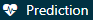
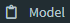

# 患者レベルの予測 {#PatientLevelPrediction}

*著者: Peter Rijnbeek & Jenna Reps*

\index{患者レベルの予測}

臨床判断は、臨床医が患者の入手可能な病歴と現在の臨床ガイドラインに基づいて診断や治療方針を推測しなければならない複雑な作業です。この意思決定プロセスをサポートするために臨床予測モデルが開発され、幅広い専門分野の臨床現場で使用されています。これらのモデルは、人口統計学的情報、病歴、治療歴などの患者特性の組み合わせに基づいて診断結果や予後を予測します。 \index{臨床意思決定} \index{診断アウトカム} \index{予後アウトカム}

臨床予測モデルに関する論文の数は、過去10年間で大幅に増加しています。現在使用されているモデルのほとんどは、小規模なデータセットを使用して推定され、患者特性の小規模なセットのみを考慮しています。このサンプルサイズの小ささ、つまり統計的なパワーの弱さにより、データ分析者は強いモデリング仮定を立てざるを得なくなります。患者特性の限定的なセットの選択は、手元にある専門知識に強く影響されます。これは、患者が豊富なデジタル履歴を残している現代医療の現実とは大きく対照的です。医療従事者がそのすべてを完全に把握することは不可能です。現在、医療は膨大な量の患者固有の情報を電子的健康記録（EHR）に保存しています。これには、診断、投薬、臨床検査結果などの構造化データと、臨床記録に含まれる非構造化データが含まれます。患者の完全なEHRから得られる大量のデータを活用することで、予測精度がどの程度向上するのかは不明です。 \index{予測モデル}

大規模データセット分析のための機械学習の進歩により、この種のデータに患者レベルの予測を適用することへの関心が高まっています。しかし、患者レベルの予測に関する多くの公開された取り組みは、モデル開発ガイドラインに従っておらず、広範な外部検証を実施していないか、またはモデルの詳細が不十分であるため、独立した研究者がモデルを再現し、外部検証を行う能力が制限されています。そのため、モデルの予測性能を公平に評価することが難しくなり、臨床現場でモデルが適切に使用される可能性が低くなります。 基準を改善するために、予測モデルの開発と報告におけるベストプラクティスのガイドラインを詳細に説明した論文がいくつか発表されています。 例えば、多変量予測モデルの透明性報告に関する声明（TRIPOD）声明[^patientlevelprediction-1] では、予測モデルの開発と検証の報告に関する明確な推奨事項が提示されており、透明性に関する懸念の一部に対処しています。 \index{機械学習} \index{TRIPOD}

[^patientlevelprediction-1]: <https://www.equator-network.org/reporting-guidelines/tripod-statement/>

OHDSI により、大規模かつ患者固有の予測モデリングが現実のものとなりました。共通データモデル（CDM）により、前例のない規模で一貫性のある透明性の高い分析が可能になりました。CDM に標準化されたデータベースのネットワークが拡大していることで、世界規模でさまざまな医療環境におけるモデルの外部検証が可能になっています。これにより、医療の質の向上を最も必要としている患者の大きなコミュニティに即座に貢献できる機会が得られると私たちは考えています。このようなモデルは、真に個別化された医療の実現につながり、患者の予後を大幅に改善できる可能性があります。 本章では、OHDSIの患者レベル予測のための標準化されたフレームワーク [@reps2018] について説明し、開発と検証のための確立されたベストプラクティスを実装した [PatientLevelPrediction](https://ohdsi.github.io/PatientLevelPrediction/) Rパッケージについて議論します。まず、患者レベル予測の開発と評価に必要な理論を説明し、実装された機械学習アルゴリズムの概要を説明します。次に、予測問題の例を挙げ、ATLAS またはカスタム R コードを使用した定義と実装の手順を説明します。最後に、研究結果の普及に Shiny アプリケーションを使用する方法について説明します。

## 予測課題

図 \@ref(fig:figure1) ここで取り上げる予測問題を示しています。リスクのある集団において、定義された時点（t = 0）で、リスク期間中に何らかの結果を経験する患者を予測することを目的としています。予測は、その時点以前の観察期間における患者の情報のみを使用して行われます。

\begin{figure}
\includegraphics[width=1\linewidth]{images/PatientLevelPrediction/Figure1} \caption{予測課題}(\#fig:figure1)
\end{figure}

表 \@ref(tab:plpDesign) に示すように、予測課題を定義するには、対象コホートによってt=0を定義し、アウトカムコホートによって予測したいアウトカムを定義し、リスク期間も定義する必要があります。標準的な予測問題は次のように定義されます： \index{対象コホート} \index{アウトカムコホート} \index{リスク期間}

> *[対象コホートの定義]*の中で、*[リスク期間]*内に*[アウトカムコホートの定義]*を持つのは誰ですか？

さらに、開発したいモデルのデザインオプションを検討し、内部および外部検証を行うための観察データセットを決定する必要があります。

| 選択肢 | 説明 |
|:---|:---|
| 対象コホート | 予測したい対象者のコホートをどのように定義しますか？ |
| アウトカムコホート | 予測したいアウトカムをどのように定義しますか？ |
| リスク期間 | t=0に対してどの時間枠で予測を行いますか？ |
| モデル | どのアルゴリズムを使用し、どの潜在的な予測変数を含めますか？ |

: (#tab:plpDesign) 予測デザインにおける主要なデザインオプション

この概念的フレームワークは、あらゆる種類の予測課題に適用できます。例えば：

-   疾病の発症と進行
    -   **構造**: *[病気]*と新たに診断された患者のうち、*[診断から見た時間枠内]*に*[別の疾患または合併症]*を発症するのは誰ですか？
    -   **例**: 心房細動と新たに診断された患者のうち、次の3年以内に虚血性脳卒中を発症するのは誰ですか？
-   治療選択
    -   **構造**: *[対象疾患]*と診断された患者で*、*[治療1]*または*[治療2]*で治療された患者うち、*[治療1]\*で治療された患者は？
    -   **例**: ワルファリンまたはリバロキサバンを服用した心房細動患者のうち、ワルファリンを服用した患者は誰ですか？（傾向スコアモデルの場合など）
-   治療反応
    -   **構造**: *[治療]*の新規使用者のうち、*[時間枠内]*に*[何らかの効果]*を経験するのは誰ですか？
    -   **例**: メトホルミンを開始した糖尿病患者のうち、3年間メトホルミンを継続するのは誰ですか？
-   治療安全性
    -   **構造**: *[治療]*の新規使用者の中で、*[時間枠内]*に*[有害事象]*を経験するのは誰ですか？
    -   **例**: ワルファリンの新規使用者の中で、1年以内に消化管出血を起こすのは誰ですか？
-   治療遵守
    -   **構造**: *[治療]*の新規使用者の中で、*[時間枠]*で*[遵守指標]*を達成するのは誰ですか？
    -   **例**: メトホルミンを開始した糖尿病患者のうち、1年以内に80%以上の遵守率を達成するのは誰ですか？

## データ抽出

予測モデルを作成する際には、機械学習の一種である\index{supervised learning(教師あり学習)}と呼ばれるプロセスを使用します。これは、ラベル付けされたサンプルセットに基づいて、共変量とアウトカムの状態の間の関係を推測するものです。したがって、対象コホートに属する人について、CDMから共変量を抽出する方法が必要であり、またアウトカムのラベルを取得する必要があります。

**共変量**（"予測因子"、"特徴"、"独立変数"とも呼ばれる）は、患者の特徴を説明します\index{共変量}。共変量には、年齢、性別、特定のコンディションの有無、患者記録内の曝露コードなどが含まれます。共変量は一般に、[FeatureExtraction](https://ohdsi.github.io/FeatureExtraction/)パッケージを使用して構築され、詳細は第 \@ref(Characterization) 章で説明しています。予測には、その人が対象コホートに入る日付（本書ではこれをインデックス日と呼びます）の前および当日のデータのみ使用できます。\index{基準日}

また、リスク期間中の全ての患者の**アウトカムステータス**（"ラベル"または"クラス"とも呼ばれる）も取得する必要があります。リスク期間中にアウトカムが発生した場合、アウトカムステータスは「陽性」と定義されます。\index{アウトカムステータス} \index{ラベル} \index{クラス}

### データ抽出の例

表 \@ref(tab:plpExampleCohorts) は、2つのコホートが含まれたCOHORTテーブルの例を示しています。コホート定義IDが1のコホートは対象コホート（例：「最近、心房細動と診断された人」）です。コホート定義IDが2は、アウトカムコホートを定義します（例：「脳卒中」）。

| COHORT_DEFINITION_ID | SUBJECT_ID | COHORT_START_DATE |
|:--------------------:|:----------:|:-----------------:|
|          1           |     1      |    2000-06-01     |
|          1           |     2      |    2001-06-01     |
|          2           |     2      |    2001-07-01     |

: (#tab:plpExampleCohorts) 例示的なCOHORTテーブル。簡潔のためにCOHORT_END_DATEは省略しています。

表 \@ref(tab:plpExampleConditions) は、例示的なCONDITION_OCCURRENCEテーブルを示しています。Concept ID [320128](http://athena.ohdsi.org/search-terms/terms/320128) は「本態性高血圧」に該当します。

| PERSON_ID | CONDITION_CONCEPT_ID | CONDITION_START_DATE |
|:---------:|:--------------------:|:--------------------:|
|     1     |        320128        |      2000-10-01      |
|     2     |        320128        |      2001-05-01      |

: (#tab:plpExampleConditions) 例示的なCONDITION_OCCURRENCEテーブル。簡潔のため、3つの列のみ表示しています。

この例示的なデータに基づき、リスク期間をインデックス日（対象コホートの開始日）から1年間と仮定すると、共変量とアウトカムステータスを構築できます。「前年の本態性高血圧」を示す共変量は、個人ID 1に対して0（非該当）（アウトカムがインデックス日の後に発生）と、個人ID 2に対して1（該当）となります。同様に、アウトカムステータスは個人ID 1に対して0（この人はアウトカムコホートに該当しない）、個人ID 2に対して1（インデックス日から1年以内にアウトカムが発生）となります。

### 負の値と欠損

観察医療データは、値が負であるか欠損であるかを反映することはまれです。先の例では、ID 1 の人物にはインデックス日以前に本態性高血圧症の発生がなかったことを単純に観察しました。これは、その時点ではその状態が存在していなかった（負）ためであるか、あるいは記録されていなかった（欠損）ためである可能性があります。機械学習アルゴリズムは負と欠損を区別できず、利用可能なデータにおける予測値を単純に評価することに留意することが重要です。\index{欠損データ}

## モデルの適合 {#modelFitting}

予測モデルの適合を行う際には、ラベル付けされた例から、共変量と観測されたアウトカムの状態の関係を学習しようとしています。例えば、共変量が2つしかない場合、収縮期血圧と拡張期血圧だとすると、各患者を2次元空間のプロットとして表現できます（図 \@ref(fig:decisionBoundary) を参照）。この図では、データポイントの形が患者のアウトカム状態（例：脳卒中）に対応しています。

教師あり学習モデルは、2つのアウトカムクラスを最適に分離する決定境界を見つけようとします。異なる教師あり学習手法は異なる決定境界をもたらし、決定境界の複雑性に影響を与えるハイパーパラメータが存在することがよくあります。 \index{decision boundary}

\begin{figure}

{\centering \includegraphics[width=0.8\linewidth]{images/PatientLevelPrediction/decisionBoundary} 

}

\caption{決定境界}(\#fig:decisionBoundary)
\end{figure}

図 \@ref(fig:decisionBoundary) では、3つの異なる決定境界線を見ることができます。この境界線は、新しいデータポイントの結果の状態を推測するために使用されます。新しいデータポイントが影の部分に該当する場合、モデルは「結果あり」と予測し、それ以外は「結果なし」と予測します。理想的には、決定境界線は2つのクラスを完全に分割するべきです。しかし、あまりにも複雑なモデルはデータに「過剰適合」するリスクがあります。これは、未確認データに対するモデルの汎用性に悪影響を及ぼす可能性があります。例えば、データにノイズが含まれている場合、つまりラベル付けが誤っていたり、データポイントの位置が不正確であったりする場合には、そのノイズにモデルを適合させることは望ましくありません。そのため、トレーニングデータでは完全に識別しないが、「実際の」複雑さを捉える決定境界を定義することが望ましい場合があります。正則化などの手法は、複雑さを最小限に抑えながらモデルのパフォーマンスを最大化することを目的としています。

各教師あり学習アルゴリズムは、決定境界を学習する方法が異なり、どのアルゴリズムがデータに最適であるかは一概には言えません。「No Free Lunch」定理が示すように、すべての予測問題において常に他のアルゴリズムよりも優れたアルゴリズムは存在しません。\index{no free lunch} そのため、患者レベルの予測モデルを開発する際には、さまざまなハイパーパラメータ設定で複数の教師あり学習アルゴリズムを試すことをお勧めします。

この後に示すアルゴリズムは以下から取得可能です： [PatientLevelPrediction](https://ohdsi.github.io/PatientLevelPrediction/) パッケージ

### 正則化ロジスティック回帰

LASSO（最小絶対値収縮選択オペレーター）ロジスティック回帰は一般化線形モデルに属し、変数の線形結合が学習され、最終的にロジスティック関数がその線形結合を0から1の間の値に写像します。 LASSO正則化では、モデルをトレーニングする際に、目的関数にモデルの複雑さに基づくコストが追加されます。 このコストは係数の線形結合の絶対値の合計です。 モデルは、このコストを最小化することで自動的に特徴選択を行います。大規模な正則化ロジスティック回帰を行うために、 [Cyclops](https://ohdsi.github.io/Cyclops/) （ロジスティック、ポアソン、生存時間分析のための循環座標降下法）パッケージを使用しています。 \index{LASSO} \index{logistic regression} \index{regularization} \index{Cyclops}

| パラメータ | 説明               | 典型的な値 |
|:-----------|:-------------------|:-----------|
| 初期分散   | 事前分布の初期分散 | 0.1        |

: (#tab:lassoParameters) 正則化ロジスティック回帰のハイパーパラメータ

分散はクロスバリデーションでのサンプル外の尤度を最大化して最適化されるため、初期分散はアウトカムとして得られるモデルの性能にはほとんど影響しません。ただし、最適値からあまりに離れた初期分散を選択すると、適合時間が長くなる可能性があります。\index{variance} \index{hyper-parameter} \index{cross-validation}

### 勾配ブースティングマシン

勾配ブースティングマシンはブースティングアンサンブル手法であり、この枠組みでは複数の決定ツリーを組み合わせます。ブースティングは、繰り返し決定ツリーを追加し、前の決定ツリーで誤分類されたデータポイントにより多くの重みをコスト関数に追加して次のツリーをトレーニングします。高効率の勾配ブースティングフレームワークを実装した、CRANで利用可能なxgboost Rパッケージを使用しています。 \index{gradient boosting} \index{xgboost}

| パラメータ     | 説明                           | 典型的な値     |
|:---------------|:-------------------------------|:---------------|
| earlyStopRound | 改善がない場合の停止ラウンド数 | 25             |
| learningRate   | ブースティングの学習率         | 0.005,0.01,0.1 |
| maxDepth       | ツリーの最大深さ               | 4,6,17         |
| minRows        | ノード内の最小データポイント数 | 2              |
| ntrees         | ツリーの数                     | 100,1000       |

: (#tab:gbmParameters) 勾配ブースティングマシンのハイパーパラメータ

### ランダムフォレスト

ランダムフォレストは複数の決定ツリーを組み合わせるバギング法の集合手法です。バギング法の背景にある考え方は、弱い分類器を使用し、それを強力な分類器に組み合わせることで、過剰適合の可能性を低減することです。ランダムフォレストは、複数の決定ツリーをトレーニングすることでこれを実現しますが、各ツリーでは変数のサブセットのみを使用し、ツリーごとに変数のサブセットが異なります。当社のパッケージでは、Pythonのランダムフォレストの実装であるsklearnを使用しています。 \index{random forest} \index{python} \index{sklearn}

| パラメータ | 説明             | 典型的な値                 |
|:-----------|:-----------------|:---------------------------|
| maxDepth   | ツリーの最大深さ | 4,10,17                    |
| mtries     | 各ツリーの変数数 | -1 = 総変数数の平方根,5,20 |
| ntrees     | ツリーの数       | 500                        |

: (#tab:randomForestParameters) ランダムフォレストのハイパーパラメータ

### K-近傍法

K-近傍法 (K-nearest neighbors; KNN) は、ある距離尺度を使用して、新しいラベルのないデータポイントに最も近いラベル付きデータポイントをK個見つけるアルゴリズムです。新しいデータポイントの予測は、K個の最も近いラベル付きデータポイントの中で最も一般的なクラスとなります。KNNには共有に関する制限があり、新しいデータの予測を行うにはラベル付きデータが必要となるため、このデータをデータサイト間で共有できないことがよくあります。OHDSIで開発された大規模KNN分類器である [BigKnn](https://github.com/OHDSI/BigKnn) パッケージを組み込んでいます。 \index{k-nearest neighbors} \index{bigknn}

| パラメータ | 説明   | 典型的な値 |
|:-----------|:-------|:-----------|
| k          | 近傍数 | 1000       |

: (#tab:knnParameters) K-近傍法のハイパーパラメータ

### ナイーブベイズ

ナイーブベイズアルゴリズムは、クラス変数の値を考慮した際の特徴の各ペア間の条件付き独立性という単純な仮定を適用したベイズの定理です。 データがクラスに属する可能性とクラスの事前分布に基づいて事後分布が取得されます。 ナイーブベイズにはハイパーパラメータがありません。 \index{naive bayes}

### AdaBoost

AdaBoostはブースティングのアンサンブル手法です。ブースティングは分類器を繰り返し追加することで機能しますが、次の分類器をトレーニングする際には、コスト関数において、先行する分類器によって誤分類されたデータポイントにより大きな重みを追加します。Pythonでは、sklearnのAdaboostClassifier実装を使用します。 \index{adaboost} \index{python}

| パラメータ | 説明 | 典型的な値 |
|:---|:---|:---|
| nEstimators | ブースティングを終了する最大推定器数 | 4 |
| learningRate | learningRate learning_rate によって各分類器の寄与を縮小する学習率。 learningRate と nEstimators にはトレードオフの関係がある。 | 1 |

: (#tab:adaBoostParameters) AdaBoostのハイパーパラメータ

### 決定ツリー

決定ツリーは、貪欲法で選択された個々のテストを使用して変数空間を分割する分類器です。クラスを分離する際に、最も高い情報量を持つ分割を見つけることを目的としています。決定ツリーは、多数の分割（ツリーの深さ）を有効にすることで簡単に過学習状態になるため、多くの場合、正則化（例えば、枝刈りやモデルの複雑性を制限するハイパーパラメータの指定）が必要です。Pythonでは、sklearnのDecisionTreeClassifier実装を使用します。 \index{decision tree} \index{python}

| パラメータ | 説明 | 典型的な値 |
|:---|:---|:---|
| classWeight | "Balance"または"None" | None |
| maxDepth | 木の最大深さ | 10 |
| minImpuritySplit | ツリーの成長中に早期停止するための閾値。ノードの不純物が閾値を上回る場合は分割され、そうでない場合はリーフとなります | 10\^-7 |
| minSamplesLeaf | 各リーフの最小サンプル数 | 10 |
| minSamplesSplit | 各分割の最小サンプル数 | 2 |

: (#tab:decisionTreeParameters) 決定ツリーのハイパーパラメータ

### 多層パーセプトロン

多層パーセプトロンは、非線形関数を使用して入力を重み付けする複数のノード層を含むニューラルネットワークです。最初の層は入力層、最後の層は出力層であり、その間にあるのが隠れ層です。ニューラルネットワークは一般にバックプロパゲーションを用いて訓練されます。これは、訓練入力がネットワークを通じて順方向に伝搬され、出力が生成されることを意味します。出力とアウトカムの状態の間の誤差が計算され、この誤差がネットワークを通じて逆方向に伝搬され、線形関数の重みが更新されます。 \index{neural network} \index{perceptron} \index{back-propagation}

| パラメータ | 説明           | 典型的な値 |
|:-----------|:---------------|:-----------|
| alpha      | l2正則化       | 0.00001    |
| size       | 隠れノードの数 | 4          |

: (#tab:mpParameters) 多層パーセプトロン用のハイパーパラメータ

### 深層学習

ディープネット、畳み込みニューラルネットワーク、再帰型ニューラルネットワークなどのディープラーニングは、多層パーセプトロンと類似していますが、予測に役立つ潜在的な表現を学習することを目的とした複数の隠れ層を持っています。[PatientLevelPrediction](https://ohdsi.github.io/PatientLevelPrediction/) パッケージの別の[ビネット](https://ohdsi.github.io/PatientLevelPrediction/articles/BuildingDeepLearningModels.html)で、これらのモデルとハイパーパラメータの詳細について説明しています。 \index{deep learning} \index{convolutional neural network} \index{recurrent neural networks}

### その他のアルゴリズム

患者レベルの予測フレームワークには他のアルゴリズムを追加できますが、これは本章の範囲外です。詳細は、[PatientLevelPrediction](https://ohdsi.github.io/PatientLevelPrediction/) パッケージの["Adding Custom Patient-Level Prediction Algorithms"ビネット](https://ohdsi.github.io/PatientLevelPrediction/articles/AddingCustomAlgorithms.html)を参照ください。

## 予測モデルの評価

### 評価の種類

予測モデルの評価は、モデルの予測と観測されたアウトカムの一致度を測定することによって行うことができます。これには、アウトカムのステータスが既知であるデータが必要です。 \index{予測モデルの評価}

\BeginKnitrBlock{rmdimportant}
評価には、モデル開発に使用されたデータセットとは異なるデータセットを使用しなければなりません。そうしないと、過剰適合したモデルを支持してしまう可能性があり（セクション \@ref(modelFitting) を参照）、新規患者に対して良好な結果が得られない可能性があります。
\EndKnitrBlock{rmdimportant}

評価の種類には、以下のものがあります：

-   **内部検証**：同じデータベースから抽出された異なるデータセットを使用してモデルを開発および評価します。
-   **外部検証**：一つのデータベースでモデルを開発し、別のデータベースで評価します。 \index{検証!内部検証} \index{検証!外部検証}

内部検証の方法には、次の2つがあります：

-   **ホールドアウトセット**アプローチ：ラベル付けされたデータを2つの独立したセット（トレーニングセットとテストセット（ホールドアウトセット））に分割します。トレーニングセットはモデルの学習に使用され、テストセットはモデルの評価に使用されます。患者をランダムに訓練用とテスト用に単純に分割することもできますが、以下のような方法も選択できます。：
    -   時間に基づいた分割（時間的検証）：例えば、特定の日付以前のデータで訓練を行い、その日付以降のデータで評価を行う。これにより、モデルが異なる期間に一般化できるかどうかを判断できる可能性があります。
    -   地理的位置に基づいた分割（空間的検証）。\index{検証!時間的検証} \index{検証!空間的検証}
-   **クロスバリデーション**：データが限られている場合に有用です。データを等しいサイズに分割し、$n$にプレ設定されたセットに分割します（例：$n=10$）。各セットでは、そのセットデータ以外のすべてのデータを使用してモデルがトレーニングされ、保留セットの予測を生成するために使用されます。このように、すべてのデータが一度使用されてモデル構築アルゴリズムが評価されます。患者レベルの予測フレームワークでは、最適なハイパーパラメータを選択するためにクロスバリデーションを使用します。\index{交差検証}

外部検証は、別のデータベースのデータ（すなわち、開発された環境以外のデータ）でモデルのパフォーマンスを評価することを目的としています。モデルの移植性を評価するこの手法は重要です。なぜなら、モデルをトレーニングしたデータベースのみでなく、他のデータベースにも適用したいからです。異なるデータベースは、異なる患者集団、異なる医療システム、異なるデータ収集プロセスを表している可能性があります。多数のデータベースにおける予測モデルのクロスバリデーションは、モデルの受容と臨床現場への導入において重要なステップであると考えています。

### 性能指標 {#performance}

#### 閾値測定 {.unnumbered}

予測モデルは、リスク期間中にアウトカムが起こる患者のリスクに対応する各患者に0から1の間の値を割り当てます。値が0の場合はリスクが0%、0.5の場合は50%のリスク、1の場合は100%のリスクを意味します。 リスク期間にアウトカムが得られるリスクを患者に分類するために使用する閾値を最初に指定することで、一般的な測定基準である正確度、感度、特異度、陽性的中率を計算することができます。例えば、表 \@ref(tab:tabletheorytab) にあるように閾値を0.5と設定すると、患者1、3、7、10は閾値0.5以上の予測リスクを持つため、アウトカムを持つと予測されます。他のすべての患者は0.5未満の予測リスクを持つため、アウトカムを持たないと予測されます。 \index{性能指標} \index{精度} \index{感度} \index{特異度} \index{陽性予測値}

| 患者ID | 予測リスク | 0.5閾値での予測クラス | リスク期間中にアウトカムを持つ | タイプ |
|:--:|:--:|:--:|:--:|:--:|
| 1 | 0.8 | 1 | 1 | TP |
| 2 | 0.1 | 0 | 0 | TN |
| 3 | 0.7 | 1 | 0 | FP |
| 4 | 0 | 0 | 0 | TN |
| 5 | 0.05 | 0 | 0 | TN |
| 6 | 0.1 | 0 | 0 | TN |
| 7 | 0.9 | 1 | 1 | TP |
| 8 | 0.2 | 0 | 1 | FN |
| 9 | 0.3 | 0 | 0 | TN |
| 10 | 0.5 | 1 | 0 | FP |

: (#tab:tabletheorytab) 予測確率に対する閾値の利用例

患者が予測されたアウトカムを持ち、実際にアウトカムを持つ場合、それを真陽性（TP）と呼びます。患者が予測されたアウトカムを持っているが実際にはアウトカムを持っていない場合、それを偽陽性（FP）と呼びます。患者がアウトカムを持たないと予測され、実際にアウトカムを持っていない場合、それを真陰性（TN）と呼びます。最後に、患者がアウトカムを持たないと予測され、実際にアウトカムを持っている場合、それを偽陰性（FN）と呼びます。 \index{真陽性} \index{偽陽性} \index{真陰性} \index{偽陰性}

以下の閾値ベースの指標を計算できます：

-   正解率: $(TP+TN)/(TP+TN+FP+FN)$
-   感度: $TP/(TP+FN)$
-   特異度: $TN/(TN+FP)$
-   陽性的中率: $TP/(TP+FP)$

これらの値は、閾値が下げられると増減する可能性があります。分類器の閾値を下げると、アウトカムの数を増やすことで分母を増やすことができます。以前の閾値が高すぎた場合、新しいアウトカムはすべて真陽性である可能性があり、これにより陽性的中率が増加します。以前の閾値が適切であったか低すぎた場合、さらなる閾値の低下は偽陽性をもたらすため、陽性的中率が減少する可能性があります。感度の場合、分母は分類器の閾値に依存しません（$TP+FN$は一定です）。このため、分類器の閾値を下げることで真陽性のアウトカム数を増やし、感度を向上させる可能性があります。また、閾値を下げても感度が変わらない一方で、陽性的中率が変動することもあります。

#### 識別力 {.unnumbered}

識別力とは、リスク期間中にアウトカムを経験する患者に対して、より高いリスクを割り当てる能力のことですROC（Receiver Operating Characteristics）曲線は、すべての可能な閾値において、1 – 特異度をx軸に、感度をy軸にプロットして作成されます。ROCプロットの例は、本章の後のほうの図 \@ref(fig:shinyROC) で示されています。ROC曲線下面積（AUC）は、判別能の全体的な尺度であり、0.5はリスクをランダムに割り当てることを意味し、1は完璧な判別を意味します。ほとんどの公表された予測モデルは、0.6～0.8 の AUC を取得しています。 \index{AUC} \index{ROC} \index{識別力}

AUCは、リスク期間中にアウトカムを経験する患者と経験しない患者との間で予測リスク分布がどれだけ異なるかを判断する方法を提供します。AUCが高い場合、分布はほとんど重ならないのに対し、重なりが多い場合はAUCが0.5に近くなります。図 \@ref(fig:figuretheoryroctheory) に示されている通りです。

\begin{figure}
\includegraphics[width=1\linewidth]{images/PatientLevelPrediction/theory/roctheory} \caption{識別力に関連するROCプロット。2つのクラスの予測リスクの分布が類似している場合、ROCは対角線に近く、AUCは0.5に近くなります。}(\#fig:figuretheoryroctheory)
\end{figure}

非常に稀なアウトカムに対しては、AUCが高くても実際には実用的でない場合があります。なぜなら、閾値を超えるすべての陽性の背後には多くの陰性が存在し、陽性的中率が低くなる可能性があるからです。アウトカムの重大性や介入のコスト（健康リスクまたは金銭的）によっては、高い偽陽性率は望ましくないかもしれません。そのため、稀なアウトカムに対しては、適合率-再現率曲線下面積（AUPRC）と呼ばれる別の測定値が推奨されます。AUPRCは感度をx軸（再現率としても知られる）に、陽性的中率（適合率としても知られる）をy軸にプロットして生成される曲線の下の面積です。 \index{適合率-再現率曲線下の面積}

#### キャリブレーション {.unnumbered}

キャリブレーションは、モデルが正しいリスクを割り当てる能力です。例えば、モデルが100人の患者に10％のリスクを割り当てた場合、そのうち10人がリスク期間中にアウトカムを経験するべきです。同様に、モデルが100人の患者に80％のリスクを割り当てた場合、そのうち80人がリスク期間中にアウトカムを経験するべきです。キャリブレーションは、一般に予測リスクに基づいて患者を十分位に分割し、各グループで平均予測リスクとリスク期間中にアウトカムを経験した患者の割合を計算することによって測定されます。次に、これらの10点（予測リスクをy軸、観測リスクをx軸にプロット）をプロットし、それらがx = yの線上に位置するかどうかを確認します。これがモデルが適切にキャリブレーションされていることを示します。キャリブレーションプロットの例は、本章の後半に図 \@ref(fig:shinyCal) で示されています。また、これらの点を使用して線形モデルをフィットし、切片（ゼロに近いはず）と傾き（1に近いはず）を計算します。もし、傾きが1より大きい場合、モデルは実際のリスクよりも高いリスクを割り当てており、傾きが1より小さい場合、モデルは実際のリスクよりも低いリスクを割り当てていることを意味します。非線形関係をよりよく捕捉するために、Smooth Calibration Curvesも実装しています。 \index{キャリブレーション}

## 患者レベル予測研究のデザイン

本セクションでは予測研究のデザイン方法について説明します。最初のステップは、予測問題を明確に定義することです。興味深いことに、多くの発表論文では予測問題の定義が不十分であり、例えば、インデックス日（対象コホートの開始日）がどのように定義されているのかが不明確です。予測問題の定義が不十分であると、他者による外部検証はおろか、臨床現場での実施も不可能になります。患者レベルの予測フレームワークでは、表 \@ref(tab:plpDesign)で定義された主要な選択肢を明示的に定義することを要求することで、予測問題の適切な仕様を強制しています。ここでは、「治療の安全性」タイプの予測問題を例に、このプロセスを説明します。\index{インデックス日}

### 問題の定義

血管性浮腫はACE阻害薬のよく知られた副作用であり、ACE阻害薬のラベルに記載されている血管性浮腫の発生率は0.1％から0.7％の範囲です [@byrd_2006]。 この副作用をモニタリングすることは重要です。なぜなら、血管性浮腫は稀であるものの、生命を脅かす可能性があり、呼吸停止や死亡に至ることがあるからです [@norman_2013]。 さらに、血管性浮腫が最初に認識されないと、その原因を特定するまでに広範かつ高額な検査が必要となる可能性があります　[@norman_2013; @thompson_1993]。 アフリカ系アメリカ人患者におけるリスクの増加以外に、ACE阻害薬関連の血管性浮腫の発症に対する既知の素因は知られていません [@byrd_2006]。 ほとんどの反応は初めての治療の最初の週または１か月以内に発生し、最初の投与から数時間以内に発生することもあります [@circardi_2004]。 しかし、一部の症例は治療開始から数年後に発生することもあります [@mara_1996]。 リスクのある人を特定する特定の診断テストはありません。もしリスクのある人を特定できれば、医師は例えばACE阻害薬を別の降圧薬に切り替えるなどの対応が可能になります。 \index{血管性浮腫} \index{ACE阻害薬}

患者レベル予測フレームワークを観察医療データに適用して、次の患者レベルの予測問題に取り組みます：

> 初めてACE阻害薬を開始した患者のうち、１年以内に血管性浮腫を発症するのは誰か？

### 研究集団の定義

モデルを開発する最終的な研究対象集団は、対象コホートのサブセットとなることがよくあります。例えば、アウトカムに依存する基準を適用する場合や、対象コホートのサブグループで感度分析を行いたい場合などです。この場合、以下の問いに答えなければなりません。：

-   *対象コホートの開始前にどの程度の観察期間が必要ですか？* この選択は、トレーニングデータで利用可能な患者の時間にも依存しますが、将来的にモデルを適用したいデータソースで利用可能な時間にも依存します。 最小の観察期間が長ければ長いほど、各人の特徴抽出に使用できるベースライン期間を得られますが、分析対象となる患者数は少なくなります。さらに、短いまたは長い観察期間を選択する臨床的な理由がある場合もあります。今回の例では、365日間をルックバック期間（ウォッシュアウト期間）として使用します。

-   *患者が対象コホートに複数回組み入れられますか？* 対象コホートの定義では、例えば、異なる病気のエピソードや医療製品への曝露期間が異なる場合など、異なる期間に複数回、その集団に適格となる可能性があります。コホート定義は、患者が一度だけ参加できるように制限を適用するとは限りませんが、特定の患者レベルの予測問題の文脈では、最初の適格エピソードにコホートを限定したい場合もあります。 例では、ACE阻害薬の初回使用を基準としているため、患者は一度だけ対象コホートに参加できます。

-   *以前にアウトカムを経験した人をコホートに含めることができますか？* 対象コホートに適格となる前にアウトカムを経験した人をコホートに含めるかどうかを決める必要があります。特定の患者レベルの予測問題によっては、初回のアウトカムの発生を予測したい場合があるため、以前にアウトカムを経験した患者はリスクがないため、ターゲットコホートから除外する必要があります。他の状況では、前回エピソードの予測を希望しているため、以前のアウトカムが将来のアウトカムの予測要因になる可能性もあります。私たちの予測例では、以前に血管性浮腫を持つ人を含めないことにします。

-   *対象コホート開始日に対してアウトカムを予測する期間をどう定義しますか？* この質問に答えるために、2つの決定を下す必要があります。まず、リスク期間の開始日を対象コホートの開始日またはそれ以降に設定するかどうかの議論があります。開始日を遅らせる理由には、記録が遅れて入力された結果を避けたい場合や、結果を予防する介入が理論上実施可能であった期間を空けておきたい場合などが考えられます。次に、リスク期間の終了日を設定して、対象コホートの開始日または終了日からの相対的な日数オフセットをある程度指定することで、リスク期間を定義する必要があります。今回の問題では、対象コホートの開始日の1日後から365日後までの期間をリスク期間として予測します。

-   *最小限のリスク期間は必要でしょうか？* アウトカムが発生しなかったが、リスク期間終了前にデータベースを離脱した患者を含めるかどうかを決める必要があります。これらの患者は観察期間が終わった後にアウトカムを経験する可能性があります。この予測問題では、この質問に「はい」と答え、その理由で最小のリスク期間を必要とします。さらに、この制約がアウトカムを経験した人に適用されるかどうか、リスク期間の長短に関わらず、アウトカムを経験した人全員を対象とするのかを決定しなければなりません。アウトカムが死亡の場合、リスク期間が完了する前に打ち切られる可能性が高いでしょう。

### モデル開発の設定

予測モデルを開発するには、どのアルゴリズムをトレーニングするか決定しなければなりません。特定の予測問題に対する最良のアルゴリズムの選択は経験的な問題であると捉え、すなわち、データに語らせ、最良のものを発見するためにさまざまなアプローチを試みることを好みます。そのため、私たちのフレームワークでは、セクション \@ref(modelFitting)に記載されているように多くのアルゴリズムを実装しており、他のアルゴリズムを追加することも可能です。この例では、シンプルにするために、Gradient Boosting Machines（GBM）を一つのアルゴリズムとして選択します。

さらに、モデルのトレーニングに使用する共変量も決定する必要があります。この例では、性別、年齢、コンディションすべて、薬剤および薬剤グループ、来院回数などを追加したいと思います。これらの臨床イベントは、インデックス日の1年前から、それ以前の任意の期間にわたって検索します。

### モデル評価

最後に、モデルの評価方法を定義する必要があります。ここでは、単純化のため、内部検証を選択します。データセットをトレーニング用とテスト用に分割する方法、患者をこれら2つのセットに割り当てる方法を決定する必要があります。ここでは、典型的な75% - 25%分割を使用します。非常に大規模なデータセットの場合は、トレーニング用にさらに多くのデータを使用できます。

### 研究概要

これで、表 \@ref(tab:plpSummary) に示されるように、研究を完全に定義しました。

| 選択 | 値 |
|:---|:---|
| 対象コホート | 初めてACE阻害薬を開始した患者。観察期間が365日未満、または血管性浮腫の既往がある患者は除外されます。 |
| アウトカムコホート | 血管性浮腫。 |
| リスク期間 | コホート開始日の1日後から365日後。少なくとも364日のリスク期間が必要。 |
| モデル | Gradient Boosting Machine with hyper-parameters ntree: 5000, max depth: 4 or 7 or 10 and learning rate: 0.001 or 0.01 or 0.1 or 0.9. Covariates will include gender, age, conditions, drugs, drug groups, and visit count. データ分割: 75％トレーニング - 25％テスト、個人ごとにランダムに割り当てられます。 |

: (#tab:plpSummary) この研究の主なデザイン選択

## ATLASでの研究の実装

予測研究をデザインするインターフェースは、ATLASメニューの左側にあるボタンをクリックすることで開くことができます。新しい予測研究を作成しましょう。研究にわかりやすい名前をつけておくことを忘れないでください。研究のデザインはいつでもボタンをクリックして保存できます。\index{ATLAS}

予測デザイン機能には、予測の問題設定、分析設定、実行設定、トレーニング設定の4つのセクションがあります。それぞれのセクションについて説明します。

### 予測の問題設定

ここでは、分析の対象となる母集団コホートとアウトカムコホートを選択します。予測モデルは、対象となる母集団コホートとアウトカムコホートのすべての組み合わせに対して作成されます。例えば、2つの対象集団と2つのアウトカムを指定すると、4つの予測問題が指定されたことになります。

対象となる母集団コホートを選択するには、事前にATLASで定義しておく必要があります。コホートのインスタンス化については、第 \@ref(Cohorts) 章で説明しています。この例で使用する対象（付録 \@ref(AceInhibitors)）およびアウトカム（付録 \@ref(Angioedema)）コホートの完全な定義は付録に掲載しています。対象集団をコホートに追加するには、「Add Target Cohort」ボタンをクリックします。アウトカムコホートの追加も同様に、「Add Outcome Cohort」ボタンをクリックすることで行います。完了すると、ダイアログが図 \@ref(fig:problemSettings) のようになります。

\begin{figure}

{\centering \includegraphics[width=1\linewidth]{images/PatientLevelPrediction/problemSettings} 

}

\caption{予測問題の設定}(\#fig:problemSettings)
\end{figure}

### 分析設定

分析設定では、教師あり学習アルゴリズム、共変量と母集団の設定を選択できます。

#### モデル設定 {.unnumbered}

モデル開発には、1つまたは複数の教師あり学習アルゴリズムを選択することができます。教師あり学習アルゴリズムを追加するには、「Add Model Settings」ボタンをクリックします。ATLASインターフェースで現在サポートされているすべてのモデルを含むドロップダウンが表示されます。ドロップダウンメニューから名前をクリックして、調査に含めたい教師あり学習モデルを選択します。これにより、その特定のモデルのビューが表示され、ハイパーパラメータ値の選択が可能になります。複数の値が指定されている場合、グリッドサーチがすべての値の組み合わせに対して実行され、クロスヴァリデーションを使用して最適な組み合わせが選択されます。

今回の例では、勾配ブースティングマシンを選択し、図 \@ref(fig:gbmSettings) に示すようにハイパーパラメータを設定します。

\begin{figure}

{\centering \includegraphics[width=1\linewidth]{images/PatientLevelPrediction/gbmSettings} 

}

\caption{勾配ブースティングマシンの設定}(\#fig:gbmSettings)
\end{figure}

#### 共変量設定 {.unnumbered}

私たちは、CDM形式の観察データから抽出できる標準共変量のセットを定義しました。共変量設定ビューでは、どの標準共変量を含めるかを選択できます。異なるタイプの共変量設定を定義でき、各モデルは指定された共変量設定ごとに個別に作成されます。

研究に共変量設定を追加するには、「Add Covariate Settings」をクリックします。これで共変量設定ビューが開きます。

共変量設定ビューの最初の部分は除外/包括オプションです。共変量は一般に任意のコンセプトに対して構築されますが、例えば対象コホート定義にリンクされている場合、特定のコンセプトを除外または含めることができます。特定のコンセプトのみを含めるには、ATLASでコンセプトセットを作成し、 "**What concepts do you want to include in baseline covariates in the patient-level prediction model? (Leave blank if you want to include everything) (患者レベルの予測モデルにおけるベースライン共変量として、どのようなコンセプトを含めたいですか？（すべてを含めたい場合は空白のままにしてください）)**" の下でをクリックしてコンセプトセットを選択します。コンセプトセット内のコンセプトに下位層のコンセプトを自動的に追加するには、 "**Should descendant concepts be added to the list of included concepts? (含まれるコンセプトのリストに下位層コンセプトを追加すべきでしょうか？)**" の質問に「yes」と答えます。同じプロセスを、共変量に対応する選択されたコンセプトを除外する "**What concepts do you want to exclude in baseline covariates in the patient-level prediction model? (Leave blank if you want to include everything) (患者レベルの予測モデルにおけるベースライン共変量から除外したいコンセプトは何ですか？（すべてを含める場合は空白のままにしてください）)**" の質問にも繰り返します。最後のオプション "**A comma delimited list of covariate IDs that should be restricted to (制限すべき共変数IDのコンマ区切りリスト)**" では、共変量ID（コンセプトIDではなく）をカンマ区切りで追加し、これらがモデルに含まれるようにすることができます。このオプションは上級ユーザ向けです。完了すると、適格基準設定と除外基準設定は図 \@ref(fig:covariateSettings1)のようになります。

\begin{figure}

{\centering \includegraphics[width=1\linewidth]{images/PatientLevelPrediction/covariateSettings1} 

}

\caption{共変量の包括と除外設定}(\#fig:covariateSettings1)
\end{figure}

次のセクションでは、時間に依存しない変数の選択ができます：

-   性別： 男性または女性の性別を示す二値変数

-   年齢： 年単位の連続変数

-   年齢グループ： 5年ごとのバイナリ変数（0-4、5-9、...、95+）

-   人種： 各人種に関するバイナリ変数で、1は患者がその人種を記録していることを意味し、0はそうでないことを意味します。

-   民族： 各民族性に関するバイナリ変数で、1は患者がその民族性を記録していることを意味し、0はそうでないことを意味します。

-   インデックス年： 各コホート開始日の年を表すバイナリ変数で、1は患者のコホート開始年、0はそれ以外を表します。**インデックス年を含めることは、しばしば意味をなさないことがあります。なぜなら、私たちは将来にわたってモデルを適用したいからです**。

-   インデックス月： 各コホート開始日の月を表すバイナリ変数で、1は患者のコホート開始日の月を表し、0はそれ以外を表します。

-   前観察期間： [予測には推奨されません] コホート開始日以前に患者がデータベースに存在した日数を示す連続変数

-   後観察期間： [予測には推奨されません] コホート開始日以降に患者がデータベースに存在した日数を示す連続変数

-   コホート時間： 患者がコホートに属していた日数（コホート終了日－コホート開始日）に対応する連続変数

-   インデックス年と月： [予測には推奨されません] 各コホート開始日の年と月の組み合わせを表すバイナリ変数。1は患者のコホート開始日の年と月であることを表し、0はそれ以外を表します。

これが完了すると、このセクションは図 \@ref(fig:covariateSettings2) のようになるはずです。

\begin{figure}

{\centering \includegraphics[width=1\linewidth]{images/PatientLevelPrediction/covariateSettings2} 

}

\caption{共変量の選択}(\#fig:covariateSettings2)
\end{figure}

標準の共変量は共変量に対して柔軟な3つの時間間隔を設定できます：

-   終了日までの日数: コホート開始日からの終了日まで[デフォルトは0]
-   長期 [デフォルトはコホート開始前365日から終了日まで]
-   中期 [デフォルトはコホート開始前180日から終了日まで]
-   短期 [デフォルトはコホート開始前30日から終了日まで]

これが完了すると、このセクションは図 \@ref(fig:covariateSettings3) のようになるはずです。

\begin{figure}

{\centering \includegraphics[width=1\linewidth]{images/PatientLevelPrediction/covariateSettings3} 

}

\caption{時間に依存する共変量}(\#fig:covariateSettings3)
\end{figure}

次のオプションは、期間テーブルから抽出される共変量です：

-   コンディション： 選択された各コンディションのコンセプトIDと時間間隔ごとに共変量を構築し、CONDITON_ERAテーブルにおいて、選択されたコホート開始日前の時間間隔の間に、患者にコンディション期間をもつ（すなわち、その時間間隔の間にそのコンディションが開始または終了するか、またはその時間間隔の前に開始し、その時間間隔の後に終了する）コンセプトIDがある場合、共変量の値は 1、そうでない場合は 0。

-   コンディショングループ： 選択されたコンディションのコンセプトIDと時間間隔について共変量を構築し、CONDITON_ERAテーブルにおいて、選択されたコホート開始日前の時間間隔の間に、患者にコンディション期間を持つコンセプトID**またはその下位層のコンセプトID**がある場合、共変量値は 1、そうでない場合は 0。

-   薬剤：選択された各薬剤コンセプトIDと時間間隔ごとに共変量を構築し、DRUG_ERAテーブルにおいて、選択されたコホート開始日前の時間間隔の間に、患者に薬剤（曝露）期間をもつコンセプトIDがある場合、共変量の値は 1、そうでない場合は 0。

-   薬剤グループ：選択された各薬剤コンセプトIDと時間間隔ごとに共変量を構築し、DRUG_ERAテーブルにおいて、選択されたコホート開始日前の時間間隔の間に、患者に薬剤（曝露）期間をもつコンセプトID**またはその下位層のコンセプトID**がある場合、共変量の値は 1、そうでない場合は 0。

重複する時間間隔の設定は、薬剤または症状がコホート開始日以前に開始し、終了がコホート開始日以後に続くものが含まれます。**期間の開始**オプションは時間間隔内に開始したものに限定します。

これが完了すると、このセクションは図 \@ref(fig:covariateSettings4) のようになるはずです。

\begin{figure}

{\centering \includegraphics[width=1\linewidth]{images/PatientLevelPrediction/covariateSettings4} 

}

\caption{期間時間共変量.}(\#fig:covariateSettings4)
\end{figure}

次のオプションは、さまざまな時間間隔について、各ドメインのコンセプト ID に対応する共変量を選択します。：

-   コンディション： 選択されたコンディションコンセプトIDと時間間隔ごとに共変量を構築し、CONDITION_OCCURRENCテーブルのコホート開始日前の指定された時間間隔に、患者がそのコンセプトIDを記録している場合、共変量の値は1、そうでない場合は0。

-   主たる入院コンディション（Condition Primary Inpatient）： condition_occurrenceテーブルで入院患者の主たる診断として、CONDITION_OCCURRENCテーブル中に観察されたコンディションごとのバイナリ共変量。

-   薬剤： 選択された薬剤コンセプトIDと時間間隔ごとに共変量を構築し、DRUG_EXPOSUREテーブルのコホート開始日前の指定された時間間隔に、患者がコンセプトIDを記録している場合、共変量の値は 1 、そうでない場合は 0。

-   処置（プロシージャー）：選択されたプロシージャ―コンセプトIDと時間間隔ごとに共変量を構築し、PROCEDURE_OCCURRENCEテーブルのコホート開始日前の指定された時間間隔に、患者がコンセプトIDを記録している場合、共変量の値は 1 、そうでない場合は 0。

-   測定（メジャーメント）：選択されたメジャーメントコンセプトIDと時間間隔ごとに共変量を構築し、MEASUREMENTテーブルのコホート開始日前の指定された時間間隔に、患者がコンセプトIDを記録している場合、共変量の値は 1 、そうでない場合は 0。

-   測定値： 測定値が伴う選択された測定値コンセプトIDと時間間隔ごとに共変量を構築し、MEASUREMENTテーブルのコホート開始日前の指定された時間間隔に、患者がコンセプトIDを記録している場合、共変量の値は 1 、そうでない場合は 0。

-   測定値範囲グループ： 測定値が正常範囲以下、範囲内、または正常範囲以上であるかを示すバイナリ共変量。

-   観察（オブザベーション）：選択された観察コンセプトIDと時間間隔ごとに共変量を構築し、OBSERVATIONテーブルのコホート開始日前の指定された時間間隔に、患者がそのコンセプトIDを記録している場合、共変量の値は1、そうでない場合は0。

-   デバイス：選択されたデバイスコンセプトIDと時間間隔ごとに共変量を構築し、DEVICEテーブルのコホート開始日前の指定された時間間隔に、患者がそのコンセプトIDを記録している場合、共変量の値は1、そうでない場合は0。

-   ビジット回数：選択されたビジット回数と時間間隔ごとに共変量を構築し、その時間間隔に記録されたビジット回数を共 変量値としてカウント。

-   ビジットコンセプト数： 選択された各ビジット、ドメイン、時間間隔ごとに共変量を構築し、その時間間隔に記録されたレコード数を、各ドメインのビジットタイプと時間間隔ごとに共変量値としてカウント。

"distinct count (重複を除いたカウント)"オプションは、ドメインと時間間隔ごとに、異なるコンセプトIDの数をカウントします。

これらが完了すると、このセクションは下図 \@ref(fig:covariateSettings5) のようになっているはずです。

\begin{figure}

{\centering \includegraphics[width=1\linewidth]{images/PatientLevelPrediction/covariateSettings5} 

}

\caption{時間制約共変量}(\#fig:covariateSettings5)
\end{figure}

最後のオプションは、一般に使われるリスクスコアを共変量として含めるかどうかです。設定が完了すると、リスクスコアの設定は図 \@ref(fig:covariateSettings6) のようになります。

\begin{figure}

{\centering \includegraphics[width=1\linewidth]{images/PatientLevelPrediction/covariateSettings6} 

}

\caption{リスクスコア共変量設定}(\#fig:covariateSettings6)
\end{figure}

#### 研究対象集団の設定 {.unnumbered}

対象集団の設定は、追加の適格基準を対象集団に適用できる場所であり、また、リスク期間もここで定義されます。 研究に対象集団の設定を追加するには、"Add Population Settings (対象集団の追加)" ボタンをクリックします。 これにより、対象集団の設定ビューが表示されます。

最初のオプションセットでは、リスク期間を指定することができます。これは、対象とするアウトカムが起こるかどうかを観察する時間間隔です。リスク期間中に患者にアウトカムが起きた場合は "Has outcome (アウトカムあり)" に分類し、そうでない場合は "No outcome (アウトカムなし)" に分類します。"**Define the time-at-risk window start, relative to target cohort entry: (ターゲットコホート組入れを基準に、リスク時間ウインドウの開始を定義します。)** は、ターゲットコホートの開始または終了日を基準としたリスク期間の開始を定義します。同様に、"**Define the time-at-risk window end: (対象コホートの開始または終了日を基準とした、リスク期間の終了を定義します。)** は、リスク期間の終了を定義します。

"**Minimum lookback period applied to target cohort (対象コホートに適用される最小のルックバック期間)**" は、患者がコホート開始日より前の継続的に観察された日数の最低値である、最小のベースライン期間を指定します。デフォルトは365日です。最小のルックバック期間を長くすると、患者の全体像がより明確になりますが（より長い期間観察されているはずであるため）、開始日前の観察が最低日数に満たない患者は除外されます。

"**Should subjects without time at risk be removed? (リスク期間がない対象は除外すべきですか。)"** が "Yes (はい)" に設定されている場合、"**Minimum time at risk: (最低リスク時間：)"** の値も必要となります。これにより、追跡不能となった人（すなわち、リスク期間中にデータベースから離脱した人）を除外することができます。例えば、リスク期間がコホート開始後1日からコホート開始後365日までであった場合、リスク期間は364日間（365-1）となります。もし、その全期間にわたって観察された患者のみを含めたいのであれば、最小リスク時間を364に設定します。最初の100日間リスク期間に該当していればよいのであれば、最小リスク期間を100に設定します。この場合、リスク期間の開始はコホート開始から1日後なので、コホート開始日から少なくとも101日間データベースに存在する患者が対象となります。"Should subjects without time at risk be removed? (リスク期間がない対象は削除すべきですか。）" を "No (いいえ)" に設定すると、リスク期間中にデータベースから離脱した患者も含め、すべての患者が対象となります。

"**Include people with outcomes who are not observed for the whole at risk period? (全リスク期間で観察されていないアウトカムを持つ人を含めますか。)** というオプションは、前のオプションに関連しています。 "Yes (はい)" に設定すると、指定された最低リスク期間で観察されていない場合でも、リスク期間中にアウトカムを経験した人は常にコホートに保持されます。

"**Should only the first exposure per subject be included? (対象ごとに最初の曝露のみを含めるべきですか)**" というオプションは、対象コホートに異なるコホート開始日で複数回含まれる患者がいる場合にのみ有用です。この状況で "Yes (はい)" を選択すると、分析では患者ごとに最も早い対象コホートの日付のみが保持されます。そうでない場合、患者はデータセットに複数回含まれる可能性があります。

"**Remove patients who have observed the outcome prior to cohort entry? (コホート組入れの前にアウトカムが観察された患者を除外しますか)**" を "Yes (はい)" に設定すると、リスク期間開始日より前にアウトカムを経験した患者を除外するため、そのモデルは以前にアウトカムを経験したことがない患者を対象とします。もし "No (いいえ)" が選択されると、患者は以前にアウトカムを持つ可能性があります。患者が以前にアウトカムを経験したことが、リスク期間中にアウトカムが起きることを非常に高い確率で予測することが多いです。

完了すると、対象集団の設定のダイアログは図 \@ref(fig:populationSettings) のようになります。

\begin{figure}

{\centering \includegraphics[width=1\linewidth]{images/PatientLevelPrediction/populationSettings} 

}

\caption{対象集団の設定}(\#fig:populationSettings)
\end{figure}

これで分析の設定が終わり、ダイアログ全体が図 \@ref(fig:analysisSettings) のようになります。

\begin{figure}

{\centering \includegraphics[width=1\linewidth]{images/PatientLevelPrediction/analysisSettings} 

}

\caption{分析の設定}(\#fig:analysisSettings)
\end{figure}

### 実行の設定

オプションは3つあります：

-   **Perform sampling (サンプリングの実行)** ： ここでサンプリングを実行するかどうかを選択します（デフォルトは "no (いいえ)"）。"yes (はい)" を選択すると、別のオプションが表示されます： "**How many patients to use for a subset? (サブセットに何人の患者を含めますか。)**" で、サンプルの大きさを指定できます。サンプリングは、大規模な母集団（例えば1000万人の患者）のモデルが予測可能かどうかを判断する効率的な手段となり得ます。例えば、サンプルにおける AUC が 0.5 に近い場合、そのモデルは破棄されるかもしれません。

-   "**Minimum covariate occurrence: If a covariate occurs in a fraction of the target population less than this value, it will be removed: (最小共変量出現率： もし共変量がこの値より小さい割合で対象集団に出現する場合、その共変量は除外されます:)**": ここでは共変量の出現率の最小値を選択します（デフォルトは0.001）。共変量出現の最小閾値は、全体集団を代表しないまれなイベントを除外するために必要です。

-   "**Normalize covariate (共変量を正規化する)**"： ここで共変量を正規化するかどうかを選択します（デフォルトは "yes (はい)"）。共変量の正規化は、通常、LASSOモデルをうまく実行するために必要です。

この例では、図 \@ref(fig:executionSettings) のように選択します。

\begin{figure}

{\centering \includegraphics[width=1\linewidth]{images/PatientLevelPrediction/executionSettings} 

}

\caption{実行の設定}(\#fig:executionSettings)
\end{figure}

### トレーニングの設定

4つのオプションがあります：

-   "**Specify how to split the test/train set (テストセットとトレーニングセットをどのように分けるかを指定します。)**"： トレーニング/テストデータを人別（アウトカムで層別化）または時間別（古いデータをトレーニングに、新しいデータは評価に）に分割するかを選択します。

-   "**Percentage of the data to be used as the test set (0-100%) (テストセットとして使用するデータの割合(0-100%))**"： テストデータとして使用するデータの割合を選択します（デフォルトは25%）。

-   "**The number of folds used in the cross validation (クロスバリデーションで使用するフォールド数)**"： 最適なハイパーパラメータを選択するために使用するクロスバリデーションのフォールド数を選択します（デフォルトは3）。

-   "**The seed used to split the test/train set when using a person type testSplit (optional): (人単位で testSplit を使う場合の、テストセットとトレーニングセットを分割するためのシード (オプション)：)**"： 人単位でテストセットとトレーニングセットを分割する場合に、分割に使用するランダムシードを選択します。

この例では、図 \@ref(fig:trainingSettings) のように選択します。

\begin{figure}

{\centering \includegraphics[width=1\linewidth]{images/PatientLevelPrediction/trainingSettings} 

}

\caption{トレーニングの設定}(\#fig:trainingSettings)
\end{figure}

### 研究のインポートとエクスポート

研究をエクスポートするには、"Utilities (ユーティリティ)" の下にある "Export (エクスポート)" タブをクリックします。ATLASは、研究の名称、コホート定義、選択したモデル、共変量、設定など、研究実行に必要なすべてのデータを含むファイルに直接コピー＆ペーストできるJSONを作成します。

研究をインポートするには、"Utilities (ユーティリティ)" の下にある "Import (インポート)" タブをクリックします。患者レベルの予測研究のJSONの内容をこのウィンドウに貼り付け、他のタブボタンの下にある "Import (インポート)" ボタンをクリックします。これにより、その研究の以前の設定がすべて上書きされることに注意してください。通常は、新しい空の研究デザインを使用して実行します。

### 研究パッケージのダウンロード

"Utilities (ユーティリティ)" の下にある "Review & Download (レビューとダウンロード)"」レビューとダウンロード " タブをクリックします。"Download Study Package (研究パッケージをダウンロード)" セクションで、Rパッケージのわかりやすい名前を入力します。Rで使えない文字は、ATLASによって自動的にファイル名から削除されることに注意してください。 をクリックして、Rパッケージをローカルフォルダにダウンロードします。

### 研究の実行

セクション \@ref(installR) の説明のように、Rパッケージを実行するには、R、RStudio、Javaがインストールされている必要があります。また、Rで下記のようにインストールできる [PatientLevelPrediction](https://ohdsi.github.io/PatientLevelPrediction/) パッケージも必要です：


``` r
install.packages("drat")
drat::addRepo("OHDSI")
install.packages("PatientLevelPrediction")
```

機械学習アルゴリズムの中には、追加ソフトウェアのインストールが必要なものがあります。[PatientLevelPrediction](https://ohdsi.github.io/PatientLevelPrediction/) パッケージのインストール方法の詳細については、["Patient-Level Prediction Installation Guide" vignette](https://ohdsi.github.io/PatientLevelPrediction/articles/InstallationGuide.html)を参照ください。

study Rパッケージを使用するには、R Studioの使用をお勧めします。R Studioをローカルで実行している場合は、ATLASで生成されたファイルを解凍し、.RprojファイルをダブルクリックしてR Studioで開きます。RスタジオをRスタジオサーバーで実行している場合は、をクリックしてファイルをアップロードし、解凍した後、.Rprojファイルをクリックしてプロジェクトを開きます。

R Studioでプロジェクトを開いたら、READMEファイルを開き、指示に従ってください。すべてのファイルのパスを、システム上の既存のパスに変更してください。

## Rでの研究実施

研究デザインをATLASで実装する代わりに、Rで直接コードを記述して実施することもできます。ここでは、[PatientLevelPrediction](https://ohdsi.github.io/PatientLevelPrediction/)パッケージを利用します。このパッケージは、OMOP CDMに変換されたデータベースからデータを抽出し、モデルを構築し、評価することができます。

### コホートのインスタンス化

まず、ターゲットコホートとアウトカムコホートをインスタンス化する必要があります。コホートのインスタンス化については、第 \@ref(Cohorts) 章で説明しています。付録にはターゲットコホート(付録 \@ref(AceInhibitors))とアウトカムコホート(付録 \@ref(Angioedema))の完全な定義があります。この例では、ACE阻害薬コホートのIDが1、血管浮腫コホートのIDが2であると仮定します。

### データ抽出

まず、Rにサーバへの接続方法を伝える必要があります。[`PatientLevelPrediction`](https://ohdsi.github.io/PatientLevelPrediction/)は、[`DatabaseConnector`](https://ohdsi.github.io/DatabaseConnector/)パッケージを使用します。このパッケージには`createConnectionDetails`という関数があります。さまざまなデータベース管理システム(DBMS)の設定については、`?createConnectionDetails`と入力してください。例えば、次のようにPostgreSQLデータベースに接続できます：


``` r
library(PatientLevelPrediction)
connDetails <- createConnectionDetails(dbms = "postgresql",
                                       server = "localhost/ohdsi",
                                       user = "joe",
                                       password = "supersecret")

cdmDbSchema <- "my_cdm_data"
cohortsDbSchema <- "scratch"
cohortsDbTable <- "my_cohorts"
cdmVersion <- "5"
```

最後の4行は`cdmDbSchema`、`cohortsDbSchema`、`cohortsDbTable`変数の定義と、CDMバージョンを指定しています。これらを使用してCDMフォーマットのデータが存在する場所、関心のあるコホートが作成された場所、および使用されているCDMバージョンをRに伝えます。Microsoft SQL Serverの場合、データベーススキーマはデータベースとスキーマの両方を指定する必要があることに注意してください。例えば、`cdmDbSchema <- "my_cdm_data.dbo"`のように指定します。

まず、コホート作成が成功したかを確認するために、コホート組入れの数をカウントします：


``` r
sql <- paste("SELECT cohort_definition_id, COUNT(*) AS count",
"FROM @cohortsDbSchema.cohortsDbTable",
"GROUP BY cohort_definition_id")
conn <- connect(connDetails)
renderTranslateQuerySql(connection = conn,
                        sql = sql,
                        cohortsDbSchema = cohortsDbSchema,
                        cohortsDbTable = cohortsDbTable)
```


```
##   cohort_definition_id  count
## 1                    1 527616
## 2                    2   3201
```

[PatientLevelPrediction](https://ohdsi.github.io/PatientLevelPrediction/)に我々の分析に必要なすべてのデータを抽出するように指示します。共変量は[`FeatureExtraction`](https://ohdsi.github.io/FeatureExtraction/)パッケージを使用して抽出します。FeatureExtractionパッケージの詳細については、そのビネットを参照してください。今回の研究例では次の設定を使用しました：


``` r
covariateSettings <- createCovariateSettings(
  useDemographicsGender = TRUE,
  useDemographicsAge = TRUE,
  useConditionGroupEraLongTerm = TRUE,
  useConditionGroupEraAnyTimePrior = TRUE,
  useDrugGroupEraLongTerm = TRUE,
  useDrugGroupEraAnyTimePrior = TRUE,
  useVisitConceptCountLongTerm = TRUE,
  longTermStartDays = -365,
  endDays = -1)
```

データ抽出の最終ステップは、`getPlpData`関数を実行し、接続の詳細、コホートが保存されているデータベーススキーマ、コホートと結果のコホート定義ID、およびコホートインデックス日付の前にデータに含めるために観察されなければならない最低日数であるウォッシュアウト期間を入力し、最後に以前に構築した共変量設定を入力することです。


``` r
plpData <- getPlpData(connectionDetails = connDetails,
                      cdmDatabaseSchema = cdmDbSchema,
                      cohortDatabaseSchema = cohortsDbSchema,
                      cohortTable = cohortsDbSchema,
                      cohortId = 1,
                      covariateSettings = covariateSettings,
                      outcomeDatabaseSchema = cohortsDbSchema,
                      outcomeTable = cohortsDbSchema,
                      outcomeIds = 2,
                      sampleSize = 10000
)
```

`getPlpData`関数には多くの追加パラメータがあります。これらはすべて[PatientLevelPrediction](https://ohdsi.github.io/PatientLevelPrediction/)マニュアルに詳細に記載されています。生成された`plpData`オブジェクトは`ff`パッケージを使用し、大量のデータでもRのメモリ不足を避けるようにデザインされています。

`plpData`オブジェクトの生成にはかなりの計算時間がかかります。おそらく、今後のセッション用に保存しておくのが良いでしょう。plpDataはffを使用しているため、Rの通常の保存機能を使用することはできません。代わりに、`savePlpData`関数を使用します：


``` r
savePlpData(plpData, "angio_in_ace_data")
```

`loadPlpData()`関数を使用して、今後のセッションでデータを読み込むことができます。

### 追加の適格基準

最終的な研究対象集団は、先に定義した2つのコホートに追加の制約を適用することによって得られます。例えば、最小リスク期間を設定することができます（`requireTimeAtRisk`、`minTimeAtRisk`）し、これがアウトカムを持つ患者にも適用されるかどうかを指定できます（`includeAllOutcomes`）。ここでは、ターゲットコホートの開始時点を基準としたリスク期間の開始と終了も指定します。例えば、リスクのあるコホート開始から30日後にリスク期間を開始し、1年後に終了したい場合は、`riskWindowStart = 30`、`riskWindowEnd = 365`と設定します。場合によっては、リスク期間をコホート終了日に開始する必要があります。これは、`addExposureToStart = TRUE`を設定し、コホート（曝露）期間を開始日に加算することで実現できます。

以下の例では、研究用に定義したすべての設定を適用しています：


``` r
population <- createStudyPopulation(plpData = plpData,
                                    outcomeId = 2,
                                    washoutPeriod = 364,
                                    firstExposureOnly = FALSE,
                                    removeSubjectsWithPriorOutcome = TRUE,
                                    priorOutcomeLookback = 9999,
                                    riskWindowStart = 1,
                                    riskWindowEnd = 365,
                                    addExposureDaysToStart = FALSE,
                                    addExposureDaysToEnd = FALSE,
                                    minTimeAtRisk = 364,
                                    requireTimeAtRisk = TRUE,
                                    includeAllOutcomes = TRUE,
                                    verbosity = "DEBUG"
)
```

### モデル開発

アルゴリズムのセット関数では、ユーザーは各ハイパーパラメータの有効な値のリストを指定することができます。ハイパーパラメータのすべての可能な組み合わせは、トレーニングセットのクロスバリデーションを使用したいわゆるグリッドサーチに含まれます。ユーザーが値を指定しない場合は、代わりにデフォルト値が使用されます。

例えば、次の設定を勾配ブースティングマシン（Gradient Boosting Machine）で使用するとします：`ntrees = c(100,200)`, `maxDepth = 4`。このグリッドサーチは、`ntrees = 100`および`maxDepth = 4`、または`ntrees = 200`および`maxDepth = 4`の設定でデフォルトの他のハイパーパラメータ設定を含めて勾配ブースティングマシンアルゴリズムを適用します。クロスバリデーションの性能が最も高いハイパーパラメータが最終モデルに選ばれます。この課題では、いくつかのハイパーパラメータ値で勾配ブースティングマシンを構築することにしました：


``` r
gbmModel <- setGradientBoostingMachine(ntrees = 5000,
                                       maxDepth = c(4,7,10),
                                       learnRate = c(0.001,0.01,0.1,0.9))
```

`runPlP`関数は集団、`plpData`、モデル設定を使用してモデルをトレーニングし評価します。データを75%-25%に分割して患者レベルの予測パイプラインを実行するために`testSplit`（人/時間）および`testFraction`パラメータを使用できます：


``` r
gbmResults <- runPlp(population = population,
                     plpData = plpData,
                     modelSettings = gbmModel,
                     testSplit = 'person',
                     testFraction = 0.25,
                     nfold = 2,
                     splitSeed = 1234)
```

このパッケージは内部的にRのxgboostパッケージを使用して、75%のデータを用いて勾配ブースティングマシンモデルを適合させ、残りの25%のデータでモデルを評価します。アウトカムデータ構造には、モデルやその性能などに関する情報が含まれます。

`runPlp`関数には、`plpData`、`plpResults`、`plpPlots`、`evaluation`などのオブジェクトを保存するためのいくつかのパラメータがあり、デフォルトで`TRUE`に設定されています。

モデルを保存するには：


``` r
savePlpModel(gbmResults$model, dirPath = "model")
```

モデルを読み込むには：


``` r
plpModel <- loadPlpModel("model")
```

完全なアウトカム構造を保存することもできます：


``` r
savePlpResult(gbmResults, location = "gbmResults")
```

完全なアウトカム構造を読み込むには：


``` r
gbmResults <- loadPlpResult("gbmResults")
```

### 内部バリデーション

学習を実行すると、`runPlp`関数は学習済みのモデルと、学習用/テスト用セットにおけるモデルの評価を返します。`viewPlp(runPlp = gbmResults)`を実行すると、結果をインタラクティブに表示できます。これにより、Shiny Appが開き、フレームワークによって作成されたすべてのパフォーマンス指標（インタラクティブなプロットを含む）を表示できます（Shiny Applicationのセクションの図 \@ref(fig:shinySummary)を参照）。

すべての評価プロットをフォルダーに生成して保存するには、次のコードを実行します：


``` r
plotPlp(gbmResults, "plots")
```

プロットの詳細については、セクション \@ref(performance)を参照ください。

### 外部バリデーション

常に外部バリデーションを行うことをお勧めします。すなわち、最終モデルを可能な限り多くの新しいデータセットに適用し、そのパフォーマンスを評価します。ここでは、データ抽出がすでに2番目のデータベース上で実行され、`newData`フォルダに格納されていると仮定します。以前にフィッティングしたモデルを`model`フォルダーから読込みます：


``` r
# トレーニング済みモデルをロード
plpModel <- loadPlpModel("model")

# 新しいplpDataをロードし、集団を作成
plpData <- loadPlpData("newData")

population <- createStudyPopulation(plpData = plpData,
                                    outcomeId = 2,
                                    washoutPeriod = 364,
                                    firstExposureOnly = FALSE,
                                    removeSubjectsWithPriorOutcome = TRUE,
                                    priorOutcomeLookback = 9999,
                                    riskWindowStart = 1,
                                    riskWindowEnd = 365,
                                    addExposureDaysToStart = FALSE,
                                    addExposureDaysToEnd = FALSE,
                                    minTimeAtRisk = 364,
                                    requireTimeAtRisk = TRUE,
                                    includeAllOutcomes = TRUE
)

# apply the trained model on the new data
validationResults <- applyModel(population, plpData, plpModel)
```

さらに簡単にできるように、必要なデータの抽出も行う外部検証を行うための `externalValidatePlp` 関数も提供しています。 `result <- runPlp(...)` を実行したと仮定すると、モデルに必要なデータを抽出して、新しいデータで評価することができます。検証対象集団が ID 1 と 2 のテーブル `mainschema.dob.cohort` にあり、CDM データがスキーマ `cdmschema.dob` にあると仮定すると：


``` r
valResult <- externalValidatePlp(
	plpResult = result,
	connectionDetails = connectionDetails,
	validationSchemaTarget = 'mainschema.dob',
	validationSchemaOutcome = 'mainschema.dob',
	validationSchemaCdm = 'cdmschema.dbo',
	databaseNames = 'new database',
	validationTableTarget = 'cohort',
	validationTableOutcome = 'cohort',
	validationIdTarget = 1,
	validationIdOutcome = 2
)
```

モデルを検証する複数のデータベースがある場合、以下を実行できます：


``` r
valResults <- externalValidatePlp(
	plpResult = result,
	connectionDetails = connectionDetails,
	validationSchemaTarget = list('mainschema.dob',
								'difschema.dob',
								'anotherschema.dob'),
	validationSchemaOutcome = list('mainschema.dob',
								 'difschema.dob',
								 'anotherschema.dob'),
	validationSchemaCdm = list('cdms1chema.dbo',
							 'cdm2schema.dbo',
							 'cdm3schema.dbo'),
	databaseNames = list('new database 1',
					   'new database 2',
					   'new database 3'),
	validationTableTarget = list('cohort1',
							   'cohort2',
							   'cohort3'),
	validationTableOutcome = list('cohort1',
								'cohort2',
								'cohort3'),
	validationIdTarget = list(1,3,5),
	validationIdOutcome = list(2,4,6)
)
```

## 結果の公表

### モデル性能

予測モデルのパフォーマンスを調査するには、`viewPlp`関数が最も簡単です。この関数には、結果オブジェクトを入力として指定する必要があります。Rでモデルを開発している場合は、`runPLp`の結果を入力として使用できます。 ATLASで生成されたスタディパッケージを使用している場合は、モデルの1つを読み込む必要があります（この例では、Analysis_1を読み込みます）。\index{model viewer app}


``` r
plpResult <- loadPlpResult(file.path(outputFolder,
                                     'Analysis_1',
                                     'plpResult'))
```

ここで「Analysis_1」は先に特定した分析に対応しています。

次に、以下を実行してShinyアプリケーションを起動します。


``` r
viewPlp(plpResult)
```

Shinyアプリケーションはテストセットとトレインセットの性能指標の要約から始まります（図 \@ref(fig:shinySummary) 参照）。結果を見ると、トレーニングセットの AUC は0.78であり、テストセットではこれが 0.74に低下しています。テストセットの AUC の方がより正確な指標です。全体的には、このモデルはACE阻害薬の新規ユーザーで結果がどうなるかを予測できそうですが、トレーニングセットのパフォーマンスがテストセットよりも高いことから、やや過適合しているようです。ROC プロットは図 \@ref(fig:shinyROC)に示されています。

\begin{figure}
\includegraphics[width=1\linewidth]{images/PatientLevelPrediction/shinysummary} \caption{Shinyアプリケーションにおける評価統計の要約}(\#fig:shinySummary)
\end{figure}

\begin{figure}

{\centering \includegraphics[width=1\linewidth]{images/PatientLevelPrediction/shiny/singleShiny/singleShinyRoc} 

}

\caption{ROCプロット}(\#fig:shinyROC)
\end{figure}

図 \@ref(fig:shinyCal) のキャリブレーションプロットでは、一般的に観測されたリスクと予測されたリスクが一致していることが、点が対角線付近に位置していることから分かります。しかし、図 \@ref(fig:shinyDemo) の人口統計学的キャリブレーションプロットでは、40歳未満の患者については、青線（予測リスク）が赤線（観測リスク）と異なっていることから、モデルのキャリブレーションがうまくいっていないことが分かります。これは、40歳未満の患者をターゲット集団から除外する必要があることを示しているのかもしれません（若い患者の観察されたリスクはほぼゼロだからです）。

\begin{figure}

{\centering \includegraphics[width=1\linewidth]{images/PatientLevelPrediction/shiny/singleShiny/singleShinyCal} 

}

\caption{モデルのキャリブレーション}(\#fig:shinyCal)
\end{figure}

\begin{figure}

{\centering \includegraphics[width=1\linewidth]{images/PatientLevelPrediction/shiny/singleShiny/singleShinyDemo} 

}

\caption{モデルの人口統計学的キャリブレーション}(\#fig:shinyDemo)
\end{figure}

最後に、適格基準に基づくラベル付きデータからの患者の脱落を示すattritionプロットがあります（図 \@ref(fig:shinyAtt)参照）。このプロットは、リスク期間（1年間の追跡調査）全体にわたって観察されなかったために、対象集団の大部分を失ったことを示しています。興味深いことに、結果の患者の多くは、リスク期間全体を欠損していませんでした。

\begin{figure}

{\centering \includegraphics[width=1\linewidth]{images/PatientLevelPrediction/shiny/singleShiny/singleShinyAtt} 

}

\caption{予測問題におけるattritionプロット}(\#fig:shinyAtt)
\end{figure}

### モデルの比較

ATLASによって生成されたスタディパッケージでは、さまざまな予測問題に対して、多くの異なる予測モデルを生成および評価することができます。そのため、特にスタディパッケージによって生成された出力用に、複数のモデルを表示するための追加のShinyアプリが開発されました。このアプリを起動するには、`viewMultiplePlp(outputFolder)`を実行します。ここで`outputFolder`は、`execute`コマンドを実行する際に指定した分析結果を含むパスです（例えば、「Analysis_1」という名前のサブフォルダを含む必要があります）。

#### モデルの要約と設定の表示 {.unnumbered}

インタラクティブなShinyアプリは、図 \@ref(fig:multiShinySummary)に示す要約ページで起動します。

\begin{figure}

{\centering \includegraphics[width=1\linewidth]{images/PatientLevelPrediction/shiny/shinyFilter} 

}

\caption{各モデルの訓練に使用されたホールドアウトセットの主要な性能指標を含むShinyの要約ページ}(\#fig:multiShinySummary)
\end{figure}

この要約ページの表には以下が含まれています：

-   モデルに関する基本情報（例：データベース情報、分類器タイプ、リスク期間設定、対象母集団、アウトカム名）
-   ホールドアウトｎ対象母集団の数とアウトカム発生率
-   判別指標：AUC、AUPRC

表の左側にはフィルターオプションがあり、開発/検証データベース、モデルの種類、リスク期間の設定および/または対象とするコホートを指定できます。例えば、対象集団「高血圧症の第一選択の単剤療法としてのACE阻害薬の新規ユーザー」に対応するモデルを選択するには、「Target Cohort」オプションでこれを選択します。

モデルを詳細に調査するには、該当する行をクリックします。選択された行はハイライト表示されます。行が選択された状態で「Model Settings」タブをクリックしてモデルを開発する際に使用した設定を調べることができます。

\begin{figure}

{\centering \includegraphics[width=1\linewidth]{images/PatientLevelPrediction/shiny/shinyModel} 

}

\caption{モデルを開発する際に使用した設定を表示する}(\#fig:shinyModel)
\end{figure}

同様に、他のタブでモデルを生成するために使用された母集団および共変量の設定を調べることもできます。

#### モデル性能の表示 {.unnumbered}

モデル行が選択されると、モデル性能も表示できます。 をクリックして閾値の性能評価の要約を表示できます（図 \@ref(fig:shinyPerformanceSum)参照）。

\begin{figure}

{\centering \includegraphics[width=1\linewidth]{images/PatientLevelPrediction/shiny/shinyPerformanceSum} 

}

\caption{特定の閾値における性能評価の要約}(\#fig:shinyPerformanceSum)
\end{figure}

このサマリー表示は標準形式で選択された予測問題を表示し、閾値セレクタと陽性的中率（PPV）、陰性的中率（NPV）、感度、特異度（セクション \@ref(performance) を参照）などの重要な閾値ベースのメトリクスを含むダッシュボードを表示します。図 \@ref(fig:shinyPerformanceSum) では、感度が83.4%（翌年に結果が判明する患者の 83.4% が0.00482以上のリスクを持つ）で、PPV が 1.2%（0.00482以上のリスクを持つ患者の 1.2%が翌年に結果が判明する）であることが示されています。1年以内のアウトカム発生率が0.741%であるため、0.00482以上のリスクを持つ患者を特定すると、集団平均リスクのほぼ2倍のリスクを持つ患者サブグループが見つかります。スライダーを使用して閾値を調整し、他の値でのパフォーマンスを表示することができます。

モデル全体の識別力を確認するには、「Discrimination」タブをクリックしてROCプロット、精度-再現プロット、分布プロットを表示します。プロットの線は選択された閾値ポイントに対応しています。図 \@ref(fig:shinyPerformanceDisc) はROCおよび精度-再現プロットを示しています。ROCプロットは、モデルが１年以内にアウトカムが発生する人と発生しない人を区別できることを示しています。しかし、精度-再現プロットを見ると性能はそれほど印象的でないように見えます。なぜなら、結果の発生率が低いということは、偽陽性率が高いことを意味するからです。

\begin{figure}

{\centering \includegraphics[width=1\linewidth]{images/PatientLevelPrediction/shiny/shinyPerformanceDisc} 

}

\caption{ROCおよび精度-再現プロットを使用してモデルの判別能力全体を評価する}(\#fig:shinyPerformanceDisc)
\end{figure}

図 \@ref(fig:shinyPerformanceDist) は予測リスクおよび選好スコア分布を示しています。

\begin{figure}

{\centering \includegraphics[width=1\linewidth]{images/PatientLevelPrediction/shiny/shinyPerformanceDist} 

}

\caption{アウトカム有およびアoutingの患者に対する予測リスク分布。重なりが多いほど、判別が悪化します。}(\#fig:shinyPerformanceDist)
\end{figure}

最後に、「Calibration」タブをクリックしてモデルのキャリブレーションを確認することもできます。これにより、図 \@ref(fig:shinyPerformanceCal) に示されるキャリブレーションプロットおよび人口統計学的キャリブレーションが表示されます。

\begin{figure}

{\centering \includegraphics[width=1\linewidth]{images/PatientLevelPrediction/shiny/shinyPerformanceCal} 

}

\caption{リスク層別キャリブレーションおよび人口統計学的キャリブレーション}(\#fig:shinyPerformanceCal)
\end{figure}

1年以内にアウトカムを経験したグループの予測リスクと観察されたアウトカムの割合が一致しているように見えるので、モデルはよくキャリブレーションされています。興味深いことに、人口統計学的キャリブレーションは、若年患者の場合、予測されたリスクが観察されたリスクよりも高いことを示しています。逆に80歳以上の患者の場合、モデルは観察されたリスクよりも低いリスクを予測しています。これは、若年および高齢者のために別々のモデルを開発する必要があることを示唆しているかもしれません。

#### モデルの表示 {.unnumbered}

最終モデルを検査するには、左側のメニューからオプションを選択します。これにより、図 \@ref(fig:shinyModelPlots) に示すモデル内の各変数のプロットと図 \@ref(fig:shinyModelTable) に示すすべての候補の共変量を要約するテーブルが表示されます。変数プロットはバイナリ変数と連続変数に分かれています。X軸はアウトカムがない患者の中での有病率/平均値、Y軸はアウトカムがある患者の中での有病率/平均値です。従って、変数の点が対角線の上にある場合、その変数はアウトカムがある患者の方が一般的であり、点が対角線の下にある場合、その変数はアウトカムがない患者の方が一般的です。

\begin{figure}

{\centering \includegraphics[width=1\linewidth]{images/PatientLevelPrediction/shiny/shinyModelPlots} 

}

\caption{モデル要約プロット。各点はモデルに含まれる変数に対応します。}(\#fig:shinyModelPlots)
\end{figure}

図 \@ref(fig:shinyModelTable)に示すテーブルでは、すべての候補の共変量の名前、値（一般線形モデルを使用する場合は係数、その他の場合は変数の重要性）、アウトカム平均（アウトカムがある患者の平均値）、非アウトカム平均（アウトカムがない患者の平均値）が表示されます。

\begin{figure}

{\centering \includegraphics[width=1\linewidth]{images/PatientLevelPrediction/shiny/shinyModelTable} 

}

\caption{モデル詳細テーブル}(\#fig:shinyModelTable)
\end{figure}

\BeginKnitrBlock{rmdimportant}
予測モデルは因果モデルではなく、予測変数を原因と誤解しないようにしてください。図 \@ref(fig:shinyModelTable) のいずれかの変数を変更することでアウトカムのリスクが影響を受ける保証はありません。

\EndKnitrBlock{rmdimportant}

## 患者レベル予測機能の追加

### ジャーナル論文の生成

自動的にワードドキュメントを生成する機能を追加しました。このドキュメントは学術誌の草稿として利用でき、多くの生成された研究の詳細とアウトカムを含みます。外部検証を行った場合、そのアウトカムも追加することができます。また、ターゲット集団の多くの共変量に関するデータを含む「Table 1」を任意で追加することもできます。この機能を実行することで学術誌の草稿を作成できます：


``` r
 createPlpJournalDocument(plpResult = <your plp results>,
             plpValidation = <your validation results>,
             plpData = <your plp data>,
             targetName = "<target population>",
             outcomeName = "<outcome>",
             table1 = F,
             connectionDetails = NULL,
             includeTrain = FALSE,
             includeTest = TRUE,
             includePredictionPicture = TRUE,
             includeAttritionPlot = TRUE,
             outputLocation = "<your location>")
```

詳細は関数のヘルプページを参照してください。

## まとめ

\BeginKnitrBlock{rmdsummary}
- 患者レベルの予測は、過去のデータを使用して将来の出来事を予測するモデルを開発することを目的としています。

- モデル開発に最適な機械学習アルゴリズムの選択は経験的な問題であり、手元の問題とデータによって決定されるべきです。

- PatientLevelPredictionパッケージは、OMOP CDMに格納されたデータを使用した予測モデルの開発と検証のためのベストプラクティスを実装しています。

- モデルとその性能指標の公表はインタラクティブなダッシュボードを通じて実装されています。

- OHDSIの予測フレームワークは、臨床応用の前提条件である予測モデルの大規模な外部検証を可能にします。


\EndKnitrBlock{rmdsummary}

## 演習

#### 前提条件 {.unnumbered}

これらの演習では、セクション \@ref(installR) で説明されているように、R、R-Studio、およびJavaがインストールされていることを前提としています。また、[SqlRender](https://ohdsi.github.io/SqlRender/)、[DatabaseConnector](https://ohdsi.github.io/DatabaseConnector/)、[Eunomia](https://ohdsi.github.io/Eunomia/)および[PatientLevelPrediction](https://ohdsi.github.io/PatientLevelPrediction/)パッケージも必要です。これらは以下のコマンドでインストールできます：


``` r
install.packages(c("SqlRender", "DatabaseConnector", "remotes"))
remotes::install_github("ohdsi/Eunomia", ref = "v1.0.0")
remotes::install_github("ohdsi/PatientLevelPrediction")
```

Eunomiaパッケージは、ローカルのRセッション内で実行されるCDM内のシミュレーションデータセットを提供します。接続の詳細は、以下のようにして取得できます。：


``` r
connectionDetails <- Eunomia::getEunomiaConnectionDetails()
```

CDMデータベースのスキーマは「main」です。これらの演習ではいくつかのコホートも使用します。Eunomiaパッケージの`createCohorts`関数は、これをCOHORTテーブルに作成します：


``` r
Eunomia::createCohorts(connectionDetails)
```

#### 問題定義 {.unnumbered}

> 初めてNSAIDs（非ステロイド性抗炎症剤）を使用し始めた患者において、今後 1 年間に消化管（GI）出血を発症する患者を予測します。

NSAIDの新規ユーザーコホートのCOHORT_DEFINITION_IDは4です。GI出血コホートのCOHORT_DEFINITION_IDは3です。

::: {.exercise #exercisePlp1}
PatientLevelPrediction RパッケージのPatientLevelPredictionを使用して、予測に使用する共変量を定義し、CDMからPLPデータを抽出します。PLPデータの要約を作成します。

:::

::: {.exercise #exercisePlp2}
最終的な標本母集団を定義するために行う必要があるデザインの選択を再検討し、createStudyPopulation関数を使用してこれらを指定します。選択した内容が標本母集団の最終的なサイズにどのような影響を与えるでしょうか？

:::

::: {.exercise #exercisePlp3}
LASSOを使用して予測モデルを構築し、Shinyアプリケーションを使用してその性能を評価します。モデルの性能はどの程度ですか？

:::

推奨される回答は、付録 \@ref(Plpanswers)を参照ください。
