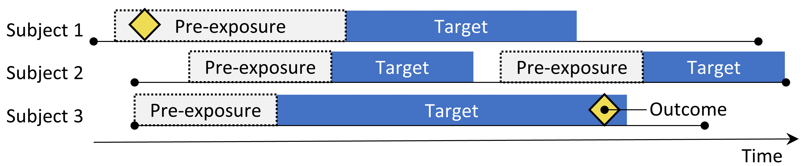
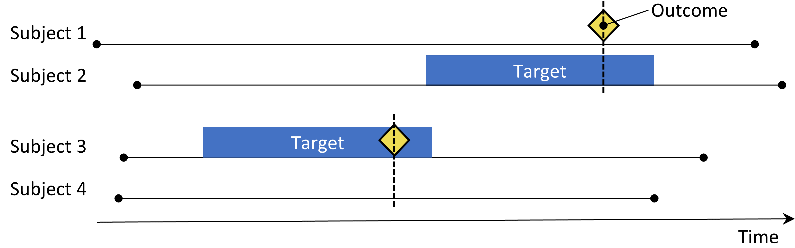
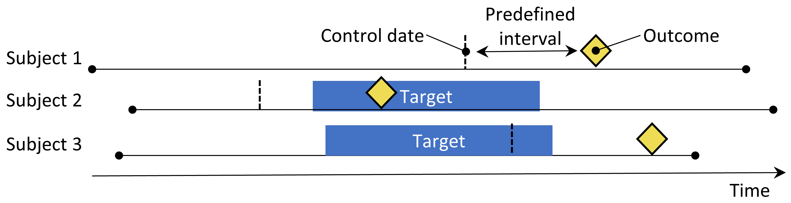
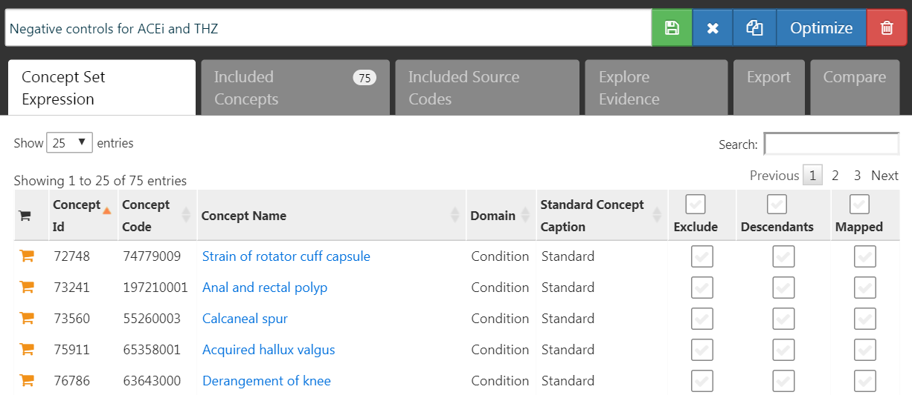

# 集団レベルの推定 {#PopulationLevelEstimation}

*著者: Martijn Schuemie, David Madigan, Marc Suchard & Patrick Ryan*

\index{集団レベルの推定}

保険請求データや電子的健康記録などの観察的な医療データは、治療の効果に関するリアルワールドのエビデンスを生成する機会を提供し、患者の生活を有意に改善することができます。本章では、特定の健康アウトカムに対する曝露（例えば、薬剤曝露や処置（プロシージャー）などの医療介入）の平均的な因果効果の推定を指す集団レベルの効果推定に焦点を当てます。以下では、2つの異なる推定タスクを検討します。：

-   **直接効果推定**: アウトカムのリスクに対する曝露の効果を、曝露なしと比較して推定する。 \index{直接効果推定}
-   **比較効果推定**: アウトカムのリスクに対する曝露（ターゲット曝露）の効果を、別の曝露（比較対照の曝露）と比較して推定する。 \index{比較効果推定}

いずれの場合でも、患者レベルの因果効果は事実のアウトカム、すなわち曝露を受けた患者に何が起こったかと、反事実のアウトカム、すなわち曝露がなかった場合（直接）や異なる曝露があった場合（比較）に何が起こったかを対比させます。各患者は事実のアウトカムのみを明らかにするため（因果推論の基本問題）、さまざまな効果推定デザインは異なる分析デバイスを用いて反事実のアウトカムを明らかにします。 \index{反事実}

集団レベルの効果推定のユースケースには、治療選択、安全性監視、および比較効果が含まれます。方法論は、特定の仮説を一度に1つずつテストすること（例：「シグナル評価」）や、複数の仮説を一度に探索すること（例：「シグナル検出」）ができます。いずれの場合も、目的は同じです：因果効果の高品質な推定を生成することです。 \index{安全性監視} \index{比較効果|see {比較効果推定}}

本章ではまず、[OHDSI Methods Library](https://ohdsi.github.io/MethodsLibrary/)としてRパッケージで実装されているさまざまな集団レベルの推定研究デザインについて説明します。次に、具体的な推定研究の設計を詳細に説明し、ATLASおよびRを使用してデザインを実装する手順ガイドを提供します。最後に、研究から生成されるさまざまな出力、包括的な研究診断と効果量の推定について確認します。

## コホートメソッドの設計 {#CohortMethod}

\index{コホートメソッド}

```{r cohortMethod, fig.cap='新規ユーザーコホートデザイン。ターゲット治療を開始した対象は比較対照治療を開始した対象と比較されます。2つの治療グループ間の違いを調整するために、傾向スコアによる層化、マッチング、重み付け、あるいはベースライン特性をアウトカムモデルに追加するなど、いくつかの調整戦略が使用されます。傾向スコアモデルまたはアウトカムモデルに含まれる特性は治療開始前に取得されます。',echo=FALSE, out.width='90%', fig.align='center'}
knitr::include_graphics("images/PopulationLevelEstimation/cohortMethod.png")
```

コホートメソッドはランダム化臨床試験を模倣することを試みます [@hernan_2016]。 ある治療（ターゲット）を開始した対象は別の治療（比較対照）を開始した対象と比較され、治療開始後の特定の期間、例えば治療を継続する期間にわたって追跡されます。コホート研究において私たちが答えたい問いは、表 \@ref(tab:cmChoices) にハイライトされた5つの選択を行うことで具体化されます。 \index{ターゲットコホート!コホートメソッド} \index{比較対照コホート} \index{アウトカムコホート!コホートメソッド}

| 選択 | 説明 |
|:---|:---|
| ターゲットコホート | 対象とする治療を代表するコホート |
| 比較対照コホート | 比較対照の治療を代表するコホート |
| アウトカムコホート | 対象とするアウトカムを代表するコホート |
| リスク期間 | どの時点で（通常はターゲットおよび比較対照コホートの開始および終了日）アウトカムのリスクを考慮するか |
| モデル | ターゲットと比較対照の間の違いを調整しながら効果を推定するために使用されるモデル |

: (#tab:cmChoices) 比較コホートデザインの主要なデザイン選択

モデルの選択には、他の要素の中でも、アウトカムモデルの種類が含まれます。例えば、ロジスティック回帰を使用することができ、これはアウトカムが発生したかどうかを評価し、オッズ比を生成します。ロジスティック回帰はリスク期間がターゲットと比較対照で同じ長さであるか、または関係がないと仮定します。あるいは、一定の発生率を仮定するポアソン回帰を選択することもできます。多くの場合、対象と比較対照の間で比例ハザードを仮定し、最初のアウトカムまでの時間を考慮してハザード比を推定するコックス回帰が使用されます。 \index{ロジスティック回帰} \index{ポアソン回帰} \index{コックス回帰} \index{コックス比例ハザードモデル|see {コックス回帰}}

```{block2, type='rmdimportant'}
新規ユーザーコホートメソッドは本質的に比較効果推定の方法であり、治療を比較対照と比較します。この方法を使用して治療対未治療を比較するのは難しいです。なぜなら、未曝露群と曝露群が比較可能となる群を定義するのが難しいからです。このデザインを直接的な効果推定に使用したい場合は、対象とする曝露に対する比較対照として、同じ適応症の治療を選択するのが望ましいです。ただし、必ずしもそのような比較対照が利用可能であるとは限りません。

```

重要な懸念事項は、ターゲット治療を受ける患者が比較対照治療を受ける患者と系統的に異なる可能性があることです。例えば、ターゲットコホートが平均60歳であり、比較対照コホートが平均40歳であるとします。年齢に関連する健康アウトカム（例：脳卒中）に関してターゲットと比較対照を比較する場合、コホート間で顕著な違いが見られるかもしれません。無知な研究者は、ターゲット治療と比較対照に比べて脳卒中の間に因果関係があると結論づけるかもしれません。もっと平凡な、あるいはありふれた結論として、ターゲット患者が脳卒中を経験したことが、比較対照を受けていたらそうならなかったであろうと結論づけるかもしれません。この結論は完全に間違っている可能性があります！おそらくこれらのターゲット患者は、ただ年を取っているだけで脳卒中が発生したかもしれません。治療を受けていたとしても同様であった可能性があります。この文脈では、年齢は「交絡因子」です。観察研究で交絡因子に対処する一つのメカニズムは傾向スコアを介することです。 \index{交絡因子}

### 傾向スコア

\index{傾向スコア}

ランダム化試験では、（仮想的な）コイントスが患者を各グループに割り当てます。したがって、デザインによって、患者がターゲット治療を受ける確率は患者の特性（例：年齢）とは無関係です。コインは患者を知りませんし、何よりも、曝露を受ける患者の確率は確実に分かっています。その結果、試験の患者数が増えるにつれて、両方のグループの患者はどのような患者特性においても系統的に異なることは基本的にありえません。この保証されたバランスは、試験で測定された特性（例：年齢）と試験で特定されなかった特性（例：患者の遺伝的要因）にも適用されます。 \index{ランダム化試験}

ある患者に対する*傾向スコア（PS）*は、その患者が比較対照群に対して対象治療をを受ける確率です [@rosenbaum_1983]。 バランスの取れたランダム化試験では、傾向スコアはすべての患者で0.5です。傾向スコアで補正された観察研究では、治療開始時とその前のデータに基づいて患者が対象治療を受ける確率を推定します（実際に受けた治療に関係なく）。これは単純な予測モデリングの応用です。ロジスティック回帰などのモデルを適合させ、患者が対象治療を受けるかどうかを予測し、各対象者の予測確率（PS）を生成するためにこのモデルを使用します。標準的なランダム化試験とは異なり、各患者は異なる確率で対象治療を受けることになります。PSは、PSが似たターゲット対象者と比較対照の対象者をマッチングする、PSに基づいて研究集団を層化する、PSから導き出された治療重み付けの逆確率（IPTW）を使うなど、いくつかの方法で使用できます。マッチングの場合、各対象者に対して一人の比較対照者だけを選択することも、一人以上の比較対照者を許容することもできます。これは可変比率マッチングと呼ばれる手法です [@rassen_2012]。 \index{傾向スコアモデル} \index{
傾向スコア!マッチング} \index{傾向スコア!層化} \index{傾向スコア!重み付け} \index{治療逆確率重みづけ (IPTW)|see {傾向スコア!重み付け}} \index{可変比率マッチング}

例えば、1対1のPSマッチングを使用し、ヤンが対象治療を受ける事前確率が0.4で、実際に対象治療を受けたとします。もし、対象治療を受ける事前確率が0.4で、実際には比較治療を受けた患者（ジュンと名付けます）を見つけることができれば、少なくとも測定された交絡因子に関しては、ヤンとジュンの結果の比較はミニ無作為化試験のようなものとなります。この比較により、無作為化で得られたものと同等のヤンとジュンの因果コントラストの推定値が得られます。推定は以下のように行われます。対象治療を受けた患者ごとに、比較対象治療を受けたが対象治療を受ける以前の確率が同じであった1人以上の適合患者を見つけます。対象患者のアウトカムと、これらの適合グループ内の比較対象患者のアウトカムを比較します。

傾向スコアは、測定された交絡因子を制御します。実際、測定された特性を考慮して治療割り当てが「無視できる」場合、傾向スコアは因果効果の偏りのない推定値を導きます。「無視できる」とは、本質的には、未測定の交絡因子が存在せず、測定された交絡因子が適切に調整されていることを意味します。残念ながら、これは検証可能な仮定ではありません。この問題に関するさらなる議論については、第 \@ref(MethodValidity) 章で説明します。 \index{強く無視できる}

### 変数選択 {#VariableSelection}

以前は、PSは手動で選択された特性に基づいて計算されていましたが、OHDSIツールはそのような実践をサポートする一方で、特定の曝露やアウトカムに基づいて選択されていない、より多くの汎用特性を使用することを好みます [@tian_2018] 。これらの特性には、人口統計学的特性に加え、治療開始前および当日に観察された診断、薬剤曝露、測定値、医療処置が含まれます。通常、モデルには10,000から100,000の固有の特性が含まれ、これらを大規模な正則化回帰 [@suchard_2013] を使用して適合させ、[Cyclops](https://ohdsi.github.io/Cyclops/)パッケージで実装します。本質的には、どの特性が治療割り当ての予測に関連するかをデータに決定させ、モデルに含めます。

```{block2, type='rmdimportant'}
通常、治療開始日の特性は治療の原因となる診断などの多くの関連データがその日に記録されているため、共変量捕捉のウィンドウに含まれるべきです。この日には、対象および比較対照の治療自体も記録されていますが、これらは傾向スコアモデルに含まれるべきではありません。なぜなら、私たちはまさにこれらを予測しようとしているからです。したがって、対象と比較対照治療は共変量セットから明示的に除外する必要があります。

```

「正しい」因果構造を特定する際に臨床的専門知識に依存しないデータ主導型の共変量選択アプローチは、いわゆる操作変数や共変変数を誤って含めるリスクがあり、その結果、分散が増加し、潜在的にバイアスがもたらされる可能性があるという意見もあります [@hernan_2002]。しかし、このような懸念は現実のシナリオでは大きな影響を与える可能性は低いでしょう[@schneeweiss_2018]。さらに、医学においては真の因果構造が判明することはほとんどなく、異なる研究者が特定の研究課題に対して「正しい」共変量を特定するように求められると、それぞれの研究者は必ず異なるリストを作成し、そのプロセスを再現不能にします。最も重要なのは、傾向スコアモデルの確認、すべての共変量のバランス評価、およびネガティブコントロールの組み込みなどの診断によって、コライダーや操作変数に関連するほとんどの問題を特定できることです。 \index{操作変数} \index{コライダー}

### キャリパー

\index{キャリパー}

傾向スコアは 0 から 1 の範囲で連続的に変化するため、厳密なマッチングはほとんど不可能です。その代わり、マッチングプロセスでは、「キャリパー」として知られるある程度の許容範囲内で、対象患者の傾向スコアに一致する患者を見つけます @austin_2011 に従い、ロジットスケールにおける標準偏差の0.2倍をデフォルトのキャリパーとして使用します。

### オーバーラップ：選好スコア

\index{選好スコア}

傾向スコア方法は一致する患者が存在することを必要とします。このため、主要な診断は二つのグループの傾向スコアの分布を示します。解釈を容易にするために、OHDSIツールは「選好スコア」[と呼ばれる傾向スコアの変換をプロットします\@walker](mailto:と呼ばれる傾向スコアの変換をプロットします@walker){.email}\_2013。選好スコアは二つの治療の「市場占有率」を調整します。例えば、10%の患者が対象治療を受け（90%の患者が比較対照治療を受ける）、選好スコアが0.5の患者は、対象治療を受ける確率が10%です。数学的には、選好スコアは

$$\ln\left(\frac{F}{1-F}\right)=\ln\left(\frac{S}{1-S}\right)-\ln\left(\frac{P}{1-P}\right)$$

ここで $F$ は選好スコア、$S$ は傾向スコア、$P$ は対象治療を受ける患者の割合です。

@walker_2013 は「経験的均衡」の概念を述べています。彼らは、少なくとも半数の曝露が選好スコアの0.3から0.7の間にある場合、これらの曝露ペアを経験的均衡にあると見なします。 \index{臨床的均衡}

### バランス

\index{共変量のバランス} \index{バランス|see {共変量のバランス}}

優れた実践では常にPS調整がバランスの取れた患者群を生成するかどうかをチェックします。図 \@ref(fig:balance)はバランスをチェックするための標準的なOHDSI出力を示しています。各患者特性について、曝露グループ間の平均の標準化差をPS調整前後でプロットします。いくつかのガイドラインは、PS調整後の標準化差の上限を0.1とすることを推奨しています [@rubin_2001]。

## 自己対照コホートデザイン

\index{自己対照コホートデザイン}

```{r scc, fig.cap='自己対照コホートデザイン。対象への曝露中のアウトカムの発生率を曝露前の期間中の発生率と比較します。',echo=FALSE, out.width='90%', fig.align='center', fig.pos='h'}

```

自己対照コホート（SCC）デザイン [@ryan_2013] は曝露中のアウトカムの発生率を、曝露直前の期間におけるアウトカムの発生率と比較します。表 \@ref(tab:sccChoices) に示す4つの選択肢が、自己対照コホートの問いを定義します。 \index{ターゲットコホート!自己対照コホートデザイン} \index{アウトカムコホート!自己対照コホートデザイン}

```{r sccChoices, echo=FALSE}
table <- read.table(header = TRUE, sep = "|", stringsAsFactors = FALSE, strip.white = TRUE, text = "
| 選択              | 説明                                             |
|:----------------- |:-------------------------------------------------------- |
| 対象コホート| 治療を表すコホート                                       |
| アウトカムコホート| 対象とするアウトカムを表すコホート                             |
| リスク時間        | アウトカムのリスクをどのタイミング（通常対象コホートの開始および終了日が基準）で考慮するか？     |
| 対照時間          | 対照時間として使用される期間                   |
")
table <- table[-1, 2:(ncol(table) - 1), -1]
table <- knitr::kable(table, caption = "自己対照コホートデザインの主要なデザイン選択肢", booktabs = TRUE, row.names = FALSE)
if ( knitr:::is_latex_output()) {
  table <- kableExtra::kable_styling(table, full_width = FALSE)
  table <- kableExtra::column_spec(table, 2, width = "9cm")
}
table
```

曝露群を構成する同じ対象者が対照群としても使用されるため、対象者間の差異を調整する必要はありません。ただし、この方法は、異なる期間間におけるアウ トカムのベースラインリスクの差異など、その他の違いには脆弱です。

## 症例対照デザイン

\index{症例対照デザイン}

```{r caseControl, fig.cap='症例対照デザイン。アウトカムを持つ対象者（「症例」）は、アウトカムを持たない対象者（「対照」）との曝露状況の観点から比較されます。通常、症例と対照は年齢や性別などの様々な特性で一致するようにします。',echo=FALSE, out.width='90%', fig.align='center', fig.pos='h'}

```

症例対照研究 [@vandenbroucke_2012] は、「特定の疾患のアウトカムを持つ人が、その疾患を持たない人よりも特定の因子により曝露される頻度が高いかどうか」を検討します。このため、中心となる考え方は、対象とするアウトカムを経験した対象者（「症例」）を、対象とするアウトカムを経験していない対象者（「対照」）と比較することです。表 \@ref(tab:ccChoices) の選択肢が、症例対照の問いを定義しています。\index{アウトカムコホート!症例対照デザイン} \index{ターゲットコホート!症例対照デザイン} \index{ネスティングコホート!症例対照デザイン}

```{r ccChoices, echo=FALSE}
table <- read.table(header = TRUE, sep = "|", stringsAsFactors = FALSE, strip.white = TRUE, text = "
| 選択              | 説明                                               |
|:----------------- |:--------------------------------------------------------- |
| アウトカムコホート| 症例（対象とするアウトカム）を表すコホート                        |
| 対照コホート      | 対照を表すコホート。通常、選択ロジックを使用してアウトカムコホートから自動的に導出される   |
| 対象コホート| 治療を表すコホート                                         |
| ネスティングコホート| 任意で症例および対照が抽出されるサブポピュレーションを定義するコホートを指定           |
| リスク時間        | 曝露状況をどのタイミング（通常、インデックス日が基準）で考慮するか？                   |
")
table <- table[-1, 2:(ncol(table) - 1), -1]
table <- knitr::kable(table, caption = "症例対照デザインの主要なデザイン選択オプション", booktabs = TRUE, row.names = FALSE)
if ( knitr:::is_latex_output()) {
  table <- kableExtra::kable_styling(table, full_width = FALSE)
  table <- kableExtra::column_spec(table, 2, width = "9cm")
}
table
```

通常、症例を年齢や性別などの特性で一致させて対照を選択し、症例と対照を比較しやすくします。もう1つの広く行われている方法は、対象とする曝露のいずれかの適応症と診断されたすべての人々など、特定のサブグループに分けて分析を行うことです。

## ケース・クロスオーバーデザイン

\index{ケース・クロスオーバーデザイン}

```{r caseCrossover, fig.cap='ケース・クロスオーバーデザイン。アウトカムの周りの時間を、アウトカムの日付より前の事前に決められた間隔のコントロール日と比較します。',echo=FALSE, out.width='90%', fig.align='center', fig.pos='h'}

```

ケース・クロスオーバー [@maclure_1991] デザインは、アウトカムのタイミングでの曝露率が、アウトカムよりも前の事前に決められた日数での曝露率と異なるかどうかを評価します。これは、アウトカムが発生した日に特別な理由があるかどうかを判断しようとするものです。表 \@ref(tab:ccrChoices) は、ケース・クロスオーバーの質問を定義するオプションを示します。 \index{アウトカムコホート!ケース・クロスオーバーデザイン} \index{ターゲットコホート!ケース・クロスオーバーデザイン}

```{r ccrChoices, echo=FALSE}
table <- read.table(header = TRUE, sep = "|", stringsAsFactors = FALSE, strip.white = TRUE, text = "
| 選択              | 説明                                           |
|:----------------- |:------------------------------------------------------|
| アウトカムコホート| 症例（対象とするアウトカム）を表すコホート                   |
| 対象コホート| 治療を表すコホート                                    |
| リスク時間        | 曝露状況をどのタイミング（通常インデックス日が基準）で考慮するか                   |
| 対照時間          | 対照時間として使用される期間                |
")
table <- table[-1, 2:(ncol(table) - 1), -1]
table <- knitr::kable(table, caption = "ケース・クロスオーバーデザインの主要なデザインオプション", booktabs = TRUE, row.names = FALSE)
if ( knitr:::is_latex_output()) {
  table <- kableExtra::kable_styling(table, full_width = FALSE)
  table <- kableExtra::column_spec(table, 2, width = "9cm")
}
table
```

症例は自分自身が対照として機能します。自己対照デザインであるため、個人間の差異による交絡に対して頑健であるはずです。ただし、アウトカムの日付が常に対照の日付よりも後であるため、曝露の全体的な頻度が時間とともに増加する（または減少する）場合には、この方法がポジティブにバイアスを受ける可能性があります。この問題に対処するために、ケース-タイム-コントロールデザイン [@suissa_1995] が開発され、例えば年齢や性別で一致させた対照をケース・クロスオーバーデザインに追加して、曝露のトレンドを調整します。\index{ケース-タイム-コントロールデザイン}

## 自己対照症例シリーズデザイン

\index{自己対照症例シリーズ(SCCS)デザイン}

```{r selfControlledCaseSeries, fig.cap='自己対照症例シリーズデザイン。曝露期間中のアウトカム発生率と非曝露期間中のアウトカム発生率を比較する。',echo=FALSE, out.width='90%', fig.align='center', fig.pos='h'}
knitr::include_graphics("images/PopulationLevelEstimation/selfControlledCaseSeries.png")
```

自己対照症例シリーズ（SCCS）デザイン [@farrington_1995; @whitaker_2006] は、曝露期間中のアウトカム発生率を、曝露前、曝露中、曝露後のすべての非曝露期間中の発生率と比較します。これは、個人に依存したポアソン回帰であり、「患者がアウトカムを有する場合、曝露期間中の方が非曝露期間中よりもアウトカムが発生しやすいか？」という問い対する答えを導きだそうとします。表 \@ref(tab:sccsChoices)のオプションは SCCS の問いを定義しています。 \index{アウトカムコホート!自己対照症例シリーズデザイン} \index{ターゲットコホート!自己対照症例シリーズデザイン}

```{r sccsChoices, echo=FALSE}
table <- read.table(header = TRUE, sep = "|", stringsAsFactors = FALSE, strip.white = TRUE, text = "
| 選択              | 説明                                                  |
|:----------------- |:------------------------------------------------------ |
| 対象コホート | 治療を代表するコホート                                |
| アウトカムコホート | 対象とするアウトカムを代表するコホート                |
| リスク期間         | どの時点（多くの場合、対象コホートの開始日または終了日と関連のある時点）でアウトカムのリスクを考慮するか？ |
| モデル            | 時間変動する交絡因子の調整を含む効果の推定モデル        |
")
table <- table[-1,2:(ncol(table)-1), -1]
table <- knitr::kable(table, caption = "自己対照症例シリーズデザインの主なデザインオプション", booktabs = TRUE, row.names = FALSE)
if (knitr:::is_latex_output()) {
  table <- kableExtra::kable_styling(table, full_width = FALSE)
  table <- kableExtra::column_spec(table, 2, width = "9cm")
}
table
```

他の自己対照デザインと同様に、SCCS は個人間の差異による交絡に対して頑健ですが、時間変動する影響による交絡には脆弱です。これらを考慮するためのいくつかの調整が可能であり、たとえば年齢や季節を含めることができます。SCCSの特別なバリアントでは、対象とする曝露だけでなく、データベースに記録された他の薬剤すべての曝露を含める [@simpson_2013]ことで、モデルに数千の追加変数が追加されます。この場合、対象とする曝露以外のすべての曝露の係数に、正則化ハイパーパラメータをクロスバリデーションで選択するL1正則化が適用されます。

SCCSの重要な仮定の一つは、観察期間の終了がアウトカムの日付とは独立していることです。一部のアウトカム、特に心筋梗塞などの致命的なアウトカムにおいては、この仮定が当てはまらないことがあります。SCCSの拡張版が開発されており、このような依存関係を修正できるものがあります [@farrington_2011]。

## 高血圧症研究のデザイン

### 問題の定義

ACE 阻害薬（ACEi）は、高血圧症や虚血性心疾患を持つ患者、特にうっ血性心不全、糖尿病、慢性腎臓病などの併存疾患を持つ患者によく使用されます [@zaman_2002]。血管性浮腫は、唇、舌、口、喉頭、咽頭、または眼窩周囲の腫れとして現れる、深刻で時には命に関わる有害事象であり、これらの薬剤の使用と関連付けられています [@sabroe_1997]。しかし、これらの薬剤使用に関連する血管性浮腫の絶対および相対リスクについての情報は限られています。既存のエビデンスは、主に特定のコホート（例えば、主に男性の退役軍人やメディケイド受給者）に基づいたものであり、他の集団に一般化できない可能性があります。また、イベント数が少ない研究に基づくものであり、不安定なリスク推定しかえられません [@powers_2012]。いくつかの観察研究は、ACEiをβ遮断薬と比較して血管性浮腫のリスクを評価しています [@magid_2010; @toh_2012]が、β遮断薬はもはや高血圧症の第一選択治療役としては推奨されていません [@whelton_2018]。代替治療法として有効なのは、サイアザイドおよびサイアザイド様利尿薬（THZ）が考えられます。これらは高血圧症や急性心筋梗塞（AMI）などの関連リスクを管理する上で同等に有効であり、血管性浮腫のリスクを増加させない可能性があります。

以下では、観察医療データに集団レベル推定フレームワークを適用し、次の比較推定に関する疑問に対処する方法を示します：

> ACE阻害薬の新規使用者とサイアザイドおよびサイアザイド様利尿薬の新規使用者を比較した場合の血管性浮腫のリスクはどれくらいですか？

> ACE阻害薬の新規使用者とサイアザイドおよびサイアザイド様利尿薬の新規使用者を比較した場合の急性心筋梗塞のリスクはどれくらいですか？

これらは比較効果推定の問題であるため、セクション \@ref (CohortMethod) で説明されたコホート方法を適用します。

### 対象および比較対照

高血圧症に対する最初の治療が、ACEi または THZ クラスのいずれかの有効成分による単剤療法であった患者を、新規患者と見なします。治療開始後7日以内に他の抗高血圧薬を開始しない患者を単剤療法と定義します。患者は最初の曝露前に少なくとも1年間の継続的な観察期間および治療開始前１年以内に高血圧症と診断された記録が必要です。

### アウトカム

血管性浮腫は、入院または救急外来（ER）訪問中の血管性浮腫のコンセプトに該当するコンディションが発生した場合と定義し、その7日前までには血管性浮腫の診断が記録されていないことを必要とします。AMIは、入院またはER訪問中のAMIコンディションコンセプトの発生として定義し、180日前までにAMI診断が記録されていないことを必要とします。

### リスク期間

リスク期間を治療開始の翌日から開始し、曝露が終了するまでと定義し、後続の薬剤曝露の間に30日間のギャップを許容します。

### モデル

デフォルトの共変量セットを使用してPSモデルを適合させます。このセットには、人口統計、病状、薬剤、処置、測定値、観察、いくつかの併存疾患スコアが含まれます。ACEiとTHZを共変量から除外します。変数比率マッチングを行い、マッチングセットに条件付けてコックス回帰を行います。

### 研究要約

| 選択肢 | 値 |
|:---|:---|
| 対象コホート | 高血圧症の第一選択単剤療法としてのACE阻害薬の新規使用者。 |
| 比較コホート | 高血圧症の第一選択単剤療法としてのサイアザイドおよびサイアザイド様利尿薬の新規使用者。 |
| アウトカムコホート | 血管性浮腫または急性心筋梗塞。 |
| リスク期間 | 治療開始の翌日から開始し、曝露が終了するまで。 |
| モデル | 変数比率マッチングを用いたコックス比例ハザードモデル。 |

: (#tab:aceChoices) 比較コホート研究の主なデザインオプション

### コントロールクエスチョン

研究デザインが真実に沿った推定を生成するかどうかを評価するために、真の効果量が既知であるコントロールクエスチョンのセットを追加で含めます。コントロールクエスチョンは、ハザード比が1であるネガティブコントロールと、ハザード比が1より大きいことが既知であるポジティブコントロールに分けることができます。いくつかの理由により、実際のネガティブコントロールを使用し、これらのネガティブコントロールに基づいてポジティブコントロールを合成します。コントロールクエスチョンの定義と使用方法については、第 \@ref(MethodValidity) 章で説明しています。

## ATLASを使用した研究の実施 {#PleAtlas}

ここでは、ATLASの推定機能を使用してこの研究を実施する方法を示します。ATLASの左側のバーで  をクリックし、新しい推定研究を作成します。研究に簡単に分かりやすい名前を付けてください。研究デザインは  ボタンをクリックして保存できます。

推定デザイン機能には、比較、分析設定、評価設定の3つのセクションがあります。複数の比較と複数の分析設定を指定でき、ATLASはそれらのすべての組み合わせを個別の分析として実行します。ここでは、それぞれのセクションについて説明します。

### 比較コホート設定 {#ComparisonSettings}

研究には1つ以上の比較を含めることができます。「比較を追加」をクリックすると、新しいダイアログが開きます。  をクリックしてターゲットおよび比較コホートを選択します。「Add Outcome」をクリックして2つのアウトカムコホートを追加できます。コホートがすでにATLASで作成されていると仮定しています（第 \@ref(Cohorts) 章を参照）。ターゲット（付録 \@ref(AceInhibitorsMono)）、比較（付録 \@ref(ThiazidesMono)）、アウトカム（付録 \@ref(Angioedema）、付録 \@ref(Ami)）コホートの完全な定義は付録に記載されています。完了すると、ダイアログは図 \@ref(fig:comparisons)のようになります。

```{r comparisons, fig.cap='比較ダイアログ',echo=FALSE, out.width='100%', fig.align='center'}

```

対象と比較コホートのペアに対して複数のアウトカムを選択できることに注意ください。各アウトカムは独立したものとして扱われ、別々の分析結果が得られます。

#### ネガティブコントロールアウトカム {.unnumbered}

ネガティブコントロールのアウトカムは、対象または比較対照によって引き起こされていないと考えられるアウトカムであり、真のハザード比が1であると仮定されます。理想的には各アウトカムコホートの適切なコホート定義が必要ですが、通常は各ネガティブコントロールのアウトカムごとに1つのコンセプトセットと、それらをアウトカムコホートに変換するための標準的なロジックしか持ちません。ここではコンセプトセットが第 \@ref(MethodValidity) 章で説明されているとおり、すでに作成されていると仮定し、それを選択するだけです。ネガティブコントロールのコンセプトセットには、ネガティブコントロールごとに1つのコンセプトが含まれ、その下位層に含まれるものは含めるべきではありません。図 \@ref(fig:ncConceptSet) は、この研究に使用されたネガティブコントロールのコンセプトセットを示しています。

```{r ncConceptSet, fig.cap='ネガティブコントロールのコンセプトセット',echo=FALSE, out.width='100%', fig.align='center'}

```

#### 含めるコンセプト {.unnumbered}

コンセプトを選択する際、生成したい共変量を指定できます。たとえば、傾向スコアモデルで使用するためです。ここで共変量を指定すると、それ以外の共変量（指定したもの以外）は除外されます。通常、ベースラインのすべての共変量を含め、正則化回帰モデルがすべての共変量をバランスさせるモデルを構築します。特定の共変量を指定する唯一の理由は、手動で共変量を選択した既存の研究を再現する場合です。これらの項目は、この比較セクションまたは分析セクションで指定できます。その理由は、特定の比較に関連する場合（たとえば、比較における既知の交絡因子）、または特定の共変量選択戦略を評価する場合など、分析に関連する場合があるからです。

#### 除外するコンセプト {.unnumbered}

含めるコンセプトを指定する代わりに、*除外*するコンセプトを指定することもできます。このフィールドにコンセプトセットを送信すると、送信したコンセプトを除くすべての共変量を使用します。デフォルトの共変量セット（治療開始日のすべての薬剤および処置を含む）を使用する場合、対象の治療と比較治療、およびそれらに直接関連するコンセプトを除外する必要があります。たとえば、対象とする曝露が注射薬である場合、薬剤だけでなく、プロペンシティモデルからその投与手技も除外する必要があります。この例では、除外したい共変量はACEiとTHZです。図 \@ref(fig:covsToExclude) は、これらのコンセプトを含むコンセプトセットを示しています（その下位層も含まれます）。

```{r covsToExclude, fig.cap='除外するコンセプトを定義するコンセプトセット',echo=FALSE, out.width='100%', fig.align='center'}
knitr::include_graphics("images/PopulationLevelEstimation/covsToExclude.png")
```

ネガティブコントロールと除外する共変量を選択した後、比較ダイアログの下半分は図 \@ref(fig:comparisons2) のようになります。

```{r comparisons2, fig.cap='ネガティブコントロールおよび除外するコンセプトセットを示す比較ウィンドウ',echo=FALSE, out.width='100%', fig.align='center'}
knitr::include_graphics("images/PopulationLevelEstimation/comparisons2.png")
```

### 効果推定の分析設定

比較ダイアログを閉じた後、「Add Analysis Settings」をクリックできます。「Analysis Name」とラベル付けされたボックスには、今後、簡単に検索・参照できるよう固有の名前を入力します。たとえば、「傾向スコアマッチング」という名前を設定することもできます。

#### 研究対象集団 {.unnumbered}

分析の対象となる対象者の集合である研究対象集団を指定するには、さまざまなオプションがあります。オプションの多くは、コホート定義ツールで対象および比較コホートを設計する際に利用可能なオプションと重複しています。Estimationのオプションを使用する理由の1つは再利用性です。ターゲット、比較、アウトカムコホートを完全に独立して定義し、後でそれらの間に依存関係を追加できます。例えば、治療開始前にアウトカムを持っていた人を除外したい場合、対象および比較コホートの定義でこれを行うことができますが、すべてのアウトカムごとに別のコホートを作成する必要があります。代わりに、分析設定で事前のアウトカムを持つ人々を除外することができ、これで興味のある2つのアウトカム（およびネガティブコントロールのアウトカム）に対して、対象および比較コホートを再利用できます。

**研究開始日と終了日**を使用して、特定の期間に分析を制限できます。研究終了日はリスクウィンドウを切り詰めることになり、研究終了日以降のアウトカムは考慮されません。研究開始日を選択する理由の1つは、研究対象の薬剤の1つが新しく、以前の期間には存在しなかったことが考えられます。自動で調整するには、「両方の曝露がデータ内に存在する期間に分析を制限しますか？」の質問に「はい」と回答します。研究の開始日と終了日を調整するもう一つの理由は、医療行為が時とともに変化した（例えば、薬の警告による）場合で、特定の方法で医療行為が行われた期間のみに興味がある場合です。

オプション「**Should only the first exposure per subject be included? (各対象者の初回の曝露のみを含まれるべきか)**」を使用すると、患者ごとの最初の曝露に限定することができます。多くの場合、この例のようにコホート定義ですでに行われています。同様に、「**The minimum required continuous observation time prior to index date for a person to be included in the cohort (コホートに含める対象者のインデックス日付以前の最小限必要な連続観察期間)**」 というオプションは、コホート定義ですでに設定されていることが多いので、ここでは0のままにしておきます。インデックス日より前に観察時間がある(OBSERVATION_PERIODテーブルで定義されているように）ことは、傾向スコアを計算するのに十分な患者に関する情報があること、また患者が真の新規ユーザーであり、したがって以前に曝露されていないことを担保するためにもよく使われます。

「**Remove subjects that are in both target and comparator cohort? (対象コホートと比較群コホートの両方に含まれる対象を除外しますか)**」は、「**If a subject is in multiple cohorts, should be censored time-at-risk when the new time-at-risk starts to prevent overlap? (対象が複数のコホートに含まれる場合、新しいリスク評価期間が開始された際に、重複を避けるためにリスク評価期間を打ち切りますか)**」というオプションと併せて、対象が対象コホートと比較コホートの両方に存在する場合にどのように取り扱うかを定義します。最初の設定には3つの選択肢があります：

-   「**Keep All** (すべて保持)」 は、両方のコホートに対象を保持することを意味します。このオプションでは、対象者とアウトカムがダブルカウントされる可能性があります。

-   「**Keep First** (最初を保持)」 は、最初に発生したコホートに対象者を残すことを意味します。

-   「**Remove All** (すべて除外)」 は、すべてのコホートから対象者を除外することを意味します。

もし「Keep All」または「Keep First」のオプションが選択された場合、ある対象が両方のコホートにいる時間を打ち切りたいと思うかもしれません。これを図 \@ref(fig:tar) に示します。デフォルトでは、リスク期間はコホートの開始日と終了日を基準に定義されます。この例では、リスク期間はコホート組入れの1日後に始まり、コホート終了までです。2つのコホートが重なる可能性があるリスク期間を打ち切らない場合、この重複したリスク期間に発生したアウトカムは、特に、すべてを保持することを選択した場合、（ここに示されているように）重複した時間に出現したアウトカムは2回カウントされるため、問題となります。打ち切りを選択した場合、最初のコホートのリスク期間は、2番目のコホートのリスク時間の開始時に終了します。

```{r tar, fig.cap='リスク時間（Time-at-risk (TAR)）が薬剤曝露開始日から薬剤曝露終了時までと仮定した場合の2つのコホートに含まれる対象のリスク期間',echo=FALSE, out.width='90%', fig.align='center'}
knitr::include_graphics("images/PopulationLevelEstimation/tar.png")
```

アウトカムの2回目の出現は1回目の継続であることが多いため、**リスクウインドウが始まる前にアウトカムが出現した対象を除外する**ことを選択できます。例えば、ある人が心不全を発症した場合、2回目の心不全の出現はよくあることでしょう、なぜなら1回目と2回目の心不全の間でその心不全は完全に治癒することがなかったということになるからです。一方、いくつかのアウトカムは間欠的なもので、上気道感染症のように、患者が複数の独立したアウトカムを持つことが予想されます。以前にそのアウトカムを経験した人を除外する場合、**以前にアウトカムが出現したことを同定する際に何日前まで遡る**かを選択できます。

、図 \@ref(fig:studyPopulation) に、この研究例における選択を示します。対象コホートと比較対照コホートの定義は、すでに初回曝露に限定しており、治療開始前の観察時間が必要なので、ここではこれらの基準は適用しません。

```{r studyPopulation, fig.cap='研究対象集団の設定',echo=FALSE, out.width='100%', fig.align='center'}
knitr::include_graphics("images/PopulationLevelEstimation/studyPopulation.png")
```

#### 共変量の設定 {.unnumbered}

ここでは構築する共変量を指定します。これらの共変量は通常、傾向スコアモデルで使用されますが、アウトカムモデル（この場合はCox比例ハザードモデル）にも含めることもできます。**click to view details (詳細を見るにはここをクリック)**をクリックすると、どの共変量の組み合わせを使用するか、選択することが出来ます。しかし、人口統計学的要素、コンディションすべて、薬剤、処置、測定値などを含むデフォルト

**include (組入れ)**および/または**exclude (除外)**するコンセプトを指定することで、共変量のセットを変更できます。これらの設定は、セクション \@ref(ComparisonSettings) にある比較のための設定と同じです。これらの設定が2つの場所にある理由は、これらの設定が特定の比較に関連している場合があるためです。特定の比較に対して特定の分析設定を使用して分析を実行する場合、OHDSIツールはこれらのセットの共通部分を使用します。

図 \@ref(fig:covariateSettings) は、この研究で選択した内容を示しています。図 \@ref(fig:comparisons2) に定義するように、比較の設定で除外するコンセプトに下位層を追加することを選択していることに注意ください。

```{r covariateSettings, fig.cap='共変量の設定',echo=FALSE, out.width='100%', fig.align='center'}
knitr::include_graphics("images/PopulationLevelEstimation/covariateSettings.png")
```

#### リスク期間 {.unnumbered}

リスク期間（Time-at-risk）は、対象コホートや比較コホートにおける開始日と終了日を基準に定義されます。例では、対象集団の開始日を治療開始日とし、終了日を曝露が停止した日（少なくとも30日間）としました。 リスクにさらされている期間の開始日を、対象集団の開始日の翌日、つまり治療開始日の翌日としました。コホート開始日よりも後の時点をリスク期間開始日とする理由は、生物学的にはその薬剤が原因である可能性が低いと考える場合、治療開始日に発生したアウトカム事象を除外したい場合があるからです。

リスク期間の終了日は、コホートの終了日、つまり曝露が停止した時点としました。例えば、治療終了直後の事象が依然として曝露に起因すると考えられる場合は、終了日を遅く設定することもできます。極端な例では、コホート終了日の後、長い日数を経て（例えば99999日）リスク期間の終了日に設定することもできます。このようなデザインは*intent-to-treat*デザインと呼ばれることもあります。

リスク時間がゼロの患者は何の情報も提供しないので、**最小リスク日数**は通常1日に設定されます。副作用の潜伏期間がわかっている場合は、より意味のある発生割合を得るため、この日数を増やすことができます。また、比較するランダム化試験に近いコホートを作成するために使用することもできます（例えば、ランダム化試験のすべての患者が少なくともN日間観察された）。

```{block2, type='rmdimportant'}
コホート研究を計画する際の鉄則は、バイアスが含まれる可能性を排除するため、コホート開始日以降の情報を研究集団の定義に使用しないことです。例えば、全対象者に少なくとも1年間のリスク期間を要求した場合、解析対象は、治療に十分耐えられる人に限定することになります。そのため、この設定は細心の注意を払って行う必要があります。
```

```{r timeAtRisk, fig.cap='リスク期間の設定',echo=FALSE, out.width='100%', fig.align='center'}
knitr::include_graphics("images/PopulationLevelEstimation/timeAtRisk.png")
```

#### 傾向スコアによる調整 {.unnumbered}

傾向スコア値が極端な人を除外して、研究対象集団を**トリミングする**ことができます。上位と下位の何パーセントを除外するか、または選好スコアが指定した範囲から外れる対象を除外するかを選択できます。コホートのトリミングは、一般的に推奨されません。なぜなら、観察を破棄する必要があり、統計的パワーが低下するからです。IPTWを使用する場合など、一部のケースではトリミングが望ましい場合があります。\index{傾向スコア!トリミング}

トリミングに加えて、またはトリミングの代わりに、傾向スコアで**層別化**または**マッチング**を選択することができます。層別化する場合は、**層数**と、対象集団、比較対象集団、研究対象集団全体のいずれに基づいて層を選択するかを指定する必要があります。マッチングの際には、**比較対照群から対象群の各人にマッチさせる最大人数**を指定する必要があります。典型的な値は、1対1のマッチングの場合は1、変数比率マッチングの場合は大きな数（例えば100）になります。また、**キャリパー**、すなわちマッチングする傾向スコア間の最大許容差を指定する必要があります。キャリパーは差の**キャリパー・スケール**で定義できます：\index{キャリパー!スケール}

-   **傾向スコア尺度**：傾向スコアそのもの

-   **標準化尺度**：傾向スコア分布の標準偏差による

-   **標準化ロジット尺度**：傾向スコアをより正規分布に近づけた後のプロスペクティブ・スコア分布の標準偏差。

疑問がある場合は、デフォルト値を使用するか、 [このトピックに関する\@austin](mailto:このトピックに関する@austin){.email}\_2011 の研究を参照ください。

大規模な傾向スコアモデルの適合は計算コストがかかることがあるので、モデルの適合に使用するデータをデータのサンプルだけに制限することが望ましい場合があります。デフォルトでは、対象コホートと比較対照コホートの最大サイズは250,000に設定されています。ほとんどの研究では、この上限に達することはありません。また、データが多ければ多いほど、より良いモデルになることもまずありません。データのサンプルはモデルのフィットに適合させることはできますが、そのモデルは集団全体の傾向スコアを計算するために使用されることに注意してください。

**Test each covariate for correlation with the target assignment? (各共変量とターゲットの割付の相関を検定しますか。)** 共変量が異常に高い相関（正または負）を持つ場合、エラーが発生します。これにより、完全に分離していることが判明するまで、傾向モデルの計算が長時間行われることを避けることができます。非常に高い単変量相関が見つかった場合は、その共変量を検証し、相関が高い理由と削除すべきかどうかを判断できます。

**Use regularization when fitting the model? (モデルを適合する際に正則化しますか。)** 標準的な手順では、傾向モデルに多くの共変量（通常10,000以上）を含めます。このようなモデルを適合させるには何らかの正則化が必要です。少数の厳選された共変量のみが含まれる場合は、正則化なしでモデルを適合させることも可能です。

図 \@ref(fig:psSettings) は、この研究での選択を示しています。最大マッチング人数を100人に設定することで、可変比率マッチングを選択していることに注意してください。

```{r psSettings, fig.cap='傾向スコアによる調整の設定',echo=FALSE, out.width='100%', fig.align='center'}

```

#### アウトカムモデルの設定 {.unnumbered}

最初に、**対象コホートと比較コホート間のアウトカムの相対リスクを推定するために使用する統計モデルを指定する**必要があります。セクション \@ref(CohortMethod) で簡単に述べたように、Cox、Poisson、ロジスティック回帰から選択できます。この例では、打ち切りの可能性がある最初のイベントまでの時間を考慮するCox比例ハザード・モデルを選択します。次に、回帰を**層で条件付けるかどうか**を指定する必要があります。条件づけを理解する1つの方法は、各層で別々の推定値が生成され、そして層で結合されること考えることです。1対1のマッチングでは、これは不要で、むしろ検出力を失うことになります。層別マッチングや可変比率マッチングでは必要です。\index{条件付きモデル} \index{層別モデル| {条件付きモデル}}

また、**共変量をアウトカムモデル**に追加して分析を調整することもできます。これは傾向モデルを使うことに加えて、または代わりに行うことができます。しかし、傾向モデルに適合させるのに十分なデータが通常は存在し、両方の治療グループに多くの人が含まれる一方で、結果モデルに適合させるのに十分なデータは通常はほとんど存在せず、結果を持つ人はわずかしかいません。そのため、結果モデルはできるだけシンプルに保ち、追加の共変量を含めないことをお勧めします。

傾向スコアで層別化またはマッチングする代わりに、**逆確率重み付け (IPTW)**を用いることもできます。

アウトカムモデルにすべての共変量を含めることを選択した場合、共変量が多ければ、モデルを適合させるときに正則化を使用することが理にかなっているかもしれません。不偏推定を可能にするために、治療変数には正則化は適用されないことに注意してください。

図 \@ref(fig:outcomeModelSettings) は、この研究での選択を示しています。可変比率マッチングを用いているため、回帰モデルでは層別条件付けをしなければなりません（マッチしたセットによって）。

```{r outcomeModelSettings, fig.cap='アウトカムモデルの設定',echo=FALSE, out.width='100%', fig.align='center'}
knitr::include_graphics("images/PopulationLevelEstimation/outcomeModelSettings.png")
```

### 評価の設定 {#evaluationSettings}

第 \@ref(MethodValidity) 章にあるように、ネガティブコントロールとポジティブコントロールを検討し、操作特性を評価し、経験的キャリブレーションを行う必要があります。

#### ネガティブコントロールのアウトカムコホートの定義 {.unnumbered}

セクション \@ref(ComparisonSettings) では、ネガティブコントロールのアウトカムを表すコンセプトセットを選択しました。しかし、分析でアウトカムとして使用するために、コンセプトをコホートに変換するロジックが必要です。ATLASは3つの選択肢を持つ標準ロジックを提供します。最初の選択肢は、**コンセプトのすべての出現**を使用するか、**最初の出現**のみを使用するかです。2番目の選択肢は、**下位層のコンセプトの出現を考慮するかどうか**を決定します。例えば、下位層の「ingrown nail of foot (足の陥入爪)」の出現も、上位層の「ingrown nail (陥入爪)」の出現として数えることができます。3番目の選択肢は、コンセプトを探すときにどのドメインを考慮するかを指定します。

```{r ncSettings, fig.cap='ネガティブコントロールのアウトカムコホートの定義の設定',echo=FALSE, out.width='100%', fig.align='center'}

```

#### ポジティブコントロールの合成 {.unnumbered}

ネガティブコントロールに加えて、因果関係があると思われる曝露-アウトカムのペアで、効果量が既知であるポジティブコントロールも含めることができます。様々な理由から、実際のポジティブコントロールには問題があるため、代わりに、第 \@ref(MethodValidity) 章で説明したように、ネガティブコントロールから得られる合成ポジティブコントロールを用いることがあります。**ポジティブコントロールの合成を行う**かどうかを選択できます。もし 「はい」であれば、**モデル・タイプ**を選択しなければなりませんが、現在の選択は「Poisson」と 「survival」です。集団レベルの推定の研究では生存（Cox）モデルを使用するので、「survival」を選択します。ポジティブコントロール合成のためのリスク期間モデルを推定の設定と同じになるように定義し、同じく、**曝露前に最低限必要な連続した観察期間**、**最初の曝露のみを含めるべきか**、**最初のアウトカムのみを含めるべきか**、および**過去にアウトカムを持つ人を除外する**の選択肢を模倣します。図 \@ref(fig:outcomeModelSettings)にポジティブコントロール合成の設定を示します。

```{r pcSynthesis, fig.cap='ポジティブコントロールのアウトカムの定義の設定',echo=FALSE, out.width='100%', fig.align='center'}

```

### 研究パッケージの実行

これで研究の定義が完了したので、実行可能なRパッケージとしてエクスポートできます。このパッケージは、CDMにデータを持つ施設で研究を実行するために必要なすべての内容を含みます。これには、対象群、比較群、アウトカムのコホートをインスタンス化するために使用できるコホート定義、ネガティブコントロールのコンセプトセット、ネガティブコントロールのアウトカムコホートを作成するロジック、さらに分析を実行するRコードが含まれます。パッケージを生成する前に、必ず研究を保存し、**Utilities (ユーティリティ)** タブをクリックしてください。ここで、実行される一連の分析をレビューできます。前述したように、比較と分析設定のすべての組み合わせは、別々の分析になります。この例では、2つの解析を指定しています：AMIに対するACEi対THZ、血管性浮腫に対するACEi対THZ、両者とも傾向スコアマッチングを使用しています。

パッケージの名前を指定し、「Download (ダウンロード)」をクリックしてzipファイルをダウンロードします。zipファイルにはRパッケージが含まれており、Rパッケージに通常必要なフォルダ構成になっています [@Wickham_2015]。このパッケージを使用するには、R Studio の使用をお勧めします。R Studio をローカルで実行している場合は、ファイルを解凍し、.Rproj ファイルをダブルクリックして R Studio で開きます。RスタジオをRスタジオサーバーで実行している場合は、をクリックしてファイルをアップロードし、解凍した後、.Rprojファイルをクリックしてプロジェクトを開きます。

R Studioでプロジェクトを開いたら、READMEファイルを開き、指示に従ってください。すべてのファイルのパスを、システム上の既存のパスに変更してください。

研究の実行時に表示される一般的なエラーメッセージは、「High correlation between covariate(s) and treatment detected."（共変量と治療の間に高い相関が検出されました。）」 です。これは傾向モデルのフィッティングの際に、いくつかの共変量が曝露と高い相関があることが観察されたことを示します。エラーメッセージに記載されている共変量を確認し、適切に共変量セットから除外してください (セクション \@ref(VariableSelection) 参照). \index{高い相関}

## Rを使用した研究の実施 {#pleR}

ATLASを使用して研究を実行するRコードを記述する代わりに、Rコードを自分自身で書くこともできます。これを行う理由の一つは、RがATLASで公開されているものよりもはるかに柔軟性を提供するからです。例えば、カスタム共変量や線形アウトカムモデルを使用したい場合は、カスタムRコードを作成し、OHDSI Rパッケージが提供する機能と組み合わせる必要があります。

例として、[CohortMethod](https://ohdsi.github.io/CohortMethod/)パッケージを使用して研究を実行します。CohortMethodは、CDMに含まれるデータベースから必要なデータを抽出し、プロペンシティモデルのための多数の共変量を利用できます。以下の例では、最初にアウトカムとして血管性浮腫のみを考慮します。セクション \@ref(MultipleAnalyses)では、これを拡張してAMIとネガティブコントロールのアウトカムを含める方法を説明します。

### コホートのインスタンス化

最初に対象コホートおよびアウトカムコホートをインスタンス化する必要があります。コホートのインスタンス化は、セクション (\@ref(Cohorts))で説明しています。付録にはターゲット（付録 (\@ref(AceInhibitorsMono))）、比較（付録 (\@ref(ThiazidesMono))）、およびアウトカム（付録 (\@ref(Angioedema))）コホートの完全な定義が示されています。ACEi、THZ、および血管性浮腫コホートが、それぞれコホート定義ID 1、2、3である `scratch.my_cohorts` という表にインスタンス化されていると仮定します。

### データ抽出

最初に、Rにサーバーへの接続方法を教える必要があります。 [CohortMethod](https://ohdsi.github.io/CohortMethod/)は[DatabaseConnector](https://ohdsi.github.io/DatabaseConnector/)パッケージを使用しており、`createConnectionDetails`という関数を提供しています。さまざまなデータベース管理システム（DBMS）に必要な特定の設定については、`?createConnectionDetails`と入力してください。たとえば、PostgreSQLデータベースに接続するには、以下のコードを使用します。：

```{r tidy=FALSE,eval=FALSE}
library(CohortMethod)
connDetails <- createConnectionDetails(dbms = "postgresql",
                                       server = "localhost/ohdsi",
                                       user = "joe",
                                       password = "supersecret")

cdmDbSchema <- "my_cdm_data"
cohortDbSchema <- "scratch"
cohortTable <- "my_cohorts"
cdmVersion <- "5"
```

最後の4行は`cdmDbSchema`、`cohortDbSchema`、`cohortTable`変数とCDMバージョンを定義しています。これらは後ほどRにCDM形式のデータがどこに格納されているか、対象となるあるコホートがどこに作成されたか、そして使用されているCDMのバージョンを伝えるために使用します。Microsoft SQL Serverの場合、データベーススキーマはデータベースとスキーマの両方を指定する必要があるため、たとえば`cdmDbSchema <- "my_cdm_data.dbo"`のようになります。

次に、CohortMethodにコホートを抽出し、共変量を構築し、分析に必要なすべてのデータを抽出するよう指示できます：

```{r tidy=FALSE,eval=FALSE}
# ターゲットおよび比較対照薬剤の成分のコンセプト
aceI <- c(1335471,1340128,1341927,1363749,1308216,1310756,1373225,
          1331235,1334456,1342439)
thz <- c(1395058,974166,978555,907013)

# 構築すべき共変量のタイプを定義
cs <- createDefaultCovariateSettings(excludedCovariateConceptIds = c(aceI,
                                                                     thz),
                                     addDescendantsToExclude = TRUE)

# データをロード
cmData <- getDbCohortMethodData(connectionDetails = connectionDetails,
                                cdmDatabaseSchema = cdmDatabaseSchema,
                                oracleTempSchema = NULL,
                                targetId = 1,
                                comparatorId = 2,
                                outcomeIds = 3,
                                studyStartDate = "",
                                studyEndDate = "",
                                exposureDatabaseSchema = cohortDbSchema,
                                exposureTable = cohortTable,
                                outcomeDatabaseSchema = cohortDbSchema,
                                outcomeTable = cohortTable,
                                cdmVersion = cdmVersion,
                                firstExposureOnly = FALSE,
                                removeDuplicateSubjects = FALSE,
                                restrictToCommonPeriod = FALSE,
                                washoutPeriod = 0,
                                covariateSettings = cs)
cmData
```

```{r echo=FALSE,message=FALSE,eval=TRUE}
cat("CohortMethodData オブジェクト

治療コンセプトID：1
比較対照コンセプトID：2
アウトカムコンセプトID(s)：3
")
```

多くのパラメーターがありますが、すべて[CohortMethodマニュアル](https://ohdsi.github.io/CohortMethod/reference/)に記載されています。`createDefaultCovariateSettings`関数は[FeatureExtraction](https://ohdsi.github.io/FeatureExtraction/)パッケージで説明されています。簡単に言えば、コホートを含むテーブルを指定し、そのテーブル内で対象、比較対照、アウトカムを識別するコホート定義IDを指定します。デフォルトの共変量セットが構築される指示を行い、インデックス日前日までに見つかったすべてのコンディション、薬剤曝露、処置に関する共変量を含むようにします。セクション (\@ref(CohortMethod))で述べたように、共変量のセットから対象と比較対照の治療を除外する必要があり、ここでは、2つのクラスのすべての成分を一覧表示し、FeatureExtractionにこれらの成分を含む下位層のすべての薬剤を除外するように指示します。

コホート、アウトカム、共変量に関するすべてのデータはサーバーから抽出され、`cohortMethodData`オブジェクトに保存されます。このオブジェクトは`ff`パッケージを使用して情報を保存するため、データが大きくてもRがメモリ不足にならないようにします（セクション (\@ref(BigDataSupport))で述べた通りです）。

抽出したデータの詳細を確認するために、汎用`summary()`関数を使用できます：

```{r tidy=TRUE,eval=FALSE}
summary(cmData)
```

```{r echo=FALSE,message=FALSE}
cat("CohortMethodDataオブジェクトの要約

治療コンセプトID：1
比較対照コンセプトID：2
アウトカムコンセプトID(s)：3

治療を受けた人数：67166
比較対照の人数：35333

アウトカウント：
         イベント数         人数
3               980          891

共変量：
共変量の数：58349
ゼロでない共変量値の数：24484665
")
```

`cohortMethodData`ファイルの作成にはかなりの計算時間がかかる可能性がありますので、今後のセッションのために保存しておくのが良いでしょう。`cohortMethodData`は`ff`を使用するため、Rの通常の保存関数は使用できません。代わりに、`saveCohortMethodData()`関数を使用します：

```{r tidy=TRUE,eval=FALSE}
saveCohortMethodData(cmData, "AceiVsThzForAngioedema")
```

今後のセッションでデータをロードするには、`loadCohortMethodData()`関数を使用できます。

#### 新規ユーザーの定義 {.unnumbered}

通常、新規ユーザーは薬剤（対象または比較対象）の初回使用として定義され、通常、ウォッシュアウト期間（初回使用前の最小日数）を使用して、それが本当に初回使用である可能性を高めます。CohortMethodパッケージを使用する場合、新規使用に必要な要件を3つの方法で適用できます。：

1.  コホートを定義する場合。
2.  コホートを`getDbCohortMethodData`関数を使用して読み込む際、`firstExposureOnly`、`removeDuplicateSubjects`、`restrictToCommonPeriod`、および`washoutPeriod`引数を使用。
3.  `createStudyPopulation`関数を使用して研究集団を定義する際（下記参照）。

オプション1の利点は、入力コホートがすでにCohortMethodパッケージ外で完全に定義されているため、外部コホート特性化ツールをこの分析で使用するのと同じコホートに使用できることです。オプション2および3の利点は、DRUG_ERAテーブルを直接使用できるなど、自身で初回使用に制限する手間を省くことです。オプション2は3よりも効率的であるため、最初の使用に必要なデータを取得するだけで済みますが、オプション3は効率が低いものの、元のコホートと研究対象集団とを比較することができます。

### 研究集団の定義

通常、曝露コホートと結果コホートは互いに独立して定義されます。効果量の推定値を算出したい場合、これらのコホートをさらに制限し、まとめておく必要があります。例えば、曝露前に結果が判明している被験者を除外し、定義されたリスク期間内の結果のみを残すなどです。この目的には、createStudyPopulation関数を使用できます。：

```{r tidy=FALSE,eval=FALSE}
studyPop <- createStudyPopulation(cohortMethodData = cmData,
                                  outcomeId = 3,
                                  firstExposureOnly = FALSE,
                                  restrictToCommonPeriod = FALSE,
                                  washoutPeriod = 0,
                                  removeDuplicateSubjects = "remove all",
                                  removeSubjectsWithPriorOutcome = TRUE,
                                  minDaysAtRisk = 1,
                                  riskWindowStart = 1,
                                  startAnchor = "cohort start",
                                  riskWindowEnd = 0,
                                  endAnchor = "cohort end")
```

`firstExposureOnly`と`removeDuplicateSubjects`をFALSEに設定し、`washoutPeriod`を0に設定しているのは、コホート定義内でこれらの基準をすでに適用しているためです。使用するアウトカムIDを指定し、リスク期間の開始日より前にアウトカムがある対象者を削除するように指示します。リスク期間はコホート開始日の翌日から始まり（`riskWindowStart = 1`および`startAnchor = "cohort start"`）、リスク期間はコホート定義で定義された曝露終了時に終了します（`riskWindowEnd = 0`および`endAnchor = "cohort end"`）。リスク期間は自動的に観察終了時または研究終了日に切り捨てられます。リスクの時間がない対象者も削除します。研究集団に残っている人数を確認するには、`getAttritionTable`関数を使用できます：

```{r tidy=TRUE,eval=FALSE}
getAttritionTable(studyPop)
```

```{r echo=FALSE,message=FALSE}
cat("                 説明   ターゲット人数 　　　比較群人数 ...
1             元のコホート         67212             35379 ...
2     両コホートの重複削除         67166             35333 ...
3     　前のアウトカムなし         67061             35238 ...
4  リスク期間が1日以上有り         66780             35086 ...")
```

### 傾向スコア

`getDbcohortMethodData()`で構築された共変量を使用してプロペンシティモデルを適合させ、各人に対して傾向スコア（PS）を計算します：

```{r tidy=TRUE,eval=FALSE}
ps <- createPs(cohortMethodData = cmData, population = studyPop)
```

`createPs`関数は[Cyclops](https://ohdsi.github.io/Cyclops/)パッケージを使用して大規模な正則化ロジスティック回帰を適合します。プロペンシティモデルを適合するために、Cyclopsは事前分布の分散を指定するハイパーパラメータ値を知る必要があります。デフォルトでは、Cyclopsはクロスバリデーションを使用して最適なハイパーパラメータを推定します。ただし、これには非常に長い時間がかかる場合があります。createPs関数の事前および制御パラメータを使用して、Cyclopsの動作を指定することができます。これには、クロスバリデーションを高速化するための複数のCPUの使用などが含まれます。

ここでは、変数比のマッチングを使用してPSを使用します：

```{r tidy=FALSE,eval=FALSE}
matchedPop <- matchOnPs(population = ps, caliper = 0.2,
                        caliperScale = "standardized logit", maxRatio = 100)
```

あるいは、PSを`trimByPs`、`trimByPsToEquipoise`、または`stratifyByPs`関数で使用することもできます。

### アウトカムモデル

アウトカムモデルは、どの変数がアウトカムと関連しているかを説明するモデルです。厳密な仮定の下では、治療変数の係数は因果効果として解釈できます。ここではマッチングに基づいたCox比例ハザードモデルを適合します：

```{r tidy=FALSE,eval=FALSE}
outcomeModel <- fitOutcomeModel(population = matchedPop,
                                modelType = "cox",
                                stratified = TRUE)
outcomeModel
```

```{r echo=FALSE,message=FALSE,eval=TRUE}
cat("モデルタイプ：cox
階層化：TRUE
共変量の使用：FALSE
治療重量の逆確率：FALSE
ステータス：OK

          推定値 下限95%  上限95%  logRr   seLogRr
治療     4.3203   2.4531   8.0771  1.4633  0.304")
```

### 複数の分析の実行 {#MultipleAnalyses}

一般に、ネガティブコントロールを含む多くのアウトカムに対して複数の分析を行いたい場合がよくあります。[CohortMethod](https://ohdsi.github.io/CohortMethod/)は、そのような研究を効率的に実行するための関数を提供します。これは[複数の分析の実行に関するパッケージのビネット](https://ohdsi.github.io/CohortMethod/articles/MultipleAnalyses.html)で詳細に説明されています。要約すると、対象となるアウトカムとネガティブコントロールのコホートが既に作成されていると仮定し、分析したいすべての対象・比較対照・アウトカムの組み合わせを指定できます：

```{r tidy=FALSE,eval=FALSE}
# 関心のあるアウトカム:
ois <- c(3, 4) # Angioedema, AMI

# ネガティブコントロール：
ncs <- c(434165,436409,199192,4088290,4092879,44783954,75911,137951,77965,
         376707,4103640,73241,133655,73560,434327,4213540,140842,81378,
         432303,4201390,46269889,134438,78619,201606,76786,4115402,
         45757370,433111,433527,4170770,4092896,259995,40481632,4166231,
         433577,4231770,440329,4012570,4012934,441788,4201717,374375,
         4344500,139099,444132,196168,432593,434203,438329,195873,4083487,
         4103703,4209423,377572,40480893,136368,140648,438130,4091513,
         4202045,373478,46286594,439790,81634,380706,141932,36713918,
         443172,81151,72748,378427,437264,194083,140641,440193,4115367)

tcos <- createTargetComparatorOutcomes(targetId = 1,
                                       comparatorId = 2,
                                       outcomeIds = c(ois, ncs))

tcosList <- list(tcos)
```

次に、先ほどの例で説明した様々な関数を呼び出す際に、どのような引数を使うべきかを指定します：

```{r tidy=FALSE,eval=FALSE}
aceI <- c(1335471,1340128,1341927,1363749,1308216,1310756,1373225,
          1331235,1334456,1342439)
thz <- c(1395058,974166,978555,907013)

cs <- createDefaultCovariateSettings(excludedCovariateConceptIds = c(aceI,
                                                                     thz),
                                     addDescendantsToExclude = TRUE)

cmdArgs <- createGetDbCohortMethodDataArgs(
  studyStartDate = "",
  studyEndDate = "",
  firstExposureOnly = FALSE,
  removeDuplicateSubjects = FALSE,
  restrictToCommonPeriod = FALSE,
  washoutPeriod = 0,
  covariateSettings = cs)

spArgs <- createCreateStudyPopulationArgs(
  firstExposureOnly = FALSE,
  restrictToCommonPeriod = FALSE,
  washoutPeriod = 0,
  removeDuplicateSubjects = "remove all",
  removeSubjectsWithPriorOutcome = TRUE,
  minDaysAtRisk = 1,
  startAnchor = "cohort start",
  addExposureDaysToStart = FALSE,
  endAnchor = "cohort end",
  addExposureDaysToEnd = TRUE)

psArgs <- createCreatePsArgs()

matchArgs <- createMatchOnPsArgs(
  caliper = 0.2,
  caliperScale = "standardized logit",
  maxRatio = 100)

fomArgs <- createFitOutcomeModelArgs(
  modelType = "cox",
  stratified = TRUE)
```

次に、これらを1つの分析設定オブジェクトに結合し、一意の分析IDといくつかの説明を提供します。1つ以上の分析設定オブジェクトをリストにまとめることができます：

```{r tidy=FALSE,eval=FALSE}
cmAnalysis <- createCmAnalysis(
  analysisId = 1,
  description = "Propensity score matching",
  getDbCohortMethodDataArgs = cmdArgs,
  createStudyPopArgs = spArgs,
  createPs = TRUE,
  createPsArgs = psArgs,
  matchOnPs = TRUE,
  matchOnPsArgs = matchArgs
  fitOutcomeModel = TRUE,
  fitOutcomeModelArgs = fomArgs)

cmAnalysisList <- list(cmAnalysis)
```

これで、すべての比較と分析設定を含む研究を実行することができます：

```{r tidy=FALSE,eval=FALSE}
result <- runCmAnalyses(connectionDetails = connectionDetails,
                        cdmDatabaseSchema = cdmDatabaseSchema,
                        exposureDatabaseSchema = cohortDbSchema,
                        exposureTable = cohortTable,
                        outcomeDatabaseSchema = cohortDbSchema,
                        outcomeTable = cohortTable,
                        cdmVersion = cdmVersion,
                        outputFolder = outputFolder,
                        cmAnalysisList = cmAnalysisList,
                        targetComparatorOutcomesList = tcosList)
```

`result`オブジェクトには、作成されたすべてのアーティファクトトへの参照が含まれます。例えば、AMIのアウトカムモデルを取得することができます：

```{r tidy=FALSE,eval=FALSE}
omFile <- result$outcomeModelFile[result$targetId == 1 &
                                    result$comparatorId == 2 &
                                    result$outcomeId == 4 &
                                    result$analysisId == 1]
outcomeModel <- readRDS(file.path(outputFolder, omFile))
outcomeModel
```

```{r echo=FALSE,message=FALSE,eval=TRUE}
cat("Model type: cox
Stratified: TRUE
Use covariates: FALSE
Use inverse probability of treatment weighting: FALSE
Status: OK

          推定値 下限95%  上限95%  logRr   seLogRr
治療   1.1338    0.5921    2.1765 0.1256   0.332")
```

また、1つのコマンドですべてのアウトカムに対する効果量として推定値を取得することもできます：

```{r tidy=FALSE,eval=FALSE}
summ <- summarizeAnalyses(result, outputFolder = outputFolder)
head(summ)
```

```{r echo=FALSE,message=FALSE,eval=TRUE}

cat("    解析ID  ターゲットID 比較群ID  アウトカムID　リスク比 ...
1            1        1            2     72748   0.9734698 ...
2            1        1            2     73241   0.7067981 ...
3            1        1            2     73560   1.0623951 ...
4            1        1            2     75911   0.9952184 ...
5            1        1            2     76786   1.0861746 ...
6            1        1            2     77965   1.1439772 ...")
```

## 研究の結果 {#studyOutputs}

推定値は、いくつかの仮定が満たされている場合にのみ有効です。これが満たされているかどうかを評価するために、幅広い診断ツールを使用します。これらはATLASによって生成されたRパッケージが生成したアウトカムで利用可能であり、特定のR関数を使用して随時生成することもできます。

### 傾向スコアとモデル

まず、対象コホートと比較対象コホートがある程度比較可能かどうかを評価する必要があります。そのために、傾向モデルのArea Under the Receiver Operator Curve（AUC）統計量を計算できます。AUCが1の場合、治療の割り当てはベースライン共変量に基づいて治療割り当てが完全に予測可能であり、したがって、2つのグループは比較不可能であることを示します。`computePsAuc`関数を使用してAUCを計算できます。この例では0.79です。`plotPs`関数を使用して、図 \@ref(fig:ps)に示すような選好スコア分布も生成できます。この図から、多くの人にとって受けた治療が予測可能だったことがわかりますが、重複も多く、調整して比較可能なグループを選択できることがわかります。 \index{傾向スコア!例}

```{r ps, fig.cap='選好スコアの分布',echo=FALSE, out.width='80%', fig.align='center'}

```

一般に、傾向モデル自体も検査することが望ましく、特にモデルが非常に予測的な場合はそのようにすべきです。そうすれば、どの変数が最も予測的であるかがわかるかもしれません。表 \@ref(tab:psModel) は、この傾向モデルにおける主要な予測因子を示しています。変数があまりにも予測的である場合、CohortMethodパッケージは情報的なエラーを発生させますが、すでに完全に予測可能であることがわかっているモデルを適合させようとはしません。 \index{傾向スコアモデル!例}

| ベータ | 共変量                                                            |
|-------:|:------------------------------------------------------------------|
|  -1.42 | 基準日から-30日から0日までの期間の疾患エラ: 浮腫                  |
|  -1.11 | 基準日から0日から0日までの期間の薬剤エラ: 塩化カリウム            |
|   0.68 | 年齢グループ: 05-09                                               |
|   0.64 | 基準日から-365日から0日までの期間のメジャーメント: レニン         |
|   0.63 | 基準日から-30日から0日までの期間の疾患エラ: 蕁麻疹                |
|   0.57 | 基準日から-30日から0日までの期間の疾患エラ: タンパク尿            |
|   0.55 | 基準日から-365日から0日までの期間の薬剤エラ: インスリン及び類似体 |
|  -0.54 | 人種: 黒人またはアフリカ系アメリカ人                              |
|   0.52 | (切片)                                                            |
|   0.50 | 性別: 男性                                                        |

: (#tab:psModel) ACEiとTHZの傾向モデルにおける上位10の予測因子。正の値は、共変量を持つ対象が治療を受ける可能性が高いことを意味します。「(Intercept)」は、このロジスティック回帰モデルの切片を示します。

```{block2, type='rmdimportant'}
変数が非常に予測的であると判明した場合、2つの可能な結論があります。変数が明らかに曝露の一部であると判明し、モデルを適合させる前に削除する必要があるか、または2つの集団が本当に比較不可能であり、解析を中止しなければならないという結論に達します。

```

### 共変量のバランス

PSを使用する目的は、2つのグループを比較可能にすることです（少なくとも比較可能なグループを選択すること）。これが達成されたかどうかを確認する必要があります。例えば、調整後のベースライン共変量が実際にバランスしているかどうかを確認することです。`computeCovariateBalance`および`plotCovariateBalanceScatterPlot`関数を使用して図 \@ref(fig:balance) を生成できます。経験則として、傾向スコア調整後には、共変量間の平均値の標準化差の絶対値が0.1より大きくなってはならないというものがあります。ここでは、マッチング前にはかなりの不均衡があったものの、マッチング後にはこの基準を満たしていることがわかります。 \index{covariate balance!example}

```{r balance, fig.cap='共変量バランスの図。傾向スコア マッチング前およびマッチング後の平均の絶対標準化差を示す。各ドットは共変量を表します。',echo=FALSE, out.width='70%', fig.align='center'}
knitr::include_graphics("images/PopulationLevelEstimation/balance.png")
```

### フォローアップとパワー

アウトカムモデルを適合させる前に、特定の効果量を検出するのに十分な検出力があるかどうかを知りたい場合があります。様々な適格基準および除外基準（例えば、事前のアウトカムなし）による脱落、マッチングおよび/またはトリミングによる脱落を考慮に入れるため、研究対象集団が完全に定義された時点で、これらの検出力の計算を行うことが理にかなっています。drawAttritionDiagram 関数を使用して、研究対象者の脱落を把握することができます。図 \@ref(fig:attrition) を参照ください。 \index{attrition diagram}

```{r attrition, fig.cap='脱落図。上部に示されているカウントは目標および比較対象コホートの定義を満たしているものです。下部に示されているカウントは、アウトカムモデルに入るものです。この場合、Cox回帰です。',echo=FALSE, out.width='70%', fig.align='center'}
knitr::include_graphics("images/PopulationLevelEstimation/attrition.png")
```

レトロスペクティブ研究ではサンプルサイズは固定されており（データはすでに収集されている）、真の効果サイズは不明であるため、期待される効果サイズに基づいて検出力を計算することに意味がありません。代わりに、CohortMethodパッケージは、最小検出相対リスク（MDRR）を計算するための`computeMdrr`関数を提供します。この研究例におけるMDRRは1.69です。 \index{最小検出相対リスク (MDRR)} \index{パワー}

追跡可能なフォローアップの量をよりよく理解するために、フォローアップ期間の分布を調査することもできます。追跡期間をリスクにさらされる期間と定義し、アウトカムが発生するまでの期間として検討できます。`getFollowUpDistribution`関数は簡単な概要を提供でき、図 \@ref(fig:followUp) に示されるように、両コホートのフォローアップ期間が比較可能であることがわかります。

```{r followUp, fig.cap='対象および比較対照コホートのフォローアップ時間の分布',echo=FALSE, out.width='80%', fig.align='center'}
knitr::include_graphics("images/PopulationLevelEstimation/followUp.png")
```

### カプラン・マイヤー

最後に、カプラン・マイヤー・プロットを確認し、両コホートの時間経過による生存率を示します。`plotKaplanMeier`関数を使用して \@ref(fig:kmPlot) を作成し、ハザードの比例性の仮定が保持されているかどうかなどを確認できます。カプラン・マイヤー・プロットはPSによる層別化や重み付けを自動的に調整します。この場合、変比率マッチングが使用されるため、比較対象グループの生存曲線は、ターゲットグループが比較対照に曝露されていた場合に曲線がどのように見えたであろうかを模倣するように調整されます。 \index{カプラン・マイヤー・プロット} \index{生存プロット|see {カプラン・マイヤー・プロット}}

```{r kmPlot, fig.cap='カプラン・マイヤー・プロット',echo=FALSE, out.width='100%', fig.align='center'}
knitr::include_graphics("images/PopulationLevelEstimation/kmPlot.png")
```

### 効果量の推定

血管性浮腫に対するハザード比は4.32（95％信頼区間：2.45 - 8.08）でした。これは、ACEiがTHZと比較して血管性浮腫のリスクを増加させる可能性があることを示しています。同様に、AMIに対するハザード比は1.13（95％信頼区間：0.59 - 2.18）を観察し、AMIに対してはほとんどまたは全く影響がないことを示唆しています。前述の診断では、疑う理由がありません。しかし、最終的には、このエビデンスの質とそれを信頼するかどうかは、第 \@ref(EvidenceQuality) 章で説明されている研究診断ではカバーされていない多くの要因に依存します。

## まとめ

```{block2, type='rmdsummary'}
- 集団レベルの推定は、観察データから因果効果を推測することを目的としています。

- **反事実**とは、対象者が別の曝露または何も曝露を受けなかった場合に何が起こったかということですが、それは観察できません。

- 異なるデザインは、異なる方法で反事実を構築することを目的としています。

- OHDSI Methods Libraryに実装されているさまざまなデザインは、適切な反事実を作成するための仮定が満たされているかどうかを評価するための診断を提供します。

```

## 演習

#### 前提条件 {.unnumbered}

これらの演習を行うためには、R、R-Studio、およびJavaがセクション \@ref(installR) で説明されているようにインストールされていることを前提とします。また、[SqlRender](https://ohdsi.github.io/SqlRender/)、[DatabaseConnector](https://ohdsi.github.io/DatabaseConnector/)、[Eunomia](https://ohdsi.github.io/Eunomia/)、および[CohortMethod](https://ohdsi.github.io/CohortMethod/)パッケージも必要です。これらは次のコマンドでインストールできます：

```{r eval=FALSE}
install.packages(c("SqlRender", "DatabaseConnector", "remotes"))
remotes::install_github("ohdsi/Eunomia", ref = "v1.0.0")
remotes::install_github("ohdsi/CohortMethod")
```

Eunomiaパッケージは、ローカルのRセッション内で実行されるCDM内のシミュレートされたデータセットを提供します。接続の詳細は次のコマンドで取得できます：

```{r eval=FALSE}
connectionDetails <- Eunomia::getEunomiaConnectionDetails()
```

CDMデータベースのスキーマは「main」です。また、これらの演習ではいくつかのコホートも使用します。Eunomiaパッケージの`createCohorts`関数を使用して、これらをCOHORTテーブル内に作成できます：

```{r eval=FALSE}
Eunomia::createCohorts(connectionDetails)
```

#### 問題定義 {.unnumbered}

> セレコキシブの新規使用者とジクロフェナクの新規使用者における消化管（GI）出血のリスクは？

セレコキシブ新規使用者コホートのCOHORT_DEFINITION_IDは1です。ジクロフェナク新規使用者コホートのCOHORT_DEFINITION_IDは2です。GI出血コホートのCOHORT_DEFINITION_IDは3です。セレコキシブとジクロフェナクの成分コンセプトIDは、それぞれ1118084と1124300です。リスク期間は治療開始の日から始まり、観察終了時に終了します（いわゆる治療意図分析）。

```{exercise, exercisePle1}
CohortMethod Rパッケージを使用して、デフォルトの共変量セットを使用し、CDMからCohortMethodDataを抽出します。CohortMethodDataのサマリーを作成します。
```

```{exercise, exercisePle2}
`createStudyPopulation`関数を使用して、180日間のウォッシュアウト期間を必要とし、アウトカムの既往のある人を除外し、両方のコホートに出現する人は除外して、研究対象集団を作成します。脱落した人は何人ですか？
```

```{exercise, exercisePle3}
調整を行わずにコックス比例ハザードモデルを適合させます。これを行うと何が問題になるでしょうか？
```

```{exercise, exercisePle4}
傾向スコアモデルを適合させます。2つの群は比較可能ですか？
```

```{exercise, exercisePle5}
5つの層を用いてPS層別化を行います。共変量のバランスは達成されましたか？
```

```{exercise, exercisePle6}
PS層を使用してコックス比例ハザードモデルを適合させます。そのアウトカムが未調整モデルと異なる理由は何ですか？
```

解答例は付録 \@ref(Pleanswers) を参照ください。
