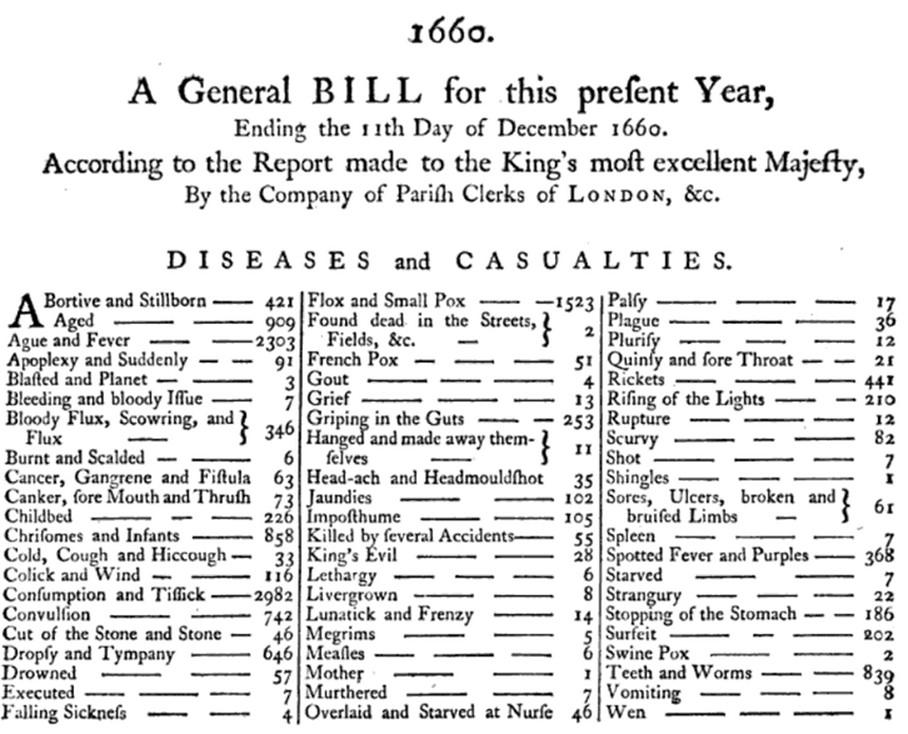
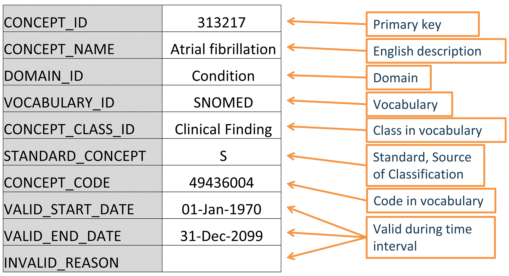
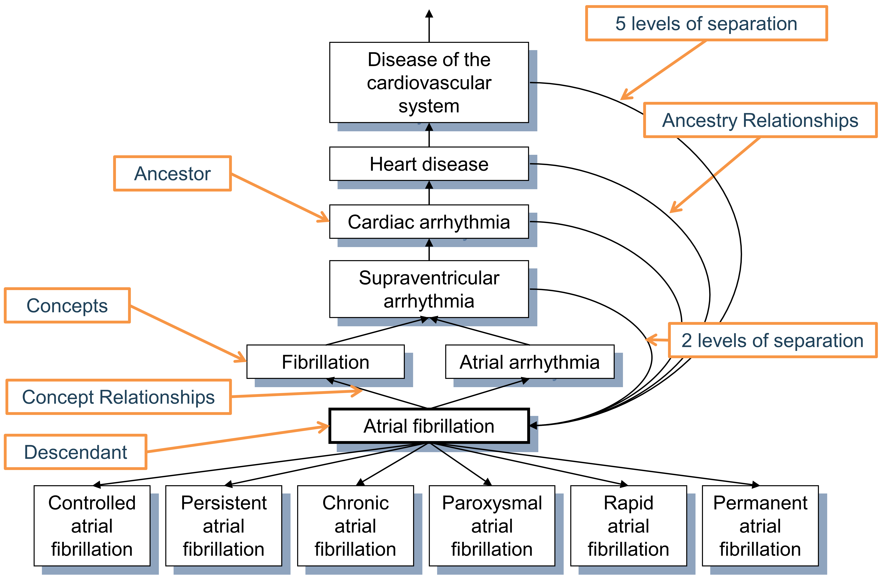

# 標準化語彙 {#StandardizedVocabularies}

\index{standardized vocabularies}

*章リーダー: Christian Reich & Anna Ostropolets*

OMOP標準化語彙、しばしば単に「語彙」と呼ばれるものは、OHDSI研究ネットワークの基盤となる部分であり、共通データモデル（CDM）の不可欠な部分です。これにより、データの内容を定義して方法論、定義、結果の標準化を可能にし、本当の遠隔（ファイアウォールの背後）ネットワーク研究と分析への道を開きます。通常、観察的な医療データの内容を見つけて解釈することは、研究者が数多くの異なる方法で臨床イベントを説明するのに対処しなければならない状態に置かれます。OHDSIは標準化された形式だけでなく、厳密な標準コンテンツへの統合も必要とします。

この章では、まず標準化語彙の主要な原則、その構成要素、およびそれを理解し利用するために必要な関連する規則、慣例、および典型的な状況について説明します。また、継続的な改善のためにコミュニティの支援が必要な箇所も指摘します。

## なぜ語彙が必要で、なぜ標準化が必要か

医療用語の歴史は、中世のロンドンでペストやその他の病気の流行を管理するために作成された死亡報告書（「Bill of Mortality」）に遡ります（図\@ref(fig:bill)参照）。\index{Bill of Mortality}

```{r bill, fig.cap='1660年のロンドン死亡報告書には、その時代に知られていた62の病気の分類システムを使用して住民の死因が示されています。',echo=FALSE, out.width='100%', fig.align='center'}

```

それ以来、分類は大幅に拡大し、医療の他の側面、例えば手順やサービス、薬品、医療機器などにも広がりました。主な原則は変わっていません：それらは患者データを収集、分類、分析するためにいくつかの医療コミュニティが合意した制御された語彙、専門用語、階層またはオントロジーです。これらの多くの語彙は、公的および政府機関によって長期的に管理されます。例えば、世界保健機関（WHO）は最近第11版（ICD11）が追加された「国際疾病分類（ICD）」を作成しています。各国の政府は、ICD10CM（米国）、ICD10GM（ドイツ）などの国別バージョンを作成します。政府はまた、薬品のマーケティングと販売を管理し、認証された薬品の国家リポジトリを維持します。語彙はまた、電子医療記録（EHR）システムや医療保険の請求報告のために、商業製品または内部使用としてプライベートセクターでも使用されます。

その結果、各国、地域、医療システムおよび施設は、その使用場所でのみ関連するであろう独自の分類を持っています。この多様な語彙システムは、それらが使用されるシステムの相互運用性を防ぎます。標準化は患者データの交換を可能にし、グローバルレベルでの健康データ分析を解き放ち、性能の特性評価および品質評価を含む体系的かつ標準化された研究を可能にする鍵です。この問題に対処するために、多国籍組織が誕生し、広範な基準を作成し始めました。例えば、前述のWHOや、「標準医療用語（SNOMED）」や「論理的観察識別子名とコード（LOINC）」です。米国では、健康IT基準委員会（HITAC）は、全国的な異なる組織間での健康情報交換の共通プラットフォームとしてSNOMED、LOINC、および薬品語彙RxNormの使用を国家健康IT調整官（ONC）に推奨しています。

OHDSIは、観察研究のためのグローバルスタンダードであるOMOP CDMを開発しました。CDMの一部として、OMOP標準化語彙は次の2つの主要な目的のために利用可能です：

- コミュニティで使用されるすべての語彙の共通リポジトリ
- 研究での使用のための標準化とマッピング

標準化語彙は無料でコミュニティに提供されており、OMOP CDMインスタンスには必須の参照テーブルとして**使用しなければなりません**。

### 標準化語彙の構築

標準化語彙のすべての語彙は、共通の形式に統合されています。これにより、研究者が元の語彙の複数の異なる形式とライフサイクルの慣例を理解して扱う必要がなくなります。すべての語彙は定期的に更新され、Pallasシステムを使用して統合されます[^pallasUrl]。これは、全体のOMOP CDMワークグループの一部であるOHDSI語彙チームによって構築および運営されています。誤りを見つけた場合は、OHDSIフォーラム[^forums2Url]またはCDM GitHubページ[^cdmIssuesUrl]に投稿して、私たちのリソースを改善するのにご協力ください。 \index{Pallas system}

[^pallasUrl]: https://github.com/OHDSI/Vocabulary-v5.0
[^forums2Url]: https://forums.ohdsi.org
[^cdmIssuesUrl]: https://github.com/OHDSI/CommonDataModel/issues

### 標準化語彙へのアクセス {#accessVocabularies}

標準化語彙を取得するためには、自分でPallasを実行する必要はありません。代わりに、ATHENA[^athenaUrl]から最新バージョンをダウンロードし、ローカルデータベースにロードできます。ATHENAでは、語彙のファセット検索も可能です。 \index{ATHENA} \index{standardized vocabularies!download} \index{standardized vocabularies!search}

[^athenaUrl]: http://athena.ohdsi.org

OMOP CDMの語彙をすべて選んで、標準化語彙テーブルのすべてを含むzipファイルをダウンロードします。標準概念を持つ語彙（セクション\@ref(standardConcepts)参照）と非常に一般的な使用法は事前に選択されています。提供元データで使用されている語彙を追加します。著作権のある語彙には選択ボタンがありません。「ライセンス必要」ボタンをクリックしてそのような語彙をリストに組み込みます。語彙チームが連絡し、ライセンスの証明を示すか、適切な人々と連絡を取り合うためのサポートを提供します。

### 語彙の元: 採用するか構築するか

OHDSIは一般的に、既存の語彙を採用することを優先します。なぜなら、（i）多くの語彙がコミュニティ内で観察データに使用されているため、（ii）語彙の構築とメンテナンスは複雑で、成熟するためには多くの利害関係者の長期にわたる協力が必要だからです。この理由から、特定の組織が語彙を提供しており、それらは生成、廃止、統合および分割のライフサイクルに従います（セクション\@ref(conceptLifeCycle)参照）。現在、OHDSIは条件タイプ概念（例：状態タイプ概念）などの内部行政用語彙のみを作成しています。唯一の例外は、アメリカ以外でのみ使用される薬物をカバーするRxNorm Extension語彙です（セクション\@ref(rxNormExtension)参照）。
## 概念

OMOP CDMのすべての臨床イベントは概念として表現され、それぞれのイベントのセマンティックな意味を表します。これらはデータレコードの基本的な構成要素であり、ほとんどすべてのテーブルが完全に正規化されています（一部の例外を除く）。概念はCONCEPTテーブルに格納されます（図\@ref(fig:concept)を参照）。\index{concept}

```{r concept, fig.cap='OMOP CDMにおける語彙概念の標準的な表現。提供されている例は心房細動のSNOMEDコードに対するCONCEPTテーブルのレコードです。',echo=FALSE, out.width='90%', fig.align='center'}

```

このシステムは**包括的**であることを意味し、患者の医療体験に関連するすべてのイベント（例：疾患、手続き、薬剤の曝露など）や医療システムの一部の管理情報（例：訪問、ケアサイトなど）をカバーするのに十分な概念が存在します。

### 概念ID

各概念にはプライマリキーとして使用される概念IDが割り当てられます。この無意味な整数IDは、CDMのイベントテーブルにデータを記録する際に使用され、元の語彙コードではありません。 \index{concept!identifier}

### 概念名

各概念には1つの名前があります。名前は常に英語で、語彙のソースからインポートされます。ソース語彙に複数の名前がある場合、最も表現力のあるものが選択され、残りはCONCEPT_SYNONYMテーブルに同じCONCEPT_IDキーで保存されます。非英語の名前もCONCEPT_SYNONYMに記録され、LANGUAGE_CONCEPT_IDフィールドに適切な言語概念IDが格納されます。名前は255文字までとされており、非常に長い名前は切り捨てられ、フルレングスバージョンが別のシノニムとして記録され、最大1000文字まで保存できます。

### ドメイン {#conceptDomains}

各概念にはDOMAIN_IDフィールドにドメインが割り当てられています。これは数値のCONCEPT_IDとは対照的に、ドメインに対する短い大文字小文字区別のある一意の英数字IDです。例として、「Condition」、「Drug」、「Procedure」、「Visit」、「Device」、「Specimen」などのドメイン識別子があります。曖昧または事前コード化された（組み合わせ）概念は複合ドメインに属することがありますが、標準概念（セクション\@ref(standardConcepts)参照）は常に単一のドメインに割り当てられます。ドメインはまた、臨床イベントまたはイベント属性がCDMテーブルおよびフィールドのどこに記録されるかを指示します。
ドメインの割り当ては、[Pallas](https://github.com/ohDSI/vocabulary-v5.0)に示されているヒューリスティックを使用して語彙の取り込み中に行われるOMOP固有の機能です。ソース語彙は、さまざまな程度で混合ドメインのコードを組み合わせる傾向があります（図\@ref(fig:domains)参照）。\index{domain!concept}

```{r domains, fig.cap='手続き語彙CPT4およびHCPCSにおけるドメインの割り当て。直感的には、これらの語彙は単一のドメインのコードと概念を含むべきですが、実際には混在しています。',echo=FALSE, out.width='70%', fig.align='center'}
knitr::include_graphics("images/StandardizedVocabularies/domains.png")
```

ドメインのヒューリスティックは、ドメインの定義に従います。これらの定義はCDMのテーブルおよびフィールド定義から派生しています（Chapter \@ref(CommonDataModel)参照）。ヒューリスティックは完全ではなく、グレーゾーンも存在します（セクション\@ref(specialSituations)「特別な状況」参照）。ドメインが誤って割り当てられている概念を見つけた場合、[フォーラム](https://forums.ohdsi.org)または[CDM問題](https://github.com/OHDSI/CommonDataModel/issues)の投稿を通じて報告し、プロセスの改善に貢献してください。

### 語彙

各語彙には短い大文字小文字区別のある一意の英数字IDが付けられており、通常は語彙の省略名を使用し、ダッシュを省略します。たとえば、ICD-9-CMは「ICD9CM」の語彙IDを持ちます。現在、OHDSIがサポートしている語彙は111あり、そのうち78は外部ソースから採用されており、残りはOMOP内部の語彙です。これらの語彙は通常、四半期ごとに更新されます。語彙のソースとバージョンはVOCABULARY参照ファイルで定義されています。 \index{vocabulary}

### 概念クラス

一部の語彙はコードまたは概念を分類しており、それを大文字小文字区別のある一意の英数字IDで示します。たとえば、SNOMEDには「意味タグ」と呼ばれる33の概念クラスがあり、臨床所見、社会的状況、身体構造などがあります。これらは概念の垂直的な区分です。また、MedDRAやRxNormのように、階層的な階層の横方向のレベルを分類する概念クラスを持つものもあります。概念クラスを持たない語彙（例えばHCPCS）の場合、語彙IDがConcept Class IDとして使用されます。 \index{concept!class}

表: (\#tab:sublassification) 概念クラスにおける水平および垂直のサブ分類原則を持つ語彙と持たない語彙。

概念クラスの区分原則 | 語彙
:-------- |:----------------------------------
水平 | すべての薬物語彙、ATC、CDT、Episode、HCPCS、HemOnc、ICDs、MedDRA、OSM、国勢調査
垂直 | CIEL、HES専門、ICDO3、MeSH、NAACCR、NDFRT、OPCS4、PCORNET、Plan、PPI、Provider、SNOMED、SPL、UCUM
混在 | CPT4、ISBT、LOINC
なし | APC、すべてのタイプ概念、民族性、OXMIS、種族、収益コード、スポンサー、供給者、UB04、訪問

水平概念クラスにより、特定の階層レベルを決定することができます。たとえば、薬物語彙RxNormにおける概念クラス「Ingredient」は階層の最上位レベルを定義します。垂直モデルでは、概念クラスのメンバーは最上位から最下位までの任意の階層レベルであることができます。

### 標準概念 {#standardConcepts}

各臨床イベントを表す1つの概念が標準として指定されます。たとえば、条件ドメインにおいて、「心房細動」を定義するMESHコードD001281、CIELコード148203、SNOMEDコード49436004、ICD9CMコード427.31、およびReadコードG573000のすべてがSNOMED概念は標準であり、この条件をデータ内で表します。他のものは非標準またはソース概念として指定され、標準のものにマッピングされています。標準概念はSTANDARD_CONCEPTフィールドに「S」で示されます。そして、これらの標準概念のみが"_CONCEPT_ID"で終わるCDMフィールドにデータを記録するために使用されます。 \index{standard concept}

### 非標準概念

非標準概念は臨床イベントを表現するためには使用されませんが、標準化された語彙の一部であり、ソースデータに頻繁に見られます。そのため、それらは「ソース概念」とも呼ばれます。ソース概念を標準概念に変換するプロセスは「マッピング」と呼ばれます（セクション\@ref(概念Mapping)参照）。非標準概念にはSTANDARD_CONCEPTフィールドに値がありません（NULL）。

### 分類概念

これらの概念は標準ではなく、したがってデータを表現するためには使用されませんが、標準概念と階層的に関連しており、そのため階層クエリを実行するために使用できます。たとえば、MedDRAコード10037908のすべての子孫をクエリする場合（MedDRAライセンスを取得していないユーザーには表示されません。アクセス制限についてはセクション\@ref(accessVocabularies)参照）では、標準のSNOMED概念「心房細動」を取得します（CONCEPT_ANCESTORテーブルを使用した階層クエリについてはセクション\@ref(conceptAncestor)を参照） - 図\@ref(fig:hierarchy)を参照。 \index{classification concept}

```{r hierarchy, fig.cap='条件ドメインにおける標準、非標準ソースおよび分類概念とその階層関係。SNOMEDはほとんどの標準条件概念に使用されており（いくつかの腫瘍関連概念はICDO3から派生）、MedDRA概念は階層分類概念に使用されており、他のすべての語彙は非標準またはソース概念を含み、階層には参加しません。',echo=FALSE, out.width='100%', fig.align='center'}
knitr::include_graphics("images/StandardizedVocabularies/hierarchy.png")
```

標準、非標準、分類の概念の選択は、通常各ドメインごとに語彙レベルで行われます。これは概念の品質、内蔵の階層、および語彙の宣言された目的に基づいています。また、すべての語彙の概念が標準概念として使用されているわけではありません。各ドメインごとに別々に指定されており、各概念はアクティブである必要があります（セクション\@ref(概念ライフサイクル)参照）し、複数の語彙から同じ意味を競う概念がある場合、優先順位が設定されることがあります。つまり、「標準語彙」などというものはありません。例については表\@ref(tab:vocabList)を参照してください。

表: (\#tab:vocabList) 標準/非標準/分類概念の割り当てに利用する語彙のリスト。

ドメイン | 標準概念のための語彙 | ソース概念のための語彙 | 分類概念のための語彙
:-------- |:--------------- |:--------------- |:-------------
条件 | SNOMED, ICDO3 | SNOMED Veterinary | MedDRA
手続き | SNOMED, CPT4, HCPCS, ICD10PCS, ICD9Proc, OPCS4 | SNOMED Veterinary, HemOnc, NAACCR | 現時点ではなし
測定 | SNOMED, LOINC | SNOMED Veterinary, NAACCR, CPT4, HCPCS, OPCS4, PPI | 現時点ではなし
薬剤 | RxNorm, RxNorm Extension, CVX | HCPCS, CPT4, HemOnc, NAACCR | ATC
装置 | SNOMED | 他の語彙、現在は標準化されていない | 現時点ではなし
観察 | SNOMED | 他の語彙 | 現時点ではなし
訪問 | CMS Place of Service, ABMT, NUCC | SNOMED, HCPCS, CPT4, UB04 | 現時点ではなし

### 概念コード

概念コードはソース語彙で使用される識別子です。たとえば、ICD9CMまたはNDCコードはこのフィールドに保存され、OMOPテーブルはCONCEPTテーブルへの外部キーとして概念IDを使用します。その理由は、名前空間が語彙を超えて重複するためです。つまり、同じコードが異なる語彙で完全に異なる意味を持つことができます（表\@ref(tab:code1001)参照）。\index{concept!code}

表: (\#tab:code1001) 同じ概念コード1001を持つが、異なる語彙、ドメイン、概念クラスの概念。

概念ID | 概念コード | 概念名 | ドメインID | 語彙ID | 概念クラス
:--------- |:---- |:------------ |:---------- |:---------- |:----------
35803438 | 1001 | 顆粒球コロニー刺激因子 | 薬剤 | HemOnc | コンポーネントクラス
35942070 | 1001 | AJCC TNM Clin T | 測定 | NAACCR | NAACCR変数
1036059 | 1001 | アンチピリン | 薬剤 | RxNorm | 成分
38003544 | 1001 | レジデンシャル治療 - 精神科 | 収益コード | 収益コード | 収益コード
43228317 | 1001 | アセプロメタジンマレイン酸塩 | 薬剤 | BDPM | 成分
45417187 | 1001 | ブロムフェニラミンマレイン酸塩、10 mg/ml注射用溶液 | 薬剤 | Multum | Multum
45912144 | 1001 | 血清 | 標本 | CIEL | 標本

### ライフサイクル {#conceptLifeCycle}

語彙はめったに固定されたコード集合を持つ永久的なコーパスではありません。代わりに、コードと概念は追加されたり廃止されたりします。OMOP CDMは縦断的な患者データをサポートするモデルであるため、過去に使用されたが現在はアクティブでない概念や、新しい概念をサポートし、それらを文脈に配置する必要があります。CONCEPTテーブルには、可能なライフサイクルの状態を説明する3つのフィールドがあります：VALID_START_DATE、VALID_END_DATE、およびINVALID_REASON。これらのフィールドの値は概念のライフサイクルの状態によって異なります：

- **アクティブまたは新しい概念**
	- 説明: 使用中の概念。
	- VALID_START_DATE: 概念の生成日、またはそれが不明な場合は語彙への取り込み日、またはそれが不明な場合は1970-1-1。
	- VALID_END_DATE: 現在アクティブな概念として「不定期な将来で無効になる可能性があるが、現在はアクティブ」と示すための慣習として2099-12-31と設定されています。
	- INVALID_REASON: NULL
- **後継者のない廃止された概念**
	- 説明: 標準として使用できない非アクティブな概念（セクション\@ref(standardConcepts)参照）。
	- VALID_START_DATE: 概念の生成日、またはそれが不明な場合は語彙への取り込み日、またはそれが不明な場合は1970-1-1。
	- VALID_END_DATE: 過去の日付で無効化を示す、またはそれが不明な場合は語彙更新の日。
	- INVALID_REASON: "D"
- **後継者のあるアップグレードされた概念**
	- 説明: 非アクティブな概念ですが、定義された後継者があります。これらは通常、重複排除を経た概念です。
	- VALID_START_DATE: 概念の生成日、またはそれが不明な場合は語彙取り込み日、または1970-1-1。
	- VALID_END_DATE: 過去の日付でアップグレードを示す、または語彙更新の日。
	- INVALID_REASON: "U"
- **新しい概念のために再利用されたコード**
	- 説明: 語彙がこの廃止された概念のコードを新しい概念のために再利用しました。
	- VALID_START_DATE: 概念の生成日、またはそれが不明な場合は語
## 関係

任意の2つのコンセプトは、そのドメインやボキャブラリーが同じであるかどうかに関係なく、定義された関係を持つことができます。関係の性質は、CONCEPT_RELATIONSHIPテーブルのRELATIONSHIP_IDフィールドにある、大文字小文字を区別する一意の英数字IDで示されます。関係は対称的であり、各関係には同等の関係が存在し、フィールドCONCEPT_ID_1とCONCEPT_ID_2の内容が入れ替わり、RELATIONSHIP_IDはその逆に変更されます。たとえば、「Maps to」関係には反対の関係「Mapped from」があります。\index{concept!relationship}

CONCEPT_RELATIONSHIPテーブルのレコードには、ライフサイクルフィールドRELATIONSHIP_START_DATE、RELATIONSHIP_END_DATE、およびINVALID_REASONも含まれています。ただし、ATHENAを通じて利用可能なのはINVALID_REASONがNULLのアクティブなレコードのみです。非アクティブな関係は内部処理のためにPallasシステムに保存されます。RELATIONSHIPテーブルは、全ての関係IDおよびその逆関係のリストを参照するためのものです。

### マッピング関係 {#conceptMapping}

これらの関係は、非標準のコンセプトから標準コンセプトへの変換を提供し、2つの関係IDペアによってサポートされています（表\@ref(tab:mappingRelationships)を参照）。\index{concept!mapping}

Table: (\#tab:mappingRelationships) マッピング関係の種類。

関係IDペア | 目的
:------------- | :----------------------------------------------------
"Maps to"および"Mapped from" | 標準コンセプトへのマッピング。標準コンセプトはそれ自身にマッピングされ、非標準コンセプトは標準コンセプトにマッピングされます。ほとんどの非標準コンセプトとすべての標準コンセプトは、この関係を持ち、前者は*_SOURCE_CONCEPT_IDに、後者は*_CONCEPT_IDフィールドに保存されます。分類コンセプトはマッピングされません。
"Maps to value"および"Value mapped from" | MEASUREMENTおよびOBSERVATIONテーブルのVALUE_AS_CONCEPT_IDフィールドに配置する値を表すコンセプトへのマッピング。

これらのマッピング関係の目的は、同等のコンセプト間のクロスウォークを可能にし、臨床イベントがOMOP CDMでどのように表現されるかを統一することです。これは標準化されたボキャブラリーの主要な成果です。

「同等のコンセプト」とは、同じ意味を持ち、さらに重要なことに、階層下位が同じ意味領域をカバーすることを意味します。同等のコンセプトが利用できず、コンセプトが標準でない場合、それはより広いコンセプト（いわゆる「上り坂マッピング」）にマッピングされます。たとえば、ICD10CM W61.51「ガチョウに噛まれる」は、標準の状態コンセプトに一般的に使用されるSNOMEDのボキャブラリーには同等のものがありません。代わりに、それはSNOMED 217716004「鳥に突かれる」にマッピングされ、コンテキストとしての鳥がガチョウであるという情報が失われます。上り坂マッピングは、情報の損失が標準の研究使用ケースにとって無関係であると考えられる場合にのみ使用されます。

いくつかのマッピングは、ソースコンセプトを複数の標準コンセプトに接続します。たとえば、ICD9CM 070.43「肝性昏睡を伴うE型肝炎」は、SNOMED 235867002「急性E型肝炎」とSNOMED 72836002「肝性昏睡」の両方にマッピングされます。これは、元のソースコンセプトが肝炎と昏睡という2つの状態のあらかじめ組み合わせられたものであるためです。SNOMEDにはその組み合わせがなく、その結果、ICD9CMレコードではマッピングされた標準コンセプトそれぞれに対して2つのレコードが書かれます。

「Maps to value」関係の目的は、エンティティ-属性-値（EAV）モデルに従ったOMOP CDMテーブルの値を分割することです。これは次の状況で典型的です：

- テストと結果の値を含む測定
- 個人または家族の病歴
- 物質に対するアレルギー
- 予防接種の必要性

これらの状況では、ソースコンセプトは属性（テストまたは履歴）と値（テスト結果または病気）の組み合わせです。「Maps to」関係はこのソースを属性コンセプトにマッピングし、「Maps to value」は値コンセプトにマッピングします。例については図\@ref(fig:conceptValue)を参照してください。

```{r conceptValue, fig.cap='ソースコンセプトと標準コンセプトの間の一対多のマッピング。事前に組み合わせられたコンセプトは2つのコンセプトに分割され、一つは属性（ここでは臨床所見の歴史）で、もう一つは値（胃潰瘍）です。「Maps to」関係は測定または観察のドメインのコンセプトにマッピングされますが、「Maps to value」コンセプトにはドメインの制限はありません。',echo=FALSE, out.width='100%', fig.align='center'}
knitr::include_graphics("images/StandardizedVocabularies/conceptValue.png")
```

コンセプトのマッピングは、ネットワーク研究を行っているコミュニティの努力を支えるために提供されているOMOP標準化ボキャブラリーのもう一つの中心的な機能です。マッピング関係は外部ソースから派生するか、ボキャブラリーチームによって手動で維持されます。これはそれらが完璧でないことを意味します。誤ったまたは異議のあるマッピング関係を見つけた場合、それを報告し、[フォーラム](https://forums.ohdsi.org)や[CDMの問題](https://github.com/OHDSI/CommonDataModel/issues)の投稿を通じてプロセスの改善に協力することが重要です。

マッピング規則の詳細な説明は、OHDSI Wikiで見つけることができます。[^vocabMappingUrl]

[^vocabMappingUrl]: https://www.ohdsi.org/web/wiki/doku.php?id=documentation:vocabulary:mapping

### 階層関係

階層を示す関係は、「Is a」-「Subsumes」関係ペアによって定義されます。階層関係は、子コンセプトが親コンセプトのすべての属性に加えて1つ以上の追加属性またはより正確に定義された属性を持つように定義されます。たとえば、SNOMED 49436004「心房細動」は、SNOMED 17366009「心房性不整脈」と「Is a」関係で関連しています。両コンセプトは、不整脈のタイプが一方は細動として定義されている以外は、同一の属性セットを持っています。コンセプトは複数の親または複数の子コンセプトを持つことができます。この例では、SNOMED 49436004「心房細動」はSNOMED 40593004「細動」に対しても「Is a」に該当します。\index{concept!hierarchy}

### 異なるボキャブラリーのコンセプト間の関係

これらの関係は通常、「Vocabulary A - Vocabulary B equivalent」のタイプであり、ボキャブラリーの元のソースから提供されるか、OHDSIボキャブラリーチームによって作成されます。それらは近似的なマッピングとして機能することが多いですが、より優れたマッピング関係と比較してそれほど正確ではない場合があります。高品質の同等関係（例えば、「Source - RxNorm equivalent」）は常に「Maps to」関係によって複製されます。

### 同一ボキャブラリーのコンセプト間の関係

内部ボキャブラリー関係は通常、ボキャブラリープロバイダーによって提供されます。完全な説明は、OHDSI Wikiの個々のボキャブラリーのボキャブラリー文書にあります。[^vocabVocabulariesUrl]

[^vocabVocabulariesUrl]: https://www.ohdsi.org/web/wiki/doku.php?id=documentation:vocabulary

これらの多くは、臨床イベント間の関係を定義しており、情報検索に使用することができます。例えば、尿道の障害は、「Finding site of」関係に従って見つけることができます（表\@ref(tab:findingSite)を参照）。

Table: (\#tab:findingSite) 尿道の「Finding site of」関係で、すべてこの解剖学的構造に位置する状態を示しています。

CONCEPT_ID_1 | CONCEPT_ID_2
:---------------- | :----------------------------
4000504 "Urethra part" | 36713433 "部分的尿道重複"
4000504 "Urethra part" | 433583 "下部尿道裂孔"
4000504 "Urethra part" | 443533 "男性下部尿道裂孔"
4000504 "Urethra part" | 4005956 "女性下部尿道裂孔"

これらの関係の品質と包括性は、元のボキャブラリーの品質によって異なります。一般に、標準コンセプトを抽出するために使用されるボキャブラリーは、より良いキュレーションのために選ばれ、そのため、内部関係の品質も高い傾向があります。
## 階層 {#conceptAncestor}

ドメイン内では、標準および分類概念は階層構造に組織され、CONCEPT_ANCESTORテーブルに格納されています。これにより、概念とその階層的な子孫をすべてクエリして取得することが可能です。これらの子孫は祖先と同じ属性を持ちますが、追加の属性や、より定義された属性も持ちます。

CONCEPT_ANCESTORテーブルは、CONCEPT_RELATIONSHIPテーブルからすべての可能な概念を階層関係を通じて走査して自動的に構築されます。これらは "Is a" - "Subsumes" のペア（図 \@ref(fig:conceptAncestor) 参照）や、語彙間の階層を接続する他の関係です。どの関係が階層構造に参加するかは、RELATIONSHIP参照テーブルのDEFINES_ANCESTRYフラグにより各関係IDに対して定義されます。

(ref:foo) 「心房細動」の階層。第一度の系譜は「Is a」と「Subsumes」関係によって定義され、高次の関係は推論され、CONCEPT_ANCESTORテーブルに保存されます。各概念は、そのレベルの分離が0とされる自己の子孫でもあります。 \index{概念!祖先}

```{r conceptAncestor, fig.cap='(ref:foo)', echo=FALSE, out.width='100%', fig.align='center'}

```

祖先の度合い、つまり祖先と子孫の間のステップ数は、MIN_LEVELS_OF_SEPARATIONおよびMAX_LEVELS_OF_SEPARATIONフィールドに記録され、最短または最長の接続を定義します。すべての階層的な関係が分離度の計算に等しく寄与するわけではありません。この度合いにカウントされるステップは、各関係IDに対してRELATIONSHIP参照テーブルのIS_HIERARCHICALフラグによって決まります。

現在のところ、完全で高品質な階層は薬と症状の2つのドメインにのみ存在します。手技、測定、および観察のドメインは部分的にしかカバーされておらず、まだ構築途中です。特に薬のドメインでは、成分や薬物クラスのメンバーを原産地、ブランド名、その他の属性に関係なく参照できるため、祖先関係は非常に有用です。

## 内部参照テーブル

DOMAIN_ID、VOCABULARY_ID、CONCEPT_CLASS_ID（すべてCONCEPTレコード内）およびCONCEPT_RELATIONSHIP_ID（CONCEPT_RELATIONSHIP内）はそれぞれ独自の語彙によって制御されます。これらは、主キーとしての*_IDフィールド、詳細な*_NAMEフィールド、およびCONCEPTテーブルに戻る参照を持つ*_CONCEPT_IDフィールドを持つ4つの参照テーブルDOMAIN、VOCABULARY、CONCEPT_CLASS、およびRELATIONSHIPで定義されています。これらの重複レコードの目的は、自動ナビゲーションエンジンをサポートする情報モデルを提供することです。

VOCABULARYテーブルには、元の語彙のソースとバージョンを参照するためのVOCABULARY_REFERENCEおよびVOCABULARY_VERSIONフィールドも含まれています。RELATIONSHIPテーブルには、DEFINES_ANCESTRY、IS_HIERARCHICAL、およびREVERSE_RELATIONSHIP_IDフィールドが追加されています。後者は、関係のペアに対するカウンター関係IDを定義します。

## 特別な状況 {#specialSituations}

### 性別

OMOP CDMと標準化語彙における性別は、出生時の生物学的性別を表します。しばしば、代替の性別を定義する方法についての質問が寄せられます。これらのユースケースは、OBSERVATIONテーブルに記録された人物の自己定義の性別を通じてカバーされる必要があります（そのデータ資産にそのような情報が含まれている場合）。

### 人種と民族

これらは米国政府の定義に従います。民族はヒスパニック系または非ヒスパニック系の区別であり、どのレースでもあり得ます。人種は一般的に5つの主要な人種に分けられ、これらは階層的な子孫として民族を持ちます。混合人種は含まれていません。

### 診断コーディングシステムとOMOPの状態

一般的に使用されるコーディングシステム（例：ICD-9やICD-10）は、適切な診断処理に基づいて診断をより明確に定義します。状態ドメインはこの意味構造と完全に一致するわけではなく、一部重なります。例えば、状態には診断が導かれる前の兆候や症状も含まれ、ICDコードには他のドメインに属する概念も含まれます（例：手技）。

### 手技コードシステム

同様に、HCPCSやCPT4のようなコーディングシステムは医療手技のリストと考えられます。しかし実際には、これらは医療サービスの支払いのための正当化としてのメニューのようなものです。これらのサービスの多くは手技ドメインに含まれますが、多くの概念はこの範囲外です。

### デバイス

デバイスの概念については、標準概念のソースとして使用できる標準化されたコーディングスキームがありません。多くのソースデータでは、デバイスはコード化されていないか、外部のコーディングスキームに含まれていません。同じ理由で、現在利用可能な階層システムはありません。

### 訪問とサービス

訪問の概念は、ヘルスケアの出会いの性質を定義します。多くのソースシステムでは、これらはサービスの場所として呼ばれており、病院などの組織や物理的構造を示します。その他では、サービスと呼ばれます。これらは国ごとに異なり、その定義を得るのは困難です。ケアサイトはしばしば特定の訪問（例えばXYZ病院）に特化していますが、それによって定義されるべきではありません（XYZ病院でも患者が非病院訪問に遭遇する可能性があります）。

### プロバイダーと専門分野

どの人間のプロバイダーもプロバイダードメインに定義されています。これには、医師や看護師のような医療専門職だけでなく、眼鏡技師や靴職人のような非医療提供者も含まれます。専門分野は、プロバイダー「医師」の子孫です。ケアサイトは専門分野を持つことはできませんが、主要スタッフの専門分野によって定義されることがよくあります（「外科部門」など）。

### 特別な要件を持つ治療領域

標準化語彙は包括的にヘルスケアのすべての側面をカバーしています。しかし、いくつかの治療領域には特別なニーズがあり、特別な語彙が必要です。例としては、腫瘍学、放射線学、ゲノミクスが挙げられます。これらの拡張を開発するために、特別なOHDSIワーキンググループが存在します。その結果、OMOP標準化語彙は、異なる起源と目的を持つ概念がすべて同じドメイン固有の階層に存在する統合システムを構成しています。

### 薬物ドメインにおける標準概念 {#rxNormExtension}

薬物ドメインの多くの概念は、米国国立医学図書館が生産する公的に利用可能な語彙であるRxNormから供給されます。しかし、米国外の薬物は、成分、形態、および強度の組み合わせが米国で市販されているかどうかに応じてカバーされない場合があります。米国市場にない薬物は、OHDSI語彙チームによって、唯一の大規模ドメイン語彙である[RxNorm Extension](https://www.ohdsi.org/web/wiki/doku.php?id=documentation:vocabulary:rxnorm_extension)という語彙のもとに追加されます。

### NULLのフレーバー

多くの語彙には情報の欠如に関するコードが含まれています。例えば、5つの性別概念8507「男性」、8532「女性」、8570「曖昧」、8551「不明」、および8521「その他」のうち、標準概念は最初の2つのみであり、他の3つはマッピングなしのソース概念です。標準化語彙では、なぜ情報が利用できないかの区別はありません。それは患者による情報の積極的な撤回、欠落値、何らかの形で定義または標準化されていない値、またはCONCEPT_RELATIONSHIPでのマッピング記録の欠如によるものである可能性があります。このような概念はマッピングされず、標準概念の概念ID=0へのデフォルトマッピングに対応します。

## まとめ

```{block2, type='rmdsummary'}
- すべてのイベントと管理的事実は、OMOP標準語彙で概念、概念関係、および概念祖先階層として表されます。
- これらのほとんどは既存のコーディングスキームや語彙から採用されますが、一部はOHDSI語彙チームによって新たにキュレーションされます。
- すべての概念にはドメインが割り当てられ、その概念が表す事実がCDMに格納される場所を制御します。
- 異なる語彙の同等の意味の概念は、そのうちの1つにマppingされ、これが標準概念として指定されます。他のものはソース概念です。
- マッピングは「Maps to」および「Maps to value」という概念関係を通じて行われます。
- 分類概念という追加の概念クラスがあり、これらは非標準ですが、ソース概念とは異なり、階層に参加します。
- 概念は時間とともにライフサイクルを持ちます。
- ドメイン内の概念は階層に整理されています。階層の質はドメインごとに異なり、階層システムの完成は進行中の作業です。
- 間違いや不正確さを発見した場合は、コミュニティに積極的に参加することを強くお勧めします。

```

## 演習

#### 前提条件 {-}

最初の演習では、標準語彙の概念を調べる必要があります。これはATHENA[^athenaCdm2Url]またはATLAS[^atlasCdm2Url]を通じて行うことができます。

[^athenaCdm2Url]: http://athena.ohdsi.org/
[^atlasCdm2Url]: http://atlas-demo.ohdsi.org

```{exercise, exerciseVocab1}
"胃腸出血"の標準概念IDは何ですか？

```

```{exercise, exerciseVocab2}
"胃腸出血"の標準概念にマッピングされるICD-10CMコードはどれですか？この標準概念にマッピングされるICD-9CMコードはどれですか？

```

```{exercise, exerciseVocab3}
"胃腸出血"の標準概念と同等のMedDRA推奨用語は何ですか？

```

提案された回答は付録 \@ref(Vocabanswers)に記載されています。
