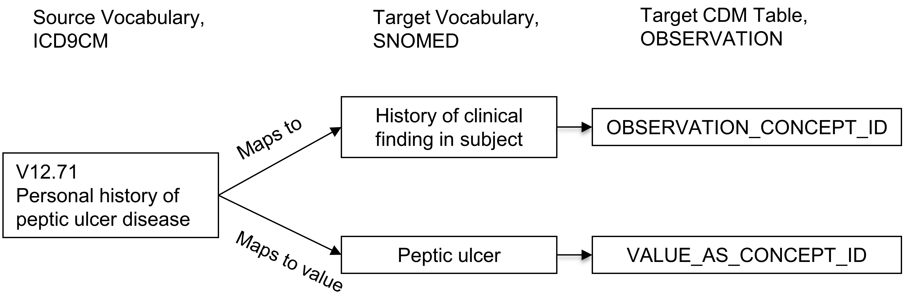

# 標準化ボキャブラリ {#StandardizedVocabularies}

\index{standardized vocabularies}

*著者: Christian Reich & Anna Ostropolets*

OMOP標準化ボキャブラリは、単に「ボキャブラリ」と呼ばれることが多く、データの内容を定義することで、手法、定義、結果の標準化を可能にし、真のリモート（ファイアウォール内）ネットワーク研究と分析への道を開きます。通常、コーディングスキームを使用した構造化データであるか、自由形式のテキストであるかに関わらず、観察医療データのコンテンツを見つけ、解釈することは、臨床イベントを記述する無数の異なる方法に直面する研究者へと引き継がれます。OHDSIでは、標準化されたフォーマットだけでなく、厳格な標準コンテンツへの調和も必要とされています。 本章では、まず標準化された用語集の主な原則、その構成要素、関連する規則、慣例、および典型的な状況について説明します。これらはすべて、この基盤となるリソースを理解し活用するために必要なものです。また、継続的に改善していくためにコミュニティのサポートが必要な箇所についても指摘します。

## なぜボキャブラリが必要で、なぜ標準化が必要なのか

医学ボキャブラリの歴史は、中世のロンドンでペストやその他の疾患の流行を管理するために作成された死亡報告書（「Bill of Mortality」）に遡ります（図 \@ref(fig:bill) 参照）。\index{Bill of Mortality}

```{r bill, fig.cap='1660年のロンドン死亡報告書には、その時代に知られていた62の疾患の分類システムを使用して住民の死因が示されています。',echo=FALSE, out.width='100%', fig.align='center'}
knitr::include_graphics("images/StandardizedVocabularies/bill.jpg")
```

それ以来、分類の規模と複雑性は大幅に拡大し、医療の他の側面、例えば処置やサービス、薬剤、医療デバイスなどにも広がりました。主な原則は変わっていません：つまり、患者データを収集、分類、分析するためにいくつかの医療コミュニティが合意した管理されたボキャブラリ、専門用語、階層やオントロジーです。これらの多くのボキャブラリは、公的あるいは政府機関によって長期的に管理されます。例えば、世界保健機関（WHO）は最近第11版（ICD11）が追加された「国際疾病分類（ICD）」を作成しています。各国の政府は、ICD10CM（米国）、ICD10GM（ドイツ）など、各国独自のバージョンを作成しています。政府はまた、薬品のマーケティングと販売を管理し、認証された薬剤の国家リポジトリを維持しています。ボキャブラリは民間部門でも、商業製品として、あるいはEHRシステムや保険請求報告書作成などの社内利用のために使用されています。

その結果、各国、各地域、医療制度、医療機関は、それぞれ独自の分類法を持つ傾向にあり、それは使用される場所でのみ関連性がある可能性が高いものです。こうした無数のボキャブラリが、使用されるシステムの相互運用性を妨げています。標準化は、患者データの交換を可能にし、世界レベルでの医療データ分析を可能にし、パフォーマンス特性や品質評価を含む体系化された標準化された研究を可能にする鍵となります。この問題に対処するため、多国籍の組織が設立され、前述のWHOや、標準病名（SNOMED）や、論理観察識別子名とコード（LOINC）などの幅広い標準の作成を開始しました。米国では、Health IT Standards Committee (HITAC) が、SNOMED、LOINC、および薬剤用ボキャブラリであるRxNormを、さまざまな組織間で全国規模の医療情報交換を行う共通プラットフォームで使用するための標準として、National Coordinator for Health IT (ONC) に推奨しています。

OHDSIは、観察研究のためのグローバルスタンダードであるOMOP CDMを開発しました。OMOP標準化ボキャブラリは、CDMの一部として、主に次の2つの目的で利用できます。

-   コミュニティで使用されるすべてのボキャブラリの共通リポジトリ

-   研究使用のための標準化とマッピング

標準化ボキャブラリはコミュニティに無料で提供されており、OMOP CDMインスタンスでは**必須の参照テーブルとして使用する必要**があります。

### 標準化ボキャブラリの構築

標準化ボキャブラリのすべてのボキャブラリは、共通の形式に統合されています。これにより、研究者が元のボキャブラリの複数の異なる形式とライフサイクルの慣例を理解して扱う必要がなくなります。すべてのボキャブラリは定期的に更新され、Pallasシステムを使用して統合されます[^standardizedvocabularies-1]。これは、全体のOMOP CDMワークグループの一部であるOHDSIボキャブラリチームによって構築と運営がなされています。誤りを見つけた場合は、OHDSIフォーラム[^standardizedvocabularies-2]またはCDM GitHubページ[^standardizedvocabularies-3]に投稿して、私たちのリソースを改善するのにご協力ください。 \index{Pallas system}

[^standardizedvocabularies-1]: <https://github.com/OHDSI/Vocabulary-v5.0>

[^standardizedvocabularies-2]: <https://forums.ohdsi.org>

[^standardizedvocabularies-3]: <https://github.com/OHDSI/CommonDataModel/issues>

### 標準化ボキャブラリへのアクセス {#accessVocabularies}

標準化ボキャブラリを得るために、自分でPallasを実行する必要はありません。代わりに、ATHENA[^standardizedvocabularies-4]から最新バージョンをダウンロードし、ローカルデータベースにロードできます。ATHENAでは、ボキャブラリのファセット検索も可能です。 \index{ATHENA} \index{standardized vocabularies!download} \index{standardized vocabularies!search}

[^standardizedvocabularies-4]: <http://athena.ohdsi.org>

OMOP CDMのボキャブラリをすべて選んで、標準化されたボキャブラリテーブルのすべてを含むzipファイルをダウンロードします。標準コンセプトを持つボキャブラリ（セクション \@ref(standardConcepts) 参照）と非常に一般的な使用法は事前に選択されています。提供元データで使用されているボキャブラリを追加します。著作権のあるボキャブラリには選択ボタンがありません。「ライセンス必要」ボタンをクリックしてそのようなボキャブラリをリストに組み込みます。ボキャブラリチームが連絡し、ライセンスを提示するか、適切な人々と連絡を取り合うためのサポートを提供します。

### ボキャブラリの元: 採用するか構築するか

OHDSIは一般に、既存のボキャブラリを採用することを優先します。なぜなら、１）多くのボキャブラリがコミュニティ内で観察データに使用されているため、２）ボキャブラリの構築とメンテナンスは複雑で、成熟するためには多くの利害関係者の長期にわたる協力が必要だからです。このため、特定の組織がボキャブラリを提供しており、ボキャブラリは生成、廃止、統合、分割のライフサイクルの対象となります（セクション \@ref(conceptLifeCycle) 参照）。現在、OHDSIはタイプコンセプト（例：コンディションタイプコンセプト）などの内部管理ボキャブラリのみを作成しています。唯一の例外は、米国以外でのみ使用される医薬品を対象とするRxNorm Extensionボキャブラリです（セクション \@ref(rxNormExtension) 参照）。

## コンセプト

OMOP CDMの臨床イベントはすべてコンセプトとして表現されます。これらはデータレコードの基本的な構成要素であり、ほとんどのテーブルは、いくつかの例外を除いて完全に正規化されています。コンセプトはCONCEPTテーブルに格納されます（図 \@ref(fig:concept) を参照）。\index{concept}

```{r concept, fig.cap='OMOP CDMにおける標準化ボキャブラリコンセプトの標準的な表現。提示されている例は心房細動のSNOMEDコードに対するCONCEPTテーブルのレコードです。',echo=FALSE, out.width='90%', fig.align='center'}
knitr::include_graphics("images/StandardizedVocabularies/concept.png")
```

このシステムは**包括的**であることを意味し、患者の医療体験に関連するすべてのイベント（例：コンディション、処置、薬剤曝露など）や医療システムの一部の管理情報（例：ビジット、医療施設など）をカバーするのに十分なコンセプトが存在します。

### コンセプトID

各コンセプトにはプライマリキーとして使用されるコンセプトIDが割り当てられます。この無意味な整数IDは、CDMのイベントテーブルにデータを記録する際に使用され、元のボキャブラリコードではありません。 \index{concept!identifier}

### コンセプト名

各コンセプトには1つの名称が割り当てられます。名称は常に英語表記です。名称はボキャブラリのソースからインポートされます。ソースのボキャブラリに複数の名称がある場合は、最も表現力のある名称が選択され、残りの名称は同じCONCEPT_IDキーの下にあるCONCEPT_SYNONYMテーブルに保存されます。英語以外の名称もCONCEPT_SYNONYMに記録され、LANGUAGE_CONCEPT_IDフィールドに適切な言語のコンセプトIDが含まれます。名前の長さは255文字です。つまり、非常に長い名前は切り捨てられ、完全版は別の同義語として記録され、最大1000文字まで保持できます。

### ドメイン {#conceptDomains}

各コンセプトにはDOMAIN_IDフィールドにドメインが割り当てられています。これは数値のCONCEPT_IDとは対照的に、ドメイン用の小文字表記の大文字小文字区別を区別する一意の英数字IDです。例として、「Condition」、「Drug」、「Procedure」、「Visit」、「Device」、「Specimen」などのドメイン識別子があります。曖昧なコンセプトや事前にコード化された（組み合わせ）コンセプトは複合ドメインに属することがありますが、標準コンセプト（セクション \@ref(standardConcepts) 参照）は常に単一のドメインが割り当てられます。ドメインは、臨床イベントやイベント属性がどのCDMテーブルやフィールドに記録されるかを指示します。 ドメインの割り当ては、[Pallas](https://github.com/ohDSI/vocabulary-v5.0)に示されているヒューリスティックな手法を使用してボキャブラリの取り込み中に実行されるOMOP固有の機能です。ソースボキャブラリは、さまざまな程度で混合ドメインのコードを組み合わせる傾向があります（図 \@ref(fig:domains) 参照）。\index{domain!concept}

```{r domains, fig.cap='処置ボキャブラリCPT4およびHCPCSにおけるドメインの割り当て。直感的には、これらのボキャブラリは単一のドメインのコードとコンセプトを含むべきですが、実際には混在しています。',echo=FALSE, out.width='70%', fig.align='center'}
knitr::include_graphics("images/StandardizedVocabularies/domains.png")
```

ドメインのヒューリスティックは、ドメインの定義に従います。これらの定義はCDMのテーブルとフィールド定義から派生しています（セクション \@ref(CommonDataModel) 参照）。ヒューリスティックは完全ではなく、グレーゾーンも存在します（セクション \@ref(specialSituations) 「特別な状況」参照）。ドメインが誤って割り当てられているコンセプトがある場合、[フォーラム](https://forums.ohdsi.org)または[CDM問題](https://github.com/OHDSI/CommonDataModel/issues)の投稿を通じて報告し、プロセスの改善に貢献してください。

### ボキャブラリ

各ボキャブラリには短い大文字小文字区別のない一意の英数字IDが割り当てられており、通常はダッシュを省略したボキャブラリの略称に続きます。例えば、ICD-9-CMのボキャブラリIDは「ICD9CM」です。現在、OHDSIでサポートされているボキャブラリは111あり、そのうち78は外部ソースから採用されたもので、残りはOMOP内部のボキャブラリです。これらのボキャブラリは通常、四半期ごとに更新されます。ボキャブラリのソースおよびバージョンは、ボキャブラリリファレンスファイルで定義されています。 \index{vocabulary}

### コンセプトクラス

一部のボキャブラリでは、大文字と小文字を区別する固有の英数字IDによって表されるコードまたはコンセプトを分類しています。例えば、SNOMEDには33のこのようなコンセプトクラスがあり、SNOMEDではこれを「意味タグ」と呼んでいます。臨床所見、社会的背景、身体構造などです。これらはコンセプトの垂直的な区分です。MedDRAやRxNormなどの他のものには、階層化された階層構造の水平レベルを分類するコンセプトクラスがあります。HCPCSなどのコンセプトクラスを持たないボキャブラリでは、ボキャブラリIDをコンセプトクラスIDとして使用します。\index{concept!class}

| コンセプトクラスの区分原則 | ボキャブラリ |
|:---|:---|
| 水平 | すべての薬剤ボキャブラリ、ATC、CDT、Episode、HCPCS、HemOnc、ICDs、MedDRA、OSM、国勢調査 |
| 垂直 | CIEL、HES専門、ICDO3、MeSH、NAACCR、NDFRT、OPCS4、PCORNET、Plan、PPI、Provider、SNOMED、SPL、UCUM |
| 混在 | CPT4、ISBT、LOINC |
| なし | APC、すべてのタイプコンセプト、民族性、OXMIS、種族、収益コード、スポンサー、供給者、UB04、訪問 |

: (#tab:sublassification) コンセプトクラスにおける水平および垂直のサブ分類原則を持つボキャブラリと持たないボキャブラリ

水平コンセプトクラスにより、特定の階層レベルを決定することができます。たとえば、医薬品ボキャブラリのRxNormにおけるコンセプトクラス「Ingredient」は階層の最上位レベルを定義します。垂直モデルでは、コンセプトクラスのメンバーは最上位から最下位までの任意の階層レベルにすることができます。

### 標準コンセプト {#standardConcepts}

各臨床イベントを表す1つのコンセプトが標準として指定されます。例えば、MESHコードD001281、CIELコード148203、SNOMEDコード49436004、ICD9CMコード427.31、ReadコードG573000はすべて、コンディションドメインで「心房細動」を定義していますが、SNOMEDの概念のみが標準であり、データ内のコンディションを表します。他のものは非標準またはソースコンセプトとして指定され、標準コンセプトにマッピングされています。標準コンセプトはSTANDARD_CONCEPTフィールドに「S」で示されます。そして、CDMフィールドの末尾が「\_CONCEPT_ID」となっているデータ記録には、これらの標準コンセプトのみが使用されます。 \index{standard concept}

### 非標準コンセプト

非標準コンセプトは臨床イベントを表現するためには使用されませんが、標準化されたボキャブラリの一部であり、ソースデータに頻繁に見られます。そのため、それらは「ソースコンセプト」とも呼ばれます。ソースコンセプトを標準コンセプトに変換するプロセスは「マッピング」と呼ばれます（セクション \@ref(conceptMapping)参照）。非標準コンセプトにはSTANDARD_CONCEPTフィールドに値がありません（NULL）。

### 分類コンセプト

これらのコンセプトは標準ではなく、したがってデータを表現するためには使用されませんが、標準コンセプトと階層的に関連しており、そのため階層クエリを実行するために使用できます。たとえば、MedDRAコード10037908のすべての子孫をクエリする場合（MedDRAライセンスを取得していないユーザーには表示されません。アクセス制限についてはセクション \@ref(accessVocabularies) 参照）では、標準のSNOMEDコンセプト「心房細動」を取得します（CONCEPT_ANCESTORテーブルを使用した階層クエリについてはセクション \@ref(conceptAncestor) を参照） - 図 \@ref(fig:hierarchy) を参照。 \index{classification concept}

```{r hierarchy, fig.cap='コンディションドメインにおける標準、非標準ソースおよび分類コンセプトとその階層関係。SNOMEDはほとんどの標準コンディションコンセプトに使用されており（いくつかの腫瘍関連コンセプトはICDO3から派生）、MedDRAコンセプトは階層分類コンセプトに使用されており、他のすべてのボキャブラリは非標準またはソースコンセプトを含み、階層には含まれません。',echo=FALSE, out.width='100%', fig.align='center'}
knitr::include_graphics("images/StandardizedVocabularies/hierarchy.png")
```

標準、非標準、分類のコンセプトの選択は、通常各ドメインごとにボキャブラリレベルで行われます。これはコンセプトの質、組込みの階層、ボキャブラリが宣言された目的に基づいています。また、すべてのボキャブラリのコンセプトが標準コンセプトとして使用されているわけではありません。各ドメインごとに別々に指定されており、各コンセプトはアクティブである必要があります（セクション \@ref(conceptLifeCycle) 参照）し、異なるボキャブラリから同じ意味を持つ複数のコンセプトが競合する場合には、優先順位が設定される場合もあります。 つまり、「標準ボキャブラリ」というものは存在しません。 例については表 \@ref(tab:vocabList) を参照ください。

| ドメイン | 標準コンセプトのためのボキャブラリ | ソースコンセプトのためのボキャブラリ | 分類コンセプトのためのボキャブラリ |
|:---|:---|:---|:---|
| コンディション | SNOMED, ICDO3 | SNOMED Veterinary | MedDRA |
| 処置 | SNOMED, CPT4, HCPCS, ICD10PCS, ICD9Proc, OPCS4 | SNOMED Veterinary, HemOnc, NAACCR | 現時点ではなし |
| メジャーメント（測定） | SNOMED, LOINC | SNOMED Veterinary, NAACCR, CPT4, HCPCS, OPCS4, PPI | 現時点ではなし |
| 薬剤 | RxNorm, RxNorm Extension, CVX | HCPCS, CPT4, HemOnc, NAACCR | ATC |
| デバイス | SNOMED | 他のボキャブラリ、現在は標準化されていない | 現時点ではなし |
| 観察 | SNOMED | 他のボキャブラリ | 現時点ではなし |
| ビジット | CMS Place of Service, ABMT, NUCC | SNOMED, HCPCS, CPT4, UB04 | 現時点ではなし |

: (#tab:vocabList) 標準/非標準/分類コンセプトの割り当てに利用するボキャブラリのリスト

### コンセプトコード

コンセプトコードはソースボキャブラリで使用される識別子です。たとえば、ICD9CMまたはNDCコードはこのフィールドに保存され、OMOPテーブルはCONCEPTテーブルへの外部キーとしてコンセプトIDを使用します。その理由は、ボキャブラリを超えて名前空間が重複するためです。つまり、同じコードが異なるボキャブラリに存在し、それぞれ全く異なる意味を持つ可能性があるためです（表 \@ref(tab:code1001) 参照）。\index{concept!code}

| コンセプトID | コンセプトコード | コンセプト名 | ドメインID | ボキャブラリID | コンセプトクラス |
|:---|:---|:---|:---|:---|:---|
| 35803438 | 1001 | 顆粒球コロニー刺激因子 | 薬剤 | HemOnc | コンポーネントクラス |
| 35942070 | 1001 | AJCC TNM Clin T | メジャーメント | NAACCR | NAACCR変数 |
| 1036059 | 1001 | アンチピリン | 薬剤 | RxNorm | 成分 |
| 38003544 | 1001 | レジデンシャル治療 - 精神科 | 収益コード | 収益コード | 収益コード |
| 43228317 | 1001 | アセプロメタジンマレイン酸塩 | 薬剤 | BDPM | 成分 |
| 45417187 | 1001 | ブロムフェニラミンマレイン酸塩、10 mg/ml注射用溶液 | 薬剤 | Multum | Multum |
| 45912144 | 1001 | 血清 | 標本 | CIEL | 標本 |

: (#tab:code1001) 同じコンセプトコード1001を持つが、異なるボキャブラリ、ドメイン、コンセプトクラスのコンセプト

### ライフサイクル {#conceptLifeCycle}

ボキャブラリは、固定されたコードセットを持つ恒久的なコーパスであることはまれです。その代わり、コードやコンセプトは追加され、廃止されていきます。OMOP CDMは、患者の経時的データをサポートするモデルであり、過去に使用されていたが現在は使用されていないコンセプトをサポートする必要があるだけでなく、新しいコンセプトをサポートし、そのコンセプトを文脈に配置する必要があります。CONCEPTテーブルには、ライフサイクルのステータスを記述する3つのフィールドがあります。VALID_START_DATE、VALID_END_DATE、INVALID_REASONです。これらの値は、コンセプトのライフサイクルのステータスによって異なります。：

-   **アクティブまたは新しいコンセプト**
    -   説明: 使用中のコンセプト。
    -   VALID_START_DATE: コンセプトの生成日。不明の場合はボキャブラリへの取り込み日。不明の場合は1970-1-1。
    -   VALID_END_DATE: 「将来、定義されていない時点で無効になる可能性があるが、現在はアクティブである」ことを示す慣例として、2099年12月31日に設定。
    -   INVALID_REASON: NULL
-   **非推奨のコンセプトで後継なし**
    -   説明: 非アクティブであり、標準として使用することはできない（セクション \@ref(standardConcepts) 参照）。
    -   VALID_START_DATE: コンセプトの生成日。不明の場合はボキャブラリへの取り込み日。不明の場合は1970-1-1。
    -   VALID_END_DATE: 過去の廃止日。不明の場合はボキャブラリ内のコンセプトが欠落あるいは非アクティブに設定されたボキャブラリ更新日。
    -   INVALID_REASON: "D"
-   **後継コンセプトとともにアップグレードされたコンセプト**
    -   説明: コンセプトは非アクティブだが、後継コンセプトが定義されています。通常は、重複排除が行われたコンセプトです。
    -   VALID_START_DATE: コンセプトの生成日。不明の場合はボキャブラリへの取り込み日、もしくは1970-1-1。
    -   VALID_END_DATE: アップグレードが行われた過去の年月日。不明の場合は、アップグレードが含まれたボキャブラリのリフレッシュ日。
    -   INVALID_REASON: "U"
-   **別の新しいコンセプトで再利用されたコード**
    -   説明: 非推奨のコンセプトコードが、新しいコンセプトで再利用されました。
    -   VALID_START_DATE: コンセプトの生成日。不明の場合はボキャブラリへの取り込み日、もしくは1970年1月1日。
    -   VALID_END_DATE: 非推奨であることを示す過去の日、またはそれがわからない場合は、ボキャブラリのコンセプトがなくなった、または非アクティブに設定されたボキャブラリ更新の日。
    -   INVALID_REASON: "R"

一般に、コンセプトコードは再利用されません。しかし、特にHCPCS、NDC、DRGなど、このルールから外れるボキャブラリがいくつかあります。これらのボキャブラリでは、同じコンセプトコードが同じボキャブラリの複数のコンセプトに現れます。CONCEPT_ID の値は一意です。これらの再使用されるコンセプトコードは、INVALID_REASONフィールドに「R」が付され、VALID_START_DATEからVALID_END_DATEの期間は、同じコンセプトコードを持つコンセプトを区別するために使用されるべきです。

## 関係

任意の2つのコンセプトは、そのドメインやボキャブラリーが同じであるかどうかに関係なく、定義された関係を持つことができます。関係の性質は、CONCEPT_RELATIONSHIPテーブルのRELATIONSHIP_IDフィールドにある、大文字小文字を区別する一意の英数字IDで示されます。関係は対称的であり、各関係には同等の関係が存在し、フィールドCONCEPT_ID_1とCONCEPT_ID_2の内容が入れ替わり、RELATIONSHIP_IDはその逆に変更されます。たとえば、「Maps to」関係には反対の関係「Mapped from」があります。\index{concept!relationship}

CONCEPT_RELATIONSHIPテーブルのレコードには、ライフサイクルフィールドRELATIONSHIP_START_DATE、RELATIONSHIP_END_DATE、INVALID_REASONも含まれています。ただし、ATHENAを通じて利用可能なのはINVALID_REASONがNULLのアクティブなレコードのみです。非アクティブな関係は内部処理のためにPallasシステムに保存されます。RELATIONSHIPテーブルは、全ての関係IDおよびその逆関係のリストを参照するためのものです。

### マッピング関係 {#conceptMapping}

これらの関係は、非標準のコンセプトから標準コンセプトへの変換を提供し、2つの関係IDペアによってサポートされています（表 \@ref(tab:mappingRelationships) を参照）。\index{concept!mapping}

| 関係IDペア | 目的 |
|:---|:---|
| "Maps to"と"Mapped from" | 標準コンセプトはそれ自身にマッピングされ、非標準コンセプトは標準コンセプトにマッピングされます。ほとんどの非標準コンセプトとすべての標準コンセプトは、標準コンセプトとの間にこの関係があります。前者は\*\_SOURCE_CONCEPT_IDフィールド*に、後者は*\_CONCEPT_IDフィールド\*に格納されます。分類コンセプトはマッピングされません。 |
| "Maps to value"と"Value mapped from" | MEASUREMENTとOBSERVATIONテーブルのVALUE_AS_CONCEPT_IDフィールドに配置する値を表すコンセプトへのマッピング。 |

: (#tab:mappingRelationships) マッピング関係の種類

これらのマッピング関係の目的は、同等のコンセプト間の相互参照を可能にし、臨床イベントがOMOP CDMでどのように表現されるかを統一することです。これは標準化ボキャブラリの主要な成果です。

「同等のコンセプト」とは、同じ意味を持ち、さらに重要なことには、階層下位のコンセプトが同じ意味領域をカバーすることを意味します。同等のコンセプトが利用できず、コンセプトが標準でない場合、それはより広いコンセプトにマッピング（いわゆる「上方向マッピング」）されます。たとえば、ICD10CM W61.51「ガチョウに噛まれる」は、標準のコンディションコンセプトとして使用されるSNOMEDボキャブラリには同等のものがありません。代わりに、それはSNOMED 217716004「鳥に突かれる」にマッピングされ、コンテキストとしての鳥がガチョウであるという情報が失われます。上方向マッピングは、情報の損失が標準的な研究用途には無関係であるとみなされる場合にのみ使用されます。

一部のマッピングでは、ソースコンセプトが複数の標準コンセプトにリンクされます。たとえば、ICD9CM 070.43「肝性昏睡を伴うE型肝炎」は、SNOMED 235867002「急性E型肝炎」とSNOMED 72836002「肝性昏睡」の両方にマッピングされます。これは、元のソースコンセプトが肝炎と昏睡という2つの状態のあらかじめ組み合わせられたものであるためです。SNOMEDにはその組み合わせがなく、その結果、ICD9CMレコードではマッピングされた標準コンセプトそれぞれに対して2つのレコードが作成されます。

「Maps to value」関係は、エンティティ-属性-値（EAV）モデルに従ってOMOP CDMテーブルの値を分割することを目的としています。これは次の状況で発生します：

-   検査と結果の値からなるメジャーメント
-   本人または家族の病歴
-   物質に対するアレルギー
-   予防接種の必要性

このような状況では、ソースコンセプトは属性（テストまたは履歴）と値（テスト結果または疾患）の組み合わせです。「Maps to」関係はこのソースを属性コンセプトにマッピングし、「Maps to value」は値コンセプトにマッピングします。例については図 \@ref(fig:conceptValue)を参照ください。

```{r conceptValue, fig.cap='ソースコンセプトと標準コンセプト間の一対多のマッピング。事前に組み合わせられたコンセプトは2つのコンセプトに分割され、一つは属性（ここでは臨床所見の履歴）で、もう一つは値（消化性潰瘍）です。「Maps to」関係はメジャーメントまたは観察のドメインのコンセプトにマッピングされますが、「Maps to value」コンセプトにはドメインの制限はありません。',echo=FALSE, out.width='100%', fig.align='center'}

```

コンセプトのマッピングは、無料で提供され、ネットワーク研究を行うコミュニティの取り組みを支援するOMOP標準化ボキャブラリのもう一つの中心的な機能です。マッピング関係は外部ソースから導出されるか、ボキャブラリチームによって手動で維持されます。つまり、それらは完璧ではないということです。誤ったマッピング関係や好ましくないマッピング関係を見つけた場合は、[フォーラム](https://forums.ohdsi.org)や[CDMの問題](https://github.com/OHDSI/CommonDataModel/issues)の投稿を通じて報告し、プロセスの改善に協力することが重要です。

マッピング規則の詳細な説明は、OHDSI Wikiで見つけることができます[^standardizedvocabularies-5]。

[^standardizedvocabularies-5]: <https://www.ohdsi.org/web/wiki/doku.php?id=documentation:vocabulary:mapping>

### 階層関係

階層関係は、「Is a」-「Subsumes」関係によって定義されます。階層関係は、子コンセプトが親コンセプトのすべての属性に加えて、1つ以上の追加属性またはより厳密に定義された属性を持つように定義されます。たとえば、SNOMED 49436004「心房細動」は、SNOMED 17366009「心房性不整脈」と「Is a」関係で関連しています。両コンセプトは、不整脈の種類（一方では細動と定義されているが、他方では定義されていない）を除いて、同一の属性セットを持っています。コンセプトは複数の親または複数の子コンセプトを持つことができます。この例では、SNOMED 49436004「心房細動」はSNOMED 40593004「細動」に対しても「Is a」に該当します。\index{concept!hierarchy}

### 異なるボキャブラリーのコンセプト間の関係

これらの関係は通常、「ボキャブラリ A - ボキャブラリ B は同等」というタイプであり、ボキャブラリのオリジナルソースから提供されるか、OHDSIボキャブラリチームによって作成されます。それらは近似的なマッピングとして機能することが多いですが、より厳密に管理されたマッピング関係よりも制度が低い場合があります。高品質の同等関係（例えば、「ソース - RxNorm と同等」）は常に「Maps to」関係によって複製されます。

### 同一ボキャブラリーのコンセプト間の関係

内部ボキャブラリ間の関係は通常、ボキャブラリ医療提供者によって提供されます。OHDSI Wikiの個々のボキャブラリの個々のボキャブラリー文書に完全な説明が記載されています[^standardizedvocabularies-6]。

[^standardizedvocabularies-6]: <https://www.ohdsi.org/web/wiki/doku.php?id=documentation:vocabulary>

これらの多くは、臨床イベント間の関係を定義しており、情報検索に使用することができます。例えば、尿道の障害は、「Finding site of（部位の検索）」関係に従うことで検索することができます（表 \@ref(tab:findingSite) を参照）。

| CONCEPT_ID_1           | CONCEPT_ID_2               |
|:-----------------------|:---------------------------|
| 4000504 "Urethra part" | 36713433 "部分的尿道重複"  |
| 4000504 "Urethra part" | 433583 "下部尿道裂孔"      |
| 4000504 "Urethra part" | 443533 "男性下部尿道裂孔"  |
| 4000504 "Urethra part" | 4005956 "女性下部尿道裂孔" |

: (#tab:findingSite) 尿道の「Finding site of」関係で、すべてこの解剖学的構造に位置する状態を示しています。

これらの関係の質と網羅性は、元のボキャブラリーの質によって異なります。一般に、SNOMEDのような標準コンセプトを抽出するために使用されるボキャブラリは、より優れた管理がされているという理由で選択されるため、内部関係もより質の高いものとなる傾向があります。

## 階層 {#conceptAncestor}

ドメイン内では、標準および分類コンセプトは階層構造に整理され、CONCEPT_ANCESTORテーブルに格納されます。これにより、コンセプトとその下位層に含まれるコンセプト（子孫）をすべてクエリして取得することが可能です。これらの子孫は祖先と同じ属性を持ちますが、追加の属性や、より詳細に定義された属性も持ちます。

CONCEPT_ANCESTORテーブルは、階層関係を通じてつながっているすべてのコンセプトを網羅するCONCEPT_RELATIONSHIPテーブルから自動的に構築されます。これらは "Is a" - "Subsumes" のペア（図 \@ref(fig:conceptAncestor) 参照）であり、ボキャブラリ間の階層を結びつけるその他の関係です。関係が階層構築に参加するかは、関係IDごとにRELATIONSHIP参照テーブルのDEFINES_ANCESTRYフラグによって定義されます。

(ref:foo) 「心房細動」という条件の階層。第一度の先祖関係は「Is a」と「Subsumes」関係によって定義され、それより高次の関係はすべて推論され、CONCEPT_ANCESTORテーブルに格納されます。各コンセプトは、それぞれ自身の直系の子孫でもあり、両方の分離レベルは0です。 \index{コンセプト!祖先}

```{r conceptAncestor, fig.cap='(ref:foo)', echo=FALSE, out.width='100%', fig.align='center'}
knitr::include_graphics("images/StandardizedVocabularies/conceptAncestor.png")
```

祖先の度合い、つまり祖先と子孫の間のステップ数は、MIN_LEVELS_OF_SEPARATIONおよびMAX_LEVELS_OF_SEPARATIONフィールドに記録され、最短または最長の接続を定義します。すべての階層関係が分離レベルの計算に等しく寄与するわけではありません。この度合いにカウントされるステップは、各関係IDに対してRELATIONSHIP参照テーブルのIS_HIERARCHICALフラグによって決まります。

現時点では、高品質で包括的な階層は薬剤とコンディションの2つのドメインにのみ存在します。処置、メジャーメント、および観察のドメインは部分的にしかカバーされておらず、構築中です。祖先関係は、原産国、ブランド名、その他の属性に関係なく、指定された成分や薬効分類のすべての薬品を参照できるため、「薬」のドメインでは特に有用です。

## 内部参照テーブル

DOMAIN_ID、VOCABULARY_ID、CONCEPT_CLASS_ID（すべてCONCEPTレコード内）およびCONCEPT_RELATIONSHIP_ID（CONCEPT_RELATIONSHIP内）は、すべて独自の語彙によって制御されています。これらは、4つの参照テーブル DOMAIN、VOCABULARY、CONCEPT_CLASS、RELATIONSHIP で定義されており、\*\_ID フィールドを主キーとして、より詳細な \*\_NAME フィールドと、CONCEPT テーブルへの参照を持つ \*\_CONCEPT_ID フィールドを含んでいます。CONCEPT テーブルには、参照テーブルのレコードそれぞれに対応するコンセプトが含まれています。これらの重複レコードの目的は、自動ナビゲーションエンジンを可能にする情報モデルをサポートすることです。 また、VOCABULARYテーブルには、オリジナルのボキャブラリソースとバージョンを参照するVOCABULARY_REFERENCEとVOCABULARY_VERSIONフィールドが含まれています。RELATIONSHIPテーブルには、追加のフィールドとしてDEFINES_ANCESTRY、IS_HIERARCHICAL、REVERSE_RELATIONSHIP_IDがあります。後者は、関係のペアのカウンター関係IDを定義します。

## 特別な状況 {#specialSituations}

### 性別

OMOP CDMと標準化ボキャブラリにおける性別は、出生時の生物学的性別を意味します。代替の性別をどのように定義するのかという質問がよく寄せられます。 このようなケースは、OBSERVATION テーブルのレコードでカバーする必要があります。このテーブルには、本人が定義した性別が格納されます（データ資産にそのような情報が含まれている場合）。

### 人種と民族

これらは米国政府の定義に従います。民族はヒスパニック系または非ヒスパニック系の区別であり、人種は問いません。人種は一般的な上位5つの人種に分けられ、民族は階層的な子孫として含まれます。混血はは含まれていません。

### 診断コーディングシステムとOMOP条件

ICD-9やICD-10などの一般に使用されているコーディング体系は、適切な診断評価に基づいて、ある程度明確な診断を定義しています。 コンディションドメインは、このセマンティックスペースと完全に一致するものではありませんが、部分的に重複しています。 例えば、コンディションには診断が下される前に記録される徴候や症状も含まれます。また、ICDコードには他のドメイン（例えば、処置）に属するコンセプトも含まれます。

### 処置コードシステム

同様に、HCPCSやCPT4のようなコーディングシステムは医療処置のリストであると考えられます。実際には、これらは医療サービスに対する支払い請求の根拠となるメニューのようなものです。これらのサービスの多くは処置ドメインに含まれますが、多くのコンセプトはこれに該当しません。

### 医療機器

医療機器のコンセプトには、標準コンセプトのソースとして使用できる標準化されたコーディングスキームがありません。多くのソースデータでは、医療機器はコード化されていないか、外部のコーディングスキームにも含まれていません。同じ理由により、現在利用可能な階層システムはありません。

### ビジットとサービス

ビジットのコンセプトは、医療受診の性質を定義します。多くのソースシステムでは、これらはサービス提供場所として呼ばれており、病院などの組織や物理的構造を示します。他のソースシステムでは、サービスと呼ばれます。これらの用語の定義も国によって異なり、その定義を入手するのは困難です。医療施設は、数少ない訪問の1つに特化していることが多い（XYZ病院）ですが、それでもそれらによって定義されるべきではありません（XYZ病院でも、患者は病院外のビジットをすることがある）。

### 医療提供者と専門分野

医療提供者は、医療提供者ドメインで定義されます。これには、医師や看護師などの医療専門家だけでなく、検眼医や靴職人などの医療以外の専門家も含まれます。専門分野は、医療提供者「医師」の子孫です。医療施設は専門分野を持つことはできませんが、主要スタッフの専門分野で定義されることはよくあります（「外科」など）。

### 特別な要件を持つ治療領域

標準化ボキャブラリは包括的に医療のあらゆる側面をカバーしています。しかし、一部の治療領域では特別なニーズがあり、特別なボキャブラリが必要となります。例としては、腫瘍学、放射線医学、ゲノミクスが挙げられます。これらの拡張を開発するために、特別なOHDSIワーキンググループが存在します。その結果、OMOPで標準化ボキャブラリは、異なる起源と目的を持つコンセプトがすべて同じドメイン固有の階層に存在する統合システムを構成しています。

### 薬剤ドメインにおける標準コンセプト {#rxNormExtension}

薬剤ドメインの多くのコンセプトは、米国国立医学図書館が作成した公的に利用可能なボキャブラリであるRxNormから引用されています。ただし、米国外の医薬品については、成分、形態、および強度の組み合わせが米国で市販されているかどうかに応じて、対象とならない場合があります。米国市場にない医薬品は、OHDSIボキャブラリチームによって、唯一の大規模ドメインボキャブラリである[RxNorm Extension](https://www.ohdsi.org/web/wiki/doku.php?id=documentation:vocabulary:rxnorm_extension)というボキャブラリに追加されます。

### NULLのバリエーション

多くのボキャブラリには、情報の欠如に関するコードが含まれています。例えば、5つの性別コンセプト8507「男性」、8532「女性」、8570「曖昧」、8551「不明」、および8521「その他」のうち、標準コンセプトは最初の2つのみであり、他の3つはマッピングなしのソースコンセプトです。標準化ボキャブラリでは、なぜ情報が利用できないかの区別はなされません。それは患者による情報の積極的な撤回、欠落値、何らかの形で定義または標準化されていない値、またはCONCEPT_RELATIONSHIPでのマッピング記録の欠如によるものである可能性があります。このようなコンセプトはマッピングされず、標準コンセプトのコンセプトID=0のデフォルトマッピングに対応します。

## まとめ

```{block2, type='rmdsummary'}
- すべてのイベントと管理上の事実は、OMOP標準化ボキャブラリでコンセプト、コンセプト関係、コンセプト祖先階層として表されます。
- これらのほとんどは既存のコーディングスキームやボキャブラリから採用されていますが、一部はOHDSIボキャブラリチームによって新規にキュレーションされます。
- すべてのコンセプトにはドメインが割り当てられ、そのコンセプトが表す事象がCDMのどこに格納されるかが制御されます。
- 異なるボキャブラリにおける同等の意味を持つコンセプトは、そのうちの1つにマッピングされ、これが標準コンセプトとして指定されます。その他のコンセプトはソースコンセプトです。
- マッピングは「Maps to」および「Maps to value」というコンセプト関係を通じて行われます。
- 分類コンセプトという追加のコンセプトクラスがあり、これらは非標準ですが、ソースコンセプトとは異なり、階層構造に参加します。
- コンセプトには時間の経過とともにライフサイクルがあります。
- ドメイン内のコンセプトは階層に整理されています。階層の質はドメインごとに異なり、階層システムの完成は継続的な作業です。
- 間違いや不正確さを発見した場合は、コミュニティに積極的に参加することを強くお勧めします。

```

## 演習

#### 前提条件 {.unnumbered}

最初の演習では、標準化ボキャブラリのコンセプトを検索する必要があります。これはATHENA[^standardizedvocabularies-7]またはATLAS[^standardizedvocabularies-8]を通じて行うことができます。

[^standardizedvocabularies-7]: <http://athena.ohdsi.org/>

[^standardizedvocabularies-8]: <http://atlas-demo.ohdsi.org>

```{exercise, exerciseVocab1}
"消化管出血"の標準コンセプトIDは何ですか？

```

```{exercise, exerciseVocab2}
"消化管出血"の標準コンセプトに対応するICD-10CMコードは何ですか？この標準コンセプトに対応するICD-9CMコードはどれですか？

```

```{exercise, exerciseVocab3}
"消化管出血"の標準コンセプトに相当するMedDRAの優先用語は何ですか？

```

回答例は付録 \@ref(Vocabanswers)を参照のこと。
