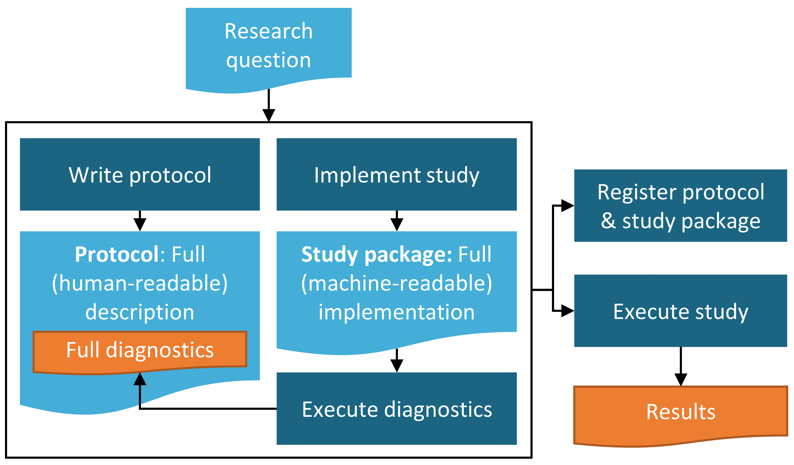

# (PART) OHDSI研究 {.unnumbered}

# 研究の段階 {#StudySteps}

*著者: Sara Dempster & Martijn Schuemie*

ここでは、OHDSIツールを用いた観察研究のデザインと実施に関する一般的な段階的ガイドを提供することを目的としています。研究プロセスの各段階を個別に説明し、その後、一般的な手順を説明し、場合によっては、OHDSIの書の前の章で説明した主な研究タイプ（1）特性評価、（2）集団レベルの推定（PLE）、（3）患者レベルの予測（PLP）の特定の側面について議論します。そのため、前章で取り上げた多くの要素を、初心者にも理解できる形で統合します。同時に、この章は、必要に応じて他の章でより詳細な資料をさらに深く追求するオプションとともに、実践的な高度な説明を求める読者にとって、独立した章としても利用できます。最後に、いくつかの重要な例を随所で示します。

さらに、OHDSIコミュニティが推奨する観察研究のためのガイドラインとベストプラクティスを要約します。ここで取り上げる原則のいくつかは、観察研究のための他の多くのガイドラインにも見られるベストプラクティス推奨事項と共通する一般的なものです。一方、他の推奨プロセスは、OHDSIフレームワークにより特化したものです。したがって、OHDSIツールスタックによって可能となるOHDSI固有のアプローチを強調します。

本章では、OHDSIツール、R、SQLのインフラが読者にとって利用可能であることを前提としているため、本章ではこのインフラのセットアップに関する側面については一切説明しません（第 \@ref(OhdsiAnalyticsTools) 章 )および第 \@ref(SqlAndR) 章 を参照）。また、読者はOMOP CDMのデータベースを使用して、主に自身の施設でデータを対象とした研究を実施することに関心を持っているものと想定しています（OMOP ETLについては第 \@ref(ExtractTransformLoad) 章を参照）。ただし、以下で説明するように研究パッケージが準備されれば、原則として他の施設に配布して実施することも可能であることを強調しておきます。OHDSIネットワーク研究の実施に関する追加的な考慮事項（組織および技術的な詳細を含む）については、第 \@ref(NetworkResearch) 章で詳しく説明します。

## 一般的なベストプラクティスガイドライン

### 観察研究の定義

観察研究とは、定義上、患者は単に観察されるだけで、特定の患者の治療に介入する試みは行われない研究である。 時には、レジストリ研究のように特定の目的のために観察データが収集されることもあるが、多くの場合、これらのデータは、特定の研究課題以外の何らかの目的のために収集される。 後者のタイプのデータとしてよく見られる例としては、電子カルテ（EHR）や保険請求データなどがある。観察研究は、データの二次利用とよく呼ばれます。 観察研究を実施する際の基本的な指針は、研究の疑問を明確に説明し、研究実施前にアプローチを完全に特定することです。 この点において、観察研究は臨床試験と変わりません。ただし、臨床試験では、特定の疑問に対する答えを主目的として、通常は治療介入の有効性および/または安全性に関する疑問について、患者を募集し、追跡調査します。観察研究で採用される分析方法が臨床試験で使用されるものとは異なる点は数多くあります。とりわけ、PLEの観察研究では無作為化が行われないため、因果関係の推論を行うことを目的とする場合は交絡因子を制御するアプローチが必要となります（OHDSIが支援するPLEの研究デザインや多くの特性について集団をバランスさせることにより観察された交絡因子を排除する方法など、詳細については、第 \@ref(PopulationLevelEstimation) 章および第 \@ref(MethodValidity) 章を参照ください。

### 事前に規定した研究デザイン

観察研究のデザインとパラメータの事前規定は、望ましい結果を得るために無意識または意識的にアプローチを進化させて、さらなるバイアスをもたらすことを避けるために極めて重要です。この傾向は、p-ハッキングと呼ばれることもあります。EHRや保険請求データなどのデータは、時に研究者に無限の可能性を感じさせ、調査の方向性を迷走させることがあります。そのため、データの二次利用では、一次利用よりも研究の詳細を事前に完全に規定しない誘惑が強くなります。したがって、既存のデータが容易に入手できるように見える場合でも、科学的な調査の厳格な構造を維持することが重要となります。事前規定の原則は、最終的に臨床実践や規制上の決定に影響を与える可能性があるため、厳格な結果や再現可能な結果を確保する上で、PLE や PLP において特に重要です。探索的な理由のみで実施される特性研究の場合でも、詳細に規定された計画を策定することが望ましいです。そうでなければ、進化する研究デザインや分析プロセスを文書化、説明、再現することが困難になります。

### プロトコル

\index{プロトコル}

観察研究計画は、研究実施前に作成されるプロトコルという形式で文書化されるべきです。少なくとも、プロトコルには、主要な研究課題、アプローチ、およびその課題に対する回答に用いられる評価基準が記載されます。研究対象集団は、他の研究者が完全に再現できる程度に詳細に記述されるべきです。さらに、すべての方法または統計手順、評価基準、表、グラフなどの予想される研究結果の形式が記述されるべきです。プロトコルには、研究の実行可能性や統計的パワーを評価するための事前分析のセットが記載されることがよくあります。さらに、プロトコルには、感度分析と呼ばれる主要な研究課題のバリエーションに関する記述が含まれる場合もあります。 感度分析は、研究デザインの選択が研究結果全体に及ぼす潜在的な影響を評価するために設計されており、可能な限り事前に記述されるべきです。 時には、プロトコルが完了した後で、予期せぬ問題が発生し、プロトコルの修正が必要になる場合があります。 このような事態が生じた場合、プロトコル自体に変更内容と変更理由を記録することが極めて重要です。特に、PLEまたはPLPの場合、完成した研究プロトコルは、独立したプラットフォーム（clinicaltrials.govやOHDSIのstudyProtocols sandboxなど）に記録することが理想的です。そうすれば、そのバージョンや修正をタイムスタンプ付きで個別に追跡することができます。また、研究実施前に、機関またはデータソースの所有者がプロトコルの確認と承認を行う機会を必要とする場合もよくあります。

### 標準化された分析

OHDSIのユニークな利点は、観察研究で繰り返し尋ねられる質問（第 \@ref(WhereToBegin) 、 \@ref(DataAnalyticsUseCases)、\@ref(Characterization)、\@ref(PopulationLevelEstimation)、 \@ref(PatientLevelPrediction) 章）は、実際にはいくつかの主要なカテゴリーに分類できることを認識し、繰り返される側面を自動化することでプロトコル開発と研究実施プロセスを合理化するツールのサポート方法にあります。多くのツールは、遭遇するであろう大半の使用事例に対応する少数の研究デザインまたは評価基準をパラメータ化するように設計されています。例えば、研究者は研究対象集団と少数の追加パラメータを指定し、異なる薬剤および/またはアウトカムについて反復的に多数の比較研究を実施します。研究者の質問が一般的なテンプレートに当てはまる場合、研究対象集団やプロトコルに必要なその他のパラメータの基本的な記述の多くを自動生成する方法があります。歴史的に、これらのアプローチはOMOP実験から着想を得たもので、多くの異なる研究デザインやパラメータを反復することで、観察研究デザインが薬剤と有害事象の既知の因果関係をどの程度再現できるかを評価しようとするものです。

OHDSIのアプローチは、これらのステップを共通の枠組みとツール内で比較的簡単に実行できるようにすることで、プロトコル内に実行可能性と研究診断を含めることをサポートします（下記セクション \@ref(Feasibility) を参照）。

### 研究パッケージ

\index{研究パッケージ}

標準化されたテンプレートやデザインのもう一つの利点は、研究者がプロトコルの形で研究が完全に詳細に記述されていると考えていても、研究を実行するための完全なコンピュータコードを生成するには、実際には十分に指定されていない要素があるかもしれないということです。OHDSIフレームワークによって可能になる関連の基本原則は、コンピュータコードの形で文書化された、完全に追跡可能で再現可能なプロセスを生成することであり、これはしばしば「研究パッケージ」と呼ばれます。OHDSIのベストプラクティスは、このようなスタディパッケージをgit環境で記録することです。このスタディパッケージには、コードベースのすべてのパラメータとバージョンスタンプが含まれています。前述の通り、観察研究は公衆衛生の決定や政策に影響を与える可能性のある質問を投げかけることが多いものです。したがって、調査結果にもとづいて行動を起こす前に、異なる研究者によって複数の環境で調査を再現することが理想的です。このような目標を達成する唯一の方法は、調査を完全に再現するために必要なすべての詳細を明確にマッピングし、推測や誤解釈に委ねないことです。このベストプラクティスをサポートするために、OHDSIツールは、書面による文書形式のプロトコルをコンピュータまたは機械で読み取り可能な調査パッケージに変換するのを支援するように設計されています。このフレームワークのトレードオフとして、すべてのユースケースやカスタマイズされた分析が既存のOHDSIツールで容易に処理できるわけではないという点が挙げられます。しかし、コミュニティが成長し進化するにつれ、より幅広いユースケースに対応する機能が追加されています。コミュニティに関わる人であれば誰でも、新しいユースケースに基づく新しい機能についての提案を行うことができます。

### CDMに基づくデータ

OHDSIの研究は、観察データベースがOMOP共通データモデル（CDM）に変換されることを前提としています。OHDSIのすべてのツールや下流の解析ステップでは、データ表現がCDMの仕様を満たしているという前提を置いています（第 \@ref(CommonDataModel) 章を参照）。したがって、この前提を満たすためのETLプロセス（第 \@ref(ExtractTransformLoad) 章を参照）が、特定のデータソースについて十分に文書化されていることも重要です。このプロセスは、アーティファクトや異なるサイト間のデータベース間の差異をもたらす可能性があるためです。OMOP CDMの目的は、サイト固有のデータ表現を減らす方向に向かうことですが、これは完璧なプロセスからはほど遠く、コミュニティが改善を求めている困難な領域です。したがって、研究を実施する際には、自施設またはネットワーク研究を実施する際には外部施設において、OMOP CDMに変換されたソースデータに精通している人々と協力することが重要です。

CDMに加えて、OMOP標準ボキャブラリシステム（第 \@ref(StandardizedVocabularies) 章）も、OHDSIフレームワークを使用してさまざまなデータソース間の相互運用性を実現する上で重要な要素です。標準ボキャブラリは、他のすべてのソースボキャブラリシステムがマッピングされる各ボキャブラリドメイン内の標準コンセプトセットを定義しようとするものです。これにより、薬剤、診断、処置について異なるソースボキャブラリシステムを持つ2つの異なるデータベースでも、CDMに変換されると比較可能になります。OMOPの用語集には、特定のコホート定義に適切なコードを特定する際に役立つ階層構造も含まれています。 繰り返しになりますが、OMOP CDMへのデータベースの電子タグ付け（ETLing）とOMOP用語集の使用によるメリットを最大限に享受するためには、用語集のマッピングを実施し、下流のクエリでOMOP標準ボキャブラリのコードを使用することが推奨されます。

## 詳細な研究手順

### 問いを定義する

最初のステップは、研究の関心を、観察研究で対処できる正確な質問に変換することです。たとえば、あなたが臨床の糖尿病研究者で、2 型糖尿病 (T2DM) の患者に提供されるケアの質を調査したいとします。この大きな目的を、第 \@ref(DataAnalyticsUseCases) 章で最初に説明した3 つのタイプの質問のいずれかに該当する、はるかに具体的な質問に分解できます。

特性評価調査では、「特定の医療環境において、軽度のT2DM患者と重度のT2DM患者に対する処方方法は、現在推奨されている内容に適合しているか？」という問いにすることができます。この問いは、特定の治療法の有効性について、他の治療法との相対的な因果関係を問うものではありません。これは、既存の一連の臨床ガイドラインと比較して、データベース内の処方慣行を単に特性評価するものです。

また、T2DM治療の処方ガイドラインが、T2DMと心臓病の両方を患っている患者のような特定の患者群にとって最適であるかどうかについても疑問に思うかもしれません。このような疑問は、PLE研究に置き換えることができます。具体的には、心不全などの心血管系イベントの予防における2種類の異なるT2DM治療薬の有効性を比較する問いとすることができます。異なる薬剤を投与されている2つのコホートで心不全による入院の相対リスクを調べる研究を計画することもできますが、両方のコホートはT2DMと心臓病の診断を受けているものとします。

あるいは、軽度のT2DMから重度のT2DMへと進行する患者を予測するモデルを開発することもできます。これはPLPの問いとして設定でき、重度のT2DMへの移行リスクが高い患者を特定して、より注意深いケアを行うのに役立ちます。

純粋に実用的な観点から、研究の問いを定義するには、問いに答えるために必要なアプローチがOHDSIツールセット内の利用可能な機能に適合するかどうかを評価する必要もあります（現在のツールで対応可能な質問タイプの詳しい説明については、第 \@ref(DataAnalyticsUseCases) 章を参照ください）。もちろん、独自の分析ツールを設計したり、現在利用可能なツールを修正して、他の質問に答えることも常に可能です。

### データの可用性と質を確認する

特定の研究課題に着手する前に、データの質を確認し（第 \@ref(DataQuality) 章を参照）、どのフィールドにデータが入力され、そのデータがどのケア設定をカバーしているかという観点から、特定の医療観察データベースの性質を十分に理解することが推奨されます。これにより、特定のデータベースでは研究課題が実行不可能となる可能性がある問題を迅速に特定することができます。以下では、発生する可能性のある一般的な問題をいくつか指摘します。

軽度のT2DMから重度のT2DMへの進行を予測するモデルを開発するという、上記の例に戻りましょう。理想的には、T2DMの重症度は、患者の血糖値を過去3ヶ月間の平均値で反映する検査室での測定値であるグリコヘモグロビン（HbA1c）値を検査することで評価できるでしょう。これらの値は、すべての患者で利用できるとは限らないでしょう。患者の一部でも利用できない場合は、T2DMの重症度に関する他の臨床的基準を特定し、代わりに使用できるかどうかを検討する必要があります。あるいは、HbA1c値が患者の一部のみで利用できる場合、この一部のみに焦点を当てることで、研究に望ましくないバイアスが生じないかどうかを評価する必要もあります。欠損データの追加的な議論については、第 \@ref(DataAnalyticsUseCases) 章を参照ください。

もう一つの一般的な問題は、特定のケア環境に関する情報の不足です。上述のPLEの例では、推奨された結果は心不全による入院でした。特定のデータベースに入院患者の情報が全く含まれていない場合、異なる2型糖尿病治療アプローチの有効性比較をするには、別の結果を考慮する必要があるかもしれません。他のデータベースでは外来患者の診断データが利用できない場合もあり、その場合はコホート設計を考慮する必要があります。

### 研究対象集団

研究対象集団または対象集団を定義することは、あらゆる研究における基本的なステップです。観察研究では、関心のある研究対象集団を代表するグループをコホートと呼んでいます。コホートに選択されるために必要な患者特性は、臨床的疑問に関連する研究対象集団によって決定されます。単純なコホートの例としては、18歳以上の患者で、かつ医療記録にT2DMの診断コードがある患者が挙げられます。このコホート定義には、AND論理で結合された2つの基準があります。多くの場合、コホート定義には、より複雑な入れ子状のブール論理や、特定の研究期間や患者のベースライン期間に必要な期間などの追加の時間的基準で結合された、さらに多くの基準が含まれています。

洗練されたコホート定義を作成するには、適切な科学文献のレビューと、特定のデータベースの解釈における課題を理解している臨床および技術の専門家からの助言が必要となります。観察データを使用する際には、これらのデータは患者の病歴の完全な全体像を提供するものではなく、むしろ、情報の記録時に生じるヒューマンエラーやバイアスによって正確性が損なわれる可能性のある、ある時点におけるスナップショットであることを念頭に置くことが重要です。特定の患者は、観察期間と呼ばれる限られた期間のみ追跡されることがあります。特定のデータベースやケア環境、研究対象の疾患や治療について、臨床研究者は最も一般的なエラーの原因を回避するための提案を行うことができます。わかりやすい例を挙げると、T2DM患者の特定における一般的な問題として、T1DM患者がT2DMの診断コードで誤って分類されることがあります。T1DM患者は基本的に異なるグループであるため、T2DM患者を調査対象とする研究にT1DM患者グループが意図せず含まれてしまうと、結果が歪められてしまう可能性があります。T2DMコホートの定義を厳密に行うためには、T1DM患者が誤って表現されることを避けるために、糖尿病治療としてインスリンの処方のみを受けた患者を除外することが望ましいでしょう。しかし同時に、単に医療記録にT2DMの診断コードを持つすべての患者の特徴に興味がある場合もあるでしょう。この場合、誤ってT1DMとコード化された患者を除外しようとして、さらに条件を追加することは適切ではないかもしれません。

調査対象集団の定義が説明されたら、OHDSIツールのATLASは、関連するコホートを作成するのに適した出発点となります。ATLASとコホート生成プロセスについては、第[8章](https://ohdsi.github.io/TheBookOfOhdsi/OhdsiAnalyticsTools.html#OhdsiAnalyticsTools)および[第10章](https://ohdsi.github.io/TheBookOfOhdsi/Cohorts.html#Cohorts)で詳しく説明されています。簡単に説明すると、ATLASは、詳細な包含基準を定義してコホートを生成するためのユーザーインターフェース（UI）を提供します。ATLASでコホートが定義されると、ユーザーはプロトコルに組み込むために、その詳細な定義を人間が読める形式で直接エクスポートすることができます。何らかの理由でATLASインスタンスが観察医療データベースに接続されていない場合でも、ATLASを使用してコホート定義を作成し、その基礎となるSQLコードを直接エクスポートして、SQLデータベースサーバー上で個別に実行される研究パッケージに組み込むことができます。ATLASを直接使用することが可能な場合は、ATLASの使用をお勧めします。なぜなら、ATLASは、コホート定義のSQLコード作成以上の利点を提供しているからです（下記参照）。最後に、まれに、ATLAS UIでコホート定義を実装できず、手動でカスタムSQLコードを必要とする場合もあります。

ATLAS UIでは、多数の選択基準に基づくコホートの定義が可能です。コホートへの登録・除外の基準、およびベースラインの基準は、OMOP CDMのあらゆるドメイン（条件、薬剤、処置など）に基づいて定義することができます。各ドメインには標準コードを指定する必要があります。さらに、これらのドメインに基づく論理フィルタ、および研究期間を定義する時間ベースのフィルタ、ベースラインの時間枠をATLAS内で定義することができます。ATLASは、各基準のコードを選択する際に特に役立ちます。ATLASには、コホート定義に必要なコードセットを構築するために使用できる用語集ブラウジング機能が組み込まれています。この機能はOMOP標準用語集のみに依存しており、用語集階層内のすべての派生語を含めるオプションがあります（第[5章](https://ohdsi.github.io/TheBookOfOhdsi/StandardizedVocabularies.html#StandardizedVocabularies)を参照）。この機能を使用するには、ETL プロセス（第[6章](https://ohdsi.github.io/TheBookOfOhdsi/ExtractTransformLoad.html#ExtractTransformLoad)参照）中にすべてのコードが標準コードに適切にマッピングされている必要があります。 包含基準で使用する最適なコードセットが明確でない場合は、コホート定義で探索的分析を行うことが妥当である場合があります。 あるいは、異なるコードセットを使用してコホートを定義するさまざまな可能性を考慮するために、より正式な感度分析を検討することもできます。

ATLASがデータベースに接続するように適切に設定されている場合、定義されたコホートを生成するためのSQLクエリはATLAS内で直接実行することができます。ATLASは各コホートに一意のIDを自動的に割り当て、このIDは将来の使用のためにバックエンドデータベースでコホートを直接参照するのにも使用できます。コホートはATLAS内で直接使用して発生率調査を実行することもできますし、PLEまたはPLP調査パッケージ内のコードを使用してバックエンドデータベースで直接指定することもできます。特定のコホートについて、ATLASは、そのコホートに属する個人の患者ID、インデックス日付、コホート離脱日のみを保存します。この情報があれば、特性評価、PLEまたはPLP研究に必要な患者の基本属性や共変量など、その他のすべての属性や共変量を導き出すのに十分です。

コホートが作成されると、患者の人口統計学的特性の要約と、最も頻繁に観察された薬剤や状態の頻度を、デフォルトでATLAS内で直接作成し、表示することができます。

実際には、ほとんどの研究では、複数のコホートまたは複数のコホートセットを指定し、それらをさまざまな方法で比較して新たな臨床的洞察を得る必要があります。PLEおよびPLPでは、OHDSIツールがこれらの複数のコホートを定義するための構造化されたフレームワークを提供します。例えば、PLEの有効性の比較研究では、通常、少なくとも3つのコホート、すなわち、対象コホート、比較対象、アウトカムコホートを定義します（第[12章](https://ohdsi.github.io/TheBookOfOhdsi/PopulationLevelEstimation.html#PopulationLevelEstimation)を参照）。さらに、完全な PLE の有効性の比較研究を実施するには、ネガティブコントロールアウトカムとポジティブコントロールアウトカムを持つコホートも必要となります。OHDSI ツールセットは、これらのネガティブコントロールおよびポジティブコントロールコホートの生成を迅速化し、場合によっては自動化する方法を提供します。この点については、第 [18 章](https://ohdsi.github.io/TheBookOfOhdsi/MethodValidity.html#MethodValidity)で詳しく説明しています。

最後に、研究のためのコホートを定義する際には、OHDSIコミュニティで進行中の、頑健で検証済みの表現型のライブラリを定義する作業が役立つ可能性があります。表現型とは、本質的にはエクスポート可能なコホート定義のことです。これらの既存のコホート定義のいずれかが研究に適している場合、ATLASインスタンスにjsonファイルをインポートすることで、正確な定義を取得することができます。

### 実施可能性と診断 {#Feasibility}

\index{study feasibility!single study} \index{study diagnostics}

コホートが定義され生成されたら、利用可能なデータソースで研究の実行可能性を検討するためのより正式なプロセスを実施し、その調査結果を最終的なプロトコルに要約することができます。研究の実行可能性の評価には、多くの探索的かつ時には反復的な活動が含まれる場合があります。ここでは、いくつかの一般的な側面について説明します。

この段階における主な活動は、生成したコホートが希望する臨床的特性と一致していることを確認し、予期せぬ特性があればそれを指摘するために、コホート内の特性の分布を徹底的に調査することです。上記の2型糖尿病の例に戻ると、この単純な2型糖尿病コホートを、受けた他のすべての診断の頻度を再検討して特徴づけることで、1型糖尿病患者やその他の予期せぬ問題を抱える患者も捕捉しているという問題を指摘できる可能性があります。このようなステップを、コホート定義の臨床的妥当性の品質チェックとして、研究プロトコルに新たにコホートを特徴づける段階として組み込むことは、良い方法です。実施の観点では、この最初のステップを実行する最も簡単な方法は、ATLASでコホートが作成された際にデフォルトで生成される可能性のあるコホートの人口統計および主要な薬剤や疾患を調査することでしょう。ATLAS内で直接コホートを作成するオプションが利用できない場合は、手動でSQLを実行するか、R機能抽出パッケージを使用してコホートを特徴付けることができます。実際には、より大規模な PLE 研究や PLP 研究では、これらのステップを特徴抽出ステップとともに研究パッケージに組み込むことができます。

PLE や PLP の実行可能性を評価するもう一つの一般的な重要なステップは、対象コホートと比較対照コホートにおけるコホート規模とアウトカムのカウントの評価です。ATLAS の発症率機能を使用してこれらのカウントを特定し、他の箇所で説明されているように、検出力計算を行うことができます。

PLE研究に強く推奨されるもう一つのオプションは、傾向スコア（PS）のマッチング手順と関連する診断を完了し、対象グループと比較対照グループの集団間に十分な重複があることを確認することです。これらの手順については、第[12章](https://ohdsi.github.io/TheBookOfOhdsi/PopulationLevelEstimation.html#PopulationLevelEstimation)で詳しく説明されています。さらに、これらの最終的にマッチングされたコホートを使用して、統計的有効性を計算することができます。

OHDSIコミュニティでは、利用可能なサンプルサイズを考慮した最小検出相対リスク（MDRR）を報告した上で研究を実施し、その後に統計的有効性を検証するケースもあります。このアプローチは、多数のデータベースやサイトを対象とした自動化された研究をハイスループットで実施する場合に、より有用である可能性があります。このシナリオでは、任意のデータベースにおける研究の有効性は、事前フィルタリングよりもすべての分析が完了した後に検証する方が適切であると考えられます。

### プロトコルと研究パッケージの最終化

これまでのすべてのステップの準備が完了したら、最終的なプロトコルをまとめます。このプロトコルには、詳細なコホートの定義と研究デザイン情報を含めるべきであり、ATLASからエクスポートすることが理想的です。付録[D](https://ohdsi.github.io/TheBookOfOhdsi/ProtocolTemplate.html#ProtocolTemplate)では、PLE研究のフルプロトコルのサンプル目次を提供しています。この目次は、OHDSI githubでも入手できます。このサンプルは、包括的なガイドおよびチェックリストとして提供していますが、一部のセクションは、お客様の研究には関連しない場合もあります。

図 [19.1](https://ohdsi.github.io/TheBookOfOhdsi/StudySteps.html#fig:studyProcess) に示されているように、人間が読める形式での最終的な研究プロトコルの作成は、最終的な研究パッケージに組み込まれるすべての機械可読の研究コードの準備と並行して行う必要があります。 これらの後者のステップは、以下の図では研究実施と呼ばれています。 これには、ATLAS からの最終的な研究パッケージのエクスポートや、必要に応じてカスタムコードを開発することが含まれます。

その後、完成したスタディパッケージを使用して、プロトコルに記載されている予備診断ステップのみを実行することができます。例えば、2つの治療法の有効性の比較をする新規ユーザーコホートを用いたPLE研究の場合、予備的な研究診断ステップの実行には、コホートの作成、傾向スコアの作成、照合を行い、対象集団と比較対照集団が研究実施に十分な重複性を有していることを確認する必要があります。これが決定されると、照合された対象コホートと比較対照コホートをアウトカムコホートと交差させて検出力計算を行い、アウトカムのカウントを取得し、この計算結果をプロトコルに記載することができます。これらの診断結果に基づいて、最終的な結果モデルの実行に進むかどうかを決定することができます。特性評価やPLP研究では、この段階で同様のステップを完了する必要がある場合がありますが、ここではすべてのシナリオを概説するわけではありません。

重要なのは、この段階で最終的なプロトコルを臨床協力者や利害関係者に確認してもらうことを推奨します。

```{r studyProcess, fig.cap='研究プロセスのダイアグラム',echo=FALSE, out.width='90%', fig.align='center'}

```

### 研究の実施

これまでのすべてのステップが完了すれば、試験の実施は理想的には単純明快なはずです。もちろん、プロトコルに記載された方法やパラメータに忠実であるかを確認するために、コードやプロセスをレビューする必要があります。また、研究パッケージをテストおよびデバッグし、自身の環境で適切に実行されることを確認する必要があるかもしれません。

### 解釈と報告

サンプルサイズが十分で、データの質も妥当な、よく定義された研究では、結果の解釈は多くの場合、単純明快です。同様に、最終結果の記述以外の最終報告書の作成作業のほとんどはプロトコールの計画と作成時に完了しているため、報告書や出版用原稿の最終的な記述も多くの場合、単純明快です。

しかし、解釈がより困難になり、慎重なアプローチが必要となる一般的な状況もいくつかあります。

1.  サンプルサイズが有意性の境界線上にある場合、信頼区間が大きくなる

2.  PLEに特異的な場合：ネガティブコントロールを用いたp値のキャリブレーションにより、大幅なバイアスが明らかになる可能性がある

3.  研究実施中に予期せぬデータ品質の問題が明らかになる

どのような研究においても、上記の懸念事項について報告し、それに応じて研究結果の解釈を修正するかどうかは、研究者の裁量に委ねられます。プロトコル開発プロセスと同様に、最終報告書の発表や論文投稿の前に、臨床専門家や利害関係者による研究結果と解釈のレビューを行うことを推奨します。

## まとめ

```{block2, type='rmdsummary'}
- 研究には明確に定義された問いを検討すべきです。
- データの品質、完全性、関連性の事前チェックを適切に行いましょう。
- 可能であれば、プロトコルの開発プロセスにソースデータベースの専門家を含めることを推奨します。
- 事前にプロトコルに研究計画を記載します。
- 書面によるプロトコルと並行して研究パッケージコードを生成し、最終的な研究を実行する前に、実行可能性や診断を行い、記述しましょう。
- 研究は実施に先立ち登録し、必要に応じて承認を得るべきです。
- 最終報告書または論文の原稿は、臨床専門家やその他の関係者による査読を受けるべきです。

```
