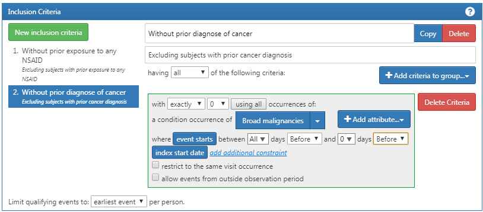
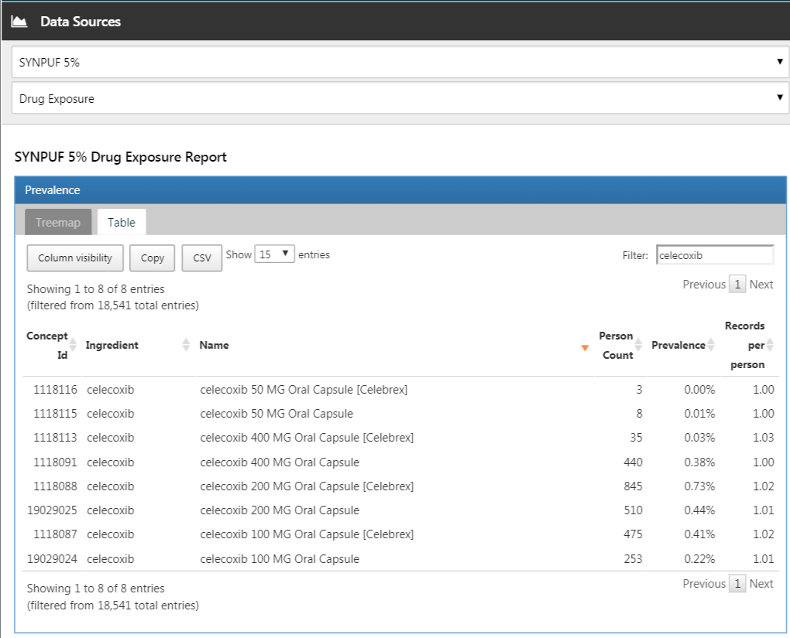
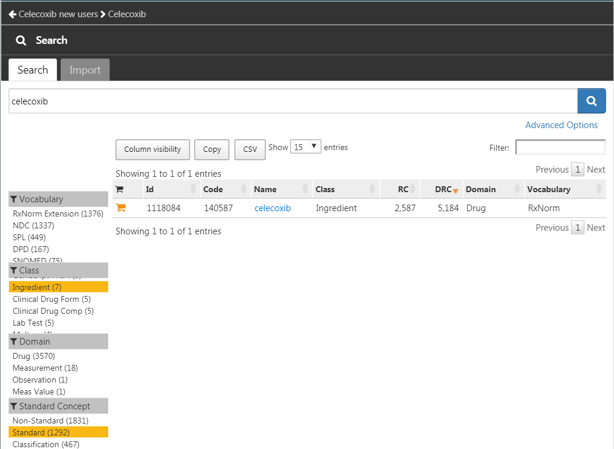
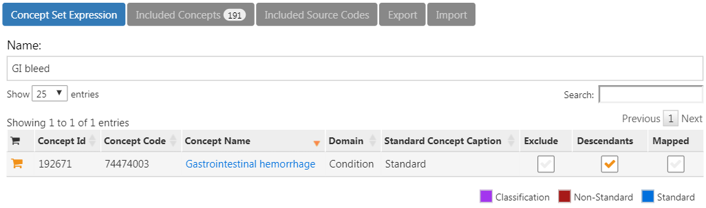
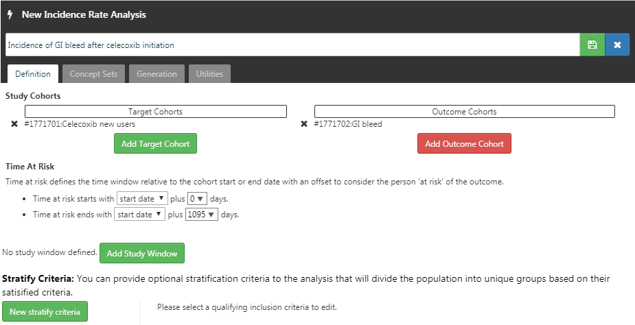
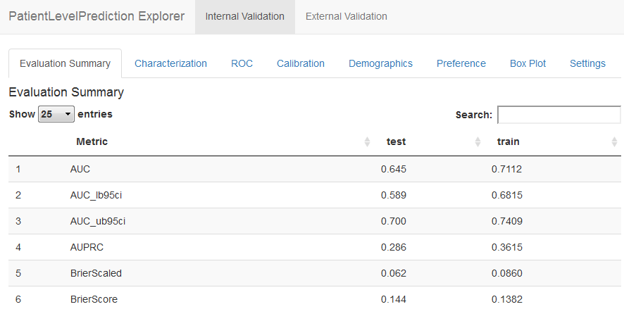

# --翻訳作業中--　回答例 {#SuggestedAnswers}

この付録には、本書の演習に対する回答例が含まれています。

## 共通データモデル {#Cdmanswers}

#### 演習 \@ref(exr:exerciseJohnPerson) {-}

演習で説明されている内容に基づいて、ジョンのレコードは表 \@ref(tab:johnPerson) のようになるはずです。

Table: (\#tab:johnPerson) PERSONテーブル。

カラム名|値|説明
:---------------------|:-----------|:--------------------------------------
|PERSON_ID|2|一意の整数。|
|GENDER_CONCEPT_ID|8507|男性のコンセプト ID は [8507](http://athena.ohdsi.org/search-terms/terms/8507)。|
|YEAR_OF_BIRTH|1974||
|MONTH_OF_BIRTH|8||
|DAY_OF_BIRTH|4||
|BIRTH_DATETIME|1974-08-04 00:00:00|時間が不明な場合は真夜中（00:00:00）を使用。|
|DEATH_DATETIME|NULL||
|RACE_CONCEPT_ID|8516|アフリカ系アメリカ人のコンセプト ID は [8516](http://athena.ohdsi.org/search-terms/terms/8516)。|
|ETHNICITY_ CONCEPT_ID|38003564| [38003564](http://athena.ohdsi.org/search-terms/terms/38003564) は「ヒスパニックではない」ことを示す。|
|LOCATION_ID||住所は不明。|
|PROVIDER_ID||主治医が不明。|
|CARE_SITE||主治療施設が不明。|
|PERSON_SOURCE_ VALUE|NULL|提供されていない。|
|GENDER_SOURCE_ VALUE|Man|説明で使用されたテキスト。|
|GENDER_SOURCE_ CONCEPT_ID|0||
|RACE_SOURCE_ VALUE|African American|説明で使用されたテキスト。|
|RACE_SOURCE_ CONCEPT_ID|0||
|ETHNICITY_SOURCE_ VALUE|NULL||
|ETHNICITY_SOURCE_ CONCEPT_ID|0||

#### 演習 \@ref(exr:exerciseJohnOp) {-}

演習で説明されている内容に基づいて、ジョンのレコードは表 \@ref(tab:johnOp) のようになるはずです。

Table: (\#tab:johnOp) OBSERVATION_PERIODテーブル。

カラム名|値|説明
:----------------------|:----------|:--------------------------------------
|OBSERVATION_ PERIOD_ID|2|一意の整数。|
|PERSON_ID|2|これはPERSONテーブルのジョンのレコードへの外部キー。|
|OBSERVATION_PERIOD_ START_DATE|2015-01-01|加入日の日付。|
|OBSERVATION_PERIOD_ END_DATE|2019-07-01|データ抽出日以降のデータは期待されない。|
|PERIOD_TYPE_ CONCEPT_ID|44814722| [44814724](http://athena.ohdsi.org/search-terms/terms/44814722) は「保険加入期間」を示す。|

#### 演習 \@ref(exr:exerciseJohnDrug) {-}

演習で説明されている内容に基づいて、ジョンのレコードは表 \@ref(tab:johnDrug) のようになるはずです。

Table: (\#tab:johnDrug) DRUG_EXPOSUREテーブル。

カラム名|値|説明
:---------------------|:-----------|:--------------------------------------
|DRUG_EXPOSURE_ID|1001|一意の整数。|
|PERSON_ID|2|これはPERSONテーブルのジョンのレコードへの外部キー。|
|DRUG_CONCEPT_ID|19078461|提供されたNDCコードは標準コンセプト [19078461](http://athena.ohdsi.org/search-terms/terms/19078461) にマッピングされる。|
|DRUG_EXPOSURE_ START_DATE|2019-05-01|薬物暴露の開始日。|
|DRUG_EXPOSURE_ START_DATETIME|2019-05-01 00:00:00|時間が不明なため真夜中を使用。|
|DRUG_EXPOSURE_ END_DATE|2019-05-31|開始日 + 日数供給に基づく。|
|DRUG_EXPOSURE_ END_DATETIME|2019-05-31 00:00:00|時間が不明なため真夜中を使用。|
|VERBATIM_END_DATE|NULL|提供されていない。|
|DRUG_TYPE_ CONCEPT_ID|38000177| [38000177](http://athena.ohdsi.org/search-terms/terms/38000177) は「処方箋を書いた」ことを示す。|
|STOP_REASON|NULL||
|REFILLS|NULL||
|QUANTITY|NULL|提供されていない。|
|DAYS_SUPPLY|30|演習に記述されている通り。|
|SIG|NULL|提供されていない。|
|ROUTE_CONCEPT_ID|4132161| [4132161](http://athena.ohdsi.org/search-terms/terms/4132161) は「経口」を示す。|
|LOT_NUMBER|NULL|提供されていない。|
|PROVIDER_ID|NULL|提供されていない。|
|VISIT_OCCURRENCE_ ID|NULL|訪問に関する情報は提供されなかった。|
|VISIT_DETAIL_ID|NULL||
|DRUG_SOURCE_ VALUE|76168009520|提供されたNDCコード。|
|DRUG_SOURCE_ CONCEPT_ID|583945| [583945](http://athena.ohdsi.org/search-terms/terms/750264) は薬物源の値を表す (NDCコード「76168009520」)。|
|ROUTE_SOURCE_ VALUE|NULL||

#### 演習 \@ref(exr:exerciseGiBleedRecords) {-}

一連のレコードを見つけるには、CONDITION_OCCURRENCEテーブルをクエリする必要があります：

```{r eval=FALSE}
library(DatabaseConnector)
connection <- connect(connectionDetails)
sql <- "SELECT *
FROM @cdm.condition_occurrence
WHERE condition_concept_id = 192671;"

result <- renderTranslateQuerySql(connection, sql, cdm = "main")
head(result)
```
```{r echo=FALSE,message=FALSE,eval=TRUE}
cat("  CONDITION_OCCURRENCE_ID PERSON_ID CONDITION_CONCEPT_ID ...
1                    4657       273               192671 ...
2                    1021        61               192671 ...
3                    5978       351               192671 ...
4                    9798       579               192671 ...
5                    9301       549               192671 ...
6                    1997       116               192671 ...
")
```

#### 演習 \@ref(exr:exercisePersonSource) {-}

一連のレコードを見つけるには、CONDITION_OCCURRENCEテーブルのCONDITION_SOURCE_VALUEフィールドを使用してクエリを実行する必要があります：

```{r eval=FALSE}
sql <- "SELECT *
FROM @cdm.condition_occurrence
WHERE condition_source_value = 'K92.2';"

result <- renderTranslateQuerySql(connection, sql, cdm = "main")
head(result)
```
```{r echo=FALSE,message=FALSE,eval=TRUE}
cat("  CONDITION_OCCURRENCE_ID PERSON_ID CONDITION_CONCEPT_ID ...
1                    4657       273               192671 ...
2                    1021        61               192671 ...
3                    5978       351               192671 ...
4                    9798       579               192671 ...
5                    9301       549               192671 ...
6                    1997       116               192671 ...
")
```

#### 演習 \@ref(exr:exercisePerson61Records) {-}

この情報はOBSERVATION_PERIODテーブルに保存されています：

```{r eval=FALSE}
library(DatabaseConnector)
connection <- connect(connectionDetails)
sql <- "SELECT *
FROM @cdm.observation_period
WHERE person_id = 61;"

renderTranslateQuerySql(connection, sql, cdm = "main")

```
```{r echo=FALSE,message=FALSE,eval=TRUE}
cat("  OBSERVATION_PERIOD_ID PERSON_ID OBSERVATION_PERIOD_START_DATE ...
1                    61        61                    1968-01-21 ...
")
```


## 標準化された用語集 {#Vocabanswers}

#### 演習 \@ref(exr:exerciseVocab1) {-}

コンセプト ID 192671 ("胃腸出血")

#### 演習 \@ref(exr:exerciseVocab2) {-}

ICD-10CMコード：

- K29.91 "出血を伴う特定されていない胃十二指腸炎"
- K92.2 "特定されていない胃腸出血"

ICD-9CMコード：

- 578 "胃腸出血"
- 578.9 "特定されていない胃腸出血"

#### 演習 \@ref(exr:exerciseVocab3) {-}

MedDRA推奨用語：

- "胃腸出血" (コンセプトID 35707864)
- "腸出血" (コンセプトID 35707858)


## 抽出変換ロード {#Etlanswers}

#### 演習 \@ref(exr:exerciseEtl1) {-}

A) データの専門家とCDMの専門家が協力してETLの設計を行う
C) 医療の知識を持つ人がコードマッピングを作成する
B) 技術者がETLを実装する
D) 全員が品質管理に関与する

#### 演習 \@ref(exr:exerciseEtl2) {-}

カラム | 値 | 解答
:---------------- |:----------- |:-----------------------
PERSON_ID | A123B456 | このカラムは整数型のデータタイプを持っているため、ソースのレコード値を数値に変換する必要がある。
GENDER_CONCEPT_ID | 8532 |
YEAR_OF_BIRTH | NULL | 月や誕生日が不明な場合は、推測しない。月や誕生日がなくても存在できる人です。生年がない人は除外する必要がある。この人は生年がないため除外する必要がある。
MONTH_OF_BIRTH | NULL |
DAY_OF_BIRTH | NULL |
RACE_CONCEPT_ID | 0 | 人種はWHITEであり、これは8527にマッピングされるべき。
ETHNICITY_CONCEPT_ ID | 8527 | 民族性は提供されていないため、これは0にマッピングされるべき。
PERSON_SOURCE_ VALUE | A123B456 |
GENDER_SOURCE_ VALUE | F |
RACE_SOURCE_VALUE | WHITE |
ETHNICITY_SOURCE_ VALUE | NONE PROVIDED |

#### 演習 \@ref(exr:exerciseEtl3) {-}

カラム | 値
:------------------------ |:-------------
VISIT_OCCURRENCE_ID | 1
PERSON_ID | 11
VISIT_START_DATE | 2004-09-26
VISIT_END_DATE | 2004-09-30
VISIT_CONCEPT_ID | 9201
VISIT_SOURCE_VALUE | inpatient


## データ分析のユースケース {#UseCasesanswers}

#### 演習 \@ref(exr:exerciseUseCases1) {-}

1. 特徴量化

2. 患者レベルの予測

3. 集団レベルの推定

#### 演習 \@ref(exr:exerciseUseCases2) {-}

そうではないかもしれません。ジクロフェナク曝露コホートと比較可能な非曝露コホートを定義することは、多くの場合不可能です。なぜなら、人々はジクロフェナクを理由があって摂取するからです。これは人間間の比較を無効にします。ジクロフェナクコホートの各患者に対して曝露されていない時間を特定することで、個人内での比較がある程度可能かもしれませんが、ここでも同様の問題が発生します。こうした時間は比較できないことが多く、ある時間に曝露されている理由と別の時間に曝露されていない理由が異なるからです。

## SQLとR {#SqlAndRanswers}

#### 演習 \@ref(exr:exercisePeopleCount) {-}

人数を計算するには、単純にPERSONテーブルをクエリすればよいです:

```{r eval=FALSE}
library(DatabaseConnector)
connection <- connect(connectionDetails)
sql <- "SELECT COUNT(*) AS person_count
FROM @cdm.person;"

renderTranslateQuerySql(connection, sql, cdm = "main")
```
```{r echo=FALSE,message=FALSE,eval=TRUE}
cat("  PERSON_COUNT
1         2694
")
```

#### 演習 \@ref(exr:exerciseCelecoxibUsers) {-}

セレコキシブの処方を少なくとも1回受けた人の人数を計算するには、DRUG_EXPOSUREテーブルをクエリします。セレコキシブの成分を含むすべての薬剤を見つけるために、CONCEPT_ANCESTORおよびCONCEPTテーブルを結合します:

```{r eval=FALSE}
library(DatabaseConnector)
connection <- connect(connectionDetails)
sql <- "SELECT COUNT(DISTINCT(person_id)) AS person_count
FROM @cdm.drug_exposure
INNER JOIN @cdm.concept_ancestor
  ON drug_concept_id = descendant_concept_id
INNER JOIN @cdm.concept ingredient
  ON ancestor_concept_id = ingredient.concept_id
WHERE LOWER(ingredient.concept_name) = 'celecoxib'
  AND ingredient.concept_class_id = 'Ingredient'
  AND ingredient.standard_concept = 'S';"

renderTranslateQuerySql(connection, sql, cdm = "main")
```
```{r echo=FALSE,message=FALSE,eval=TRUE}
cat("  PERSON_COUNT
1         1844
")
```

`COUNT(DISTINCT(person_id))`を使用して、重複することなく個別の人数を見つけ出すことに注意してください。これは、人が複数の処方薬を持っている場合があるためです。また、検索が「celecoxib」であることを大文字小文字を区別しないように`LOWER`関数を使用していることにも注意してください。

代替方法として、すでに成分レベルにまとめられているDRUG_ERAテーブルを使用することもできます:

```{r eval=FALSE}
library(DatabaseConnector)
connection <- connect(connectionDetails)

sql <- "SELECT COUNT(DISTINCT(person_id)) AS person_count
FROM @cdm.drug_era
INNER JOIN @cdm.concept ingredient
  ON drug_concept_id = ingredient.concept_id
WHERE LOWER(ingredient.concept_name) = 'celecoxib'
  AND ingredient.concept_class_id = 'Ingredient'
  AND ingredient.standard_concept = 'S';"

renderTranslateQuerySql(connection, sql, cdm = "main")
```
```{r echo=FALSE,message=FALSE,eval=TRUE}
cat("  PERSON_COUNT
1         1844
")
```

#### 演習 \@ref(exr:exerciseGiBleedsDuringCelecoxib) {-}

曝露期間中の診断数を計算するには、以前のクエリを拡張してCONDITION_OCCURRENCEテーブルに結合します。消化管出血を意味するすべての状態コンセプトを見つけるために、CONCEPT_ANCESTORテーブルに結合します:

```{r eval=FALSE}
library(DatabaseConnector)
connection <- connect(connectionDetails)
sql <- "SELECT COUNT(*) AS diagnose_count
FROM @cdm.drug_era
INNER JOIN @cdm.concept ingredient
  ON drug_concept_id = ingredient.concept_id
INNER JOIN @cdm.condition_occurrence
  ON condition_start_date >= drug_era_start_date
    AND condition_start_date <= drug_era_end_date
INNER JOIN @cdm.concept_ancestor
  ON condition_concept_id =descendant_concept_id
WHERE LOWER(ingredient.concept_name) = 'celecoxib'
  AND ingredient.concept_class_id = 'Ingredient'
  AND ingredient.standard_concept = 'S'
  AND ancestor_concept_id = 192671;"

renderTranslateQuerySql(connection, sql, cdm = "main")
```
```{r echo=FALSE,message=FALSE,eval=TRUE}
cat("  DIAGNOSE_COUNT
1         41
")
```

この場合、DRUG_EXPOSUREテーブルではなくDRUG_ERAテーブルを使用することが重要です。なぜなら、同じ成分を含む薬物暴露が重なる可能性があり、薬物時期は重ならないからです。これにより重複して数えることを避けられます。例えば、ある人が同時に2つのセレコキシブを含む薬物を受け取った場合、これは2つの薬物暴露として記録され、その期間中に発生する診断は2回カウントされてしまうでしょう。2つの暴露は1つの重ならない薬物時期に統合されます。

## コホートの定義 {#Cohortsanswers}

#### 演習 \@ref(exr:exerciseCohortsAtlas) {-}

以下の要件をエンコードする初期イベント基準を作成します:

- ジクロフェナクの新規使用者
- 16歳以上
- 曝露前に少なくとも365日間の連続観察があること

完了したら、コホートエントリーイベントのセクションは図\@ref(fig:cohortsAtlasInitialEvents)のようになります。

```{r cohortsAtlasInitialEvents, fig.cap='ジクロフェナクの新規使用者向けのコホートエントリーイベント設定',echo=FALSE, out.width='100%', fig.align='center'}
knitr::include_graphics("images/SuggestedAnswers/cohortsAtlasInitialEvents.png")
```

ジクロフェナクのコンセプトセット表現は図\@ref(fig:cohortsAtlasConceptSet1)のようになり、成分「Diclofenac」とそのすべての子孫を含め、ジクロフェナクを含むすべての薬剤を含むようになります。

```{r cohortsAtlasConceptSet1, fig.cap='ジクロフェナクのコンセプトセット表現。',echo=FALSE, out.width='100%', fig.align='center'}
knitr::include_graphics("images/SuggestedAnswers/cohortsAtlasConceptSet1.png")
```

次に、NSAIDの以前の曝露がないことを要求します。これは図\@ref(fig:cohortsAtlasInclusion1)のようになります。

```{r cohortsAtlasInclusion1, fig.cap='NSAIDの以前の曝露なしを要求。',echo=FALSE, out.width='100%', fig.align='center'}
knitr::include_graphics("images/SuggestedAnswers/cohortsAtlasInclusion1.png")
```

NSAIDsのコンセプトセット表現は図\@ref(fig:cohortsAtlasConceptSet2)のようになり、NSAIDsクラスとそのすべての子孫を含め、NSAIDを含むすべての薬剤を含むようになります。

```{r cohortsAtlasConceptSet2, fig.cap='NSAIDsのコンセプトセット表現',echo=FALSE, out.width='100%', fig.align='center'}
knitr::include_graphics("images/SuggestedAnswers/cohortsAtlasConceptSet2.png")
```

さらに、がんの以前の診断がないことも要求します。これは図\@ref(fig:cohortsAtlasInclusion2)のようになります。

```{r cohortsAtlasInclusion2, fig.cap='以前にがんの診断がないことを要求。',echo=FALSE, out.width='100%', fig.align='center'}

```

「広範な悪性腫瘍」のコンセプトセット表現は図\@ref(fig:cohortsAtlasConceptSet3)のようになり、上位コンセプト「悪性腫瘍」とそのすべての子孫を含めます。

```{r cohortsAtlasConceptSet3, fig.cap='広範な悪性腫瘍のコンセプトセット表現',echo=FALSE, out.width='100%', fig.align='center'}
knitr::include_graphics("images/SuggestedAnswers/cohortsAtlasConceptSet3.png")
```

最後に、曝露中止をコホート退出基準として定義します（30日間のギャップを許容します）。これは図\@ref(fig:cohortsAtlasExit)のようになります。

```{r cohortsAtlasExit, fig.cap='コホート終了日の設定。',echo=FALSE, out.width='100%', fig.align='center'}
knitr::include_graphics("images/SuggestedAnswers/cohortsAtlasExit.png")
```

#### 演習 \@ref(exr:exerciseCohortsSql) {-}

読みやすさのためにSQLを2つのステップに分けます。まず、心筋梗塞のすべての状態発生を見つけ、それらを一時テーブル「#diagnoses」に格納します:

```{r eval=FALSE}
library(DatabaseConnector)
connection <- connect(connectionDetails)
sql <- "SELECT person_id AS subject_id,
  condition_start_date AS cohort_start_date
INTO #diagnoses
FROM @cdm.condition_occurrence
WHERE condition_concept_id IN (
    SELECT descendant_concept_id
    FROM @cdm.concept_ancestor
    WHERE ancestor_concept_id = 4329847 -- 心筋梗塞
)
  AND condition_concept_id NOT IN (
    SELECT descendant_concept_id
    FROM @cdm.concept_ancestor
    WHERE ancestor_concept_id = 314666 -- 古い心筋梗塞
);"

renderTranslateExecuteSql(connection, sql, cdm = "main")
```

次に、入院またはER訪問中に発生したものだけを選択し、ユニークなCOHORT_DEFINITION_ID（ここでは「1」を選択しました）を使用します:

```{r eval=FALSE}
sql <- "INSERT INTO @cdm.cohort (
  subject_id,
  cohort_start_date,
  cohort_definition_id
  )
SELECT subject_id,
  cohort_start_date,
  CAST (1 AS INT) AS cohort_definition_id
FROM #diagnoses
INNER JOIN @cdm.visit_occurrence
  ON subject_id = person_id
    AND cohort_start_date >= visit_start_date
    AND cohort_start_date <= visit_end_date
WHERE visit_concept_id IN (9201, 9203, 262); -- 入院またはER;"

renderTranslateExecuteSql(connection, sql, cdm = "main")
```

条件と訪問をVISIT_OCCURRENCE_IDに基づいて結合する代替アプローチも考えられます。この方法は、状態が入院またはER訪問に関連して記録されたことを保証するため、より正確かもしれません。しかし、多くの観察データベースは、訪問と診断のリンクを記録していないため、日付を使用することを選択しました。これにより、感度が高くなりますが、特異度は低くなる可能性があります。

また、ここではコホート終了日は考慮していないことに注意してください。通常、コホートがアウトカムを定義するために使用される場合、興味があるのはコホートの開始日だけであり、（不明確な）コホート終了日を作成する必要はありません。

一時テーブルが不要になったらクリーンアップすることをお勧めします:

```{r eval=FALSE}
sql <- "TRUNCATE TABLE #diagnoses;
DROP TABLE #diagnoses;"

renderTranslateExecuteSql(connection, sql)
```
## 特徴記述 {#Characterizationanswers}

#### 演習 \@ref(exr:exerciseCharacterization1) {-}

ATLASでをクリックし、興味のあるデータソースを選択します。ここでは、薬剤暴露レポートを選択し、「表」タブを選択して「セレコキシブ」を検索します（図 \@ref(fig:dataSourcesAtlas) 参照）。ここでは、この特定のデータベースがセレコキシブのさまざまな製剤の暴露を持っていることがわかります。これらの薬のいずれかをクリックすると、例えば年齢や性別の分布など、より詳細なビューを得ることができます。

```{r dataSourcesAtlas, fig.cap='データソースの特徴記述。',echo=FALSE, out.width='100%', fig.align='center'}

```

#### 演習 \@ref(exr:exerciseCharacterization2) {-}

をクリックして「新しいコホート」を作成します。コホートに意味のある名前（例：「セレコキシブ新規使用者」）を付け、「コンセプトセット」タブに移動します。「新しいコンセプトセット」をクリックし、コンセプトセットに意味のある名前（例：「セレコキシブ」）を付けます。 モジュールを開き、「セレコキシブ」を検索し、クラスを「成分」、標準コンセプトを「標準」とするように制限し、 をクリックしてコンセプトセットにコンセプトを追加します（図 \@ref(fig:conceptSearchAtlas) 参照）。

```{r conceptSearchAtlas, fig.cap='成分「セレコキシブ」の標準コンセプトの選択。',echo=FALSE, out.width='100%', fig.align='center'}

```

図 \@ref(fig:conceptSearchAtlas) の左上に表示されている左矢印をクリックしてコホート定義に戻ります。「+初期イベントを追加」をクリックしてから「薬剤期間を追加」をクリックします。薬剤期間基準のために以前に作成したコンセプトセットを選択します。「属性を追加...」をクリックして「最初の暴露基準を追加」を選択します。インデックス日の前に少なくとも365日の連続観察が必要と設定します。結果は図 \@ref(fig:celecoxibCohortDefinition) のようである必要があります。包括基準、コホート終了、コホート期間のセクションはそのままにします。 をクリックしてコホート定義を保存し、 をクリックして終了します。

```{r celecoxibCohortDefinition, fig.cap='単純なセレコキシブ新規使用者のコホート定義。',echo=FALSE, out.width='100%', fig.align='center'}
knitr::include_graphics("images/SuggestedAnswers/celecoxibCohortDefinition.png")
```

コホートが定義されたので、その特徴を記述できます。をクリックして「新しい特徴記述」を選択します。特徴記述に意味のある名前（例：「セレコキシブ新規使用者の特徴記述」）を付けます。コホート定義の下で、「インポート」をクリックして最近作成したコホート定義を選択します。「特徴分析」の下で、「インポート」をクリックし、少なくとも1つの状態分析と1つの薬剤分析を選択します。たとえば、「任意の期間前の薬剤グループ期間」と「任意の期間前の状態グループ期間」を選択します。特徴記述の定義は図 \@ref(fig:celecoxibCharacterization) のようになっているはずです。 をクリックして特徴記述設定を保存してください。

```{r celecoxibCharacterization, fig.cap='特徴記述設定。',echo=FALSE, out.width='100%', fig.align='center'}
knitr::include_graphics("images/SuggestedAnswers/celecoxibCharacterization.png")
```

「実行」タブをクリックし、1つのデータソースについて「生成」をクリックします。生成が完了するまで時間がかかる場合があります。完了すると、「最新の結果を表示」をクリックできます。結果画面は、例えば痛みや関節症が一般的に観察されることを示しており、これらはセレコキシブの適応症として意外ではないでしょう。リストの下の方には、予期しない状態が表示されることがあります（図 \@ref(fig:celecoxibCharacterizationResults) 参照）。

```{r celecoxibCharacterizationResults, fig.cap='特徴記述結果。',echo=FALSE, out.width='100%', fig.align='center'}
knitr::include_graphics("images/SuggestedAnswers/celecoxibCharacterizationResults.png")
```

#### 演習 \@ref(exr:exerciseCharacterization3) {-}

をクリックして「新しいコホート」を作成します。コホートに意味のある名前（例：「GI出血」）を付け、「コンセプトセット」タブに移動します。「新しいコンセプトセット」をクリックし、コンセプトセットに意味のある名前（例：「GI出血」）を付けます。 モジュールを開き、「消化管出血」を検索し、トップコンセプトの横にあるをクリックしてコンセプトセットにコンセプトを追加します（図 \@ref(fig:giBleedSearch) 参照）。

```{r giBleedSearch, fig.cap='「消化管出血」の標準コンセプトの選択。',echo=FALSE, out.width='100%', fig.align='center'}
knitr::include_graphics("images/SuggestedAnswers/giBleedSearch.png")
```

図 \@ref(fig:giBleedSearch) の左上に表示されている左矢印をクリックしてコホート定義に戻ります。「コンセプトセット」タブを再度開き、GI出血コンセプトの横にある「子孫」をチェックします（図 \@ref(fig:giBleedDescendants) 参照）。

```{r giBleedDescendants, fig.cap='「消化管出血」のすべての子孫を追加。',echo=FALSE, out.width='100%', fig.align='center'}

```

「定義」タブに戻り、「+初期イベントを追加」をクリックしてから「状態出現を追加」をクリックします。状態出現基準のために以前に作成したコンセプトセットを選択します。結果は図 \@ref(fig:giBleedCohortDefinition) のようである必要があります。包括基準、コホート終了、コホート期間のセクションはそのままにします。をクリックしてコホート定義を保存し、 をクリックして終了します。

```{r giBleedCohortDefinition, fig.cap='単純な消化管出血コホート定義。',echo=FALSE, out.width='100%', fig.align='center'}
knitr::include_graphics("images/SuggestedAnswers/giBleedCohortDefinition.png")
```

コホートが定義されたので、発生率を計算できます。をクリックして「新しい分析」を選択します。分析に意味のある名前（例：「セレコキシブ開始後のGI出血発生率」）を付けます。「ターゲットコホートを追加」をクリックし、私たちのセレコキシブ新規使用者コホートを選択します。「アウトカムコホートを追加」をクリックし、新しいGI出血コホートを追加します。リスク期間の終了を開始日から1095日後に設定します。分析は図 \@ref(fig:irAnalysis) のようになっているはずです。をクリックして分析設定を保存してください。

```{r irAnalysis, fig.cap='発生率分析。',echo=FALSE, out.width='100%', fig.align='center'}

```

「生成」タブをクリックし、「生成」をクリックします。1つのデータソースを選択し、「生成」をクリックします。完了すると、計算された発生率と割合が表示されます（図 \@ref(fig:irResults) 参照）。

```{r irResults, fig.cap='発生結果。',echo=FALSE, out.width='100%', fig.align='center'}
knitr::include_graphics("images/SuggestedAnswers/irResults.png")
```
## 集団レベル推定 {#Pleanswers}

#### 演習 \@ref(exr:exercisePle1) {-}

デフォルトの共変量セットを指定しますが、比較している2つの薬物を含むすべての子孫を除外しなければなりません。そうしないと、選択バイアスモデルが完全に予測可能になってしまいます：

```{r eval=FALSE}
library(CohortMethod)
nsaids <- c(1118084, 1124300) # セレコキシブ、ジクロフェナク
covSettings <- createDefaultCovariateSettings(
  excludedCovariateConceptIds = nsaids,
  addDescendantsToExclude = TRUE)

# データの読み込み：
cmData <- getDbCohortMethodData(
  connectionDetails = connectionDetails,
  cdmDatabaseSchema = "main",
  targetId = 1,
  comparatorId = 2,
  outcomeIds = 3,
  exposureDatabaseSchema = "main",
  exposureTable = "cohort",
  outcomeDatabaseSchema = "main",
  outcomeTable = "cohort",
  covariateSettings = covSettings)
summary(cmData)
```

```{r echo=FALSE,message=FALSE,eval=TRUE}
cat("CohortMethodData オブジェクトのまとめ

治療コンセプトID：1
比較コンセプトID：2
結果コンセプトID：3

治療を受けた人数：1800
比較された人数：830

結果のカウント：
  イベントの数 人数
3          479       479

共変量：
共変量の数：389
非ゼロ共変量値の数：26923
")
```

#### 演習 \@ref(exr:exercisePle2) {-}

仕様に従って研究集団を作成し、離脱図を出力します：

```{r eval=FALSE}
studyPop <- createStudyPopulation(
  cohortMethodData = cmData,
  outcomeId = 3,
  washoutPeriod = 180,
  removeDuplicateSubjects = "remove all",
  removeSubjectsWithPriorOutcome = TRUE,
  riskWindowStart = 0,
  startAnchor = "cohort start",
  riskWindowEnd = 99999)
drawAttritionDiagram(studyPop)
```

```{r echo=FALSE, out.width='80%', fig.align='center'}
knitr::include_graphics("images/SuggestedAnswers/attrition.png")
```

ここで、元のコホートと比較して被験者を失わなかったことがわかります。おそらく、ここで使用した制限がすでにコホートの定義に適用されているためです。

#### 演習 \@ref(exr:exercisePle3) {-}

Cox 回帰を使用して単純な結果モデルをフィットさせます：

```{r eval=FALSE}
model <- fitOutcomeModel(population = studyPop,
                         modelType = "cox")
model
```

```{r echo=FALSE,message=FALSE,eval=TRUE}
cat("モデルタイプ：cox
階層化：FALSE
共変量の使用：FALSE
反トリートメント重み付けの使用：FALSE
ステータス：OK

          推定値 下限 .95 上限 .95   ログ相対リスク ログ相対リスクの標準誤差
治療       1.34612    1.10065    1.65741 0.29723    0.1044
")
```

セレコキシブの使用者とジクロフェナクの使用者が同等でない可能性が高く、これらのベースラインの違いによりすでに結果のリスクが異なる可能性があります。この分析のようにこれらの違いを調整しない場合、バイアスのかかった推定値が生成される可能性があります。

#### 演習 \@ref(exr:exercisePle4) {-}

抽出した共変量を使用して、研究集団に対して傾向スコアをフィットさせます。その後、傾向スコアの分布を示します：

```{r eval=FALSE}
ps <- createPs(cohortMethodData = cmData,
               population = studyPop)
plotPs(ps, showCountsLabel = TRUE, showAucLabel = TRUE)
```
```{r echo=FALSE, out.width='80%', fig.align='center'}
knitr::include_graphics("images/SuggestedAnswers/ps.png")
```

この分布が少し奇妙に見えるのは、小さなシミュレーションデータセットを使用しているためです。実際の傾向スコア分布は通常、より滑らかです。

傾向スコアモデルは0.63のAUCを達成し、対象と比較コホートの間に違いがあることを示唆しています。両グループの間にかなりの重複があることがわかり、傾向スコア調整によって両方をより比較可能にすることができます。


#### 演習 \@ref(exr:exercisePle5) {-}

傾向スコアに基づいて集団を層別化し、層別化前後の共変量バランスを計算します：

```{r eval=FALSE}
strataPop <- stratifyByPs(ps, numberOfStrata = 5)
bal <- computeCovariateBalance(strataPop, cmData)
plotCovariateBalanceScatterPlot(bal,
                                showCovariateCountLabel = TRUE,
                                showMaxLabel = TRUE,
                                beforeLabel = "層別化前",
                                afterLabel = "層別化後")
```
```{r echo=FALSE, out.width='70%', fig.align='center'}
knitr::include_graphics("images/SuggestedAnswers/scatter.png")
```

さまざまなベースライン共変量が、層別化前（x軸）に大きな（>0.3）標準化された平均の差を示していることがわかります。層別化後のバランスが向上し、最大標準化された差が<= 0.1です。

#### 演習 \@ref(exr:exercisePle6) {-}

PS層別化で Cox 回帰モデルをフィットさせます：

```{r eval=FALSE}
adjModel <- fitOutcomeModel(population = strataPop,
                         modelType = "cox",
                         stratified = TRUE)
adjModel
```

```{r echo=FALSE,message=FALSE,eval=TRUE}
cat("モデルタイプ：cox
階層化：TRUE
共変量の使用：FALSE
反トリートメント重み付けの使用：FALSE
ステータス：OK

          推定値 下限 .95 上限 .95   ログ相対リスク ログ相対リスクの標準誤差
治療       1.13211    0.92132    1.40008 0.12409    0.1068
")
```

調整後の推定値が未調整の推定値より低くなり、95％信頼区間が1を含むようになったことがわかります。これは、2つの暴露グループ間のベースラインの違いを調整することによって、バイアスを減らしているためです。


## 患者レベル予測 {#Plpanswers}

#### 演習 \@ref(exr:exercisePlp1) {-}

共変量設定のセットを指定し、データベースからデータを抽出するために`getPlpData`関数を使用します：

```{r eval=FALSE}
library(PatientLevelPrediction)
covSettings <- createCovariateSettings(
  useDemographicsGender = TRUE,
  useDemographicsAge = TRUE,
  useConditionGroupEraLongTerm = TRUE,
  useConditionGroupEraAnyTimePrior = TRUE,
  useDrugGroupEraLongTerm = TRUE,
  useDrugGroupEraAnyTimePrior = TRUE,
  useVisitConceptCountLongTerm = TRUE,
  longTermStartDays = -365,
  endDays = -1)

plpData <- getPlpData(connectionDetails = connectionDetails,
                      cdmDatabaseSchema = "main",
                      cohortDatabaseSchema = "main",
                      cohortTable = "cohort",
                      cohortId = 4,
                      covariateSettings = covSettings,
                      outcomeDatabaseSchema = "main",
                      outcomeTable = "cohort",
                      outcomeIds = 3)

summary(plpData)
```
```{r echo=FALSE,message=FALSE,eval=TRUE}
cat("plpData オブジェクトのまとめ

リスク対象コホートコンセプト ID：-1
結果コンセプトID：3

人数：2630

結果のカウント：
  イベントの数 人数
3          479       479

共変量：
共変量の数：245
非ゼロ共変量値の数：54079
")
```

#### 演習 \@ref(exr:exercisePlp2) {-}

プロジェクトに興味のあるアウトカム（この場合は抽出したデータに対して唯一のアウトカム）について調査集団を作成し、NSAIDを使用し始める前にそのアウトカムを経験した被験者を除外し、364日のリスク期間を必要とします：

```{r eval=FALSE}
population <- createStudyPopulation(plpData = plpData,
                                    outcomeId = 3,
                                    washoutPeriod = 364,
                                    firstExposureOnly = FALSE,
                                    removeSubjectsWithPriorOutcome = TRUE,
                                    priorOutcomeLookback = 9999,
                                    riskWindowStart = 1,
                                    riskWindowEnd = 365,
                                    addExposureDaysToStart = FALSE,
                                    addExposureDaysToEnd = FALSE,
                                    minTimeAtRisk = 364,
                                    requireTimeAtRisk = TRUE,
                                    includeAllOutcomes = TRUE)
nrow(population)
```
```{r echo=FALSE,message=FALSE,eval=TRUE}
cat("[1] 2578")
```

この場合、発症前の人々を除外することで数人が失われ、364日以上のリスク期間を要求しています。

#### 演習 \@ref(exr:exercisePlp3) {-}

LASSO モデルを実行するために、まずモデル設定オブジェクトを作成し、その後`runPlp`関数を呼び出します。この場合、データの75％を訓練データとして使用し、25％を評価データとして使用する人ベースの分割を行います：

```{r eval=FALSE}
lassoModel <- setLassoLogisticRegression(seed = 0)

lassoResults <- runPlp(population = population,
                       plpData = plpData,
                       modelSettings = lassoModel,
                       testSplit = 'person',
                       testFraction = 0.25,
                       nfold = 2,
                       splitSeed = 0)
```

この例では、LASSOのクロスバリデーションとトレイン・テスト分割の両方に対してランダムシードを設定し、複数回の実行で結果が同じになるようにします。

Shinyアプリを使用して結果を表示することができます：

```{r eval=FALSE}
viewPlp(lassoResults)
```

これにより、図\@ref(fig:plpShiny)に示すようにアプリが起動されます。ここで、テストセットのAUCが0.645であり、ランダムな推測よりも優れているが、臨床実践には十分ではないかもしれないことがわかります。

```{r plpShiny, fig.cap='患者レベル予測Shinyアプリ。',echo=FALSE, out.width='100%', fig.align='center'}

```
## データ品質 {#DataQualityanswers}

#### 演習 \@ref(exr:exerciseRunAchilles) {-}

ACHILLESを実行するには:

```{r eval=FALSE}
library(ACHILLES)
result <- achilles(connectionDetails,
                   cdmDatabaseSchema = "main",
                   resultsDatabaseSchema = "main",
                   sourceName = "Eunomia",
                   cdmVersion = "5.3.0")
```

#### 演習 \@ref(exr:exerciseRunDQD) {-}

データ品質ダッシュボードを実行するには:

```{r eval=FALSE}
DataQualityDashboard::executeDqChecks(
  connectionDetails,
  cdmDatabaseSchema = "main",
  resultsDatabaseSchema = "main",
  cdmSourceName = "Eunomia",
  outputFolder = "C:/dataQualityExample")
```

#### 演習 \@ref(exr:exerciseViewDQD) {-}

データ品質チェックのリストを見るには:

```{r eval=FALSE}
DataQualityDashboard::viewDqDashboard(
  "C:/dataQualityExample/Eunomia/results_Eunomia.json")
```
