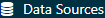

# 回答例 {#SuggestedAnswers}

この付録には、本書の演習に対する回答例が含まれています。

## 共通データモデル {#Cdmanswers}

#### 演習 \@ref(exr:exerciseJohnPerson) {.unnumbered}

演習で説明されている内容に基づくと、ジョンのレコードは表 \@ref(tab:johnPerson) のようになるはずです。

| カラム名 | 値 | 説明 |
|:---|:---|:---|
| PERSON_ID | 2 | 一意の整数。 |
| GENDER_CONCEPT_ID | 8507 | 男性のコンセプト ID は [8507](http://athena.ohdsi.org/search-terms/terms/8507)。 |
| YEAR_OF_BIRTH | 1974 |  |
| MONTH_OF_BIRTH | 8 |  |
| DAY_OF_BIRTH | 4 |  |
| BIRTH_DATETIME | 1974-08-04 00:00:00 | 時間が不明な場合は0時（00:00:00）を使用。 |
| DEATH_DATETIME | NULL |  |
| RACE_CONCEPT_ID | 8516 | アフリカ系アメリカ人のコンセプト ID は [8516](http://athena.ohdsi.org/search-terms/terms/8516)。 |
| ETHNICITY\_ CONCEPT_ID | 38003564 | [38003564](http://athena.ohdsi.org/search-terms/terms/38003564) は「非ヒスパニック」を示す。 |
| LOCATION_ID |  | 住所は不明。 |
| PROVIDER_ID |  | 主治医が不明。 |
| CARE_SITE |  | 主たる医療施設が不明。 |
| PERSON_SOURCE\_ VALUE | NULL | 提供されていない。 |
| GENDER_SOURCE\_ VALUE | Man | 説明で使用されたテキスト。 |
| GENDER_SOURCE\_ CONCEPT_ID | 0 |  |
| RACE_SOURCE\_ VALUE | African American | 説明で使用されたテキスト。 |
| RACE_SOURCE\_ CONCEPT_ID | 0 |  |
| ETHNICITY_SOURCE\_ VALUE | NULL |  |
| ETHNICITY_SOURCE\_ CONCEPT_ID | 0 |  |

: (#tab:johnPerson) PERSONテーブル

#### 演習 \@ref(exr:exerciseJohnOp) {.unnumbered}

演習で説明されている内容に基づくと、ジョンのレコードは表 \@ref(tab:johnOp) のようになるはずです。

| カラム名 | 値 | 説明 |
|:---|:---|:---|
| OBSERVATION\_ PERIOD_ID | 2 | 一意の整数。 |
| PERSON_ID | 2 | これはPERSONテーブルのジョンのレコードへの外部キー。 |
| OBSERVATION_PERIOD\_ START_DATE | 2015-01-01 | 加入日の日付。 |
| OBSERVATION_PERIOD\_ END_DATE | 2019-07-01 | データ抽出日以降のデータが存在することは期待されない。 |
| PERIOD_TYPE\_ CONCEPT_ID | 44814722 | [44814724](http://athena.ohdsi.org/search-terms/terms/44814722) は「保険加入期間」を示す。 |

: (#tab:johnOp) OBSERVATION_PERIODテーブル

#### 演習 \@ref(exr:exerciseJohnDrug) {.unnumbered}

演習で説明されている内容に基づくと、ジョンのレコードは表 \@ref(tab:johnDrug) のようになるはずです。

| カラム名 | 値 | 説明 |
|:---|:---|:---|
| DRUG_EXPOSURE_ID | 1001 | 一意の整数。 |
| PERSON_ID | 2 | これはPERSONテーブルのジョンのレコードへの外部キー。 |
| DRUG_CONCEPT_ID | 19078461 | 提供されたNDCコードは標準コンセプト [19078461](http://athena.ohdsi.org/search-terms/terms/19078461) にマッピングされる。 |
| DRUG_EXPOSURE\_ START_DATE | 2019-05-01 | 薬剤への曝露開始日。 |
| DRUG_EXPOSURE\_ START_DATETIME | 2019-05-01 00:00:00 | 時間が不明なため0時を使用。 |
| DRUG_EXPOSURE\_ END_DATE | 2019-05-31 | 開始日 + 処方日数に基づく。 |
| DRUG_EXPOSURE\_ END_DATETIME | 2019-05-31 00:00:00 | 時間が不明なため0時を使用。 |
| VERBATIM_END_DATE | NULL | 提供されていない。 |
| DRUG_TYPE\_ CONCEPT_ID | 38000177 | [38000177](http://athena.ohdsi.org/search-terms/terms/38000177) は「書かれた処方箋」を示す。 |
| STOP_REASON | NULL |  |
| REFILLS | NULL |  |
| QUANTITY | NULL | 提供されていない。 |
| DAYS_SUPPLY | 30 | 演習に記述されている通り。 |
| SIG | NULL | 提供されていない。 |
| ROUTE_CONCEPT_ID | 4132161 | [4132161](http://athena.ohdsi.org/search-terms/terms/4132161) は「経口」を示す。 |
| LOT_NUMBER | NULL | 提供されていない。 |
| PROVIDER_ID | NULL | 提供されていない。 |
| VISIT_OCCURRENCE\_ ID | NULL | ビジットに関する情報は提供されなかった。 |
| VISIT_DETAIL_ID | NULL |  |
| DRUG_SOURCE\_ VALUE | 76168009520 | 提供されたNDCコード。 |
| DRUG_SOURCE\_ CONCEPT_ID | 583945 | [583945](http://athena.ohdsi.org/search-terms/terms/750264) は薬剤のソースコードの値を表す (NDCコード「76168009520」)。 |
| ROUTE_SOURCE\_ VALUE | NULL |  |

: (#tab:johnDrug) DRUG_EXPOSUREテーブル

#### 演習 \@ref(exr:exerciseGiBleedRecords) {.unnumbered}

一連のレコードを見つけるには、CONDITION_OCCURRENCEテーブルをクエリする必要があります：


``` r
library(DatabaseConnector)
connection <- connect(connectionDetails)
sql <- "SELECT *
FROM @cdm.condition_occurrence
WHERE condition_concept_id = 192671;"

result <- renderTranslateQuerySql(connection, sql, cdm = "main")
head(result)
```


```
##   CONDITION_OCCURRENCE_ID PERSON_ID CONDITION_CONCEPT_ID ...
## 1                    4657       273               192671 ...
## 2                    1021        61               192671 ...
## 3                    5978       351               192671 ...
## 4                    9798       579               192671 ...
## 5                    9301       549               192671 ...
## 6                    1997       116               192671 ...
```

#### 演習 \@ref(exr:exercisePersonSource) {.unnumbered}

一連のレコードを見つけるには、CONDITION_OCCURRENCEテーブルのCONDITION_SOURCE_VALUEフィールドを使用してクエリを実行する必要があります：


``` r
sql <- "SELECT *
FROM @cdm.condition_occurrence
WHERE condition_source_value = 'K92.2';"

result <- renderTranslateQuerySql(connection, sql, cdm = "main")
head(result)
```


```
##   CONDITION_OCCURRENCE_ID PERSON_ID CONDITION_CONCEPT_ID ...
## 1                    4657       273               192671 ...
## 2                    1021        61               192671 ...
## 3                    5978       351               192671 ...
## 4                    9798       579               192671 ...
## 5                    9301       549               192671 ...
## 6                    1997       116               192671 ...
```

#### 演習 \@ref(exr:exercisePerson61Records) {.unnumbered}

この情報はOBSERVATION_PERIODテーブルに保存されています：


``` r
library(DatabaseConnector)
connection <- connect(connectionDetails)
sql <- "SELECT *
FROM @cdm.observation_period
WHERE person_id = 61;"

renderTranslateQuerySql(connection, sql, cdm = "main")
```


```
##   OBSERVATION_PERIOD_ID PERSON_ID OBSERVATION_PERIOD_START_DATE ...
## 1                    61        61                    1968-01-21 ...
```

## 標準化ボキャブラリ {#Vocabanswers}

#### 演習 \@ref(exr:exerciseVocab1) {.unnumbered}

コンセプト ID 192671 ("消化管出血")

#### 演習 \@ref(exr:exerciseVocab2) {.unnumbered}

ICD-10CMコード：

-   K29.91 "出血を伴う胃十二指腸炎、詳細不明"
-   K92.2 "消化管出血、詳細不明"

ICD-9CMコード：

-   578 "消化管出血"
-   578.9 "消化管出血、詳細不明"

#### 演習 \@ref(exr:exerciseVocab3) {.unnumbered}

MedDRA基本語（Preferred Terms, PT)：

-   "消化管出血" (コンセプトID 35707864)
-   "腸出血" (コンセプトID 35707858)

## ETL (Extract-Transform-Load) {#Etlanswers}

#### 演習 \@ref(exr:exerciseEtl1) {.unnumbered}

A)  データの専門家とCDMの専門家が協力してETLの設計を行います。
B)  医学知識を持つ人がコードマッピングを作成します。
C)  エンジニアがETLを実装します。
D)  全員が品質管理に関与します。

#### 演習 \@ref(exr:exerciseEtl2) {.unnumbered}

| カラム | 値 | 回答 |
|:---|:---|:---|
| PERSON_ID | A123B456 | このカラムは整数型のデータタイプを持っているため、ソースのレコード値を数値に変換する必要があります。 |
| GENDER_CONCEPT_ID | 8532 |  |
| YEAR_OF_BIRTH | NULL | 生年月日の月や日が不明な場合は推測しません。PERSONは、生年月日の月や日がなくても存在可能です。生まれた年の情報がない場合には、そのPERSONは除外する必要があります。この人は生年月日の年がないため除外する必要がありました。 |
| MONTH_OF_BIRTH | NULL |  |
| DAY_OF_BIRTH | NULL |  |
| RACE_CONCEPT_ID | 0 | 人種はWHITEであり、これは8527にマッピングされるべきです。 |
| ETHNICITY_CONCEPT\_ ID | 8527 | 民族の情報が提供されていないため、これは0にマッピングされるべきです。 |
| PERSON_SOURCE\_ VALUE | A123B456 |  |
| GENDER_SOURCE\_ VALUE | F |  |
| RACE_SOURCE_VALUE | WHITE |  |
| ETHNICITY_SOURCE\_ VALUE | NONE PROVIDED |  |

#### 演習 \@ref(exr:exerciseEtl3) {.unnumbered}

| カラム              | 値         |
|:--------------------|:-----------|
| VISIT_OCCURRENCE_ID | 1          |
| PERSON_ID           | 11         |
| VISIT_START_DATE    | 2004-09-26 |
| VISIT_END_DATE      | 2004-09-30 |
| VISIT_CONCEPT_ID    | 9201       |
| VISIT_SOURCE_VALUE  | inpatient  |

## データ分析のユースケース {#UseCasesanswers}

#### 演習 \@ref(exr:exerciseUseCases1) {.unnumbered}

1.  特性評価

2.  患者レベルの予測

3.  集団レベルの推定

#### 演習 \@ref(exr:exerciseUseCases2) {.unnumbered}

そうではないかもしれません。ジクロフェナク曝露コホートと比較可能な非曝露コホートを定義することは、多くの場合不可能です。なぜなら、人々はジクロフェナクを理由があって服用するからです。このことは、異なる対象の間の比較を妨げます。ジクロフェナクコホートのそれぞれの患者の中で曝露されていない時間を特定することで、個人内での比較がある程度可能かもしれませんが、ここでも同様の問題が発生します。こうした時間は比較できないことが多く、ある時間に曝露されている理由と別の時間に曝露されていない理由が異なるからです。

## SQLとR {#SqlAndRanswers}

#### 演習 \@ref(exr:exercisePeopleCount) {.unnumbered}

人数を計算するには、単純にPERSONテーブルをクエリすればよいです:


``` r
library(DatabaseConnector)
connection <- connect(connectionDetails)
sql <- "SELECT COUNT(*) AS person_count
FROM @cdm.person;"

renderTranslateQuerySql(connection, sql, cdm = "main")
```


```
##   PERSON_COUNT
## 1         2694
```

#### 演習 \@ref(exr:exerciseCelecoxibUsers) {.unnumbered}

セレコキシブの処方を少なくとも1回受けた人の人数を計算するには、DRUG_EXPOSUREテーブルをクエリします。セレコキシブの成分を含むすべての薬剤を見つけるために、CONCEPT_ANCESTORおよびCONCEPTテーブルを結合します:


``` r
library(DatabaseConnector)
connection <- connect(connectionDetails)
sql <- "SELECT COUNT(DISTINCT(person_id)) AS person_count
FROM @cdm.drug_exposure
INNER JOIN @cdm.concept_ancestor
  ON drug_concept_id = descendant_concept_id
INNER JOIN @cdm.concept ingredient
  ON ancestor_concept_id = ingredient.concept_id
WHERE LOWER(ingredient.concept_name) = 'celecoxib'
  AND ingredient.concept_class_id = 'Ingredient'
  AND ingredient.standard_concept = 'S';"

renderTranslateQuerySql(connection, sql, cdm = "main")
```


```
##   PERSON_COUNT
## 1         1844
```

`COUNT(DISTINCT(person_id))`を使用して、重複することない人数を求めることに注意してください。これは、各患者が複数の処方を受けたかもしれないからです。また、「celecoxib」の検索で、大文字小文字を区別しないように`LOWER`関数を使用していることにも注意してください。

代わりに、すでに成分レベルにまとめられているDRUG_ERAテーブルを使用することもできます:


``` r
library(DatabaseConnector)
connection <- connect(connectionDetails)

sql <- "SELECT COUNT(DISTINCT(person_id)) AS person_count
FROM @cdm.drug_era
INNER JOIN @cdm.concept ingredient
  ON drug_concept_id = ingredient.concept_id
WHERE LOWER(ingredient.concept_name) = 'celecoxib'
  AND ingredient.concept_class_id = 'Ingredient'
  AND ingredient.standard_concept = 'S';"

renderTranslateQuerySql(connection, sql, cdm = "main")
```


```
##   PERSON_COUNT
## 1         1844
```

#### 演習 \@ref(exr:exerciseGiBleedsDuringCelecoxib) {.unnumbered}

曝露期間中の診断の数を計算するには、以前のクエリを拡張してCONDITION_OCCURRENCEテーブルに結合します。消化管出血を意味するすべてのコンディションのコンセプトを見つけるために、CONCEPT_ANCESTORテーブルに結合します:


``` r
library(DatabaseConnector)
connection <- connect(connectionDetails)
sql <- "SELECT COUNT(*) AS diagnose_count
FROM @cdm.drug_era
INNER JOIN @cdm.concept ingredient
  ON drug_concept_id = ingredient.concept_id
INNER JOIN @cdm.condition_occurrence
  ON condition_start_date >= drug_era_start_date
    AND condition_start_date <= drug_era_end_date
INNER JOIN @cdm.concept_ancestor
  ON condition_concept_id =descendant_concept_id
WHERE LOWER(ingredient.concept_name) = 'celecoxib'
  AND ingredient.concept_class_id = 'Ingredient'
  AND ingredient.standard_concept = 'S'
  AND ancestor_concept_id = 192671;"

renderTranslateQuerySql(connection, sql, cdm = "main")
```


```
##   DIAGNOSE_COUNT
## 1         41
```

この場合、DRUG_EXPOSUREテーブルではなくDRUG_ERAテーブルを使用することが重要です。なぜなら、同じ成分を含む薬剤の曝露が重なる可能性がありますが、薬剤の曝露期間は重なることがないからです。これにより重複して数えることを避けることができます。例えば、ある人が同時に2種類のセレコキシブを含む薬剤を受け取ったとしましょう。これは2つの薬剤曝露として記録され、その期間中に発生する診断は2回カウントされてしまうでしょう。2つの曝露は1つの重なりのない薬剤曝露期間に統合されます。

## コホートの定義 {#Cohortsanswers}

#### 演習 \@ref(exr:exerciseCohortsAtlas) {.unnumbered}

以下の要件をコード化する初期イベント基準を作成します:

-   ジクロフェナクの新規ユーザー
-   年齢は16歳以上
-   曝露前に少なくとも365日間の連続した観察期間があること

完了したときには、コホート・エントリー・イベントのセクションは図 \@ref(fig:cohortsAtlasInitialEvents)のようになります。

\begin{figure}

{\centering \includegraphics[width=1\linewidth]{images/SuggestedAnswers/cohortsAtlasInitialEvents} 

}

\caption{ジクロフェナクの新規ユーザーのコホート・エントリー・イベント設定}(\#fig:cohortsAtlasInitialEvents)
\end{figure}

ジクロフェナクのコンセプトセットは図 \@ref(fig:cohortsAtlasConceptSet1)のように、成分「Diclofenac」とそのすべての下位層を含むので、ジクロフェナクを含むすべての薬剤を含むことになります。

\begin{figure}

{\centering \includegraphics[width=1\linewidth]{images/SuggestedAnswers/cohortsAtlasConceptSet1} 

}

\caption{ジクロフェナクのコンセプトセット}(\#fig:cohortsAtlasConceptSet1)
\end{figure}

次に、図 \@ref(fig:cohortsAtlasInclusion1)に示されるように、NSAIDの曝露の履歴がないことを求めます。

\begin{figure}

{\centering \includegraphics[width=1\linewidth]{images/SuggestedAnswers/cohortsAtlasInclusion1} 

}

\caption{NSAID曝露の履歴がないことの要求}(\#fig:cohortsAtlasInclusion1)
\end{figure}

NSAIDsのコンセプトセットは、NSAIDsクラスとそのすべての下位層を含めるように、図 \@ref(fig:cohortsAtlasConceptSet2)のようになるはずで、よって、NSAIDを含むすべての薬剤を含むことになります。

\begin{figure}

{\centering \includegraphics[width=1\linewidth]{images/SuggestedAnswers/cohortsAtlasConceptSet2} 

}

\caption{NSAIDsのコンセプトセット}(\#fig:cohortsAtlasConceptSet2)
\end{figure}

さらに、図\@ref(fig:cohortsAtlasInclusion2)のよう、以前にがんの診断がないことも要求します。

\begin{figure}

{\centering \includegraphics[width=1\linewidth]{images/SuggestedAnswers/cohortsAtlasInclusion2} 

}

\caption{以前にがんの診断がないことの要求}(\#fig:cohortsAtlasInclusion2)
\end{figure}

「広範な悪性腫瘍」のコンセプトセットは、上位コンセプト「悪性腫瘍」とそのすべての下位層を含み、図 \@ref(fig:cohortsAtlasConceptSet3)のようになるはずです。

\begin{figure}

{\centering \includegraphics[width=1\linewidth]{images/SuggestedAnswers/cohortsAtlasConceptSet3} 

}

\caption{広範な悪性腫瘍のコンセプトセット}(\#fig:cohortsAtlasConceptSet3)
\end{figure}

最後に、図 \@ref(fig:cohortsAtlasExit)のように。曝露中断をコホート・エグジット基準として定義します（30日間のギャップを許容します）。

\begin{figure}

{\centering \includegraphics[width=1\linewidth]{images/SuggestedAnswers/cohortsAtlasExit} 

}

\caption{コホート・イグジット日の設定}(\#fig:cohortsAtlasExit)
\end{figure}

#### 演習 \@ref(exr:exerciseCohortsSql) {.unnumbered}

読みやすくするため、ここではSQLを2つのステップに分けます。まず、すべての心筋梗塞コンディションの出現を同定し、それらを一時テーブル「#diagnoses」に格納します:


``` r
library(DatabaseConnector)
connection <- connect(connectionDetails)
sql <- "SELECT person_id AS subject_id,
  condition_start_date AS cohort_start_date
INTO #diagnoses
FROM @cdm.condition_occurrence
WHERE condition_concept_id IN (
    SELECT descendant_concept_id
    FROM @cdm.concept_ancestor
    WHERE ancestor_concept_id = 4329847 -- 心筋梗塞
)
  AND condition_concept_id NOT IN (
    SELECT descendant_concept_id
    FROM @cdm.concept_ancestor
    WHERE ancestor_concept_id = 314666 -- 陳旧性心筋梗塞
);"

renderTranslateExecuteSql(connection, sql, cdm = "main")
```

次に、入院または救急室ビジット時に出現したもののみを選択し、特定のCOHORT_DEFINITION_ID（ここでは「1」を選択しました）を使用します:


``` r
sql <- "INSERT INTO @cdm.cohort (
  subject_id,
  cohort_start_date,
  cohort_definition_id
  )
SELECT subject_id,
  cohort_start_date,
  CAST (1 AS INT) AS cohort_definition_id
FROM #diagnoses
INNER JOIN @cdm.visit_occurrence
  ON subject_id = person_id
    AND cohort_start_date >= visit_start_date
    AND cohort_start_date <= visit_end_date
WHERE visit_concept_id IN (9201, 9203, 262); -- 入院または救急室ビジット;"

renderTranslateExecuteSql(connection, sql, cdm = "main")
```

コンディションの日がビジット開始日と終了日の間になることを要求する代わりに、コンディションとビジットをVISIT_OCCURRENCE_IDに基づいて結合するアプローチも考えられることに注意してください。この方法は、コンディションが入院または救急室ビジットに関連して記録されたことを保証するので、より正確かもしれません。しかし、多くの観察データベースは、ビジットと診断を関連させて記録しないため、ここでは代わりに日付を使用することを選びました。これにより、感度が高くなりますが、特異度は低くなる可能性があります。

また、ここではコホート終了日は考慮していないことに注意してください。通常、コホートがアウトカムを定義するために使用される場合、関心を持つのはコホートの開始日だけであり、（不明確な）コホート終了日を作成する必要はありません。

一時テーブルが不要になったらクリーンアップすることをお勧めします:


``` r
sql <- "TRUNCATE TABLE #diagnoses;
DROP TABLE #diagnoses;"

renderTranslateExecuteSql(connection, sql)
```

## 特性評価 {#Characterizationanswers}

#### 演習 \@ref(exr:exerciseCharacterization1) {.unnumbered}

ATLASでをクリックし、興味のあるデータソースを選択します。図 \@ref(fig:dataSourcesAtlas)のように、薬剤曝露レポートを選択し、「Table (表)」タブを選択して「celecoxib (セレコキシブ)」を検索することができます。ここでは、この特定のデータベースがセレコキシブのさまざまな製剤の曝露を含むことがわかります。これらの薬剤をクリックすると、例えばその薬剤の年齢や性別の分布など、より詳細なビューを得ることができます。

\begin{figure}

{\centering \includegraphics[width=1\linewidth]{images/SuggestedAnswers/dataSourcesAtlas} 

}

\caption{データソースの特性評価}(\#fig:dataSourcesAtlas)
\end{figure}

#### 演習 \@ref(exr:exerciseCharacterization2) {.unnumbered}

をクリックして「New cohort (新規コホート)」を作成します。コホートに意味のある名前（例：「Celecoxib new users (セレコキシブ新規ユーザー)」）を付け、「Concept Sets (コンセプトセット)」タブに移動します。「New Concept Set (新規コンセプトセット)」をクリックし、コンセプトセットに意味のある名前（例：「Celecoxib (セレコキシブ)」）を付けます。 モジュールを開き、「Celecoxib (セレコキシブ)」を検索し、クラスを「Ingredient (成分)」、標準コンセプトを「Standard (標準)」とするように限定し、 をクリックして、図 \@ref(fig:conceptSearchAtlas)に示されるように、コンセプトセットにコンセプトを追加します。

\begin{figure}

{\centering \includegraphics[width=1\linewidth]{images/SuggestedAnswers/conceptSearchAtlas} 

}

\caption{成分「Celecoxib (セレコキシブ)」の標準コンセプトの選択}(\#fig:conceptSearchAtlas)
\end{figure}

図 \@ref(fig:conceptSearchAtlas) の左最上部に表示されている左矢印をクリックしてコホート定義に戻ります。「+Add Initial Event (初回イベントを追加)」をクリックしてから「Add Drug Era (薬剤曝露期間を追加)」をクリックします。薬剤曝露期間基準のために以前に作成したコンセプトセットを選択します。「Add attribute… (属性を追加...)」をクリックして「Add First Exposure Criteria (最初の曝露基準を追加)」を選択します。インデックス日の前に少なくとも365日の連続する観察期間が必要と設定します。結果は図 \@ref(fig:celecoxibCohortDefinition) のようになるはずです。選択基準、コホート・イグジット、コホート期間の選択はそのままにします。 をクリックしてコホート定義を保存ることを忘れないでください。 をクリックして終了します。

\begin{figure}

{\centering \includegraphics[width=1\linewidth]{images/SuggestedAnswers/celecoxibCohortDefinition} 

}

\caption{セレコキシブ新規ユーザーの単純なコホート定義}(\#fig:celecoxibCohortDefinition)
\end{figure}

コホートを定義したので、その特性評価ができます。をクリックして「New Characterization (新規特性評価)」を選択します。特性評価に意味のある名前（例：「Celecoxib new users characterization (セレコキシブ新規ユーザーの特性評価)」）を付けます。コホート定義の下で、「インポート」をクリックして最近作成したコホート定義を選択します。「Feature Analyses (特徴量分析)」の下で、「Import (インポート)」をクリックし、少なくとも1つのコンディション分析と1つの薬剤分析を選択します。たとえば、「Drug Group Era Any Time Prior (任意の期間前の薬剤グループ曝露期間)」と「Condition Group Era Any Time Prior (任意の期間前のコンディショングループ期間)」を選択します。特性評価の定義は図 \@ref(fig:celecoxibCharacterization) のようになっているはずです。 をクリックして特性評価の設定を保存してください。

\begin{figure}

{\centering \includegraphics[width=1\linewidth]{images/SuggestedAnswers/celecoxibCharacterization} 

}

\caption{特性評価設定}(\#fig:celecoxibCharacterization)
\end{figure}

「Executions (実行)」タブをクリックし、1つのデータソースについて「Generate (作成)」をクリックします。作成が完了するまで時間を要する場合があります。完了すると、「View latest results (最新の結果を表示)」をクリックできます。結果画面は、図 \@ref(fig:celecoxibCharacterizationResults)のように見えるはずで、図には例えば痛みや関節症が一般的に観察されることを示しており、これらはセレコキシブの適応症として意外ではないでしょう。リストの下の方には、予期しないコンディションが表示されることがあります。

\begin{figure}

{\centering \includegraphics[width=1\linewidth]{images/SuggestedAnswers/celecoxibCharacterizationResults} 

}

\caption{特性評価の結果}(\#fig:celecoxibCharacterizationResults)
\end{figure}

#### 演習 \@ref(exr:exerciseCharacterization3) {.unnumbered}

をクリックして「New cohort (新規コホート)」を作成します。コホートに意味が分かりやすい名前（例：「GI bleed (消化管出血)」）を付け、「Concept Sets　(コンセプトセット)」タブに移動します。「New Concept Set (新しいコンセプトセット)」をクリックし、コンセプトセットに意味のある名前（例：「GI bleed (消化管出血)」）を付けます。 モジュールを開き、「Gastrointestinal hemorrhage (消化管出血)」を検索し、一番上のコンセプトの横にあるをクリックしてコンセプトセットにコンセプトを追加します（図 \@ref(fig:giBleedSearch) 参照）。

\begin{figure}

{\centering \includegraphics[width=1\linewidth]{images/SuggestedAnswers/giBleedSearch} 

}

\caption{「Gastrointestinal hemorrhage (消化管出血)」の標準コンセプトの選択}(\#fig:giBleedSearch)
\end{figure}

図 \@ref(fig:giBleedSearch) の左最上部に表示されている左矢印をクリックしてコホート定義に戻ります。「Concept Sets (コンセプトセット)」タブを再度開き、消化管出血のコンセプトの横にある「Descemdamts (下位層)」をチェックします（図 \@ref(fig:giBleedDescendants) 参照）。

\begin{figure}

{\centering \includegraphics[width=1\linewidth]{images/SuggestedAnswers/giBleedDescendants} 

}

\caption{「Gastrointestinal hemorrhage (消化管出血)」のすべての下位層を追加}(\#fig:giBleedDescendants)
\end{figure}

「Definition (定義)」タブに戻り、「+Add Initial Event (初回イベントを追加)」をクリックしてから「Add Condition Occurrence (コンディション出現を追加)」をクリックします。先に作成したコンディション出現基準に関するコンセプトセットを選択します。結果は図 \@ref(fig:giBleedCohortDefinition) のようになっているはずです。選択基準、コホート・イグジット、コホート期間のセクションはそのままにします。をクリックしてコホート定義を保存し、 をクリックして終了します。

\begin{figure}

{\centering \includegraphics[width=1\linewidth]{images/SuggestedAnswers/giBleedCohortDefinition} 

}

\caption{単純な消化管出血コホート定義}(\#fig:giBleedCohortDefinition)
\end{figure}

これでコホートが定義されたので、発生率が計算できます。をクリックして「New Analysis (新規分析)」を選択します。分析に意味の通じる名前（例：「Incidence of GI bleed after celecoxib initiation (セレコキシブ開始後の消化管出血発生率)」）を付けます。「Add Target Cohort (ターゲットコホートを追加)」をクリックし、セレコキシブ新規ユーザーコホートを選択します。「Add Outcome Cohort (アウトカムコホートを追加)」をクリックし、作成した消化管出血コホートを追加します。リスク期間の終了を開始日から1095日後に設定します。分析は図 \@ref(fig:irAnalysis) のようになっているはずです。をクリックして分析設定を保存してください。

\begin{figure}

{\centering \includegraphics[width=1\linewidth]{images/SuggestedAnswers/irAnalysis} 

}

\caption{発生率の分析}(\#fig:irAnalysis)
\end{figure}

「Generation (作成)」タブをクリックし、「Generation (作成)」をクリックします。データソースを1つ選択し、「Generation (作成)」をクリックします。完了すると、計算された発生率と発生割合が表示されます（図 \@ref(fig:irResults) 参照）。

\begin{figure}

{\centering \includegraphics[width=1\linewidth]{images/SuggestedAnswers/irResults} 

}

\caption{発生率の結果}(\#fig:irResults)
\end{figure}

## 集団レベルの推定 {#Pleanswers}

#### 演習 \@ref(exr:exercisePle1) {.unnumbered}

デフォルトの共変量セットを指定しますが、比較している2つの薬剤を含むすべての下位層を除外しなければなりません。そうしないと、傾向スコアモデルが完全に予測可能になってしまいます：


``` r
library(CohortMethod)
nsaids <- c(1118084, 1124300) # セレコキシブ、ジクロフェナク
covSettings <- createDefaultCovariateSettings(
  excludedCovariateConceptIds = nsaids,
  addDescendantsToExclude = TRUE)

# データの読み込み：
cmData <- getDbCohortMethodData(
  connectionDetails = connectionDetails,
  cdmDatabaseSchema = "main",
  targetId = 1,
  comparatorId = 2,
  outcomeIds = 3,
  exposureDatabaseSchema = "main",
  exposureTable = "cohort",
  outcomeDatabaseSchema = "main",
  outcomeTable = "cohort",
  covariateSettings = covSettings)
summary(cmData)
```


```
## CohortMethodData オブジェクトのまとめ
## 
## 治療群のコンセプトID：1
## 比較群のコンセプトID：2
## アウトカムコンセプトID：3
## 
## 治療群の人数：1800
## 比較群の人数：830
## 
## アウトカムのカウント：
##   イベント  数     人数
## 3          479      479
## 
## 共変量：
## 共変量の数：389
## 非ゼロ共変量値の数：26923
```

#### 演習 \@ref(exr:exercisePle2) {.unnumbered}

仕様に従って研究対象集団を作成し、脱落を示す図を出力します：


``` r
studyPop <- createStudyPopulation(
  cohortMethodData = cmData,
  outcomeId = 3,
  washoutPeriod = 180,
  removeDuplicateSubjects = "remove all",
  removeSubjectsWithPriorOutcome = TRUE,
  riskWindowStart = 0,
  startAnchor = "cohort start",
  riskWindowEnd = 99999)
drawAttritionDiagram(studyPop)
```


\begin{center}\includegraphics[width=0.8\linewidth]{images/SuggestedAnswers/attrition} \end{center}

元のコホートと比較して研究対象が失われなかったことが見てとれます。なぜなら、ここで使用した限定要件がすでにコホートの定義に適用されているためです。

#### 演習 \@ref(exr:exercisePle3) {.unnumbered}

Cox回帰モデルを使用して単純なアウトカムをフィットさせます：


``` r
model <- fitOutcomeModel(population = studyPop,
                         modelType = "cox")
model
```


```
## モデルタイプ：cox
## 階層化：FALSE
## 共変量の使用：FALSE
## 反トリートメント重み付けの使用：FALSE
## ステータス：OK
## 
##         推定値  下限 .95  上限 .95  ログ相対リスク ログ相対リスク標準誤差
## 治療   1.34612   1.10065   1.65741        0.29723                  0.1044
```

セレコキシブのユーザーとジクロフェナクのユーザーが交換可能でない可能性が高く、ベースラインの違いにより、すでにアウトカムのリスクが異なる可能性があります。この分析のようにこれらの違いを調整しない場合、バイアスのある推定値が計算される可能性があります。

#### 演習 \@ref(exr:exercisePle4) {.unnumbered}

抽出したすべての共変量を使用し、研究集団に対して傾向スコアモデルをフィットさせます。その後、傾向スコアの分布を示します：


``` r
ps <- createPs(cohortMethodData = cmData,
               population = studyPop)
plotPs(ps, showCountsLabel = TRUE, showAucLabel = TRUE)
```


\begin{center}\includegraphics[width=0.8\linewidth]{images/SuggestedAnswers/ps} \end{center}

この分布には、いくつかのスパイクがあり少し奇妙に見えることに注意してください。これは、非常に小さなシミュレーションデータセットを使用しているためです。実際の傾向スコアの分布はより滑らかであることが通常です。

傾向スコアモデルは0.63のAUCを達成し、ターゲットのコホートと比較群コホートの間に違いがあることを示唆しています。両グループの間にかなりの重複があることがわかり、傾向スコア調整によって両方をより比較可能にすることができます。

#### 演習 \@ref(exr:exercisePle5) {.unnumbered}

傾向スコアに基づいて集団を層別化し、層別化前後の共変量バランスを計算します：


``` r
strataPop <- stratifyByPs(ps, numberOfStrata = 5)
bal <- computeCovariateBalance(strataPop, cmData)
plotCovariateBalanceScatterPlot(bal,
                                showCovariateCountLabel = TRUE,
                                showMaxLabel = TRUE,
                                beforeLabel = "層別化前",
                                afterLabel = "層別化後")
```


\begin{center}\includegraphics[width=0.7\linewidth]{images/SuggestedAnswers/scatter} \end{center}

さまざまなベースライン共変量が、層別化前（x軸）には大きな（\>0.3）標準化平均差(standardized mean difference, SMD)を示していることがわかります。層別化後のバランスが向上し、標準化平均差は最大でも\<= 0.1です。

#### 演習 \@ref(exr:exercisePle6) {.unnumbered}

傾向スコアによる層別化し、 Cox 回帰モデルをフィットさせます：


``` r
adjModel <- fitOutcomeModel(population = strataPop,
                         modelType = "cox",
                         stratified = TRUE)
adjModel
```


```
## モデルタイプ：cox
## 階層化：TRUE
## 共変量の使用：FALSE
## 逆確率重みづけ(IPTW)の使用：FALSE
## ステータス：OK
## 
##         推定値  下限 .95  上限 .95  ログ相対リスク ログ相対リスク標準誤差
## 治療   1.13211   0.92132   1.40008         0.12409                 0.1068
```

調整後の推定値が未調整の推定値より低くなり、95％信頼区間が1を含むようになったことがわかります。これは、2つの曝露群間のベースラインの違いを調整することによって、バイアスを減ったためです。

## 患者レベルの予測 {#Plpanswers}

#### 演習 \@ref(exr:exercisePlp1) {.unnumbered}

共変量設定のセットを指定し、データベースからデータを抽出するために`getPlpData`関数を使用します：


``` r
library(PatientLevelPrediction)
covSettings <- createCovariateSettings(
  useDemographicsGender = TRUE,
  useDemographicsAge = TRUE,
  useConditionGroupEraLongTerm = TRUE,
  useConditionGroupEraAnyTimePrior = TRUE,
  useDrugGroupEraLongTerm = TRUE,
  useDrugGroupEraAnyTimePrior = TRUE,
  useVisitConceptCountLongTerm = TRUE,
  longTermStartDays = -365,
  endDays = -1)

plpData <- getPlpData(connectionDetails = connectionDetails,
                      cdmDatabaseSchema = "main",
                      cohortDatabaseSchema = "main",
                      cohortTable = "cohort",
                      cohortId = 4,
                      covariateSettings = covSettings,
                      outcomeDatabaseSchema = "main",
                      outcomeTable = "cohort",
                      outcomeIds = 3)

summary(plpData)
```


```
## plpData オブジェクトのまとめ
## 
## At riskであるコホートコンセプト ID：-1
## アウトカムコンセプトID：3
## 
## 人数：2630
## 
## 結果のカウント：
##   イベント  数 　人数
## 3          479  　479
## 
## 共変量：
## 共変量の数：245
## 非ゼロ共変量値の数：54079
```

#### 演習 \@ref(exr:exercisePlp2) {.unnumbered}

関心の対象であるアウトカムの研究対象集団を（この場合は抽出したデータに対して唯一のアウトカム）を作成します。ここでは、NSAIDを使用し始める前にそのアウトカムが出現した対象を除外し、364日のリスク期間があることを必要条件とします。


``` r
population <- createStudyPopulation(plpData = plpData,
                                    outcomeId = 3,
                                    washoutPeriod = 364,
                                    firstExposureOnly = FALSE,
                                    removeSubjectsWithPriorOutcome = TRUE,
                                    priorOutcomeLookback = 9999,
                                    riskWindowStart = 1,
                                    riskWindowEnd = 365,
                                    addExposureDaysToStart = FALSE,
                                    addExposureDaysToEnd = FALSE,
                                    minTimeAtRisk = 364,
                                    requireTimeAtRisk = TRUE,
                                    includeAllOutcomes = TRUE)
nrow(population)
```


```
## [1] 2578
```

この場合、アウトカムがすでに出現した対象を除外することと364日以上のリスク期間を要求することにより、数名が失われました。

#### 演習 \@ref(exr:exercisePlp3) {.unnumbered}

LASSOモデルを実行するために、まずモデル設定オブジェクトを作成し、その後`runPlp`関数を呼び出します。この場合、人単位で分割し、データの75％をトレーニングデータとして使用し、25％をデータで評価します。：


``` r
lassoModel <- setLassoLogisticRegression(seed = 0)

lassoResults <- runPlp(population = population,
                       plpData = plpData,
                       modelSettings = lassoModel,
                       testSplit = 'person',
                       testFraction = 0.25,
                       nfold = 2,
                       splitSeed = 0)
```

この例では、LASSOのクロスバリデーションと訓練用・テスト用データ分割の両方に対して乱数によるシード値を設定し、複数回の実行で結果が同じになるようにしていることに注意してください。

Shinyアプリを使用して結果を表示することができます：


``` r
viewPlp(lassoResults)
```

これにより、図 \@ref(fig:plpShiny)に示されるようにアプリが起動されます。ここで、テスト用データセットのAUCが0.645であり、ランダムな推測よりも優れているものの、臨床における実装には十分ではないかもしれないことがわかります。

\begin{figure}

{\centering \includegraphics[width=1\linewidth]{images/SuggestedAnswers/plpShiny} 

}

\caption{Shinyアプリによる患者レベルの予測の表示}(\#fig:plpShiny)
\end{figure}

## データ品質 {#DataQualityanswers}

#### 演習 \@ref(exr:exerciseRunAchilles) {.unnumbered}

ACHILLESを実行するには:


``` r
library(ACHILLES)
result <- achilles(connectionDetails,
                   cdmDatabaseSchema = "main",
                   resultsDatabaseSchema = "main",
                   sourceName = "Eunomia",
                   cdmVersion = "5.3.0")
```

#### 演習 \@ref(exr:exerciseRunDQD) {.unnumbered}

データ品質ダッシュボード(Data Quality Dashbard, DQD)を実行するには:


``` r
DataQualityDashboard::executeDqChecks(
  connectionDetails,
  cdmDatabaseSchema = "main",
  resultsDatabaseSchema = "main",
  cdmSourceName = "Eunomia",
  outputFolder = "C:/dataQualityExample")
```

#### 演習 \@ref(exr:exerciseViewDQD) {.unnumbered}

データ品質チェックのリストを見るには:


``` r
DataQualityDashboard::viewDqDashboard(
  "C:/dataQualityExample/Eunomia/results_Eunomia.json")
```
